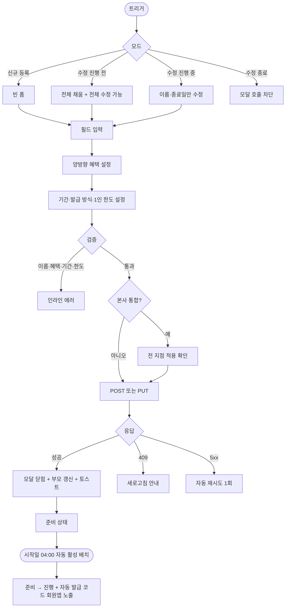
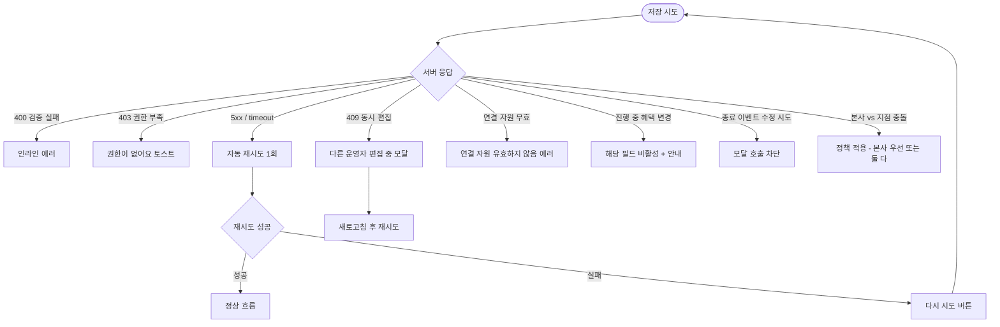

# DLG-077-001 리퍼럴 이벤트 등록 다이얼로그

## 1. 다이얼로그 메타 정보

이 문서는 리퍼럴 이벤트 등록 다이얼로그에 대한 자기완결형 요구사항 정의서입니다. 다른 문서를 함께 보지 않아도 이 문서 한 장만으로 모든 입력 필드, 검증 규칙, 권한 분기, 추천 코드 발급과 양방향 혜택 지급의 운영 정책, 그리고 부모 화면(SCR-077 리퍼럴 프로그램)과의 연결까지 전부 이해하고 구현할 수 있도록 작성합니다.

| 항목 | 값 |
|---|---|
| 작성일 | 2026-05-22 |
| 버전 | v1.0 |
| 상태 | 미구현 (UI 미연동) |
| 도메인 | D08 마케팅 |
| 다이얼로그 ID | DLG-077-001 |
| 다이얼로그명 | 리퍼럴 이벤트 등록 |
| 부모 화면 | SCR-077 리퍼럴 프로그램 |
| 트리거 | SCR-077 헤더 "+ 이벤트 등록" 버튼 / 행 [수정] 버튼(수정 모드) |
| 기능코드 | MKT-07 (리퍼럴 프로그램) |
| 계약코드 | MKT-07-02 (이벤트 등록), MKT-07-06 (자동 처리) |
| 계약 상태 | 계약 범위 본기능 (미구현) |
| 모달 유형 | 입력 폼 (생성/수정 겸용) |
| 평균 분량 | 6개 입력 영역 + 양방향 혜택 + 검증 |

## 2. 다이얼로그 목적과 사용 맥락

리퍼럴 이벤트 등록 다이얼로그는 기존 회원이 지인을 추천했을 때 추천인과 피추천인 양쪽에게 동시에 혜택을 지급하는 회원 추천(리퍼럴) 이벤트를 등록하거나 진행 전 이벤트를 수정하는 모달입니다. 운영자는 한 화면에서 이벤트명·추천인 혜택·피추천인 혜택·추천 코드 발급 방식·이벤트 기간·1인당 추천 한도를 동시에 설정해, 시작일이 도래하면 회원앱에 회원별 고유 추천 코드가 자동 발급되고 피추천인 등록 시 양방향 혜택이 자동으로 지급되도록 구성합니다.

운영 시나리오는 다양합니다. 매니저가 신년 캠페인에서 "추천인 5,000 마일리지 + 피추천인 10% 할인 쿠폰 + 1/1~3/31 + 1인 최대 5명"으로 등록하면, 회원앱이 자동으로 REF-회원ID-랜덤 형식의 코드를 발급하고, 피추천인이 등록 화면에서 코드를 입력하면 양방향 혜택이 자동 지급됩니다. 슈퍼관리자는 본사 통합 모드에서 전 지점에 적용되는 본사 통일 이벤트를 등록하기도 하고, 매니저는 오프라인 캠페인용으로 추천 코드 수동 발급 방식을 선택해 매니저가 회원에게 직접 코드를 부여하기도 합니다.

호출 트리거는 SCR-077 헤더의 "+ 이벤트 등록" 버튼(빈 폼 시작)과 행 [수정] 버튼(기존 값으로 채워진 상태로 시작)이며, 진행 중 이벤트의 혜택 종류·금액 변경은 차단되어 일부 필드만 활성화되고, 종료된 이벤트는 [수정] 버튼 자체가 비활성화되어 모달 호출이 차단됩니다.

## 3. 입력 필드 전체 정의

이벤트명은 필수 입력으로 1자 이상 50자 이하의 텍스트입니다. 비어 있거나 50자를 초과하면 인라인 에러가 표시되고 저장 버튼이 비활성화됩니다.

추천인 혜택 영역은 추천에 성공한 기존 회원에게 지급할 혜택을 설정하는 영역입니다. 혜택 종류는 마일리지·쿠폰·할인 중 하나 이상을 선택할 수 있으며, 마일리지를 선택하면 지급 포인트 수치 입력란이, 쿠폰을 선택하면 발급할 쿠폰을 SCR-073에서 선택하는 드롭다운이, 할인을 선택하면 할인율 또는 할인 금액 입력란이 표시됩니다. 다중 혜택을 동시에 선택할 수 있으며 최소 1개 혜택은 반드시 선택되어야 합니다.

피추천인 혜택 영역은 추천을 통해 신규 등록한 회원에게 지급할 혜택을 설정하는 영역으로, 입력 구조는 추천인 혜택과 동일하며 마찬가지로 최소 1개는 필수입니다.

추천 코드 발급 방식은 라디오 2종으로 자동 발급과 수동 발급 중 하나를 선택합니다. 자동을 선택하면 이벤트 시작일이 도래할 때 회원앱이 회원별 고유 코드(REF-회원ID-랜덤 형식, 영숫자 8~16자)를 자동 생성하고, 수동을 선택하면 매니저가 회원에게 직접 코드를 부여합니다. 수동 발급은 주로 오프라인 캠페인용입니다.

혜택 지급 시점 드롭다운은 피추천인 등록 완료 즉시 지급과 피추천인 첫 결제 완료 시점 지급 중 하나를 선택합니다. 등록 완료 즉시가 기본값이며, 첫 결제 시점을 선택하면 피추천인이 결제를 완료하기 전까지는 양방향 혜택이 모두 지급 대기 상태로 남습니다.

이벤트 기간은 시작일과 종료일 두 개의 날짜 선택기로 입력합니다. 시작일은 오늘 또는 미래 날짜만 허용되며 시작일이 종료일보다 늦으면 "시작일이 종료일보다 늦을 수 없습니다" 인라인 에러가 표시됩니다.

1인당 최대 추천 횟수는 정수 입력으로 기본값 5명입니다. 1 이상 100 이하만 허용되며 정책으로 본사가 다른 기본값을 지정할 수 있습니다. 한도에 도달한 추천인이 추가 추천을 시도하면 매칭이 차단됩니다.

본사 통합 이벤트 토글은 슈퍼관리자·본사 최고관리자에게만 표시되며 켜면 `hq_owned=true`로 저장되어 전 지점에 즉시 노출됩니다. 일반 지점 운영자에게는 이 토글이 보이지 않습니다.

모달 하단에는 강조 톤의 "저장" 버튼과 보조 톤의 "취소" 버튼이 있습니다.

## 4. 검증과 저장 흐름

저장 검증은 다음 순서로 진행됩니다. 이벤트명이 비어 있거나 50자를 초과하면 인라인 에러로 차단됩니다. 추천인 혜택 또는 피추천인 혜택 중 하나라도 모든 종류가 미선택이면 "최소 1개 혜택을 선택해주세요" 인라인 에러가 표시됩니다. 시작일이 종료일보다 늦으면 차단됩니다. 1인 한도가 1 미만이거나 100 초과면 차단됩니다. 마일리지 금액·쿠폰 선택·할인율 같은 세부 값이 비어 있으면 해당 필드 옆에 인라인 에러가 표시됩니다.

검증을 모두 통과하면 신규는 `POST /api/referrals`, 수정은 `PUT /api/referrals/:id`가 호출됩니다. 응답이 성공이면 모달이 닫히고 SCR-077 이벤트 목록이 갱신되며 "리퍼럴 이벤트를 등록했어요" 또는 "리퍼럴 이벤트를 수정했어요" 토스트가 우측 상단에 5초 동안 표시됩니다. 신규 등록은 준비 상태로 저장되며, 시작일이 도래하면 매일 새벽 4시 자동 활성 배치가 준비를 진행으로 전환하면서 자동 발급 방식인 경우 `POST /api/referrals/:id/issue-code`로 회원앱에 코드를 발급합니다.

수정 모드는 이벤트 상태에 따라 달라집니다. 진행 전 이벤트는 전체 필드 수정이 가능합니다. 진행 중 이벤트는 이벤트명과 종료일만 수정 가능하고 혜택 종류·금액·1인 한도·발급 방식은 모두 비활성화됩니다. 종료된 이벤트는 [수정] 버튼이 비활성화되어 모달이 열리지 않습니다.

취소·ESC·배경 클릭으로 모달을 닫을 때 변경 사항이 있으면 "변경 사항이 사라집니다. 닫으시겠습니까?" yes/no 확인이 추가로 표시되며, 변경 사항이 없으면 즉시 닫힙니다.

## 5. 권한별 동작

슈퍼관리자(superAdmin)와 본사 최고관리자(primary)는 모든 기능을 사용할 수 있으며 본사 통합 이벤트 토글이 표시됩니다. 본사 통합 이벤트로 등록하면 전 지점에 즉시 노출되고, 지점 운영자는 본사 이벤트를 조회만 할 수 있습니다.

센터장(owner)과 매니저(manager)는 자기 지점에 한정해서 이벤트를 등록·수정할 수 있습니다. 본사 통합 토글은 표시되지 않으며 `hq_owned=false`로 자동 저장됩니다.

FC(fc)·트레이너(trainer)·스태프(staff)·프런트(front)·읽기 전용(readonly)은 부모 화면 SCR-077 자체에 접근할 수 없으므로 이 모달도 호출되지 않습니다. 직접 URL이나 권한 우회로 모달에 도달한 경우 백엔드 응답이 403이 되어 "권한이 없어요" 토스트가 표시되고 변경이 적용되지 않습니다.

권한 차단 시도는 모두 감사 로그(SCR-097)에 기록되어 사후 추적이 가능합니다.

## 6. 호출 트리거와 부모 화면 변화

이 모달은 SCR-077의 헤더 "+ 이벤트 등록" 버튼을 누를 때 빈 폼으로 열리고, 이벤트 목록 행의 [수정] 버튼을 누를 때 기존 값으로 채워진 상태로 열립니다. [수정] 버튼은 이벤트 상태가 준비 또는 진행일 때만 활성화되며 종료 상태에서는 비활성화됩니다.

저장이 성공하면 부모 화면에서는 이벤트 목록이 즉시 갱신됩니다. 신규 등록 시 새 행이 목록 상단에 추가되고 상태 배지는 "준비"로 표시됩니다. 수정 시 해당 행이 새 값으로 갱신됩니다. 본사 통합 이벤트로 등록된 경우 모든 지점의 SCR-077에 즉시 노출됩니다.

저장 후 시작일에 자동 활성 배치(매일 04:00)가 돌면서 상태가 준비에서 진행으로 자동 전환되고, 자동 발급 방식인 경우 회원앱에 코드 발급이 시작됩니다. 종료일에는 자동 종료 배치가 상태를 진행에서 종료로 전환하면서 그레이스 기간(7~30일)이 시작됩니다.

## 7. 데이터 흐름과 외부 연동

저장 시 호출되는 API는 신규 등록의 `POST /api/referrals`와 수정의 `PUT /api/referrals/:id`입니다. 요청 본문에는 이벤트명, 추천인 혜택 객체(종류·금액), 피추천인 혜택 객체, 발급 방식, 지급 시점, 시작일, 종료일, 1인 한도, `hq_owned` 플래그가 포함됩니다.

시작일이 도래하면 자동 활성 배치(매일 04:00)가 상태를 진행으로 전환하면서 자동 발급 방식인 경우 `POST /api/referrals/:id/issue-code`를 호출해 회원앱에 회원별 고유 코드를 발급합니다. 발급된 코드는 회원앱의 추천 화면에서 회원이 카톡·SNS·문자로 공유할 수 있습니다.

피추천인이 등록 화면에서 추천 코드를 입력하면 `POST /api/referrals/match`가 호출되어 코드 유효성과 1인 한도, 휴면·블랙리스트 여부를 검증하고 매칭이 성공하면 `referral_match` 테이블에 추천인·피추천인·이벤트 매핑이 INSERT됩니다. 매칭 성공과 동시에 양방향 혜택이 자동 지급되며, 마일리지는 MKT-04 마일리지 API로, 쿠폰은 MKT-03 쿠폰 API로 발급됩니다. 지급 webhook이 실패하면 1분·5분·30분 간격으로 3회 자동 재시도되고 최종 실패 시 미지급 상태로 남아 운영자가 추천 이력에서 수동 지급할 수 있습니다.

저장 성공 시 감사 로그(SCR-097)에 actor_id, event_id, action=CREATE 또는 UPDATE, before/after, timestamp가 INSERT됩니다.

MKT-06 캠페인과 연동된 리퍼럴 이벤트는 캠페인 등록 다이얼로그(DLG-076-001)에서 연결 자원으로 선택되어 캠페인 통합 ROI에 합산됩니다.

부정 사용 감지 배치는 매시간 동일 IP 반복 매칭이나 비정상 패턴을 감지하면 해당 매칭을 보류 상태로 전환하고 운영자에게 알림을 발송합니다.

## 8. 예외 처리

이벤트명이 비었거나 50자를 초과하면 인라인 에러로 차단됩니다. 추천인 혜택 또는 피추천인 혜택이 미선택이면 인라인 에러로 차단됩니다. 시작일이 종료일보다 늦으면 인라인 에러가 표시됩니다. 1인 한도가 1 미만이거나 100 초과면 차단됩니다.

진행 중 이벤트에서 혜택 변경을 시도하면 해당 필드가 비활성화되어 변경 자체가 막히며, 별도 안내로 "진행 중 이벤트의 혜택 변경은 차단됩니다. 신규 이벤트 등록을 권유합니다"가 표시됩니다. 종료된 이벤트의 [수정] 버튼은 비활성화되어 모달 호출 자체가 차단됩니다.

본사 통합 이벤트와 지점 이벤트가 동시에 진행되는 경우 본사 우선 또는 둘 다 적용 중 운영 정책으로 결정됩니다.

동시 편집 충돌(409 optimistic lock)이 발생하면 "다른 운영자가 동시에 편집했어요" 모달이 표시되고 최신 데이터로 새로고침한 후 다시 시도하도록 안내됩니다.

연결된 쿠폰이 만료되었거나 삭제된 경우, 연결된 마일리지 규칙이 비활성화된 경우에는 "연결 자원이 유효하지 않습니다" 인라인 에러가 표시되고 저장이 차단됩니다.

네트워크 오류(5xx 또는 timeout)는 자동으로 1회 재시도되고, 그래도 실패하면 "다시 시도" 버튼이 표시됩니다.

법정 한도(추천 보상 누적 100만원/년) 도달 회원이 추천인으로 포함되어 있는 경우 매칭 시점에 자동 차단되며, 등록 모달 자체에서는 차단되지 않습니다.

가족 회원끼리의 추천은 정책에 따라 등록 시점에 허용 여부가 결정되어 매칭 시점에 적용됩니다.

## 9. 토스트와 확인 팝업

성공 토스트는 우측 상단에 녹색 계열로 5초 동안 표시됩니다. "리퍼럴 이벤트를 등록했어요", "리퍼럴 이벤트를 수정했어요" 같은 문구로 결과를 알려줍니다.

실패 토스트는 빨강 계열로 표시되며 "권한이 없어요", "혜택을 1개 이상 선택해주세요", "연결 자원이 유효하지 않습니다" 같은 문구와 함께 보조 액션 버튼이 따라옵니다.

확인 팝업은 변경 사항이 있는 모달을 닫으려고 할 때 "변경 사항이 사라집니다. 닫으시겠습니까?" yes/no가 표시됩니다.

본사 통합 이벤트로 저장하려는 경우 슈퍼관리자에게도 "전 지점에 적용됩니다. 계속하시겠습니까?" 추가 확인이 표시됩니다.

## 10. 사용 흐름 다이어그램

## 11. 에러와 예외 흐름

## 12. 디자인 요청사항

양방향 혜택 영역은 추천인 혜택과 피추천인 혜택이 시각적으로 좌우 또는 상하로 명확히 분리되어 표시되어야 합니다. 어느 쪽이 추천인이고 어느 쪽이 피추천인인지가 색상·아이콘으로 직관적으로 구분됩니다.

혜택 종류 선택(마일리지·쿠폰·할인)은 다중 체크박스로 표시되며 선택된 종류에 따라 세부 입력 필드가 아래에 동적으로 펼쳐집니다. 미선택 종류의 세부 입력 필드는 표시되지 않아 화면이 어지럽지 않게 유지됩니다.

추천 코드 발급 방식은 라디오 2종으로 자동·수동 차이가 짧은 보조 설명과 함께 표시됩니다.

이벤트 기간 날짜 선택기는 시작일·종료일이 가로로 나란히 배치되어 비교가 쉽도록 합니다.

본사 통합 이벤트 토글은 슈퍼관리자에게만 표시되며 켜졌을 때 "전 지점에 적용됩니다" 보조 안내가 강조 톤으로 함께 노출됩니다.

저장 버튼은 검증을 모두 통과했을 때만 강조 톤으로 활성화되며, 검증 실패 또는 변경 사항이 없는 경우 비활성화됩니다.

진행 중 이벤트의 비활성화된 필드는 회색 톤으로 표시되고 그 옆에 "진행 중에는 변경 불가" 보조 안내가 작은 글씨로 표시됩니다.

모바일에서는 풀스크린으로 전환되며 양방향 혜택 영역이 세로로 쌓이는 구조로 자동 재배치됩니다.

## 13. 운영 정책

리퍼럴 이벤트의 상태는 준비·진행·종료의 3종이며 시작일에 자동 활성 배치(매일 04:00)가 준비를 진행으로 전환하고, 종료일에 자동 종료 배치가 진행을 종료로 전환합니다. 종료 후 그레이스 기간(7~30일) 동안은 이미 발급된 추천 코드로 등록한 피추천인의 매칭이 정상 처리되며, 그레이스 기간이 경과하면 매칭이 차단됩니다.

추천 코드는 영숫자 8~16자이며 회원 ID나 이름 일부를 포함할 수 있습니다. 자동 발급은 회원앱이 시작일에 자동 생성하고, 수동 발급은 매니저가 회원에게 직접 부여합니다(오프라인 캠페인용).

양방향 혜택은 추천인과 피추천인 각각에게 마일리지·쿠폰·할인 중 하나 이상을 지급합니다. 두 쪽 모두 최소 1개 혜택이 필수이며, 다중 혜택을 동시에 지급할 수 있습니다. 지급 시점은 피추천인 등록 완료 즉시 또는 첫 결제 완료 시점 중 정책으로 선택합니다.

1인 추천 한도는 기본 5명이며 본사가 정책으로 변경할 수 있습니다. 한도에 도달한 추천인의 추가 매칭은 차단되며 "추천 한도 초과" 안내가 회원앱과 등록 화면에 표시됩니다.

본인 추천 차단, 휴면·블랙리스트 회원 차단, 가족 회원 추천 차단(MBR-EXT-02, 정책에 따라), 기존 회원 피추천 차단(재등록 회원은 정책에 따라)은 매칭 시점에 자동 적용됩니다.

부정 사용 감지는 동일 IP 반복 매칭이나 비정상 패턴을 매시간 배치로 감지하며 의심 매칭은 보류 상태로 전환되고 운영자에게 알림이 발송됩니다.

법정 한도는 추천 보상 누적 100만원/년으로 세무 의무에 따른 정책입니다. 한도 도달 시 추가 지급이 차단되며 매일 04:00 모니터링 배치가 누적 금액을 집계합니다.

진행 중 이벤트의 혜택 종류·금액 변경은 차단되며 신규 이벤트 등록을 권유합니다. 이벤트 삭제 정책은 진행 전은 hard delete, 진행 중·종료는 soft delete(이력 보존)입니다. 추천 이력은 이벤트 종료 후에도 영구 보존되어 분석·세무 의무에 사용됩니다.

본사 통합 이벤트는 슈퍼관리자가 전 지점에 일괄 등록하며 `hq_owned=true`로 저장되어 지점 이벤트와 동시 운영 시 본사 우선 또는 둘 다 적용 중 정책으로 결정됩니다.

회원 탈퇴 시 추천 이력은 보존되며 미지급 혜택은 소멸합니다. 회원 병합(MBR-EXT-01) 시 부 계정의 추천 이력은 주 계정으로 합산됩니다.

감사 로그는 등록·수정·삭제·매칭·혜택 지급·미지급 사유까지 모두 SCR-097에 비동기로 INSERT되며 5초 안에 조회 가능해야 합니다. actor_id, event_id, match_id, action, before, after, reason, timestamp가 기록됩니다.

권한 정책은 슈퍼관리자·본사·센터장·매니저까지 등록·수정·삭제·실적 조회가 가능하며 FC·트레이너·스태프·프런트·readonly는 부모 화면 진입 자체가 차단됩니다.
