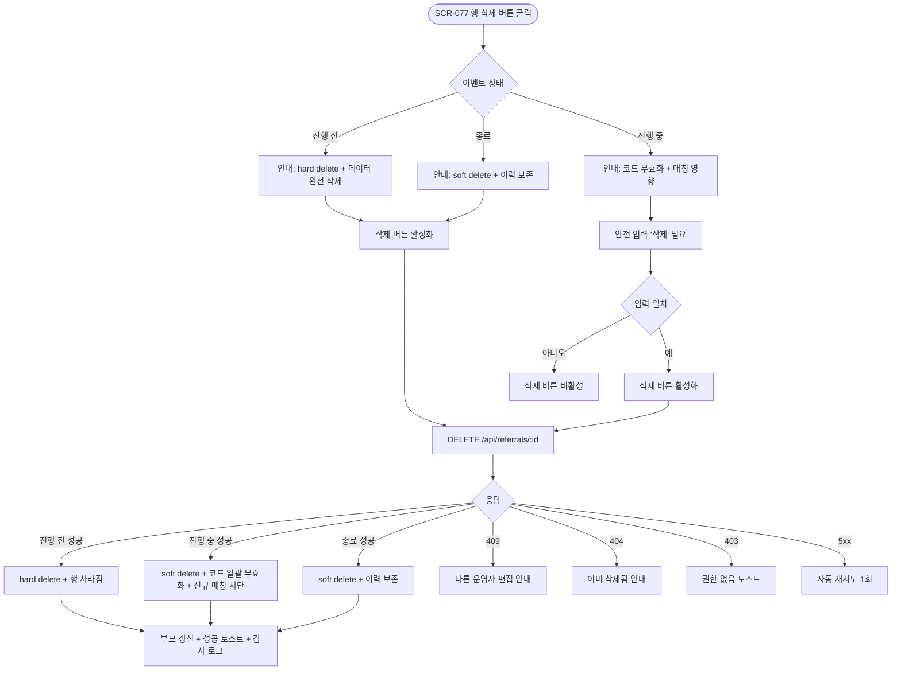
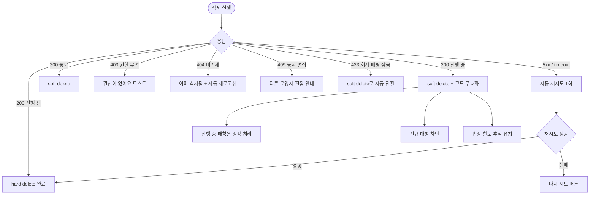

# DLG-077-002 리퍼럴 이벤트 삭제 다이얼로그

## 1. 다이얼로그 메타 정보

이 문서는 리퍼럴 이벤트 삭제 다이얼로그에 대한 자기완결형 요구사항 정의서입니다. 다른 문서를 함께 보지 않아도 이 문서 한 장만으로 이벤트 삭제 시 추천 코드 무효화, 진행 중 매칭 처리, 발급된 혜택 회수 여부, 감사 로그 기록, 권한 분기까지 전부 이해하고 구현할 수 있도록 작성합니다.

| 항목 | 값 |
|---|---|
| 작성일 | 2026-05-22 |
| 버전 | v1.0 |
| 상태 | 미구현 (UI 미연동) |
| 도메인 | D08 마케팅 |
| 다이얼로그 ID | DLG-077-002 |
| 다이얼로그명 | 리퍼럴 이벤트 삭제 |
| 부모 화면 | SCR-077 리퍼럴 프로그램 |
| 트리거 | SCR-077 이벤트 목록 행 [삭제] 버튼 |
| 기능코드 | MKT-07 (리퍼럴 프로그램) |
| 계약코드 | MKT-07-05 (이벤트 삭제) |
| 계약 상태 | 계약 범위 본기능 (미구현) |
| 모달 유형 | 확인 (위험 액션) |
| 평균 분량 | 안내 메시지 + 진행 중 매칭 요약 + 확인 입력 |

## 2. 다이얼로그 목적과 사용 맥락

리퍼럴 이벤트 삭제 다이얼로그는 리퍼럴 이벤트를 삭제하기 전에 의도하지 않은 변경을 막기 위해 최종 확인을 받는 모달입니다. 이벤트를 삭제하면 발급된 추천 코드가 모두 무효화되고 진행 중인 매칭이 영향을 받기 때문에, 부주의한 클릭으로 데이터를 잃지 않도록 안전 장치를 제공합니다.

운영 시나리오는 두 가지로 분기됩니다. 진행 전 이벤트는 추천 코드가 아직 발급되지 않았으므로 hard delete로 데이터 자체가 즉시 삭제됩니다. 진행 중 또는 종료된 이벤트는 추천 이력이 분석·세무 의무에 따라 영구 보존되어야 하므로 soft delete로 `deleted_at` 타임스탬프만 기록되고 데이터 본체는 유지됩니다.

호출 트리거는 SCR-077 이벤트 목록 행의 [삭제] 버튼이며 권한이 부족한 계정에서는 이 버튼이 아예 표시되지 않습니다. 진행 중 이벤트의 [삭제] 버튼은 표시되지만 클릭하면 "진행 중 이벤트 삭제 시 발급된 추천 코드가 즉시 무효화됩니다" 추가 경고가 모달 상단에 표시됩니다.

## 3. 입력 필드와 안내 메시지

모달 상단에는 "리퍼럴 이벤트 삭제"라는 제목과 함께 위험 아이콘이 표시됩니다. 그 아래에 삭제 대상 이벤트의 이름과 상태(준비·진행·종료)가 한 줄로 표시되며, 상태에 따라 안내 메시지가 다르게 출력됩니다.

진행 전 상태일 때는 "이 이벤트를 삭제하시겠습니까? 아직 추천 코드가 발급되지 않아 데이터가 완전히 삭제됩니다"라는 안내가 표시됩니다.

진행 중 상태일 때는 "이 이벤트를 삭제하시겠습니까? 삭제 시 발급된 추천 코드가 모두 무효화되며, 진행 중인 매칭은 정상 처리되지만 신규 매칭은 차단됩니다. 추천 이력은 영구 보존됩니다"라는 안내가 표시되고, 그 아래에 영향 받는 항목이 카드 형태로 나열됩니다. 진행 중 매칭 건수, 발급된 추천 코드 수, 이미 지급된 혜택 합계가 카운트로 표시됩니다.

종료 상태일 때는 "이 이벤트를 삭제하시겠습니까? 추천 이력은 영구 보존되며 목록에서만 숨겨집니다(soft delete)"라는 안내가 표시됩니다.

진행 중 이벤트 삭제의 경우 안전 장치로 사용자가 직접 "삭제"라는 단어를 텍스트 박스에 입력해야 [삭제] 버튼이 활성화됩니다. 진행 전과 종료 이벤트는 텍스트 입력 없이 [삭제] 버튼이 바로 활성화됩니다.

모달 하단에는 빨강 톤의 위험 액션 [삭제] 버튼과 기본 톤의 [취소] 버튼이 있습니다.

## 4. 검증과 처리 흐름

[삭제] 버튼을 누르면 모달이 로딩 상태로 전환되어 주요 버튼이 모두 비활성화되고 백엔드에 `DELETE /api/referrals/:id` 요청이 전송됩니다.

진행 전 이벤트는 응답 즉시 데이터가 hard delete되어 데이터베이스에서 완전히 제거됩니다. 진행 중·종료 이벤트는 soft delete로 `deleted_at` 컬럼에 타임스탬프만 기록되고 데이터 본체는 추천 이력·실적 분석을 위해 보존됩니다.

진행 중 이벤트 삭제의 경우 후속 처리가 함께 진행됩니다. 발급된 추천 코드는 모두 무효화 상태로 전환되어 회원앱에서 더 이상 표시되지 않으며, 회원이 그 코드로 매칭을 시도하면 "유효하지 않은 추천 코드입니다" 안내가 표시됩니다. 이미 매칭된 추천은 정상 처리되어 양방향 혜택이 약속대로 지급되며, 신규 매칭만 차단됩니다.

성공 시 모달이 닫히고 SCR-077 이벤트 목록이 즉시 갱신되며 "리퍼럴 이벤트를 삭제했어요" 토스트가 표시됩니다. 진행 중·종료 이벤트는 목록에서 사라지지만 "삭제된 이벤트 보기" 토글이 켜진 상태에서는 별도 섹션에 회색 톤으로 노출됩니다.

[취소] 버튼이나 ESC·배경 클릭으로 모달을 닫으면 변경 없이 즉시 닫힙니다. 단, 안전 장치용 텍스트 입력이 진행 중인 경우에도 별도 확인 없이 즉시 닫힙니다(어차피 삭제가 실행되지 않은 상태이므로).

## 5. 권한별 동작

슈퍼관리자(superAdmin)와 본사 최고관리자(primary)는 모든 이벤트(본사 통합 포함)를 삭제할 수 있습니다.

Owner(지점장)과 매니저(manager)는 자기 지점에서 등록된 이벤트만 삭제할 수 있습니다. 본사 통합 이벤트는 조회만 가능하며 [삭제] 버튼이 비활성화되거나 표시되지 않습니다.

FC(fc)·트레이너(trainer)·스태프(staff)·프런트(front)·읽기 전용(readonly)은 부모 화면 SCR-077 자체에 접근할 수 없으므로 이 모달도 호출되지 않습니다. 직접 URL이나 권한 우회로 호출된 경우 백엔드 응답이 403이 되어 "권한이 없어요" 토스트가 표시됩니다.

권한 차단 시도는 모두 감사 로그(SCR-097)에 기록됩니다.

## 6. 호출 트리거와 부모 화면 변화

이 모달은 SCR-077 이벤트 목록 행의 [삭제] 버튼을 눌렀을 때 호출됩니다. 행에 표시된 이벤트 정보(이름·상태·기간·참여 수)가 모달의 상단 컨텍스트로 그대로 표시됩니다.

삭제가 성공하면 부모 화면에서는 다음 변화가 즉시 일어납니다. 진행 전 이벤트는 목록에서 해당 행이 완전히 사라집니다. 진행 중·종료 이벤트는 기본 목록에서 사라지지만 "삭제된 이벤트 보기" 토글이 켜진 상태에서는 회색 톤으로 별도 섹션에 노출되어 추천 이력 분석 시 참고할 수 있습니다.

본사 통합 이벤트가 본사 권한자에 의해 삭제되면 전 지점의 SCR-077 목록에서 동시에 사라집니다.

## 7. 데이터 흐름과 외부 연동

삭제 시 호출되는 API는 `DELETE /api/referrals/:id`입니다. 백엔드는 이벤트 상태에 따라 hard delete 또는 soft delete를 분기하며, 진행 중 이벤트인 경우 발급된 추천 코드를 일괄 무효화하는 후속 처리를 트랜잭션으로 함께 실행합니다.

성공 시 감사 로그(SCR-097)에 actor_id, event_id, action=DELETE, deletion_type(hard 또는 soft), affected_codes_count, affected_matches_count, timestamp가 비동기로 INSERT됩니다.

진행 중 이벤트 삭제로 무효화된 추천 코드는 회원앱과 등록 화면에 즉시 반영되며, 회원이 무효 코드로 매칭을 시도하면 즉시 차단됩니다.

이미 매칭된 추천 건은 보존되며 약속된 양방향 혜택이 정상 지급됩니다. 마일리지(MKT-04)·쿠폰(MKT-03) 지급 webhook은 이벤트 삭제와 무관하게 진행됩니다.

이벤트 종료 후 90일이 경과한 추천 이력은 아카이브 테이블로 이동되며 운영 화면에서는 노출되지 않지만 분석·세무 의무를 위해 영구 보존됩니다.

MKT-06 캠페인과 연결되어 있던 이벤트가 삭제되면 캠페인의 연결 자원이 비어 있는 상태로 표시되며 캠페인 운영자에게 "연결된 리퍼럴 이벤트가 삭제되었습니다" 알림이 전송됩니다.

## 8. 예외 처리

진행 중 이벤트 삭제 시 안전 장치용 "삭제" 텍스트를 입력하지 않으면 [삭제] 버튼이 비활성화되어 클릭이 불가능합니다.

권한이 부족한 계정에서는 [삭제] 버튼 자체가 부모 화면에 표시되지 않습니다. 권한 우회 시도가 백엔드에 도달하면 403 응답과 함께 "권한이 없어요" 토스트가 표시되고 삭제가 실행되지 않습니다.

동시 편집 충돌(409 optimistic lock)이 발생하면 "다른 운영자가 이미 이 이벤트를 수정했어요. 새로고침 후 다시 시도해주세요" 모달이 표시됩니다.

이벤트 ID가 존재하지 않거나 이미 삭제된 경우(404) "이미 삭제된 이벤트입니다" 안내가 표시되고 모달이 자동으로 닫히면서 부모 목록이 새로고침됩니다.

네트워크 오류(5xx 또는 timeout)는 자동으로 1회 재시도되고, 그래도 실패하면 모달에 "다시 시도" 버튼이 표시됩니다.

본사 통합 이벤트를 일반 지점 운영자가 삭제하려고 시도하면 [삭제] 버튼이 비활성화되어 있어 클릭 자체가 차단됩니다. 권한 우회 시 403 응답으로 차단됩니다.

진행 중 매칭이 webhook 재시도 중인 상태에서 이벤트가 삭제되면 진행 중인 webhook은 정상 완료되며 신규 webhook 트리거만 차단됩니다.

법정 한도 추적이나 회계 정산에 사용 중인 이벤트는 soft delete만 가능하며 hard delete는 차단됩니다(진행 전 이벤트라도 회계 매핑이 존재하면 soft delete로 전환).

## 9. 토스트와 확인 팝업

성공 토스트는 우측 상단에 녹색 계열로 5초 동안 "리퍼럴 이벤트를 삭제했어요" 문구로 표시됩니다.

실패 토스트는 빨강 계열로 "권한이 없어요", "이미 삭제된 이벤트입니다", "삭제 처리 중 오류가 발생했어요" 같은 문구가 표시되며 "다시 시도" 보조 액션 버튼이 따라옵니다.

진행 중 이벤트 삭제 시 안전 장치 텍스트 입력 칸 옆에 "삭제하려면 '삭제'를 입력해주세요" 보조 안내가 회색 톤으로 표시됩니다.

확인 팝업은 별도로 표시되지 않습니다. 모달 자체가 확인 모달이기 때문입니다.

## 10. 사용 흐름 다이어그램

## 11. 에러와 예외 흐름

## 12. 디자인 요청사항

위험 액션 모달이므로 [삭제] 버튼은 빨강 톤의 위험 색상으로 강조되며, [취소] 버튼은 기본 톤의 보조 색상으로 표시됩니다. 두 버튼의 시각적 위계가 명확해야 사용자가 실수로 [삭제]를 누르지 않도록 합니다.

모달 상단에는 경고 아이콘(삼각형 + 느낌표)이 빨강 또는 주황 톤으로 표시되어 위험 액션임을 즉시 알 수 있어야 합니다.

진행 중 이벤트 삭제의 영향 카드(진행 중 매칭·발급 코드 수·지급 혜택 합계)는 카운트가 큰 폰트로 강조되어 사용자가 영향 범위를 한눈에 파악할 수 있어야 합니다.

안전 장치 텍스트 입력은 일반 입력 필드보다 조금 더 넓은 폭으로 표시되며 플레이스홀더에 "삭제"를 입력하라는 안내가 회색 톤으로 표시됩니다.

상태별 안내 메시지 톤은 진행 전은 일반 톤, 진행 중은 주의 톤, 종료는 안정 톤으로 시각적으로 분기됩니다.

모바일에서는 풀스크린으로 전환되며 [삭제]·[취소] 버튼이 화면 하단에 가로로 배치됩니다.

## 13. 운영 정책

리퍼럴 이벤트 삭제 정책은 상태에 따라 분기됩니다. 진행 전 이벤트는 hard delete로 데이터베이스에서 완전히 제거되며, 진행 중·종료 이벤트는 soft delete로 `deleted_at` 타임스탬프만 기록되고 추천 이력과 매칭 데이터는 영구 보존됩니다.

진행 중 이벤트 삭제 시 발급된 추천 코드는 즉시 무효화되며, 회원이 무효 코드로 매칭을 시도하면 "유효하지 않은 추천 코드입니다" 안내가 표시되어 차단됩니다. 이미 매칭된 추천 건은 약속된 양방향 혜택이 정상 지급되어 회원과의 신뢰를 유지합니다.

추천 이력 영구 보존 정책은 이벤트 종료 후 90일이 경과하면 아카이브 테이블로 이동되며, 분석·세무 의무에 사용되기 위해 영구 보존됩니다. 법정 한도(추천 보상 누적 100만원/년) 추적은 이벤트 삭제와 무관하게 유지됩니다.

회계 매핑이 존재하는 이벤트는 hard delete가 차단되고 진행 전이라도 자동으로 soft delete로 전환됩니다. 이는 회계 정산 무결성을 보장하기 위한 정책입니다.

MKT-06 캠페인과 연결된 이벤트가 삭제되면 캠페인의 연결 자원이 비어 있는 상태로 표시되며 캠페인 운영자에게 알림이 전송됩니다. 캠페인은 다른 리퍼럴 이벤트로 재연결하거나 그대로 진행할 수 있습니다.

본사 통합 이벤트는 슈퍼관리자·본사 최고관리자만 삭제할 수 있으며 일반 지점 운영자는 본사 통합 이벤트를 조회만 가능하고 삭제할 수 없습니다. 본사 통합 이벤트 삭제는 전 지점에 즉시 반영됩니다.

권한 정책은 슈퍼관리자·본사·Owner(지점장)·매니저까지 삭제가 가능하며, 자기 지점에서 등록된 이벤트만 삭제할 수 있습니다. FC·트레이너·스태프·프런트·readonly는 부모 화면 진입 자체가 차단됩니다.

감사 로그는 삭제 액션을 actor_id, event_id, action=DELETE, deletion_type(hard 또는 soft), affected_codes_count(무효화된 코드 수), affected_matches_count(영향 받은 매칭 수), timestamp로 비동기 INSERT하며 5초 안에 SCR-097에서 조회 가능해야 합니다. 권한 우회 시도와 차단 이벤트도 모두 기록됩니다.

회원 탈퇴와 회원 병합(MBR-EXT-01) 시 추천 이력 처리는 이벤트 삭제와 별도 정책으로 운영됩니다. 회원 탈퇴 시 미지급 혜택은 소멸하고 이력은 보존되며, 회원 병합 시 부 계정 추천 이력은 주 계정으로 합산됩니다.
