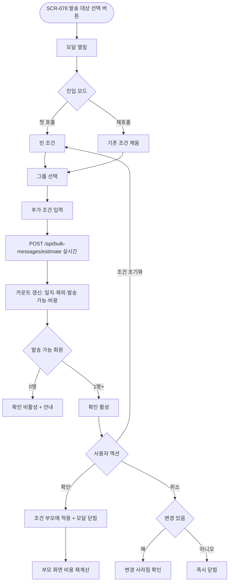
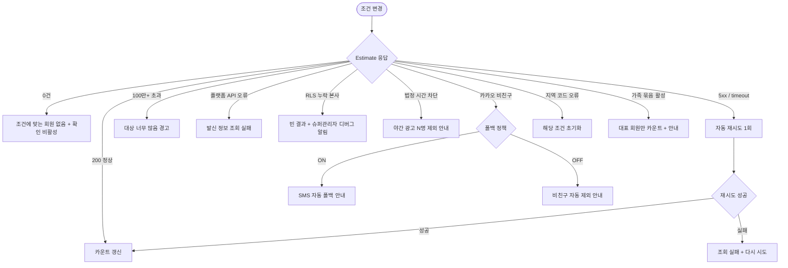

# DLG-078-001 발송 대상 선택 다이얼로그

## 1. 다이얼로그 메타 정보

이 문서는 SMS/카카오 대량 발송의 발송 대상 선택 다이얼로그에 대한 자기완결형 요구사항 정의서입니다. 다른 문서를 함께 보지 않아도 이 문서 한 장만으로 그룹·세부 조건 선택, 예상 수신자 수 실시간 계산, 수신 거부·휴면 자동 제외, 권한 분기, 발송 채널 폴백 정책까지 전부 이해하고 구현할 수 있도록 작성합니다.

| 항목 | 값 |
|---|---|
| 작성일 | 2026-05-22 |
| 버전 | v1.0 |
| 상태 | 미구현 (UI 미연동) |
| 도메인 | D08 마케팅 |
| 다이얼로그 ID | DLG-078-001 |
| 다이얼로그명 | 발송 대상 선택 |
| 부모 화면 | SCR-078 SMS/카카오 발송 |
| 트리거 | SCR-078 "발송 대상 선택" 버튼 / 발송 대상 변경 시 재호출 |
| 기능코드 | MKT-08 (SMS/카카오 대량 발송) |
| 계약코드 | MKT-08-02 (발송 대상 선택), MKT-EXT-03 (플랫폼 연동) |
| 계약 상태 | 계약 범위 본기능 (미구현) |
| 모달 유형 | 다중 조건 선택 (대상 필터링) |
| 평균 분량 | 그룹 라디오 + 다중 조건 + 실시간 카운트 |

## 2. 다이얼로그 목적과 사용 맥락

발송 대상 선택 다이얼로그는 SMS/LMS/MMS/카카오 알림톡을 대량 발송하기 전에 발송 대상 회원 그룹을 조건별로 선별하는 모달입니다. 전체 회원 대상 무차별 발송이 아닌 세분화된 조건으로 적합한 수신자만 선별해 발송 비용을 절약하고 메시지 도달 효율을 높이는 것이 목적입니다.

운영 시나리오는 매우 다양합니다. 매니저가 신년 인사를 위해 전체 활성 회원 5만 명에게 알림톡을 발송하거나, VIP 한정 캠페인으로 VIP 등급 회원만 추리거나, 만료 회원 재등록 권유로 만료 상태 회원에게 7일 한정 쿠폰 안내를 발송하거나, 서울 강남구 지점 인근 회원에게 지역 한정 이벤트를 발송하거나, 가입 30일 이상의 충성 회원만 따로 케어하는 식으로 사용됩니다. 슈퍼관리자는 본사 통합 모드에서 전 지점 활성 회원을 합산해 본사 통일 메시지를 발송하기도 합니다.

호출 트리거는 SCR-078의 "발송 대상 선택" 버튼이며, 발송 대상이 변경되면 같은 모달이 재호출되어 기존 조건이 채워진 상태로 열립니다. 발송 대상 조건이 변경되면 SCR-078의 예상 비용·플랫폼 잔여 캐시 영향도 실시간으로 재계산됩니다.

## 3. 입력 필드 전체 정의

그룹 선택 라디오는 사전 정의된 5개 그룹 중 하나를 선택합니다. 전체 회원은 탈퇴·삭제 제외한 모든 회원, 활성 회원은 status=active 상태인 회원, 만료 회원은 이용권이 만료된 회원, 특정 등급 회원은 VIP·일반·신규 중 추가 드롭다운으로 등급을 고르는 그룹, 장기 미방문 회원은 마지막 방문일이 30일 이상 지난 회원입니다. 그룹을 선택하면 해당 그룹에 해당하는 회원 수가 즉시 카운트로 표시됩니다.

추가 조건 필터 영역은 그룹 선택과 AND 조건으로 결합되어 더 세분화된 대상을 선별합니다. 성별 다중 체크박스(남성·여성·기타·미입력), 연령대 다중 체크박스(10대·20대·30대·40대·50대·60대+), 이용권 유형 다중 체크박스(정기권·PT·골프·락커·운동복), 마지막 방문일 범위(시작일·종료일 날짜 선택기), 지역 시·구 다중 선택, 가입 기간 드롭다운(7일+·30일+·90일+·1년+) 같은 조건이 펼쳐집니다. 각 조건은 선택하지 않으면 모든 값을 포함하는 것으로 간주됩니다.

예상 수신자 수 영역은 모달 상단 또는 우측에 강조 톤으로 표시되며 조건이 변경될 때마다 실시간으로 업데이트됩니다. 단순 회원 수뿐 아니라 수신 거부 제외 후·휴면 제외 후·법정 시간 차단 회원 제외 후의 실제 발송 가능 회원 수가 카운트로 분리되어 표시됩니다. 예를 들어 "조건 일치 1,234명 / 수신 거부 -45명 / 휴면 -23명 / 실제 발송 1,166명" 같은 형식으로 표시됩니다.

카카오 알림톡 채널 선택 시 비친구 수가 추가로 표시되며 SMS 자동 폴백 정책이 활성화되어 있으면 "비친구 89명은 SMS로 자동 폴백됩니다" 안내가 보조 톤으로 표시되고, 폴백 정책이 비활성화되어 있으면 "비친구 89명은 자동 제외됩니다" 안내로 표시됩니다.

본사 통합 모드 토글은 superAdmin·primary에게만 표시되며, 켜면 모든 지점의 회원이 합산되어 카운트되고 발송 시 각 회원의 실제 `branchId` 기준으로 분산 처리됩니다.

모달 하단에는 강조 톤의 "확인" 버튼과 보조 톤의 "취소" 버튼이 있습니다. 발송 가능 회원이 0명이면 "확인" 버튼이 비활성화됩니다.

## 4. 검증과 적용 흐름

조건 변경 검증은 실시간으로 진행됩니다. 각 조건이 변경될 때마다 `POST /api/bulk-messages/estimate`가 호출되어 예상 수신자 수와 자동 제외 수, 예상 비용이 즉시 갱신됩니다. 검증 결과로 발송 가능 회원이 0명이면 "조건에 맞는 회원이 없습니다" 안내가 표시되고 "확인" 버튼이 비활성화됩니다.

"확인" 버튼을 누르면 선택된 조건이 부모 화면 SCR-078의 발송 폼에 적용되고 모달이 닫힙니다. 부모 화면에서는 발송 대상 영역에 "전체 활성 회원 + 30대·40대 + 서울 강남구 (실제 발송 1,166명)" 같은 요약이 칩 형태로 표시되고, 이미 작성된 메시지·발송 시점·채널 선택과 결합되어 발송 비용이 재계산됩니다.

"취소" 버튼·ESC·배경 클릭으로 모달을 닫으면 변경 사항이 부모 화면에 적용되지 않고 이전 상태가 유지됩니다. 단, 변경 사항이 있는 상태에서 닫으면 "변경 사항이 사라집니다. 닫으시겠습니까?" yes/no 확인이 추가로 표시됩니다.

조건을 모두 초기화하려면 모달 하단의 "조건 초기화" 링크를 누르며 별도 확인 없이 즉시 초기 상태로 복원됩니다.

## 5. 권한별 동작

superAdmin와 primary는 모든 조건을 사용할 수 있으며 본사 통합 모드 토글이 표시됩니다. 통합 모드에서는 전 지점의 회원이 합산되어 카운트됩니다.

Owner(지점장)과 매니저(manager)는 자기 지점에 한정해서 발송 대상을 선택할 수 있습니다. 본사 통합 모드 토글은 표시되지 않으며 모든 카운트는 자기 지점 회원에 한정됩니다.

FC(fc)·트레이너(trainer)·스태프(staff)·프런트(front)·읽기 전용(readonly)은 부모 화면 SCR-078 자체에 접근할 수 없으므로 이 모달도 호출되지 않습니다. 직접 URL로 접근하면 부모 화면이 접근 제한 화면을 표시하면서 대시보드로 자동 이동합니다.

권한이 부족한 계정이 권한 우회로 모달을 호출한 경우 백엔드 응답이 403이 되어 "권한이 없어요" 토스트가 표시되고 카운트가 0으로 고정됩니다.

## 6. 호출 트리거와 부모 화면 변화

이 모달은 SCR-078의 "발송 대상 선택" 버튼을 누를 때 처음 호출됩니다. 발송 대상이 이미 선택된 상태에서 다시 변경하려면 같은 버튼을 누르면 기존 조건이 채워진 상태로 모달이 다시 열립니다.

조건이 확정되어 모달이 닫히면 부모 화면 SCR-078의 발송 대상 영역에 선택된 조건이 칩 형태로 요약 표시됩니다. 칩에는 그룹명·추가 조건·실제 발송 가능 인원이 포함되며, 칩 옆의 X 버튼을 누르면 조건이 초기화되어 모달이 다시 열립니다.

발송 대상 변경은 부모 화면의 예상 비용·플랫폼 잔여 캐시 영향에도 즉시 반영됩니다. 예상 비용은 채널별 단가(SMS·LMS·MMS·알림톡)와 실제 발송 가능 인원의 곱으로 계산되며, 카카오→SMS 폴백이 활성화된 경우 비친구 수만큼 SMS 단가가 추가로 합산됩니다.

부모 화면의 "발송" 버튼은 발송 가능 회원이 1명 이상이고 메시지가 작성되어 있고 채널이 선택되어 있고 플랫폼 잔여 캐시가 예상 비용보다 클 때만 활성화됩니다.

## 7. 데이터 흐름과 외부 연동

조건 변경 시 실시간으로 호출되는 API는 `POST /api/bulk-messages/estimate`이며, 요청 본문에는 그룹 코드, 추가 조건 객체, 채널 선택 정보가 포함됩니다. 응답으로는 조건 일치 회원 수, 수신 거부 제외 수, 휴면 제외 수, 법정 시간 차단 수, 비친구 수(카카오 선택 시), 실제 발송 가능 회원 수, 예상 비용이 내려옵니다.

예상 비용 계산은 메시지 플랫폼(NHN·Toast)의 단가 API를 기반으로 합니다. 플랫폼 단가가 변경되면 즉시 반영되며 모달 상단에 "최근 동기화: 5분 전" 같은 형식으로 데이터 신선도가 표시됩니다.

본사 통합 모드에서는 모든 지점의 회원이 합산되며 `branchId` 파라미터가 빠지거나 `all`로 전달됩니다. 일반 지점 모드에서는 사용자 소속 `branchId`가 강제 적용되어 RLS로 다른 지점 회원이 노출되지 않습니다.

수신 거부 동기화는 회원 상태 변경 webhook으로 실시간 반영되며, 휴면 회원 자동 제외도 회원 상태와 동기화됩니다. 카카오 비친구 여부는 카카오 알림톡 API 응답을 기반으로 매번 새로 조회됩니다.

조건 변경 액션은 감사 로그(SCR-097)에 직접 INSERT되지는 않지만, 최종 발송이 확정될 때 그 시점의 발송 대상 조건이 함께 기록되어 추적됩니다.

## 8. 예외 처리

조건에 맞는 회원이 0명이면 "조건에 맞는 회원이 없습니다" 안내가 표시되고 "확인" 버튼이 비활성화됩니다. 사용자는 조건을 완화하거나 그룹을 변경해야 합니다.

수신 거부와 휴면 회원이 자동 제외되어 실제 발송 가능 회원이 0명이 되는 경우에도 동일하게 차단됩니다.

플랫폼 메타데이터 조회 실패(NHN·Toast API 오류) 시 "발신 정보·예상 비용을 불러오지 못했습니다" 인라인 에러가 표시되며 사용자는 재조회 버튼을 누르거나 잠시 후 다시 시도해야 합니다.

조건 추정 API가 시간 초과되거나 5xx 응답을 받으면 자동으로 1회 재시도되고, 그래도 실패하면 카운트 영역에 "조회 실패. 다시 시도" 안내가 표시됩니다.

조건이 너무 광범위해서 추정 결과가 100만 명을 초과하면 "발송 대상이 너무 많아요. 조건을 좁혀주세요" 경고가 표시됩니다. 운영 관행상 단일 발송은 50만 명을 권장 한도로 합니다.

본사 통합 모드에서 RLS 누락이 감지되면 보안상 빈 결과가 반환되며, 슈퍼관리자에게만 디버그 로그와 알림 센터를 통해 누락 사실이 전달됩니다.

법정 시간(영업·광고성 21~08시) 차단 정책에 해당하는 회원이 다수 포함되어 있으면 "야간 광고 발송 차단으로 N명 제외" 안내가 카운트 영역에 표시됩니다. 정보성(결제·환불) 메시지는 예외 처리됩니다.

지역 조건에서 시·구가 마스터 데이터와 불일치하는 경우 "지역 코드 오류" 인라인 에러가 표시되고 해당 조건이 초기화됩니다.

가족 묶음 옵션(MBR-EXT-02)이 활성화된 경우 가족 그룹당 대표 회원 1명에게만 카운트되어 표시되며 보조 안내로 "가족 묶음 적용: 총 N가구 → N가구 대표 회원만"이 표시됩니다.

## 9. 토스트와 확인 팝업

성공 토스트는 별도 표시되지 않습니다. 모달이 닫히면서 부모 화면의 발송 대상 영역이 갱신되는 것이 곧 성공 신호입니다.

실패 토스트는 빨강 계열로 "권한이 없어요", "조건 조회 실패", "플랫폼 메타데이터 조회 실패" 같은 문구가 표시되며 보조 액션 버튼이 따라옵니다.

확인 팝업은 변경 사항이 있는 모달을 닫으려고 할 때 "변경 사항이 사라집니다. 닫으시겠습니까?" yes/no가 표시되고, "조건 초기화" 링크를 누를 때는 별도 확인 없이 즉시 초기화됩니다.

조건이 너무 광범위하거나 위험 신호(100만 명 초과 등)가 있으면 "확인" 버튼을 누르는 시점에 "정말 이 대상에게 발송할까요?" 추가 확인이 표시됩니다.

## 10. 사용 흐름 다이어그램

## 11. 에러와 예외 흐름

## 12. 디자인 요청사항

예상 수신자 수 영역은 모달 상단 또는 우측에 가장 강조된 톤으로 표시되어야 합니다. 단순 회원 수뿐 아니라 자동 제외(수신 거부·휴면·법정 시간)와 실제 발송 가능 인원이 명확히 분리되어 시각화되어야 운영자가 비용을 정확히 가늠할 수 있습니다.

그룹 선택 라디오와 추가 조건 영역은 시각적으로 분리되어 표시됩니다. 그룹은 1차 선택이고 추가 조건은 보조 선택임이 색상·여백으로 구분됩니다.

추가 조건 필터는 접힌 카드 형태로 시작되며 사용자가 펼쳤을 때 세부 옵션이 노출됩니다. 모든 조건을 한 번에 펼치면 화면이 어지러우므로 점진적 노출(progressive disclosure)을 사용합니다.

카카오 알림톡 비친구 안내와 SMS 자동 폴백 안내는 보조 톤(파란 또는 회색)으로 표시되어 정보 전달임을 분명히 합니다.

본사 통합 모드 토글은 슈퍼관리자에게만 표시되며 켜졌을 때 "전 지점 회원 합산" 보조 안내가 강조 톤으로 함께 노출됩니다.

발송 가능 회원이 0명이거나 100만 명을 초과할 때는 카운트 영역의 색상이 경고 톤(빨강·주황)으로 전환되어 즉시 인식할 수 있어야 합니다.

조건 초기화 링크는 모달 하단에 보조 톤으로 작게 배치되어 실수로 누르지 않도록 합니다.

모바일에서는 풀스크린으로 전환되며 추가 조건이 세로로 쌓이는 구조로 자동 재배치됩니다.

## 13. 운영 정책

발송 대상 선택은 그룹 1차 + 추가 조건 N차의 다중 AND 조합으로 운영됩니다. 그룹은 전체·활성·만료·등급별·장기 미방문의 5종이며 추가 조건은 성별·연령대·이용권 유형·마지막 방문일·지역·가입 기간으로 다중 선택 가능합니다.

수신 거부와 휴면 회원 자동 제외는 모든 대량 발송에 자동 적용되며 운영자가 토글로 끌 수 없는 강제 정책입니다. 회원 상태가 변경되는 즉시 다음 발송 시 반영됩니다.

법정 시간 차단 정책은 영업·광고성 메시지를 21~08시 사이에 발송할 수 없도록 합니다(정보통신망법). 정보성 메시지(결제·환불·예약 안내)는 예외로 처리되며 메시지 카테고리에 따라 자동 분기됩니다.

카카오→SMS 자동 폴백 정책은 시스템 설정에서 ON·OFF로 토글되며 ON일 때 알림톡 비친구·미수신 회원에게 SMS로 자동 폴백됩니다. OFF일 때는 비친구가 자동 제외되어 발송 대상에서 빠집니다. 폴백 시 SMS 단가가 추가로 비용에 합산됩니다.

가족 묶음 옵션(MBR-EXT-02)은 본사 정책으로 활성화되며 가족 그룹당 대표 회원 1명에게만 발송하도록 합니다. 운영자가 발송 대상 선택 시 가족 그룹 회원을 모두 포함시켰더라도 자동으로 가구당 1명으로 축소됩니다.

본사 통합 모드는 본사 권한자(superAdmin·primary)에게만 활성화되며 모든 지점 회원이 합산되어 카운트되고 실제 발송은 회원의 실제 `branchId` 기준으로 분산 처리됩니다.

플랫폼 메타데이터(단가·잔여 캐시·발신 프로필·승인 템플릿)는 NHN·Toast API에서 실시간 조회되며 변경 시 즉시 SCR-078·DLG-078-002에 반영됩니다. 플랫폼 단가는 관리자가 수기 관리하지 않습니다.

발송 대상 100만 명 초과는 권장 한도를 벗어난 것으로 간주되어 경고가 표시되며 단일 발송은 50만 명을 권장 한도로 합니다. 50만 명 이상은 분할 처리(1만 건 단위)가 자동으로 적용되어 백엔드에서 안전하게 처리됩니다.

지역 조건은 시·구 단위의 한국 행정구역 마스터 데이터를 기반으로 합니다. 마스터 데이터 동기화는 매일 04:00 배치로 갱신됩니다.

권한 정책은 슈퍼관리자·본사·Owner(지점장)·매니저까지 대량 발송이 가능하며, FC·트레이너·스태프·프런트·readonly는 부모 화면 진입 자체가 차단됩니다. 권한 우회 시도는 모두 감사 로그에 기록됩니다.

감사 로그는 발송 대상 조건을 별도로 기록하지 않지만 최종 발송이 확정될 때 그 시점의 발송 대상 조건·카운트·예상 비용이 함께 SCR-097에 INSERT되어 추적 가능합니다.
