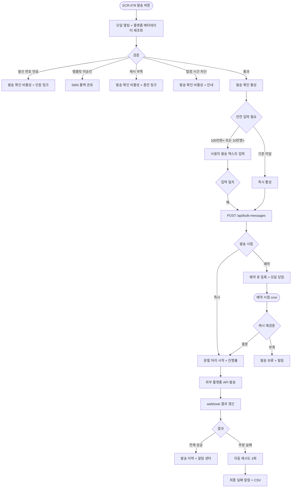
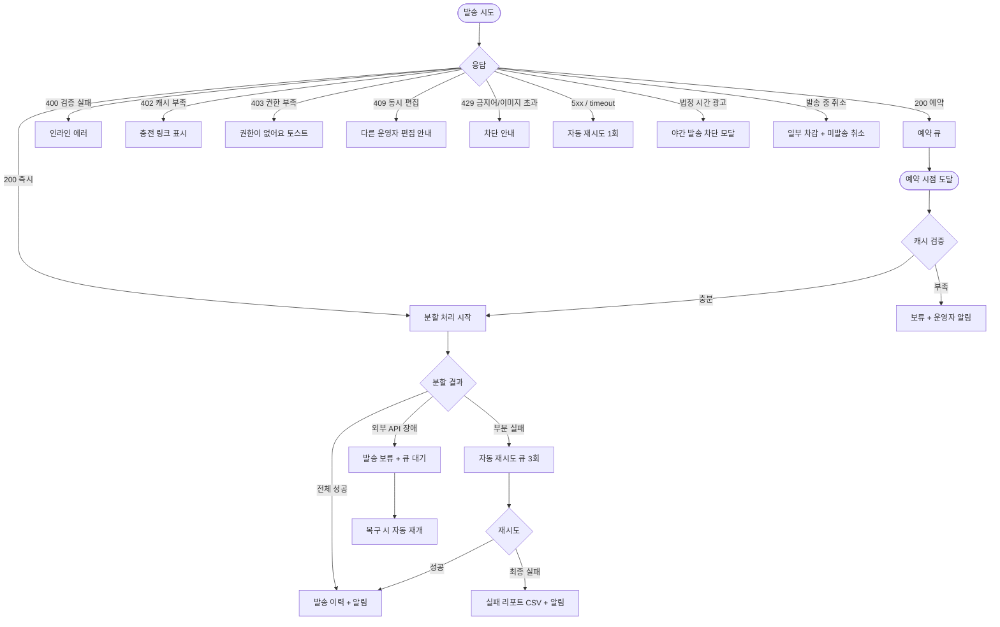

# DLG-078-002 발송 확인 다이얼로그

## 1. 다이얼로그 메타 정보

이 문서는 SMS/카카오 대량 발송의 발송 확인 다이얼로그에 대한 자기완결형 요구사항 정의서입니다. 다른 문서를 함께 보지 않아도 이 문서 한 장만으로 발송 요약, 예상 비용 확인, 플랫폼 잔여 캐시 검증, 카카오→SMS 폴백 처리, 발송 실행, 분할 처리·자동 재시도 정책, 권한 분기까지 전부 이해하고 구현할 수 있도록 작성합니다.

| 항목 | 값 |
|---|---|
| 작성일 | 2026-05-22 |
| 버전 | v1.0 |
| 상태 | 미구현 (UI 미연동) |
| 도메인 | D08 마케팅 |
| 다이얼로그 ID | DLG-078-002 |
| 다이얼로그명 | 발송 확인 |
| 부모 화면 | SCR-078 SMS/카카오 발송 |
| 트리거 | SCR-078 "발송" 버튼 (최종 발송 확인) |
| 기능코드 | MKT-08 (SMS/카카오 대량 발송) |
| 계약코드 | MKT-08-05 (발송 확인), MKT-08-06 (발송 처리), MKT-EXT-03 (플랫폼 연동) |
| 계약 상태 | 계약 범위 본기능 (미구현) |
| 모달 유형 | 최종 확인 (위험·고비용 액션) |
| 평균 분량 | 요약 6종 + 플랫폼 연동 카드 + 안전 확인 |

## 2. 다이얼로그 목적과 사용 맥락

발송 확인 다이얼로그는 SMS/LMS/MMS/카카오 알림톡 대량 메시지를 발송하기 직전, 수신자 수·예상 비용·발송 시점·메시지 내용·플랫폼 연동 상태를 한 화면에서 최종 점검하고 운영자가 의도한 발송임을 확정 받는 모달입니다. 대량 발송은 비용이 즉시 발생하고 발송 후에는 취소가 어렵기 때문에, 부주의한 클릭이나 잘못된 설정으로 인한 사고를 막는 핵심 안전 장치입니다.

운영 시나리오는 다음과 같습니다. 매니저가 신년 인사 5만 명에게 알림톡을 발송할 때 예상 비용이 250만 원이고 플랫폼 잔여 캐시가 280만 원으로 충분한지 확인하고 발송 버튼을 누릅니다. VIP 한정 캠페인에서는 알림톡 수신자 1만 명에게 발송하면서 비친구 200명이 SMS로 자동 폴백되어 추가 비용이 어떻게 합산되는지 확인합니다. 만료 회원 재등록 권유에서는 알림톡과 SMS 폴백이 함께 사용되어 비용이 채널별로 분리 표시됩니다. 점심시간 12:30 예약 발송을 잡으면 예약 시점에 플랫폼 잔여 캐시를 재검증하는 보류 정책이 적용되어 캐시가 부족하면 발송이 자동 보류됩니다.

호출 트리거는 SCR-078의 "발송" 버튼이며 발송 대상·메시지·채널·발송 시점이 모두 설정된 상태에서만 활성화됩니다. 모달이 열릴 때 플랫폼 API에서 발신 프로필·승인 템플릿·잔여 캐시·예상 비용을 실시간으로 재조회합니다.

## 3. 입력 필드와 표시 정보 전체 정의

발송 요약 영역은 모달 상단에 카드 형태로 표시되며 채널 종류(SMS·LMS·MMS·알림톡 또는 알림톡+SMS 폴백), 실제 발송 가능 수신자 수, 메시지 내용 미리보기(앞쪽 100자까지), 메시지 카테고리(영업·정보성), 발송 일시(즉시 또는 예약 시점)가 표시됩니다. 미리보기는 변수가 실제 첫 번째 수신자의 값으로 치환된 상태로 렌더되어 실제 발송될 메시지 형태를 직관적으로 확인할 수 있습니다.

플랫폼 연동 정보 카드는 발신 프로필(SMS 발신 번호 또는 카카오 발신 프로필명), 사용 승인 템플릿 ID·이름·승인 상태, 최근 비용 동기화 시각(예: "5분 전 동기화"), 발신 번호 인증 상태가 표시됩니다. 발신 번호 인증이 만료되었거나 템플릿이 미승인 상태이면 빨강 톤으로 강조됩니다.

예상 비용 카드는 채널별로 분리되어 표시됩니다. 알림톡 N건 × 단가, SMS N건 × 단가, LMS N건 × 단가, MMS N건 × 단가, 카카오 폴백 SMS N건 × 단가가 항목별로 표시되고 그 아래에 총 예상 비용이 강조 톤으로 표시됩니다. 발송 후 플랫폼 잔여 캐시 예상값(현재 잔여 캐시 - 예상 비용)이 함께 표시되어 운영자가 한눈에 캐시 충분성을 확인할 수 있습니다.

발송 일시 영역은 즉시 발송이면 "지금 즉시 발송"이 표시되고, 예약 발송이면 예약 일시와 함께 "예약 시점에 플랫폼 잔여 캐시를 재검증합니다" 보조 안내가 표시됩니다.

자동 제외 안내 영역은 수신 거부 N명·휴면 N명·법정 시간 차단 N명·카카오 비친구 N명·변수 데이터 누락 N명이 항목별로 분리 표시됩니다. 카카오→SMS 폴백 정책이 활성화된 경우 비친구 항목 옆에 "SMS 자동 폴백" 아이콘이 표시됩니다.

분할 처리 안내 영역은 발송 대상이 1만 건을 초과할 때만 표시되며 "총 5만 건은 5번에 나누어 발송됩니다(1만 건/회)"라는 안내가 표시됩니다.

확인 입력 안전 장치는 예상 비용이 운영 정책 임계값(예: 100만 원)을 초과하거나 발송 대상이 10만 명을 초과할 때만 표시됩니다. 사용자가 직접 "발송"이라는 단어를 텍스트 박스에 입력해야 [발송 확인] 버튼이 활성화됩니다.

모달 하단에는 강조 톤의 [발송 확인] 버튼과 보조 톤의 [취소] 버튼이 있습니다. 플랫폼 잔여 캐시가 예상 비용보다 적거나 발신 번호 인증이 만료되었거나 템플릿이 미승인이면 [발송 확인] 버튼이 비활성화됩니다.

## 4. 검증과 발송 실행 흐름

모달이 열리는 순간 플랫폼 메타데이터가 재조회됩니다. `GET /api/bulk-messages/platform-summary`로 발신 프로필·승인 템플릿·잔여 캐시를 조회하고, `POST /api/bulk-messages/estimate`로 최종 예상 비용을 재계산합니다.

검증은 다음 순서로 진행됩니다. 발신 번호 인증이 만료되었으면 "발신 번호 인증이 만료되었습니다. 시스템 설정에서 재인증해주세요" 빨강 안내가 표시되고 [발송 확인] 버튼이 비활성화됩니다. 알림톡 승인 템플릿이 미승인 상태이면 "사전 승인 템플릿이 필요합니다. SMS 폴백을 권유합니다" 안내가 표시됩니다. 플랫폼 잔여 캐시가 예상 비용보다 적으면 "플랫폼 잔여 캐시 부족: 부족분 N원. 외부 플랫폼에서 충전해주세요" 빨강 안내와 함께 외부 플랫폼 콘솔 이동 링크가 표시되고 [발송 확인] 버튼이 비활성화됩니다.

[발송 확인] 버튼을 누르면 모달이 로딩 상태로 전환되어 모든 버튼이 비활성화되고 백엔드에 `POST /api/bulk-messages` 요청이 전송됩니다. 요청 본문에는 발송 대상 조건, 메시지 본문·변수, 채널, 발송 시점, 폴백 정책, 카테고리가 포함됩니다.

즉시 발송의 경우 백엔드는 1만 건 단위 분할 처리를 시작하면서 모달에 진행률을 표시합니다. 모든 분할이 완료되거나 일정 시간이 경과하면 모달이 닫히고 부모 화면 SCR-078의 발송 이력에 새 행이 추가됩니다. 사용자가 모달이 닫히기 전에 페이지를 떠나도 분할 처리는 백그라운드에서 계속되며 완료 시 알림 센터(SCR-104)에 결과 알림이 푸시됩니다.

예약 발송의 경우 즉시 모달이 닫히고 부모 화면에서 "5월 23일 12:30에 발송 예약되었습니다" 토스트가 표시됩니다. 예약 시점이 도래하면 cron 분 단위 트리거가 발송을 실행하면서 그 시점의 플랫폼 잔여 캐시를 재검증합니다. 캐시 부족 시 발송이 보류되고 운영자에게 알림이 발송됩니다.

[취소] 버튼이나 ESC·배경 클릭으로 모달을 닫으면 발송이 실행되지 않고 부모 화면의 작성 화면으로 돌아갑니다.

## 5. 권한별 동작

슈퍼관리자(superAdmin)와 본사 최고관리자(primary)는 모든 발송이 가능하며 본사 통합 모드에서 전 지점 합산 발송이 가능합니다. 본사 통합 발송 시 각 회원의 실제 `branchId` 기준으로 분산 처리되어 발송 이력이 지점별로 분리 저장됩니다.

Owner(지점장)과 매니저(manager)는 자기 지점 회원에 한정해서 대량 발송이 가능합니다. 본사 통합 모드는 사용할 수 없습니다.

FC(fc)·트레이너(trainer)·스태프(staff)·프런트(front)·읽기 전용(readonly)은 부모 화면 SCR-078 자체에 접근할 수 없으므로 이 모달도 호출되지 않습니다.

권한 우회 시도가 백엔드에 도달하면 403 응답으로 차단되며 감사 로그에 기록됩니다.

플랫폼 연동 정보(발신 프로필·잔여 캐시·예상 비용·승인 템플릿)는 슈퍼관리자·본사·Owner(지점장)·매니저에게 모두 노출되지만, 일부 민감 정보(API 키·외부 API 응답 본문)는 슈퍼관리자에게만 표시됩니다.

## 6. 호출 트리거와 부모 화면 변화

이 모달은 SCR-078에서 발송 대상·메시지·채널·발송 시점이 모두 설정된 상태에서 "발송" 버튼을 누를 때 호출됩니다. "발송" 버튼은 발송 가능 회원이 1명 이상이고 메시지가 작성되어 있고 채널이 선택되어 있고 플랫폼 잔여 캐시가 예상 비용보다 클 때만 활성화됩니다.

즉시 발송이 성공하면 모달이 닫히고 부모 화면 SCR-078의 발송 이력 목록 상단에 새 행이 추가되며 "발송이 시작되었어요. 진행률은 알림 센터에서 확인할 수 있습니다" 토스트가 표시됩니다. 채널 현황 카드(SMS·알림톡·이번 달 비용·플랫폼 잔여 캐시)도 발송 건수와 차감된 캐시가 반영되어 즉시 갱신됩니다.

예약 발송이 성공하면 모달이 닫히고 "5월 23일 12:30에 발송 예약되었습니다" 토스트가 표시됩니다. 발송 이력 목록에는 예약 상태 행이 추가되며 예약 시점이 도래하면 자동으로 진행 중·완료 상태로 전환됩니다.

분할 처리 중 부분 실패가 발생하면 자동 재시도(1분·5분·30분 3회) 후에도 실패하면 알림 센터에 "발송 결과: 성공 N건·실패 M건" 알림이 푸시되며 운영자가 알림을 클릭하면 발송 이력 행의 상세 결과 화면이 열립니다.

## 7. 데이터 흐름과 외부 연동

모달 진입 시 호출되는 API는 `GET /api/bulk-messages/platform-summary`(플랫폼 메타데이터)와 `POST /api/bulk-messages/estimate`(예상 비용 재계산)입니다. 플랫폼 API(NHN·Toast)에서 실시간으로 단가·잔여 캐시·발신 프로필·승인 템플릿 상태가 조회됩니다.

[발송 확인] 누르면 `POST /api/bulk-messages`가 호출되며 응답으로 발송 job ID가 즉시 반환됩니다. 백엔드는 1만 건 단위로 분할 처리를 시작하면서 외부 플랫폼 API에 발송 요청을 분산 전송합니다. 외부 플랫폼은 발송 결과를 webhook으로 갱신하며 성공·실패·일부 실패 상태가 실시간으로 반영됩니다.

부분 실패는 자동 재시도 큐로 들어가 1분·5분·30분 간격으로 3회 재시도됩니다. 최종 실패 시 발송 이력에 실패 상태로 기록되고 운영자에게 알림이 발송됩니다.

발송 완료 후 플랫폼 사용량 API로 실제 비용이 재동기화됩니다. 예상 비용과 실제 비용에 차이가 있으면 발송 이력의 비용 컬럼이 실제 값으로 보정됩니다.

발송 이력은 90일 동안 보관되며 비용 청구 근거로 사용됩니다. 90일 경과 후 자동 아카이브 테이블로 이동됩니다.

감사 로그(SCR-097)에는 actor_id, channel, recipient_count, estimated_cost, actual_cost, send_time, message_template_id, audit_metadata가 비동기로 INSERT됩니다. 발송 시 적용된 발송 대상 조건도 함께 기록됩니다.

플랫폼 단가가 변경되면 진행 중 발송은 발송 시점 플랫폼 응답 기준으로 처리됩니다. 즉 발송이 시작된 후에는 변경된 단가가 즉시 반영되지 않고 그 발송 건은 시작 시점 단가로 정산됩니다.

알림 센터(NFR-19)는 발송 완료·부분 실패·예약 발송 도달·캐시 부족 보류 같은 이벤트를 운영자에게 푸시합니다. 사용자가 페이지를 떠난 후에도 알림이 전달됩니다.

## 8. 예외 처리

플랫폼 잔여 캐시가 예상 비용보다 적으면 [발송 확인] 버튼이 비활성화되고 빨강 톤의 경고가 표시되며 외부 플랫폼 콘솔 충전 링크가 함께 표시됩니다. 사용자는 외부 플랫폼에서 캐시를 충전한 후 모달을 다시 열어 재검증을 받아야 합니다.

플랫폼 메타데이터 조회가 실패하면(NHN·Toast API 오류) "발신 정보·예상 비용을 불러오지 못했습니다" 안내와 함께 재조회 버튼이 표시됩니다. 자동 재시도가 1회 일어나고 그래도 실패하면 사용자 액션을 기다립니다.

발신 번호 인증이 만료되었으면 "발신 번호 인증 필요" 빨강 안내가 표시되고 [발송 확인] 버튼이 비활성화됩니다. 시스템 설정으로 이동하는 링크가 함께 표시됩니다.

알림톡 승인 템플릿이 미승인 상태이면 "사전 승인 템플릿이 필요합니다. SMS 폴백을 권유합니다" 안내가 표시되며 사용자는 SMS 폴백을 활성화하거나 작성 화면으로 돌아가 다른 템플릿을 선택해야 합니다.

법정 시간(영업·광고성 21~08시) 차단 정책에 해당하는 시점에 광고 메시지를 발송하려고 시도하면 "야간 광고 발송이 차단되었습니다" 모달이 표시되고 [발송 확인] 버튼이 비활성화됩니다. 정보성(결제·환불·예약 안내) 메시지는 예외로 발송이 허용됩니다.

금지어가 메시지에 포함되어 있으면 "금지어가 포함되어 있습니다: {단어}" 안내가 표시되고 발송이 차단됩니다. 사용자는 작성 화면으로 돌아가 메시지를 수정해야 합니다.

MMS 첨부 이미지가 300KB를 초과하면 "이미지 크기가 300KB를 초과합니다" 안내가 표시되고 차단됩니다.

분할 처리 중 부분 실패가 발생하면 자동 재시도 후 최종 실패 시 알림 센터에 결과 알림이 푸시되며 발송 이력의 상세 결과 화면에서 실패 회원의 ID와 사유가 CSV로 다운로드 가능합니다.

외부 API 응답이 지연되면 "결과 확인 중" 표시가 5분 동안 유지되며 그 후 새로고침으로 결과가 갱신됩니다. 외부 API 장애 시 발송이 큐에 대기되고 복구 시 자동 재개됩니다.

예약 발송 시점에 플랫폼 잔여 캐시가 부족하면 발송이 보류되고 "예약 발송 시점에 플랫폼 잔여 캐시가 부족했습니다" 알림이 운영자에게 발송됩니다. 사용자는 캐시 충전 후 발송 이력에서 재예약하거나 즉시 발송으로 전환할 수 있습니다.

발송 중 사용자가 취소를 시도하면 분할 처리 일부는 이미 차감되어 발송된 상태로 남고 미발송 부분만 취소됩니다. 부분 차감 결과가 알림 센터에 표시됩니다.

동시 편집 충돌(409)이 발생하면 "다른 운영자가 동시에 편집했어요" 모달이 표시되고 새로고침 후 다시 시도하도록 안내됩니다.

## 9. 토스트와 확인 팝업

성공 토스트는 우측 상단에 녹색 계열로 5초 동안 표시됩니다. 즉시 발송은 "발송이 시작되었어요. 진행률은 알림 센터에서 확인할 수 있습니다", 예약 발송은 "5월 23일 12:30에 발송 예약되었습니다" 같은 문구가 표시됩니다.

실패 토스트는 빨강 계열로 "권한이 없어요", "플랫폼 잔여 캐시 부족", "발신 번호 인증 만료", "발송 처리 중 오류가 발생했어요" 같은 문구가 표시되며 "다시 시도" 또는 "충전하러 가기" 같은 보조 액션 버튼이 따라옵니다.

확인 팝업은 안전 확인이 필요한 경우(예상 비용 100만 원 초과 또는 발송 대상 10만 명 초과)에 [발송 확인]을 누르는 시점에 "정말 N명에게 발송할까요?" yes/no 확인이 추가로 표시됩니다.

부분 결과 알림은 모달 안에서 결과 카드 형태로 표시되며 "성공 N건 / 실패 M건" 두 가지 숫자와 함께 실패 사유별 분류, 실패 리포트 CSV 다운로드 링크가 제공됩니다. 사용자가 닫기 버튼을 누를 때까지 사라지지 않습니다.

## 10. 사용 흐름 다이어그램

## 11. 에러와 예외 흐름

## 12. 디자인 요청사항

예상 비용 카드는 모달에서 가장 강조된 톤으로 표시되어야 합니다. 채널별 비용 분리(알림톡·SMS·LMS·MMS·폴백 SMS)가 항목별로 한눈에 비교 가능하도록 정렬되며 총 비용은 가장 큰 폰트로 강조됩니다.

플랫폼 잔여 캐시 표시는 예상 비용과 시각적으로 인접하게 배치되어 두 값을 즉시 비교할 수 있게 합니다. 발송 후 잔여 캐시 예상값이 보조 텍스트로 함께 표시되어 운영자가 캐시 충분성을 직관적으로 파악합니다.

플랫폼 연동 상태(발신 번호 인증·승인 템플릿)는 각 항목 옆에 상태 배지(인증 완료·미인증·승인 완료·미승인)로 표시되며 문제가 있는 항목은 빨강 톤으로 강조됩니다.

자동 제외 안내(수신 거부·휴면·법정 시간·비친구·변수 누락)는 작은 배지 형태로 분리 표시되며 각 항목 옆에 해당 인원 수가 함께 표시됩니다.

발송 일시는 즉시·예약을 명확히 구분 표시하며 예약 발송의 경우 캘린더 아이콘과 함께 예약 시점이 강조 톤으로 표시됩니다.

안전 확인 입력 칸은 위험 액션 색상(주황 또는 빨강)으로 강조되어 사용자가 의식적으로 입력해야 함을 알립니다.

[발송 확인] 버튼은 검증 통과 후에만 강조 톤(녹색 또는 파랑)으로 활성화되며 검증 실패 시 비활성화됨이 명확합니다.

발송 진행률 표시는 분할 단위로 시각화되어(예: "3/5 분할 완료, 60%") 운영자가 현재 진행 상황을 정확히 파악할 수 있어야 합니다.

부분 실패 결과 카드는 성공·실패 숫자가 큰 폰트로 분리 표시되며 실패 사유별 분류가 작은 차트로 함께 표시됩니다.

모바일에서는 풀스크린으로 전환되며 발송 요약·비용·플랫폼 정보가 세로로 쌓이는 구조로 자동 재배치됩니다.

## 13. 운영 정책

대량 발송 채널은 SMS·LMS·MMS·카카오 알림톡의 4종이며 예상 비용은 NHN·Toast 플랫폼 API에서 실시간 조회됩니다. 관리자 화면은 단가를 수기 관리하지 않으며 플랫폼 응답값을 기준으로 합니다.

플랫폼 단가/과금 정책이 변경되면 SCR-078·DLG-078-002의 비용 계산에 즉시 반영됩니다. 단, 발송이 시작된 후에는 발송 시점 플랫폼 응답 기준으로 처리되며 변경된 단가가 진행 중 발송에 영향을 주지 않습니다.

카카오→SMS 자동 폴백 정책은 시스템 설정에서 ON·OFF로 토글되며 ON일 때 알림톡 비친구·실패 회원에게 SMS로 자동 폴백됩니다. OFF일 때는 비친구가 자동 제외됩니다. 폴백 시 SMS 단가가 추가로 합산되어 모달에 분리 표시됩니다.

분할 처리는 대량 발송 시 1만 건 단위로 자동 분할되며 부분 실패는 자동 재시도 3회(1분·5분·30분 간격)가 적용됩니다. 최종 실패 시 운영자 알림과 플랫폼 실제 비용 재조회가 함께 진행됩니다.

법정 시간 차단 정책은 영업·광고성 메시지를 21~08시 사이에 발송할 수 없도록 합니다(정보통신망법). 정보성(결제·환불·예약 안내) 메시지는 예외로 발송이 허용되며 메시지 카테고리에 따라 자동 분기됩니다.

수신 거부와 휴면 회원 자동 제외는 모든 대량 발송에 자동 적용되며 운영자가 끌 수 없는 강제 정책입니다. 변수 데이터 누락 회원도 자동 제외되며 사유가 발송 이력에 기록됩니다.

금지어 차단은 본사가 사전 등록한 금지어 사전(도박·대출·성인 등)에 포함된 단어가 메시지에 있을 때 발송을 차단합니다. 금지어 사전 변경은 즉시 반영됩니다.

알림톡 사전 승인 정책에 따라 미승인 템플릿은 발송할 수 없으며 SMS 폴백을 권유합니다. 글자수 정책으로 SMS 90byte(한글 45자) 초과 시 LMS로 자동 전환되며 단가 변경 안내가 표시됩니다. LMS는 2000byte를 초과할 수 없습니다.

MMS 첨부 이미지는 최대 300KB까지 허용되며 초과 시 차단됩니다.

발신 번호 인증 정책에 따라 사전 인증된 번호만 발신 가능하며 인증 만료 시 발송이 차단됩니다. 인증 만료 사전 알림이 운영자에게 전송됩니다.

플랫폼 잔여 캐시 부족 차단 정책은 발송 시점 잔여 캐시가 예상 비용보다 적을 때 발송을 차단하고 외부 플랫폼 충전 CTA를 표시합니다. 예약 발송도 예약 시점에 재검증되며 부족 시 보류됩니다.

발송 이력 90일 보관 정책은 비용 청구 근거와 회계 정산을 위해 모든 발송 이력을 90일 동안 보관하며 경과 후 아카이브 테이블로 이동됩니다. 외부 API 청구서와의 매핑은 회계 정산 근거로 사용됩니다.

본사 통합 발송은 슈퍼관리자·본사 최고관리자만 사용할 수 있으며 전 지점 회원이 합산되어 발송되고 회원의 실제 `branchId` 기준으로 발송 이력이 분산 저장됩니다.

가족 묶음 옵션(MBR-EXT-02)이 활성화된 경우 가족 그룹당 대표 회원 1명에게만 발송됩니다.

권한 정책은 슈퍼관리자·본사·Owner(지점장)·매니저까지 대량 발송이 가능하며 FC·트레이너·스태프·프런트·readonly는 부모 화면 진입 자체가 차단됩니다.

감사 로그는 발송·예약·메타데이터 재조회·재발송·취소 모두 SCR-097에 비동기로 INSERT되며 actor_id, channel, recipient_count, estimated_cost, actual_cost, send_time, message_template_id, target_conditions가 기록됩니다. 5초 안에 조회 가능해야 합니다.
