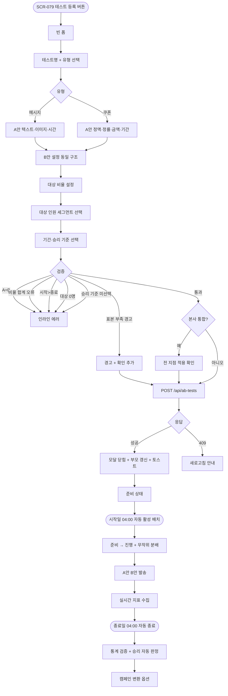
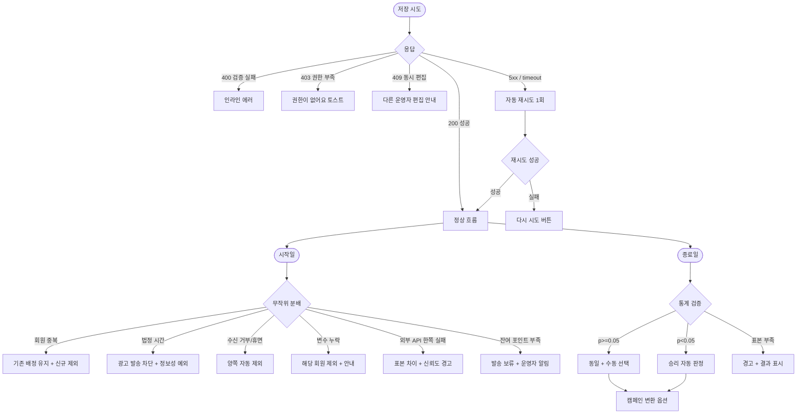

# DLG-079-001 A/B 테스트 등록 다이얼로그

## 1. 다이얼로그 메타 정보

이 문서는 A/B 테스트 등록 다이얼로그에 대한 자기완결형 요구사항 정의서입니다. 다른 문서를 함께 보지 않아도 이 문서 한 장만으로 모든 입력 필드, 대상 분배 검증, 표본 수 정책, 통계적 유의성 정책, 승리 자동 판정, 진행 중 변경 차단, 권한 분기까지 전부 이해하고 구현할 수 있도록 작성합니다.

| 항목 | 값 |
|---|---|
| 작성일 | 2026-05-22 |
| 버전 | v1.0 |
| 상태 | 퍼블리싱 완료 / 데이터 미연동 |
| 도메인 | D08 마케팅 |
| 다이얼로그 ID | DLG-079-001 |
| 다이얼로그명 | A/B 테스트 등록 |
| 부모 화면 | SCR-079 A/B 테스트 |
| 트리거 | SCR-079 헤더 "+ 테스트 등록" 버튼 |
| 기능코드 | MKT-09 (A/B 테스트) |
| 계약코드 | MKT-09-02 (테스트 등록), MKT-09-03 (테스트 진행) |
| 계약 상태 | 계약 범위 본기능 (UI 구현·데이터 미연동) |
| 모달 유형 | 입력 폼 (생성 전용, 수정 불가) |
| 평균 분량 | 7개 입력 영역 + A안/B안 + 검증 |

## 2. 다이얼로그 목적과 사용 맥락

A/B 테스트 등록 다이얼로그는 두 가지 버전(A안·B안)의 메시지 또는 쿠폰 중 어느 것이 더 효과적인지 정량적으로 비교 실험할 수 있도록 A/B 테스트를 신규 등록하는 모달입니다. 운영자가 정성적 추측이 아닌 도달·클릭율·전환율·매출 기여 같은 정량 지표로 마케팅 의사결정을 내릴 수 있게 하며, 통계적 유의성 검증을 통과한 승리안을 정식 캠페인(MKT-06)으로 1클릭 변환하는 전 과정의 출발점입니다.

운영 시나리오는 다음과 같습니다. 매니저가 메시지 카피 비교(A안 "10% 할인" vs B안 "특가 이벤트")로 어느 카피가 클릭율을 높이는지 7일 50:50 분배로 테스트하거나, 쿠폰 가치 비교(A안 5,000원 정액 vs B안 10% 정률)로 어느 쿠폰이 전환율을 높이는지 측정하거나, MMS 이미지 비교로 어느 이미지가 매출 기여를 높이는지 검증합니다. 우세안이 추정될 때는 70:30 같은 편향 분배로 위험을 최소화하기도 합니다. 슈퍼관리자는 본사 통합 모드에서 전 지점 일괄 A/B 테스트를 진행해 본사 통일 메시징 전략을 검증합니다.

호출 트리거는 SCR-079의 헤더 "+ 테스트 등록" 버튼이며 수정 모드는 지원하지 않습니다(진행 중 테스트는 일체 수정 차단, 종료 테스트는 결과만 조회). 등록된 테스트는 준비 상태로 저장되며 시작일에 자동 활성 배치가 진행 상태로 전환합니다.

## 3. 입력 필드 전체 정의

테스트명은 필수 입력으로 1자 이상 50자 이하의 텍스트입니다. 비어 있거나 50자를 초과하면 인라인 에러가 표시됩니다.

테스트 유형은 라디오 2종으로 메시지와 쿠폰 중 하나를 선택합니다. 메시지를 선택하면 A안·B안 입력 영역에 텍스트·이미지·발송 시간이 표시되고, 쿠폰을 선택하면 정액·정률·금액·기간 비교 영역이 표시됩니다.

A안 설정 영역은 A버전의 내용을 입력합니다. 메시지 유형에서는 메시지 본문(텍스트), 첨부 이미지(선택, MMS는 300KB 이하), 발송 시간(선택, 메시지 카피 비교가 아닌 시간대 비교용)이 입력되고, 쿠폰 유형에서는 할인 방식(정액·정률), 할인 금액 또는 할인율, 사용 가능 기간, 사용 조건이 입력됩니다.

B안 설정 영역은 B버전의 내용을 A안과 동일한 구조로 입력합니다. A안과 B안의 내용이 완전히 동일하면 "내용이 다른 두 버전이 필요합니다" 인라인 에러가 표시되고 저장이 차단됩니다.

대상 분배 비율은 A안과 B안에 각각 몇 %의 수신자를 배정할지 입력합니다. 사전 정의된 50:50, 70:30, 60:40 라디오 옵션과 함께 사용자 정의 비율 입력이 가능하며 A+B의 합계가 정확히 100%가 되어야 합니다. 합계가 100%가 아니면 "A+B 합계는 100%이어야 합니다" 인라인 에러가 표시됩니다.

대상 인원 영역은 발송 대상 회원을 선택하는 영역으로 SCR-077·SCR-078과 유사한 세그먼트 빌더가 표시됩니다. 회원 등급·이용권 상태·지역·가입 기간 같은 다중 조건이 입력되며 조건 변경 시 예상 대상 인원이 실시간으로 표시됩니다. 대상 인원이 0명이면 "대상 회원이 없습니다" 안내가 표시되고 저장이 차단됩니다.

테스트 기간은 시작일과 종료일 두 개의 날짜 선택기로 입력합니다. 시작일은 오늘 또는 미래 날짜만 허용되며 시작일이 종료일보다 늦으면 "시작일이 종료일보다 늦을 수 없습니다" 인라인 에러가 표시됩니다. 권장 기간은 최소 3일 이상이며 표본 수 도달 시간을 고려해 7일을 기본값으로 합니다.

승리 기준 드롭다운은 클릭율·전환율·매출 기여의 3종 중 하나를 선택합니다. 등록 시 1개만 선택 가능하며 진행 중에는 변경할 수 없습니다.

본사 통합 테스트 토글은 슈퍼관리자·본사 최고관리자에게만 표시되며 켜면 전 지점에 일괄 적용됩니다.

모달 하단에는 강조 톤의 [저장] 버튼과 보조 톤의 [취소] 버튼이 있습니다.

## 4. 검증과 저장 흐름

저장 검증은 다음 순서로 진행됩니다. 테스트명이 비었거나 50자를 초과하면 인라인 에러로 차단됩니다. A안과 B안 내용이 완전히 동일하면 차단됩니다. 대상 비율 합계가 100%가 아니면 차단됩니다. 시작일이 종료일보다 늦으면 차단됩니다. 대상 인원이 0명이면 차단됩니다. 승리 기준이 미선택이면 차단됩니다. 표본 수(대상 인원 × 비율)가 1000명 미만이면 "통계적 유의성 미달 가능" 경고가 표시되지만 저장은 허용됩니다(결과 신뢰도 안내와 함께).

검증을 모두 통과하면 `POST /api/ab-tests`가 호출되어 준비 상태로 저장됩니다. 응답이 성공이면 모달이 닫히고 SCR-079 테스트 목록이 갱신되며 "A/B 테스트를 등록했어요" 토스트가 표시됩니다.

저장 후 시작일이 도래하면 매일 새벽 4시 자동 활성 배치가 준비를 진행으로 전환하면서 대상 인원을 A안·B안 비율에 따라 무작위 분배합니다. `ab_assignment` 테이블에 회원 ID와 배정 버전이 INSERT되며 동일 회원은 한 버전만 받습니다. 분배가 완료되면 A안·B안 메시지·쿠폰이 각각 발송되고 실시간으로 도달·클릭·전환·매출 지표가 수집됩니다.

수정 모드는 지원하지 않습니다. 진행 중 테스트는 일체 수정이 차단되며 강제 종료만 가능합니다. 종료 테스트는 결과 조회와 승리안 채택만 가능합니다.

[취소] 버튼·ESC·배경 클릭으로 모달을 닫으면 변경 사항이 있을 때 "변경 사항이 사라집니다. 닫으시겠습니까?" yes/no 확인이 표시됩니다.

## 5. 권한별 동작

슈퍼관리자(superAdmin)와 본사 최고관리자(primary)는 모든 기능을 사용할 수 있으며 본사 통합 테스트 토글이 표시됩니다. 본사 통합 테스트는 전 지점에 일괄 적용됩니다.

센터장(owner)과 매니저(manager)는 자기 지점에 한정해서 테스트를 등록할 수 있습니다. 본사 통합 토글은 표시되지 않으며 `hq_owned=false`로 자동 저장됩니다.

FC(fc)·트레이너(trainer)·스태프(staff)·프런트(front)·읽기 전용(readonly)은 부모 화면 SCR-079 자체에 접근할 수 없으므로 이 모달도 호출되지 않습니다. 직접 URL이나 권한 우회로 호출된 경우 백엔드 응답이 403이 되어 차단됩니다.

권한 차단 시도는 모두 감사 로그에 기록됩니다.

## 6. 호출 트리거와 부모 화면 변화

이 모달은 SCR-079의 헤더 "+ 테스트 등록" 버튼을 누를 때 호출됩니다. 진행 중·종료 테스트의 행에서는 [상세]·[삭제] 버튼만 표시되며 수정 진입점은 제공되지 않습니다.

저장이 성공하면 SCR-079의 테스트 목록 상단에 새 행이 추가되며 상태 배지가 "준비"로 표시됩니다. 시작일이 도래하면 자동 활성 배치가 상태를 "진행"으로 전환하고 무작위 분배 결과(A안 N명·B안 N명)가 행에 표시됩니다.

진행 중에는 실시간 지표 수집이 계속되며 종료일이 도래하면 자동 종료 배치가 상태를 "완료"로 전환하면서 통계적 유의성 검증을 수행합니다. p-value < 0.05를 통과한 경우 승리 버전이 자동으로 판정되어 행에 "A안 승리" 또는 "B안 승리" 배지가 표시되며, 통과하지 못한 경우 "동일" 배지가 표시되어 운영자의 수동 채택이 필요합니다.

승리 버전이 채택되면 MKT-06 캠페인으로 1클릭 변환할 수 있는 [캠페인 변환] 버튼이 활성화됩니다.

## 7. 데이터 흐름과 외부 연동

저장 시 호출되는 API는 `POST /api/ab-tests`이며 요청 본문에는 테스트명, 유형, A안 객체, B안 객체, 대상 비율, 대상 조건, 기간, 승리 기준, `hq_owned` 플래그가 포함됩니다.

시작일이 도래하면 자동 활성 배치(매일 04:00)가 무작위 분배를 실행하면서 `ab_assignment` 테이블에 회원 ID와 배정 버전을 INSERT합니다. 분배는 무작위 알고리즘으로 수행되며 동일 회원이 두 버전을 모두 받지 않도록 unique constraint가 적용됩니다.

분배 완료 후 메시지 발송은 MKT-01 메시지 API로, 쿠폰 발급은 MKT-03 쿠폰 API로 자동 호출되어 각 버전이 발송됩니다.

실시간 지표 수집은 발송·클릭·결제 webhook으로 갱신됩니다. 도달 수는 발송 성공 카운트, 클릭율은 메시지 링크 클릭 webhook 기반, 전환율은 등록·결제 완료 카운트, 매출 기여는 결제 webhook의 결제 금액 합산으로 계산됩니다.

종료일이 도래하면 자동 종료 배치가 통계적 유의성 검증을 수행합니다. p-value 계산은 카이제곱 검정 또는 t-test 기반으로 진행되며 0.05 미만일 때 통과로 판정합니다. 통과 시 승리 버전이 자동 표시되고, 미통과 시 "동일"로 표시되어 운영자 수동 선택을 기다립니다.

회원 중복 노출 차단 정책에 따라 다중 A/B 테스트가 동시 진행되는 경우 동일 회원은 1개 테스트에만 노출됩니다. 우선순위는 시작일·생성일 기준입니다.

승리 채택 시 `POST /api/ab-tests/:id/adopt-winner`가 호출되어 승리안 정보가 캠페인 등록 화면(DLG-076-001)에 자동 입력됩니다. 운영자가 추가 검토 후 활성화하며 즉시 활성은 차단됩니다.

감사 로그(SCR-097)에는 actor_id, test_id, action(CREATE·FORCE_STOP·ADOPT_WINNER·CONVERT_CAMPAIGN·DELETE), before, after, timestamp가 비동기로 INSERT됩니다.

## 8. 예외 처리

A안과 B안 내용이 완전히 동일하면 "내용이 다른 두 버전이 필요합니다" 인라인 에러로 차단됩니다.

대상 비율 합계가 100%가 아니면 "A+B 합계는 100%이어야 합니다" 인라인 에러로 차단됩니다.

시작일이 종료일보다 늦으면 인라인 에러로 차단됩니다.

대상 인원이 0명이면 "대상 회원이 없습니다" 안내가 표시되고 저장이 차단됩니다.

승리 기준이 미선택이면 "승리 기준 필수" 인라인 에러로 차단됩니다.

표본 수가 1000명 미만이면 "표본 수 부족: 통계적 유의성 미달 가능" 경고가 표시되지만 저장은 허용됩니다(결과 신뢰도 안내와 함께). 권장은 1000명 이상이지만 운영자 판단으로 진행 가능합니다.

진행 중 테스트의 수정 시도(URL 직접 접근 등)는 백엔드에서 차단되며 "진행 중 테스트는 수정할 수 없습니다" 안내가 표시됩니다.

승리 기준 변경 시도(진행 중)는 같은 방식으로 차단됩니다.

회원 중복 노출 정책에 따라 동일 회원이 다른 A/B 테스트에 이미 배정된 경우 신규 테스트에서는 자동 제외되며 카운트에 반영됩니다.

법정 시간(영업·광고성 21~08시) 차단 정책은 A안·B안 동일하게 적용되며 발송 시점이 차단 시간이면 자동 보류됩니다. 정보성 메시지는 예외입니다.

수신 거부·휴면 회원은 양쪽 자동 제외되며 표본 차이가 발생하지 않도록 동일하게 처리됩니다.

외부 API 발송 실패가 한쪽에만 발생하면 양쪽 표본 차이로 결과 신뢰도가 낮아지므로 "표본 차이 발생: 결과 신뢰도 경고" 알림이 표시되고 종료 후 결과에도 신뢰도 경고 배지가 표시됩니다.

변수 데이터 누락 회원은 발송 제외되며 결과 영향 안내가 표시됩니다.

본사 통합 테스트와 지점 테스트가 동시 진행되는 경우 본사 우선 또는 둘 다 진행 중 정책으로 결정됩니다.

잔여 포인트·캐시가 부족하면 발송 보류 + 운영자 알림이 발송됩니다.

네트워크 오류(5xx 또는 timeout)는 자동으로 1회 재시도되고 그래도 실패하면 "다시 시도" 버튼이 표시됩니다.

동시 편집 충돌(409)이 발생하면 "다른 운영자가 동시에 편집했어요" 모달이 표시되고 새로고침 후 재시도하도록 안내됩니다.

## 9. 토스트와 확인 팝업

성공 토스트는 우측 상단에 녹색 계열로 5초 동안 "A/B 테스트를 등록했어요" 문구가 표시됩니다.

실패 토스트는 빨강 계열로 "권한이 없어요", "A안·B안 내용 동일", "비율 합계 오류", "등록 처리 중 오류가 발생했어요" 같은 문구가 표시됩니다.

확인 팝업은 변경 사항이 있는 모달을 닫으려고 할 때 "변경 사항이 사라집니다. 닫으시겠습니까?" yes/no가 표시됩니다. 본사 통합 테스트로 저장 시 "전 지점에 적용됩니다. 계속하시겠습니까?" 추가 확인이 표시됩니다. 표본 수 부족(1000명 미만)인 경우 [저장] 누를 때 "표본 수가 부족합니다. 그래도 진행할까요?" 추가 확인이 표시됩니다.

## 10. 사용 흐름 다이어그램

## 11. 에러와 예외 흐름

## 12. 디자인 요청사항

A안과 B안 영역은 시각적으로 좌우로 명확히 분리되어 표시되어야 하며 색상(A안 파랑·B안 주황 등)으로 구분되어 입력 시 혼동이 없어야 합니다. 모바일에서는 세로로 쌓이는 구조로 자동 재배치됩니다.

대상 분배 비율은 슬라이더 또는 라디오 + 사용자 정의 입력의 하이브리드 UI로 표시되며 합계가 항상 100%인지 실시간으로 검증되어 차트(파이 또는 바)로 시각화됩니다.

대상 인원 세그먼트 빌더는 SCR-077·SCR-078과 동일한 패턴으로 다중 조건 입력이 가능하며 예상 대상 인원이 실시간으로 강조 표시됩니다.

표본 수 부족(1000명 미만) 경고는 카운트 영역의 색상이 경고 톤(주황)으로 전환되어 즉시 인식할 수 있어야 합니다.

승리 기준 드롭다운은 3종(클릭율·전환율·매출 기여) 각각의 설명이 짧은 보조 텍스트로 함께 표시되어 처음 사용하는 운영자도 의미를 이해할 수 있어야 합니다.

테스트 기간 입력은 시작일·종료일이 가로로 나란히 배치되고 권장 기간(최소 3일, 기본 7일)이 보조 안내로 표시됩니다.

본사 통합 테스트 토글은 슈퍼관리자에게만 표시되며 켜졌을 때 "전 지점에 일괄 적용됩니다" 보조 안내가 강조 톤으로 함께 노출됩니다.

저장 버튼은 검증을 모두 통과했을 때만 강조 톤으로 활성화됩니다.

수정 모드가 없음을 강조하기 위해 신규 등록 모드에서 모달 상단에 "등록 후에는 수정이 불가능합니다(강제 종료만 가능)" 보조 안내가 표시됩니다.

## 13. 운영 정책

A/B 테스트 상태는 준비·진행·완료의 3종이며 시작일에 자동 활성 배치(매일 04:00)가 준비를 진행으로, 종료일에 자동 종료 배치가 진행을 완료로 전환합니다. 종료 시 통계적 유의성 검증이 함께 수행됩니다.

테스트 유형은 메시지와 쿠폰의 2종이며 메시지는 텍스트·이미지·발송 시간 비교, 쿠폰은 정액·정률·금액·기간 비교가 가능합니다.

무작위 분배 정책은 대상 인원을 비율(50:50, 70:30, 사용자 정의)에 따라 무작위 분배합니다. 동일 회원은 한 버전만 받으며 중복 노출이 차단됩니다. 회원 중복 노출 차단은 다중 A/B 테스트 동시 진행 시에도 동일 회원이 1개 테스트에만 노출되도록 보장합니다.

대상 비율 검증 정책은 A+B 합계가 정확히 100%이어야 하며 합계 불일치 시 저장이 차단됩니다.

표본 수 정책은 최소 1000명을 권장하며 미달 시 "통계적 유의성 미달 가능" 경고가 표시되지만 운영자 판단으로 진행 가능합니다. 결과 표시는 동일하게 진행되며 신뢰도 경고가 함께 표시됩니다.

통계적 유의성 검증은 p-value < 0.05 기준으로 카이제곱 검정 또는 t-test로 수행됩니다. 통과 시 승리 자동 판정, 미통과 시 "동일" 표시 후 운영자 수동 선택을 기다립니다.

승리 기준은 클릭율·전환율·매출 기여의 3종 중 1개를 등록 시 선택합니다. 진행 중 변경은 차단됩니다.

진행 중 수정 차단 정책에 따라 진행 중인 테스트는 일체 수정이 불가능하며 강제 종료만 가능합니다. 강제 종료 시 표본 수 부족 경고가 표시되고 운영자 확인 후 종료됩니다.

승리 채택 시 캠페인 변환 정책은 MKT-06 캠페인 등록 화면에 승리안 정보를 자동 입력하며 운영자가 검토 후 활성화합니다. 즉시 활성은 차단되어 운영자 검토 단계가 강제됩니다.

법정 시간(영업·광고성 21~08시) 차단 정책은 A안·B안 동일하게 적용되며 정보성 메시지는 예외입니다.

수신 거부·휴면 회원 자동 제외는 양쪽 동일하게 적용되어 표본 차이가 발생하지 않도록 합니다.

외부 API 발송 실패가 한쪽에만 발생하면 양쪽 표본 차이가 발생하므로 결과 신뢰도 경고 + 결과 보정이 진행됩니다. 변수 데이터 누락 회원도 동일하게 처리됩니다.

잔여 포인트·캐시 부족 시 발송이 보류되고 운영자 알림이 발송됩니다. 외부 플랫폼 충전 후 재개됩니다.

본사 통합 A/B 테스트는 슈퍼관리자가 전 지점에 일괄 적용하며 본사 통일 메시징 전략 검증에 사용됩니다. 지점 테스트와 동시 운영 시 본사 우선 또는 둘 다 진행 중 정책으로 결정됩니다.

결과 영구 보존 정책에 따라 종료 후 테스트 결과는 영구 보존되며 학습·재활용에 사용됩니다. 삭제 정책은 진행 전 hard delete, 진행 중·종료는 soft delete(결과 보존)입니다.

권한 정책은 슈퍼관리자·본사·센터장·매니저까지 테스트 등록·강제 종료·결과 채택·캠페인 변환·삭제가 가능하며 FC·트레이너·스태프·프런트·readonly는 부모 화면 진입 자체가 차단됩니다.

감사 로그는 등록·강제 종료·결과 채택·캠페인 변환·삭제 모두 SCR-097에 비동기로 INSERT되며 actor_id, test_id, action, before, after, timestamp가 기록됩니다. 5초 안에 조회 가능해야 합니다.
