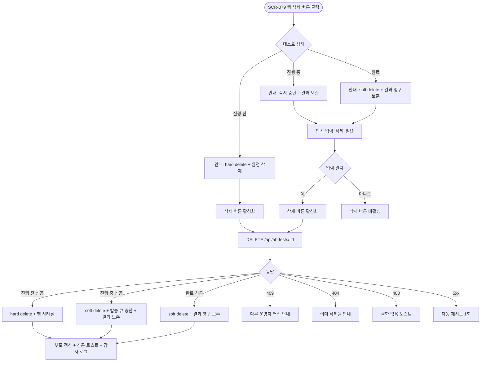
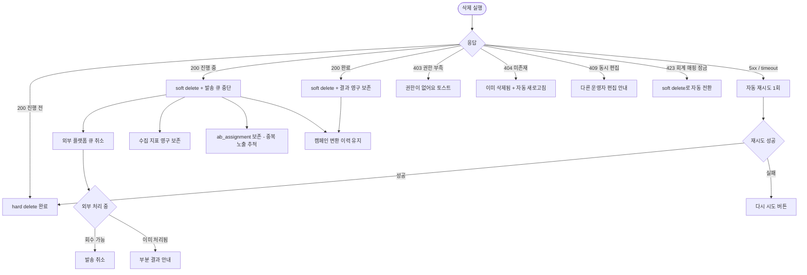

# DLG-079-002 A/B 테스트 삭제 다이얼로그

## 1. 다이얼로그 메타 정보

이 문서는 A/B 테스트 삭제 다이얼로그에 대한 자기완결형 요구사항 정의서입니다. 다른 문서를 함께 보지 않아도 이 문서 한 장만으로 삭제 시 수집 데이터 보존 여부, 진행 중 테스트 중단 정책, 결과 영구 보존 원칙, 감사 로그 기록, 권한 분기까지 전부 이해하고 구현할 수 있도록 작성합니다.

| 항목 | 값 |
|---|---|
| 작성일 | 2026-05-22 |
| 버전 | v1.0 |
| 상태 | 미구현 (UI 미연동) |
| 도메인 | D08 마케팅 |
| 다이얼로그 ID | DLG-079-002 |
| 다이얼로그명 | A/B 테스트 삭제 |
| 부모 화면 | SCR-079 A/B 테스트 |
| 트리거 | SCR-079 테스트 목록 행 [삭제] 버튼 |
| 기능코드 | MKT-09 (A/B 테스트) |
| 계약코드 | MKT-09-06 (테스트 삭제) |
| 계약 상태 | 계약 범위 본기능 (미구현) |
| 모달 유형 | 확인 (위험 액션) |
| 평균 분량 | 안내 메시지 + 영향 요약 + 확인 입력 |

## 2. 다이얼로그 목적과 사용 맥락

A/B 테스트 삭제 다이얼로그는 A/B 테스트를 삭제하기 전에 의도하지 않은 변경을 막기 위해 최종 확인을 받는 모달입니다. 진행 중인 테스트를 삭제하면 양쪽 발송이 즉시 중단되고 수집된 데이터가 결과 영구 보존 정책에 따라 처리되며, 종료된 테스트는 결과가 영구 보존되어야 하므로 soft delete만 적용되는 등 상태별로 처리 정책이 다릅니다. 부주의한 클릭으로 테스트와 학습 데이터를 잃지 않도록 안전 장치를 제공합니다.

운영 시나리오는 다음과 같습니다. 매니저가 잘못 등록한 진행 전 테스트를 깨끗이 제거하려는 경우는 hard delete로 완전 삭제됩니다. 진행 중 테스트에서 비즈니스적 이유로 즉시 중단해야 하는 경우(예: 외부 환경 변화로 테스트가 무의미해진 경우) 삭제 시 즉시 종료 + 결과 보존이 적용됩니다. 종료된 테스트의 운영 화면 정리를 위한 삭제는 soft delete로 결과는 영구 보존되어 학습·재활용에 사용됩니다. 슈퍼관리자는 본사 통합 테스트 삭제 시 전 지점에 즉시 반영합니다.

호출 트리거는 SCR-079 테스트 목록 행의 [삭제] 버튼이며 권한이 부족한 계정에서는 이 버튼이 아예 표시되지 않습니다. 진행 중 테스트의 [삭제] 버튼은 표시되지만 클릭하면 "진행 중 테스트 삭제 시 양쪽 발송이 즉시 중단됩니다" 추가 경고가 모달 상단에 표시됩니다.

## 3. 입력 필드와 안내 메시지

모달 상단에는 "A/B 테스트 삭제"라는 제목과 함께 위험 아이콘이 표시됩니다. 그 아래에 삭제 대상 테스트의 이름과 상태(준비·진행·완료)가 한 줄로 표시되며 상태에 따라 안내 메시지가 다르게 출력됩니다.

진행 전 상태일 때는 "이 A/B 테스트를 삭제하시겠습니까? 아직 분배가 시작되지 않아 데이터가 완전히 삭제됩니다"라는 안내가 표시됩니다.

진행 중 상태일 때는 "이 A/B 테스트를 삭제하시겠습니까? 진행 중인 테스트는 즉시 중단되며 양쪽 발송이 멈춥니다. 이미 수집된 데이터(도달·클릭·전환·매출)는 영구 보존됩니다"라는 안내가 표시되고, 그 아래에 영향 받는 항목이 카드 형태로 나열됩니다. A안 배정 인원, B안 배정 인원, 발송 완료 건수, 현재까지 수집된 지표(도달·클릭율·전환율·매출 기여)가 카운트로 표시됩니다.

완료 상태일 때는 "이 A/B 테스트를 삭제하시겠습니까? 결과는 영구 보존되며 목록에서만 숨겨집니다(soft delete). 캠페인 변환 이력은 그대로 유지됩니다"라는 안내가 표시됩니다.

진행 중·완료 테스트 삭제의 경우 안전 장치로 사용자가 직접 "삭제"라는 단어를 텍스트 박스에 입력해야 [삭제] 버튼이 활성화됩니다. 진행 전 테스트는 텍스트 입력 없이 [삭제] 버튼이 바로 활성화됩니다.

모달 하단에는 빨강 톤의 위험 액션 [삭제] 버튼과 기본 톤의 [취소] 버튼이 있습니다.

## 4. 검증과 처리 흐름

[삭제] 버튼을 누르면 모달이 로딩 상태로 전환되어 주요 버튼이 모두 비활성화되고 백엔드에 `DELETE /api/ab-tests/:id` 요청이 전송됩니다.

진행 전 테스트는 응답 즉시 데이터가 hard delete되어 데이터베이스에서 완전히 제거됩니다.

진행 중 테스트는 soft delete로 `deleted_at` 컬럼에 타임스탬프가 기록되고 상태가 "완료"로 즉시 전환됩니다. 양쪽 발송이 큐에서 중단되며 이미 발송된 메시지·쿠폰은 회수되지 않습니다. 수집된 지표는 결과 영구 보존 정책에 따라 보존되며 학습·분석에 사용됩니다.

완료 테스트는 soft delete로 `deleted_at` 타임스탬프만 기록되고 데이터 본체와 결과는 영구 보존됩니다. 캠페인 변환 이력이 있는 경우 그 이력도 그대로 유지됩니다.

성공 시 모달이 닫히고 SCR-079 테스트 목록이 즉시 갱신되며 "A/B 테스트를 삭제했어요" 토스트가 표시됩니다. 진행 중·완료 테스트는 기본 목록에서 사라지지만 "삭제된 테스트 보기" 토글이 켜진 상태에서는 별도 섹션에 회색 톤으로 노출됩니다.

[취소] 버튼이나 ESC·배경 클릭으로 모달을 닫으면 변경 없이 즉시 닫힙니다.

## 5. 권한별 동작

슈퍼관리자(superAdmin)와 본사 최고관리자(primary)는 모든 테스트(본사 통합 포함)를 삭제할 수 있습니다.

센터장(owner)과 매니저(manager)는 자기 지점에서 등록된 테스트만 삭제할 수 있습니다. 본사 통합 테스트는 조회만 가능하며 [삭제] 버튼이 비활성화되거나 표시되지 않습니다.

FC(fc)·트레이너(trainer)·스태프(staff)·프런트(front)·읽기 전용(readonly)은 부모 화면 SCR-079 자체에 접근할 수 없으므로 이 모달도 호출되지 않습니다.

권한 차단 시도는 모두 감사 로그에 기록됩니다.

## 6. 호출 트리거와 부모 화면 변화

이 모달은 SCR-079 테스트 목록 행의 [삭제] 버튼을 눌렀을 때 호출됩니다. 행에 표시된 테스트 정보(이름·유형·상태·기간·승리 버전)가 모달 상단의 컨텍스트로 표시됩니다.

삭제가 성공하면 부모 화면에서는 다음 변화가 즉시 일어납니다. 진행 전 테스트는 목록에서 해당 행이 완전히 사라집니다. 진행 중 테스트는 기본 목록에서 사라지면서 즉시 종료 상태로 전환되고, "삭제된 테스트 보기" 토글이 켜진 상태에서는 회색 톤 별도 섹션에 노출됩니다. 완료 테스트는 기본 목록에서 사라지지만 결과 영구 보존 정책에 따라 데이터는 유지됩니다.

진행 중 테스트가 삭제되면 양쪽 발송 큐가 중단되어 미발송 회원에게는 더 이상 메시지·쿠폰이 발송되지 않습니다. 이미 발송된 메시지·쿠폰은 회수되지 않으며 회원에게 약속한 혜택은 그대로 유지됩니다.

본사 통합 테스트가 본사 권한자에 의해 삭제되면 전 지점의 SCR-079 목록에서 동시에 사라집니다.

## 7. 데이터 흐름과 외부 연동

삭제 시 호출되는 API는 `DELETE /api/ab-tests/:id`입니다. 백엔드는 테스트 상태에 따라 hard delete 또는 soft delete를 분기하며, 진행 중 테스트인 경우 양쪽 발송 큐 중단 + 상태 전환 + 결과 보존을 트랜잭션으로 함께 실행합니다.

진행 중 테스트의 발송 큐 중단은 외부 플랫폼 API(NHN·Toast)에 즉시 전달되며 큐에 대기 중인 미발송 건이 취소됩니다. 이미 외부 플랫폼에 전달되어 발송 처리 중인 건은 외부 플랫폼의 처리 시점에 따라 일부 발송될 수 있습니다.

수집된 지표(도달·클릭·전환·매출)는 그대로 보존되며 결과 영구 보존 정책에 따라 영구 저장됩니다. 학습·재활용 분석에 사용 가능합니다.

`ab_assignment` 테이블의 회원 배정 데이터는 soft delete된 테스트와 연결된 상태로 보존됩니다. 이는 회원 중복 노출 차단 정책의 추적성을 위해 필요합니다.

캠페인 변환 이력은 그대로 유지되며 변환된 캠페인(MKT-06)은 A/B 테스트 삭제와 무관하게 운영됩니다.

성공 시 감사 로그(SCR-097)에 actor_id, test_id, action=DELETE, deletion_type(hard 또는 soft), test_status_at_deletion, affected_assignments_count, timestamp가 비동기로 INSERT됩니다.

종료된 테스트의 결과는 90일 경과 후 아카이브 테이블로 이동되며 분석용 인터페이스에서만 조회 가능합니다.

## 8. 예외 처리

진행 중·완료 테스트 삭제 시 안전 장치용 "삭제" 텍스트를 입력하지 않으면 [삭제] 버튼이 비활성화되어 클릭이 불가능합니다.

권한이 부족한 계정에서는 [삭제] 버튼 자체가 부모 화면에 표시되지 않습니다. 권한 우회 시도가 백엔드에 도달하면 403 응답으로 차단됩니다.

동시 편집 충돌(409)이 발생하면 "다른 운영자가 이미 이 테스트를 수정했어요. 새로고침 후 다시 시도해주세요" 모달이 표시됩니다.

테스트 ID가 존재하지 않거나 이미 삭제된 경우(404) "이미 삭제된 테스트입니다" 안내가 표시되고 모달이 자동으로 닫히면서 부모 목록이 새로고침됩니다.

네트워크 오류(5xx 또는 timeout)는 자동으로 1회 재시도되고, 그래도 실패하면 "다시 시도" 버튼이 표시됩니다.

본사 통합 테스트를 일반 지점 운영자가 삭제하려고 시도하면 [삭제] 버튼이 비활성화되어 있어 클릭 자체가 차단됩니다.

진행 중 테스트의 발송이 외부 플랫폼에서 이미 처리 중인 상태이면 일부 발송이 회수되지 않을 수 있습니다. 이 경우 부분 결과 안내가 발송 이력에 기록되며 운영자에게 알림이 발송됩니다.

캠페인 변환된 테스트를 삭제하는 경우 캠페인은 그대로 운영되며 캠페인 운영자에게 "이 캠페인이 변환된 A/B 테스트가 삭제되었습니다" 알림이 전송됩니다.

회계·세무 의무로 결과 보존이 필요한 테스트는 hard delete가 차단되고 진행 전이라도 자동으로 soft delete로 전환됩니다.

다중 A/B 테스트 회원 중복 노출 차단의 우선순위 추적에 사용 중인 테스트는 soft delete만 가능합니다.

## 9. 토스트와 확인 팝업

성공 토스트는 우측 상단에 녹색 계열로 5초 동안 "A/B 테스트를 삭제했어요" 문구로 표시됩니다. 진행 중 테스트 삭제 시에는 "테스트가 즉시 중단되었습니다. 수집 데이터는 보존됩니다" 보조 안내가 함께 표시됩니다.

실패 토스트는 빨강 계열로 "권한이 없어요", "이미 삭제된 테스트입니다", "삭제 처리 중 오류가 발생했어요" 같은 문구가 표시되며 보조 액션 버튼이 따라옵니다.

진행 중·완료 테스트 삭제 시 안전 장치 텍스트 입력 칸 옆에 "삭제하려면 '삭제'를 입력해주세요" 보조 안내가 회색 톤으로 표시됩니다.

확인 팝업은 별도로 표시되지 않습니다(모달 자체가 확인 모달).

## 10. 사용 흐름 다이어그램

## 11. 에러와 예외 흐름

## 12. 디자인 요청사항

위험 액션 모달이므로 [삭제] 버튼은 빨강 톤의 위험 색상으로 강조되며 [취소] 버튼은 기본 톤의 보조 색상으로 표시됩니다. 두 버튼의 시각적 위계가 명확해야 사용자가 실수로 [삭제]를 누르지 않도록 합니다.

모달 상단에는 경고 아이콘(삼각형 + 느낌표)이 빨강 또는 주황 톤으로 표시되어 위험 액션임을 즉시 알 수 있어야 합니다.

진행 중 테스트 삭제의 영향 카드(A안·B안 배정 인원, 발송 완료 건수, 수집 지표)는 카운트가 큰 폰트로 강조되어 사용자가 영향 범위를 한눈에 파악할 수 있어야 합니다.

안전 장치 텍스트 입력은 일반 입력 필드보다 조금 더 넓은 폭으로 표시되며 플레이스홀더에 "삭제"를 입력하라는 안내가 회색 톤으로 표시됩니다.

상태별 안내 메시지 톤은 진행 전은 일반 톤, 진행 중은 주의 톤(빨강), 완료는 안정 톤(회색)으로 시각적으로 분기됩니다.

A/B 테스트의 특성을 반영해 A안·B안 영향 데이터가 좌우로 분리 표시되며 부모 화면의 색상 코딩(A안 파랑·B안 주황)을 유지합니다.

모바일에서는 풀스크린으로 전환되며 [삭제]·[취소] 버튼이 화면 하단에 가로로 배치됩니다.

## 13. 운영 정책

A/B 테스트 삭제 정책은 상태에 따라 분기됩니다. 진행 전 테스트는 hard delete로 데이터베이스에서 완전히 제거되며, 진행 중·완료 테스트는 soft delete로 `deleted_at` 타임스탬프만 기록되고 결과와 데이터 본체는 영구 보존됩니다.

진행 중 테스트 삭제 시 양쪽 발송 큐가 즉시 중단되며 미발송 회원에게는 더 이상 메시지·쿠폰이 발송되지 않습니다. 이미 발송된 메시지·쿠폰은 회수되지 않으며 회원과의 약속은 유지됩니다.

결과 영구 보존 정책에 따라 진행 중·완료 테스트의 수집 지표(도달·클릭·전환·매출)는 영구 보존되어 학습·재활용 분석에 사용됩니다. 종료 후 90일이 경과하면 아카이브 테이블로 이동되며 분석용 인터페이스에서만 조회 가능합니다.

`ab_assignment` 회원 배정 데이터는 soft delete된 테스트와 연결되어 보존됩니다. 이는 회원 중복 노출 차단 정책의 추적성을 위해 필수입니다.

캠페인 변환 이력 유지 정책에 따라 A/B 테스트가 삭제되어도 변환된 캠페인(MKT-06)은 그대로 운영됩니다. 캠페인 운영자에게는 변환 원본 테스트가 삭제되었다는 알림이 전송됩니다.

회계·세무 의무로 결과 보존이 필요한 테스트(예: 매출 기여 측정 결과가 회계 정산에 사용된 경우)는 hard delete가 차단되며 진행 전이라도 자동으로 soft delete로 전환됩니다.

본사 통합 A/B 테스트는 슈퍼관리자·본사 최고관리자만 삭제할 수 있으며 일반 지점 운영자는 본사 통합 테스트를 조회만 가능하고 삭제할 수 없습니다. 본사 통합 테스트 삭제는 전 지점에 즉시 반영됩니다.

권한 정책은 슈퍼관리자·본사·센터장·매니저까지 삭제가 가능하며 자기 지점에서 등록된 테스트만 삭제할 수 있습니다. FC·트레이너·스태프·프런트·readonly는 부모 화면 진입 자체가 차단됩니다.

다중 A/B 테스트 동시 진행 시 회원 중복 노출 차단 정책의 우선순위는 시작일·생성일 기준이며 테스트 삭제 후에도 `ab_assignment` 데이터가 보존되어 추적성이 유지됩니다.

감사 로그는 삭제 액션을 actor_id, test_id, action=DELETE, deletion_type(hard 또는 soft), test_status_at_deletion, affected_assignments_count(영향 받은 회원 배정 수), timestamp로 비동기 INSERT하며 5초 안에 SCR-097에서 조회 가능해야 합니다. 권한 우회 시도와 차단 이벤트도 모두 기록됩니다.

회원 탈퇴 시 A/B 테스트 배정 이력은 보존되며 결과 신뢰도 분석에 사용됩니다. 회원 병합(MBR-EXT-01) 시 부 계정의 A/B 테스트 배정은 주 계정으로 합산되지 않고 그대로 보존됩니다(통계적 무결성 유지).

외부 플랫폼 발송이 이미 처리 중인 상태에서 진행 중 테스트가 삭제되면 일부 발송이 회수되지 않을 수 있으며 부분 결과 안내가 발송 이력에 기록되어 운영자가 사후 확인할 수 있도록 합니다.
