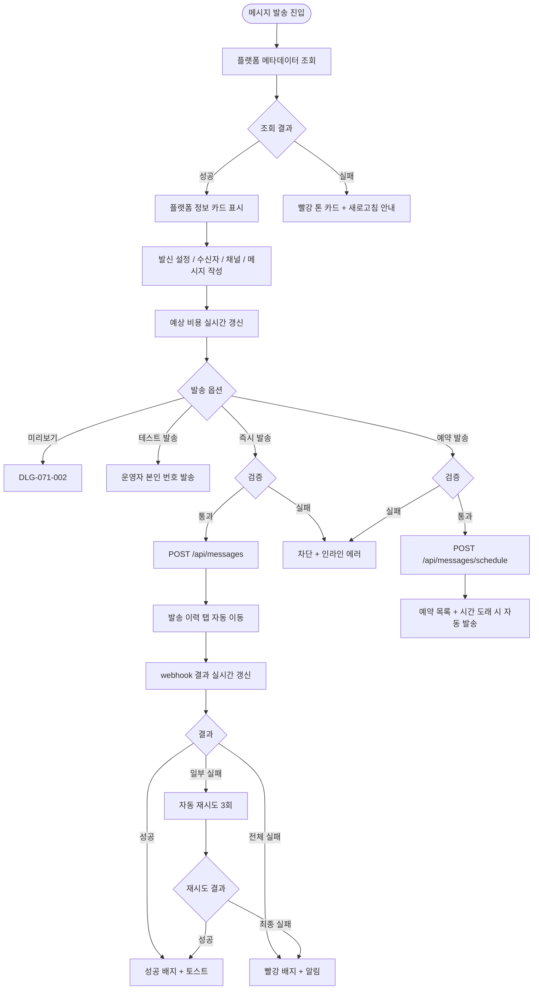
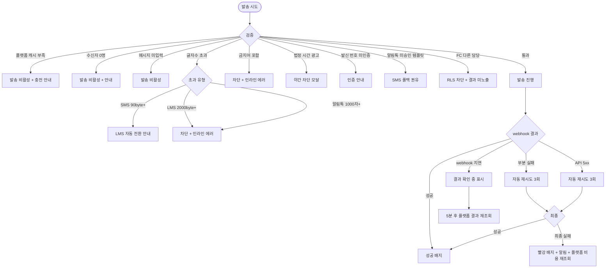

# SCR-071 메시지 발송 페이지

## 1. 화면 메타 정보

이 문서는 메시지 발송 페이지에 대한 자기완결형 요구사항 정의서입니다. 다른 문서를 함께 보지 않아도 이 문서 한 장만으로 메시지 발송 페이지에 들어가는 모든 영역, 모든 버튼, 모든 다이얼로그, 모든 권한, 모든 예외 처리, 그리고 이 화면을 지탱하는 메시지 플랫폼 정책까지 전부 이해하고 구현할 수 있도록 작성합니다.

| 항목 | 값 |
|---|---|
| 작성일 | 2026-05-22 |
| 버전 | v1.0 |
| 상태 | 최신 통합본 반영 (정합화 완료) |
| 도메인 | D08 마케팅 |
| 화면 ID | SCR-071 |
| 화면명 | 메시지 발송 |
| 화면 유형 | 허브 화면 (Hub Screen) |
| 라우트 (URL) | `/message` |
| 플랫폼 | 데스크톱(기본), 태블릿, 모바일(풀스크린) |
| 우선순위 | P0 (출시 필수) |
| 기능코드 | MKT-01 (메시지 발송) |
| 계약코드 | MKT-01 |
| 계약 상태 | 계약 범위 본기능 |
| 부모 기능 prefix | MKT |
| Lv1 코드 | MKT-01 |
| Lv2 / Lv3 세분화 | MKT-01-01 ~ MKT-01-09 (탭 전환, 발신 설정, 수신자 선택, 발송 채널, 예상 비용, 메시지 작성, 미리보기, 발송·예약, 발송 이력) |
| 연계 화면 | SCR-072 자동알림설정, SCR-072A 자동알림운영현황, SCR-078 SMS카카오대량발송, SCR-M004 회원상세, SCR-070 리드관리, SCR-097 감사로그 |
| 호출 다이얼로그 | DLG-071-001 수신자검색, DLG-071-002 발송미리보기 |

## 2. 화면 개요와 목적

메시지 발송 페이지는 회원·리드에게 알림톡 / SMS·LMS / 앱 푸시 3종 채널 중 적합한 채널로 메시지를 직접 작성해 발송하고, 발송 이력을 관리하는 화면입니다. 매니저는 신년 인사·생일·할인 이벤트 같은 단발성 캠페인 메시지를 일괄 발송하고, FC는 본인 담당 회원에게 PT 잔여횟수·운동 격려 같은 1:1 케어 메시지를 보내며, 만료 회원에게는 알림톡으로 재등록 권유 메시지를 저비용으로 발송합니다. 슈퍼관리자는 본사 모드로 진입해 전 지점 점주에게 공지 메시지를 일괄 발송합니다.

이 화면이 특히 중요한 이유는, 메시지 발송이 외부 메시지 플랫폼(NHN Toast, Kakao Biz 등) API와 직접 연동되어 실제 비용이 발생하기 때문입니다. 따라서 화면 상단의 플랫폼 발송 정보 카드(연동 플랫폼명, 발신 프로필, 잔여 캐시/크레딧, 최근 동기화 시각)와 예상 비용 실시간 표시는 모두 플랫폼 API 응답값을 진실 소스로 삼습니다. 내부 단가 수기 관리는 두지 않습니다. 운영자는 관리자 화면에서 발송 조건과 메시지 내용을 결정하지만, 과금 단가·실발송 상태·최종 청구 근거는 플랫폼 응답값을 우선합니다.

이 화면이 다루는 주요 업무는 다음과 같습니다. 첫째, 수신자 선택. 전체 회원 / 활성 회원 / 만료 회원 / 개별 검색(DLG-071-001) / 리드 그룹(CRM-01 연계) 다섯 가지 방식으로 수신자를 지정합니다. 둘째, 채널 선택과 예상 비용 확인. 알림톡·SMS·LMS·앱 푸시 중 선택하고 플랫폼 API로 예상 비용을 실시간 조회합니다. 셋째, 메시지 작성과 변수 치환. {회원명}/{만료일}/{잔여횟수}/{담당FC} 4종 변수를 삽입해 개인화 메시지를 만듭니다. 넷째, 미리보기(DLG-071-002)와 발송. 변수가 치환된 수신자 화면 형태로 검증 후 즉시 또는 예약 발송합니다. 다섯째, 발송 이력 조회. 발송 일시·채널·수신자 수·결과를 확인하고 실패 건은 재발송할 수 있습니다.

## 3. 진입 경로와 인접 화면

메시지 발송 페이지에 진입하는 경로는 다음과 같이 여러 가지가 있고, 각 경로마다 진입 직후 화면의 초기 상태가 조금씩 달라집니다.

첫 번째 경로는 사이드바입니다. 좌측 사이드바의 "마케팅" 메뉴 아래 "메시지 발송" 항목을 클릭하면 진입합니다. 이 경우 URL은 단순히 `/message`가 되고, 화면은 메시지 전송 탭이 기본 활성화된 상태로 시작합니다.

두 번째 경로는 회원 목록(SCR-M001)에서 회원을 선택하고 일괄 작업 바의 "메시지 전송" 버튼을 누른 경우입니다. 이때는 선택된 회원의 ID 배열이 쿼리 파라미터로 전달되어 수신자 영역에 자동으로 채워진 상태로 진입합니다. 예: `/message?recipients=m001,m002,m003`.

세 번째 경로는 회원 상세(SCR-M004)에서 빠른 액션 "메시지 보내기" 버튼을 누른 경우입니다. 이때는 그 회원 한 명이 수신자로 자동 채워지고, 화면은 1:1 발송 모드로 진입합니다.

네 번째 경로는 리드 관리(SCR-070)의 상담 상세 패널에서 "메시지 발송" 버튼을 누른 경우입니다. 그 리드 한 명이 수신자로 자동 채워지며 리드 그룹 옵션이 사전 선택됩니다.

다섯 번째 경로는 자동 알림 설정(SCR-072)의 "테스트 발송" 또는 "수동 발송" 액션입니다. 자동 알림 규칙이 트리거되지 않은 시점에 수동으로 같은 메시지를 발송하고 싶을 때 진입합니다.

여섯 번째 경로는 외부 도구 북마크 또는 발송 이력에서의 "재발송" 클릭입니다. 발송 이력 탭의 행 [재발송]을 누르면 같은 수신자·같은 채널·같은 메시지가 미리 채워진 상태로 메시지 전송 탭이 열립니다.

이 화면에서 다시 빠져나가는 인접 화면으로는 자동 알림 설정(SCR-072), 자동 알림 운영 현황(SCR-072A), 대량 발송 전용 화면 SMS/카카오 발송(SCR-078), 그리고 발송 결과 상세 알림이 푸시되는 알림 센터(SCR-104), 감사 로그(SCR-097)가 있습니다.

## 4. 레이아웃과 UI 구성

메시지 발송 페이지는 위에서 아래로 차곡차곡 쌓이는 세로형 레이아웃을 기본으로 합니다. 데스크톱에서는 본문이 좌측 70%·우측 30%로 분할되어, 좌측에 메시지 작성 영역, 우측에 발송 정보 요약과 플랫폼 상태가 표시됩니다. 태블릿과 모바일에서는 세로 단일 컬럼으로 자동 전환됩니다.

가장 위에는 페이지 헤더가 있습니다. 헤더 좌측에는 "메시지 발송"이라는 페이지 타이틀이 표시됩니다. 헤더 우측에는 "자동 알림 설정으로 이동" 보조 링크가 있어 자동화 정책을 조정하고 싶을 때 SCR-072로 빠르게 넘어갈 수 있습니다.

페이지 헤더 바로 아래에는 탭 영역이 있습니다. "메시지 전송" 탭과 "발송 이력" 탭 두 가지가 가로로 배치되어 있으며, 어느 탭이 선택되었는지는 URL 쿼리 파라미터 `tab=send|history`로 반영됩니다. 메시지 전송 탭이 기본 활성 상태이고, 발송 이력 탭을 누르면 발송 이력 테이블 뷰로 전환됩니다.

탭 바로 아래, 본문 영역의 최상단에는 메시지 플랫폼 정보 카드가 가로로 배치됩니다. 카드 내부에는 연동 플랫폼명(예: "NHN Cloud"), 사용 중인 발신 프로필(SMS 발신 번호 / 카카오 발신 프로필 이름), 현재 사용 가능한 승인 템플릿 수, 플랫폼 잔여 캐시/크레딧, 마지막 동기화 시각이 한 줄로 표시됩니다. 플랫폼 API 조회 실패 시 이 카드 자체가 빨강 톤으로 표시되며 "발신 정보/예상 비용을 불러오지 못했습니다. 다시 시도해주세요"라는 안내와 새로고침 버튼이 노출되고, 발송 버튼은 비활성화됩니다.

플랫폼 정보 카드 바로 아래에는 발신 설정 영역이 있습니다. 발신 번호 드롭다운에는 플랫폼 API에서 조회한 사전 인증된 SMS 발신 번호 목록이 표시됩니다. 카카오 발신 프로필 드롭다운에는 승인된 카카오 채널 프로필 목록이 표시됩니다. FC 권한 계정에서는 이 영역이 읽기 전용으로 표시되어 변경 불가합니다.

발신 설정 아래에는 수신자 선택 영역이 있습니다. 좌측에는 조건 그룹 라디오 버튼(전체 회원 / 활성 회원 / 만료 회원 / 개별 검색 / 리드 그룹)이 있고, 우측에는 "개별 검색" 선택 시 활성화되는 "대상 검색" 버튼(DLG-071-001 호출)이 있습니다. 어떤 그룹을 선택하든 그 그룹의 실시간 수신자 수가 카드 우측에 즉시 표시됩니다(예: "활성 회원 234명"). 개별 검색으로 추가한 수신자는 칩 형태로 본문 아래쪽에 나열되며, 각 칩의 X로 개별 제거할 수 있습니다. 리드 그룹은 추가 옵션으로 "30일 미전환 리드 재마케팅" 같은 사전 정의 필터를 제공합니다. 가족 묶음 발송 옵션(MBR-EXT-02)은 체크박스로 활성화하면 같은 가족 그룹의 회원에게는 그룹당 1명에게만 발송되도록 자동 처리됩니다.

수신자 선택 아래에는 발송 채널 선택 영역이 있습니다. 알림톡 / SMS·LMS / 앱 푸시 3종이 가로로 배치된 라디오 버튼으로 표시되며, 각 채널 옆에는 플랫폼 API 응답 기준 예상 비용이 작은 숫자로 표시됩니다(예: "알림톡 4.2원 · SMS 22원 → 90byte 초과 시 LMS 33원 · 푸시 무료"). SMS 선택 시 90byte 초과되면 자동으로 LMS로 전환됩니다. 채널 자동 선택(알림톡 우선·SMS 폴백) 토글이 추가로 표시되어, 활성화하면 알림톡 친구는 알림톡으로, 비친구는 SMS로 자동 분기 발송됩니다.

발송 채널 아래에는 예상 비용 안내 카드가 있습니다. 선택된 수신자 수 × 채널·템플릿·글자수 조건을 플랫폼 API에 전달해 예상 비용을 실시간 표시합니다. 예상 비용 = 알림톡 발송 예상 N건 × 4.2원 + SMS 폴백 예상 M건 × 22원처럼 채널별 분리 합산 표시되며, 합계가 플랫폼 잔여 캐시를 초과하면 빨강 경고 + 발송 버튼 비활성 + "외부 플랫폼 콘솔에서 충전 후 다시 시도해주세요"라는 안내가 표시됩니다.

예상 비용 아래에는 메시지 작성 영역이 있습니다. 가로로 길게 늘어진 textarea가 있고, 그 위에 변수 삽입 버튼이 가로로 배치됩니다({회원명} / {만료일} / {잔여횟수} / {담당FC} 4종). 버튼을 누르면 현재 커서 위치에 변수가 삽입됩니다. textarea 우측 하단에는 글자수 카운터(현재 글자수 / 채널별 상한, 예: "45 / 90byte (SMS)")가 표시되어, SMS 90byte 초과 시 자동으로 LMS로 전환되며 "LMS로 자동 전환됩니다 (단가 22원 → 33원)" 안내가 표시됩니다. LMS 2000byte 초과 시 인라인 "2000byte 이내" 에러가 표시되며 저장 차단됩니다. 알림톡 1000자 초과도 동일하게 차단됩니다. 메시지에 금지어(도박·대출·성인 등 사전 등록된 단어)가 포함되면 인라인 "금지어 포함: {단어}" 에러와 함께 발송 차단됩니다.

메시지 작성 영역 아래에는 발송 옵션 영역이 있습니다. 발송 방식 라디오(즉시 발송 / 예약 발송) + 예약 일시 입력(분 단위) + "테스트 발송" 보조 버튼이 배치됩니다. 테스트 발송 버튼을 누르면 운영자 본인 번호로 시범 발송이 수행되어 실제 회원 발송 전 검증할 수 있습니다.

발송 옵션 아래에는 최종 액션 버튼 영역이 있습니다. "미리보기" 버튼(DLG-071-002 호출)과 "발송" 버튼이 우측 정렬로 배치됩니다. 발송 버튼은 수신자 미선택·메시지 미입력·플랫폼 잔여 캐시 부족·글자수 초과·금지어 포함 중 하나라도 해당하면 비활성화됩니다. 예약 발송 모드에서는 버튼 라벨이 "예약 발송"으로 자동 변경됩니다.

법정 시간(21:00~08:00) 안에 영업/광고성 메시지 발송을 시도하면 "야간 광고성 메시지 발송 불가" 모달이 떠 차단됩니다. 정보성·고객응대 메시지(결제·환불·홀딩 종료)는 예외로 허용됩니다.

발송 이력 탭이 활성화된 경우, 본문 영역은 발송 이력 테이블로 교체됩니다. 컬럼은 좌측부터 발송 일시, 채널 배지, 수신자 수, 내용 요약(첫 30자), 발송 결과 배지(성공/실패/일부 실패), 비용, 행 액션(상세/재발송) 순서로 배치됩니다. 행 [상세] 클릭은 수신자별 성공/실패 + 사유를 보여주는 상세 패널을 우측에 슬라이드 인 시키고, 행 [재발송] 클릭은 같은 수신자·채널·메시지로 메시지 전송 탭으로 이동합니다(실패 건만 재발송할지 전체 재발송할지 모달에서 선택).

## 5. 탭 구성과 탭별 동작

이 화면은 탭이 두 가지로 분기되어 있고, 메시지 작성과 발송 이력 관리를 분리해서 다룹니다.

메시지 전송 탭(send)은 화면 진입 시 기본 활성 상태이며, 신규 메시지 발송을 위한 모든 입력 영역이 보입니다. 플랫폼 정보·발신 설정·수신자·채널·예상 비용·메시지 작성·발송 옵션·미리보기·발송 버튼이 한 화면에 모두 들어있어, 운영자가 위에서 아래로 차례대로 채워나가는 순차적 작업 흐름을 자연스럽게 따라가도록 설계되어 있습니다.

발송 이력 탭(history)은 과거 발송 결과 조회와 재발송을 위한 영역입니다. 페이지 진입 시 최근 발송 30일 분이 기본 표시되며, 검색·필터로 채널·결과·기간·발신자 등 조건별 조회가 가능합니다. 발송 이력은 90일 이상 보관되며, 90일 경과분은 자동 아카이브되어 별도 권한자만 조회할 수 있습니다.

탭을 전환해도 URL에 `tab` 파라미터가 반영되어 북마크로 보존됩니다. 메시지 전송 탭에서 작성 중이던 내용은 탭 전환 시 잠시 메모리에 보관되어, 다시 메시지 전송 탭으로 돌아오면 입력값이 그대로 복구됩니다(브라우저 새로고침 시는 초기화).

## 6. 버튼·아이콘·링크 액션 전체 정의

이 화면에 등장하는 모든 클릭 가능한 요소를 빠짐없이 정의합니다.

플랫폼 정보 카드의 새로고침 버튼은 플랫폼 메타데이터(발신 프로필·승인 템플릿·잔여 캐시·예상 비용)를 다시 조회합니다. 평소에는 작은 아이콘으로 표시되다가, 조회 실패 시에는 큼지막한 "다시 시도" 버튼으로 강조됩니다.

발신 설정 영역의 발신 번호 드롭다운과 카카오 발신 프로필 드롭다운은 클릭 시 플랫폼 API 응답 기반 옵션 목록을 보여줍니다. FC 권한에서는 이 드롭다운들이 disabled 상태로 표시됩니다.

수신자 선택 영역의 조건 그룹 라디오는 클릭 즉시 수신자 수가 갱신되고, 채널 비용 예상 비용도 즉시 재계산됩니다. 개별 검색 라디오를 선택한 상태에서 "대상 검색" 버튼을 누르면 DLG-071-001 수신자 검색 다이얼로그가 열립니다. 다이얼로그에서 회원을 선택하고 닫으면 선택된 회원이 칩 형태로 본문에 추가되며, 각 칩의 X를 누르면 그 회원만 제거됩니다.

가족 묶음 발송 체크박스는 토글로 동작하며, 활성화 시 같은 `family_group_id`를 가진 회원들에게는 그룹당 1명에게만 발송되도록 자동 처리되어 수신자 수가 자동 감소합니다.

발송 채널 라디오는 클릭 시 예상 비용 카드가 즉시 갱신됩니다. 채널 자동 선택 토글은 켜면 알림톡 우선·SMS 폴백이 자동 적용되고, 채널별 예상 비용이 분리 표시됩니다.

메시지 작성 영역의 변수 삽입 버튼 4종({회원명}/{만료일}/{잔여횟수}/{담당FC})은 클릭 시 현재 커서 위치에 변수가 삽입됩니다. 변수는 발송 직전 수신자별 데이터로 자동 치환되며, 데이터 누락 회원(예: 담당 FC가 미배정된 회원)은 발송에서 자동 제외되고 결과 토스트에 "데이터 누락 N명 제외" 안내가 표시됩니다.

테스트 발송 버튼은 운영자 본인 번호로 시범 발송을 수행합니다. 실제 회원 발송과 별도 카운트되며 플랫폼 API 응답으로 성공 여부를 즉시 확인합니다.

미리보기 버튼은 DLG-071-002를 호출합니다. 다이얼로그 안에서는 채널별 미리보기 탭(알림톡 / SMS / 앱 푸시 형태)으로 실제 수신 화면 모양이 표시되며, 첫 수신자 기준 변수 치환된 최종 메시지가 보입니다. 다이얼로그 안에서 바로 "발송" 버튼을 누르면 미리보기를 거쳐 즉시 발송되고, "수정"을 누르면 다이얼로그가 닫히고 메시지 작성 영역으로 돌아갑니다.

발송 버튼은 모든 검증을 통과한 상태에서만 활성화됩니다. 클릭 시 즉시 발송 큐가 등록되고, 화면은 "발송 이력" 탭으로 자동 이동되며 우측 상단에 "발송이 시작되었어요" 토스트가 표시됩니다. 발송 결과는 플랫폼 webhook 또는 결과 API로 실시간 갱신되어 이력 행의 결과 배지가 자동 업데이트됩니다.

예약 발송 모드에서 발송 버튼을 누르면 예약 큐에 등록되고, 예약 일시 5분 전까지는 발송 이력 탭 또는 예약 목록에서 취소 가능합니다. 4분 이내는 "취소 불가, 발송 임박" 안내와 함께 취소 차단됩니다.

발송 이력 탭의 행 [상세] 버튼은 우측 패널을 슬라이드 인해 수신자별 성공/실패와 사유를 보여줍니다. 행 [재발송] 버튼은 모달을 통해 "실패 건만 재발송" / "전체 재발송" 선택을 받고, 메시지 전송 탭으로 이동해 같은 수신자·채널·메시지가 자동 채워진 상태로 발송을 이어갈 수 있게 합니다. 단, 실패 건 재발송 시점에 플랫폼 잔여 캐시 부족이면 발송 보류 + 운영자 알림이 일어납니다.

모든 버튼은 클릭 후 응답이 돌아오기 전까지 자동으로 비활성화되어 더블클릭이나 연타로 인한 중복 요청이 차단됩니다.

## 7. 호출되는 모달 동작

이 화면에서 호출되는 모달은 두 가지(DLG-071-001 수신자 검색, DLG-071-002 발송 미리보기)와 보조 모달 몇 가지가 있습니다.

### 7-1. DLG-071-001 수신자 검색 다이얼로그

수신자 선택 영역에서 "개별 검색" 라디오 선택 후 "대상 검색" 버튼을 누르면 열리는 모달입니다. 모달 상단에는 검색 입력 필드(이름 또는 연락처)와 조건 필터(이용권 상태 활성/만료/홀딩, 성별, 회원 등급)가 가로로 배치됩니다. 검색은 300ms 디바운스가 적용되며, 결과 목록 테이블에 이름 / 연락처 / 이용권 상태 / 마지막 방문일 컬럼이 표시됩니다.

각 행에는 체크박스가 있어 개별 또는 전체 선택이 가능합니다. 모달 하단의 "선택 완료" 버튼을 누르면 선택된 회원이 부모 화면의 수신자 칩 영역에 추가되고 모달이 닫힙니다. 취소는 변경 없이 모달을 닫습니다.

FC 권한에서는 RLS에 의해 본인 담당 회원만 검색 결과로 표시됩니다.

### 7-2. DLG-071-002 발송 미리보기 다이얼로그

미리보기 버튼을 누르면 열리는 모달입니다. 모달 상단에는 채널별 미리보기 탭(알림톡 / SMS / 앱 푸시)이 있고, 선택된 채널에 따라 해당 UI 형태로 메시지가 표시됩니다. 알림톡 탭에서는 카카오톡 채팅창 모양으로, SMS 탭에서는 기본 문자 메시지 모양으로, 앱 푸시 탭에서는 모바일 푸시 알림 카드 모양으로 표시됩니다.

본문에는 발송 대상 요약(수신자 수와 선택된 채널), 변수가 첫 수신자 기준 실제 값으로 치환된 메시지 본문, 플랫폼 발신 정보(발신 프로필 · 승인 템플릿 · 최근 비용 조회 시각), 플랫폼 API 응답 기준 예상 비용이 표시됩니다.

모달 하단에는 "발송" 버튼과 "수정" 버튼이 있습니다. 발송 버튼은 미리보기 확인 후 즉시 발송하며, 수정 버튼은 모달을 닫고 메시지 작성 영역으로 돌아갑니다. 발송 이후의 흐름은 발송 버튼의 흐름과 동일합니다.

### 7-3. 야간 광고 발송 차단 모달

법정 시간(21:00~08:00) 안에 영업/광고성 메시지를 즉시 발송하거나 야간 시각으로 예약 발송을 시도하면 자동으로 뜨는 보조 모달입니다. "야간 광고성 메시지 발송 불가"라는 제목과 함께 "정보통신망법에 따라 21:00~08:00은 영업/광고성 메시지 발송이 차단됩니다"라는 안내가 표시되고, "예약 시간 변경" 버튼과 "취소" 버튼만 노출됩니다.

정보성 메시지(결제 영수증·환불 안내·홀딩 종료 안내·이용권 만료 D-Day)는 예외로 허용되며, 이 경우 모달이 뜨지 않습니다. 영업/광고 여부 판별은 메시지 내용의 키워드 분석과 정보성 트리거 매핑으로 자동 분류됩니다.

### 7-4. 플랫폼 잔여 캐시 부족 모달

예상 비용이 플랫폼 잔여 캐시를 초과하면 발송 버튼이 비활성화되고, 운영자가 강행 클릭을 시도하면 모달이 뜹니다. "플랫폼 잔여 캐시가 부족합니다. 외부 플랫폼 콘솔에서 충전 후 다시 시도해주세요"라는 안내와 함께 "외부 플랫폼 콘솔 열기" 버튼과 "취소" 버튼이 배치됩니다. 외부 콘솔 열기는 새 탭으로 플랫폼 충전 페이지를 엽니다.

### 7-5. 재발송 옵션 모달

발송 이력의 행 [재발송] 클릭 시 뜨는 모달입니다. "실패 건만 재발송" / "전체 재발송" 라디오 버튼과 함께, 각 옵션에 해당하는 수신자 수와 예상 비용이 표시됩니다. 확인을 누르면 메시지 전송 탭으로 이동하면서 선택된 옵션의 수신자·채널·메시지가 자동 채워집니다.

## 8. 토스트와 확인 팝업과 알럿

성공 토스트는 우측 상단에 녹색 계열로 5초 동안 표시됩니다. "발송이 시작되었어요", "예약 발송이 등록되었어요", "테스트 발송 완료", "예약을 취소했어요" 같은 짧은 문구로 결과를 알립니다. 발송이 시작되었어요 토스트를 클릭하면 발송 이력 탭의 해당 행으로 이동합니다.

실패 토스트는 우측 상단에 빨강 계열로 표시됩니다. "데이터를 불러오지 못했어요", "권한이 없어요", "발신 번호 인증이 필요합니다", "외부 API 오류로 발송 실패" 같은 문구와 함께 보조 액션 버튼("다시 시도", "발신 번호 인증하기", "외부 플랫폼 콘솔 열기")이 따라옵니다.

발송 결과 진행 안내는 발송 이력 탭에 실시간으로 반영됩니다. 발송 중인 행은 노랑 톤 + "발송 중" 배지, 성공은 녹색 톤 + "성공", 일부 실패는 주황 톤 + "일부 실패 N건/M건", 전체 실패는 빨강 톤 + "실패"로 표시됩니다.

부분 결과 알림은 알림 센터(SCR-104)로도 푸시됩니다. 사용자가 페이지를 떠난 후에 webhook 응답이 도착해도 결과 알림이 도착하므로, 운영자는 큰 발송을 시작한 뒤 다른 업무로 넘어갈 수 있습니다.

확인 팝업은 메시지 작성 도중 다른 탭으로 이동하거나 페이지를 떠나려고 할 때 "작성 중인 메시지가 있습니다. 그래도 떠나시겠습니까?"라는 yes/no 확인이 뜹니다.

알럿은 권한 없는 계정의 직접 URL 접근 시 표시되는 차단형 안내입니다. 페이지 본문이 가려지고 "이 화면에 접근할 권한이 없습니다"라는 메시지와 함께 3초 카운트다운으로 대시보드로 자동 이동합니다.

## 9. 데이터 흐름과 외부 연동

이 화면은 외부 메시지 플랫폼 API와의 연동이 가장 중요한 데이터 흐름입니다. 화면 단위로 어떤 데이터가 어디서 오고 어디로 가는지를 모두 풀어 씁니다.

화면 진입 시점에는 메시지 플랫폼 메타데이터 조회 API(`GET /api/messages/platform-summary`)가 호출됩니다. 응답으로는 연동 플랫폼명, 발신 번호 목록, 카카오 발신 프로필 목록, 사용 가능한 승인 템플릿 수, 잔여 캐시/크레딧 잔액, 최근 동기화 시각이 내려옵니다. 이 정보는 플랫폼 정보 카드와 발신 설정 드롭다운에 즉시 반영됩니다.

수신자 선택이 바뀔 때마다 수신자 수 조회 API(`GET /api/messages/recipients?group=active&...`)가 호출되어 실시간 수신자 수를 갱신합니다. 가족 묶음 옵션이 활성화되면 같은 가족 그룹의 수신자가 1명으로 합쳐져 수신자 수가 줄어듭니다.

채널·메시지가 바뀔 때마다 예상 비용 조회 API(`GET /api/messages/cost-estimate?recipients=...&channel=...&content=...`)가 호출되며, 플랫폼 API에 그대로 전달되어 응답값이 반환됩니다. 채널별 분리 비용과 합계가 화면에 즉시 반영됩니다.

발송 즉시 발송은 `POST /api/messages`로 처리됩니다. 요청 본문에는 수신자 ID 배열·채널·메시지 내용·발신 프로필·옵션이 들어가고, 응답으로는 발송 작업 ID와 큐 상태가 즉시 돌아옵니다. 큐에 등록된 후 실제 발송은 백엔드에서 비동기로 진행되며, 결과는 플랫폼 webhook으로 받습니다.

예약 발송은 `POST /api/messages/schedule`로 처리되며, 예약 일시·내용·수신자가 함께 저장되어 cron 분 단위 트리거로 발송 시점이 도래하면 자동 발송됩니다. 예약 5분 전까지 취소 가능합니다.

발송 이력 조회는 `GET /api/messages/history`로 처리됩니다. 페이지·필터·검색이 쿼리 파라미터로 전달되고, 응답으로는 발송 일시·채널·수신자 수·내용·결과·비용이 행 단위로 내려옵니다.

플랫폼 webhook은 외부 메시지 플랫폼에서 발송 결과(성공/실패/일부 실패)를 보내는 콜백입니다. webhook 수신 시 발송 이력 테이블이 실시간으로 갱신되며, 일부 실패의 경우 자동 재시도 3회(1분·5분·30분 간격)가 백엔드에서 진행됩니다. 최종 실패 시 운영자에게 알림 센터로 알림이 발송됩니다.

플랫폼 실제 비용 재조회는 발송 완료 후 별도 API 호출로 진행됩니다. 외부 플랫폼 사용량 API로 실제 청구 비용을 재동기화해 발송 이력 테이블의 비용 컬럼을 최종 보정합니다. 이는 회계 청구 매핑의 근거가 됩니다.

수신 거부 / 블랙리스트는 회원 마스터의 `consent_marketing`, `consent_sms`, `consent_kakao`, `consent_push` 플래그를 통해 자동 적용됩니다. 발송 시점에 이 플래그를 검증해 수신 거부 회원은 자동 제외되며, 결과 토스트에 "수신 거부 N명 제외"가 표시됩니다. 휴면 회원도 같은 방식으로 자동 제외됩니다.

알림톡 친구 동기화는 카카오 채널 webhook으로 받습니다. 친구/비친구 상태가 실시간 갱신되어, 채널 자동 선택 토글이 활성화된 발송에서는 비친구가 SMS로 자동 폴백됩니다.

발신 번호 인증 만료는 사전 알림으로 운영자에게 전달됩니다. 만료 30일 전부터 알림 센터로 사전 알림이 발송되고, 만료 시점이 되면 발송 자체가 차단되며 시스템 설정 이동 안내가 표시됩니다.

자동 알림(MKT-02)과 캠페인(MKT-06)에서 발송된 메시지도 같은 발송 이력 테이블에 통합 기록됩니다. 발송 출처(`source` 컬럼)로 자동/수동/캠페인을 구분할 수 있습니다. SCR-072A 자동 알림 운영 현황에서는 자동 알림 발송만 별도 통계로 집계됩니다.

발송 / 예약 / 취소 / 재발송 모든 액션은 감사 로그(SCR-097)에 비동기로 INSERT됩니다. 기록되는 필드는 actor_id·recipient_count·channel·cost·result·timestamp입니다.

화면에서 호출하는 주요 API 엔드포인트는 다음과 같습니다. 플랫폼 메타데이터 `GET /api/messages/platform-summary`, 수신자 수 조회 `GET /api/messages/recipients`, 예상 비용 조회 `GET /api/messages/cost-estimate`, 즉시 발송 `POST /api/messages`, 예약 발송 `POST /api/messages/schedule`, 발송 이력 조회 `GET /api/messages/history`, 발송 상세 조회 `GET /api/messages/:id`, 재발송 `POST /api/messages/:id/retry`.

## 10. 화면 상태와 예외 처리

메시지 발송 페이지는 다음 상태들을 가질 수 있고, 각 상태마다 사용자에게 보이는 모습이 달라집니다.

플랫폼 메타데이터 로딩 중 상태에서는 플랫폼 정보 카드 자리에 스켈레톤이 표시되고, 모든 발송 관련 영역은 잠시 비활성화됩니다.

플랫폼 메타데이터 조회 실패 상태에서는 플랫폼 정보 카드가 빨강 톤으로 표시되며, "발신 정보/예상 비용을 불러오지 못했습니다" 안내와 새로고침 버튼이 노출됩니다. 새로고침 성공 시 정상 상태로 복귀하고, 실패가 계속되면 발송 기능 자체가 잠깁니다.

플랫폼 잔여 캐시 부족 상태에서는 플랫폼 정보 카드의 잔여 캐시 부분이 빨강으로 강조되고, 발송 버튼이 비활성화되며 외부 플랫폼 콘솔 이동 안내가 표시됩니다.

수신자 미선택 상태에서는 발송 버튼이 비활성화 + 회색으로 표시되고, 안내 문구 "수신자를 선택해주세요"가 발송 버튼 옆에 표시됩니다.

수신자 0명 상태(필터 결과 0명)에서는 "수신자가 없습니다, 조건을 변경해주세요" 안내와 발송 버튼 비활성이 동시에 적용됩니다.

메시지 미입력 상태에서는 발송 버튼이 비활성화되고, 메시지 영역 하단에 "메시지를 입력해주세요" 안내가 표시됩니다.

글자수 초과 상태에서는 글자수 카운터가 빨강으로 표시되며 발송 버튼이 비활성화되고, "글자수 한도를 초과했습니다" 인라인 에러가 표시됩니다. SMS 90byte 초과는 자동 LMS 전환 안내가 뜨고, LMS 2000byte와 알림톡 1000자는 차단됩니다.

금지어 포함 상태에서는 메시지 영역 하단에 "금지어 포함: {단어}" 인라인 에러가 빨강으로 표시되며 발송 차단됩니다.

발신 번호 미인증 상태에서는 발신 설정 드롭다운 옆에 "발신 번호 인증이 필요합니다" 경고가 표시되고, 인증 페이지 이동 링크가 함께 노출됩니다.

알림톡 미승인 템플릿 사용 시도 상태에서는 "사전 승인 템플릿이 필요합니다" 안내와 함께 SMS 자동 폴백 권유 모달이 표시됩니다.

법정 시간 차단 상태에서는 야간 시각으로 예약하려고 하면 차단 모달이 즉시 뜹니다(정보성 메시지는 예외).

발송 중 상태에서는 발송 버튼이 로딩 스피너로 바뀌고, 화면이 자동으로 발송 이력 탭으로 전환되며 해당 행이 "발송 중" 배지로 표시됩니다.

발송 완료 상태에서는 성공 토스트가 뜨고 발송 이력 행이 "성공" 배지로 갱신됩니다.

부분 실패 상태에서는 결과 카드와 발송 이력 행에 "일부 실패 N건/M건"이 표시되며 자동 재시도 3회 후 최종 결과가 반영됩니다.

이력 없음 상태에서는 발송 이력 탭에 "발송 이력이 없습니다" 안내가 표시됩니다.

예외 케이스별 처리는 다음과 같이 정의됩니다.

알림톡 비친구가 수신자에 포함된 경우: 채널 자동 선택 ON이면 SMS로 자동 폴백, OFF이면 "비친구 N명 제외" 안내 후 자동 제외.

앱 푸시 미설치 회원 포함: "앱 미설치 N명 제외" 안내 후 자동 제외.

변수 데이터 누락 회원 포함: 해당 회원 발송 제외 + "데이터 누락 N명 제외" 안내.

예약 발송 5분 전 취소 시도: 정상 취소.

예약 발송 4분 이내 취소 시도: "취소 불가, 발송 임박" 안내 + 차단.

수신 거부 회원 포함: 자동 제외 + "수신 거부 N명 제외" 안내.

휴면 회원 포함: 자동 제외 + 안내.

외부 API 오류 (5xx): 자동 재시도 3회 후 최종 실패 + 알림 + 플랫폼 결과 재조회.

webhook 응답 지연: "발송 결과 확인 중" 표시 + 5분 후 플랫폼 결과 재조회.

예약 발송 시점 플랫폼 잔여 캐시 부족: 발송 보류 + 운영자 알림 + 충전 후 재예약 안내.

FC가 다른 FC 담당 회원 검색: 결과 미노출(RLS 차단).

동시 발송 락 충돌: "다른 발송 진행 중" + 잠시 후 재시도 안내.

가족 그룹 분리 시점에 발송: 분리 시점 이후의 그룹 구성으로 발송.

## 11. 권한별 처리

이 화면은 권한에 따라 진입 가능 여부, 보이는 영역, 가능한 액션이 모두 달라집니다.

슈퍼관리자(superAdmin)와 본사 최고관리자(primary)는 모든 기능을 사용할 수 있습니다. 본사 통합 모드에서 전 지점 발송이 가능하며, 발신 설정 변경, 모든 채널 사용, 점주 그룹 일괄 발송, 본사 정책 메시지 등 모든 권한을 갖습니다.

Owner(지점장)과 매니저(manager)는 소속 지점 회원·리드에게 발송할 수 있으며, 발신 설정 변경, 모든 채널 사용, 발송 이력 조회를 모두 수행할 수 있습니다.

FC(피트니스 코치, fc)는 메시지 전송 탭만 사용 가능하며, 본인 담당 회원에게만 발송할 수 있습니다(검색 시 본인 담당만 결과). 발신 설정 변경은 불가능(드롭다운 disabled)하고, 발송 이력 탭은 본인이 보낸 메시지만 조회 가능합니다.

트레이너(trainer)와 스태프(staff)는 마케팅 도메인 접근이 차단되어 있어 이 화면 자체에 진입할 수 없습니다. 사이드바 메뉴 미노출, 직접 URL 접근 시 접근 제한 화면 + 대시보드 자동 이동.

읽기 전용(readonly)도 차단됩니다.

권한이 부족한 액션은 단계별로 일관되게 처리됩니다. 첫째, 1차 진입점(사이드바·헤더)에서 메뉴 자체가 숨겨집니다. 둘째, 화면 내부의 버튼은 권한 부족 시 비활성화 또는 hidden 처리됩니다(예: FC의 발신 설정 드롭다운). 셋째, 직접 URL 접근으로 모달까지 도달한 경우 백엔드 응답이 403이 되어 "권한이 없어요" 토스트가 표시됩니다. 모든 권한 차단 이벤트는 감사 로그에 기록됩니다.

## 12. 메인 흐름

메시지 발송 페이지의 핵심 동작 흐름을 다이어그램으로 표현합니다.

## 13. 에러와 예외 흐름

## 14. 핵심 디자인 요청사항

플랫폼 정보 카드는 화면 최상단에 가로로 길게 배치되며, 정상 상태는 차분한 회색 톤, 잔여 캐시 부족은 빨강 톤, 메타데이터 조회 실패는 빨강 + 새로고침 버튼 강조 톤으로 구분됩니다. 운영자가 한 눈에 발송 가능 여부를 인지하도록 시각적으로 강조되어야 합니다.

발송 채널 라디오 3종(알림톡/SMS·LMS/앱 푸시)은 가로로 나란히 배치되며, 각 채널 옆에 예상 비용(플랫폼 API 기준)이 작은 숫자로 함께 표시됩니다. 선택된 채널은 굵은 테두리로 강조됩니다.

예상 비용 카드는 채널별 분리 합산을 시각적으로 보여주어야 합니다. "알림톡 N건 × 4.2원 = X원" + "SMS 폴백 M건 × 22원 = Y원" + "합계 Z원" 형태로 표시되어 운영자가 비용 구성을 이해할 수 있게 합니다.

메시지 작성 textarea는 충분히 큰 크기로 배치되며, 변수 삽입 버튼 4종은 textarea 바로 위에 가로로 배치됩니다. 글자수 카운터는 textarea 우측 하단에 항상 보이며, 한도 초과 시 빨강으로 강조됩니다.

발송 버튼은 화면 우측 하단에 sticky로 떠 있어 스크롤해도 항상 접근 가능합니다. 비활성화 상태에서는 안내 문구가 버튼 옆에 표시되어 왜 비활성인지 즉시 인지할 수 있게 합니다.

발송 이력 탭의 결과 배지는 색상 분기가 명확해야 합니다. 발송 중은 노랑, 성공은 녹색, 일부 실패는 주황, 전체 실패는 빨강, 예약 대기는 보라.

모바일에서는 본문이 세로 단일 컬럼으로 자동 전환되고, 발송 버튼은 화면 하단에 fixed로 떠 있어 엄지 손가락으로 즉시 누를 수 있게 합니다.

## 15. 운영 정책 (이 화면에 연결된 부분)

이 화면은 메시지 플랫폼 정책과 정보통신망법을 동시에 반영합니다. 다른 문서를 보지 않아도 이 화면을 구현·운영하는 사람이 알아야 할 정책을 모두 풀어 씁니다.

메시지 플랫폼 연동 원칙: 알림톡/SMS 발송 관련 기준 정보의 진실 소스는 내부 단가 테이블이 아니라 연동된 메시지 플랫폼 API입니다. 화면에는 플랫폼에서 조회한 발신 프로필, 템플릿 승인 상태, 채널별 예상 비용, 잔여 캐시/크레딧, 최근 동기화 시각만 노출하며 내부 단가 수기 관리는 두지 않습니다. 운영자는 관리자에서 발송 조건과 메시지 내용을 결정하지만 과금 단가·실발송 상태·최종 청구 근거는 플랫폼 응답값을 우선합니다.

채널 3종은 알림톡 / SMS·LMS / 앱 푸시이며, 각각 사용 조건이 다릅니다. 알림톡은 카카오 채널 친구 회원에게만 발송 가능하고 사전 승인 템플릿만 사용 가능합니다. SMS는 모든 회원에게 발송 가능하며 자유 텍스트 가능, 90byte까지. LMS는 SMS의 확장판으로 90byte 초과 시 자동 전환되며 2000byte까지. 앱 푸시는 회원앱 설치 + 푸시 동의 회원에게만 발송 가능하며 무료.

알림톡 친구 제한: 비친구는 자동 제외 또는 SMS 폴백(채널 자동 선택 토글)으로 처리됩니다. 비친구 폴백 정책은 테넌트 설정에서 ON/OFF로 관리합니다.

알림톡 사전 승인 템플릿: 카카오 정책에 따라 사전 승인된 템플릿만 발송 가능하며, 자유 텍스트는 SMS/LMS만 가능합니다. 미승인 템플릿 사용 시도 시 SMS 자동 폴백 권유.

SMS / LMS 자동 전환: SMS 90byte 초과 시 LMS로 자동 전환 + 단가 변경 안내(22원 → 33원, 플랫폼 응답 기준). LMS 2000byte 초과 시 차단.

앱 푸시: 회원앱 설치 + 푸시 동의 회원에게만 발송, 무료. 미설치 회원은 자동 제외.

변수 치환: {회원명}/{만료일}/{잔여횟수}/{담당FC} 4종이며 수신자별 자동 치환됩니다. 데이터 누락 회원은 발송에서 자동 제외되고 운영자에게 사유 안내가 토스트로 표시됩니다.

예약 발송: 분 단위 설정이며 발송 5분 전까지 취소 가능, 4분 이내는 차단. 예약 시점 플랫폼 잔여 캐시 부족 시 발송 보류 + 운영자 알림.

발신 번호 인증: 사전 인증된 번호만 발신 가능합니다. 미인증 번호는 시스템 설정에서 인증이 필요하며, 인증 만료 30일 전부터 사전 알림이 발송됩니다.

수신 거부 / 블랙리스트: 회원이 수신 거부 등록한 경우 자동 제외, 휴면 회원도 자동 제외. 회원의 `consent_marketing`, `consent_sms`, `consent_kakao`, `consent_push` 플래그가 진실 소스입니다.

법정 시간 차단: 영업/광고성 메시지는 21:00~08:00 발송 차단(정보통신망법). 정보성·고객응대 메시지(결제·환불·홀딩 종료·이용권 만료 D-Day)는 예외로 허용. 영업/광고 여부는 메시지 내용 키워드와 정보성 트리거 매핑으로 자동 분류합니다.

발송 한도 정책: 동일 회원에게 발송되는 영업/광고성 메시지는 자동 알림과 수동 발송을 합산해 하루 5회로 제한합니다. 5회 초과 발송 시도 시 부모 화면에서는 "동일 회원 일별 5회 한도 도달, 익일 재발송 권장" 인라인 안내가 표시되고 수신자 목록에서 자동 제외됩니다. 정보성 메시지(결제·환불·홀딩 종료·이용권 만료 D-Day)는 한도 산정에서 제외됩니다. 지점 단위에서는 동일 운영자가 일별 50건을 초과하는 일괄 발송을 시도하는 시점에 본사 슈퍼관리자(`superAdmin`)에게 알림 센터(NFR-19)로 사전 알림이 발송되어 본사 정책 우회 시도를 감지합니다. 한도 초과·차단 이벤트는 모두 SCR-097 감사 로그에 기록됩니다.

금지어 차단: 도박·대출·성인 등 사전 등록 금지어 포함 시 발송 차단. 본사 금지어 사전은 슈퍼관리자가 관리하며, 변경 시 즉시 모든 지점에 동기화됩니다.

글자수 정책: SMS 90byte(한글 45자) / LMS 2000byte / 알림톡 1000자. 실시간 카운트.

FC 권한: 본인 담당 회원에게만 발송 가능(검색 시 본인 담당만 결과), 발신 설정 변경 불가, 발송 이력 본인 발송분만 조회.

수신자 그룹: 전체 회원 / 활성 / 만료 / 개별 검색 / 리드 그룹(CRM-01) 다섯 가지이며 다중 조합 가능.

예상 비용 실시간: 수신자 수·채널·글자수·템플릿 정보를 플랫폼 API에 전달해 즉시 갱신.

발송 결과 동기화: 외부 메시지 플랫폼 webhook 또는 결과 조회 API로 실시간 갱신.

자동 재시도: 발송 실패 시 자동 재시도 3회(1분/5분/30분 간격). 최종 실패 시 운영자 알림 + 플랫폼 결과 재조회.

발송 이력 보관: 발송 결과는 90일 이상 보관(감사 로그 + S3 + DB). 90일 경과분은 자동 아카이브.

가족 묶음 발송(MBR-EXT-02): 가족 그룹 1명에게만 발송 옵션. 중복 발송 방지로 발송 비용 절감 + 회원 경험 개선.

자동 알림(MKT-02), 캠페인(MKT-06), AB 테스트(MKT-09) 발송 결과는 모두 같은 발송 이력 테이블에 통합 기록되며, 출처(`source` 컬럼)로 구분됩니다.

플랫폼 정책 변경 시 즉시 반영: 플랫폼 단가/과금 정책 변경은 SCR-071 / SCR-078 / DLG-078-002 비용 계산에 즉시 반영됩니다.

본사 통합 모드: 본사 권한자(슈퍼관리자·본사 최고관리자)에게만 활성화되며, 전 지점 일괄 발송이 가능합니다.

감사 로그: 발송 / 예약 / 취소 / 재발송 모두 SCR-097 기록(actor_id, recipient_count, channel, cost, result, timestamp).

이상의 모든 정책은 이 화면을 구현·운영하는 사람이 별도 문서 없이 이 한 장만 보면 이해할 수 있도록 풀어 적었습니다.
