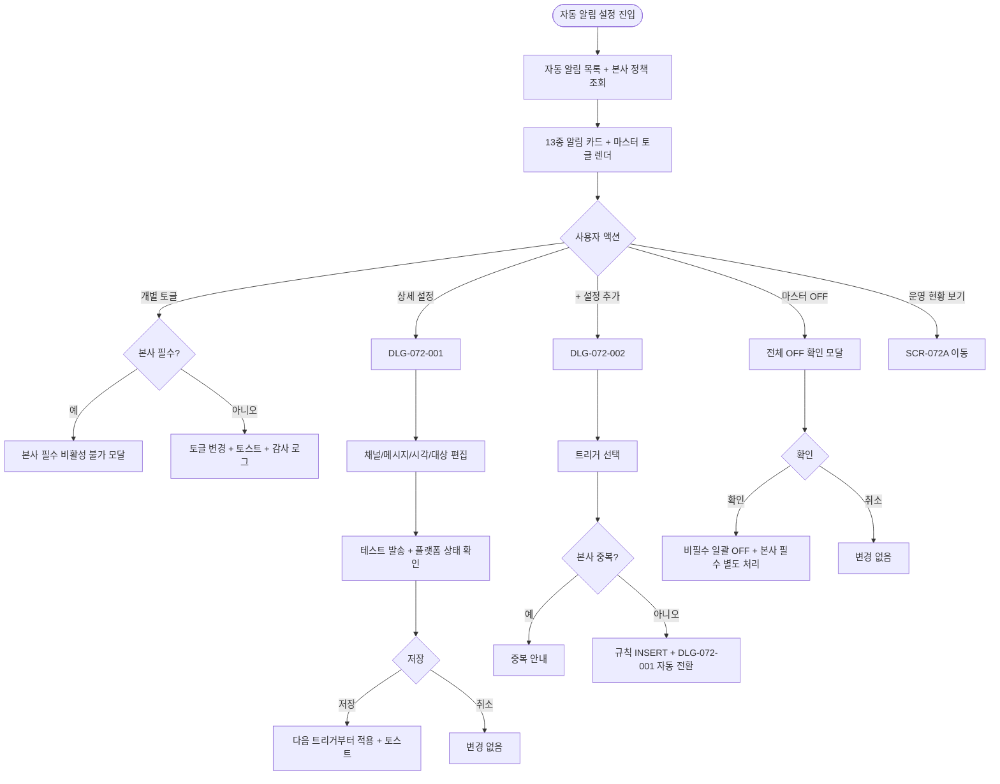
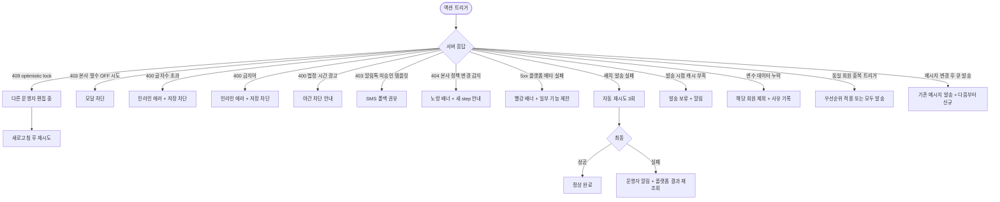

# SCR-072 자동 알림 설정 페이지

## 1. 화면 메타 정보

이 문서는 자동 알림 설정 페이지에 대한 자기완결형 요구사항 정의서입니다. 다른 문서를 함께 보지 않아도 이 문서 한 장만으로 자동 알림 설정 페이지에 들어가는 모든 영역, 모든 토글, 모든 다이얼로그, 모든 권한, 본사 정책 세트 구조와 13종 자동 알림 엔진, 그리고 이 화면을 지탱하는 마케팅 자동화 정책까지 전부 이해하고 구현할 수 있도록 작성합니다.

| 항목 | 값 |
|---|---|
| 작성일 | 2026-05-22 |
| 버전 | v1.0 |
| 상태 | 최신 통합본 반영 (정합화 완료) |
| 도메인 | D08 마케팅 |
| 화면 ID | SCR-072 |
| 화면명 | 자동 알림 설정 |
| 화면 유형 | 허브 화면 (Hub Screen) |
| 라우트 (URL) | `/message/auto-alarm` |
| 플랫폼 | 데스크톱(기본), 태블릿 |
| 우선순위 | P0 (출시 필수) |
| 기능코드 | MKT-02 (자동 알림 설정) |
| 계약코드 | MKT-02 |
| 계약 상태 | 계약 범위 본기능 |
| 부모 기능 prefix | MKT |
| Lv1 코드 | MKT-02 |
| Lv2 / Lv3 세분화 | MKT-02-01 ~ MKT-02-06 (고객 알림 목록, 상품 알림 목록, 토글 활성/비활성, 상세 설정, 전체 ON/OFF, 자동 발송 처리) |
| 연계 화면 | SCR-072A 자동알림운영현황, SCR-071 메시지발송, SCR-097 감사로그 |
| 호출 다이얼로그 | DLG-072-001 알림규칙편집, DLG-072-002 알림트리거추가 |

## 2. 화면 개요와 목적

자동 알림 설정 페이지는 본사 정책 세트로 내려온 만료 step(D-7/D-3/D-1/D-Day/D+1) 5종과, 생일·장기 미방문(30/60/90일)·등록 감사·첫 방문 환영·이용권 만료 당일·홀딩 종료·결제 완료·환불 처리를 포함하는 13종 자동 알림 엔진을 관리하는 화면입니다. 본사가 정의한 필수 step은 지점에서 비활성화할 수 없으며, 채널·메시지·발송 시각·발송 옵션만 지점 운영에 맞게 조정합니다. 매니저는 일일 운영 부담 없이 회원 리텐션 알림을 자동화하고, 본사 슈퍼관리자는 정책 세트로 일관된 회원 경험을 유지합니다.

이 화면이 다루는 핵심 운영 흐름은 다음과 같습니다. 첫째, 본사 만료 step 채널·메시지 지점 톤 조정. D-7 step의 채널을 SMS에서 알림톡으로 바꾸면 비용이 절감되면서도 본사 정책의 발송 시점은 그대로 유지됩니다. 둘째, 지점 자체 운영 알림 활성화. 생일 알림을 ON 시키고 발송 시각을 09:00에서 11:00으로 옮기면 점심 직전 도달율이 높아집니다. 셋째, 명절 기간 일시 중단. 상단 전체 토글을 OFF 하면 본사 필수 step을 제외한 모든 알림이 잠시 멈춥니다. 넷째, 신규 운영 이벤트 추가. DLG-072-002 트리거 라이브러리에서 "노쇼 발생", "출석 100회 달성" 같은 새 트리거를 골라 지점 규칙으로 추가합니다.

자동 알림 채널의 발신 프로필·승인 템플릿·예상 비용·발송 가능 여부는 메시지 플랫폼 API를 조회해 판단하며, 내부 단가 수기 관리는 두지 않습니다. 자동 알림 발송 결과는 일반 발송 이력(MKT-01)과 통합 기록되고, SCR-072A 운영 현황에서 자동 알림만 별도 통계로 집계됩니다.

## 3. 진입 경로와 인접 화면

자동 알림 설정 페이지에 진입하는 경로는 다음과 같습니다.

첫 번째는 사이드바입니다. "마케팅 > 메시지 발송 > 자동 알림 설정" 메뉴를 클릭하면 진입합니다.

두 번째는 메시지 발송 화면(SCR-071)의 자동 알림 섹션 "상세 설정" 버튼입니다. 메시지 발송 화면에서 우측 상단의 "자동 알림 설정으로 이동" 보조 링크를 누르면 SCR-072로 빠르게 이동할 수 있습니다.

세 번째는 SCR-072A 자동 알림 운영 현황에서 "정책 편집"으로 거꾸로 들어오는 경로입니다. 운영 현황에서 특정 알림의 효과를 확인한 후 메시지나 채널을 조정하고 싶을 때 사용합니다.

네 번째는 알림 센터(SCR-104)의 운영 관련 알림 클릭입니다. "본사 필수 step 정의가 변경되었어요", "신규 운영 트리거가 추가되었어요" 같은 알림은 SCR-072로 이동하면서 해당 규칙으로 자동 스크롤됩니다.

다섯 번째는 회원 운영 도중 "이 회원이 받은 자동 알림" 링크 클릭입니다. 회원 상세(SCR-M004)의 활동 이력에서 자동 알림 발송 행을 클릭하면 SCR-072의 해당 규칙으로 이동합니다.

이 화면에서 빠져나가는 인접 화면은 자동 알림 운영 현황(SCR-072A), 메시지 발송(SCR-071), 감사 로그(SCR-097)입니다.

## 4. 레이아웃과 UI 구성

자동 알림 설정 페이지는 위에서 아래로 정책 단위로 그룹화된 세로형 레이아웃을 사용합니다. 데스크톱에서는 본문이 전체 폭을 사용하고, 우측에 상세 설정 패널이 슬라이드 인 됩니다.

가장 위에는 페이지 헤더가 있습니다. 헤더 좌측에는 "자동 알림 설정"이라는 페이지 타이틀과 함께, 본사 정책 세트 정보(예: "본사 정책 세트: 표준형(D-7/D-3/D-1/D-Day/D+1)")가 회색 배지로 표시됩니다. 헤더 우측에는 전체 자동 알림 ON/OFF 마스터 토글이 큼지막하게 배치되어 있고, 그 옆에 "운영 현황으로 이동" 보조 버튼이 있어 SCR-072A로 바로 갈 수 있습니다.

페이지 헤더 바로 아래에는 전체 ON/OFF 토글의 안내 영역이 있습니다. 토글이 켜져 있으면 "모든 자동 알림이 활성화되어 있습니다"라는 녹색 안내, 꺼져 있으면 "본사 필수 step을 제외한 모든 알림이 일시 중단되었습니다" 회색 안내가 표시됩니다. 본사 필수 step 처리 정책(`hq_required_continue`)이 활성화된 테넌트에서는 추가 안내 "본사 필수 step은 계속 발송됩니다"가 함께 표시됩니다.

전체 ON/OFF 영역 아래에는 알림 그룹 섹션이 세로로 배치됩니다. 섹션은 카테고리별로 3그룹으로 묶입니다.

첫 번째 그룹은 "고객 관련 알림"입니다. 만료 step(본사 필수, D-7 / D-3 / D-1 / D-Day / D+1 5개 행) + 생일 축하 + 장기 미방문(30/60/90일) + 등록 감사 + 첫 방문 환영. 각 알림 규칙은 가로로 펼쳐진 카드 형태이며, 카드 내부에는 좌측부터 알림명(예: "본사 만료 step D-7 알림"), 본사 필수 여부 배지(있으면 "본사 필수" 잠금 아이콘, 없으면 "지점 운영"), 채널 배지(SMS/알림톡/푸시), 발송 시각(예: "09:00"), 활성 토글, 플랫폼 상태 배지(승인 템플릿 OK / 발신 프로필 OK / 최근 테스트 OK), 우측 끝의 "상세 설정" 버튼이 배치됩니다.

두 번째 그룹은 "상품 관련 알림"입니다. 이용권 만료 당일(D-Day) + 홀딩 종료 + 결제 완료 + 환불 처리 + 미수금 발생 + 재등록 쿠폰 동봉 발송. 동일한 카드 형식으로 표시됩니다.

세 번째 그룹은 "예약/출석 관련 알림"입니다. 예약 확정 + 예약 취소 + 대기열 승격 + 노쇼 발생 + 출석 N회 달성 + 첫 방문 완료. 운영 이벤트 기반 규칙이며 동일한 카드 형식.

각 그룹의 맨 아래에는 "+ 설정 추가" 버튼이 있어 DLG-072-002 알림 트리거 라이브러리에서 새 규칙을 추가할 수 있습니다. 본사 필수 step은 자동으로 추가되어 있어 별도 추가가 불가능합니다.

본사 필수 step 카드는 시각적으로 다르게 표시됩니다. 잠금 아이콘이 카드 좌상단에 표시되고, 활성 토글이 disabled(누를 수 없음) 상태이며, 카드 바탕이 약간 어두운 회색 톤으로 처리되어 "본사 정책으로 비활성화 불가"임이 한 눈에 보입니다. 토글 클릭 시도 시 "본사 필수 step은 비활성화 불가" 모달이 즉시 뜹니다.

활성/비활성 상태 시각화: 활성 토글은 녹색, 비활성은 회색, 본사 필수는 녹색 + 잠금. 전체 OFF 상태에서는 본사 필수 step을 제외한 모든 카드가 회색으로 흐려져 한 눈에 일시 중단 상태임을 알 수 있습니다.

플랫폼 상태 배지가 모든 카드에 표시됩니다. 승인 템플릿 OK는 작은 녹색 체크, 발신 프로필 미설정은 노랑 경고, 최근 테스트 실패는 빨강 X. 운영자가 카드만 봐도 현재 발송 가능 여부를 알 수 있어야 합니다.

상세 설정 버튼을 누르면 우측에 상세 설정 패널이 슬라이드 인 되거나(데스크톱), DLG-072-001 알림 규칙 편집 모달이 화면 중앙에 뜹니다(태블릿/모바일).

페이지 우측 하단에는 fixed로 "운영 현황 보기" 플로팅 버튼이 있어, 어디서나 SCR-072A로 즉시 이동할 수 있습니다.

## 5. 13종 알림 엔진 구조

이 화면이 다루는 13종 자동 알림 엔진을 상세히 풀어 정의합니다.

만료 step(본사 필수 5종): D-7(만료 7일 전), D-3(3일 전), D-1(1일 전), D-Day(당일), D+1(만료 다음 날). 본사 정책 세트로 정의되며 지점에서 비활성화 불가. 트리거 발송 시점은 매일 04:00 일배치로 대상 회원 추출 + 설정 시각에 발송. 변수 치환: {회원명}, {만료일}, {잔여횟수}, {담당FC} 사용. 메시지 예: "{회원명}님, 이용권이 7일 후 만료됩니다. 재등록하시려면 담당 FC {담당FC}에게 문의해주세요."

생일 축하 알림: 매년 회원 생일 당일 발송. 트리거는 매일 04:00 일배치로 당일 생일 회원 추출 + 설정 시각(기본 09:00, 지점 변경 가능)에 발송. 생일 쿠폰 자동 발급 옵션과 연동 가능. 메시지 예: "{회원명}님, 생일을 축하드려요!"

장기 미방문 알림: 마지막 출석일 +30/60/90일 경과 시 발송. 각 일수별 별도 규칙으로 관리되어 30일 미방문 ON, 60일 OFF처럼 단계별 운영 가능. 일배치 매일 04:00.

등록 감사 알림: 회원 신규 등록 webhook 트리거로 즉시(1분 이내) 발송. 환영 메시지 + 첫 방문 안내 + 담당 FC 소개.

첫 방문 환영 알림: 회원 첫 출석 webhook 트리거(출석 카운트 1)로 즉시 발송. PT 체험 안내 추가 가능.

이용권 만료 당일 알림: 만료일 00:00 트리거로 09:00(지점 설정 가능) 발송. 만료 step D-Day와 통합 또는 분리 운영 가능.

홀딩 종료 알림: 홀딩 자동 재개 트랜잭션 트리거로 즉시 발송. 회원 재방문 유도.

결제 완료 알림: 결제 완료 webhook 트리거로 즉시 발송. 영수증 메시지 첨부.

환불 처리 알림: 환불 트랜잭션 트리거로 즉시 발송. 환불 내역 안내.

이 외에 지점 운영용 규칙으로 추가 가능한 트리거: 예약 확정, 예약 취소, 대기열 승격, 노쇼 발생, 출석 N회 달성, 첫 방문 완료, 미수금 발생, 재등록 대상 편입.

각 알림은 우선순위 정책으로 충돌 처리됩니다. 동일 회원에게 같은 시점 여러 알림 트리거 시 D-Day > D-1 > D-3 > D-7 > 기타 순으로 1개만 발송하거나(테넌트 정책 `single_priority`) 모두 발송(`all_send`) 합니다.

법정 시간(21~08시)은 영업/광고 알림(생일·미방문·등록 감사·첫 방문)에 적용되어 차단되고, 정보성(결제·환불·홀딩 종료·만료 D-Day)은 예외로 허용됩니다.

## 6. 버튼·아이콘·링크 액션 전체 정의

전체 ON/OFF 마스터 토글은 페이지 헤더에서 가장 강조됩니다. 토글 클릭 시 확인 모달이 뜹니다. OFF로 바꿀 때는 "본사 필수 step은 별도 처리됩니다(설정에 따라 계속 발송 또는 같이 중단)"라는 안내와 함께 yes/no 확인을 받습니다. 확인 후 모든 비필수 알림이 즉시 중단되며, 본사 필수 step은 `hq_required_continue` 정책에 따라 계속 발송되거나 같이 중단됩니다.

각 알림 카드의 활성 토글은 클릭 즉시 ON/OFF가 적용되고 우측 상단에 "활성화/비활성화했어요" 토스트가 표시됩니다. 본사 필수 step의 토글은 disabled 상태이며 클릭 시 "본사 필수 step은 비활성화 불가" 모달이 뜹니다.

각 알림 카드의 "상세 설정" 버튼은 DLG-072-001 알림 규칙 편집 모달을 엽니다. 본사 영역(기준일·트리거 조건)은 읽기 전용, 지점 영역(채널·메시지·발송 시각·발송 옵션)만 편집 가능합니다.

각 그룹 하단의 "+ 설정 추가" 버튼은 DLG-072-002 알림 트리거 추가 모달을 엽니다. 트리거 라이브러리에서 새 규칙을 선택하면 곧바로 DLG-072-001로 넘어가 세부 채널/메시지를 편집할 수 있습니다.

본사 필수 step 카드의 잠금 아이콘은 호버 시 툴팁 "본사 정책으로 비활성화할 수 없습니다"가 표시됩니다.

플랫폼 상태 배지는 호버 시 상세 정보 툴팁을 표시합니다. 승인 템플릿 OK는 "사전 승인된 알림톡 템플릿 사용 중", 발신 프로필 미설정은 "발신 번호 또는 카카오 발신 프로필이 미설정 - 클릭하여 설정"으로 이동 안내.

플랫폼 정보 카드 자체는 SCR-072에 별도 표시되지 않고, 각 알림 카드의 플랫폼 상태 배지로 분산 표시됩니다. 단, 페이지 진입 시 플랫폼 메타데이터 조회 실패 시에는 화면 상단에 빨강 톤 배너가 표시되며 "플랫폼 메타데이터를 불러오지 못했습니다. 일부 기능이 제한됩니다"라는 안내가 표시됩니다.

페이지 우측 하단 fixed의 "운영 현황 보기" 플로팅 버튼은 SCR-072A로 즉시 이동합니다.

알림 카드의 알림명을 클릭하면 그 알림의 SCR-072A 운영 현황 상세로 이동해, 해당 알림의 발송 통계·성공률·전환율을 즉시 확인할 수 있습니다.

본사 정책 세트가 변경되어 신규 step이 추가되면, 페이지 진입 시 화면 상단에 "본사에서 새 step이 추가되었어요" 노랑 톤 안내 배너가 표시되며 "확인" 버튼 클릭으로 닫을 수 있습니다.

모든 토글과 버튼은 클릭 후 응답이 돌아오기 전까지 자동으로 비활성화되어 더블클릭이나 연타로 인한 중복 요청이 차단됩니다.

## 7. 호출되는 모달 동작

### 7-1. DLG-072-001 알림 규칙 편집 다이얼로그

특정 알림 규칙의 상세 설정을 편집하는 모달입니다. 알림 카드의 "상세 설정" 버튼을 누르면 열립니다.

모달 상단에는 편집 중인 규칙 이름(예: "본사 만료 step D-20 알림", "장기 미방문 알림")이 표시됩니다.

모달 본문은 발송 시점 설정, 채널 선택, 플랫폼 연동 정보, 발송 시각, 대상 조건 설정, 메시지 내용, 테스트 발송 영역으로 구성됩니다.

발송 시점 설정 영역에서는 본사 소유 만료 step의 경우 기준일이 읽기 전용으로 표시됩니다(예: "본사 정책: 만료일 7일 전"). 지점 자체 운영 이벤트 규칙(생일·장기 미방문·등록 감사 등)이면 이벤트 기준 전·당일·후 숫자 입력이 가능합니다(예: "마지막 출석일 +30일").

발송 채널 선택 영역에서는 알림톡 / SMS / 앱 푸시 중 선택합니다. 채널별 예상 비용(플랫폼 API 응답)과 폴백 규칙(알림톡 비친구 → SMS)이 함께 표시됩니다.

플랫폼 연동 정보 영역에는 사용 중인 발신 프로필, 승인 템플릿 상태, 최근 테스트 발송 결과가 표시됩니다.

발송 시각 영역에서는 시·분 단위 시각을 설정합니다(예: 09:00). 법정 시간(21~08시) 안에 영업/광고 알림 시각 설정 시 인라인 에러 "야간 광고 발송 불가". 정보성 알림은 예외.

대상 조건 설정 영역은 상품군(정기권/PT/필라테스), 회원 상태(활성/만료/홀딩), 예약 상태(예약 있음/없음), 미수금 유무, 방문경로 등 발송 대상 세부 조건을 추가합니다.

메시지 내용 영역은 textarea와 변수 삽입 버튼({회원명}, {만료일}, {잔여횟수}, {담당FC} 4종)으로 구성됩니다. 글자수 카운트는 채널별로 표시되며 한도 초과 시 차단. 금지어 포함 시 차단.

테스트 발송 버튼은 운영자 본인 또는 지정 관리자 번호로 시범 발송을 수행합니다. 실제 회원 발송과 별도 카운트.

모달 하단에는 저장과 취소 버튼이 있습니다. 저장 시 변경 사항이 다음 트리거부터 적용되며, 이미 큐에 등록된 발송은 기존 메시지로 발송됩니다. 동시 편집 충돌(optimistic lock)이 발생하면 "다른 운영자가 편집 중" 모달이 뜨고 새로고침 후 재시도 안내.

### 7-2. DLG-072-002 알림 트리거 추가 다이얼로그

지점 운영 규칙을 새로 추가하는 모달입니다. 각 그룹 하단의 "+ 설정 추가" 버튼을 누르면 열립니다.

모달 상단에는 검색창이 있어 트리거명으로 빠르게 찾을 수 있습니다.

모달 본문 좌측에는 카테고리 그룹이 트리 형태로 배치됩니다(고객 / 상품 / 예약 / 출석 / 결제 / CRM). 본문 가운데에는 선택한 카테고리의 트리거 목록이 표시되며, 예: 생일, 장기 미방문, 이용권 만료 D-N, 예약 확정, 예약 취소, 노쇼 발생, 출석 N회 달성, 첫 방문, 미수금 발생, 재등록 대상 편입.

본문 우측에는 선택된 트리거의 설명 패널이 있어 발생 조건, 발송 시점 추천, 기본 변수, 기본 채널을 요약 표시합니다.

본사 필수 정책과 중복되는 트리거는 추가할 수 없고 "이미 본사 정책으로 운영 중입니다, 기존 정책으로 이동" 안내가 표시됩니다. 동일 지점에 같은 트리거가 이미 활성화되어 있으면 "이미 활성화되어 있어요" 중복 경고가 노출됩니다.

추가 버튼을 누르면 선택한 트리거가 지점 규칙으로 INSERT 되고, 곧바로 DLG-072-001로 자동 전환되어 세부 채널/메시지 편집을 이어갑니다. 취소는 추가 없이 닫힙니다.

### 7-3. 본사 필수 step 비활성 시도 모달

본사 필수 step 카드의 잠금 토글을 클릭하면 즉시 뜨는 보조 모달입니다. "본사 필수 step은 비활성화 불가"라는 제목과 함께 "본사 정책 세트로 정의된 필수 알림은 지점에서 비활성화할 수 없습니다. 채널·메시지·발송 시각만 조정 가능합니다"라는 안내가 표시되고 "상세 설정으로 이동" 버튼이 있어 DLG-072-001로 바로 들어갈 수 있습니다.

### 7-4. 전체 OFF 확인 모달

전체 ON/OFF 토글을 OFF로 바꾸려고 할 때 뜨는 모달입니다. "모든 자동 알림을 일시 중단하시겠습니까?"라는 제목과 함께 "본사 필수 step은 별도 처리됩니다(`hq_required_continue` 정책에 따라 계속 발송 또는 같이 중단)"라는 안내가 표시되고, "확인"과 "취소" 버튼이 있습니다. 확인 시 모든 비필수 알림이 즉시 중단되며 토글이 OFF로 적용됩니다.

## 8. 토스트와 확인 팝업과 알럿

성공 토스트: "알림을 활성화했어요", "알림을 비활성화했어요", "상세 설정을 저장했어요", "새 규칙을 추가했어요", "테스트 발송 완료", "모든 알림을 일시 중단했어요"가 우측 상단에 녹색 5초 표시.

실패 토스트: "다른 운영자가 편집 중", "권한이 없어요", "플랫폼 메타데이터 조회 실패"가 빨강 톤으로 표시.

확인 팝업: 본사 필수 step 비활성 시도 시 "본사 필수 step은 비활성화 불가" 모달. 전체 OFF 시 yes/no 확인. 상세 설정 편집 중 ESC 또는 배경 클릭으로 닫으려고 할 때 "변경 사항이 사라집니다. 닫으시겠습니까?" 확인.

알럿: 권한 없는 계정(FC/트레이너/스태프/readonly) 직접 URL 접근 시 차단 화면 + 대시보드 자동 이동. 본사에서 신규 step이 추가되면 노랑 톤 배너 알림.

플랫폼 메타데이터 조회 실패 시 화면 상단에 빨강 배너 + "일부 기능이 제한됩니다" 안내.

## 9. 데이터 흐름과 외부 연동

화면 진입 시점에는 자동 알림 목록 조회 API(`GET /api/auto-alerts`)가 호출됩니다. 응답으로는 13종 알림 + 추가된 지점 규칙의 활성 상태, 채널, 메시지, 발송 시각, 플랫폼 상태, 본사 필수 여부가 카드 단위로 내려옵니다.

본사 정책 조회 API(`GET /api/auto-alerts/headquarters-policy`)는 본사 정책 세트의 정의를 가져옵니다. 본사 필수 step의 기준일·트리거 조건·기본 채널이 응답에 포함되며, 변경 시점에는 모든 지점에 즉시 동기화됩니다.

토글 변경은 `PUT /api/auto-alerts/:id/toggle`로 처리되며 (rule_id, active)를 받습니다. 본사 필수 step에 대한 OFF 요청은 백엔드에서 거절됩니다.

상세 설정 저장은 `PUT /api/auto-alerts/:id/settings`로 처리되며 (channel, message, send_time, target_filter, options)를 받습니다. 동시 편집 충돌은 optimistic lock으로 차단.

전체 ON/OFF는 `PUT /api/auto-alerts/master`로 처리되며 (master_active, hq_required_continue)를 받습니다.

새 규칙 추가는 `POST /api/auto-alerts`로 처리되며 (trigger_id, settings)를 받습니다.

자동 발송 처리는 백엔드 배치와 webhook으로 진행됩니다. 만료 step 일배치(매일 04:00)는 D-7/D-3/D-1/D-Day/D+1 대상 회원을 추출해 각 설정 시각에 발송 큐에 등록합니다. 생일 일배치는 당일 생일 회원을 추출해 09:00(설정 시각)에 발송. 장기 미방문 일배치는 30/60/90일 미방문 회원을 추출. 등록 감사·첫 방문·결제·환불·홀딩 종료는 이벤트 webhook 트리거로 즉시(1분 이내) 발송.

발송 결과는 SCR-071 메시지 발송 이력 테이블에 통합 기록되며, SCR-072A 운영 현황에서 자동 알림만 별도 통계로 집계됩니다(매시간 집계 배치).

자동 재시도 큐는 발송 실패 시 1분/5분/30분 간격으로 3회 재시도. 최종 실패 시 운영자에게 알림 발송.

본사 step 정의 변경은 슈퍼관리자가 변경 시 즉시 모든 지점에 동기화되며 알림 센터로 변경 안내가 발송됩니다.

플랫폼 메타데이터 조회(승인 템플릿·발신 프로필·예상 비용)는 규칙 편집/테스트 발송 시점에 호출됩니다.

플랫폼 잔여 캐시 부족 알림은 발송 시점에 부족 감지 시 운영자에게 알림이 발송됩니다.

토글 변경·상세 설정 변경·전체 ON/OFF·신규 규칙 추가·테스트 발송 모두 SCR-097 감사 로그에 기록됩니다(actor_id, rule_id, action, old_value, new_value, timestamp).

화면에서 호출하는 주요 API 엔드포인트는 다음과 같습니다. 알림 목록 조회 `GET /api/auto-alerts`, 토글 변경 `PUT /api/auto-alerts/:id/toggle`, 상세 설정 변경 `PUT /api/auto-alerts/:id/settings`, 본사 정책 조회 `GET /api/auto-alerts/headquarters-policy`, 발송 이력 조회 `GET /api/auto-alerts/run-history`, 전체 ON/OFF `PUT /api/auto-alerts/master`, 새 규칙 추가 `POST /api/auto-alerts`, 트리거 라이브러리 조회 `GET /api/auto-alerts/triggers`, 테스트 발송 `POST /api/auto-alerts/:id/test`.

## 10. 화면 상태와 예외 처리

로딩 중: 알림 카드 자리에 스켈레톤 표시, 토글과 버튼은 잠시 비활성.

알림 활성: 토글 ON, 카드 정상 톤.

알림 비활성: 토글 OFF, 카드 회색 톤.

본사 필수 step 잠금: 토글 disabled, 카드 어두운 회색 + 잠금 아이콘.

전체 비활성: 마스터 토글 OFF, 본사 필수 제외 모든 카드 회색 흐림 톤 + 안내.

플랫폼 메타데이터 조회 실패: 화면 상단 빨강 배너 + 일부 기능 제한 안내.

발송 시점 플랫폼 잔여 캐시 부족: 발송 보류 + 운영자 알림(알림 센터). 화면에는 표시되지 않고 알림으로만 전달.

변수 데이터 누락: 해당 회원 발송 제외 + 운영 현황에 사유 기록(SCR-072A에서 확인).

법정 시간 발송 시각 설정 시도 (광고 알림): DLG-072-001 안에서 인라인 "21~08시는 광고 발송 불가". 정보성은 허용.

금지어 포함 메시지: DLG-072-001 안에서 인라인 "금지어 포함: {단어}" + 저장 차단.

알림톡 미승인 템플릿 채널 선택: "사전 승인 템플릿이 필요합니다" 안내 + SMS 자동 변경 권유.

발송 실패 (외부 API): 자동 재시도 3회 + 최종 실패 시 알림 + 플랫폼 결과 재조회.

동일 회원 중복 트리거: 우선순위 정책 적용(1개 또는 모두 발송).

메시지 변경 후 큐 발송: 기존 메시지로 발송, 다음 트리거부터 신규 메시지 적용.

본사 step 신규 추가: 비활성 상태로 자동 추가 + 노랑 배너 알림.

토글 변경 동시 충돌: optimistic lock + 새로고침 후 재시도 안내.

SCR-072A 운영 현황 데이터 누락: "데이터 집계 중" 안내 + 6시간 후 재조회.

권한 부족 접근: 화면 미노출.

## 11. 권한별 처리

슈퍼관리자·본사 최고관리자: 본사 step 정의 + 전 지점 알림 정책 + 마스터 토글 + 신규 규칙 추가.

센터장·매니저: 소속 지점 알림 활성/비활성 + 상세 설정 + 신규 규칙 추가 + 마스터 토글. 본사 step 비활성 불가.

FC·트레이너·스태프·readonly: 화면 자체 접근 차단. 사이드바 메뉴 미노출, 직접 URL 접근 시 접근 제한 화면.

## 12. 메인 흐름

## 13. 에러와 예외 흐름

## 14. 핵심 디자인 요청사항

알림 카드는 행 단위로 깔끔하게 정렬되며, 카드 좌측에 알림명·본사 필수 배지, 가운데에 채널·시각·플랫폼 상태, 우측에 활성 토글과 상세 설정 버튼이 배치됩니다. 본사 필수 카드는 잠금 아이콘 + 어두운 톤으로 시각적으로 구분되어야 합니다.

마스터 토글은 헤더에 큼지막하게 배치되어 한 눈에 인지 가능해야 합니다. ON은 녹색, OFF는 회색.

플랫폼 상태 배지는 작은 아이콘 형태(녹색 체크 / 노랑 경고 / 빨강 X)로 표시되며, 호버 시 툴팁으로 상세 정보를 보여줍니다.

알림 그룹 섹션은 카테고리별 헤더로 구분되어 한 눈에 13종 알림의 카테고리를 파악할 수 있어야 합니다. 헤더 우측의 "+ 설정 추가" 버튼은 강조 톤으로 표시.

DLG-072-001 모달은 발송 시점·채널·시각·대상·메시지를 위에서 아래로 단계별로 입력하도록 구성되며, 본사 영역(읽기 전용)은 회색 톤으로 시각적으로 구분됩니다.

DLG-072-002 모달은 트리거 라이브러리 형식으로 좌측 카테고리 트리 + 가운데 트리거 목록 + 우측 설명 패널의 3분할 레이아웃을 사용합니다.

플로팅 "운영 현황 보기" 버튼은 우측 하단 fixed로 어디서나 SCR-072A로 즉시 이동 가능해야 합니다.

태블릿/모바일에서는 카드가 세로로 스택되고 상세 설정은 풀스크린 모달로 자동 전환됩니다.

## 15. 운영 정책 (이 화면에 연결된 부분)

자동화 정책 구조는 본사 정책 세트와 지점 적용 정책의 2단 구조로 운영됩니다. 본사는 만료 알림 정책 세트(만료 step 5종)와 13종 자동 알림 트리거를 정의하며, 지점은 본사가 허용한 범위 안에서만 step 비활성화 또는 채널·메시지·시각 조정이 가능합니다. 지점이 본사 미등록 기준일 step을 임의로 만드는 구조는 기본값으로 허용하지 않습니다.

기존의 고정 D-30/D-14/D-7/D-3/D-1 전제는 운영 기준으로 사용하지 않습니다. 본사가 실제 운영 전략에 따라 입력한 step만 운영 기준입니다. 정책 예시로 표준형(D-30/D-20/D-7/D-3/D-1), 집중형(D-20/D-10/D-3/D-1), 최소형(D-7/D-1) 등이 가능합니다.

자동화 대상은 다음과 같습니다. 정기 이용권 만료 임박, PT 이용권 잔여 회차 부족 또는 만료 임박, 골프 이용권 만료 임박, 락커/부가서비스 만료 임박, 예약 확정/변경/취소, 노쇼 경고, 생일/휴면/재방문 유도.

본사 원칙: 본사는 전사 기준 정책 세트를 등록한다. 본사는 상품군별 권장 정책을 정한다. 본사는 알림 문구 템플릿과 채널 우선순위를 정한다. 본사는 지점이 수정 가능한 범위를 설정한다.

지점 원칙: 지점은 정책 세트를 새로 만들지 않고 본사 등록 step을 기준으로 적용 정책을 수립한다. 지점은 허용된 step만 비활성화할 수 있다. 지점은 본사가 허용한 경우에 한해 발송 채널만 조정할 수 있다.

만료 기준 계산 원칙: 만료 기준은 실제 조정된 만료일을 따른다. 홀딩이 있으면 홀딩 반영 후 만료일을 기준으로 재계산한다. 환불/취소로 종료된 이용권은 이후 만료 알림 대상에서 제외한다. 이미 재등록이 완료된 경우 이전 이용권 기준 알림은 중단한다.

운영 예외 처리: 수신 동의가 없는 채널은 자동 제외한다. 동일 회원에게 같은 날 중복 성격의 알림이 많으면 묶음 처리 기준을 둔다. 담당 FC가 없는 회원은 지점 공용 큐로 보낸다. 지점이 정책을 바꾸면 변경 시점 이후 대상부터 새 정책을 적용한다.

회원앱/관리자웹 연계: 회원앱 알림 목록은 자동화 발송 이력과 일관되어야 한다. 관리자 웹에서는 발송 여부뿐 아니라 후속 처리 상태까지 봐야 한다. 만료 알림은 단순 발송으로 끝나지 않고 상담/결제 액션 큐와 연결되어야 한다.

자동 알림 13종 엔진: 만료 step(D-7/D-3/D-1/D-Day/D+1) + 생일 + 장기 미방문(30/60/90) + 등록 감사 + 첫 방문 환영 + 이용권 만료 당일 + 홀딩 종료 + 결제 완료 + 환불 처리.

본사 필수 step: D-7/D-3/D-1/D-Day/D+1 만료 step은 본사 정책으로 비활성화 불가. 토글 잠금.

본사 영역 읽기 전용: 본사 소유 기준일·트리거 조건은 지점에서 편집 불가. 채널·메시지·발송 시각·발송 옵션만 지점에서 편집 가능.

트리거 발송 시점: 만료 step은 일배치 04:00에 대상 회원 추출 + 설정 시각 발송. 결제·환불·홀딩 종료는 이벤트 즉시. 첫 방문은 출석 webhook 트리거.

발송 결과 통합: 자동 알림 발송 결과는 SCR-071 메시지 발송 이력에 통합 기록. SCR-072A 운영 현황에서 자동 알림만 별도 통계.

변수 치환: {회원명}/{만료일}/{잔여횟수}/{담당FC} 4종. 누락 회원 발송 제외 + 사유 기록.

플랫폼 기준 발송 가능 여부: 자동 알림도 일반 발송과 동일하게 플랫폼 잔여 캐시/발송 가능 여부를 확인. 부족 시 발송 보류 + 운영자 알림.

수신 거부 / 휴면 자동 제외: 회원 수신 거부 등록 또는 휴면 회원은 자동 제외.

법정 시간 차단: 영업/광고 알림(생일·미방문·등록 감사·첫 방문)은 21~08시 차단. 정보성(결제·환불·홀딩 종료·만료 D-Day)은 예외.

금지어 차단: 메시지에 사전 등록 금지어 포함 시 저장 차단.

알림톡 사전 승인: 알림톡 채널 선택 시 사전 승인 템플릿 필요. 미승인 시 SMS 자동 폴백 또는 차단.

전체 ON/OFF: 상단 토글 OFF 시 모든 비필수 알림 중단. 본사 필수 step은 `hq_required_continue` 정책에 따라 계속 발송 또는 같이 중단.

자동 재시도: 발송 실패 시 1분/5분/30분 3회 재시도 + 최종 실패 시 운영자 알림.

우선순위 정책: 동일 회원에게 같은 시점 여러 알림 트리거 시 우선순위 정의(D-Day > D-1 > D-3 > D-7 > 기타) 또는 모두 발송(테넌트 정책).

메시지 변경 적용 시점: 저장 후 다음 트리거부터 적용. 이미 큐 등록된 발송은 기존 메시지 유지.

테스트 발송: 운영자 본인 번호로 시범 발송 가능. 실제 회원 발송과 별도 카운트.

본사 step 추가 시: 신규 step 자동 추가, 지점은 비활성 상태로 노출 + 알림.

만료 step 트리거 정의: D-7(만료 7일 전), D-3(3일 전), D-1(1일 전), D-Day(당일), D+1(만료 다음 날). 각 step 발송 시각 지점 설정.

장기 미방문 트리거: 마지막 출석일 +30/60/90일 매일 04:00 배치로 대상 추출.

생일 트리거: 회원 생일 당일 09:00(지점 설정 가능).

첫 방문 환영 트리거: 회원 첫 출석(출석 카운트 1) webhook 즉시.

결제·환불·홀딩 종료 트리거: 이벤트 발생 즉시(1분 이내).

감사 로그: 토글 변경·상세 설정 변경·전체 ON/OFF·신규 규칙 추가 모두 SCR-097 기록.

이상의 모든 정책은 이 화면을 구현·운영하는 사람이 별도 문서 없이 이 한 장만 보면 이해할 수 있도록 풀어 적었습니다.
