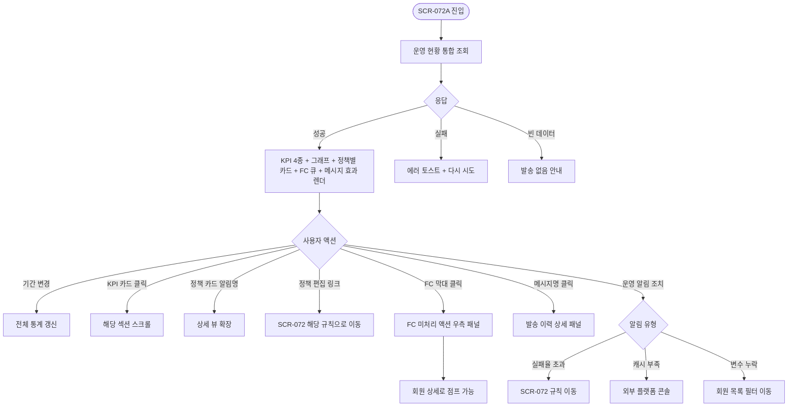

# SCR-072A 자동 알림 운영 현황 페이지

## 1. 화면 메타 정보

이 문서는 자동 알림 운영 현황 페이지에 대한 자기완결형 요구사항 정의서입니다. 다른 문서를 함께 보지 않아도 이 문서 한 장만으로 자동 알림 운영 현황 페이지에 들어가는 모든 영역, 모든 버튼, 모든 통계 카드, 모든 권한, 모든 예외 처리, 그리고 이 화면을 지탱하는 자동화 운영 정책까지 전부 이해하고 구현할 수 있도록 작성합니다.

| 항목 | 값 |
|---|---|
| 작성일 | 2026-05-22 |
| 버전 | v1.0 |
| 상태 | 최신 통합본 반영 (정합화 완료) |
| 도메인 | D08 마케팅 |
| 화면 ID | SCR-072A |
| 화면명 | 자동 알림 운영 현황 |
| 화면 유형 | 운영 현황 화면 (Monitoring Screen) |
| 라우트 (URL) | `/message/auto-alarm/status` |
| 플랫폼 | 데스크톱(기본), 태블릿 |
| 우선순위 | P1 (출시 후 권장) |
| 기능코드 | MKT-02 (자동 알림 설정의 운영 현황 측) |
| 계약코드 | MKT-02 |
| 계약 상태 | 계약 범위 본기능 |
| 부모 기능 prefix | MKT |
| Lv1 코드 | MKT-02 |
| Lv2 / Lv3 세분화 | F-072A-01 자동알림 적용 현황 확인 |
| 연계 화면 | SCR-072 자동알림설정, SCR-071 메시지발송, SCR-097 감사로그 |
| 호출 다이얼로그 | 없음 |

## 2. 화면 개요와 목적

자동 알림 운영 현황 페이지는 자동화 정책의 운영 결과를 마케팅 관점에서 확인하는 모니터링 화면입니다. 정책 생성·편집은 SCR-072에서 진행하며, 이 화면은 정책 생성 화면이 아니라 운영 현황 화면이라는 것이 핵심 디자인 원칙입니다. 매니저는 현재 적용 중인 자동 알림 정책과 발송 현황을 확인하면서 메시지 효과를 분석하고, FC는 후속 액션 연결 상황을 보면서 본인 담당 회원의 자동 알림 도달 여부를 파악합니다.

이 화면에서 다루는 정보는 다음과 같습니다. 첫째, 적용 정책 요약. 현재 활성/비활성 상태인 자동 알림 13종 + 지점 운영 규칙의 현재 운영 상태를 카드 형태로 한눈에 보여줍니다. 둘째, 발송 현황. 어제·이번 주·이번 달 자동 알림 발송 건수와 채널별 분포, 성공률/실패율, 변환된 회원 액션(클릭·재등록·예약 등) 통계를 시각화합니다. 셋째, FC 후속 액션 연결. 만료 알림 발송 후 담당 FC에게 재등록 상담 액션 큐가 연결되었는지, 후속 처리가 어느 정도 진행됐는지를 추적합니다. 넷째, 운영 KPI. 재등록 상담 완료 건수와 재등록 성공률, 메시지별 클릭율과 전환율을 KPI 카드로 표시해 마케팅 효과를 정량 측정합니다.

이 화면은 단순한 데이터 대시보드가 아니라, 자동 알림이 단순 발송으로 끝나지 않고 상담/결제 액션 큐와 연결되어야 한다는 운영 원칙을 시각적으로 반영합니다.

## 3. 진입 경로와 인접 화면

자동 알림 운영 현황 페이지에 진입하는 경로는 다음과 같습니다.

첫 번째는 SCR-072 자동 알림 설정 페이지의 헤더 우측 "운영 현황으로 이동" 버튼 또는 화면 우측 하단 fixed 플로팅 버튼입니다.

두 번째는 SCR-072 알림 카드의 알림명 직접 클릭입니다. 특정 알림의 발송 통계를 빠르게 보고 싶을 때 사용하며, 진입 시 그 알림의 상세 통계 섹션으로 자동 스크롤됩니다.

세 번째는 사이드바의 "마케팅 > 메시지 발송 > 자동 알림 설정"에서 추가 메뉴로 "자동 알림 운영 현황" 항목을 클릭하는 경로입니다. 메뉴는 SCR-072 하위에 들여쓰기로 노출됩니다.

네 번째는 대시보드(SCR-101)의 자동 알림 KPI 카드 클릭입니다. "이번 주 자동 알림 발송", "재등록 성공률" 같은 카드를 누르면 SCR-072A로 이동하면서 해당 기간 필터가 자동 적용됩니다.

이 화면에서 다시 빠져나가는 인접 화면은 자동 알림 설정(SCR-072), 메시지 발송(SCR-071), 감사 로그(SCR-097)이며, FC 후속 액션 연결 영역에서는 회원 상세(SCR-M004)와 리드 관리(SCR-070)로 직접 점프할 수 있습니다.

## 4. 레이아웃과 UI 구성

자동 알림 운영 현황 페이지는 위에서 아래로 KPI → 발송 통계 → 정책별 현황 → 후속 액션 연결 순으로 정보가 쌓이는 세로형 레이아웃을 사용합니다.

가장 위에는 페이지 헤더가 있습니다. 헤더 좌측에는 "자동 알림 운영 현황"이라는 페이지 타이틀과 함께 마지막 집계 시각(예: "마지막 집계: 2026-05-22 04:00")이 회색으로 표시됩니다. 헤더 우측에는 기간 필터 드롭다운(오늘 / 어제 / 이번 주 / 지난 주 / 이번 달 / 지난 달 / 사용자 지정)과 "정책 편집(SCR-072)으로 이동" 보조 버튼이 배치됩니다.

페이지 헤더 바로 아래에는 KPI 카드 영역이 가로로 배치됩니다. 카드는 4종입니다. 첫째 "총 발송 건수"로 선택된 기간의 자동 알림 발송 총합. 둘째 "성공률"로 성공 ÷ 전체 ×100%, 5분 캐시. 셋째 "재등록 상담 완료 건수"로 만료 알림 발송 후 담당 FC가 상담 액션을 완료한 건수. 넷째 "재등록 성공률"로 등록 ÷ (등록+확정+예상+관리+실패) 비율로 측정. 각 카드를 클릭하면 해당 KPI의 상세 통계 섹션으로 자동 스크롤됩니다.

KPI 카드 아래에는 발송 통계 그래프 영역이 있습니다. 가로로 길게 늘어진 라인 차트 또는 막대 차트로 일자별 발송 추이가 표시되며, 채널별로 분리된 색상 라인(알림톡 노랑, SMS 파랑, 푸시 보라)이 한 차트에 겹쳐 있습니다. 차트 위에 호버하면 해당 일자의 채널별 발송 수가 툴팁으로 표시됩니다. 차트 우측에는 채널별 비중을 보여주는 도넛 차트가 작게 배치됩니다.

발송 통계 그래프 아래에는 알림 정책별 운영 현황 섹션이 있습니다. 13종 알림 + 지점 운영 규칙이 카드 그리드로 펼쳐지며, 각 카드에는 다음 정보가 표시됩니다. 알림명 + 본사 필수 배지(있는 경우) + 활성 토글 상태(읽기 전용, 편집은 SCR-072로 이동), 현재 채널과 발송 시각, 선택 기간 동안의 발송 건수 / 성공률 / 실패 건수, 메시지 효과 지표(클릭율 / 전환율 / 매출 기여 - 측정 가능한 알림에 한해서). 카드 우상단에 "정책 편집" 보조 링크가 있어 SCR-072의 해당 규칙으로 직접 이동할 수 있습니다.

카드 색상은 운영 상태에 따라 분기됩니다. 정상 운영 알림은 회색 톤, 발송 실패율이 임계치(예: 10%)를 넘은 알림은 빨강 톤, 비활성 알림은 흐린 회색 톤, 변수 데이터 누락이 잦은 알림은 노랑 톤으로 표시되어 운영자가 한 눈에 문제 알림을 파악할 수 있게 합니다.

알림 정책별 카드 아래에는 FC 후속 액션 연결 섹션이 있습니다. 만료 알림 발송 후 FC에게 자동 등록된 재등록 상담 액션 큐의 처리 상황을 보여주는 영역으로, 좌측에는 액션 큐 상태별 분포(미처리 / 진행 중 / 완료 / 실패) 도넛 차트, 우측에는 FC별 처리율 막대 차트가 배치됩니다. 미처리 액션이 많은 FC가 위에 오도록 정렬되어 매니저가 후속 액션 누락을 즉시 파악할 수 있습니다.

FC 후속 액션 연결 영역 아래에는 메시지 효과 분석 테이블이 있습니다. 메시지별로 발송 수·도달 수·클릭 수·클릭율·전환 수·전환율·매출 기여가 컬럼으로 나열되며, 효과가 가장 좋은 메시지(전환율 또는 매출 기여 기준)가 위에 오도록 자동 정렬됩니다. 효과가 낮은 메시지는 시각적으로 회색 처리되며, 운영자가 그 메시지의 "정책 편집으로 이동" 링크를 누르면 SCR-072의 해당 규칙 편집 화면으로 점프해 메시지를 개선할 수 있습니다.

페이지 가장 아래에는 운영 알림 영역이 있습니다. 자동 알림 발송 실패가 일정 횟수 이상이거나, 플랫폼 잔여 캐시 부족 알림, 변수 데이터 누락이 잦은 회원 그룹 알림 등 운영자가 알아야 할 경고가 카드 형태로 나열됩니다. 각 알림에는 "확인" 또는 "조치하기" 버튼이 있어 즉시 액션을 취할 수 있습니다.

## 5. 통계 데이터 구성

이 화면은 시간 기반 집계 데이터에 의존하므로 데이터 구성을 명확히 정의합니다.

KPI 카드의 4종 지표 계산 공식: 총 발송 건수 = 선택 기간 동안 발송된 자동 알림의 총합(성공+실패+일부 실패). 성공률 = 성공 발송 수 ÷ 총 발송 수 ×100%. 재등록 상담 완료 건수 = 만료 step 알림 발송 후 담당 FC가 상담 결과를 기록한 건수. 재등록 성공률 = 등록 건수 ÷ (등록+확정+예상+관리+실패) 건수. 모든 KPI는 5분 캐시로 운영되며, 발송 webhook 또는 상담 등록 이벤트 시 캐시 무효화 + 재계산됩니다.

발송 통계 그래프의 데이터 시점은 매시간 집계 배치(`auto-alerts-hourly-aggregation`)로 갱신됩니다. 일자별 데이터는 매일 04:00 기준으로 마감되어 다음 날 00:00 이후 보이는 어제 데이터는 확정값이고, 오늘 데이터는 매시간 갱신되는 진행값입니다.

알림 정책별 카드의 발송 통계는 SCR-071 메시지 발송 이력 테이블에서 `source=auto_alert` 필터로 추출됩니다. 통계는 5분 캐시이며 발송 webhook 수신 시 무효화됩니다.

메시지 효과 분석 테이블의 클릭율과 전환율은 다음과 같이 측정됩니다. 클릭율 = 메시지 내 링크 클릭 수 ÷ 도달 수(메시지 본문에 추적 URL이 삽입된 경우만 측정 가능). 전환율 = 발송 후 N일 이내 회원의 액션(재등록·예약·결제 등) 수 ÷ 도달 수. 매출 기여 = 발송 후 N일 이내 해당 회원의 결제 합계 중 캠페인/알림 매핑된 금액. N일은 알림 종류에 따라 다르며 만료 알림은 7일, 생일·미방문은 14일, 등록 감사는 30일 등으로 설정됩니다.

운영 알림 영역의 임계치는 테넌트 설정에서 관리합니다. 발송 실패율 임계치는 기본 10%, 플랫폼 잔여 캐시 부족 임계치는 예상 비용 기준 잔여 7일분, 변수 데이터 누락 임계치는 알림별 누락률 5% 이상.

데이터 누락이나 집계 지연 상태에서는 "데이터 집계 중" 안내가 표시되며, 6시간 후 재조회를 권장합니다. 매시간 배치가 정상 동작하지 않은 경우에는 슈퍼관리자에게 알림 센터로 사전 알림이 발송됩니다.

## 6. 버튼·아이콘·링크 액션 전체 정의

페이지 헤더의 기간 필터 드롭다운은 선택 즉시 전체 화면의 통계가 갱신됩니다. 사용자 지정 옵션을 선택하면 시작/종료 날짜 입력 영역이 추가로 표시됩니다.

헤더 우측의 "정책 편집(SCR-072)으로 이동" 버튼은 SCR-072 자동 알림 설정 페이지로 이동합니다.

KPI 카드 4종은 각각 클릭 가능합니다. 총 발송 건수 카드는 발송 통계 그래프 섹션으로 자동 스크롤, 성공률 카드는 알림 정책별 운영 현황 섹션으로 스크롤, 재등록 상담 완료 카드는 FC 후속 액션 연결 섹션으로 스크롤, 재등록 성공률 카드는 메시지 효과 분석 테이블 섹션으로 스크롤됩니다.

발송 통계 그래프 위의 호버는 툴팁으로 일자·채널별 발송 수를 표시합니다. 도넛 차트의 채널 조각을 클릭하면 그 채널의 발송만 필터링되어 그래프가 갱신됩니다.

알림 정책별 카드의 알림명 클릭은 그 카드를 확장해 시간대별 발송 패턴 그래프와 최근 발송 이력 10건을 보여주는 상세 뷰로 전환합니다. 카드 우상단의 "정책 편집" 링크는 SCR-072의 해당 규칙으로 이동합니다.

FC 후속 액션 연결의 막대 차트에서 FC 막대를 클릭하면 그 FC의 미처리 액션 목록이 우측 패널로 슬라이드 인 됩니다. 패널 안에서 액션 행을 클릭하면 해당 회원 상세(SCR-M004)로 이동해 즉시 상담 등록 또는 메시지 발송이 가능합니다.

메시지 효과 분석 테이블의 메시지명 클릭은 그 메시지의 발송 이력 상세를 우측 패널로 슬라이드 인 시킵니다. 행의 "정책 편집으로 이동" 링크는 SCR-072의 해당 규칙 편집 화면으로 점프합니다.

운영 알림 카드의 "확인" 버튼은 알림을 dismissed 처리하고 카드를 화면에서 제거합니다. "조치하기" 버튼은 알림 유형에 따라 다른 화면으로 이동합니다. 발송 실패율 임계 초과 알림은 SCR-072의 해당 규칙으로, 플랫폼 잔여 캐시 부족 알림은 외부 플랫폼 콘솔로(새 탭), 변수 데이터 누락 알림은 회원 목록(SCR-M001)의 해당 회원 그룹 필터로 이동합니다.

모든 버튼은 클릭 후 응답이 돌아오기 전까지 자동 비활성화됩니다. 통계 그래프 영역은 데이터 fetch 중 스켈레톤이 표시됩니다.

## 7. 호출되는 모달 동작

SCR-072A는 정책 생성/편집 화면이 아닌 운영 현황 화면이므로 직접 호출되는 다이얼로그가 없습니다. 정책 편집이 필요한 경우 SCR-072로 이동해 거기서 DLG-072-001, DLG-072-002를 호출하는 흐름입니다.

다만 보조 알림이 두 가지 있습니다.

기간 사용자 지정 모달: 기간 필터에서 "사용자 지정"을 선택하면 시작/종료 날짜를 입력받는 작은 인라인 영역이 펼쳐집니다. 시작이 종료보다 늦으면 "시작일이 종료일보다 늦을 수 없습니다" 인라인 에러가 표시되고 적용 차단됩니다.

데이터 집계 중 안내: 매시간 배치가 정상 동작하지 않거나 일부 알림의 통계 데이터가 누락된 경우, 해당 카드 또는 섹션에 "데이터 집계 중 ... 6시간 후 다시 확인해주세요" 안내가 표시됩니다. 안내 카드 우상단의 "운영팀에 문의" 링크로 슈퍼관리자에게 즉시 알림을 발송할 수 있습니다.

## 8. 토스트와 확인 팝업과 알럿

성공 토스트: "기간을 적용했어요", "운영 알림을 확인했어요"가 우측 상단에 녹색 5초.

실패 토스트: "데이터를 불러오지 못했어요", "권한이 없어요"가 빨강 톤.

데이터 집계 중 안내: 카드 또는 섹션 내부에 회색 톤 인라인 안내로 표시. 토스트가 아닌 인라인.

알럿: 권한 없는 계정의 직접 URL 접근 시 차단 화면 + 대시보드 자동 이동.

운영 알림 영역의 카드들은 자체가 알림 형태로 표시됩니다. 빨강 톤은 발송 실패율 임계 초과, 노랑 톤은 플랫폼 잔여 캐시 부족 예상, 파랑 톤은 정보성 운영 알림.

## 9. 데이터 흐름과 외부 연동

화면 진입 시점에는 운영 현황 조회 API(`GET /api/auto-alerts/operation-status`)가 호출되며, 기간 파라미터가 함께 전달됩니다. 응답으로는 KPI 4종, 발송 통계 일자별·채널별 시계열, 알림 정책별 카드 데이터, FC 후속 액션 분포, 메시지 효과 테이블 데이터가 한 번에 내려옵니다.

매시간 집계 배치(`auto-alerts-hourly-aggregation`)가 백엔드에서 동작하며 SCR-071 발송 이력 테이블에서 `source=auto_alert` 발송분을 집계해 `auto_alerts_stats` 테이블에 캐시합니다. 발송 webhook 수신 시 캐시 즉시 무효화.

FC 후속 액션 연결 데이터는 `lead_follow_up` 테이블 및 회원 상담(MBR-02 상담) 테이블과 조인되어 만료 알림 발송 → 담당 FC 액션 큐 등록 → 상담 결과 기록의 흐름이 추적됩니다.

메시지 효과 분석은 클릭율의 경우 메시지 내 추적 URL 클릭 이벤트(`message_click_log`)와 매핑되고, 전환율은 회원 결제·예약·재등록 이벤트와 매핑됩니다. 매출 기여는 캠페인(MKT-06) 매출 매핑과 동일 로직으로 계산됩니다.

운영 알림 카드의 알림 데이터는 알림 센터(NFR-19) 시스템과 연동되어, 운영자가 dismissed 처리한 알림은 다음 진입 시 표시되지 않습니다.

조회는 권한 기반 RLS로 자동 필터링됩니다. 매니저는 소속 지점 데이터만, 슈퍼관리자는 전 지점 통합 데이터를 봅니다.

화면에서 호출하는 주요 API: 운영 현황 통합 조회 `GET /api/auto-alerts/operation-status`, FC 액션 큐 조회 `GET /api/auto-alerts/fc-action-queue`, 메시지 효과 조회 `GET /api/auto-alerts/message-effectiveness`, 운영 알림 dismiss `POST /api/auto-alerts/operation-alerts/:id/dismiss`.

## 10. 화면 상태와 예외 처리

로딩 중: KPI 카드, 그래프, 정책별 카드 자리에 스켈레톤.

정상 운영: 모든 데이터가 정상 표시되고 운영 알림 영역이 비어있거나 정보성 알림만 있는 상태.

빈 데이터 상태: 선택 기간 동안 자동 알림 발송이 0건이면 KPI는 0/0/0/0%로 표시되고, 그래프와 정책별 카드는 "이 기간 동안 발송이 없습니다" 안내가 표시됩니다.

처리 중: 운영 알림 dismissed 또는 데이터 새로고침 진행 중 버튼 비활성.

오류: 통계 API 실패 시 화면 중앙에 "데이터를 불러오지 못했어요" + 다시 시도 버튼.

데이터 집계 중 상태: 매시간 배치 지연 또는 부분 누락 시 해당 섹션에 인라인 안내. 6시간 후 자동 재조회.

발송 실패율 임계 초과 상태: 알림 정책별 카드가 빨강 톤으로 강조 + 운영 알림 영역에 카드 추가.

플랫폼 잔여 캐시 부족 예상 상태: 노랑 톤 운영 알림 카드.

권한 없음: 화면 미노출 + 대시보드 자동 이동.

예외 처리: 기간 사용자 지정에서 시작 > 종료면 인라인 에러. 동시 접속자가 운영 알림을 같이 dismiss하면 last-write-wins으로 처리되어 한 번의 dismiss만 반영. 데이터 누락 회원은 발송 통계에 누락 카운트로 별도 표시.

## 11. 권한별 처리

슈퍼관리자·본사 최고관리자: 전 지점 통합 데이터 + 통합 모드. 본사 정책 효과 분석 가능.

센터장·매니저: 소속 지점 데이터 + 정책 편집(SCR-072) 이동 가능 + FC 후속 액션 큐 전체 관리.

FC: 본인 담당 회원 관련 데이터 + 본인 액션 큐만 표시. 정책 편집 불가(SCR-072 접근 차단).

트레이너·스태프·readonly: 화면 접근 차단.

권한 부족 시 사이드바 메뉴 미노출 + 직접 URL 접근 시 차단 화면.

## 12. 메인 흐름



## 13. 에러와 예외 흐름

```mermaid
flowchart TD
    A([데이터 fetch]) --> B{API 응답}
    B -->|5xx / timeout| C[다시 시도 버튼]
    B -->|403 권한 부족| D[차단 화면 + 대시보드 이동]
    B -->|데이터 집계 중| E[인라인 안내 + 6시간 후 재조회]
    B -->|일부 알림 통계 누락| F[해당 카드 "집계 중"]
    B -->|발송 실패율 임계 초과| G[빨강 카드 + 운영 알림]
    B -->|캐시 부족 예상| H[노랑 운영 알림]
    B -->|변수 누락 임계 초과| I[노랑 운영 알림]
    B -->|매시간 배치 실패| J[슈퍼관리자에게 사전 알림]
    B -->|기간 사용자 지정 시작>종료| K[인라인 에러]
    B -->|FC 액션 큐 데이터 없음| L["미처리 없음" 안내]
```

## 14. 핵심 디자인 요청사항

이 화면은 정책 생성 화면이 아니라 운영 현황 화면처럼 보여야 한다는 것이 최우선 디자인 원칙입니다. 토글이나 입력 필드가 강조되지 않고, 통계 카드·그래프·차트가 시각적으로 주목받는 구성이어야 합니다.

KPI 카드 4종은 동일 크기·동일 그리드로 가로 배치되며, 카드 안의 큰 숫자가 한 눈에 보이고 라벨은 그 아래 작은 글씨로 배치됩니다. 카드 호버 시 약간의 그림자와 클릭 가능 표시가 나타나야 합니다.

발송 통계 그래프는 차분한 톤으로 시각적 부담을 줄이고, 채널별 라인 색상은 알림톡(노랑/카카오 브랜드 컬러), SMS(파랑), 푸시(보라)로 한국 사용자에게 익숙한 매핑을 따릅니다.

알림 정책별 카드 그리드는 한 행에 3~4장씩 배치되며, 정상 운영(회색 톤) / 문제 발견(빨강 톤) / 비활성(흐린 톤) / 변수 누락(노랑 톤)이 한 눈에 구분되어야 합니다. 카드 우상단의 "정책 편집" 링크는 작지만 클릭 가능함이 명확해야 합니다.

FC 후속 액션 연결의 도넛 차트와 막대 차트는 나란히 배치되며 색상 톤이 통일되어야 합니다. 미처리 FC가 위에 오는 정렬은 운영자가 가장 먼저 챙겨야 할 FC를 즉시 인지할 수 있게 합니다.

메시지 효과 분석 테이블은 컬럼이 많으므로 가로 스크롤이 자연스러워야 하며, 효과 우수 메시지는 약간의 강조(녹색 톤 행)로, 효과 미흡 메시지는 회색 톤으로 자동 분기됩니다.

운영 알림 영역은 페이지 하단에 배치되지만 빨강 톤 알림이 있으면 페이지 상단에도 sticky로 떠 있어 운영자가 놓치지 않도록 합니다.

태블릿에서는 KPI 카드가 2x2 그리드로, 모바일에서는 세로 스택으로 자동 전환되며 그래프는 가로 스크롤 가능합니다.

## 15. 운영 정책 (이 화면에 연결된 부분)

이 화면은 자동 알림 운영의 진행 상황을 정량 측정하는 도구입니다.

운영 현황 측정 기준: 자동 알림은 단순 발송으로 끝나지 않고 상담/결제 액션 큐와 연결되어야 한다. 따라서 발송 건수뿐 아니라 후속 상담 완료 건수, 재등록 성공률을 함께 측정한다.

KPI 정의: 총 발송 건수 = 자동 알림 발송 누적. 성공률 = 성공 ÷ 전체. 재등록 상담 완료 건수 = 만료 알림 발송 후 FC 상담 결과가 기록된 건수. 재등록 성공률 = 등록 ÷ (등록+확정+예상+관리+실패).

5분 캐시 정책: KPI는 5분 캐시로 운영. 발송 webhook 또는 상담 등록 이벤트 시 캐시 무효화 + 재계산.

매시간 집계 배치: SCR-071 발송 이력에서 `source=auto_alert` 발송분을 집계해 `auto_alerts_stats`에 캐시.

기간 정의: 오늘은 매시간 갱신되는 진행값, 어제 이전은 매일 04:00 기준 마감된 확정값.

FC 후속 액션 큐 연계: 만료 알림 발송 시점에 담당 FC에게 재등록 상담 액션 큐가 자동 등록되며, 그 큐의 처리 상황이 SCR-072A에서 실시간 추적된다.

메시지 효과 측정: 클릭율은 메시지 내 추적 URL 클릭 이벤트로 측정. 전환율은 발송 후 N일 이내 회원 액션. 매출 기여는 N일 이내 결제 합계 중 매핑 금액.

전환 측정 N일 기본값: 만료 알림 7일, 생일·미방문 14일, 등록 감사 30일.

운영 알림 임계치: 발송 실패율 10%(테넌트 조정 가능), 플랫폼 잔여 캐시 부족 7일분 미만, 변수 누락률 5%.

데이터 집계 지연 처리: 매시간 배치 실패 시 슈퍼관리자 사전 알림, 화면에는 6시간 후 재조회 안내.

D-7/D-14/D-30 만료일별 대상자 분포 위젯은 추가하지 않는다(운영 정책). 재등록 관리는 만료일 버킷보다 재등록 상담 완료 건수와 재등록 성공률을 우선 표시한다.

환불 → 재결제 복귀율은 자동화/재등록 KPI로 추가하지 않는다.

회원앱 알림 목록은 자동화 발송 이력과 일관되어야 한다. 관리자 웹에서는 발송 여부뿐 아니라 후속 처리 상태까지 봐야 한다.

FC 액션 큐에는 만료 예정 재등록 상담을 단일 업무로 표시하되, D-7/D-14/D-30 버킷 분해는 이번 퍼블리싱 범위에서 제외한다.

권한별 데이터 범위: 슈퍼관리자는 전 지점 통합, 매니저/센터장은 소속 지점, FC는 본인 담당. 트레이너·스태프·readonly 차단.

권한 부족 시 화면 미노출 + 대시보드 자동 이동.

이상의 모든 정책은 이 화면을 구현·운영하는 사람이 별도 문서 없이 이 한 장만 보면 이해할 수 있도록 풀어 적었습니다.
