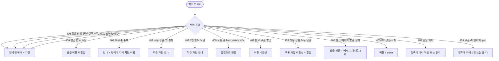

# SCR-073 쿠폰 관리 페이지

## 1. 화면 메타 정보

이 문서는 쿠폰 관리 페이지에 대한 자기완결형 요구사항 정의서입니다. 다른 문서를 함께 보지 않아도 이 문서 한 장만으로 쿠폰 관리 페이지에 들어가는 모든 영역, 모든 버튼, 모든 다이얼로그, 모든 권한, 모든 예외 처리, 그리고 이 화면을 지탱하는 쿠폰 발급 정책까지 전부 이해하고 구현할 수 있도록 작성합니다.

| 항목 | 값 |
|---|---|
| 작성일 | 2026-05-22 |
| 버전 | v1.0 |
| 상태 | 최신 통합본 반영 (정합화 완료) |
| 도메인 | D08 마케팅 |
| 화면 ID | SCR-073 |
| 화면명 | 쿠폰 관리 |
| 화면 유형 | 일반 화면 (Domain Screen) |
| 라우트 (URL) | `/message/coupon` |
| 플랫폼 | 데스크톱(기본), 태블릿 |
| 우선순위 | P0 (출시 필수) |
| 기능코드 | MKT-03 (쿠폰 관리) |
| 계약코드 | MKT-03 |
| 계약 상태 | 계약 범위 본기능 |
| 부모 기능 prefix | MKT |
| Lv1 코드 | MKT-03 |
| Lv2 / Lv3 세분화 | MKT-03-01 ~ MKT-03-07 (요약 지표, 쿠폰 목록, 쿠폰 생성/수정, 쿠폰 발급, 쿠폰 삭제, 사용률 통계) |
| 연계 화면 | SCR-S003 결제처리, SCR-M004 회원상세, SCR-097 감사로그, SCR-071 메시지발송 |
| 호출 다이얼로그 | DLG-073-001 쿠폰생성수정, DLG-073-002 쿠폰발급, DLG-073-003 쿠폰삭제확인 |

## 2. 화면 개요와 목적

쿠폰 관리 페이지는 할인 쿠폰을 생성·관리하고 특정 회원·그룹·등급에게 발급하는 마케팅 도구입니다. 정액(원 차감)과 정률(% 할인) 2종 할인 유형, 유효 기간, 발급 수량 제한, 1인 사용 제한, 적용 상품 다중 선택으로 다양한 마케팅 시나리오를 지원합니다. 매니저는 쿠폰별 발급/사용/사용률 통계로 마케팅 효과를 파악하고, 슈퍼관리자는 본사 통합 쿠폰 정책을 운영합니다.

이 화면이 다루는 운영 시나리오는 다양합니다. 첫째, 신규 회원 환영 쿠폰. 등록 감사 알림(MKT-02)과 함께 환영 쿠폰을 자동 발급합니다. 둘째, 재등록 권유 쿠폰. 만료 회원에게 10% 정률 쿠폰을 발급하면서 알림톡으로 안내. 셋째, VIP 등급 보상 쿠폰. VIP 회원 그룹에 일괄 발급. 넷째, 이벤트 쿠폰. 신년·생일·기념일 한정 쿠폰을 수량/기간 제한으로 운영. 다섯째, 추천 보상 쿠폰. 리퍼럴 프로그램(MKT-07)과 연동해 추천인/피추천인 양방향 혜택. 여섯째, PT 패키지 한정 쿠폰. 적용 상품을 PT 패키지로 제한해 특정 상품 판매 촉진.

쿠폰 만료는 자동 처리됩니다. 유효 기간 종료 시 "만료" 상태로 자동 전환되어 신규 발급이 차단되며, 발급되었지만 미사용된 쿠폰이 있으면 hard delete가 차단되고 "중단"으로 soft delete만 허용됩니다. 사용률 분석(사용/발급)으로 효과 비교가 가능해 마케팅 전략을 데이터 기반으로 조정할 수 있습니다.

## 3. 진입 경로와 인접 화면

쿠폰 관리 페이지 진입 경로는 다음과 같습니다.

첫 번째는 사이드바입니다. "마케팅 > 쿠폰 관리" 메뉴를 클릭하면 진입합니다. URL은 `/message/coupon`이며 화면은 활성 쿠폰 필터가 기본 적용된 상태로 시작합니다.

두 번째는 캠페인 관리(SCR-076)의 연결 자원에서 쿠폰 카드 클릭입니다. 캠페인 등록 시 연결 쿠폰을 선택하는 흐름에서 쿠폰 관리로 점프할 수 있습니다.

세 번째는 리퍼럴 프로그램(SCR-077)의 양방향 혜택 설정에서 쿠폰 선택입니다.

네 번째는 회원 상세(SCR-M004)의 "쿠폰 발급" 빠른 액션입니다. 회원 한 명을 대상으로 한 발급 흐름에서 쿠폰 선택 영역이 SCR-073의 쿠폰 목록을 호출하며, 발급 완료 후 회원 상세로 돌아갑니다.

다섯 번째는 대시보드의 쿠폰 KPI 카드 클릭(이번 달 발급 수, 평균 사용률 등)으로 해당 통계 영역으로 자동 스크롤됩니다.

이 화면에서 빠져나가는 인접 화면은 결제 처리(SCR-S003, 쿠폰 사용 시점), 회원 상세(SCR-M004), 메시지 발송(SCR-071, 발급 메시지 동시 발송), 감사 로그(SCR-097)입니다.

## 4. 레이아웃과 UI 구성

쿠폰 관리 페이지는 위에서 아래로 요약 → 목록 → 액션의 세로형 레이아웃입니다.

가장 위에는 페이지 헤더가 있습니다. 헤더 좌측에는 "쿠폰 관리" 페이지 타이틀, 우측에는 "+ 쿠폰 생성" 큼지막한 버튼이 배치됩니다.

페이지 헤더 아래에는 요약 지표 카드 4종이 가로로 배치됩니다. 전체 쿠폰 수(등록된 쿠폰 총합), 발급 건수(누적 발급), 사용 건수(누적 사용), 평균 사용률(사용/발급 ×100%, 5분 캐시). 카드 클릭 시 해당 분류로 자동 필터링됩니다.

요약 카드 아래에는 상태 필터 탭이 있습니다. 전체 / 활성 / 만료 / 중단 4종으로, 어느 탭이 선택되었는지는 URL 쿼리 파라미터 `status`로 반영됩니다.

상태 필터 아래에는 검색·필터 바가 있습니다. 좌측에는 쿠폰명 검색창(디바운스 300ms), 우측에는 할인 유형 필터(정액/정률), 유효 기간 필터(진행 중/이번 달 만료/지난 달 만료), 적용 상품 필터(전체 상품/PT/필라테스/골프 등)가 배치됩니다.

필터 바 아래에는 쿠폰 목록 테이블이 있습니다. 컬럼은 좌측부터 쿠폰명, 할인 유형 배지(정액/정률), 할인 금액·율(예: "5,000원" 또는 "10%"), 유효 기간(시작~종료), 발급 수, 사용 수, 사용률(%, 색상 강조), 상태 배지(활성 녹색/만료 회색/중단 주황), 행 액션([발급]/[수정]/[삭제]) 순서로 배치됩니다.

쿠폰명을 클릭하면 우측에 쿠폰 상세 패널이 슬라이드 인 됩니다. 패널 내부에는 쿠폰 기본 정보, 발급 이력 목록(어느 회원에게·언제·누가 발급했는지), 사용 이력 목록(어느 회원이·언제·어디서 사용했는지), 사용률 추이 그래프(일자별)가 표시됩니다.

행의 [발급] 버튼은 DLG-073-002 쿠폰 발급 다이얼로그를 엽니다. 만료 또는 중단 쿠폰에서는 비활성. 발급 수량 도달 쿠폰도 비활성. [수정] 버튼은 DLG-073-001을 데이터 채움 상태로 엽니다. [삭제] 버튼은 DLG-073-003 삭제 확인 다이얼로그를 엽니다.

목록 아래에는 페이지네이션 영역이 있습니다. 페이지당 건수(20/50/100), 페이지 번호 이동, 총 N건 표시.

본사 통합 쿠폰(슈퍼관리자가 등록한 `hq_owned=true`)은 카드 좌상단에 작은 "본사" 배지가 표시되어 일반 운영자가 식별할 수 있게 합니다.

만료 임박 쿠폰(종료일 7일 이내)은 행에 노랑 톤 강조가 추가되어 운영자가 종료 전 마지막 발급 기회를 인지하도록 합니다.

## 5. 쿠폰 유형과 상태 구조

쿠폰 유형은 2종으로 고정됩니다. 정액(원 차감, 예: 5,000원)과 정률(% 할인, 1~100% 범위). 정액 0원 이하 또는 정률 0%/100% 초과는 인라인 에러와 함께 저장 차단됩니다.

쿠폰 상태는 4종입니다. 활성(active, 발급·사용 가능), 만료(expired, 유효 기간 종료, 자동 전환), 중단(suspended, 운영자 명시 중단 또는 사용 이력 있는 쿠폰의 soft delete), 비활성(inactive, 운영자가 토글 OFF).

상태 전환 규칙: 활성 → 만료는 매일 04:00 만료 자동 처리 배치가 종료일 경과 쿠폰을 자동 전환. 활성 → 중단은 운영자가 명시적으로 처리하거나 사용 이력 있는 쿠폰의 삭제 시도 시 자동 전환. 만료 → 활성은 불가(새 쿠폰 등록만). 중단 → 활성은 정책에 따라 가능(테넌트 설정).

발급 수량 제한: 무제한 또는 N매. 도달 시 발급 차단되고 행 [발급] 버튼이 비활성.

1인 사용 제한: 1회 / N회 / 무제한. 결제 시 회원별 사용 카운트가 검증되어 한도 초과 시 결제 화면(SCR-S003)에서 적용 차단됩니다.

적용 상품 다중 선택: 전체 상품 또는 특정 상품(이용권/PT/필라테스/골프 등) 다중 선택. 결제 시 적용 상품이 검증되어 다른 상품 결제에는 적용 차단됩니다. 모든 적용 상품이 단종되면 쿠폰이 자동 비활성 + 운영자 알림.

쿠폰 코드는 시스템 자동 생성(영숫자 8~12자) 또는 수동 입력(정책에 따라). 외부 이벤트 페이지에서 코드 입력으로 발급받는 경로도 지원(선택 기능).

## 6. 버튼·아이콘·링크 액션 전체 정의

페이지 헤더의 "+ 쿠폰 생성" 버튼은 DLG-073-001을 빈 폼 상태로 엽니다. FC 권한에서는 이 버튼이 hidden(FC는 발급만 가능).

요약 카드 4종은 클릭 시 해당 필터로 자동 적용됩니다.

상태 필터 탭은 클릭 즉시 테이블 갱신.

검색창과 필터 드롭다운은 변경 시 즉시 갱신.

쿠폰명 클릭은 우측 상세 패널 슬라이드 인.

행 [발급] 버튼은 DLG-073-002를 엽니다. 만료/중단/발급 수량 도달 쿠폰에서는 비활성.

행 [수정] 버튼은 DLG-073-001을 채움 상태로 엽니다. 만료 쿠폰의 수정은 일부 필드(메모 등)만 가능.

행 [삭제] 버튼은 DLG-073-003을 엽니다. 슈퍼관리자/Owner(지점장)만 hard delete 가능. 매니저는 정책에 따라 가능 또는 불가. FC는 hidden.

본사 쿠폰(hq_owned=true)의 수정/삭제는 슈퍼관리자만 가능. 지점 운영자에게는 hidden.

상세 패널의 발급 이력 행 클릭은 회원 상세(SCR-M004)로 이동. 사용 이력 행 클릭은 결제 처리(SCR-S003) 또는 회원 상세로 이동.

페이지네이션 컨트롤(이전·다음·페이지 번호 입력)과 페이지당 건수 드롭다운은 즉시 재조회.

모든 버튼은 클릭 후 응답 대기 중 자동 비활성화.

## 7. 호출되는 모달 동작

### 7-1. DLG-073-001 쿠폰 생성/수정

페이지 헤더 "+ 쿠폰 생성" 버튼 또는 행 [수정] 버튼으로 열립니다.

모달 본문에는 쿠폰명(필수, 1~50자), 할인 유형(정액/정률 라디오), 할인 값(숫자, 정액은 원 단위 0 초과, 정률은 1~100% 검증), 최소 구매 금액(선택), 유효 기간(시작/종료 날짜 선택기, 시작 ≤ 종료 검증), 발급 수량 제한(무제한 또는 N매 입력), 1인 사용 제한(1회/N회/무제한), 적용 상품(다중 선택, 전체 또는 특정 상품), 활성 토글이 배치됩니다.

검증: 정률 0%/100% 초과 시 "1~100% 범위" 인라인 에러. 정액 0원 이하 시 "0원 초과" 인라인 에러. 시작일 > 종료일 시 "시작일이 종료일보다 늦을 수 없습니다" 에러. 쿠폰명 50자 초과 시 "50자 이내" 에러.

저장 시 hd_owned 본사 쿠폰은 슈퍼관리자만 생성 가능. 일반 운영자는 지점 소속 쿠폰만 생성. 저장 후 모달 닫힘 + 부모 화면 갱신 + "쿠폰을 등록했어요" 토스트.

수정 모드에서는 적용 상품 변경, 유효 기간 연장 등 일부 필드만 안전하게 수정 가능. 이미 발급된 쿠폰의 할인 금액/율 변경은 차단됨.

### 7-2. DLG-073-002 쿠폰 발급

행 [발급] 버튼으로 열립니다.

모달 상단에는 발급할 쿠폰 정보(이름, 할인 내용, 유효 기간) 요약 카드가 표시됩니다.

본문에는 발급 대상 선택 라디오(개별 회원 검색 / 조건 그룹: 활성 회원 전체·만료 회원·VIP 등급 / 리드 그룹: CRM-01 연계), 회원 검색 필드(이름·연락처 디바운스 300ms), 선택 회원 칩 목록(개별 제거 가능), 발급 수량 자동 표시(현재 선택된 발급 대상 수 / 잔여 발급 가능 수량), 발급 메시지 입력(0~200자, 선택, 알림톡/SMS/푸시 동시 발송 옵션) 영역이 배치됩니다.

발급 시 검증: 발급 수량 한도 초과 시 차단. 이미 보유 중인 회원 중복 발급 시 "이미 보유 중" 안내(정책에 따라 차단 또는 허용). 1인 사용 제한 도달 회원 발급은 허용하나 결제 시 적용 차단.

발급 버튼 클릭 시 `coupon_issue_log` INSERT + 회원 알림 발송(MKT-01 연계) + 발급 카운트 갱신 + 토스트 "N명에게 쿠폰을 발급했어요".

발급 메시지가 입력된 경우 알림톡/SMS/푸시 동시 발송이 자동으로 실행됩니다. 발송 실패 시 쿠폰 발급은 성공으로 유지하고 메시지만 재시도 큐에 등록.

FC 권한에서도 발급은 가능합니다(생성·삭제만 불가).

### 7-3. DLG-073-003 쿠폰 삭제 확인

행 [삭제] 버튼으로 열립니다.

모달에는 "쿠폰 삭제" 제목과 "이 쿠폰을 삭제하시겠습니까? 삭제된 쿠폰은 복구할 수 없습니다" 안내가 표시됩니다.

이미 발급된 쿠폰이 있는 경우 "N명에게 발급된 쿠폰이 있습니다. 삭제 시 미사용 쿠폰도 함께 무효화됩니다" 추가 경고가 표시되며, 사용 이력이 있는 쿠폰은 hard delete가 차단되고 "중단으로 전환됩니다" 안내가 표시됩니다.

확인 시 미사용 쿠폰은 hard delete, 사용 이력 있는 쿠폰은 status를 suspended로 soft delete. 토스트 "쿠폰을 삭제했어요" 또는 "쿠폰을 중단으로 전환했어요".

권한 차이: 슈퍼관리자·Owner(지점장) hard delete 가능. 매니저는 정책에 따라. FC는 [삭제] 버튼 hidden.

## 8. 토스트와 확인 팝업과 알럿

성공 토스트: "쿠폰을 등록했어요", "쿠폰 정보를 수정했어요", "N명에게 쿠폰을 발급했어요", "쿠폰을 삭제했어요", "쿠폰을 중단으로 전환했어요"가 우측 상단 녹색 5초.

실패 토스트: "권한이 없어요", "발급 한도 도달", "이미 보유 중인 쿠폰입니다", "데이터를 불러오지 못했어요"가 빨강 톤.

확인 팝업: 모달 입력 도중 ESC 또는 배경 클릭으로 닫으려고 할 때 "변경 사항이 사라집니다. 닫으시겠습니까?" yes/no 확인.

알럿: 권한 없는 계정의 직접 URL 접근 시 차단 화면 + 대시보드 자동 이동.

만료 임박 쿠폰은 행에 노랑 톤 강조 + 호버 시 "유효 기간 종료 N일 전" 툴팁.

## 9. 데이터 흐름과 외부 연동

화면 진입 시점에는 쿠폰 목록 조회 API(`GET /api/coupons`)가 호출됩니다. 응답으로는 쿠폰 배열, 4종 요약 카드 카운트, 페이지 정보가 내려옵니다. 본사 통합 모드에서는 `hq_owned=true` 본사 쿠폰이 함께 포함됩니다.

쿠폰 생성은 `POST /api/coupons`, 수정은 `PUT /api/coupons/:id`, 삭제는 `DELETE /api/coupons/:id`로 처리됩니다.

쿠폰 발급은 `POST /api/coupons/:id/issue`로 처리되며 (member_ids 또는 group_filter, message)를 받습니다. 응답으로는 발급 성공/실패 결과가 회원별로 내려옵니다.

쿠폰 통계 조회는 `GET /api/coupons/:id/stats`로 발급/사용/사용률/일자별 추이가 내려옵니다. 5분 캐시.

결제 화면(SCR-S003)에서의 쿠폰 사용은 별도 트랜잭션으로 처리됩니다. 결제 webhook 트리거 시 쿠폰 사용 검증(적용 상품·1인 사용 제한·유효 기간) → 적용 → 사용률 통계 +1 → 사용 이력 INSERT. 결제 환불 webhook 시 정책에 따라 사용 처리 유지 또는 미사용으로 복원.

만료 자동 처리 배치는 매일 04:00에 실행됩니다. 종료일 경과 쿠폰의 상태를 active → expired로 자동 전환하고 신규 발급을 차단합니다. 만료 후 90일 경과 시 자동 아카이브.

발급 메시지 발송은 MKT-01 메시지 발송 연동으로 알림톡/SMS/푸시 자동 발송. 실패 시 재시도 3회.

신규 등록 환영 쿠폰 자동 발급(선택 옵션)은 회원 등록 webhook 트리거로 자동 발급 + 메시지 발송이 일어납니다.

생일 쿠폰 자동 발급은 MKT-02 생일 트리거 연동으로 발급. 리퍼럴 보상 쿠폰(MKT-07)은 리퍼럴 매칭 트리거로 추천인/피추천인 자동 발급. 캠페인 쿠폰(MKT-06)은 캠페인 활성 시 세그먼트 회원에게 자동 발급.

세그먼트 자동 발급(MBR-EXT-04)은 세그먼트 조건 충족 시 정기 캠페인으로 자동 발급.

생성·수정·삭제·발급·사용·중단 모두 SCR-097 감사 로그에 기록됩니다(actor_id, coupon_id, member_id, action, timestamp).

화면에서 호출하는 주요 API: 쿠폰 목록 `GET /api/coupons`, 쿠폰 생성 `POST /api/coupons`, 쿠폰 수정 `PUT /api/coupons/:id`, 쿠폰 삭제 `DELETE /api/coupons/:id`, 쿠폰 발급 `POST /api/coupons/:id/issue`, 쿠폰 통계 `GET /api/coupons/:id/stats`.

## 10. 화면 상태와 예외 처리

로딩 중: 목록 자리에 스켈레톤.

정상 목록: 쿠폰 행 표시 + 페이지네이션.

쿠폰 없음: "등록된 쿠폰이 없습니다" + "+ 쿠폰 생성" CTA.

검색 결과 없음: "검색 결과가 없어요" + 필터 초기화 버튼.

만료 쿠폰: "만료" 배지 + 발급 버튼 비활성.

중단 쿠폰: 행이 회색 톤 + 발급 버튼 비활성.

발급 수량 도달: 발급 버튼 비활성 + 호버 툴팁 "발급 한도 도달".

만료 임박: 노랑 톤 강조 + 호버 툴팁.

예외 처리: 정률 0%/100% 초과 시 인라인 에러. 정액 0원 이하 인라인 에러. 시작일 > 종료일 인라인 에러. 발급 수량 도달 시 발급 차단. 1인 사용 제한 도달 회원 결제 시 적용 차단. 적용 상품 외 결제 시 적용 차단. 사용 중 쿠폰 삭제 시 중단 전환 차단. 만료 쿠폰 발급 시도 시 버튼 비활성. 중단 쿠폰 신규 발급 차단(기존 발급분만 사용 가능). 보유 쿠폰 중복 발급 시 안내(정책에 따라 차단/허용). 적용 상품 모두 단종 시 쿠폰 자동 비활성 + 알림. 할인 금액 > 결제 금액 시 결제 0원 처리 + 차액 미환급(정책). 발급 메시지 발송 실패 시 발급은 성공 + 메시지 재시도 3회. FC 생성/삭제 시도 시 버튼 hidden. 환불 시 쿠폰 처리는 정책에 따라 복원 또는 사용 처리 유지. 쿠폰 + 마일리지 동시 사용은 테넌트 정책에 따라 1개만 또는 둘 다 적용.

## 11. 권한별 처리

superAdmin·primary: 전 지점 쿠폰 + 본사 통합 쿠폰 등록 + 생성·수정·삭제·발급 모두.

Owner(지점장)·매니저: 소속 지점 쿠폰 + 생성·수정·발급. 삭제는 정책에 따라(Owner(지점장) 가능, 매니저는 옵션).

FC: 쿠폰 목록 조회 + 발급만 가능. 생성·수정·삭제 hidden.

트레이너·스태프·readonly: 마케팅 도메인 접근 차단.

## 12. 메인 흐름

```mermaid
flowchart TD
    A([쿠폰 관리 진입]) --> B[쿠폰 목록 조회 + 요약 카드]
    B --> C{사용자 액션}
    C -->|+ 쿠폰 생성| D[DLG-073-001 빈 폼]
    C -->|쿠폰명 클릭| E[상세 패널 슬라이드 인]
    C -->|행 [발급]| F[DLG-073-002]
    C -->|행 [수정]| G[DLG-073-001 채움]
    C -->|행 [삭제]| H[DLG-073-003]
    C -->|요약 카드 클릭| I[필터 자동 적용]
    D --> J{검증}
    J -->|정률 0/100+| K[인라인 에러 + 차단]
    J -->|정액 0 이하| K
    J -->|시작 > 종료| K
    J -->|통과| L[POST /api/coupons + 토스트]
    F --> M{발급 대상 선택}
    M -->|개별| N[회원 검색 + 칩]
    M -->|그룹| O[조건 그룹 선택]
    M -->|리드| P[CRM-01 리드 그룹]
    N --> Q[발급 + 메시지 옵션]
    O --> Q
    P --> Q
    Q --> R[POST /api/coupons/:id/issue + 알림 발송]
    H --> S{사용 이력?}
    S -->|있음| T[중단으로 전환]
    S -->|없음| U[hard delete]
```

## 13. 에러와 예외 흐름



## 14. 핵심 디자인 요청사항

상태 배지는 색상 분기가 명확해야 합니다. 활성 녹색, 만료 회색, 중단 주황, 비활성 흐린 회색.

요약 카드 4종은 동일 그리드 크기로 가로 배치되며 클릭 호버 효과로 인터랙티브함이 인지되어야 합니다.

사용률 컬럼은 색상 강조로 효과를 시각화합니다. 사용률 70%+ 녹색, 30~70% 노랑, 30% 미만 회색.

만료 임박 쿠폰(7일 이내)은 행에 노랑 톤 배경 + 우측에 작은 시계 아이콘 + "D-N" 텍스트로 강조됩니다.

본사 쿠폰(hq_owned=true)은 행 좌상단에 작은 "본사" 배지로 식별됩니다.

상세 패널은 우측에서 슬라이드 인 되며 본문 가로폭 축소 애니메이션이 함께 일어납니다. 패널 내부는 위에서부터 기본 정보, 발급 이력, 사용 이력, 사용률 추이 그래프 순으로 배치됩니다.

DLG-073-001 모달은 할인 유형 라디오를 누르면 할인 값 입력 필드의 단위가 자동 변경됩니다(정액 → "원", 정률 → "%").

DLG-073-002 발급 모달은 발급 대상 선택 방식(개별/그룹/리드) 라디오에 따라 본문 영역이 동적으로 변경됩니다.

발급 수량과 잔여 수량 표시는 진행률 바 형태로 시각화되어 한 눈에 인지됩니다.

모바일에서는 테이블이 카드형 리스트로 자동 전환되어 한 카드에 쿠폰명·할인·기간·상태·발급/수정/삭제 버튼이 함께 표시됩니다.

## 15. 운영 정책 (이 화면에 연결된 부분)

할인 유형 2종: 정액(원 차감) / 정률(% 할인). 정액 0원 초과, 정률 1~100% 검증.

유효 기간: 시작일·종료일 입력. 시작일 ≤ 종료일 검증. 만료 시 자동 "만료" 상태 전환.

발급 수량 제한: 무제한 또는 N매. 도달 시 발급 차단.

1인 사용 제한: 1회 / N회 / 무제한. 결제 시 회원별 사용 카운트 검증.

적용 상품 다중 선택: 전체 상품 또는 특정 상품 다중 선택. 결제 시 적용 상품 검증.

상태 4종: 활성 / 만료 / 중단 / 비활성. 자동 전환 또는 운영자 수동.

자동 사용률 계산: 사용률 = 사용 / 발급. 결제·환불 시 즉시 갱신. 5분 캐시.

삭제 정책: 사용 이력 없으면 hard delete. 사용 이력 있으면 "중단"으로 soft delete만 허용.

쿠폰 사용(결제): 결제 화면(SCR-S003)에서 보유 쿠폰 목록 표시. 자동 차감 + 사용률 통계 +1.

할인 금액 > 결제 금액: 결제 금액 0원 처리, 차액 미환급(정책).

쿠폰 + 마일리지 동시 적용: 테넌트 정책으로 허용 / 1개만 / 마일리지 우선 등 설정 가능.

환불 시 쿠폰 복원: 정책에 따라 사용 처리 유지 또는 미사용으로 복원(테넌트 설정).

발급 시 회원 알림: 발급 메시지 입력 시 알림톡/SMS/푸시 동시 발송(MKT-01 연계).

중복 발급 정책: 동일 회원에게 동일 쿠폰 중복 발급 허용 / 차단(정책).

적용 상품 단종 시: 모든 적용 상품 단종이면 쿠폰 자동 비활성 + 운영자 알림.

권한별 가시성: 슈퍼관리자 전 지점 + 본사 통합. Owner(지점장) 소속 지점 + 생성·수정·삭제·발급. 매니저 생성·수정·발급(삭제는 정책에 따라). FC 조회 + 발급. 트레이너·스태프·readonly 차단.

쿠폰명 정책: 1~50자. 동일 지점 내 중복 허용.

발급 메시지 정책: 0~200자. 빈 값 시 알림 발송 안 함.

쿠폰 코드 자동 생성: 시스템 자동 생성(영숫자 8~12자) 또는 수동 입력(정책).

외부 채널 발급(이벤트 페이지): 외부 이벤트 페이지에서 코드 입력으로 발급(선택 기능).

감사 로그: 생성·수정·삭제·발급·사용·중단 모두 SCR-097 기록.

사용률 통계 캐시: 5분 캐시. 발급/사용/환불 시 무효화.

본사 통합 쿠폰: 본사 슈퍼관리자가 전 지점 일괄 등록 가능(`hq_owned=true`). 지점에서는 발급만 가능.

만료 후 보존: 만료 쿠폰은 90일 이상 보존(사용 이력 추적용). 90일 후 자동 아카이브.

이상의 모든 정책은 이 화면을 구현·운영하는 사람이 별도 문서 없이 이 한 장만 보면 이해할 수 있도록 풀어 적었습니다.
