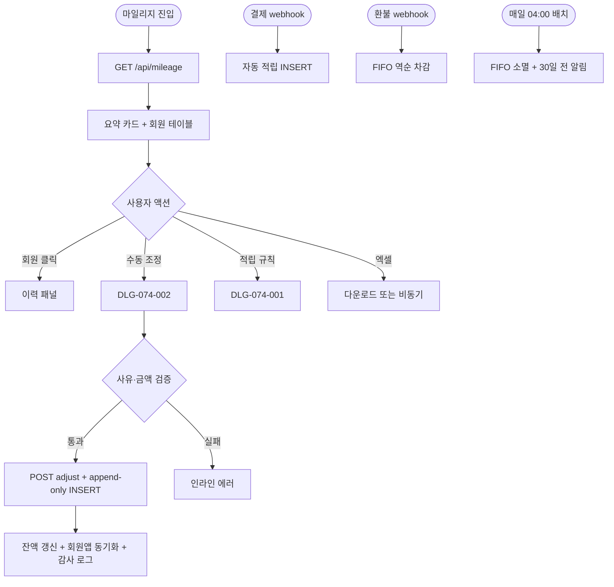
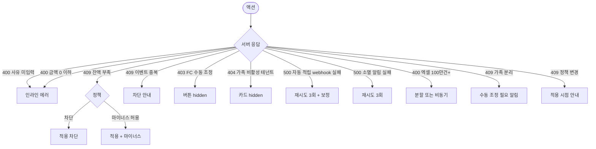

# SCR-074 마일리지 관리 페이지

## 1. 화면 메타 정보

이 문서는 마일리지 관리 페이지에 대한 자기완결형 요구사항 정의서입니다. 다른 문서를 함께 보지 않아도 이 한 장만으로 화면에 들어가는 모든 영역, 모든 버튼, 모든 다이얼로그, 모든 권한, 마일리지 적립·차감·소멸 정책까지 전부 이해하고 구현할 수 있도록 작성합니다.

| 항목 | 값 |
|---|---|
| 작성일 | 2026-05-22 |
| 버전 | v1.0 |
| 상태 | 최신 통합본 반영 (정합화 완료) |
| 도메인 | D08 마케팅 |
| 화면 ID | SCR-074 |
| 화면명 | 마일리지 관리 |
| 화면 유형 | 일반 화면 |
| 라우트 (URL) | `/mileage` |
| 플랫폼 | 데스크톱(기본), 태블릿 |
| 우선순위 | P1 (출시 후 권장) |
| 기능코드 | MKT-04 |
| 계약코드 | MKT-04 |
| 계약 상태 | 계약 범위 본기능 |
| 부모 기능 prefix | MKT |
| Lv1 코드 | MKT-04 |
| Lv2 / Lv3 세분화 | MKT-04-01 ~ MKT-04-09 (요약 지표, 회원별 테이블, 검색, 이력 조회, 수동 적립/차감, 적립 규칙, 자동 적립 처리, 자동 소멸, 엑셀 다운로드) |
| 연계 화면 | SCR-S003 결제처리, SCR-M004 회원상세, 회원앱 마일리지 화면, SCR-097 감사로그 |
| 호출 다이얼로그 | DLG-074-001 적립규칙편집, DLG-074-002 수동적립차감 |

## 2. 화면 개요와 목적

마일리지 관리 페이지는 회원별 마일리지 잔액과 적립·차감·소멸 이력을 조회하고, 적립 규칙(결제 적립률·이벤트 적립·소멸 정책·사용 단위)을 설정하는 화면입니다. 마일리지는 회원 재방문을 유도하고 충성도를 높이는 리텐션 도구로, 결제 금액 대비 자동 적립과 운영자의 수동 조정으로 유연하게 운영합니다. 가족 회원(MBR-EXT-02) 간 합산 사용도 지원합니다.

운영 시나리오: 결제 자동 적립(결제 webhook 트리거, 기본 1%, 테넌트별 0~10% 설정), 이벤트 적립(생일·재등록·첫 출석), 수동 적립/차감(보상·실수 정정·사은품), 소멸 정책(기본 12개월 FIFO 자동 소멸, 소멸 30일 전 회원 알림), 가족 합산 사용(부모 마일리지 → 자녀 결제), 회원앱 잔액 노출, 엑셀 내보내기, append-only 이력(수정·삭제 불가, 보정 INSERT만).

## 3. 진입 경로와 인접 화면

진입 경로는 사이드바 "마케팅 > 마일리지 관리", 대시보드 KPI 카드 클릭, 회원 상세(SCR-M004)의 "마일리지 보기" 빠른 액션, 결제 화면(SCR-S003)에서 사용한 쿠폰/마일리지 이력 클릭 등이 있습니다. 인접 화면은 결제 처리(SCR-S003), 회원 상세(SCR-M004), 회원앱 마일리지 화면, 감사 로그(SCR-097)입니다.

## 4. 레이아웃과 UI 구성

페이지 헤더 좌측에 "마일리지 관리" 타이틀, 우측에 "적립 규칙 설정"(DLG-074-001) 버튼과 "엑셀 내보내기" 버튼이 배치됩니다.

요약 지표 카드 4종이 가로 배치됩니다. 총 발행 마일리지(누적), 총 사용 마일리지(누적), 소멸 예정(30일 이내), 현재 유통 잔액(활성). 5분 캐시.

검색·필터 바: 이름·연락처 통합 검색(디바운스 300ms), 잔액 범위 필터, 최근 적립일 필터.

회원별 마일리지 테이블: 회원명(SCR-M004 이동), 연락처, 현재 잔액, 총 적립, 총 사용, 최근 적립일, 행 액션([이력]/[수동 조정]).

회원 클릭 시 우측 이력 패널 슬라이드 인. 이력 컬럼은 날짜, 구분(적립/사용/차감/소멸), 금액(+/-), 사유, 처리자. 시간순 정렬. append-only이므로 수정·삭제 불가, 모든 이력이 보존됨.

회원앱과 동기화: 회원 본인은 회원앱에서 잔액·이력 조회. 잔액 변경 시 회원앱에 즉시 반영. 소멸 30일 전 회원 알림.

가족 합산 사용 표시(MBR-EXT-02 활성 시): 가족 그룹 멤버는 패널에 가족 합산 잔액이 함께 표시되며 부모→자녀 결제 사용 가능.

## 5. 적립 / 차감 / 소멸 메커니즘

자동 적립: 결제 webhook 트리거로 결제 금액 × 적립률 = 자동 적립. 정책 활성 시.

이벤트 적립: 생일 / 재등록 / 첫 출석 / 이벤트 참여 등 트리거별 정액·정률 적립. 회원당 1년 1회 제한(생일).

수동 적립/차감: 운영자 임의 조정. 사유(필수) + 비고(선택) + 처리자(actor_id) 자동 기록.

소멸 정책: 적립일 + 12개월(테넌트 설정) FIFO 자동 소멸. 매일 04:00 배치.

소멸 사전 알림: 소멸 30일 전 회원 알림 발송(MKT-02 연계).

사용 단위: 기본 1점 = 1원(테넌트 설정). 결제 화면 차감 단위에 반영.

append-only 이력: 적립·차감·소멸·환불 모두 INSERT only. 수정·삭제 불가. 보정은 새 INSERT.

잔액 부족 정책: 차감 시 잔액 부족 시 차단 또는 마이너스 허용(테넌트 정책).

## 6. 버튼·아이콘·링크 액션 전체 정의

"적립 규칙 설정" 버튼: DLG-074-001 호출.

"엑셀 내보내기" 버튼: 마일리지 이력 전체 다운로드. 100만건 초과 시 분할 또는 비동기 처리.

요약 카드 4종은 클릭 시 해당 정렬/필터 자동 적용.

회원명 클릭: SCR-M004 이동.

행 [이력]: 우측 이력 패널 슬라이드 인.

행 [수동 조정]: DLG-074-002 호출. FC는 hidden(조회만 가능).

페이지네이션 컨트롤: 20/50/100 페이지당 건수, 페이지 번호 이동.

## 7. 호출되는 모달 동작

### 7-1. DLG-074-001 적립 규칙 편집

본문: 기본 적립률(결제 100원당 N포인트), 최소 적립 결제 금액, 특별 적립 조건(생일·첫 방문·목표 달성 추가 적립), 마일리지 소멸 정책(개월 수 또는 무제한), 사용 단위(1점=N원).

저장 시 다음 결제·이벤트부터 새 규칙 적용. 기존 적립분은 기존 정책 유지(테넌트 설정).

### 7-2. DLG-074-002 수동 적립/차감

본문: 대상 회원 정보(이름·현재 잔액), 조정 유형(적립/차감 라디오), 조정 금액(숫자, 0보다 큰 정수), 조정 후 잔액 미리보기, 사유(필수, 1~200자), 비고(선택).

차감 시 잔액 부족 시 "잔액 부족, 현재 잔액 N점" 경고 + 차단 또는 마이너스 허용(정책).

확인 시 `mileage_log` INSERT(append-only) + 잔액 갱신 + 회원앱 즉시 반영 + 감사 로그.

## 8. 토스트와 확인 팝업과 알럿

성공: "적립 규칙을 저장했어요", "마일리지를 조정했어요", "엑셀 다운로드가 시작되었어요".

실패: "잔액 부족, 차감 가능 금액 N점", "권한이 없어요", "사유는 필수입니다".

확인 팝업: 모달 ESC/배경 클릭 시 "변경 사항이 사라집니다" 확인.

알럿: 권한 없는 계정 접근 시 차단 화면.

## 9. 데이터 흐름과 외부 연동

화면 진입 시 `GET /api/mileage` 호출. 응답으로 회원별 마일리지 배열 + 4종 요약 카드 카운트.

이력 조회 `GET /api/mileage/:memberId/history`.

수동 조정 `POST /api/mileage/:memberId/adjust` (type, amount, reason).

적립 규칙 조회/수정 `GET /api/mileage/rules`, `PUT /api/mileage/rules`.

소멸 예정 조회 `GET /api/mileage/expire-soon`.

엑셀 내보내기 `GET /api/mileage/export`.

결제 자동 적립은 결제 webhook(SCR-S003) 트리거로 적립률 × 결제액 자동 적립 + `mileage_log` INSERT.

결제 환불 회수: 환불 webhook 트리거로 FIFO 역순 자동 차감. 잔액 부족 시 마이너스 허용(정책).

자동 소멸 배치: 매일 04:00. 적립일 + N개월 경과 FIFO 소멸 + `mileage_log` INSERT.

소멸 30일 전 알림: 매일 04:00 추출 + MKT-02 연계 발송.

이벤트 적립: 생일(MKT-02 트리거), 재등록(트랜잭션), 첫 출석(webhook) 자동 적립.

가족 합산 사용(MBR-EXT-02): 결제 시 합산 옵션 활성 시 가족 그룹 잔액에서 차감.

회원 병합(MBR-EXT-01): 부 계정 마일리지 → 주 계정 합산.

회원 이관(MBR-ADV-02): 마일리지 + 이력 이관 + 지점 간 정산.

회원 탈퇴: 정책에 따라 잔액 소멸 또는 가족 그룹 양도.

회원앱 잔액 동기화: 잔액 변경 시 회원앱 즉시 반영.

본사 통합 정책 동기화: 슈퍼관리자 변경 시 전 지점 즉시 적용.

자동 적립 webhook 재시도: 실패 시 1분/5분/30분 3회 재시도 + 보정 INSERT.

엑셀 비동기 처리: 100만건 초과 시 백그라운드 잡 + 완료 알림(알림 센터).

감사 로그: 적립 규칙 변경·수동 적립·수동 차감·엑셀 다운로드 모두 SCR-097 기록.

## 10. 화면 상태와 예외 처리

로딩 / 정상 / 회원 없음 / 이력 로딩 상태.

예외 처리: 잔액 부족 차감 시 차단 또는 마이너스 허용. 사유 미입력 인라인 에러. 금액 0 이하 인라인 에러. 소멸 정책 변경 시 적용 시점 안내. 환불 시 마이너스 잔액은 정책에 따라. 가족 합산 비활성 테넌트는 카드 hidden. 이벤트 적립 중복(생일) 차단. FC 수동 조정 시도 시 버튼 hidden. append-only 이력 수정 시도 시 "수정 불가, 보정 INSERT만" 안내. 엑셀 100만건 초과 시 분할 다운로드 안내. 가족 그룹 분리 시 수동 조정 필요 알림. 소멸 알림 발송 실패 자동 재시도 3회. 자동 적립 webhook 실패 자동 재시도 + 보정.

## 11. 권한별 처리

슈퍼관리자·본사: 전 지점 + 적립·차감·규칙·엑셀.

Owner(지점장)·매니저: 소속 지점 + 수동 적립·차감·규칙·엑셀.

FC: 담당 회원 이력 조회만(수동 조정 불가).

회원 본인: 회원앱 잔액·이력 조회.

트레이너·스태프·readonly: 차단.

## 12. 메인 흐름

## 13. 에러와 예외 흐름

## 14. 핵심 디자인 요청사항

요약 카드 4종 동일 그리드. 소멸 예정 카드는 노랑 강조로 시각적 주의 환기.

회원별 테이블은 잔액 컬럼이 가장 굵게 표시되어 한 눈에 잔액을 인지할 수 있어야 합니다.

이력 패널의 구분 컬럼은 색상 배지로 분기: 적립 녹색, 사용 파랑, 차감 빨강, 소멸 회색, 환불 보라.

수동 조정 모달은 조정 후 잔액 미리보기가 실시간 표시되어 운영자가 결과를 즉시 확인 가능해야 합니다.

회원앱 동기화는 잔액 변경 후 1초 이내 반영되어야 회원이 즉시 확인 가능.

엑셀 다운로드는 100만건 초과 시 비동기 처리 안내 + 알림 센터로 완료 통지.

## 15. 운영 정책 (이 화면에 연결된 부분)

결제 자동 적립: 결제 webhook 트리거로 결제 금액 × 적립률 = 자동 적립.

이벤트 적립: 생일/재등록/첫 출석/이벤트 참여 트리거별 정액·정률 적립. 회원당 1년 1회 제한(생일).

수동 적립/차감: 운영자 임의 조정. 사유(필수) + 비고(선택) + 처리자(actor_id) 자동 기록.

소멸 정책: 적립일 + 12개월(테넌트 설정) FIFO 자동 소멸. 매일 04:00 배치.

소멸 사전 알림: 소멸 30일 전 회원 알림 발송(MKT-02 연계).

사용 단위: 기본 1점 = 1원(테넌트 설정).

append-only 이력: 적립·차감·소멸·환불 모두 INSERT only. 수정·삭제 불가. 보정은 새 INSERT.

잔액 부족 정책: 차감 시 잔액 부족 차단 또는 마이너스 허용(테넌트 정책).

금액 검증: 0보다 큰 정수. 0 이하 또는 소수 입력 차단.

사유 정책: 1~200자. 미입력 시 저장 차단.

결제 환불 회수: FIFO 역순 자동 차감. 잔액 부족 시 마이너스 허용(정책).

가족 합산 사용(MBR-EXT-02): 테넌트 정책 활성 시 가족 그룹 멤버 마일리지 합산 사용 가능.

회원 탈퇴 시: 정책에 따라 잔액 소멸 또는 가족 그룹 양도. 이력 보존.

회원 병합(MBR-EXT-01): 부 계정 마일리지 → 주 계정 합산. 이력 모두 이관.

회원 이관(MBR-ADV-02): 마일리지 함께 이관. 지점 간 정산 포함.

소멸 정책 변경: 변경 시점부터 신규 적립분에 적용. 기존 적립분은 기존 정책 유지(테넌트 설정).

권한별 가시성: 슈퍼관리자 전 지점. Owner(지점장)·매니저 수동 조정·규칙·엑셀. FC 조회만. 회원 본인 회원앱. 트레이너·스태프·readonly 차단.

요약 카드 갱신: 5분 캐시.

소멸 예정 카드 기준: 30일 이내 소멸 예정 합계.

엑셀 내보내기: 100만건 초과 시 분할 또는 비동기.

본사 통합 정책: 슈퍼관리자가 전 지점 적립률·소멸 정책 일괄 설정 가능.

append-only 이력 컬럼: mileage_log(id, member_id, type[적립/사용/차감/소멸/환불], amount, reason, actor_id, ts, source[결제/이벤트/수동]).

감사 로그: 적립 규칙 변경·수동 적립·수동 차감·엑셀 다운로드 모두 SCR-097 기록.

회원앱 노출: 잔액 + 이력 + 소멸 예정 알림 + 사용 가능 상품 안내.

이상의 모든 정책은 별도 문서 없이 이 한 장만 보면 이해할 수 있도록 풀어 적었습니다.
