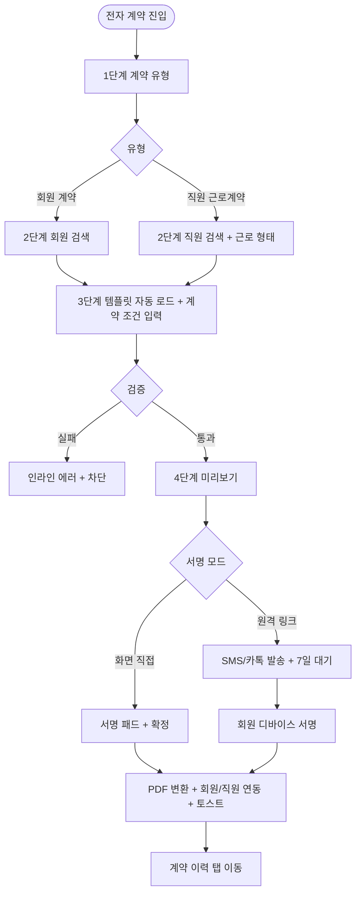
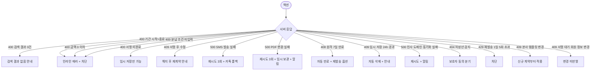

# SCR-075 전자 계약 페이지

## 1. 화면 메타 정보

이 문서는 전자 계약 페이지에 대한 자기완결형 요구사항 정의서입니다. 다른 문서를 함께 보지 않아도 이 한 장만으로 화면에 들어가는 모든 영역, 5단계 위자드, 4종 템플릿, 권한, 그리고 전자 서명 운영 정책까지 전부 이해하고 구현할 수 있도록 작성합니다.

| 항목 | 값 |
|---|---|
| 작성일 | 2026-05-22 |
| 버전 | v1.0 |
| 상태 | 최신 통합본 반영 (정합화 완료) |
| 도메인 | D08 마케팅 |
| 화면 ID | SCR-075 |
| 화면명 | 전자 계약 |
| 화면 유형 | 위자드 화면 (5단계) |
| 라우트 (URL) | `/contracts/new` |
| 플랫폼 | 데스크톱(기본), 태블릿(서명 직접), 모바일(서명 링크) |
| 우선순위 | P1 (출시 후 권장) |
| 기능코드 | MKT-05 (전자 계약) |
| 계약코드 | MKT-05, STF-EXT-04 |
| 계약 상태 | 계약 범위 본기능 |
| 부모 기능 prefix | MKT |
| Lv1 코드 | MKT-05 |
| Lv2 / Lv3 세분화 | MKT-05-01 ~ MKT-05-08 (계약 유형, 계약 대상, 템플릿 분기, 계약 내용, 미리보기, 전자 서명, 계약 이력, 재발송) |
| 연계 화면 | SCR-M004 회원상세, STF-02 직원상세, SCR-071 메시지발송, SCR-097 감사로그 |
| 호출 다이얼로그 | 없음 (5단계 위자드 자체가 모달 흐름) |

## 2. 화면 개요와 목적

전자 계약 페이지는 회원 이용 계약서 또는 직원 근로계약서를 전자 방식으로 작성·서명·이력 관리하는 5단계 위자드 화면입니다. 종이 계약 없이 태블릿(직접 서명) 또는 모바일(원격 서명 링크)에서 서명을 받고, 서명 완료 시 PDF 자동 변환 + S3 저장 + 이메일/앱 재전송 + 회원 상세·직원 상세 연동으로 통합 관리합니다. 회원 계약과 직원 근로계약 4종 템플릿(이용 / 정규직 / 위촉 / 프리랜서)을 자동 분기해 운영 효율을 높입니다.

운영 시나리오: 신규 회원 이용 계약(태블릿 즉석 서명, 회원 마스터 자동 연결), PT 패키지 계약(트레이너/위촉 강사 별도 계약), 원격 서명(회원 부재 시 SMS/카톡 링크 발송, 7일 유효), 직원 정규직 입사(STF-02 자동 연동), 위촉 강사 계약(수수료·정산 조건 포함), 프리랜서 계약(단기·프로젝트), 계약서 재발송(분실 시 이메일/앱), 계약 이력 조회(회원 상세·직원 상세에서 과거 계약서 모두 조회).

서명 완료 시점부터 정식 효력을 가지며 서명 전 데이터는 임시 저장(24시간)만 가능합니다. 서명 후 계약 수정은 불가하며 해지 후 재계약만 허용됩니다.

## 3. 진입 경로와 인접 화면

진입 경로: 사이드바 "마케팅 > 전자 계약", 회원 등록(SCR-M002)에서 계약 작성 연결, 회원 상세(SCR-M004)의 "계약서 작성" 빠른 액션, 직원 상세(STF-02)의 입사 처리 흐름, 계약 이력 탭의 "새 계약" 버튼.

인접 화면: 회원 상세(SCR-M004), 직원 상세(STF-02), 메시지 발송(SCR-071, 서명 링크 발송), 감사 로그(SCR-097), 인사 도메인(D07).

## 4. 레이아웃과 UI 구성

위자드 진행 표시: 화면 상단에 5단계 스텝퍼(계약 유형 → 계약 대상 → 계약 조건 → 미리보기 → 서명)가 가로로 펼쳐지며 현재 단계가 강조됩니다.

본문은 단계별로 동적으로 변경됩니다.

1단계 계약 유형: 회원 계약(이용권·PT·필라테스) / 직원 근로계약(정규직·위촉·프리랜서) 카드 라디오.

2단계 계약 대상: 회원 검색(회원 계약 선택 시) 또는 직원 검색(직원 근로계약 선택 시). 회원 계약은 SCR-M001 회원 목록과 같은 검색 UI 사용. 직원 근로계약은 직원 검색 + 근로 형태(정규직/위촉/프리랜서) 추가 선택.

3단계 계약 조건: 선택한 유형에 따라 템플릿이 자동 분기되며 입력 필드가 동적으로 표시됩니다. 회원 이용 계약은 이용 서비스(상품·이용권 선택) + 계약 기간(시작/종료) + 금액(천 단위 콤마) + 결제 조건(일시불/분납, 분납 시 횟수·주기 필수) + 특약 사항(0~2000자 자유 텍스트). 직원 정규직은 근로 시작일·근로 시간·연봉·복리후생·특약. 위촉은 수수료율·정산 조건(월별/건당)·기간. 프리랜서는 프로젝트 기간·금액·납품물·정산 조건.

4단계 미리보기: 입력된 정보가 반영된 계약서 전문 화면 표시. 변수 치환된 최종 형태(법적 효력을 가진 그대로). 운영자는 이 단계에서 마지막 검토를 진행합니다.

5단계 서명: 두 가지 모드 선택. 화면 직접 서명(태블릿/마우스 패드, 회원이 현장에 있을 때) / 원격 서명 링크 발송(SMS 또는 카톡, 회원이 부재할 때). 서명 패드는 화면 좌표 기반 서명 데이터 + 서명 시각이 기록되며 서명이 끝나면 "서명 확정" 버튼으로 정식 저장됩니다. 원격 서명 모드에서는 발송 채널과 발송 번호 확인 후 발송 → 7일 유효 링크 생성 → 회원이 링크 클릭하면 회원 디바이스에서 같은 서명 패드 UI로 서명 → 완료.

위자드 우측에는 진행 요약 패널이 있어 현재까지 입력한 정보가 누적 표시되며 이전 단계로 되돌아가기 쉽게 합니다. 임시 저장 버튼은 모든 단계에서 활성화되어 24시간 보관됩니다.

페이지 헤더 우측에는 "계약 이력 보기" 탭 진입 버튼이 있어, 위자드를 떠나 과거 계약 목록을 조회할 수 있습니다.

계약 이력 탭은 별도 라우트(`/contracts/history`)이며 컬럼: 날짜 / 유형 / 회원명·직원명 / 서명 상태(서명 대기·서명 완료·해지·만료) / 행 액션([PDF 다운로드]/[재발송]). 검색·필터는 회원명·직원명·날짜·유형·서명 상태로 조합 가능.

## 5. 5단계 위자드 흐름

1단계 → 2단계 전환: 계약 유형 선택 후 "다음" 클릭. 미선택 시 비활성.

2단계 → 3단계: 계약 대상 선택 후 "다음". 미선택 시 비활성.

3단계 → 4단계: 모든 필수 필드 입력 후 "다음". 검증 실패 시 인라인 에러 + 차단.

4단계 → 5단계: 미리보기 검토 후 "서명으로 이동". 변경이 필요하면 "수정" 버튼으로 3단계 복귀.

5단계 완료: 서명 확정 → PDF 자동 변환 + S3 저장 + 회원/직원 마스터 연동 + 토스트 "계약이 체결되었어요" + 위자드 종료 → 계약 이력 탭 자동 이동.

원격 서명 모드: 5단계에서 링크 발송 → "서명 대기" 상태로 임시 저장 → 위자드는 종료되지만 계약은 미체결. 회원이 링크 클릭 후 서명하면 위자드 운영자에게 알림 + 자동 저장 + 회원/직원 연동.

원격 서명 7일 만료: 자동 만료 + 운영자 알림 + 재발송 옵션. SMS 발송 실패 시 자동 재시도 3회 + 카톡 폴백.

태블릿 서명 끊김: 임시 저장 자동 + 재진입 시 이어서 진행.

PDF 변환 실패: 자동 재시도 3회 + 운영자 알림 + 임시 보관.

## 6. 버튼·아이콘·링크 액션 전체 정의

위자드 스텝퍼의 단계 클릭은 입력 완료된 이전 단계만 클릭 가능. 미완료 단계는 disabled.

"다음" 버튼은 단계별 검증 통과 시에만 활성. "이전" 버튼은 1단계 외에서 활성.

"임시 저장" 버튼: 24시간 보관용 저장. 임시 저장 후 위자드 떠나도 다시 들어오면 이어서 가능.

"미리보기"는 4단계에서 활성. 인쇄 미리보기처럼 계약서 전문이 표시됨.

서명 모드 라디오: 화면 직접 서명 / 원격 서명 링크. 모드 변경 시 본문이 동적 전환.

화면 직접 서명 모드: 서명 패드(서명 영역 박스), "지우기" 버튼(서명 초기화), "서명 확정" 버튼.

원격 서명 링크 모드: 발송 채널(SMS/카톡 라디오), 발송 번호 표시(회원 마스터의 연락처 자동 채움), "링크 발송" 버튼.

링크 발송 후 화면에는 "서명 대기 중" 상태가 표시되며 발송 시각·만료 시각(+7일)·재발송 버튼이 노출됩니다.

서명 완료 후 자동 PDF 변환 결과는 우측 패널에 표시되며 다운로드 버튼이 활성화됩니다.

계약 이력 탭의 행 [PDF 다운로드]는 S3 URL로 다운로드. 행 [재발송]은 이메일/앱/SMS 채널 선택 모달 → 발송. 재발송 1일 5회 한도.

계약 해지 액션: 해지 사유 입력 → 해지 처리 → 원본 보존 + 해지 이력 추가. 환불 처리는 별도(D05 결제).

미성년 회원 계약: 5단계에 보호자 동의 분기 추가 + 보호자 서명 필수.

## 7. 호출되는 모달 동작

SCR-075는 위자드 자체가 모달 흐름이므로 별도 다이얼로그 호출이 없습니다. 다만 보조 모달 몇 가지가 있습니다.

원격 서명 링크 발송 확인 모달: 발송 시점에 "{회원명}님의 {연락처}로 서명 링크를 발송합니다. 7일 동안 유효합니다" 확인 + 발송.

서명 확정 모달: 5단계에서 "서명 확정" 클릭 시 "계약이 정식 체결됩니다. 진행하시겠습니까?" 최종 확인. 서명 후 수정 불가 안내 포함.

서명 후 수정 시도 모달: 이미 서명된 계약을 수정하려고 하면 "서명된 계약은 수정 불가, 해지 후 재계약" 차단 안내.

계약 해지 모달: 해지 액션 시 사유 입력 + 환불 필요 여부 안내 + 확인.

임시 저장 24시간 경과 자동 삭제 안내: 다음 진입 시 "이전 임시 저장이 24시간 경과로 삭제되었습니다" 정보 토스트.

PDF 변환 실패 모달: 자동 재시도 3회 후 최종 실패 시 "PDF 변환 실패, 운영팀에 문의해주세요" + 임시 보관 안내.

미성년 보호자 동의 모달: 미성년 회원 감지 시 "보호자 동의가 필요합니다" + 보호자 정보 입력 → 보호자 서명 분기.

## 8. 토스트와 확인 팝업과 알럿

성공: "계약이 체결되었어요", "임시 저장했어요", "서명 링크를 발송했어요", "계약서를 재발송했어요", "계약을 해지했어요".

실패: "PDF 변환 실패", "SMS 발송 실패, 카톡으로 폴백", "원격 서명 만료", "재발송 한도 초과", "데이터를 불러오지 못했어요".

확인 팝업: 위자드 도중 페이지 떠나려고 할 때 "작성 중인 계약이 있습니다. 임시 저장하시겠습니까?" 확인.

알럿: 권한 없는 계정의 직접 URL 접근 시 차단 화면.

원격 서명 7일 만료 알림: 운영자에게 알림 센터로 발송.

## 9. 데이터 흐름과 외부 연동

계약 생성: `POST /api/contracts` (type, target_id, contract_content). 임시 저장 또는 정식 저장 구분.

서명 처리: `POST /api/contracts/:id/sign` (signature_data, signature_time).

원격 서명 링크 발송: `POST /api/contracts/:id/send-remote-sign` (channel, target_phone). 7일 유효 토큰 생성 + MKT-01 메시지 발송 연동.

재발송: `POST /api/contracts/:id/resend` (channel: 이메일/앱/SMS).

계약 이력 조회: `GET /api/contracts` (filter, search).

템플릿 조회: `GET /api/contracts/templates` (type).

서명 완료 시 자동 PDF 변환: 백엔드 서비스가 계약 내용 + 서명 데이터를 PDF로 변환 + S3 저장 + 다운로드 URL 발행. 변환 실패 시 자동 재시도 3회.

회원 마스터 연동: 회원 계약 완료 시 SCR-M004 + 이용권 자동 등록(정책 활성 시).

직원 인사 연동: 직원 근로계약 완료 시 STF-02 + 인사 도메인(D07) 자동 등록.

원격 서명 만료 배치: 매일 04:00에 7일 경과 링크 자동 무효 + 운영자 알림.

임시 저장 자동 삭제 배치: 매일 04:00에 24시간 경과 임시 데이터 삭제.

본사 표준 템플릿 동기화: 슈퍼관리자 변경 시 전 지점 즉시 동기화(신규 계약만).

계약 해지 시 환불 연동: 해지 트랜잭션 → D05 결제 환불 화면 자동 연동.

계약서 5년 후 아카이브: 매일 04:00에 5년 경과 계약 아카이브(법정 보관).

다운로드 추적 로그: 계약서 다운로드 시 actor·ts·ip 기록.

회원/직원 알림(계약 완료): 서명 완료 시 알림톡/이메일 발송.

위촉/프리랜서 정산 연동: 계약 활성 시 월별 정산 트리거(인사/회계 도메인).

미성년 보호자 동의 알림: 미성년 회원 계약 시 보호자 알림 발송.

작성·서명·재발송·해지 모두 SCR-097 감사 로그 기록(actor_id, contract_id, action).

## 10. 화면 상태와 예외 처리

위자드 단계별 상태: 작성 중(입력) / 미리보기 / 서명 대기(원격) / 서명 완료(자동 저장 + 이력) / 해지 / 만료(원격 서명 만료).

이력 없음 상태: 계약 이력 탭에서 "체결된 계약이 없습니다" 안내.

예외 처리:

회원/직원 검색 결과 0건 → "검색 결과 없음" + 등록 안내.

계약 기간 시작 > 종료 → 인라인 에러 + 차단.

금액 0 이하 → 인라인 에러 + 차단.

분납 조건 미입력 → 분납 횟수·주기 누락 시 차단.

서명 미완료 → "서명이 필요합니다" + 정식 저장 차단(임시 저장만).

원격 서명 링크 7일 만료 → 자동 만료 + 운영자 알림 + 재발송 옵션.

SMS 발송 실패 → 자동 재시도 3회 + 카톡 폴백.

서명 후 수정 시도 → "수정 불가, 해지 후 재계약" 차단.

태블릿 서명 끊김 → 임시 저장 자동 + 재진입 시 이어서.

PDF 변환 실패 → 자동 재시도 3회 + 운영자 알림 + 임시 보관.

회원/직원 부재 작성 중단 → 임시 저장(24시간 보관).

계약 해지 → 해지 사유 입력 → 원본 보존 + 해지 이력 추가.

본사 표준 템플릿 변경 → 신규 계약부터 적용, 기존 서명 계약은 기존 템플릿 유지.

서명 대기 중 회원 정보 변경 → 변경 미반영(서명 시점 데이터 고정).

위촉/프리랜서 수수료 미입력 → 인라인 에러 + 저장 차단.

인사 도메인(D07) 동기화 실패 → 자동 재시도 + 운영자 알림.

회원 탈퇴/직원 퇴사 후 조회 → 이력 보존 + 조회 가능(개인정보 정책에 따라 제한).

미성년 회원 계약 → 보호자 동의 분기 + 보호자 서명 추가.

계약서 외부 공유 시도 → 워터마크 + 다운로드 추적.

재발송 1일 5회 초과 → 차단.

## 11. 권한별 처리

슈퍼관리자·본사: 전 지점 계약 + 본사 표준 템플릿 정의 + 모든 액션.

센터장·매니저: 소속 지점 계약 + 작성·서명·재발송·해지.

FC: 본인 담당 회원 계약만 작성·서명. 직원 계약 불가.

트레이너: 본인 PT 계약 조회만 가능(작성·서명 불가).

스태프·readonly: 차단.

## 12. 메인 흐름

## 13. 에러와 예외 흐름

## 14. 핵심 디자인 요청사항

위자드 스텝퍼는 화면 상단에 가로로 배치되며 현재 단계는 강조, 완료 단계는 체크, 미진행 단계는 흐림 톤. 단계 클릭으로 이전 단계 자유 이동(이미 완료한 단계).

서명 패드는 충분히 큰 영역으로 배치되며, 태블릿 사용 시 가로 모드 자동 전환을 권장합니다. "지우기" 버튼은 서명 패드 옆에 작게.

원격 서명 링크 발송 화면은 발송 채널 라디오와 발송 번호 확인이 명확히 보여야 하며, 발송 후 "서명 대기 중" 상태가 시각적으로 강조됩니다.

미리보기는 실제 인쇄될 계약서 모양과 동일하게 표시되어 운영자가 최종 형태를 정확히 확인할 수 있어야 합니다.

임시 저장 버튼은 모든 단계에서 항상 보이는 위치에 배치되어 운영자가 안심하고 작업할 수 있게 합니다.

서명 완료 후 PDF 다운로드 버튼은 강조 표시되어 운영자가 즉시 회원에게 PDF를 전달할 수 있게 합니다.

계약 이력 테이블은 검색·필터 영역이 상단에 충분히 노출되어 과거 계약을 쉽게 찾을 수 있어야 합니다.

## 15. 운영 정책 (이 화면에 연결된 부분)

5단계 위자드: 회원 계약(회원→상품→조건→서명→완료) / 직원 근로계약(직원→템플릿→조건→서명→완료). 단계 건너뛰기 차단.

템플릿 4종 자동 분기: 회원 이용 / 정규직 / 위촉 / 프리랜서. 템플릿 자동 로드.

서명 완료 후 정식 저장: 서명 전 데이터는 임시 저장만 가능, 효력 없음. 서명 완료 시점부터 정식 효력.

임시 저장 보관: 24시간 보관. 24시간 경과 시 자동 삭제 + 알림.

원격 서명 링크: SMS / 카톡 발송. 7일 유효. 만료 시 자동 무효 + 재발송 옵션.

태블릿 직접 서명: 화면 좌표 기반 서명 데이터 + 서명 시각 기록.

PDF 자동 변환: 서명 완료 시 자동 PDF 변환 + S3 저장. 변환 실패 시 자동 재시도 3회.

회원 마스터 연동: 회원 계약 완료 시 SCR-M004 연동 + 이용권 자동 등록(정책 활성 시).

직원 인사 연동: 직원 근로계약 완료 시 STF-02 + 인사 도메인(D07) 자동 등록.

서명 후 수정 차단: 서명된 계약은 수정 불가. 해지 후 재계약만 가능.

계약 해지: 해지 사유 입력 → 원본 보존 + 해지 이력 추가. 환불 처리는 별도(D05 결제).

본사 표준 템플릿: 슈퍼관리자만 정의 가능. 변경 시 신규 계약부터 적용.

권한별 가시성: 슈퍼관리자 전 지점 + 본사 템플릿 정의. 센터장·매니저 소속 지점 + 작성·서명·재발송. FC 본인 담당 회원 계약만. 트레이너 본인 PT 계약만 조회. 스태프·readonly 차단.

금액 검증: 0보다 큰 정수. 천 단위 콤마 표시.

계약 기간 검증: 시작일 ≤ 종료일. 1년 이상 또는 무기한 옵션.

분납 조건: 일시불 또는 분납. 분납 시 횟수·주기 입력 필수.

특약 사항: 0~2000자. 자유 텍스트.

재발송 정책: 이메일 / 앱 / SMS 다중 채널. 재발송 횟수 제한(1일 5회).

계약 이력 보관: 계약 종료 후 5년 이상 보관(법정 의무). 5년 후 아카이브.

개인정보 처리: 서명 후 회원/직원 개인정보는 계약서에만 보관. 외부 노출 차단.

미성년 회원 계약: 보호자 동의 추가 필요 + 보호자 서명 분기.

위촉/프리랜서 수수료: 별도 정산 조건 입력. 월별 정산 또는 건당 정산.

감사 로그: 작성·서명·재발송·해지 모두 SCR-097 기록(actor_id, contract_id, member_id 또는 staff_id, action).

계약서 다운로드 권한: 회원/직원 본인 + 운영자만. 외부 공유 시 워터마크 + 다운로드 추적.

이상의 모든 정책은 별도 문서 없이 이 한 장만 보면 이해할 수 있도록 풀어 적었습니다.
