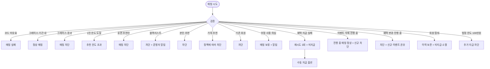

# SCR-077 리퍼럴 프로그램 페이지

## 1. 화면 메타 정보

| 항목 | 값 |
|---|---|
| 작성일 | 2026-05-22 |
| 버전 | v1.0 |
| 상태 | 최신 통합본 반영 (정합화 완료) |
| 도메인 | D08 마케팅 |
| 화면 ID | SCR-077 |
| 화면명 | 리퍼럴 프로그램 |
| 화면 유형 | 일반 화면 |
| 라우트 (URL) | `/marketing/referral` |
| 플랫폼 | 데스크톱(기본), 태블릿 |
| 우선순위 | P1 (출시 후 권장) |
| 기능코드 | MKT-07 |
| 계약 상태 | 계약 범위 본기능 (퍼블리싱 완료 / 데이터 미연동) |
| 부모 기능 prefix | MKT |
| Lv1 코드 | MKT-07 |
| Lv2 / Lv3 세분화 | MKT-07-01 ~ MKT-07-06 (이벤트 목록, 등록, 실적 현황, 추천 이력, 삭제, 자동 처리) |
| 연계 화면 | SCR-074 마일리지, SCR-073 쿠폰, SCR-M004 회원, 회원앱 추천 화면, SCR-097 감사로그 |
| 호출 다이얼로그 | DLG-077-001 리퍼럴등록, DLG-077-002 리퍼럴삭제 |

## 2. 화면 개요와 목적

리퍼럴 프로그램 페이지는 기존 회원이 지인을 추천해 새 회원을 유치하면 추천인·피추천인 양쪽에게 혜택(마일리지/쿠폰/할인)을 제공하는 리퍼럴 프로그램을 설정·실행·실적 관리하는 화면입니다. 회원앱에서 회원별 고유 추천 코드를 자동 발급해 SNS·카톡으로 공유하고, 피추천인 등록 시 자동 매칭으로 양방향 혜택을 자동 지급합니다. 구전 마케팅을 체계화해 신규 회원 유치 비용(CAC)을 광고 대비 1/3~1/5 수준으로 절감합니다.

운영 시나리오: 이벤트 등록(추천인 5,000원 쿠폰 + 피추천인 10% 할인 양방향 혜택 설계), 추천 코드 자동 발급(회원앱에 회원별 고유 코드 자동 생성, 예: REF-홍길동-A1B2), 외부 공유(회원이 카톡/SNS/문자로 코드 공유), 피추천인 등록 시 자동 매칭(등록 화면에 추천 코드 입력 → 매칭 → 양방향 혜택 자동 지급), 1인당 추천 제한(기본 5명), 혜택 자동 지급(피추천인 등록완료 시점에 양쪽 마일리지/쿠폰 자동 지급), 추천 이력(추천인↔피추천인 매핑 + 전환 여부 + 혜택 지급 상태), 캠페인(MKT-06) 연동, 그레이스 기간(종료 후 7~30일 이내 등록은 정상 매칭), 부정 사용 감지(동일 IP 반복).

## 3. 진입 경로와 인접 화면

진입 경로: 사이드바 "마케팅 > 리퍼럴 프로그램", 캠페인 관리(SCR-076)의 연결 자원에서 리퍼럴 카드 클릭, 대시보드의 리퍼럴 KPI 카드.

인접 화면: 마일리지(SCR-074), 쿠폰(SCR-073), 회원 상세(SCR-M004), 회원앱 추천 화면, 감사 로그(SCR-097).

## 4. 레이아웃과 UI 구성

페이지 헤더 좌측 "리퍼럴 프로그램" 타이틀, 우측 "+ 이벤트 등록"(DLG-077-001) 버튼.

실적 현황 카드 3종: 전체 추천 건수, 성공 전환 건수, 지급된 혜택 합계.

상태 필터 탭: 전체 / 준비 / 진행 / 종료.

리퍼럴 이벤트 목록 테이블: 이벤트명, 추천인 혜택(마일리지/쿠폰/할인), 피추천인 혜택, 기간(시작~종료), 참여 수, 상태 배지(준비/진행/종료), 행 액션([수정]/[삭제]/[실적]).

이벤트명 클릭 시 우측 패널 슬라이드 인. 패널 내부: 추천인/피추천인 이력 목록(추천인 이름·피추천인 이름·추천 일시·전환 여부·혜택 지급 상태[지급/대기/미지급]), 실적 그래프(일자별 매칭 건수·전환 건수), 부정 사용 감지 알림.

본사 통합 이벤트는 행에 "본사" 배지.

## 5. 추천 코드와 매칭 메커니즘

추천 코드 발급: 시작일 도래 시 회원앱에 회원별 고유 코드 자동 생성(예: REF-회원ID-랜덤 영숫자 8~16자). 회원이 회원앱 추천 화면에서 코드 확인 + 카톡/SNS/문자 공유. 수동 발급 옵션은 매니저가 회원에게 수동으로 코드 부여(오프라인 캠페인용).

매칭 흐름: 신규 회원 등록 화면(SCR-M002)에서 추천 코드 입력(선택) → 코드 검증(존재·유효 기간·1인 한도·휴면·블랙리스트) → 매칭 성공 시 `referral_match` INSERT(추천인·피추천인·이벤트) → 등록완료 시점에 양방향 혜택 자동 지급(마일리지/쿠폰 발급) → 추천인·피추천인에게 알림 발송.

매칭 검증 항목: 추천 코드 유효, 이벤트 진행 중(또는 그레이스 기간 내), 추천인 1인 한도 미도달, 추천인이 휴면/블랙리스트가 아님, 피추천인이 기존 회원이 아님(또는 재등록 회원 정책에 따라), 본인이 본인 코드 사용이 아님, 가족 그룹 멤버끼리 추천이 아님(정책에 따라), 부정 사용 의심(동일 IP 반복)이 아님.

혜택 지급 실패 처리: 운영자가 추천 이력에서 [지급 대기] 행 클릭 → 사유 확인(휴면·차단·정책 위반) → 수동 지급 또는 정책 적용.

## 6. 버튼·아이콘·링크 액션 전체 정의

"+ 이벤트 등록" 버튼: DLG-077-001 호출.

실적 현황 카드 3종 클릭 시 해당 통계로 상세 패널 자동 스크롤.

상태 필터 탭: 클릭 즉시 갱신.

이벤트명 클릭: 우측 패널 슬라이드 인.

행 [실적]: 패널 슬라이드 인(이벤트명 클릭과 동일).

행 [수정]: 진행 전 전체 수정. 진행 중 혜택 종류·금액 변경 차단(신규 이벤트 등록 권유).

행 [삭제]: DLG-077-002. 진행 전 hard delete. 진행 중/종료는 soft delete.

추천 이력의 [지급 대기] 행 클릭: 사유 확인 → 수동 지급 또는 정책 적용 모달.

부정 사용 감지 알림 카드: "조치하기" 버튼 → 매칭 보류 해제 또는 매칭 거부 선택.

## 7. 호출되는 모달 동작

### 7-1. DLG-077-001 리퍼럴 이벤트 등록

본문: 이벤트명(필수), 추천인 혜택(마일리지/쿠폰/할인 다중), 피추천인 혜택(마일리지/쿠폰/할인 다중), 혜택 지급 시점(피추천인 등록 완료 즉시 / 첫 결제 완료 시점), 추천 코드 발급 방식(자동/수동), 기간(시작/종료), 1인 최대 추천 횟수(기본 5명).

검증: 시작 ≤ 종료. 혜택 1개 이상 설정 필수.

저장 시 준비 상태 등록 + 시작일에 회원앱 코드 자동 발급.

### 7-2. DLG-077-002 리퍼럴 이벤트 삭제 확인

본문: "이 이벤트를 삭제하시겠습니까? 삭제 시 발급된 추천 코드가 모두 무효화됩니다" 안내.

확인 시 진행 중 매칭은 정상 처리, 신규 매칭 차단. 종료 후 결과 영구 보존.

## 8. 토스트와 확인 팝업과 알럿

성공: "이벤트를 등록했어요", "이벤트를 수정했어요", "이벤트를 삭제했어요", "혜택을 수동 지급했어요".

실패: "추천 코드가 유효하지 않습니다", "추천 한도 초과", "휴면 회원은 추천 불가", "본인 추천 불가", "이미 회원으로 등록된 번호", "권한이 없어요".

부정 사용 감지: 운영자에게 알림 + 매칭 보류 카드 노출.

## 9. 데이터 흐름과 외부 연동

화면 진입 시 `GET /api/referrals`.

이벤트 등록 `POST /api/referrals`, 삭제 `DELETE /api/referrals/:id`.

이력 조회 `GET /api/referrals/:id/history`.

추천 코드 발급 `POST /api/referrals/:id/issue-code`.

매칭 `POST /api/referrals/match` (referral_code, new_member_id).

추천 코드 자동 발급 배치: 이벤트 시작일 도래 시 회원앱에 회원별 코드 발급.

자동 매칭: 신규 등록 + 추천 코드 입력 → `referral_match` INSERT + 검증.

양방향 혜택 자동 지급: 등록완료 시점에 마일리지(MKT-04) / 쿠폰(MKT-03) 자동 지급.

알림 발송(MKT-01): 매칭 / 지급 / 미지급 시 추천인·피추천인에게 알림.

시작일 자동 활성/종료일 자동 종료: 매일 04:00 배치.

부정 사용 감지 배치: 매시간 동일 IP / 비정상 패턴 감지 + 매칭 보류.

자동 재시도(지급 webhook): 1분/5분/30분 3회.

회원 탈퇴/병합/이관 시 처리는 정책에 따라.

법정 한도 모니터링: 매일 04:00에 회원별 누적 100만원 도달 알림(세무 의무).

본사 통합 이벤트 동기화: 슈퍼관리자 등록 시 전 지점 즉시 노출.

MKT-06 캠페인 연동: 캠페인 활성 시 리퍼럴 이벤트 통합 ROI.

추천 이력 영구 보존: 이벤트 종료 + 90일 후 아카이브(분석/세무용).

그레이스 기간 매칭: 종료 후 7~30일 내 매칭 정상 처리(정책).

등록·수정·삭제·매칭·지급·미지급 모두 SCR-097 감사 로그.

## 10. 화면 상태와 예외 처리

상태: 데이터 미연동(목업), 이벤트 없음(생성 CTA), 진행 중(실시간 실적).

예외: 추천 코드 미유효(오타·만료) 매칭 실패. 그레이스 기간 내 매칭 정상 처리/경과 시 차단. 1인 한도 도달 매칭 차단. 휴면 추천인 차단. 블랙리스트 차단 + 운영자 알림. 본인 추천 차단. 가족 회원끼리 추천 정책에 따라 차단. 기존 회원 피추천 차단. 부정 사용 의심 매칭 보류 + 알림. 혜택 지급 실패 자동 재시도 3회 + 미지급 상태. 이벤트 삭제 진행 중 매칭 정상 처리 + 신규 차단. 이벤트 수정 혜택 변경 진행 중 차단. 회원 탈퇴 후 추천 이력 보존, 미지급 혜택 소멸. 회원 병합 후 이력 합산. 법정 한도 100만원 도달 추가 지급 차단. 본사 vs 지점 충돌 본사 우선 또는 둘 다(정책). 양방향 1쪽만 지급(휴면) 정책에 따라.

## 11. 권한별 처리

슈퍼관리자·본사: 전 지점 + 본사 통합 이벤트.

센터장·매니저: 소속 지점 + 등록·수정·삭제·실적.

FC·트레이너·스태프·readonly: 차단.

## 12. 메인 흐름

```mermaid
flowchart TD
    A([리퍼럴 진입]) --> B[GET /api/referrals]
    B --> C[이벤트 목록 + 실적]
    C --> D{사용자 액션}
    D -->|+ 이벤트 등록| E[DLG-077-001]
    D -->|이벤트명 클릭| F[추천 이력 패널]
    D -->|행 [삭제]| G[DLG-077-002]
    E --> H{검증}
    H -->|통과| I[준비 상태 등록]
    I --> J([시작일 04:00 배치])
    J --> K[회원앱 코드 자동 발급]
    K --> L[회원이 카톡/SNS 공유]
    L --> M([피추천인 등록 + 코드 입력])
    M --> N{검증}
    N -->|성공| O[referral_match INSERT]
    O --> P[등록완료 시 양방향 혜택 자동 지급]
    P --> Q[추천인/피추천인 알림]
    N -->|실패| R[매칭 실패 안내]
```

## 13. 에러와 예외 흐름



## 14. 핵심 디자인 요청사항

실적 현황 카드 3종은 동일 그리드. 매칭 건수가 증가하면 카드 숫자가 작은 애니메이션과 함께 갱신.

상태 배지 색상: 준비 파랑, 진행 녹색, 종료 회색.

추천 이력 패널은 매칭 타임라인 형태로 표시(추천인 → 피추천인 화살표 + 혜택 지급 상태 배지).

부정 사용 감지 카드는 빨강 톤으로 시각적으로 강조되어 운영자가 즉시 조치할 수 있게 합니다.

DLG-077-001 모달은 양방향 혜택(추천인/피추천인)이 좌우 분할로 시각적으로 명확히 구분되어야 합니다.

회원앱에 발급된 추천 코드는 회원이 한 번에 복사·공유할 수 있는 UI로 설계되어야 합니다(관리자 화면 범위 외이지만 연동 디자인 일관성 필요).

## 15. 운영 정책 (이 화면에 연결된 부분)

추천 코드 발급: 회원앱에서 회원별 고유 코드 자동 발급(예: REF-회원ID-랜덤). 수동 발급 옵션(오프라인 캠페인용).

양방향 혜택: 추천인·피추천인 각각 혜택 설계. 마일리지/쿠폰/할인 중 선택(다중 가능).

자동 매칭: 피추천인 등록 시 추천 코드 입력 → 자동 매칭 → 등록완료 시점에 양방향 혜택 자동 지급.

1인 추천 한도: 1인당 N명 제한(기본 5명). 도달 시 매칭 차단.

이벤트 기간: 시작 ≤ 종료. 종료 후 그레이스 기간(7~30일) 내 매칭은 정상 처리.

본인 추천 차단: 본인이 본인 코드 사용 차단.

휴면/블랙리스트 차단: 휴면 또는 블랙리스트 회원의 추천·피추천 차단.

가족 회원 추천 차단(MBR-EXT-02): 동일 가족 그룹 멤버끼리 추천 정책에 따라 차단 또는 허용.

기존 회원 피추천 차단: 이미 회원인 사람이 코드 사용 시 차단. 단 재등록 회원은 정책에 따라.

부정 사용 감지: 동일 IP 반복 매칭 / 비정상 패턴 감지 → 매칭 보류 + 운영자 알림.

상태 3종: 준비 / 진행 / 종료. 시작일 자동 활성, 종료일 자동 종료.

혜택 자동 지급: 등록완료 시점에 양방향 자동 지급. webhook 실패 시 재시도 3회 + 미지급 상태.

혜택 지급 실패 처리: 운영자가 추천 이력에서 [지급 대기] 행 클릭 → 사유 확인 → 수동 지급.

회원 탈퇴 시 처리: 이력 보존, 미지급 혜택은 소멸. 지급된 혜택은 정책에 따라 회수 또는 유지.

회원 병합(MBR-EXT-01): 부 계정 추천 이력 → 주 계정으로 합산.

이벤트 삭제 정책: 진행 전 hard delete. 진행 중/종료는 soft delete(이력 보존).

이벤트 수정 정책: 진행 전 전체 수정. 진행 중 혜택 종류·금액 변경 차단(신규 이벤트 등록 권유).

법정 한도: 추천 보상 누적 100만원/년 제한(세무 의무, 정책).

본사 통합 이벤트: 슈퍼관리자가 전 지점 일괄 등록. 지점 이벤트와 동시 운영 시 정책에 따라 충돌 처리.

추천 코드 정책: 영숫자 8~16자. 회원 ID 또는 이름 일부 포함 가능(선택).

권한별 가시성: 슈퍼관리자 전 지점 + 본사 통합. 센터장·매니저 소속 지점 + 등록·수정·삭제·실적. FC·트레이너·스태프·readonly 차단.

추천 이력 영구 보존: 이벤트 종료 후에도 영구 보존(분석/세무 의무).

MKT-06 캠페인 연동: 캠페인에 리퍼럴 이벤트 연결 가능. 통합 ROI 분석.

감사 로그: 등록·수정·삭제·매칭·혜택 지급·미지급 사유 모두 SCR-097 기록.

이상의 모든 정책은 별도 문서 없이 이 한 장만 보면 이해할 수 있도록 풀어 적었습니다.
