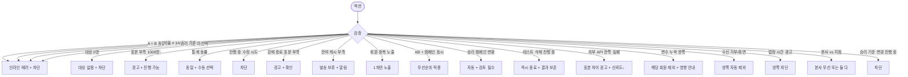

# SCR-079 A/B 테스트 페이지

## 1. 화면 메타 정보

| 항목 | 값 |
|---|---|
| 작성일 | 2026-05-22 |
| 버전 | v1.0 |
| 상태 | 최신 통합본 반영 (정합화 완료) |
| 도메인 | D08 마케팅 |
| 화면 ID | SCR-079 |
| 화면명 | A/B 테스트 |
| 화면 유형 | 일반 화면 |
| 라우트 (URL) | `/marketing/ab-test` |
| 플랫폼 | 데스크톱(기본), 태블릿 |
| 우선순위 | P1 (출시 후 권장) |
| 기능코드 | MKT-09 |
| 계약 상태 | 계약 범위 본기능 (퍼블리싱 완료 / 데이터 미연동) |
| 부모 기능 prefix | MKT |
| Lv1 코드 | MKT-09 |
| Lv2 / Lv3 세분화 | MKT-09-01 ~ MKT-09-06 (테스트 목록, 등록, 진행, 결과 비교, 승리 채택, 삭제) |
| 연계 화면 | SCR-076 캠페인, SCR-071 메시지, SCR-073 쿠폰, SCR-097 감사로그 |
| 호출 다이얼로그 | DLG-079-001 AB테스트등록, DLG-079-002 AB테스트삭제 |

## 2. 화면 개요와 목적

A/B 테스트 페이지는 두 가지 버전(A안 / B안)의 메시지나 쿠폰 중 어느 것이 더 효과적인지 비교 실험하는 A/B 테스트를 설정·진행·결과 분석하는 화면입니다. 무작위 분배·통계적 유의성 검증·승리 자동 판정·승리 버전 정식 캠페인(MKT-06) 자동 변환으로 데이터 기반 마케팅 전략 최적화를 지원합니다. 정성적 추측이 아닌 정량 지표(도달 / 클릭율 / 전환율 / 매출 기여)로 의사결정합니다.

운영 시나리오: 메시지 카피 비교(A안 "10% 할인" vs B안 "특가 이벤트"), 쿠폰 가치 비교(정액 5,000원 vs 정률 10%), MMS 이미지 비교, 발송 시간대 비교(12:30 vs 19:00), 무작위 50:50 분배 또는 우세안 추정 시 70:30 편향 분배, 통계적 유의성 검증(최소 1000명 표본, p-value < 0.05), 승리 자동 판정, 동률 시 운영자 수동 채택, MKT-06 캠페인 자동 변환(1클릭 전환).

## 3. 진입 경로와 인접 화면

진입 경로: 사이드바 "마케팅 > A/B 테스트", 캠페인 관리(SCR-076)의 AB 테스트 연동, 대시보드의 마케팅 KPI 카드.

인접 화면: 캠페인 관리(SCR-076), 메시지 발송(SCR-071), 쿠폰 관리(SCR-073), 감사 로그(SCR-097).

## 4. 레이아웃과 UI 구성

페이지 헤더 좌측 "A/B 테스트" 타이틀, 우측 "+ 테스트 등록"(DLG-079-001) 버튼.

상태 필터 탭: 전체 / 준비 / 진행 / 완료.

A/B 테스트 목록 테이블: 테스트명, 유형 배지(메시지/쿠폰), 기간, 상태 배지(준비 파랑/진행 녹색/완료 회색), 승리 버전(A안/B안/동일), 행 액션([상세]/[삭제]).

테스트명 또는 행 [상세] 클릭 시 결과 비교 패널 슬라이드 인. 패널 내부: A안 / B안 나란히 비교(도달 수, 클릭율, 전환율, 매출 기여 4종 지표), 통계적 유의성 표시(p-value < 0.05면 승리 판정, 그 외 동일), 승리 버전 채택 버튼, MKT-06 캠페인 자동 변환 버튼.

진행 중 테스트의 실시간 지표는 5분 간격으로 자동 갱신되며 마지막 갱신 시각이 표시됩니다.

본사 통합 AB 테스트는 행에 "본사" 배지.

## 5. 무작위 분배와 통계 검증 메커니즘

무작위 분배: 시작일 자동 활성 시 대상 인원을 비율(50:50 / 70:30 / 기타)에 따라 무작위 분배 + `ab_assignment` INSERT. 동일 회원은 한 버전만 받음(중복 노출 차단).

다중 AB 테스트 동시 진행 시 동일 회원 1개만 노출(정책).

통계적 유의성 검증: 종료일 자동 종료 시 통계 검증 + p-value 계산. p < 0.05면 승리 판정, 미달이면 "동일" 표시.

최소 표본 1000명 권장. 미달 시 "통계적 유의성 미달" 경고 + 결과는 표시.

승리 자동 판정 후 운영자 수동 선택(동률 시), MKT-06 캠페인 자동 변환(1클릭 + 운영자 검토 필수, 즉시 활성 차단).

강제 종료: 결과 명확 시 종료 전 종료 가능. 표본 부족 경고 + 확인.

진행 중 수정 차단: 일체 수정 불가(강제 종료만 가능).

## 6. 버튼·아이콘·링크 액션 전체 정의

"+ 테스트 등록" 버튼: DLG-079-001 호출.

상태 필터 탭: 클릭 즉시 갱신.

테스트명/[상세] 클릭: 결과 비교 패널 슬라이드 인.

행 [삭제]: DLG-079-002. 진행 전 hard delete. 진행 중/종료 soft delete(결과 보존).

결과 비교 패널의 "승리 버전 채택" 버튼: 통계적 유의성 통과 시 활성. 누르면 승리안이 채택되고 캠페인 변환 옵션 모달이 뜸.

"캠페인 변환(MKT-06)" 버튼: 승리안 채택 후 활성. 누르면 SCR-076 캠페인 등록 화면이 자동 채워진 상태로 열림(운영자 검토 후 활성).

강제 종료 버튼: 진행 중 테스트에서 활성. 표본 부족 경고 + 확인 후 종료.

진행 중 수정 시도: "수정 불가" 차단. 강제 종료만 가능.

페이지네이션 컨트롤.

## 7. 호출되는 모달 동작

### 7-1. DLG-079-001 A/B 테스트 등록

본문: 테스트명(필수, 1~50자), 테스트 유형(메시지/쿠폰 라디오), A안 내용(텍스트·이미지 또는 쿠폰 조건), B안 내용(텍스트·이미지 또는 쿠폰 조건), 대상 분배 비율(50:50 / 70:30 / 기타 사용자 지정), 대상 인원(무작위 분배 → 세그먼트 선택), 기간(시작/종료), 승리 기준(클릭율 / 전환율 / 매출 기여 1개 선택, 진행 중 변경 차단).

검증: A안 = B안 동일 내용 차단. 비율 합계 = 100% 검증. 시작 > 종료 차단. 대상 인원 0명 차단. 승리 기준 미선택 차단.

저장 시 준비 상태 등록 + 시작일에 자동 활성 + 무작위 분배 시작.

### 7-2. DLG-079-002 A/B 테스트 삭제 확인

본문: "이 A/B 테스트를 삭제하시겠습니까? 진행 중인 테스트는 즉시 중단되며 수집된 데이터도 삭제됩니다" 안내. 단, 결과 보존 정책이 활성이면 "결과는 영구 보존됩니다" 추가 안내.

확인 시 진행 전 hard delete, 진행 중 즉시 종료 + soft delete, 종료 soft delete(결과 영구 보존).

### 7-3. 강제 종료 모달

진행 중 테스트의 "강제 종료" 버튼 클릭 시 뜨는 모달. 표본 부족 시 경고 + 확인.

확인 시 통계 검증 + 우승안 채택 또는 동률 처리.

### 7-4. 동률 수동 선택 모달

통계적 동일 또는 표본 부족으로 자동 판정 불가 시 종료 후 자동 표시. "A안 / B안 / 동률 처리" 선택.

### 7-5. 캠페인 변환 확인 모달

승리안 채택 후 "캠페인으로 변환" 클릭 시 자동 변환 + 운영자 검토 필수 안내 + SCR-076 등록 화면으로 이동.

## 8. 토스트와 확인 팝업과 알럿

성공: "테스트를 등록했어요", "테스트를 삭제했어요", "테스트를 강제 종료했어요", "승리 버전을 채택했어요", "캠페인으로 변환되었어요(검토 후 활성하세요)".

실패: "A안과 B안이 같습니다", "비율 합계가 100%가 아닙니다", "대상 회원이 없습니다", "진행 중 테스트는 수정 불가", "권한이 없어요".

확인 팝업: 강제 종료 시 표본 부족 경고 + 확인. 동률 수동 선택 모달.

알럿: 권한 없는 계정 접근 시 차단 화면.

표본 부족 경고: 진행 중 모니터링에서 1000명 이하 시 알림.

## 9. 데이터 흐름과 외부 연동

화면 진입 시 `GET /api/ab-tests`. 응답: 테스트 배열 + 상태별 카운트.

테스트 등록 `POST /api/ab-tests`, 삭제 `DELETE /api/ab-tests/:id`.

결과 조회 `GET /api/ab-tests/:id/results`.

승리안 채택 `POST /api/ab-tests/:id/adopt-winner`.

시작일 자동 활성 배치: 매일 04:00. 준비 → 진행 + 무작위 분배 시작.

종료일 자동 종료 배치: 매일 04:00. 진행 → 완료 + 통계 검증 + 승리 판정.

무작위 분배: 시작일 활성 시 비율에 따라 분배 + `ab_assignment` INSERT.

메시지 발송(MKT-01) / 쿠폰 발급(MKT-03): A/B 분배 후 각 버전 발송.

실시간 지표 수집: 발송/클릭/결제 webhook으로 도달·클릭·전환·매출 갱신.

통계적 유의성 검증: 종료일 자동 + 강제 종료 시 p-value 계산 + 승리 판정.

캠페인 변환(MKT-06): 승리안 채택 시 캠페인 등록 자동 입력 + 검토 화면.

회원 중복 노출 차단: 다중 AB 동시 진행 시 동일 회원 1개만 노출.

법정 시간 차단: 발송 시점 21~08시 양쪽 차단(광고).

수신 거부/휴면 자동 제외: 양쪽 동일 적용.

결과 영구 보존: 종료 후 결과 영구 보존(분석/재활용).

본사 통합 AB 동기화: 슈퍼관리자 등록 시 전 지점 즉시 노출.

표본 부족 경고: 진행 중 모니터링 1000명 이하 시 알림.

잔여 캐시 부족 처리: 발송 보류 + 운영자 알림.

외부 API 발송 실패 처리: 한쪽만 실패 시 결과 신뢰도 경고 + 결과 보정.

등록 / 강제 종료 / 결과 채택 / 캠페인 변환 / 삭제 모두 SCR-097 감사 로그.

## 10. 화면 상태와 예외 처리

상태: 데이터 미연동(목업) / 테스트 없음(생성 CTA) / 진행 중(실시간 지표) / 분석 가능(완료, 비교 패널 활성).

예외: A안 = B안 동일 차단. 비율 합계 ≠ 100% 차단. 시작 > 종료 차단. 대상 인원 0명 차단. 승리 기준 미선택 차단. 표본 부족(1000명 이하) 경고 + 진행 가능. 통계적 동률 "동일" 표시 + 운영자 수동 선택. 진행 중 수정 시도 차단. 강제 종료(표본 부족) 경고 + 확인. 잔여 캐시 부족 발송 보류 + 알림. 회원 중복 노출 다중 AB 1개만(정책). AB + 캠페인 동시 우선순위(정책). 승리안 캠페인 변환 자동 + 검토 필수(즉시 활성 차단). 테스트 삭제(진행 중) 즉시 종료 + 결과 보존. 테스트 삭제(종료) soft delete + 결과 보존. 외부 API 발송 실패(한쪽) 표본 차이 경고 + 신뢰도↓. 변수 데이터 누락(한쪽) 발송 제외 + 결과 영향 안내. 수신 거부/휴면 양쪽 자동 제외. 법정 시간 양쪽 차단(광고). 본사 vs 지점 충돌 본사 우선 또는 둘 다(정책). 승리 기준 변경 시도(진행 중) 차단.

## 11. 권한별 처리

슈퍼관리자·본사: 전 지점 + 본사 통합 AB.

Owner(지점장)·매니저: 소속 지점 + 등록·삭제·결과·채택.

FC·트레이너·스태프·readonly: 차단.

## 12. 메인 흐름

```mermaid
flowchart TD
    A([AB 테스트 진입]) --> B[GET /api/ab-tests]
    B --> C[목록 + 상태 필터]
    C --> D{사용자 액션}
    D -->|+ 테스트 등록| E[DLG-079-001]
    D -->|테스트명/[상세]| F[결과 비교 패널]
    D -->|행 [삭제]| G[DLG-079-002]
    E --> H{검증}
    H -->|통과| I[준비 상태 등록]
    I --> J([시작일 04:00 배치])
    J --> K[무작위 분배 + ab_assignment INSERT]
    K --> L[메시지/쿠폰 각 버전 발송]
    L --> M[실시간 지표 수집]
    M --> N([종료일 04:00 배치])
    N --> O[통계 검증 + 승리 판정]
    O --> P{결과}
    P -->|p < 0.05| Q[승리 자동 판정]
    P -->|동률| R[운영자 수동 선택]
    Q --> S[승리안 채택 + 캠페인 변환 옵션]
    R --> S
    S --> T[MKT-06 캠페인 등록 자동 입력 + 검토 필수]
    D -->|강제 종료| U[표본 부족 경고 + 확인]
    U --> O
```

## 13. 에러와 예외 흐름



## 14. 핵심 디자인 요청사항

상태 배지 색상: 준비 파랑, 진행 녹색, 완료 회색.

승리 버전 컬럼은 A안/B안 색상 분기(A 파랑, B 보라, 동일 회색).

결과 비교 패널은 A안/B안이 좌우 대칭으로 명확히 구분되어야 합니다. 4종 지표(도달/클릭율/전환율/매출)가 동일 그리드로 비교 가능.

승리안에는 트로피 또는 체크 아이콘 강조.

통계적 유의성 표시(p-value)는 색상으로 강조: p < 0.05 녹색(유의), p ≥ 0.05 노랑(미달).

진행 중 테스트의 실시간 지표 갱신은 마지막 갱신 시각과 자동 갱신 표시.

DLG-079-001 등록 모달은 A안/B안 입력 영역이 좌우 분할로 시각적으로 명확.

캠페인 변환 버튼은 강조 톤(녹색 또는 강조 색)으로 표시되어 운영자가 1클릭 변환을 빠르게 인지.

## 15. 운영 정책 (이 화면에 연결된 부분)

상태 3종: 준비 / 진행 / 완료. 시작일 자동 활성, 종료일 자동 종료.

유형 2종: 메시지 / 쿠폰. 메시지는 텍스트·이미지·발송 시간. 쿠폰은 정액·정률·금액·기간 비교.

무작위 분배: 대상 인원을 비율(50:50/70:30/기타)에 따라 무작위 분배. 동일 회원은 한 버전만 받음(중복 노출 차단).

대상 비율 검증: A + B = 100%. 합계 불일치 시 저장 차단.

표본 수 정책: 최소 1000명 권장. 미달 시 "통계적 유의성 미달" 경고(결과는 표시).

통계적 유의성: p-value < 0.05 검증. 통과 시 승리 자동 판정, 미통과 시 "동일".

승리 기준 3종: 클릭율 / 전환율 / 매출 기여. 등록 시 1개 선택. 진행 중 변경 차단.

결과 비교 4종 지표: 도달 수 / 클릭율 / 전환율 / 매출 기여. 실시간 갱신.

승리 자동 판정: 종료 후 자동 통계 검증 + 우승안 표시.

동률 시 수동 채택: 통계적 동일 또는 표본 부족 시 운영자 수동 선택.

승리 채택 시 캠페인 변환(MKT-06): 1클릭 변환 + 운영자 검토 필수(즉시 활성 차단).

진행 중 수정 차단: 진행 중 테스트는 일체 수정 차단(강제 종료만 가능).

강제 종료: 결과 명확 시 종료 전 종료 가능. 표본 부족 경고 + 확인.

삭제 정책: 진행 전 hard delete. 진행 중·종료는 soft delete(결과 보존).

AB 동일 내용 차단: A안·B안 내용이 동일하면 저장 차단.

회원 중복 노출 정책: 다중 AB 테스트 동시 진행 시 동일 회원 1개만(정책).

법정 시간 차단: 양쪽 동일하게 21~08시 차단.

수신 거부/휴면 자동 제외: 양쪽 동일 적용.

잔여 캐시 부족 처리: 발송 보류 + 운영자 알림.

권한별 가시성: 슈퍼관리자 전 지점 + 본사 통합. Owner(지점장)·매니저 소속 지점 + 등록·삭제·결과·채택. FC·트레이너·스태프·readonly 차단.

결과 영구 보존: 종료 후 결과 영구 보존(학습·재활용).

본사 통합 AB 테스트: 슈퍼관리자가 전 지점 일괄 테스트.

외부 API 발송 실패 시 결과 신뢰도: 양쪽 표본 차이 발생 시 경고 표시.

감사 로그: 등록·강제 종료·결과 채택·캠페인 변환·삭제 모두 SCR-097 기록.

이상의 모든 정책은 별도 문서 없이 이 한 장만 보면 이해할 수 있도록 풀어 적었습니다.
