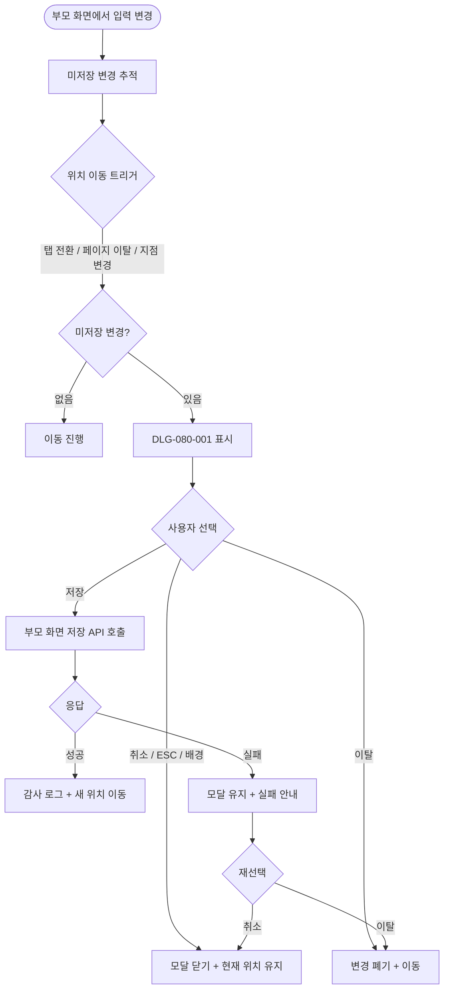
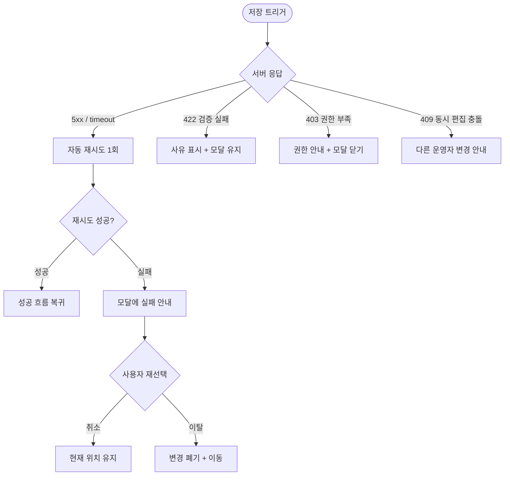

# DLG-080-001 미저장 경고 다이얼로그

## 1. 다이얼로그 메타 정보

이 문서는 미저장 경고 다이얼로그에 대한 자기완결형 요구사항 정의서입니다.

| 항목 | 값 |
|---|---|
| 작성일 | 2026-05-22 |
| 버전 | v1.0 |
| 상태 | 최신 통합본 반영 (정합화 완료) |
| 도메인 | D09 설정관리 |
| 다이얼로그 ID | DLG-080-001 |
| 다이얼로그명 | 미저장 경고 |
| 다이얼로그 유형 | 확인 다이얼로그 (Confirmation Dialog) |
| 우선순위 | P0 (출시 필수) |
| 부모 화면 | SCR-080 센터설정, SCR-082 키오스크설정, SCR-082A 키오스크IoT설정, SCR-083 IoT출입관리, SCR-086 출석관리설정, SCR-088 다국어설정 |
| 트리거 | 미저장 변경 + 탭 전환 / 페이지 이탈 / 지점 컨텍스트 변경 |

## 2. 다이얼로그 개요와 목적

미저장 경고 다이얼로그는 운영자가 입력 변경 사항을 저장하지 않은 상태에서 다른 탭·다른 화면·다른 지점으로 이동하려고 할 때, 변경 손실을 막기 위해 강제로 표시되는 차단형 모달입니다. D09 설정관리 도메인의 거의 모든 입력 화면에서 공통으로 사용되며, 운영자가 "저장하지 않은 변경이 있다"는 사실을 명확히 인지하고 의식적으로 다음 행동(저장·이탈·취소)을 선택하도록 보장합니다.

다이얼로그가 호출되는 트리거는 세 가지입니다. 첫째, 부모 화면 내부에서 다른 탭으로 전환하려고 할 때(SCR-080 센터 설정의 기본정보 → 알림설정 탭 전환 등)입니다. 둘째, 사이드바·헤더 메뉴·브라우저 뒤로가기 등으로 페이지 자체를 떠나려고 할 때입니다. 셋째, 본사 슈퍼관리자가 지점 컨텍스트 드롭다운에서 다른 지점을 선택하려고 할 때입니다. 어떤 트리거든 미저장 변경이 한 건 이상 존재하면 이 모달이 즉시 표시되어 운영자의 다음 행동을 묻습니다.

이 다이얼로그의 핵심 가치는 입력 손실 방지와 의식적 선택 강제입니다. 운영자가 무심코 다른 화면으로 이동했다가 입력을 잃는 사고를 막고, 동시에 "잘못 입력했는데 저장하고 싶지 않다"는 정상 시나리오도 [이탈] 옵션으로 보장합니다.

## 3. 호출 컨텍스트와 부모 화면

이 다이얼로그는 D09 설정관리의 다음 화면에서 미저장 변경 감지 시 호출됩니다.

SCR-080 센터 설정에서는 기본정보·알림설정·테마설정·물품 관리 네 탭 사이의 전환과 페이지 이탈 시 호출됩니다.

SCR-082 키오스크 설정에서는 출석 방식·화면 구성·기능 표시 변경 후 페이지 이탈 시 호출됩니다.

SCR-082A 키오스크 IoT 설정에서는 키오스크 본체 메타데이터 변경 후 페이지 이탈 시 호출됩니다.

SCR-083 IoT 출입 관리에서는 출입 방식·중복 방지·보관 기간·알림 토글 변경 후 페이지 이탈 시 호출됩니다.

SCR-086 출석 관리 설정에서는 인정 시간·지각 기준·QR 출석·자동 출석·정정 권한·보관 기간 변경 후 페이지 이탈 시 호출됩니다.

SCR-088 다국어 설정에서는 언어·국가·자동 번역 설정 변경 후 페이지 이탈 시, 그리고 관리자 화면 언어 변경 저장 직전(미저장 작업이 별도로 있는 경우) 선처리로 호출됩니다.

이 외에도 D09 도메인의 모든 입력형 화면에서 변경 손실 위험이 있는 경우 동일한 패턴으로 호출됩니다.

## 4. 레이아웃과 UI 구성

미저장 경고 다이얼로그는 부모 화면을 어둡게 처리한 위에 중앙 정렬로 표시되는 모달입니다. 모달 크기는 데스크톱 기준 가로 약 480px, 세로는 내용에 따라 자동 조정됩니다. 모바일에서는 가로 폭이 화면 거의 전체를 차지하며 하단에서 슬라이드 업으로 등장합니다.

모달 상단에는 경고 아이콘과 함께 "저장되지 않은 변경 사항이 있습니다" 제목이 표시됩니다. 제목 아래에는 부연 설명 한 줄이 따라옵니다("계속 이동하면 변경 사항이 사라집니다").

본문에는 어느 탭·어느 영역의 어떤 항목이 변경되었는지를 짧게 요약한 목록이 표시됩니다. 예를 들어 "기본정보 탭: 센터명, 평일 운영시간 변경", "알림설정 탭: 앱 푸시 입장 알림 변경" 같은 형식입니다. 변경 항목이 많은 경우 앞쪽 3~5개만 표시되고 "외 N개 더보기" 링크가 따라옵니다.

하단에는 세 개의 버튼이 있습니다. 좌측에 [취소], 중앙에 [이탈], 우측에 [저장]이 배치되며, [저장]은 강조 색상으로 표시되어 기본 권장 액션임을 시각적으로 알립니다.

ESC 키와 배경 클릭은 [취소]와 동일하게 동작합니다.

## 5. 입력 항목 정의

이 다이얼로그에는 별도의 입력 필드가 없습니다. 운영자는 부모 화면에서 이미 입력한 변경 사항에 대해 후속 결정만 내리며, 새로운 데이터 입력은 하지 않습니다.

본문의 변경 항목 요약은 부모 화면에서 추적한 미저장 변경 상태를 그대로 표시하며, 사용자가 편집할 수 없습니다.

## 6. 버튼 액션 정의

[저장] 버튼은 강조 색상으로 표시되며 누르면 부모 화면의 변경 사항이 즉시 백엔드에 저장된 후 운영자가 원래 이동하려던 위치(새 탭·새 화면·새 지점)로 이동합니다. 저장 도중에는 모든 버튼이 비활성되고 스피너가 표시되며, 저장 실패 시 모달이 닫히지 않고 "저장 실패" 토스트가 표시되어 운영자가 [취소]나 [이탈] 중 다른 선택을 할 수 있게 합니다.

[이탈] 버튼은 부모 화면의 변경 사항을 모두 폐기한 후 운영자가 원래 이동하려던 위치로 이동합니다. 폐기된 변경은 복구할 수 없으므로 운영자는 이 액션의 결과를 인지하고 누릅니다.

[취소] 버튼은 모달을 즉시 닫고 부모 화면의 현재 위치(원래 탭·원래 화면·원래 지점)에 그대로 머무릅니다. 변경 사항은 그대로 보존되어 운영자가 계속 편집할 수 있습니다. ESC 키나 모달 배경 클릭도 동일하게 동작합니다.

세 버튼은 모두 클릭 후 응답이 돌아오기 전까지 자동으로 비활성화되어 더블클릭이 차단됩니다.

## 7. 호출 흐름과 부모 화면 반영

이 다이얼로그가 호출되는 흐름은 다음과 같습니다.

운영자가 부모 화면에서 한 건 이상의 입력을 변경합니다. 부모 화면은 미저장 변경 상태를 내부적으로 추적합니다.

운영자가 탭 전환·페이지 이탈·지점 변경 등 위치 이동 액션을 트리거합니다. 부모 화면은 이동 직전에 미저장 변경 상태를 확인합니다.

미저장 변경이 한 건도 없으면 이동이 그대로 진행됩니다. 미저장 변경이 한 건 이상 있으면 이 다이얼로그가 강제로 표시됩니다.

운영자가 [저장]을 선택하면 부모 화면의 저장 API가 호출되고, 응답 성공 시 원래 이동하려던 위치로 이동합니다. 응답 실패 시 모달이 닫히지 않고 토스트로 실패 안내가 표시됩니다.

운영자가 [이탈]을 선택하면 부모 화면의 변경 사항이 메모리에서 폐기되고 즉시 원래 이동하려던 위치로 이동합니다.

운영자가 [취소]를 선택하면 모달이 즉시 닫히고 부모 화면의 현재 위치에 그대로 머무릅니다.

## 8. 토스트와 알럿

다이얼로그 자체는 토스트를 발생시키지 않습니다. [저장]을 선택해 저장이 성공하면 부모 화면에서 성공 토스트가 표시되며, 저장 실패 시 부모 화면에 실패 토스트가 표시됩니다.

[이탈] 선택 시에는 별도 안내가 없으며, 폐기된 변경은 복구 불가하므로 별도 토스트도 발생하지 않습니다.

이 다이얼로그는 모든 경고가 차단형 모달 형태로 표시되며, 토스트나 인라인 안내는 사용하지 않습니다.

## 9. 데이터 흐름과 외부 연동

이 다이얼로그는 자체적으로 데이터를 fetch하거나 API를 호출하지 않습니다. 모든 데이터는 부모 화면에서 추적한 미저장 변경 상태를 그대로 표시합니다.

[저장] 선택 시에는 부모 화면의 저장 API(예: SCR-080의 `PUT /api/settings/center`)가 호출됩니다. 어떤 API가 호출될지는 부모 화면이 결정하며 이 다이얼로그는 트리거만 담당합니다.

저장 성공 시 SCR-097 감사 로그에 actor·diff JSON·timestamp INSERT가 비동기로 발생합니다. 이 INSERT는 부모 화면의 저장 흐름에서 처리되며 이 다이얼로그의 책임 범위에 포함되지 않습니다.

[이탈] 선택 시에는 어떤 API도 호출되지 않으며, 변경 사항은 부모 화면 메모리에서만 폐기됩니다. 감사 로그에도 [이탈] 이벤트는 기록되지 않습니다(저장이 일어나지 않으므로).

## 10. 다이얼로그 상태와 예외 처리

기본 상태는 모달이 열린 상태로, 세 개의 버튼이 모두 활성되어 있습니다.

저장 중 상태는 [저장]을 눌러 백엔드 응답을 기다리는 상태로, 모든 버튼이 비활성되고 [저장] 버튼 자리에 스피너가 표시됩니다.

저장 실패 상태는 저장 API가 5xx 또는 422를 반환한 경우입니다. 모달이 닫히지 않고 "저장 실패" 인라인 메시지가 본문 아래에 표시되며, 운영자는 [취소]로 돌아가서 수정하거나 [이탈]로 폐기를 선택할 수 있습니다.

예외 케이스별 처리는 다음과 같습니다.

저장 API 네트워크 오류 시 자동 재시도 1회 후 사용자 액션을 기다립니다. 재시도도 실패하면 모달에 "저장 실패" 안내가 표시되고 운영자가 [취소]/[이탈]을 선택합니다.

저장 API 422 검증 실패 시(예: 센터명 빈값) 부모 화면의 인라인 검증으로 잡혀야 정상이지만, 백엔드 단계에서 추가 검증이 실패하면 사유와 함께 "저장 실패" 안내가 표시됩니다.

저장 도중 운영자가 ESC를 눌러도 [저장] 트랜잭션은 그대로 진행됩니다. 응답 도착 시 부모 화면이 자동으로 갱신됩니다.

지점 컨텍스트 변경 트리거의 경우 [저장] 선택 시 현재 지점 컨텍스트에서 먼저 저장이 완료된 후 새 지점으로 전환됩니다.

본사 슈퍼관리자가 [전 지점 강제 배포] 같은 다른 트랜잭션을 트리거한 상태에서 이 다이얼로그가 떠 있으면, 운영자의 선택과 별도로 강제 배포가 진행될 수 있습니다.

권한 부족 상태에서는 이 다이얼로그가 호출되지 않습니다(부모 화면 진입 자체가 차단됨).

## 11. 권한별 처리

이 다이얼로그는 부모 화면에 진입할 수 있는 모든 권한자에게 동일하게 표시됩니다. 슈퍼관리자·primary·Owner(지점장)·manager(조회 화면) 모두에게 동일한 형태로 동작합니다.

다만 매니저가 진입한 화면에서는 입력 자체가 비활성된 상태이므로 미저장 변경이 발생하지 않으며, 이 다이얼로그도 호출되지 않습니다.

권한별 처리에 따른 차이는 없으며, 모든 권한자에게 동일한 [저장]/[이탈]/[취소] 옵션이 제공됩니다.

## 12. 메인 흐름

## 13. 에러와 예외 흐름

## 14. 핵심 디자인 요청사항

모달은 화면 중앙에 정렬되며 부모 화면이 어둡게 처리되어 운영자가 이 다이얼로그에 집중하도록 합니다. 모달 크기는 본문 길이에 따라 자동 조정되되 너무 작아 보이지 않도록 최소 가로 480px이 보장됩니다.

경고 아이콘은 모달 좌측 상단에 노랑 또는 주황 톤으로 표시되어 "주의" 신호가 즉시 인식됩니다.

본문의 변경 항목 요약은 깔끔한 목록 형태로 표시되어 운영자가 무엇을 변경했는지 한눈에 파악합니다.

[저장] 버튼은 강조 색상(브랜드 컬러)으로 표시되어 기본 권장 액션임을 시각적으로 알리며, [이탈]은 중성 톤, [취소]는 약한 톤으로 표시되어 운영자가 의도와 맞는 버튼을 직관적으로 선택할 수 있습니다.

모바일에서는 모달이 하단에서 슬라이드 업으로 등장하며 세 버튼이 세로로 쌓인 풀 폭 형태로 배치됩니다.

저장 중 스피너는 [저장] 버튼 자리에 표시되어 응답 대기 중임이 명확히 보입니다.

## 15. 운영 정책 (이 다이얼로그에 연결된 부분)

미저장 변경 손실 방지는 D09 설정관리 도메인의 공통 운영 원칙입니다. 운영자가 입력했던 내용이 무심코 다른 위치로 이동하면서 사라지는 사고를 막기 위해, 모든 입력형 화면은 미저장 변경 상태를 추적해야 하며 위치 이동 직전에 이 다이얼로그가 강제 표시됩니다.

세 가지 선택지(저장·이탈·취소)는 운영자의 다양한 의도를 모두 보장합니다. [저장]은 변경을 확정하고 이동, [이탈]은 변경을 폐기하고 이동, [취소]는 이동을 멈추고 계속 편집입니다. 어떤 선택도 누락되지 않아 운영자가 자신의 의도에 맞는 액션을 선택할 수 있습니다.

[저장] 선택 시 부모 화면의 저장 API가 호출되며, 응답 성공 시에만 새 위치로 이동합니다. 응답 실패 시에는 모달이 닫히지 않고 운영자에게 다음 결정(다시 시도·이탈·취소)을 묻습니다. 이는 저장 실패 상태에서 운영자가 자기도 모르게 다른 위치로 이동해 변경 손실이 발생하는 사고를 막기 위한 정책입니다.

[이탈] 선택 시 변경 사항은 메모리에서만 폐기되며 어떤 API도 호출되지 않습니다. 따라서 감사 로그에도 [이탈] 이벤트는 기록되지 않습니다. 이는 저장 자체가 일어나지 않은 경우 감사 대상이 없다는 원칙에 따른 것입니다.

ESC 키와 배경 클릭은 항상 [취소]와 동일하게 동작합니다. 운영자가 실수로 ESC를 눌러 변경 사항이 폐기되는 사고를 막기 위해, "취소"가 가장 안전한 기본 동작으로 매핑되어 있습니다.

저장 API의 네트워크 오류는 1회 자동 재시도가 적용되며, 재시도 후에도 실패하면 사용자 액션을 기다립니다. 자동 재시도는 일시적인 네트워크 끊김을 보완하면서도 무한 재시도로 인한 응답 지연을 막는 균형점입니다.

이 다이얼로그는 부모 화면이 미저장 변경을 정확히 추적하는 것을 전제로 동작합니다. 부모 화면이 변경을 추적하지 못하면 다이얼로그가 호출되지 않거나 잘못 호출될 수 있으므로, 부모 화면의 변경 추적 로직이 함께 검증되어야 합니다.

매니저로 진입한 화면처럼 입력이 비활성된 상태에서는 미저장 변경이 발생하지 않으며, 이 다이얼로그도 호출되지 않습니다. 따라서 권한별 처리에 의한 변경 추적 차이가 자연스럽게 다이얼로그 호출 여부에 반영됩니다.

이 다이얼로그가 호출된 사실 자체는 별도로 감사 로그에 기록되지 않습니다(운영자가 단순히 모달을 보았다는 사실은 감사 대상이 아니므로). [저장]을 선택해 실제로 저장이 일어난 경우에만 부모 화면의 저장 흐름에 따라 감사 로그가 INSERT됩니다.

이상의 모든 정책은 이 다이얼로그를 구현하고 운영하는 사람이 별도 문서 없이 이 한 장만 보면 이해할 수 있도록 풀어 적었습니다.
