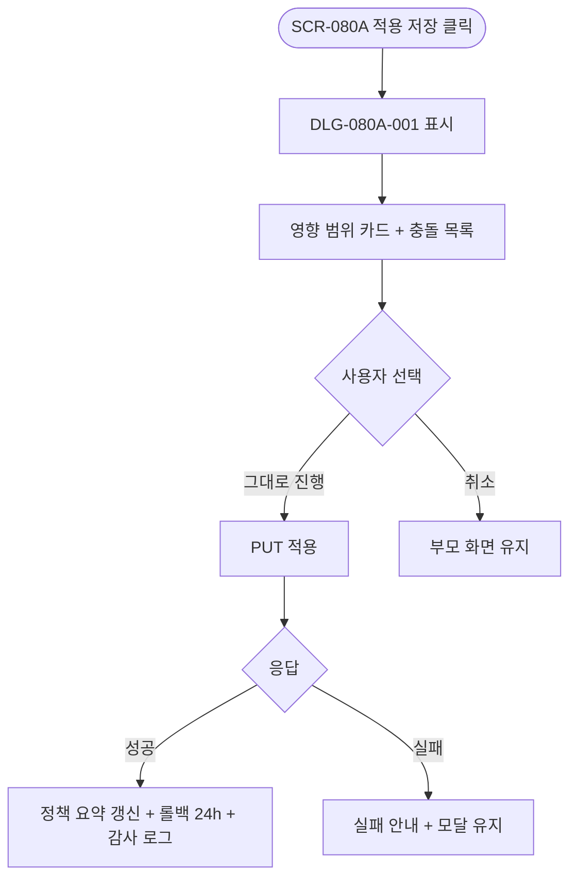
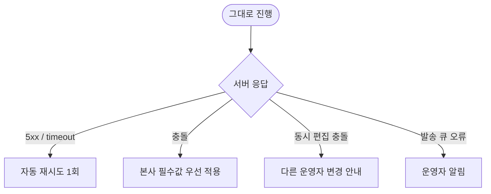

# DLG-080A-001 정책 적용 확인 다이얼로그

## 1. 다이얼로그 메타 정보

| 항목 | 값 |
|---|---|
| 작성일 | 2026-05-22 |
| 버전 | v1.0 |
| 도메인 | D09 설정관리 |
| 다이얼로그 ID | DLG-080A-001 |
| 다이얼로그명 | 정책 적용 확인 |
| 유형 | 영향 범위 확인 다이얼로그 |
| 우선순위 | P0 |
| 부모 화면 | SCR-080A 지점 자동화 적용 |
| 트리거 | [적용 저장] 버튼 클릭 |

## 2. 다이얼로그 개요와 목적

정책 적용 확인 다이얼로그는 SCR-080A 지점 자동화 적용에서 운영자가 [적용 저장] 버튼을 눌러 자동 알림 정책을 실제 회원 발송에 반영하기 직전에, 변경이 어떤 회원에게 어떤 채널로 영향을 주는지 한 번 더 확인받기 위해 호출되는 차단형 모달입니다. 본사 필수 스텝과 지점 조정 스텝 간 충돌이 있는 경우 충돌 목록과 함께 본사 필수값이 우선 적용된다는 점을 명시합니다. 본사 슈퍼관리자가 전체 지점에 강제 배포를 시도하는 경우 더 큰 영향 범위(여러 지점의 합산 발송 대상)와 함께 강제 배포 강조 배지가 표시됩니다.

## 3. 호출 컨텍스트와 부모 화면

부모 화면 SCR-080A의 액션 풋바 [적용 저장] 버튼이 유일한 트리거입니다. 본사 슈퍼관리자의 "전체 지점에 강제 배포" 흐름에서도 동일한 모달이 더 큰 영향 범위 정보와 함께 표시됩니다.

## 4. 레이아웃과 UI 구성

모달 상단에는 "정책을 적용하시겠습니까?" 제목이 표시되고, 강제 배포 흐름인 경우 "전체 지점 강제 배포" 강조 배지가 함께 표시됩니다. 본문에는 영향 범위 카드 그리드가 나열되어 발송 대상 회원 수·적용 스텝 수·활성 채널 종류(SMS/카톡/푸시)·예상 발송 시각·예상 비용(메시지 플랫폼 API 기준)이 표시됩니다. 본사 필수 스텝과 충돌이 있는 경우 본문 하단에 충돌 목록이 빨강 톤의 경고 영역으로 표시되며 "본사 필수값으로 강제 해결됨" 안내가 함께 노출됩니다. 모달 하단에는 [그대로 진행] / [취소] 두 버튼이 배치되며, [그대로 진행]은 강조 색상으로 표시됩니다.

## 5. 입력 항목 정의

이 다이얼로그에는 별도의 입력 필드가 없습니다. 부모 화면에서 운영자가 결정한 스텝 조합이 그대로 표시됩니다.

## 6. 버튼 액션 정의

[그대로 진행] 버튼은 누르면 모달이 로딩 상태로 전환되고 백엔드에 적용 요청(PUT /api/branch-automation/apply)이 전송됩니다. 응답 성공 시 부모 화면의 정책 요약 카드가 갱신되고 롤백 버튼이 24시간 유효 상태로 활성됩니다. 응답 실패 시 모달은 닫히지 않고 실패 안내가 본문 아래에 표시됩니다.

[취소] 버튼은 모달을 즉시 닫고 부모 화면의 변경 사항은 그대로 유지됩니다. 운영자는 매트릭스로 돌아가 조정을 더 진행할 수 있습니다. ESC 키와 배경 클릭은 [취소]와 동일하게 동작합니다.

## 7. 호출 흐름과 부모 화면 반영

운영자가 SCR-080A에서 스텝 ON/OFF·발송 시각·정책 세트를 변경한 후 [적용 저장]을 누르면 이 모달이 표시됩니다. [그대로 진행] 시 적용이 처리되고 새 정책이 이후 만료·결제 이벤트부터 발송 큐에 반영됩니다. 이미 큐에 들어간 발송 건은 이전 정책 그대로 진행됩니다. [취소] 시 변경 사항은 그대로 유지되어 운영자가 추가 편집을 할 수 있습니다.

## 8. 토스트와 알럿

성공 시 부모 화면에 "정책이 적용되었습니다 — 롤백 24시간 가능" 토스트가 표시됩니다. 실패 시 모달이 유지되며 본문에 실패 사유가 인라인으로 표시됩니다.

## 9. 데이터 흐름과 외부 연동

[그대로 진행] 시 `PUT /api/branch-automation/apply` 호출로 적용이 처리됩니다. 새 정책은 즉시 발송 큐에 반영되며 이미 큐에 있는 건은 이전 정책 유지입니다. 변경 이벤트는 SCR-097 감사 로그에 actor·branchId·변경 전후 정책 세트 ID·스텝 변경 내역·timestamp INSERT됩니다. 본사 슈퍼관리자의 강제 배포 흐름은 대상 지점들에 일괄 적용되며 각 지점 Owner(지점장)·manager에게 "본사 정책 적용됨" 앱 알림이 발송됩니다.

## 10. 다이얼로그 상태와 예외 처리

기본·적용 중·적용 완료·적용 실패·강제 배포 모드 등 상태를 가집니다. 예외: 네트워크 오류 자동 재시도 1회 / 본사 필수와 충돌 시 본사 필수값 우선 강제 / 동시 편집 충돌 시 "다른 운영자 변경" 안내 / 권한 부족 시 모달 호출 차단.

## 11. 권한별 처리

Owner(지점장)·manager는 자기 지점 적용에 사용하며, superAdmin/primary는 자기 지점 적용과 전체 지점 강제 배포를 사용할 수 있습니다. FC 이하는 부모 화면 접근 자체가 차단되어 이 모달을 보지 못합니다.

## 12. 메인 흐름

## 13. 에러와 예외 흐름

## 14. 핵심 디자인 요청사항

영향 범위 카드는 발송 대상 수·스텝 수·채널·예상 시각·예상 비용이 한눈에 들어오는 카드 그리드로 배치됩니다. 충돌 목록은 빨강 톤의 별도 경고 영역으로 본문 하단에 표시되어 운영자가 본사 필수와의 차이를 명확히 인식하도록 합니다. 강제 배포 모드는 모달 상단의 강한 배지로 일반 적용 흐름과 시각적으로 분리됩니다.

## 15. 운영 정책 (이 다이얼로그에 연결된 부분)

지점은 새 정책 세트를 만들지 않고 본사 등록 세트만 선택해 적용하며, 본사가 허용한 범위 안에서 스텝 on/off와 채널을 조정합니다. 본사 필수 스텝은 지점에서 OFF 할 수 없으며, 본사 필수와 지점 조정 충돌 시 본사 필수값이 우선 적용됩니다.

적용 즉시 반영 범위는 저장 직후 발생하는 만료·결제 이벤트부터이며, 이미 큐에 들어간 발송 건은 이전 정책 그대로 진행됩니다.

롤백 정책은 적용 후 24시간 이내에만 이전 정책으로 즉시 복구 가능하며, 24시간 초과 시 신규 변경으로 재적용해야 합니다.

본사 슈퍼관리자의 강제 배포는 전사 정책 통일을 위한 도구이며, 강제 배포 후 기존 지점별 커스텀 스텝이 초기화되고 지점은 본사 허용 범위 내에서 다시 조정할 수 있습니다.

발송 채널 비용 정보는 메시지 플랫폼 API 기준 참고용 조회값이며 관리자에서 단가를 직접 수정하지 않습니다.

감사 로그에는 지점 ID·변경 전 정책 세트 ID·변경 후 정책 세트 ID·스텝 ON/OFF 변경 내역·actor·timestamp가 INSERT됩니다.

이상의 정책은 이 다이얼로그를 구현·운영하는 사람이 별도 문서 없이 이 한 장만 보면 이해할 수 있도록 풀어 적었습니다.
