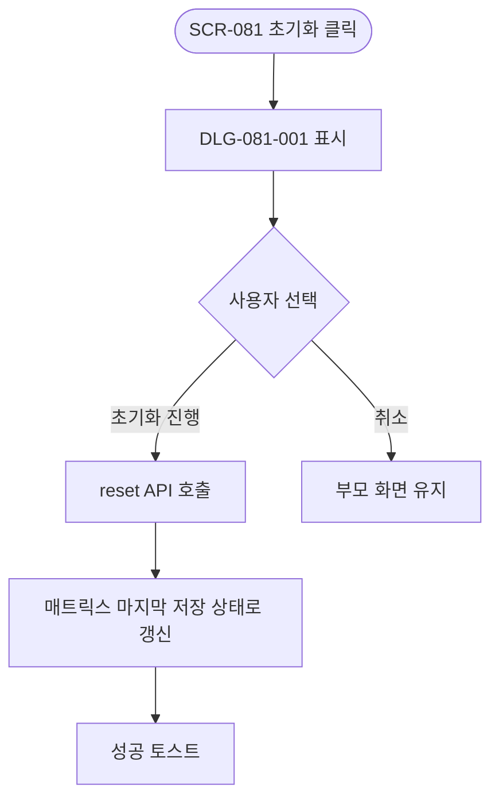
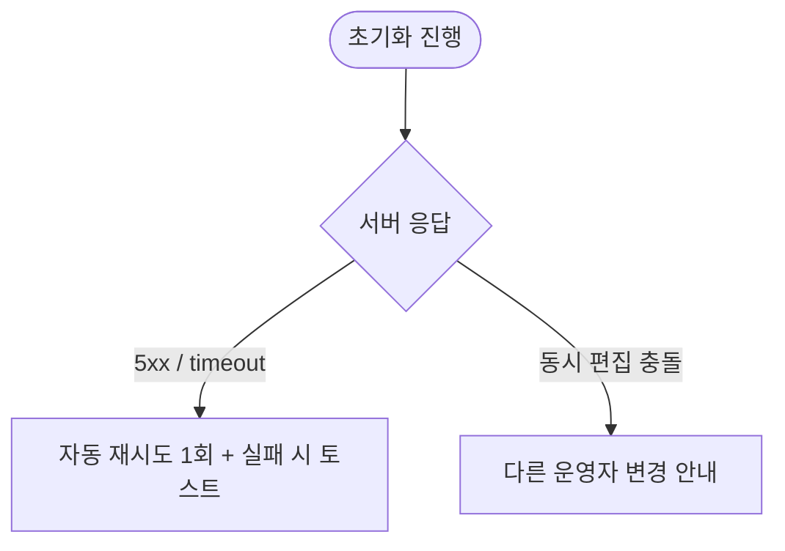

# DLG-081-001 권한 초기화 다이얼로그

## 1. 다이얼로그 메타 정보

| 항목 | 값 |
|---|---|
| 작성일 | 2026-05-22 |
| 버전 | v1.0 |
| 도메인 | D09 설정관리 |
| 다이얼로그 ID | DLG-081-001 |
| 다이얼로그명 | 권한 초기화 |
| 유형 | 확인 다이얼로그 (Confirmation Dialog) |
| 우선순위 | P0 |
| 부모 화면 | SCR-081 권한 설정 |
| 트리거 | 페이지 헤더/풋바의 [초기화] 버튼 클릭 |

## 2. 다이얼로그 개요와 목적

권한 초기화 다이얼로그는 SCR-081 권한 설정에서 운영자가 진행 중인 미저장 변경을 모두 폐기하고 마지막 저장 시점으로 권한 매트릭스를 복원하기 전에 최종 확인을 받는 모달입니다. 잘못된 권한 변경을 빠르게 되돌릴 수 있는 안전망 역할을 합니다.

## 3. 호출 컨텍스트와 부모 화면

부모 화면 SCR-081의 페이지 헤더 또는 액션 풋바의 [초기화] 버튼이 유일한 트리거입니다. 변경 사항이 한 건도 없는 상태에서는 초기화 버튼 자체가 비활성되어 이 모달이 호출되지 않습니다.

## 4. 레이아웃과 UI 구성

모달 상단에 경고 아이콘과 "변경 사항을 마지막 저장 상태로 되돌리시겠습니까?" 제목이 표시됩니다. 본문에는 현재 미저장 변경 요약(메뉴 그룹별 변경된 권한 셀 목록 미리보기)이 표시됩니다. 하단에는 [초기화 진행] / [취소] 두 버튼이 배치됩니다.

## 5. 입력 항목 정의

별도 입력 필드는 없습니다.

## 6. 버튼 액션 정의

[초기화 진행] 버튼은 누르면 `POST /api/permissions/roles/:id/reset` 호출로 마지막 저장 상태의 매트릭스가 반환되고 부모 화면의 매트릭스가 그 상태로 다시 그려집니다. 진행 중 미저장 변경은 모두 폐기됩니다.

[취소] 버튼은 모달을 닫고 부모 화면의 변경 상태를 그대로 유지합니다. ESC와 배경 클릭도 동일하게 동작합니다.

## 7. 호출 흐름과 부모 화면 반영

운영자가 부모 화면에서 권한을 변경하다가 잘못 변경했음을 알아채고 [초기화] 버튼을 누르면 이 모달이 표시됩니다. [초기화 진행] 시 매트릭스가 마지막 저장 상태로 복원되고 저장 버튼이 다시 비활성됩니다.

## 8. 토스트와 알럿

성공 시 부모 화면에 "권한이 초기화되었습니다" 토스트가 표시됩니다. 실패 시 "초기화에 실패했습니다 — 다시 시도해주세요" 토스트가 표시됩니다.

## 9. 데이터 흐름과 외부 연동

[초기화 진행] 시 `POST /api/permissions/roles/:id/reset` 호출이 실행됩니다. 응답으로 마지막 저장 시점의 매트릭스가 반환되어 부모 화면에 다시 그려집니다. 초기화 자체는 감사 로그에 별도 INSERT되지 않습니다(저장이 일어나지 않은 폐기 액션이므로).

## 10. 다이얼로그 상태와 예외 처리

기본·초기화 중(스피너)·초기화 완료·초기화 실패 등 상태를 가집니다. 예외: 네트워크 오류 자동 재시도 1회 / 동시 편집 충돌 시 안내 / 부모 화면 권한 변경 / superAdmin 매트릭스(잠금 상태)에서는 호출 자체가 차단.

## 11. 권한별 처리

부모 화면 SCR-081에 진입할 수 있는 owner·primary·superAdmin에게 동일하게 표시됩니다. superAdmin 매트릭스 선택 시에는 매트릭스가 잠금 상태이므로 변경 자체가 발생하지 않아 이 모달이 호출되지 않습니다.

## 12. 메인 흐름

## 13. 에러와 예외 흐름

## 14. 핵심 디자인 요청사항

경고 아이콘과 함께 "되돌릴 수 없습니다" 안내가 명확히 표시되어 운영자가 결과를 인지하도록 합니다. 본문의 변경 요약은 한눈에 보이도록 깔끔한 목록 형태로 디자인됩니다.

## 15. 운영 정책 (이 다이얼로그에 연결된 부분)

초기화 정책은 마지막 저장 상태로 복원하는 것이며 진행 중 미저장 변경은 폐기됩니다. 초기화는 저장이 일어나지 않은 폐기 액션이므로 감사 로그에 별도로 INSERT되지 않습니다. SCR-081의 superAdmin 매트릭스는 시스템 잠금 상태이므로 이 모달이 호출되지 않습니다. 운영자가 권한을 잘못 조정한 직후 빠르게 복구할 수 있는 안전망 역할을 하며, [초기화]는 부모 화면의 [저장]과 짝을 이루는 액션입니다.

이상의 정책은 이 다이얼로그를 구현·운영하는 사람이 별도 문서 없이 이 한 장만 보면 이해할 수 있도록 풀어 적었습니다.
