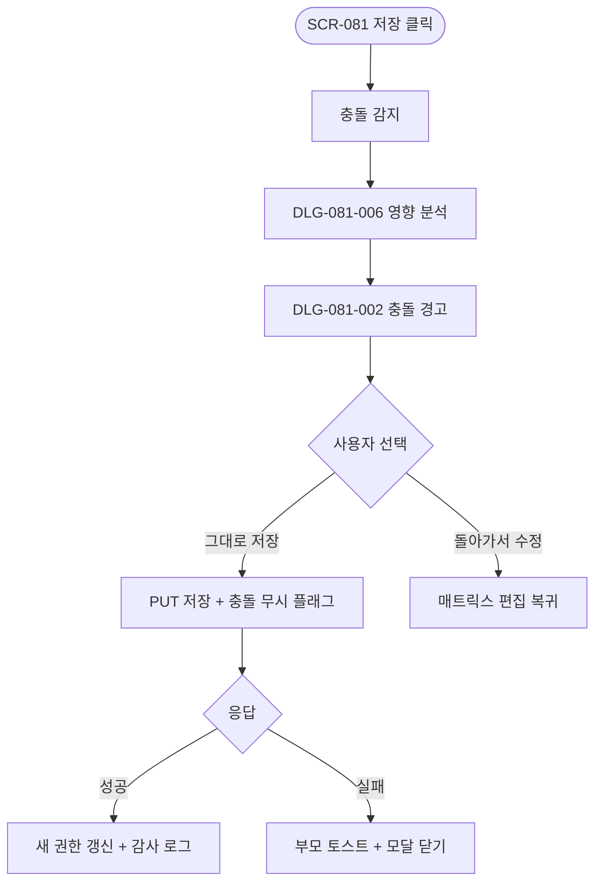
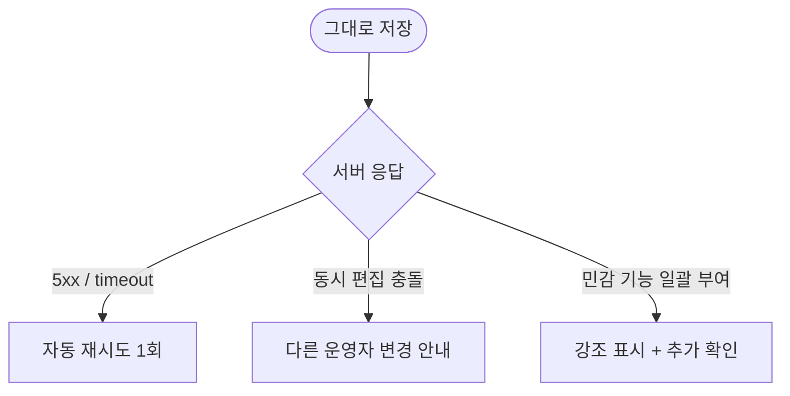

# DLG-081-002 충돌 경고 다이얼로그

## 1. 다이얼로그 메타 정보

| 항목 | 값 |
|---|---|
| 작성일 | 2026-05-22 |
| 버전 | v1.0 |
| 도메인 | D09 설정관리 |
| 다이얼로그 ID | DLG-081-002 |
| 다이얼로그명 | 충돌 경고 |
| 유형 | 경고/확인 다이얼로그 |
| 우선순위 | P0 |
| 부모 화면 | SCR-081 권한 설정 |
| 트리거 | 권한 충돌이 감지된 상태에서 [변경 사항 저장] 클릭 |

## 2. 다이얼로그 개요와 목적

충돌 경고 다이얼로그는 SCR-081 권한 설정의 권한 매트릭스에 논리적 모순(예: 삭제 활성·수정 비활성, 생성 활성·접근 비활성, 수정 활성·조회 비활성 등 6종 패턴)이 감지된 상태에서 운영자가 저장을 시도할 때 추가 확인을 받는 모달입니다. 충돌을 그대로 저장할지, 매트릭스로 돌아가 수정할지를 선택하게 합니다. 충돌 권한 조합은 화면별 권한 검증에서 예상치 못한 동작을 일으킬 수 있으므로 운영자가 의도적으로 진행 여부를 결정하도록 보장합니다.

## 3. 호출 컨텍스트와 부모 화면

부모 화면 SCR-081에서 매트릭스 변경 후 [변경 사항 저장]을 눌렀을 때, 배정 직원이 1명 이상이면 DLG-081-006 영향 분석이 먼저 표시되고, 그 다음에 충돌이 감지된 경우 이 모달이 추가로 호출됩니다. 배정 직원이 0명인 경우에도 충돌이 있으면 영향 분석을 "영향 없음"으로 통과한 후 이 모달이 호출됩니다.

## 4. 레이아웃과 UI 구성

모달 상단에 경고 아이콘과 "권한 충돌이 감지되었습니다" 제목이 표시됩니다. 본문에는 충돌 항목 목록이 행 단위로 나열되며, 각 행에 메뉴 그룹·충돌 패턴 사유(예: "회원 메뉴 그룹: 삭제 활성, 수정 비활성 — 삭제를 사용하려면 수정 권한이 필요합니다")가 함께 표시됩니다. 하단에는 [그대로 저장] / [돌아가서 수정] 두 버튼이 배치됩니다. [돌아가서 수정]은 강조 색상으로 표시되어 권장 액션임을 알립니다.

## 5. 입력 항목 정의

별도 입력 필드는 없습니다.

## 6. 버튼 액션 정의

[그대로 저장] 버튼은 충돌을 무시하고 저장을 진행합니다. `PUT /api/permissions/role/:id` 호출이 실행되며, 응답 성공 시 부모 화면이 새 권한으로 갱신됩니다. 충돌 무시 저장은 감사 로그에 "충돌 무시" 플래그와 함께 기록됩니다.

[돌아가서 수정] 버튼은 모달을 닫고 부모 화면의 매트릭스로 돌아가 운영자가 충돌을 직접 수정할 수 있게 합니다. ESC와 배경 클릭은 [돌아가서 수정]과 동일하게 동작합니다(취소 = 돌아가기).

## 7. 호출 흐름과 부모 화면 반영

운영자가 매트릭스를 수정한 후 [저장]을 누르면 부모 화면이 자동으로 충돌을 감지하고, 영향 분석(DLG-081-006)이 먼저 표시된 후 충돌이 있으면 이 모달이 추가로 표시됩니다. [그대로 저장] 시 저장이 진행되어 직원 활성 세션에 다음 페이지 로드부터 새 권한이 적용됩니다. [돌아가서 수정] 시 매트릭스 편집 모드로 돌아갑니다.

## 8. 토스트와 알럿

성공 시 "권한이 저장되었습니다 (충돌 무시)" 토스트가 표시됩니다. 실패 시 부모 화면에 실패 토스트가 표시되고 이 모달은 닫힙니다.

## 9. 데이터 흐름과 외부 연동

[그대로 저장] 시 `PUT /api/permissions/role/:id` 호출에 충돌 무시 플래그가 포함되어 전송됩니다. 응답 성공 시 SCR-097 감사 로그에 actor·role_id·diff JSON·충돌 무시 플래그·timestamp가 INSERT됩니다. 직원 활성 세션은 다음 페이지 로드(JWT refresh)부터 새 권한으로 동작합니다.

## 10. 다이얼로그 상태와 예외 처리

기본·저장 중·저장 실패 상태를 가집니다. 예외: 네트워크 오류 자동 재시도 1회 / 동시 편집 충돌 안내 / 권한 부족(저장 차단) / 6종 민감 기능 일괄 부여 시도 시 강조 표시 추가.

## 11. 권한별 처리

부모 화면 SCR-081에 진입 가능한 owner·primary·superAdmin에게 동일하게 표시됩니다.

## 12. 메인 흐름

## 13. 에러와 예외 흐름

## 14. 핵심 디자인 요청사항

충돌 항목 목록은 메뉴 그룹별로 명확히 구분되어 어느 영역의 어떤 권한이 충돌하는지 한눈에 파악 가능해야 합니다. [돌아가서 수정] 버튼은 강조 색상으로 권장 액션임을 알리고, [그대로 저장]은 약한 톤으로 표시되어 운영자가 의식적으로 충돌 무시를 선택하도록 합니다.

## 15. 운영 정책 (이 다이얼로그에 연결된 부분)

충돌 정의는 6종 패턴이며 삭제 활성·수정 비활성, 생성 활성·접근 비활성, 수정 활성·조회 비활성 같은 논리적 모순을 의미합니다. 운영자는 충돌을 무시하고 저장할 수 있지만 충돌 권한 조합은 화면별 권한 검증에서 예상치 못한 동작을 일으킬 수 있으므로 정리 후 저장하는 것이 권장됩니다.

충돌 무시 저장은 감사 로그에 "충돌 무시" 플래그와 함께 기록되어 사후 추적이 가능합니다.

저장 후 직원 활성 세션은 다음 페이지 로드(JWT refresh)부터 새 권한이 적용됩니다.

6종 민감 기능을 일괄 부여하는 충돌의 경우 강조 표시와 추가 확인이 요구됩니다.

동시 편집 lock 정책에 따라 다른 운영자가 같은 역할을 편집 중이면 충돌 안내가 표시되고 새로고침 후 재시도가 안내됩니다.

이상의 정책은 이 다이얼로그를 구현·운영하는 사람이 별도 문서 없이 이 한 장만 보면 이해할 수 있도록 풀어 적었습니다.
