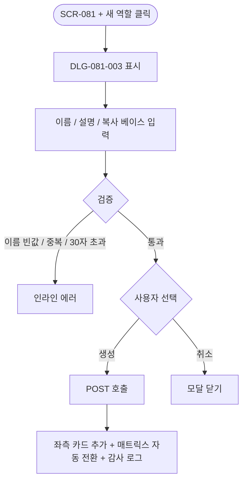
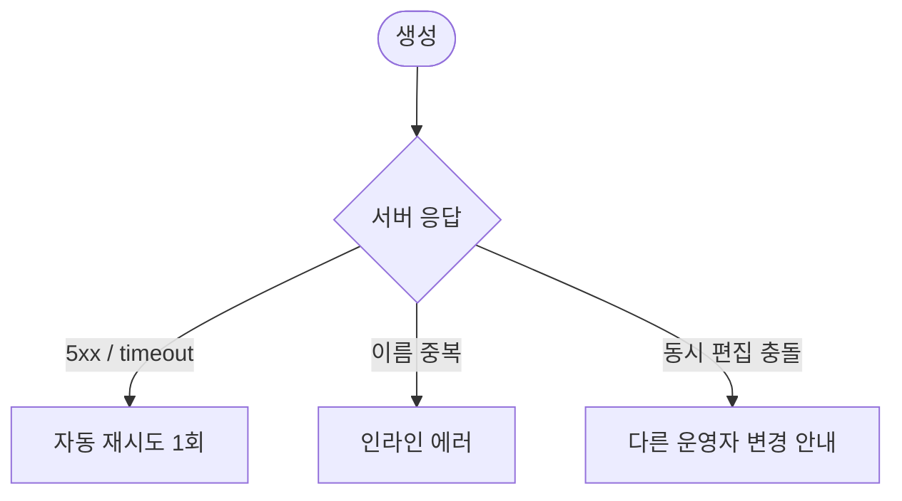

# DLG-081-003 역할 생성 다이얼로그

## 1. 다이얼로그 메타 정보

| 항목 | 값 |
|---|---|
| 작성일 | 2026-05-22 |
| 버전 | v1.0 |
| 도메인 | D09 설정관리 |
| 다이얼로그 ID | DLG-081-003 |
| 다이얼로그명 | 역할 생성 |
| 유형 | 입력 다이얼로그 (Form Dialog) |
| 우선순위 | P0 |
| 부모 화면 | SCR-081 권한 설정 |
| 트리거 | 좌측 패널 [+ 새 역할] 버튼 클릭 |

## 2. 다이얼로그 개요와 목적

역할 생성 다이얼로그는 SCR-081 권한 설정 좌측 패널의 [+ 새 역할] 버튼으로 호출되며, 새로운 커스텀 역할의 이름·설명·복사 베이스를 입력받아 좌측 패널에 카드를 추가합니다. 생성된 역할의 권한 매트릭스 편집은 부모 화면 우측 매트릭스 패널에서 이어집니다. 이 다이얼로그는 SCR-087 커스텀 역할 생성 화면의 생성 폼과 단일 source-of-truth로 운영되어 어느 화면에서 만들어도 동일한 데이터 구조로 저장됩니다.

## 3. 호출 컨텍스트와 부모 화면

부모 화면 SCR-081의 좌측 패널 [+ 새 역할] 버튼이 트리거입니다. Owner(지점장)·primary·superAdmin만 호출할 수 있으며, owner는 자기 지점 역할만 생성 가능합니다.

## 4. 레이아웃과 UI 구성

모달 상단에 "새 역할 만들기" 제목이 표시됩니다. 본문에는 역할 이름(1~30자 필수)·역할 설명(200자 선택)·복사 베이스 드롭다운(기본 7종 + 커스텀 역할)이 위에서 아래로 배치됩니다. 복사 베이스를 선택하면 그 역할의 매트릭스가 자동 로드되어 새 역할의 시작 권한 매트릭스가 됩니다. 하단에는 [생성] / [취소] 두 버튼이 배치됩니다.

## 5. 입력 항목 정의

역할 이름은 1~30자 필수입니다. 기본 7종 역할명(superAdmin/primary/Owner(지점장)/manager/fc/staff/readonly) 및 한글 표기와 중복 차단이 적용되며, 동일 지점 내 커스텀 역할명 중복도 차단됩니다. 다른 지점은 같은 이름을 허용합니다. 인라인 검증으로 글자 수와 중복이 실시간 표시됩니다.

역할 설명은 200자 이내 선택 항목입니다.

복사 베이스 드롭다운은 선택 사항이며, 미선택 시 빈 매트릭스(모든 권한 비활성)로 시작합니다.

## 6. 버튼 액션 정의

[생성] 버튼은 입력 검증을 거친 후 `POST /api/permissions/roles` 호출로 새 역할을 생성합니다. 응답 성공 시 부모 화면 좌측 패널에 새 카드가 추가되고 우측 매트릭스가 그 역할로 자동 전환되어 운영자가 매트릭스 편집을 이어갈 수 있습니다.

[취소] 버튼은 모달을 닫고 부모 화면에 영향을 주지 않습니다. ESC와 배경 클릭도 동일하게 동작합니다.

## 7. 호출 흐름과 부모 화면 반영

운영자가 [+ 새 역할]을 누르면 이 모달이 표시됩니다. 이름·설명·복사 베이스를 입력하고 [생성]을 누르면 백엔드에 역할이 생성되고 부모 화면 좌측 패널에 카드가 추가됩니다. 우측 매트릭스 패널은 새 역할로 자동 전환되어 매트릭스 편집을 이어갑니다.

## 8. 토스트와 알럿

성공 시 "역할이 생성되었습니다" 토스트가 부모 화면에 표시됩니다. 실패 시 사유와 함께 인라인 안내가 모달에 표시됩니다.

## 9. 데이터 흐름과 외부 연동

[생성] 시 `POST /api/permissions/roles` 호출이 실행됩니다. 요청에 이름·설명·복사 베이스 역할 ID가 포함되며 응답으로 새 역할의 ID와 매트릭스가 반환됩니다. SCR-097 감사 로그에 actor·role_id·이름·복사 베이스·timestamp INSERT됩니다. SCR-087 커스텀 역할 생성 화면과 단일 source-of-truth로 동기화됩니다.

## 10. 다이얼로그 상태와 예외 처리

기본·검증 실패(인라인)·생성 중·생성 완료·생성 실패 상태를 가집니다. 예외: 이름 빈값·30자 초과·기본 역할명 중복·지점 내 이름 중복·복사 베이스 변경 시 매트릭스 재로드 경고·네트워크 오류 자동 재시도 1회·동시 편집 충돌 등.

## 11. 권한별 처리

owner는 자기 지점 커스텀 역할만 생성 가능합니다(RLS branchId 필터). primary·superAdmin은 전 지점 역할을 생성할 수 있습니다.

## 12. 메인 흐름

## 13. 에러와 예외 흐름

## 14. 핵심 디자인 요청사항

이름 입력란에는 30자 카운터가 실시간 표시되고, 중복 검증 결과가 인라인으로 즉시 표시되어 운영자가 입력 도중에 검증 결과를 확인할 수 있어야 합니다. 복사 베이스 드롭다운은 기본 7종과 커스텀 역할이 그룹별로 구분되어 선택이 쉬워야 합니다.

## 15. 운영 정책 (이 다이얼로그에 연결된 부분)

이름 정책은 1~30자 필수이고, 기본 7종 역할명 및 한글 표기와 중복 차단, 동일 지점 내 커스텀 역할명 중복 차단입니다. 다른 지점은 같은 이름을 가질 수 있습니다.

복사 베이스 선택 시 그 역할의 매트릭스가 새 역할의 시작 매트릭스로 자동 로드됩니다. 미선택 시 빈 매트릭스(모든 권한 비활성)로 시작합니다.

owner는 자기 지점 역할만 생성 가능합니다(RLS branchId 필터).

생성된 역할은 SCR-081과 SCR-087에서 동일하게 노출되며 단일 source-of-truth로 동기화됩니다.

감사 로그에는 actor·role_id·이름·복사 베이스·timestamp가 INSERT됩니다.

이상의 정책은 이 다이얼로그를 구현·운영하는 사람이 별도 문서 없이 이 한 장만 보면 이해할 수 있도록 풀어 적었습니다.
