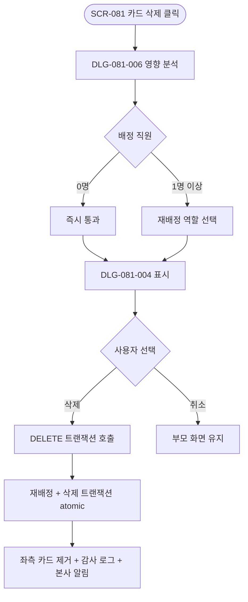
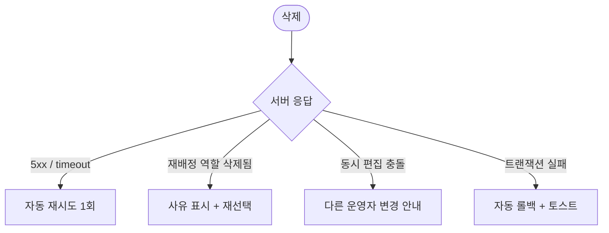

# DLG-081-004 역할 삭제 다이얼로그

## 1. 다이얼로그 메타 정보

| 항목 | 값 |
|---|---|
| 작성일 | 2026-05-22 |
| 버전 | v1.0 |
| 도메인 | D09 설정관리 |
| 다이얼로그 ID | DLG-081-004 |
| 다이얼로그명 | 역할 삭제 |
| 유형 | 최종 확인 다이얼로그 (Destructive Confirmation) |
| 우선순위 | P0 |
| 부모 화면 | SCR-081 권한 설정 |
| 트리거 | DLG-081-006 영향 분석 → 재배정 역할 선택 → 이 모달 |

## 2. 다이얼로그 개요와 목적

역할 삭제 다이얼로그는 SCR-081 권한 설정에서 운영자가 카드의 [삭제] 아이콘을 누른 후, DLG-081-006 역할 영향 분석을 거쳐 재배정 역할까지 선택한 마지막 단계에서 최종 확인을 받는 모달입니다. 배정 직원의 재배정과 역할 삭제가 한 트랜잭션으로 처리되며, superAdmin 카드는 시스템 역할로 삭제 불가합니다. 배정 직원이 0명인 경우에도 이 모달이 표시되며, 이 경우 재배정 정보 없이 단순 삭제 확인만 진행됩니다.

## 3. 호출 컨텍스트와 부모 화면

부모 화면 SCR-081에서 카드의 [삭제] 아이콘을 누르면 먼저 DLG-081-006 영향 분석이 표시되고, 배정 직원이 1명 이상이면 재배정 역할 선택을 강제한 후 이 모달이 호출됩니다. 배정 직원이 0명이면 영향 분석을 "영향 없음"으로 즉시 통과한 후 이 모달이 호출됩니다.

## 4. 레이아웃과 UI 구성

모달 상단에 경고 아이콘과 "역할 '{이름}'을 삭제하시겠습니까?" 제목이 표시됩니다. 본문에는 삭제 대상 역할명·배정 직원 수·재배정 후 역할(영향 분석에서 선택한 값) 요약이 카드 형태로 표시됩니다. 재배정 처리가 필요한 경우 "{N}명의 직원이 '{재배정 역할명}'으로 이동합니다" 안내가 강조 톤으로 표시됩니다. 하단에는 [삭제] / [취소] 두 버튼이 배치되며, [삭제]는 빨강 톤으로 destructive 액션임을 명확히 알립니다.

## 5. 입력 항목 정의

별도 입력 필드는 없습니다. 재배정 역할은 이전 단계(DLG-081-006)에서 이미 선택되었으며, 이 모달에서는 최종 확인만 받습니다.

## 6. 버튼 액션 정의

[삭제] 버튼은 누르면 `DELETE /api/permissions/roles/:id` 호출이 실행되며, 요청에 재배정 역할 ID가 포함됩니다. 재배정과 삭제가 한 트랜잭션으로 처리되어 부분 실패가 발생하지 않습니다. 응답 성공 시 부모 화면 좌측 패널에서 그 카드가 사라지고 재배정 직원의 활성 세션은 다음 페이지 로드부터 새 역할 권한이 적용됩니다.

[취소] 버튼은 모달을 닫고 부모 화면의 변경을 그대로 유지합니다. ESC와 배경 클릭도 동일하게 동작합니다.

## 7. 호출 흐름과 부모 화면 반영

운영자가 카드의 [삭제]를 누르면 DLG-081-006 → 재배정 역할 선택 → 이 모달이 순차로 표시됩니다. [삭제] 시 트랜잭션이 실행되어 부모 화면이 갱신되고, [취소] 시 부모 화면은 그대로 유지됩니다.

## 8. 토스트와 알럿

성공 시 "역할이 삭제되었습니다 — N명 재배정 완료" 토스트가 부모 화면에 표시됩니다. 실패 시 사유와 함께 토스트가 표시됩니다.

## 9. 데이터 흐름과 외부 연동

[삭제] 시 `DELETE /api/permissions/roles/:id` 호출에 재배정 역할 ID가 함께 전송됩니다. 백엔드에서 재배정 트랜잭션과 삭제 트랜잭션이 atomic하게 처리됩니다. SCR-097 감사 로그에 actor·삭제된 role_id·재배정 role_id·재배정 직원 수·timestamp가 INSERT됩니다. 재배정된 직원의 활성 세션은 다음 페이지 로드(JWT refresh)부터 새 역할 권한이 적용됩니다. NFR-19 알림 센터로 본사 슈퍼관리자에게 역할 삭제 알림이 발송됩니다.

## 10. 다이얼로그 상태와 예외 처리

기본·삭제 중·삭제 완료·삭제 실패 상태를 가집니다. 예외: 네트워크 오류 자동 재시도 1회 / 동시 편집 충돌 안내 / 재배정 역할이 그 사이에 삭제된 경우 사유 표시 / superAdmin 카드는 이 모달이 호출되지 않음(시스템 역할 보호).

## 11. 권한별 처리

owner는 자기 지점 커스텀 역할만 삭제 가능합니다(RLS branchId 필터). primary·superAdmin은 전 지점 역할을 삭제할 수 있습니다. superAdmin 카드는 시스템 역할로 삭제 불가하며 이 모달이 호출되지 않습니다.

## 12. 메인 흐름

## 13. 에러와 예외 흐름

## 14. 핵심 디자인 요청사항

[삭제] 버튼은 빨강 톤으로 destructive 액션임을 명확히 알리고, [취소]는 약한 톤으로 표시됩니다. 재배정 안내는 강조 영역으로 처리되어 운영자가 어느 직원이 어느 역할로 이동하는지 명확히 인지하도록 합니다.

## 15. 운영 정책 (이 다이얼로그에 연결된 부분)

역할 삭제 정책은 배정 직원이 1명 이상이면 재배정 역할 선택이 강제되며, 재배정과 삭제가 한 트랜잭션으로 처리됩니다. 부분 실패는 자동 롤백됩니다.

superAdmin 카드는 시스템 역할로 삭제 불가하며 [삭제] 아이콘 자체가 hidden 처리됩니다.

owner는 자기 지점 역할만 삭제 가능합니다(RLS branchId 필터).

재배정된 직원의 활성 세션은 다음 페이지 로드(JWT refresh)부터 새 역할 권한이 적용됩니다. 담당 회원 매핑은 유지됩니다.

감사 로그에는 actor·삭제된 role_id·재배정 role_id·재배정 직원 수·timestamp가 INSERT됩니다.

NFR-19 알림 센터로 본사 슈퍼관리자에게 역할 삭제 알림이 발송되어 사후 추적이 가능합니다.

이상의 정책은 이 다이얼로그를 구현·운영하는 사람이 별도 문서 없이 이 한 장만 보면 이해할 수 있도록 풀어 적었습니다.
