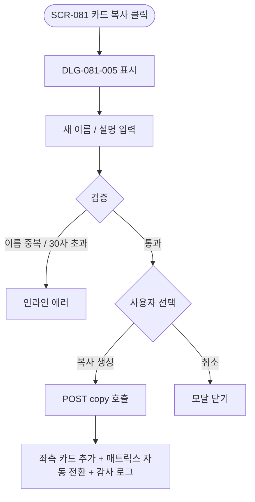
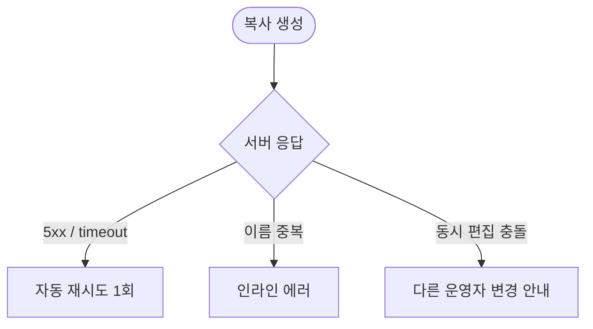

# DLG-081-005 역할 복사 다이얼로그

## 1. 다이얼로그 메타 정보

| 항목 | 값 |
|---|---|
| 작성일 | 2026-05-22 |
| 버전 | v1.0 |
| 도메인 | D09 설정관리 |
| 다이얼로그 ID | DLG-081-005 |
| 다이얼로그명 | 역할 복사 |
| 유형 | 입력 다이얼로그 (Form Dialog) |
| 우선순위 | P0 |
| 부모 화면 | SCR-081 권한 설정 |
| 트리거 | 좌측 카드 [복사] 아이콘 클릭 |

## 2. 다이얼로그 개요와 목적

역할 복사 다이얼로그는 SCR-081 권한 설정 좌측 카드의 [복사] 아이콘으로 호출되며, 기존 역할의 권한 매트릭스를 그대로 복사한 새 역할을 생성합니다. 배정 직원은 복사되지 않아 새 역할의 배정 직원 수는 0으로 시작합니다. 이미 만들어진 역할을 베이스로 일부만 수정해 새 역할을 빠르게 만들 때 사용됩니다.

## 3. 호출 컨텍스트와 부모 화면

부모 화면 SCR-081의 좌측 카드 [복사] 아이콘이 트리거입니다. 기본 7종 역할과 커스텀 역할 모두에서 복사가 가능하며, owner는 자기 지점 역할만 복사할 수 있습니다.

## 4. 레이아웃과 UI 구성

모달 상단에 "역할 '{원본 이름}' 복사" 제목이 표시됩니다. 본문에는 새 역할 이름 입력란(1~30자 필수), 새 역할 설명 입력란(200자 선택), "권한 매트릭스가 그대로 복사됩니다" 안내, "배정 직원은 복사되지 않습니다" 안내가 표시됩니다. 하단에는 [복사 생성] / [취소] 두 버튼이 배치됩니다.

## 5. 입력 항목 정의

새 역할 이름은 1~30자 필수이며 기본 역할명과 동일 지점 내 커스텀 역할명 중복은 차단됩니다. 인라인 검증이 실시간 적용됩니다.

새 역할 설명은 200자 이내 선택 항목입니다.

권한 매트릭스는 원본 역할의 매트릭스가 자동 복사되며 운영자가 이 모달에서 매트릭스를 편집하지는 않습니다.

## 6. 버튼 액션 정의

[복사 생성] 버튼은 입력 검증을 거친 후 `POST /api/permissions/roles/:id/copy` 호출이 실행됩니다. 응답 성공 시 부모 화면 좌측 패널에 새 카드가 추가되고 우측 매트릭스가 새 역할로 자동 전환되어 운영자가 매트릭스를 일부 수정해 저장할 수 있게 합니다.

[취소] 버튼은 모달을 닫고 부모 화면에 영향을 주지 않습니다. ESC와 배경 클릭도 동일하게 동작합니다.

## 7. 호출 흐름과 부모 화면 반영

운영자가 카드의 [복사]를 누르면 이 모달이 표시됩니다. 새 이름과 설명을 입력하고 [복사 생성]을 누르면 백엔드에 새 역할이 생성되어 좌측 패널에 카드가 추가됩니다. 우측 매트릭스 패널은 새 역할로 자동 전환됩니다.

## 8. 토스트와 알럿

성공 시 "역할이 복사되었습니다" 토스트가 부모 화면에 표시됩니다. 실패 시 사유와 함께 인라인 안내가 모달에 표시됩니다.

## 9. 데이터 흐름과 외부 연동

[복사 생성] 시 `POST /api/permissions/roles/:id/copy` 호출이 실행됩니다. 요청에 새 이름·설명이 포함되며 응답으로 새 역할의 ID와 복사된 매트릭스가 반환됩니다. SCR-097 감사 로그에 actor·new_role_id·source_role_id·이름·timestamp가 INSERT됩니다. SCR-087과 단일 source-of-truth로 동기화됩니다.

## 10. 다이얼로그 상태와 예외 처리

기본·검증 실패(인라인)·생성 중·생성 완료·생성 실패 상태를 가집니다. 예외: 이름 빈값·30자 초과·기본 역할명 중복·지점 내 이름 중복·네트워크 오류 자동 재시도 1회·동시 편집 충돌 등.

## 11. 권한별 처리

owner는 자기 지점 역할만 복사 가능합니다(RLS branchId 필터). primary·superAdmin은 전 지점 역할을 복사할 수 있으며 superAdmin 카드도 복사가 가능합니다.

## 12. 메인 흐름

## 13. 에러와 예외 흐름

## 14. 핵심 디자인 요청사항

원본 역할명이 모달 제목에 표시되어 운영자가 어떤 역할을 복사하는지 명확히 인지하도록 합니다. "권한 매트릭스 그대로 복사" / "배정 직원은 복사 안됨" 안내는 정보형 카드로 본문에 표시되어 운영자가 결과를 사전 인지하도록 합니다.

## 15. 운영 정책 (이 다이얼로그에 연결된 부분)

역할 복사 정책은 새 이름·설명 입력 + 권한 그대로 복사이며, 배정 직원은 복사되지 않습니다(새 역할 배정 직원 수 0으로 시작).

이름 정책은 1~30자 필수이고, 기본 7종 역할명 및 한글 표기와 동일 지점 내 커스텀 역할명 중복 차단입니다.

owner는 자기 지점 역할만 복사 가능합니다(RLS branchId 필터).

복사된 역할은 SCR-081과 SCR-087에서 동일하게 노출되며 단일 source-of-truth로 동기화됩니다.

감사 로그에는 actor·new_role_id·source_role_id·이름·timestamp가 INSERT되어 사후 추적이 가능합니다.

이상의 정책은 이 다이얼로그를 구현·운영하는 사람이 별도 문서 없이 이 한 장만 보면 이해할 수 있도록 풀어 적었습니다.
