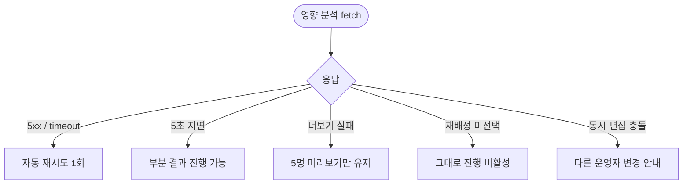

# DLG-081-006 역할 영향 분석 다이얼로그

## 1. 다이얼로그 메타 정보

| 항목 | 값 |
|---|---|
| 작성일 | 2026-05-22 |
| 버전 | v1.0 |
| 도메인 | D09 설정관리 |
| 다이얼로그 ID | DLG-081-006 |
| 다이얼로그명 | 역할 영향 분석 |
| 유형 | 영향 범위 확인 다이얼로그 |
| 우선순위 | P0 |
| 부모 화면 | SCR-081 권한 설정, SCR-087 커스텀 역할 생성 |
| 트리거 | 권한 매트릭스 [변경 사항 저장] / 역할 삭제 [삭제] 클릭 |

## 2. 다이얼로그 개요와 목적

역할 영향 분석 다이얼로그는 SCR-081 권한 설정 또는 SCR-087 커스텀 역할 생성에서 권한 매트릭스 저장 직전 또는 역할 삭제 직전에 변경 영향 범위를 한 번 더 확인받기 위해 호출되는 차단형 모달입니다. 배정 직원 수·담당 회원 합계·영향 직원 목록(5명 미리보기 + 더보기)·before/after 권한 차이를 표시합니다. 단, 이 모달은 예측·시뮬레이션 리포트가 아니라 저장 전 확인 안내이며 별도 예측 산식이나 시뮬레이션 기능으로 확장하지 않습니다.

배정 직원이 0명이면 "영향 없음" 안내가 표시되고 [그대로 진행] 버튼이 즉시 활성되어 빠르게 통과할 수 있습니다. 배정 직원이 1명 이상이면 운영자가 [그대로 진행] 또는 [돌아가서 수정] 중 하나를 선택해야 합니다. 역할 삭제 흐름에서는 배정 직원이 1명 이상이면 재배정 역할 선택까지 강제됩니다.

## 3. 호출 컨텍스트와 부모 화면

부모 화면 SCR-081에서 권한 매트릭스를 변경한 후 [변경 사항 저장]을 누르면 이 모달이 먼저 표시됩니다. 충돌이 감지된 경우 이 모달 다음에 DLG-081-002 충돌 경고가 추가로 표시됩니다.

부모 화면 SCR-081의 카드 [삭제] 아이콘을 눌렀을 때도 이 모달이 표시되며, 배정 직원이 1명 이상이면 재배정 역할 선택 영역이 본문에 함께 표시됩니다. 선택 후 DLG-081-004 역할 삭제 확인 모달로 이어집니다.

부모 화면 SCR-087에서 커스텀 역할 수정 저장 또는 삭제 흐름에서도 동일한 모달이 호출됩니다.

## 4. 레이아웃과 UI 구성

모달 상단에 "변경 영향 분석" 제목이 표시되며, 변경 종류(권한 변경 / 역할 삭제)에 따라 부제목이 달라집니다. 본문에는 다음 영역이 카드 그리드로 배치됩니다.

첫 번째 카드는 배정 직원 수입니다. 배정된 직원 수가 큰 숫자로 표시되며, 0명이면 "영향 없음" 안내가 함께 표시됩니다.

두 번째 카드는 담당 회원 합계입니다. 배정 직원들이 담당하는 회원의 총 수가 표시되어 운영자가 변경의 회원 측면 영향을 인지하도록 합니다.

세 번째 카드는 영향 직원 목록 미리보기입니다. 앞쪽 5명의 직원 이름·소속 지점·현재 직무가 나열되며, 그 아래에 "더보기" 링크가 있어 전체 영향 직원 목록을 볼 수 있습니다.

네 번째 카드는 before/after 권한 차이입니다. 어떤 메뉴 그룹의 어떤 권한이 변경되었는지가 표 형태로 표시됩니다. 6종 민감 기능 변경은 별도 강조 영역으로 표시됩니다.

역할 삭제 흐름에서는 추가로 재배정 역할 선택 드롭다운이 본문 하단에 표시되어 배정 직원이 어느 역할로 이동할지 선택합니다. 배정 직원이 0명이면 이 드롭다운은 숨겨집니다.

하단에는 [그대로 진행] / [돌아가서 수정] 두 버튼이 배치됩니다. 영향 직원이 0명이면 [그대로 진행]이 즉시 활성되고 권장 액션으로 표시됩니다.

## 5. 입력 항목 정의

대부분의 영역은 조회 전용이며 입력이 없습니다.

역할 삭제 흐름에서만 재배정 역할 선택 드롭다운이 입력 항목으로 표시됩니다. 배정 직원이 1명 이상인 경우 재배정 역할을 선택해야 [그대로 진행] 버튼이 활성됩니다. 드롭다운에는 기본 7종 역할과 다른 커스텀 역할이 그룹별로 표시됩니다.

## 6. 버튼 액션 정의

[그대로 진행] 버튼은 변경 종류에 따라 다음 단계로 진행합니다. 권한 변경 흐름에서는 충돌이 있으면 DLG-081-002 충돌 경고를 호출하고, 충돌이 없으면 PUT 저장이 즉시 실행됩니다. 역할 삭제 흐름에서는 DLG-081-004 역할 삭제 확인 모달로 진행합니다.

[돌아가서 수정] 버튼은 모달을 닫고 부모 화면의 매트릭스 또는 카드 편집 모드로 돌아갑니다. 부모 화면의 변경 사항은 그대로 유지됩니다. ESC와 배경 클릭도 동일하게 동작합니다.

## 7. 호출 흐름과 부모 화면 반영

운영자가 [저장] 또는 [삭제]를 누르면 부모 화면이 이 모달을 호출하면서 영향 분석 API를 fetch합니다. 운영자가 [그대로 진행]을 선택하면 다음 단계(저장·삭제 트랜잭션 또는 추가 확인 모달)로 진행되고, [돌아가서 수정]을 선택하면 부모 화면으로 돌아갑니다.

## 8. 토스트와 알럿

다이얼로그 자체는 토스트를 발생시키지 않습니다. 다음 단계의 저장·삭제가 성공·실패하면 부모 화면에서 토스트가 표시됩니다.

영향 분석 API가 5초 이상 지연되면 본문에 "분석 중" 스피너가 표시되며, 5초 후 부분 결과로도 진행할 수 있도록 [그대로 진행] 버튼이 활성됩니다.

## 9. 데이터 흐름과 외부 연동

이 모달이 호출되면 `GET /api/permissions/role/:id/impact` API가 자동 fetch됩니다. 응답에 배정 직원 수·담당 회원 합계·영향 직원 목록·before/after 권한 차이가 포함됩니다.

[그대로 진행] 시에는 다음 단계의 API가 호출됩니다. 권한 변경은 `PUT /api/permissions/role/:id`, 역할 삭제는 `DELETE /api/permissions/roles/:id`(재배정 역할 ID 포함)입니다.

이 모달 호출 자체는 감사 로그에 INSERT되지 않습니다(저장이 일어나지 않은 미리보기이므로). 실제 저장·삭제가 일어나면 부모 화면의 흐름에 따라 SCR-097 감사 로그에 INSERT됩니다.

영향 분석 결과는 캐시되지 않으며 매 호출마다 실시간 fetch됩니다(저장 직전의 정확한 영향을 보여주기 위함).

## 10. 다이얼로그 상태와 예외 처리

기본·분석 중(스피너)·영향 0명(즉시 통과 가능)·영향 1명 이상·재배정 선택 필요·진행 중·완료 상태를 가집니다.

예외 케이스: 영향 분석 API 5xx / timeout 자동 재시도 1회 / 5초 이상 지연 시 부분 결과 진행 가능 / 영향 직원 목록 더보기 fetch 실패 / 재배정 역할 미선택 시 [그대로 진행] 비활성 / 동시 편집 충돌 시 안내.

## 11. 권한별 처리

부모 화면 SCR-081/SCR-087에 진입 가능한 owner·primary·superAdmin에게 동일하게 표시됩니다. owner는 자기 지점 역할 영향만 조회할 수 있습니다(RLS branchId 필터).

## 12. 메인 흐름

```mermaid
flowchart TD
    A([SCR-081 저장 / 삭제 클릭]) --> B[영향 분석 API fetch]
    B --> C[DLG-081-006 표시]
    C --> D{배정 직원}
    D -->|0명| E["영향 없음" 즉시 통과 가능]
    D -->|1명 이상| F[영향 직원 목록 + 권한 차이 + (삭제 시) 재배정 선택]
    E --> G{사용자 선택}
    F --> G
    G -->|그대로 진행| H{변경 종류}
    G -->|돌아가서 수정| I[부모 화면 복귀]
    H -->|권한 변경 + 충돌 있음| J[DLG-081-002]
    H -->|권한 변경 + 충돌 없음| K[PUT 저장]
    H -->|역할 삭제| L[DLG-081-004]
```

## 13. 에러와 예외 흐름



## 14. 핵심 디자인 요청사항

배정 직원 수·담당 회원 합계는 큰 숫자로 강조 표시되어 운영자가 영향 규모를 즉시 인지하도록 합니다. 영향 0명일 때는 "영향 없음" 녹색 배지가 함께 표시되어 안심하고 빠르게 통과할 수 있게 합니다.

영향 직원 목록 미리보기는 5명까지 카드 형태로 나열되며 "더보기" 링크가 있어 전체 목록을 별도 패널에서 확인할 수 있습니다.

before/after 권한 차이는 표 형태로 변경된 셀만 강조 표시되어 운영자가 어떤 권한이 어떻게 바뀌는지 한눈에 파악할 수 있습니다. 6종 민감 기능 변경은 빨강 톤으로 별도 강조됩니다.

역할 삭제 흐름의 재배정 역할 드롭다운은 본문 하단에 명확히 분리되어 표시되며 미선택 시 [그대로 진행] 버튼이 비활성됩니다.

## 15. 운영 정책 (이 다이얼로그에 연결된 부분)

영향 분석은 저장 전 확인 안내이며 예측 리포트나 시뮬레이션 기능이 아닙니다. 배정 직원 수·담당 회원 합계·영향 직원 목록·before/after 권한 차이만 표시하며 별도 산식이나 시뮬레이션으로 확장하지 않습니다.

권한 변경 시 배정 직원이 1명 이상이면 이 모달이 강제로 표시되어 운영자가 영향을 한 번 더 확인하도록 보장합니다. 0명이면 "영향 없음" 안내와 함께 즉시 통과 가능합니다.

역할 삭제 시 배정 직원이 1명 이상이면 재배정 역할 선택이 강제됩니다. 재배정과 삭제는 한 트랜잭션으로 처리됩니다.

영향 분석 결과는 캐시되지 않으며 매 호출마다 실시간 fetch되어 저장 직전의 정확한 영향을 보여줍니다.

영향 직원 목록 미리보기는 5명까지이며 전체 목록은 더보기로 확인합니다. 직원 수가 많은 경우 페이지네이션이 적용됩니다.

6종 민감 기능 변경(회원 영구 삭제·환불 처리·급여 확정·슈퍼관리자 권한 부여/회수·데이터 복원·감사로그 내보내기)은 별도 강조 영역으로 표시됩니다.

owner는 자기 지점 역할 영향만 조회 가능합니다(RLS branchId 필터).

영향 분석 API 호출 자체는 감사 로그에 INSERT되지 않습니다. 실제 저장·삭제가 일어나면 부모 화면 흐름에 따라 감사 로그에 INSERT됩니다.

영향 분석 API가 5초 이상 지연되면 부분 결과로 진행 가능합니다(운영 흐름이 막히지 않도록 보장).

이상의 정책은 이 다이얼로그를 구현·운영하는 사람이 별도 문서 없이 이 한 장만 보면 이해할 수 있도록 풀어 적었습니다.
