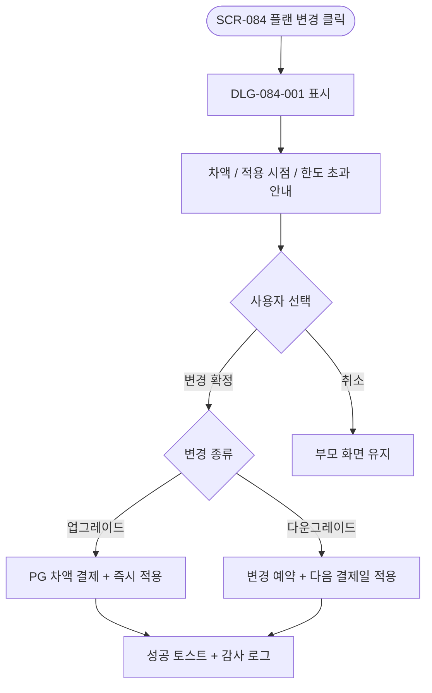
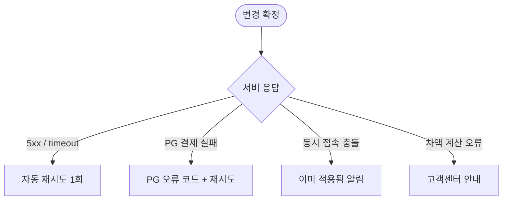

# DLG-084-001 플랜 변경 확인 다이얼로그

## 1. 다이얼로그 메타 정보

| 항목 | 값 |
|---|---|
| 작성일 | 2026-05-22 |
| 버전 | v1.0 |
| 도메인 | D09 설정관리 |
| 다이얼로그 ID | DLG-084-001 |
| 다이얼로그명 | 플랜 변경 확인 |
| 유형 | 결제 확인 다이얼로그 (Billing Confirmation) |
| 우선순위 | P0 |
| 부모 화면 | SCR-084 구독 결제 관리 |
| 트리거 | [플랜 변경] 또는 플랜 카드의 [이 플랜으로 변경] 클릭 |

## 2. 다이얼로그 개요와 목적

플랜 변경 확인 다이얼로그는 SCR-084 구독 결제 관리에서 운영자가 플랜 업그레이드 또는 다운그레이드를 시도할 때 변경 후 차액·적용 시점·데이터 한도 초과 여부를 사전 안내하고 최종 확인을 받는 모달입니다. 업그레이드는 즉시 적용 + 잔여 기간 일할 차액 청구, 다운그레이드는 다음 결제일부터 적용 + 차액 환급 없음 + 데이터 한도 초과 경고의 정책이 명시됩니다.

## 3. 호출 컨텍스트와 부모 화면

부모 화면 SCR-084의 현재 구독 카드 [플랜 변경] 버튼 또는 플랜 비교 카드의 [이 플랜으로 변경] CTA가 트리거입니다. owner와 superAdmin/primary만 호출할 수 있습니다.

## 4. 레이아웃과 UI 구성

모달 상단에 "플랜을 변경하시겠습니까?" 제목과 변경 종류 배지(업그레이드/다운그레이드)가 표시됩니다. 본문에는 다음 카드가 나열됩니다.

현재 플랜 → 새 플랜 비교 카드(플랜명·월 요금·회원 수 한도·주요 기능 차이).

차액 안내 카드(업그레이드: 잔여 기간 일할 차액 즉시 청구 / 다운그레이드: 차액 환급 없음).

적용 시점 안내 카드(업그레이드: 즉시 적용 / 다운그레이드: 다음 결제일).

다운그레이드 시 데이터 한도 초과가 감지되면 빨강 톤의 경고 영역이 추가로 표시되며, 현재 회원 수·데이터 용량·하위 플랜 한도가 비교되고 "[지금 초과 데이터 정리하기]" 링크가 함께 노출됩니다.

하단에는 [변경 확정] / [취소] 두 버튼이 배치되며 [변경 확정]은 강조 색상입니다.

## 5. 입력 항목 정의

별도 입력 필드는 없습니다. 모든 결정 정보가 사전 표시되어 운영자가 확인만 진행합니다.

## 6. 버튼 액션 정의

[변경 확정] 버튼은 `POST /api/subscription/change-plan` 호출을 실행합니다. 업그레이드는 즉시 PG에 차액 청구가 이뤄지고 새 플랜이 즉시 활성됩니다. 다운그레이드는 변경 예약만 등록되고 다음 결제일부터 적용됩니다. 응답 성공 시 부모 화면이 새 플랜으로 갱신됩니다.

[취소] 버튼은 모달을 닫고 부모 화면에 영향을 주지 않습니다. ESC와 배경 클릭도 동일하게 동작합니다.

## 7. 호출 흐름과 부모 화면 반영

운영자가 [플랜 변경] 또는 [이 플랜으로 변경]을 누르면 이 모달이 표시됩니다. 사전 정보를 확인한 후 [변경 확정] 시 결제 트랜잭션과 플랜 변경이 처리되고, [취소] 시 부모 화면이 그대로 유지됩니다.

## 8. 토스트와 알럿

성공 시 "플랜이 변경되었습니다" 토스트가 부모 화면에 표시됩니다. 업그레이드 차액 청구 결과는 별도 카드로 표시될 수 있습니다. 실패 시 PG 오류 코드와 함께 토스트가 표시됩니다.

다운그레이드 데이터 한도 초과 경고는 본 모달의 본문에 빨강 톤 영역으로 표시됩니다.

## 9. 데이터 흐름과 외부 연동

[변경 확정] 시 `POST /api/subscription/change-plan` 호출이 실행됩니다. 업그레이드는 PG 차액 결제와 새 플랜 활성이 트랜잭션으로 처리되며, 다운그레이드는 변경 예약 레코드만 INSERT됩니다.

SCR-097 감사 로그에 actor·before 플랜·after 플랜·변경일·차액·timestamp가 INSERT됩니다.

자동 갱신 일정은 변경 후 새 플랜 기준으로 다시 계산됩니다. 다운그레이드 다음 결제일에는 데이터 한도 초과 정리 배치(자정 실행)가 동시에 동작해 비활성 회원 우선 자동 아카이빙됩니다.

`subscription_change_log` 테이블에 이전 플랜·신규 플랜·변경일·실행자가 저장됩니다.

## 10. 다이얼로그 상태와 예외 처리

기본·차액 계산 중·확정 중·확정 완료·확정 실패·데이터 한도 초과 경고 등 상태를 가집니다. 예외: PG 결제 오류·동시 접속 충돌·차액 계산 오류·VAT 계산 오류·네트워크 오류 자동 재시도 1회 등.

## 11. 권한별 처리

owner와 primary/superAdmin만 사용할 수 있습니다. 매니저 이하는 부모 화면 접근 자체가 차단되어 이 모달을 볼 수 없습니다.

## 12. 메인 흐름

## 13. 에러와 예외 흐름

## 14. 핵심 디자인 요청사항

현재 플랜 → 새 플랜 비교는 두 카드를 좌우로 나란히 배치해 차이가 한눈에 들어와야 합니다. 차액·적용 시점·한도 초과 안내는 각 카드로 분리되어 운영자가 항목별로 영향을 파악합니다. 데이터 한도 초과 경고는 빨강 톤으로 명확히 강조됩니다.

## 15. 운영 정책 (이 다이얼로그에 연결된 부분)

플랜 업그레이드는 즉시 적용 + 잔여 기간 일할 차액 청구입니다(잔여 일수 × 일일 단가 차액).

플랜 다운그레이드는 다음 결제일부터 적용 + 선납 차액 환급 없음입니다. 다운그레이드 확정 전 현재 회원 수·데이터 용량과 하위 플랜 한도가 비교되어 초과 시 경고가 표시됩니다.

다운그레이드 데이터 한도 초과 정리 배치는 다운그레이드 적용일 자정에 비활성 회원 우선으로 자동 아카이빙되며 운영자 리포트가 생성됩니다.

PG 카드 정보는 토큰으로만 PG사에 저장되며 Pando 서버에는 카드 마지막 4자리·카드사만 보관됩니다.

VAT는 청구 금액에 공급가 + 부가세 10%가 합산 표기됩니다.

플랜 변경 이력은 `subscription_change_log` 테이블에 영구 저장되며 감사 로그에도 INSERT됩니다.

플랜 변경 중 동시 접속 충돌이 발생하면 최종 저장자 우선 반영되며 이전 사용자에게 "변경 사항이 이미 적용되었습니다" 알림이 표시됩니다.

이상의 정책은 이 다이얼로그를 구현·운영하는 사람이 별도 문서 없이 이 한 장만 보면 이해할 수 있도록 풀어 적었습니다.
