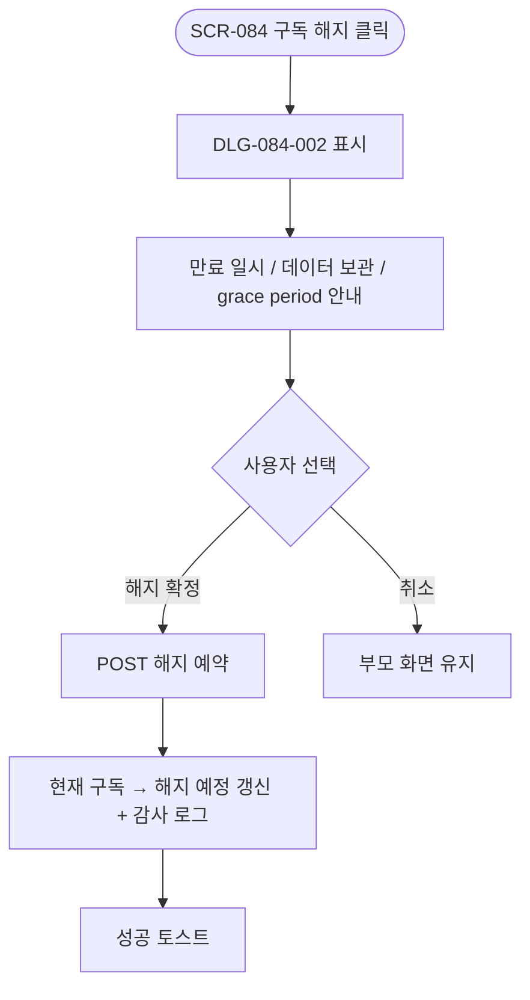
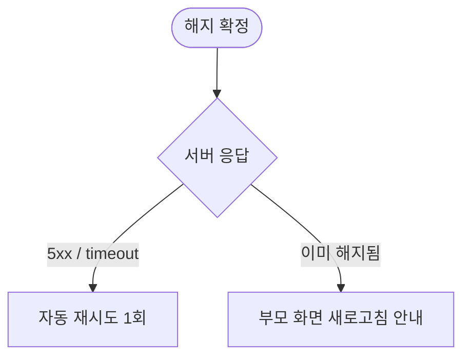

# DLG-084-002 구독 해지 확인 다이얼로그

## 1. 다이얼로그 메타 정보

| 항목 | 값 |
|---|---|
| 작성일 | 2026-05-22 |
| 버전 | v1.0 |
| 도메인 | D09 설정관리 |
| 다이얼로그 ID | DLG-084-002 |
| 다이얼로그명 | 구독 해지 확인 |
| 유형 | 최종 확인 다이얼로그 (Destructive Confirmation) |
| 우선순위 | P0 |
| 부모 화면 | SCR-084 구독 결제 관리 |
| 트리거 | 현재 구독 카드 [구독 해지] 버튼 클릭 |

## 2. 다이얼로그 개요와 목적

구독 해지 확인 다이얼로그는 SCR-084 구독 결제 관리에서 운영자가 [구독 해지] 버튼을 누른 후 만료 일시·데이터 보관 정책(90일)·grace period 정책을 사전 안내받고 최종 확인하는 모달입니다. 해지 후에도 만료일까지는 서비스를 정상 이용할 수 있고, 만료 후 90일 동안 데이터가 보관됩니다. 90일 경과 시 자동 삭제 배치로 영구 삭제되며 삭제 7일 전 경고 메일이 발송됩니다.

## 3. 호출 컨텍스트와 부모 화면

부모 화면 SCR-084의 현재 구독 카드 [구독 해지] 버튼이 트리거입니다. owner와 superAdmin/primary만 호출할 수 있습니다.

## 4. 레이아웃과 UI 구성

모달 상단에 경고 아이콘과 "구독을 해지하시겠습니까?" 제목이 표시됩니다. 본문에는 만료 일시(다음 결제 예정일까지 서비스 이용 가능)·데이터 보관 정책(90일 후 자동 삭제 안내)·grace period 정책(해지 후 90일 이내 재가입 시 데이터 복구 가능, 90일 초과 시 신규 시작) 안내 카드가 나열됩니다.

하단에는 [해지 확정] / [취소] 두 버튼이 배치되며 [해지 확정]은 빨강 톤으로 destructive 액션임을 명확히 알립니다.

## 5. 입력 항목 정의

별도 입력 필드는 없습니다. 모든 안내 정보가 사전 표시되며 운영자는 최종 확인만 진행합니다.

## 6. 버튼 액션 정의

[해지 확정] 버튼은 `POST /api/subscription/cancel` 호출을 실행합니다. 해지 예약 레코드가 INSERT되고 만료일이 표시됩니다. 만료일까지는 서비스 정상 이용 가능합니다.

[취소] 버튼은 모달을 닫고 구독은 정상 유지됩니다. ESC와 배경 클릭도 동일하게 동작합니다.

## 7. 호출 흐름과 부모 화면 반영

운영자가 [구독 해지]를 누르면 이 모달이 표시됩니다. 안내를 확인한 후 [해지 확정] 시 해지 예약이 등록되고 부모 화면의 현재 구독 상태가 "해지 예정"으로 갱신됩니다.

## 8. 토스트와 알럿

성공 시 "구독 해지가 예약되었습니다 — 만료일 {YYYY-MM-DD}까지 서비스 이용 가능" 토스트가 부모 화면에 표시됩니다. 실패 시 사유와 함께 토스트가 표시됩니다.

## 9. 데이터 흐름과 외부 연동

[해지 확정] 시 `POST /api/subscription/cancel` 호출이 실행됩니다. 해지 예약 레코드가 INSERT되며 만료일 이후 90일이 지나면 데이터 삭제 배치로 영구 삭제됩니다. 삭제 7일 전 경고 메일이 자동 발송됩니다.

SCR-097 감사 로그에 actor·해지 사유(선택)·만료일·timestamp가 INSERT됩니다.

자동 갱신 배치는 해지 예약 후 다음 결제 예정일에 청구를 시도하지 않습니다.

## 10. 다이얼로그 상태와 예외 처리

기본·해지 확정 중·해지 완료·해지 실패 상태를 가집니다. 예외: 네트워크 오류 자동 재시도 1회 / 이미 해지된 구독 / 본사 슈퍼관리자가 임의 해지 시도 등.

## 11. 권한별 처리

owner와 primary/superAdmin만 사용할 수 있습니다. 매니저 이하는 부모 화면 접근 자체가 차단되어 이 모달을 볼 수 없습니다.

## 12. 메인 흐름

## 13. 에러와 예외 흐름

## 14. 핵심 디자인 요청사항

[해지 확정] 버튼은 빨강 톤으로 destructive 액션임을 명확히 알립니다. 만료 일시·데이터 보관 90일·grace period 정책은 각 카드로 분리되어 운영자가 영향을 단계별로 인지하도록 합니다.

## 15. 운영 정책 (이 다이얼로그에 연결된 부분)

구독 해지 시 만료일까지 서비스 이용 가능하며, 만료 후 데이터는 90일 보관 후 자동 삭제됩니다. 삭제 7일 전 경고 메일이 발송됩니다.

해지 후 90일 이내 재가입 시 이전 데이터 복구 선택이 가능합니다. 90일 초과 시 신규 시작이며 이전 데이터는 영구 삭제됩니다.

구독 해지 쿨다운 정책에 따라 해지 후 동일 결제 수단으로 당일 재가입 시 PG 이중 청구 방지 로직이 동작합니다.

해지 시 청구 이력은 법적 보관 의무(5년)에 따라 영구 보관됩니다.

감사 로그에는 actor·해지 사유·만료일·timestamp가 INSERT됩니다.

이상의 정책은 이 다이얼로그를 구현·운영하는 사람이 별도 문서 없이 이 한 장만 보면 이해할 수 있도록 풀어 적었습니다.
