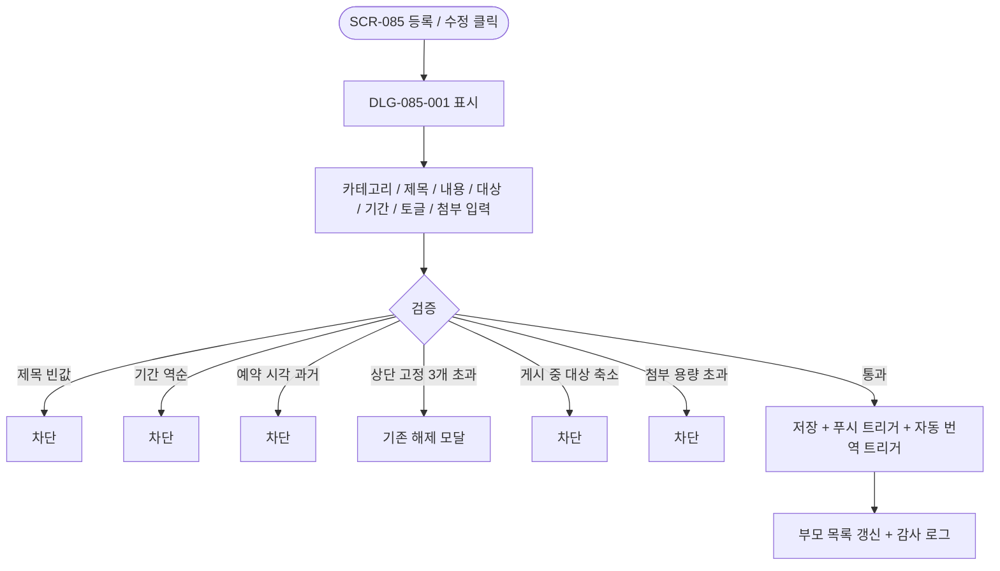
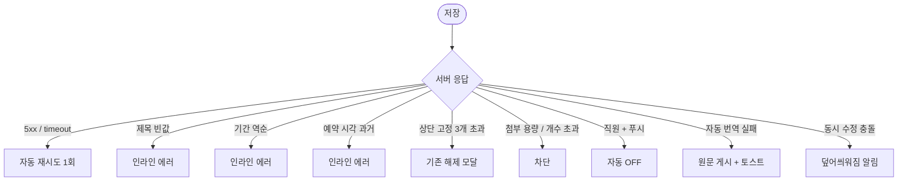

# DLG-085-001 공지 등록·수정 다이얼로그

## 1. 다이얼로그 메타 정보

| 항목 | 값 |
|---|---|
| 작성일 | 2026-05-22 |
| 버전 | v1.0 |
| 도메인 | D09 설정관리 |
| 다이얼로그 ID | DLG-085-001 |
| 다이얼로그명 | 공지 등록·수정 |
| 유형 | 입력 다이얼로그 (Form Dialog) |
| 우선순위 | P0 |
| 부모 화면 | SCR-085 공지사항 관리 |
| 트리거 | [+ 공지 등록] 또는 행의 [수정] 버튼 클릭 |

## 2. 다이얼로그 개요와 목적

공지 등록·수정 다이얼로그는 SCR-085 공지사항 관리에서 새 공지를 작성하거나 기존 공지를 수정하기 위해 호출되는 입력 모달입니다. 카테고리·제목·내용·게시 대상·게시 기간·중요(상단 고정)·예약 발행·푸시 발송·필독 처리·회원앱 노출·첨부 파일 항목이 한 화면에서 입력됩니다. 게시 중인 공지를 수정할 때는 게시 대상 축소가 차단되는 등 일부 항목에 추가 제한이 적용됩니다.

## 3. 호출 컨텍스트와 부모 화면

부모 화면 SCR-085의 [+ 공지 등록] 버튼은 빈 폼으로, 행의 [수정] 버튼은 채워진 폼으로 이 모달을 호출합니다. owner와 매니저는 공지 작성·수정 모두 가능하고, 매니저는 행의 [삭제]만 차단됩니다.

## 4. 레이아웃과 UI 구성

모달 상단에 "공지 등록" 또는 "공지 수정 — {원본 제목}" 제목이 표시됩니다. 본문에는 다음 항목이 위에서 아래로 배치됩니다.

카테고리 라디오(운영·이벤트·시설·긴급 4종).

제목 입력란(필수, 100자 이내).

내용 리치 텍스트 에디터(10,000자 이내).

게시 대상 라디오(전체 / 직원 / 회원 / 특정 역할). 특정 역할 선택 시 역할 선택 드롭다운이 추가로 표시됩니다.

게시 기간 입력(시작일 ~ 종료일).

중요(상단 고정) 토글. ON 시 상단 고정 동시 최대 3개 제한 검증.

예약 발행 입력(날짜·시각, 선택). 입력 시 발행 전 자동 게시.

푸시 발송 토글(게시 즉시 또는 예약 시각에 수신 대상에게 발송). 직원 대상 공지는 자동 OFF.

필독 처리 토글. ON 시 회원 앱에서 확인 전까지 팝업 표시.

회원앱 노출 토글.

첨부 파일 업로드 영역(이미지 5MB, PDF 20MB, 최대 5개).

하단에는 [저장] / [취소] 두 버튼이 배치됩니다.

## 5. 입력 항목 정의

제목은 1~100자 필수입니다. 미입력 시 "제목을 입력해주세요" 인라인 에러가 표시되고 저장이 차단됩니다.

내용은 리치 텍스트 10,000자 이내입니다.

게시 기간은 종료일이 시작일 이후여야 합니다. 역순일 경우 인라인 에러가 표시되고 저장이 차단됩니다.

예약 발행 시각은 미래여야 합니다. 과거 시각은 저장 차단됩니다.

상단 고정은 동시 최대 3개입니다. 초과 시 기존 고정 해제 모달이 표시됩니다.

첨부 파일은 이미지 5MB·PDF 20MB 이내, 공지당 최대 5개 제한이 적용됩니다.

특정 역할 게시 대상 선택 시 역할 드롭다운에서 한 개 이상 선택해야 합니다.

## 6. 버튼 액션 정의

[저장] 버튼은 입력 검증 후 `POST /api/notices`(등록) 또는 `PUT /api/notices/:id`(수정) 호출을 실행합니다. 자동 번역(SET-05 ON 시)이 비동기로 트리거되며 푸시 발송도 게시 즉시 또는 예약 시각에 처리됩니다.

[취소] 버튼은 모달을 닫고 부모 화면에 영향을 주지 않습니다. 미저장 변경이 있는 경우 한 번 더 확인이 표시됩니다.

## 7. 호출 흐름과 부모 화면 반영

운영자가 [+ 공지 등록] 또는 [수정]을 누르면 이 모달이 표시됩니다. 입력 후 [저장] 시 부모 화면의 공지 목록이 갱신되고 푸시 발송과 자동 번역이 백그라운드에서 진행됩니다.

## 8. 토스트와 알럿

성공 시 "공지가 등록되었습니다" 또는 "공지가 수정되었습니다" 토스트가 부모 화면에 표시됩니다. 자동 번역 실패 시 "번역 실패 — 한국어 원문으로 게시" 토스트가 추가로 표시됩니다.

확인 팝업은 상단 고정 3개 초과·게시 중 대상 축소·복사 베이스 변경 등에서 표시됩니다.

## 9. 데이터 흐름과 외부 연동

[저장] 시 `POST /api/notices` 또는 `PUT /api/notices/:id` 호출이 실행됩니다. 첨부 파일은 `POST /api/notices/:id/upload`로 멀티파트 업로드됩니다. 푸시 발송은 `POST /api/notices/:id/push`로 게시 즉시 또는 예약 시각에 FCM/APNs로 발송됩니다.

자동 번역은 SET-05 자동 번역 ON 시 외부 번역 API가 비동기 호출되어 활성 키오스크 언어 기준 번역본이 생성됩니다.

예약 발행 배치는 설정된 예약 시각에 상태를 "예정 → 게시 중"으로 자동 전환합니다.

키오스크 공지 동기화는 SCR-082가 연결된 키오스크 기기에 실시간 push합니다.

SCR-097 감사 로그에 actor·notice_id·title·type(등록/수정) INSERT됩니다.

수정 시 수정 전 원문은 히스토리 테이블에 버전 관리(최대 10버전)됩니다.

## 10. 다이얼로그 상태와 예외 처리

기본·검증 실패(인라인)·저장 중·저장 완료·저장 실패 상태를 가집니다. 예외: 제목 미입력·게시 기간 역순·예약 시각 과거·상단 고정 3개 초과·게시 중 대상 축소·첨부 용량/개수 초과·자동 번역 실패·직원 대상 + 푸시 ON(자동 OFF)·동시 수정 충돌(덮어씌움 안내)·네트워크 오류 자동 재시도 1회 등.

## 11. 권한별 처리

슈퍼관리자·primary는 전 지점 공지를 등록·수정할 수 있고 "전체 지점" 모드도 사용 가능합니다.

Owner(지점장)은 자기 지점 공지를 등록·수정할 수 있습니다.

매니저는 자기 지점 공지를 등록·수정할 수 있지만 삭제는 불가합니다.

## 12. 메인 흐름

## 13. 에러와 예외 흐름

## 14. 핵심 디자인 요청사항

폼은 위에서 아래로 위계 있게 배치되어 운영자가 항목을 순서대로 입력할 수 있어야 합니다. 토글들은 그룹으로 묶여 게시·발송·확인 옵션이 시각적으로 구분됩니다. 카테고리 라디오의 긴급은 빨강 톤으로 강조되어 운영자가 긴급 카테고리를 인지하도록 합니다.

## 15. 운영 정책 (이 다이얼로그에 연결된 부분)

게시 기간은 시작일 자동 활성, 종료일 자정 자동 종료(만료 자동 비공개 배치)입니다.

상단 고정은 동시 최대 3개입니다. 같은 지점 내 복수 고정은 최신 등록 순으로 우선 표시됩니다.

게시 중 공지의 게시 대상은 추가만 허용되고 축소는 차단됩니다.

직원 대상 공지는 앱 푸시 미지원이며 푸시 토글이 자동 OFF로 전환됩니다.

필독 처리 ON 공지는 회원 앱에서 확인 전까지 팝업 표시되며, 게시 후 24시간 경과 시 미확인 회원에게 1회 재푸시됩니다.

자동 번역(SET-05 ON)은 활성 키오스크 언어(한국어 제외) 전체에 적용되며 번역 결과는 공지 레코드에 언어별 컬럼으로 저장됩니다. 실패 시 한국어 원문 fallback됩니다.

첨부 파일은 이미지 5MB·PDF 20MB·공지당 최대 5개입니다.

수정 시 수정 전 원문은 히스토리 테이블에 최대 10버전 보관됩니다.

감사 로그에는 공지 ID·제목·카테고리·게시 대상·게시 기간·작성자·변경 유형이 INSERT됩니다.

이상의 정책은 이 다이얼로그를 구현·운영하는 사람이 별도 문서 없이 이 한 장만 보면 이해할 수 있도록 풀어 적었습니다.
