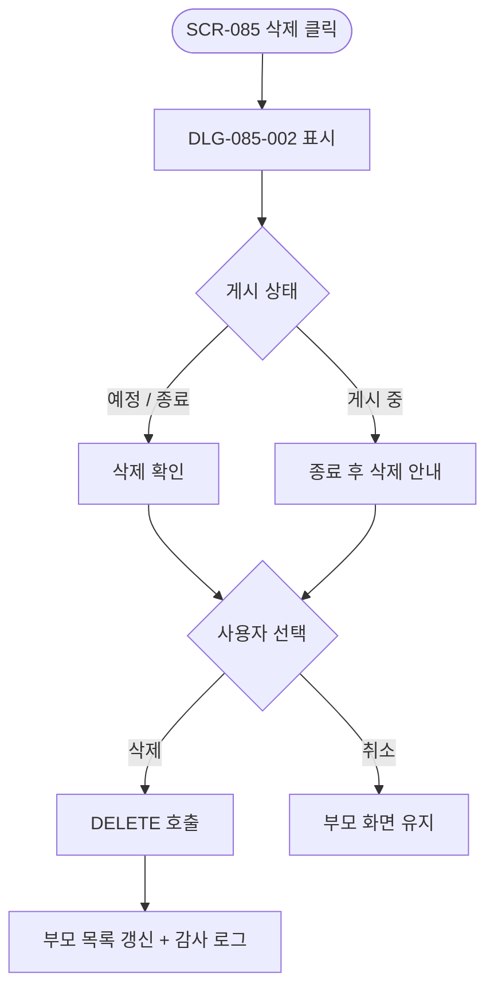
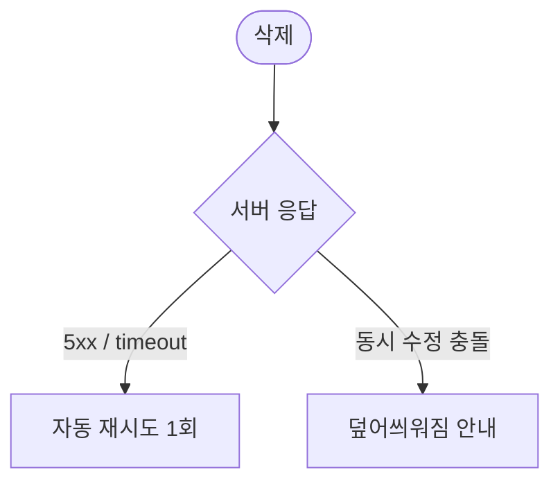

# DLG-085-002 공지 삭제 확인 다이얼로그

## 1. 다이얼로그 메타 정보

| 항목 | 값 |
|---|---|
| 작성일 | 2026-05-22 |
| 버전 | v1.0 |
| 도메인 | D09 설정관리 |
| 다이얼로그 ID | DLG-085-002 |
| 다이얼로그명 | 공지 삭제 확인 |
| 유형 | 최종 확인 다이얼로그 (Destructive Confirmation) |
| 우선순위 | P0 |
| 부모 화면 | SCR-085 공지사항 관리 |
| 트리거 | 행의 [삭제] 버튼 클릭 |

## 2. 다이얼로그 개요와 목적

공지 삭제 확인 다이얼로그는 SCR-085 공지사항 관리에서 운영자가 공지를 삭제하기 전 최종 확인을 받는 모달입니다. 삭제된 공지는 복구할 수 없으며, 게시 중인 공지는 종료 처리 후에야 삭제 가능합니다. 매니저에게는 이 모달 자체가 호출되지 않습니다(삭제 권한 없음).

## 3. 호출 컨텍스트와 부모 화면

부모 화면 SCR-085의 행 [삭제] 아이콘이 트리거입니다. owner와 superAdmin/primary만 호출할 수 있으며, 게시 중 공지를 누른 경우에는 "종료 처리 후 삭제 가능합니다" 안내가 표시되고 종료 처리 + 삭제 2단계가 제공됩니다.

## 4. 레이아웃과 UI 구성

모달 상단에 경고 아이콘과 "공지를 삭제하시겠습니까?" 제목이 표시됩니다. 본문에는 삭제 대상 공지의 제목·게시 대상·게시 기간이 카드 형태로 표시되고, "삭제된 공지는 복구할 수 없습니다" 안내가 강조 톤으로 노출됩니다.

게시 중 공지의 경우 "이 공지는 현재 게시 중입니다. 먼저 종료 처리해야 삭제 가능합니다" 안내와 함께 [종료 후 삭제] 버튼이 활성됩니다.

하단에는 [삭제] / [취소] 두 버튼이 배치되며 [삭제]는 빨강 톤입니다.

## 5. 입력 항목 정의

별도 입력 필드는 없습니다.

## 6. 버튼 액션 정의

[삭제] 버튼은 `DELETE /api/notices/:id` 호출을 실행합니다. 응답 성공 시 부모 화면의 공지 목록에서 행이 사라집니다.

게시 중 공지의 경우 [종료 후 삭제] 버튼이 표시되며, 누르면 상태를 "종료"로 전환한 후 즉시 삭제까지 한 트랜잭션으로 처리됩니다.

[취소] 버튼은 모달을 닫고 부모 화면에 영향을 주지 않습니다.

## 7. 호출 흐름과 부모 화면 반영

운영자가 [삭제]를 누르면 이 모달이 표시되고, [삭제] 확정 시 백엔드에서 삭제가 처리되어 부모 목록에서 행이 사라집니다.

## 8. 토스트와 알럿

성공 시 "공지가 삭제되었습니다" 토스트가 부모 화면에 표시됩니다. 실패 시 사유와 함께 토스트가 표시됩니다.

## 9. 데이터 흐름과 외부 연동

[삭제] 시 `DELETE /api/notices/:id` 호출이 실행됩니다. SCR-097 감사 로그에 actor·notice_id·title·삭제일이 INSERT됩니다. 삭제 후에는 회원앱 공지 피드와 키오스크 공지가 자동으로 갱신됩니다.

## 10. 다이얼로그 상태와 예외 처리

기본·삭제 중·삭제 완료·삭제 실패·게시 중 공지(종료 처리 안내) 상태를 가집니다. 예외: 네트워크 오류 자동 재시도 1회 / 매니저 진입 차단(버튼 hidden으로 모달 호출 자체 차단) / 동시 수정 충돌 등.

## 11. 권한별 처리

owner와 primary/superAdmin만 사용할 수 있습니다. 매니저는 부모 화면의 [삭제] 버튼 자체가 hidden 처리되어 이 모달을 볼 수 없습니다.

## 12. 메인 흐름

## 13. 에러와 예외 흐름

## 14. 핵심 디자인 요청사항

[삭제] 버튼은 빨강 톤으로 destructive 액션임을 명확히 알립니다. 게시 중 공지의 [종료 후 삭제] 버튼은 일반 [삭제]와 시각적으로 분리되어 두 단계 처리임을 운영자가 인지하도록 합니다.

## 15. 운영 정책 (이 다이얼로그에 연결된 부분)

삭제된 공지는 복구할 수 없으며 감사 로그에는 제목·삭제자·삭제일만 보관됩니다.

게시 중 공지의 즉시 삭제는 차단되며 종료 처리 후 삭제 가능합니다(UX 보호 정책).

매니저는 공지 작성·수정은 가능하나 삭제는 불가합니다. 부모 화면에서 [삭제] 버튼 자체가 hidden 처리됩니다.

삭제 후에는 회원앱 공지 피드와 키오스크 공지가 자동으로 갱신됩니다.

감사 로그에는 actor·notice_id·title·삭제일이 INSERT됩니다.

이상의 정책은 이 다이얼로그를 구현·운영하는 사람이 별도 문서 없이 이 한 장만 보면 이해할 수 있도록 풀어 적었습니다.
