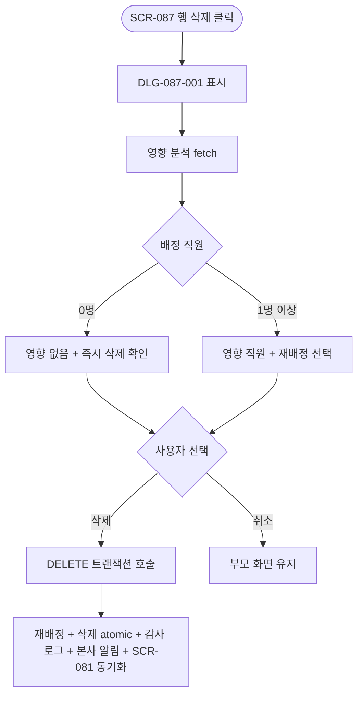
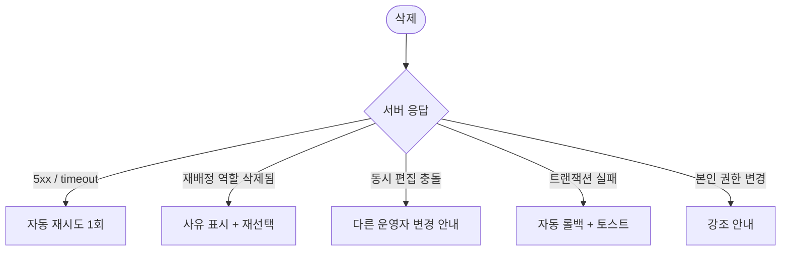

# DLG-087-001 역할 삭제 재배정 다이얼로그

## 1. 다이얼로그 메타 정보

| 항목 | 값 |
|---|---|
| 작성일 | 2026-05-22 |
| 버전 | v1.0 |
| 도메인 | D09 설정관리 |
| 다이얼로그 ID | DLG-087-001 |
| 다이얼로그명 | 역할 삭제 재배정 |
| 유형 | 최종 확인 + 재배정 입력 다이얼로그 |
| 우선순위 | P0 |
| 부모 화면 | SCR-087 커스텀 역할 생성 |
| 트리거 | 행의 [삭제] 버튼 클릭 |

## 2. 다이얼로그 개요와 목적

역할 삭제 재배정 다이얼로그는 SCR-087 커스텀 역할 생성에서 운영자가 커스텀 역할을 삭제하기 전에 배정 직원의 재배정 처리를 함께 결정하는 모달입니다. 배정 직원이 1명 이상이면 재배정 역할 선택이 강제되며, 재배정과 삭제가 한 트랜잭션으로 처리되어 권한 공백이 발생하지 않도록 보장합니다. 배정 직원이 0명이면 간단한 삭제 확인 모드로 동작합니다.

SCR-081의 역할 삭제 흐름(DLG-081-006 → 재배정 선택 → DLG-081-004)과 비교했을 때, 이 다이얼로그는 SCR-087 화면 안에서 영향 분석 미리보기·재배정 선택·삭제 확인을 통합한 단일 모달로 제공된다는 점이 차이입니다.

## 3. 호출 컨텍스트와 부모 화면

부모 화면 SCR-087의 행 [삭제] 아이콘이 트리거입니다. owner와 superAdmin/primary만 호출할 수 있으며, Owner(지점장)은 자기 지점 커스텀 역할만 삭제할 수 있습니다.

## 4. 레이아웃과 UI 구성

모달 상단에 경고 아이콘과 "역할 '{이름}'을 삭제하시겠습니까?" 제목이 표시됩니다. 본문에는 다음 영역이 위에서 아래로 배치됩니다.

영향 요약 카드(배정 직원 수·담당 회원 합계). 배정 직원이 0명이면 "영향 없음" 안내가 표시됩니다.

영향 직원 목록 미리보기(5명 + 더보기). 배정 직원이 0명이면 숨겨집니다.

재배정 역할 선택 드롭다운. 배정 직원이 1명 이상인 경우에만 표시되며 선택 필수입니다. 옵션에는 기본 7종 역할과 다른 커스텀 역할이 그룹별로 나열됩니다.

재배정 안내 영역("{N}명의 직원이 '{재배정 역할}'로 이동합니다" 강조 안내).

"삭제된 역할은 복구할 수 없습니다" 안내.

하단에는 [삭제] / [취소] 두 버튼이 배치되며 [삭제]는 빨강 톤이고 재배정 미선택 시 비활성됩니다(배정 직원 1명 이상인 경우).

## 5. 입력 항목 정의

재배정 역할 드롭다운은 배정 직원이 1명 이상일 때 필수 입력입니다. 미선택 시 [삭제] 버튼이 비활성됩니다. 본인이 그 역할에 배정된 경우 재배정 후 본인의 권한이 바뀐다는 안내가 표시됩니다.

## 6. 버튼 액션 정의

[삭제] 버튼은 누르면 `DELETE /api/permissions/custom-roles/:id` 호출이 실행되며 재배정 역할 ID가 함께 전송됩니다. 재배정과 삭제가 한 트랜잭션으로 atomic하게 처리됩니다. 응답 성공 시 부모 화면 목록에서 행이 사라지고 재배정 직원의 활성 세션은 다음 페이지 로드부터 새 역할 권한이 적용됩니다.

[취소] 버튼은 모달을 닫고 부모 화면에 영향을 주지 않습니다. ESC와 배경 클릭도 동일하게 동작합니다.

## 7. 호출 흐름과 부모 화면 반영

운영자가 행의 [삭제]를 누르면 이 모달이 표시됩니다. 영향 정보를 확인하고 (필요 시) 재배정 역할을 선택한 후 [삭제] 시 트랜잭션이 실행되고 부모 목록에서 행이 사라집니다.

## 8. 토스트와 알럿

성공 시 "역할이 삭제되었습니다 — N명 재배정 완료" 토스트가 부모 화면에 표시됩니다. 배정 직원 0명인 경우 "역할이 삭제되었습니다" 토스트만 표시됩니다.

실패 시 사유와 함께 토스트가 표시됩니다.

확인 팝업은 본인 재배정 안내(본인 권한이 박탈/변경됨)에서 표시됩니다.

## 9. 데이터 흐름과 외부 연동

모달 호출 시 `GET /api/permissions/custom-roles/:id/impact`로 영향 분석이 자동 fetch됩니다. [삭제] 시 `DELETE /api/permissions/custom-roles/:id`에 재배정 역할 ID가 포함되어 전송되며, 재배정 트랜잭션(`POST /api/permissions/custom-roles/:id/reassign`이 내부적으로 묶임)과 삭제가 atomic하게 처리됩니다.

SCR-097 감사 로그에 actor·삭제된 role_id·재배정 role_id·재배정 직원 수·timestamp가 INSERT됩니다. 재배정된 직원의 활성 세션은 다음 페이지 로드(JWT refresh)부터 새 역할 권한이 적용됩니다.

NFR-19 알림 센터로 본사 슈퍼관리자에게 역할 삭제 알림이 발송됩니다.

SCR-081 권한 설정과 단일 source-of-truth로 동기화되어 SCR-081에서도 즉시 갱신됩니다.

## 10. 다이얼로그 상태와 예외 처리

기본·영향 분석 중·재배정 선택 필요·삭제 중·삭제 완료·삭제 실패 상태를 가집니다. 예외: 네트워크 오류 자동 재시도 1회 / 재배정 미선택 시 [삭제] 비활성 / 재배정 역할이 그 사이에 삭제된 경우 사유 표시 / 동시 편집 충돌 안내 / 본인 권한 변경 안내 / 트랜잭션 실패 시 자동 롤백.

## 11. 권한별 처리

Owner(지점장)은 자기 지점 커스텀 역할만 삭제 가능합니다(RLS branchId 필터). primary·superAdmin은 전 지점 커스텀 역할을 삭제할 수 있습니다. 매니저 이하는 부모 화면 접근 자체가 차단되어 이 모달을 볼 수 없습니다.

## 12. 메인 흐름

## 13. 에러와 예외 흐름

## 14. 핵심 디자인 요청사항

배정 직원 수가 0명일 때와 1명 이상일 때의 모달 본문 구성이 명확히 달라야 합니다. 재배정 선택 드롭다운은 기본 역할과 커스텀 역할이 그룹별로 구분 표시되며, 미선택 시 [삭제] 버튼이 비활성 톤으로 표시됩니다.

[삭제] 버튼은 빨강 톤으로 destructive 액션임을 명확히 알리며, 재배정 안내 영역은 강조 색상으로 운영자가 어떤 직원이 어디로 이동하는지 명확히 인지하도록 합니다.

## 15. 운영 정책 (이 다이얼로그에 연결된 부분)

역할 삭제 시 배정 직원이 1명 이상이면 DLG-087-001 재배정이 강제됩니다. 재배정과 삭제는 한 트랜잭션으로 atomic하게 처리되며 부분 실패는 자동 롤백됩니다.

배정 직원이 0명이면 즉시 삭제 확인만 진행됩니다.

Owner(지점장)은 자기 지점 커스텀 역할만 삭제 가능합니다(RLS branchId 필터).

재배정된 직원의 활성 세션은 다음 페이지 로드(JWT refresh)부터 새 역할 권한이 적용됩니다. 담당 회원 매핑은 유지됩니다.

본인이 그 역할에 배정된 경우 재배정 후 본인 권한이 변경된다는 안내가 표시됩니다.

SCR-081 권한 설정과 단일 source-of-truth로 동기화되어 양 화면에서 즉시 갱신됩니다.

NFR-19 알림 센터로 본사 슈퍼관리자에게 역할 삭제 알림이 발송되어 사후 추적이 가능합니다.

감사 로그에는 actor·삭제된 role_id·재배정 role_id·재배정 직원 수·timestamp가 INSERT됩니다.

이상의 정책은 이 다이얼로그를 구현·운영하는 사람이 별도 문서 없이 이 한 장만 보면 이해할 수 있도록 풀어 적었습니다.
