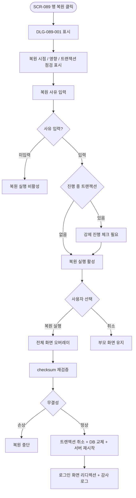
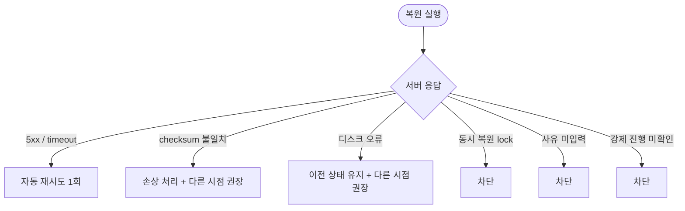

# DLG-089-001 데이터 복원 확인 다이얼로그

## 1. 다이얼로그 메타 정보

| 항목 | 값 |
|---|---|
| 작성일 | 2026-05-22 |
| 버전 | v1.0 |
| 도메인 | D09 설정관리 |
| 다이얼로그 ID | DLG-089-001 |
| 다이얼로그명 | 데이터 복원 확인 |
| 유형 | 시스템 운영 확인 다이얼로그 (Disaster Recovery Confirmation) |
| 우선순위 | P0 |
| 부모 화면 | SCR-089 데이터 백업·복원 |
| 트리거 | 백업 이력 행의 [복원] 버튼 클릭 |

## 2. 다이얼로그 개요와 목적

데이터 복원 확인 다이얼로그는 SCR-089 데이터 백업·복원에서 운영자가 특정 백업 시점으로 시스템을 복원하기 전 최종 확인을 받는 모달입니다. 복원 시 시스템이 재시작되어 진행 중 트랜잭션이 중단되고, 복원 시점 이후 데이터가 모두 손실되므로 영향 안내·트랜잭션 점검·복원 사유 입력이 함께 표시됩니다. 복원은 슈퍼관리자 권한 또는 Owner(지점장)의 슈퍼관리자 승인 후에만 실행 가능합니다.

## 3. 호출 컨텍스트와 부모 화면

부모 화면 SCR-089의 백업 이력 테이블에서 슈퍼관리자가 행의 [복원] 버튼을 누를 때 트리거됩니다. Owner(지점장)의 경우 [복원] 버튼이 [승인 요청]으로 표시되어 이 모달 대신 승인 요청 워크플로가 시작됩니다. 백업 파일이 손상(checksum 불일치)된 경우 [복원] 버튼이 비활성되어 이 모달이 호출되지 않습니다.

## 4. 레이아웃과 UI 구성

모달 상단에 경고 아이콘과 "데이터를 복원하시겠습니까?" 제목이 표시됩니다. 본문에는 다음 카드가 위에서 아래로 배치됩니다.

복원 시점 카드(YYYY-MM-DD HH:mm 형식, 백업 방식·데이터 크기 표시).

복원 시점 이후 데이터 손실 안내 카드(복원 시점 이후 생성·수정된 데이터가 모두 손실됨을 명시).

진행 중 트랜잭션 점검 카드(현재 진행 중인 결제·예약 트랜잭션 수가 표시되고 "복원 시 이 트랜잭션은 취소됩니다" 경고가 함께 표시).

시스템 재시작 안내 카드(복원 완료까지 약 N분 소요, 이 시간 동안 서비스 중단).

복원 사유 입력란(필수 텍스트).

하단에는 [복원 실행] / [취소] 두 버튼이 배치되며 [복원 실행]은 빨강 톤이고 사유 미입력 시 비활성됩니다.

## 5. 입력 항목 정의

복원 사유는 텍스트 필수 입력입니다. 미입력 시 [복원 실행] 버튼이 비활성됩니다. 입력된 사유는 감사 로그와 복원 이력에 저장됩니다.

진행 중 트랜잭션이 있는 경우 추가로 "강제 진행" 확인 체크박스가 표시되어 운영자가 의식적으로 트랜잭션 취소를 수용하도록 합니다.

## 6. 버튼 액션 정의

[복원 실행] 버튼은 누르면 부모 화면이 전체 화면 오버레이로 전환되고 `POST /api/backup/:id/restore` 호출이 실행됩니다. 백엔드에서 무결성 검증(checksum 재확인) → 진행 중 트랜잭션 취소 → DB 교체 → 애플리케이션 서버 재시작이 순차 진행됩니다. 복원 완료 후 사용자 세션이 초기화되어 로그인 화면으로 자동 리디렉션됩니다.

[취소] 버튼은 모달을 닫고 부모 화면에 영향을 주지 않습니다. ESC와 배경 클릭도 동일하게 동작합니다.

## 7. 호출 흐름과 부모 화면 반영

운영자가 백업 이력의 [복원]을 누르면 이 모달이 표시됩니다. 사유 입력 후 [복원 실행] 시 전체 화면 오버레이가 부모 화면에 표시되고 복원이 진행되며, 완료 후 로그인 화면으로 리디렉션됩니다.

복원 중 다른 운영자가 시스템에 접근하면 "현재 복원이 진행 중입니다" 전체 화면 안내가 표시되고 복원 완료 후 자동 리디렉션됩니다.

## 8. 토스트와 알럿

복원 진행은 토스트가 아닌 전체 화면 오버레이로 표시되어 운영자가 다른 액션을 수행할 수 없도록 차단합니다. 진행률과 예상 완료 시각이 큰 글자로 표시됩니다.

복원 실패 시 "복원에 실패했습니다 — 다른 백업 시점 선택을 권장합니다" 모달이 표시되며 시스템은 이전 상태를 유지합니다.

## 9. 데이터 흐름과 외부 연동

모달 호출 시 진행 중 트랜잭션 카운트가 실시간 fetch됩니다.

[복원 실행] 시 `POST /api/backup/:id/restore` 호출이 실행됩니다. 요청에 복원 사유와 강제 진행 여부가 포함됩니다.

백엔드에서 checksum(SHA-256) 재검증이 먼저 수행됩니다. 불일치 시 손상 처리되어 복원이 중단됩니다.

진행 중 트랜잭션은 강제 취소되고 DB 교체 후 애플리케이션 서버 재시작이 일어납니다.

SCR-097 감사 로그에 actor·type=restore·backup_id·사유·timestamp INSERT됩니다.

복원 이력에는 일시·복원 백업 시점·실행자·사유·결과(성공/실패)가 영구 보관됩니다.

복원 완료 후 클라이언트는 로그인 화면으로 자동 리디렉션됩니다.

## 10. 다이얼로그 상태와 예외 처리

기본·트랜잭션 점검 중·사유 입력 대기·복원 실행 중(전체 화면)·복원 완료·복원 실패 상태를 가집니다.

예외: 백업 파일 손상(checksum 불일치) 시 [복원 실행] 비활성·복원 실패 디스크 오류(이전 상태 유지)·복원 사유 미입력(차단)·네트워크 오류 자동 재시도 1회·진행 중 트랜잭션 강제 진행 미확인 시 차단·동시 복원 시도 차단(시스템 lock).

## 11. 권한별 처리

슈퍼관리자(superAdmin)와 본사 최고관리자(primary)만 [복원 실행]을 수행할 수 있습니다. Owner(지점장)은 [복원] 버튼이 [승인 요청]으로 표시되어 슈퍼관리자에게 승인 요청 알림이 발송됩니다(이 모달은 호출되지 않음). 매니저 이하는 부모 화면 접근 자체가 차단됩니다.

## 12. 메인 흐름

## 13. 에러와 예외 흐름

## 14. 핵심 디자인 요청사항

[복원 실행] 버튼은 빨강 톤으로 destructive 액션임을 명확히 알립니다. 복원 시점 이후 데이터 손실 안내와 시스템 재시작 안내는 강조 영역으로 표시되어 운영자가 영향을 단계별로 인지하도록 합니다.

복원 사유 입력란은 충분히 큰 크기로 디자인되어 운영자가 자세한 사유를 입력할 수 있도록 유도합니다.

복원 실행 중 전체 화면 오버레이는 다른 모든 상호작용을 차단하며 진행률 프로그레스 바와 예상 완료 시각이 큰 글자로 표시됩니다.

## 15. 운영 정책 (이 다이얼로그에 연결된 부분)

복원은 슈퍼관리자 권한 또는 Owner(지점장)의 슈퍼관리자 승인 후에만 실행 가능합니다(오작동 방지).

복원 시 시스템이 재시작되며 진행 중 작업이 중단됩니다.

복원 사유는 필수 입력이며 감사 로그와 복원 이력에 저장됩니다.

무결성 검증(checksum SHA-256) 정책에 따라 복원 전 checksum 재검증이 수행되며 불일치 시 손상 처리되어 복원이 중단됩니다.

진행 중 트랜잭션은 복원 시 강제 취소되며 운영자가 의식적으로 강제 진행 체크박스를 선택해야 합니다.

복원 시점 이후 데이터는 모두 손실됨이 DLG-089-001에서 명시됩니다.

복원 후 시스템 재시작은 애플리케이션 서버 재시작 → 사용자 세션 초기화 → 로그인 화면 리디렉션으로 처리됩니다.

복원 이력은 영구 삭제 불가하며 감사 목적으로 영구 보관됩니다.

감사 로그에는 actor·type=restore·backup_id·사유·timestamp가 INSERT됩니다.

이상의 정책은 이 다이얼로그를 구현·운영하는 사람이 별도 문서 없이 이 한 장만 보면 이해할 수 있도록 풀어 적었습니다.
