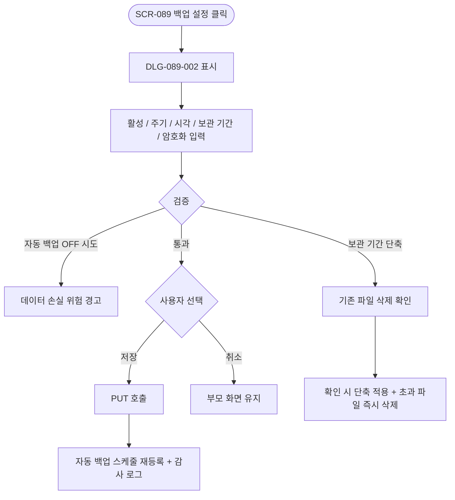
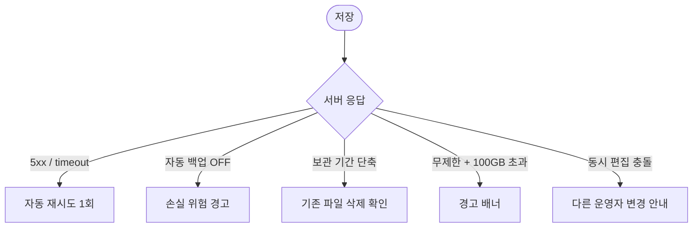

# DLG-089-002 백업 설정 다이얼로그

## 1. 다이얼로그 메타 정보

| 항목 | 값 |
|---|---|
| 작성일 | 2026-05-22 |
| 버전 | v1.0 |
| 도메인 | D09 설정관리 |
| 다이얼로그 ID | DLG-089-002 |
| 다이얼로그명 | 백업 설정 |
| 유형 | 입력 다이얼로그 (Settings Dialog) |
| 우선순위 | P0 |
| 부모 화면 | SCR-089 데이터 백업·복원 |
| 트리거 | [백업 설정] 버튼 클릭 |

## 2. 다이얼로그 개요와 목적

백업 설정 다이얼로그는 SCR-089 데이터 백업·복원에서 자동 백업의 상세 설정(활성 여부·주기·실행 시각·보관 기간·암호화 옵션)을 변경하기 위해 호출되는 입력 모달입니다. 보관 기간을 단축하면 기존 초과 파일이 즉시 삭제되므로 변경 전 확인 모달이 한 단계 더 표시되고, 자동 백업 OFF 시도 시 데이터 손실 위험 경고 모달이 표시됩니다.

## 3. 호출 컨텍스트와 부모 화면

부모 화면 SCR-089의 [백업 설정] 버튼이 트리거입니다. owner와 superAdmin/primary만 호출할 수 있으며, owner는 자기 지점 설정만 편집 가능합니다.

## 4. 레이아웃과 UI 구성

모달 상단에 "자동 백업 설정" 제목이 표시됩니다. 본문에는 다음 항목이 위에서 아래로 배치됩니다.

자동 백업 활성 토글. OFF 시도 시 데이터 손실 위험 경고 모달이 추가로 표시됩니다.

백업 주기 라디오(매일 / 매주 / 매월).

백업 실행 시각 입력(HH:mm). 운영 시간 외 권장.

보관 기간 드롭다운(30일 / 90일 / 180일 / 무제한). 단축 시 기존 초과 파일 즉시 삭제 확인 모달이 표시됩니다.

암호화 옵션 토글(AES-256). 기본 ON 권장.

하단에는 [저장] / [취소] 두 버튼이 배치됩니다.

## 5. 입력 항목 정의

자동 백업 활성 토글은 ON/OFF입니다. OFF 시도 시 추가 경고 모달이 표시됩니다.

백업 주기는 매일·매주·매월 중 라디오 선택입니다.

백업 실행 시각은 HH:mm 형식으로 입력합니다.

보관 기간은 30/90/180일/무제한 중 선택합니다. 무제한 선택 시 누적 스토리지 100GB 초과 시 경고 배너가 발생합니다.

암호화 옵션은 AES-256 ON/OFF 토글로 기본 ON 권장입니다.

## 6. 버튼 액션 정의

[저장] 버튼은 입력 검증 후 `PUT /api/backup/settings` 호출을 실행합니다. 보관 기간 단축 시 백엔드에서 기존 초과 파일을 즉시 삭제하는 트랜잭션이 함께 처리됩니다.

[취소] 버튼은 모달을 닫고 부모 화면에 영향을 주지 않습니다. ESC와 배경 클릭도 동일하게 동작합니다.

## 7. 호출 흐름과 부모 화면 반영

운영자가 [백업 설정]을 누르면 이 모달이 표시됩니다. 설정 변경 후 [저장] 시 자동 백업 스케줄이 갱신되어 다음 백업 시각부터 새 설정이 적용됩니다. 부모 화면의 자동 백업 설정 카드가 새 값으로 갱신됩니다.

## 8. 토스트와 알럿

성공 시 "백업 설정이 저장되었습니다" 토스트가 부모 화면에 표시됩니다. 실패 시 사유와 함께 토스트가 표시됩니다.

확인 팝업은 보관 기간 단축(기존 파일 N건 즉시 삭제) 시, 자동 백업 OFF 시도(데이터 손실 위험)에서 표시됩니다.

## 9. 데이터 흐름과 외부 연동

[저장] 시 `PUT /api/backup/settings` 호출이 실행됩니다. 응답 성공 시 자동 백업 배치 스케줄러가 새 설정으로 다시 등록됩니다.

보관 기간 단축 시 백업 파일 만료 삭제 배치가 즉시 한 번 실행되어 초과 파일이 삭제됩니다. 이력 메타데이터는 유지됩니다.

SCR-097 감사 로그에 actor·type=settings·변경 전후 값·timestamp INSERT됩니다.

NFR-19 알림 센터는 자동 백업 OFF 전환 시 운영자에게 알림을 발송할 수 있습니다(테넌트 정책).

## 10. 다이얼로그 상태와 예외 처리

기본·검증·저장 중·저장 완료·저장 실패·보관 기간 단축 확인·자동 백업 OFF 경고 상태를 가집니다.

예외: 네트워크 오류 자동 재시도 1회 / 보관 기간 30일 미만 입력 시 차단 / 무제한 보관 + 누적 100GB 초과 시 경고 / 동시 편집 충돌.

## 11. 권한별 처리

owner는 자기 지점 백업 설정을 편집 가능합니다(RLS branchId 필터). primary·superAdmin은 전 지점 설정을 편집할 수 있습니다. 매니저 이하는 부모 화면 접근 자체가 차단되어 이 모달을 볼 수 없습니다.

## 12. 메인 흐름

## 13. 에러와 예외 흐름

## 14. 핵심 디자인 요청사항

자동 백업 활성 토글은 OFF 시 강한 경고 색상으로 시선을 끌어 운영자가 손실 위험을 즉시 인지하도록 합니다.

보관 기간 드롭다운에는 "법정 최소 30일" 안내가 옵션 옆에 작게 표시되고, 단축 시도 시 영향 받을 파일 수가 안내됩니다.

암호화 토글은 기본 ON으로 시작하며 보안 강화 안내가 함께 표시됩니다.

## 15. 운영 정책 (이 다이얼로그에 연결된 부분)

자동 백업은 설정된 주기·시각에 자동 실행되며 보관 기간 경과 시 자동 삭제됩니다.

보관 기간 단축 시 기존 초과 파일이 즉시 삭제되며, 변경 전 확인 모달이 필수로 표시됩니다.

자동 백업 OFF는 데이터 손실 위험 경고 모달 확인 후에만 전환 가능합니다.

암호화는 AES-256 적용이 기본 권장입니다. 다운로드 파일도 동일 암호화가 유지됩니다.

스토리지 용량 임계 경고는 누적 백업 크기 100GB 초과 시 경고 배너가 활성됩니다(무제한 보관 정책 재검토 유도).

백업 실행 시각은 서버 UTC 기준으로 저장되며 UI에서는 SET-05 설정 타임존으로 변환 표시됩니다.

이력 메타데이터는 영구 보관됩니다(파일 자체는 보관 기간 후 삭제되더라도 메타는 유지).

감사 로그에는 actor·type=settings·변경 전후 값·timestamp가 INSERT됩니다.

이상의 정책은 이 다이얼로그를 구현·운영하는 사람이 별도 문서 없이 이 한 장만 보면 이해할 수 있도록 풀어 적었습니다.
