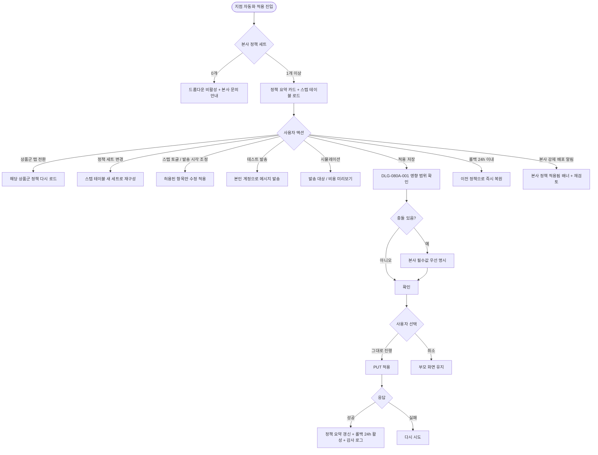
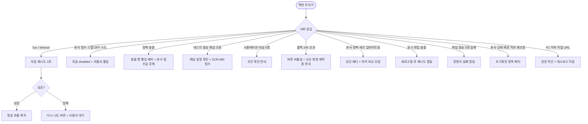

# SCR-080A 지점 자동화 적용 페이지

## 1. 화면 메타 정보

이 문서는 지점 자동화 적용 페이지에 대한 자기완결형 요구사항 정의서입니다. 다른 문서를 함께 보지 않아도 이 문서 한 장만으로 지점 자동화 적용 페이지에 들어가는 모든 영역, 모든 버튼, 모든 모달, 모든 권한, 모든 예외 처리, 그리고 이 화면을 지탱하는 운영 정책까지 전부 이해하고 구현할 수 있도록 작성합니다.

| 항목 | 값 |
|---|---|
| 작성일 | 2026-05-22 |
| 버전 | v1.0 |
| 상태 | 최신 통합본 반영 (정합화 완료) |
| 도메인 | D09 설정관리 |
| 화면 ID | SCR-080A |
| 화면명 | 지점 자동화 적용 |
| 화면 유형 | 정책 적용 화면 (Apply Screen) |
| 라우트 (URL) | `/settings/automation` |
| 플랫폼 | 데스크톱(기본), 태블릿 |
| 우선순위 | P0 (출시 필수) |
| 기능코드 | SET-EXT-01 (지점 자동화 적용) |
| 계약 상태 | 파생 기획 (계약 범위 확장) |
| 부모 기능 prefix | SET |
| Lv1 코드 | SET-EXT-01 |
| Lv2 / Lv3 세분화 | SET-EXT-01-01 ~ SET-EXT-01-08 (정책 요약·상품군 탭·정책 세트 선택·스텝 테이블·테스트 발송·시뮬레이션·적용 저장·롤백) |
| 연계 화면 | SCR-080 센터설정, MKT-02 자동 알림, 본사 정책 라이브러리, SCR-097 감사로그 |
| 호출 다이얼로그 | DLG-080A-001 정책적용확인 |

## 2. 화면 개요와 목적

지점 자동화 적용 페이지는 본사가 등록한 자동화 정책 세트(만료 알림 step 모음)를 지점이 선택해 자신의 운영 환경에 적용하는 화면입니다. 지점은 정책 세트를 새로 만들지 않고 본사가 정의한 표준 정책을 따르되, 본사가 허용한 범위 안에서 스텝 on/off와 채널을 조정합니다. 이 화면은 단순한 토글 리스트가 아니라, 현재 적용 중인 정책을 먼저 요약으로 보여주고, 상품군별 탭 → 정책 세트 드롭다운 → 스텝 테이블이라는 3단 진행을 통해 운영자가 "지금 무엇이 적용 중이며, 무엇으로 바꿀 것인가"를 명확히 인지하도록 설계되었습니다.

운영 흐름은 다양합니다. 신규 오픈 지점은 본사 표준 정책 세트를 선택한 뒤 자기 지점 운영 특성에 맞춰 D+1 후속 안내 스텝을 끄거나 D-7 강조 안내 스텝을 켜고, 테스트 발송으로 본인 휴대폰에서 메시지를 확인한 후 시뮬레이션으로 발송 대상 회원 수와 예상 비용을 미리 확인한 다음 적용 저장합니다. 본사 슈퍼관리자는 전국 프랜차이즈에 동일 정책 세트를 강제 배포해 운영 표준을 통일하고, 지점이 허용 범위 내에서 재조정한 결과를 본사 정책 라이브러리에서 확인합니다. 성수기와 비수기 사이에 정책 세트를 전환할 때, 잘못된 정책을 적용한 직후 24시간 이내 롤백할 때, 본사가 정책 세트를 업데이트했을 때 "정책 세트 업데이트됨" 배너를 통해 재검토를 진행할 때도 모두 이 화면에서 처리됩니다.

핵심 결론은 다음과 같습니다. 첫째, 기존의 고정 `D-30 / D-14 / D-7 / D-3 / D-1` 전제는 사용하지 않습니다. 본사가 step을 자유롭게 정의하고 지점은 그 안에서 선택만 합니다. 둘째, 지점은 본사 정책 템플릿의 본문을 수정하지 않습니다. 셋째, 적용 저장은 즉시 반영되며 이미 큐에 들어간 발송 건은 이전 정책 그대로 진행되고 새 정책은 이후 이벤트부터 적용됩니다. 넷째, 시뮬레이션과 테스트 발송은 내부 계산값이 아니라 메시지 플랫폼 API에서 조회한 예상 비용·발신 프로필·승인 템플릿 상태를 사용합니다.

## 3. 진입 경로와 인접 화면

이 화면에 진입하는 경로는 사이드바의 "설정 > 지점 자동화 적용" 메뉴가 가장 일반적입니다. 메뉴 자체는 owner와 manager에게 노출되며, 본사 슈퍼관리자에게는 추가로 "본사 정책 라이브러리" 메뉴가 함께 보입니다. FC·트레이너·스태프·프런트·readonly는 메뉴 자체가 보이지 않습니다.

두 번째 경로는 알림 센터(NFR-19)에서 "본사 정책 세트가 업데이트되었습니다"라는 알림을 누르는 경우이며, 이때는 화면 진입과 동시에 상단에 "정책 세트 업데이트됨" 배너가 표시되고 현재 적용 중인 세트의 업데이트 내역을 즉시 확인할 수 있도록 안내됩니다.

세 번째 경로는 본사 슈퍼관리자의 강제 배포 직후입니다. 본사가 전국 지점에 새 정책 세트를 강제 배포하면 각 지점 Owner(지점장)·manager에게 "본사 정책이 적용되었습니다"라는 앱 알림이 발송되며, 이 알림을 누르면 이 화면으로 이동합니다.

이 화면에서 빠져나가는 인접 화면으로는 적용 결과가 실제로 발송되는 MKT-02 자동 알림 화면, 본사 슈퍼관리자가 정책 세트를 등록·수정하는 본사 정책 라이브러리, 그리고 모든 정책 변경 이벤트가 기록되는 SCR-097 감사 로그가 있습니다.

## 4. 레이아웃과 UI 구성

지점 자동화 적용 페이지는 위에서 아래로 차곡차곡 쌓이는 세로형 단일 컬럼 레이아웃을 기본으로 하며, 좌우 폭이 충분한 데스크톱 환경을 우선합니다. 태블릿에서는 일부 영역이 가로 스크롤로 전환됩니다.

가장 위에는 페이지 헤더가 있습니다. 헤더 좌측에는 "지점 자동화 적용"이라는 페이지 타이틀과 함께 현재 편집 중인 지점 컨텍스트 배지가 따라옵니다. 본사 슈퍼관리자가 통합 모드에서 진입한 경우 헤더 우측에 지점 선택 드롭다운이 노출되고, 슈퍼관리자가 "전체 지점에 강제 배포"를 시도할 수 있는 별도 버튼이 활성됩니다. 일반 지점 운영자에게는 자기 지점만 표시됩니다. 헤더 가장 우측에는 "롤백" 버튼이 있어 마지막 정책 적용 후 24시간 이내인 경우에만 활성되고, 24시간이 초과되면 비활성 상태로 "롤백 시간 초과" 툴팁이 표시됩니다.

페이지 헤더 바로 아래에는 정책 요약 카드(PolicySummaryCards) 영역이 있습니다. 이 영역은 현재 지점에 적용 중인 정책을 상품군별(이용권·PT·GX·락커)로 요약 카드 형태로 표시하며, 각 카드에는 적용 중인 정책 세트 이름, 활성 스텝 수, 채널 종류 요약(SMS/카톡/푸시), 마지막 적용 일시가 표시됩니다. 카드 우측 상단에는 "본사 업데이트됨" 배지가 표시될 수 있는데, 본사가 정책 세트의 내용을 업데이트했을 때 점등되어 재확인이 필요함을 알립니다.

정책 요약 카드 아래에는 상품군 탭(ScopeTabs)이 있습니다. 이용권 / PT / GX / 락커 네 개의 탭이 옆으로 펼쳐지며, 어느 탭을 선택하느냐에 따라 아래의 정책 세트 드롭다운과 스텝 테이블이 그 상품군 기준으로 바뀝니다. 락커 운영을 하지 않는 지점은 락커 탭이 숨겨질 수 있습니다.

상품군 탭 아래에는 정책 선택 영역(PolicySelector)이 있습니다. "적용할 정책 세트" 드롭다운에는 본사가 등록한 정책 세트 목록이 나열되며, 각 항목 뒤에는 "(기본 권장)", "(성수기 강화)" 같은 부가 라벨이 표시되어 운영자가 어떤 세트가 본사 권장인지 즉시 알 수 있습니다. 본사가 정책 세트를 한 건도 등록하지 않은 경우 드롭다운은 비활성 상태로 "본사에서 등록된 정책 세트가 없습니다. superAdmin / primary에게 문의해주세요" 안내가 표시됩니다.

정책 선택 아래에는 스텝 테이블(StepTable)이 있습니다. 이 테이블은 상품군 × 스텝 × 채널 3단 구조로, 각 행은 본사가 정의한 step(예: D-30 장기 사전 안내, D-7 상담 유도, D-Day 마지막 안내)을 나타내고, 컬럼은 좌측부터 스텝 이름·기준일·채널(SMS/카톡/푸시)·활성 토글·발송 시각·메시지 미리보기·테스트 발송 버튼 순서로 배치됩니다. 본사가 "필수"로 지정한 스텝은 토글이 disabled 상태로 자물쇠 아이콘이 함께 표시되고, 호버 시 "본사 필수 스텝으로 변경 불가"라는 툴팁이 나타납니다. 본사가 "지점 토글 허용"으로 지정한 스텝만 운영자가 ON/OFF 할 수 있습니다. 발송 시각은 본사가 기본값을 정해 두고, 본사가 허용한 경우에 한해 지점이 시각을 조정할 수 있습니다(예: 본사 09:00 → 지점 10:30). 메시지 미리보기는 본사가 등록한 템플릿을 그대로 보여주며 지점에서 본문을 수정하지 않습니다.

스텝 테이블 아래에는 시뮬레이션 패널이 있습니다. 이 패널은 [시뮬레이션] 버튼을 누른 결과를 표시하는 영역으로, 현재 스텝 조합 기준으로 발송 대상 회원 수, 채널별 발송 건수, 예상 발송 시각, 플랫폼 API 기준 예상 비용이 카드 형태로 나열됩니다. 시뮬레이션은 실제 발송이 일어나지 않고 사전 검증 용도로만 사용됩니다.

페이지 최하단에는 액션 풋바가 fixed로 떠 있으며, 좌측에 [시뮬레이션] 버튼, 우측에 [적용 저장] 버튼과 [취소] 버튼이 배치됩니다. 시뮬레이션 버튼은 항상 활성이고, 적용 저장 버튼은 변경이 한 건 이상 있을 때만 활성됩니다. 적용 저장을 누르면 DLG-080A-001 정책 적용 확인이 떠서 영향 범위(대상 회원 수·스텝 수·채널)를 한 번 더 보여준 다음 최종 확정합니다.

본사 슈퍼관리자에게는 페이지 헤더 우측에 "전체 지점에 강제 배포" 버튼이 추가로 보이며, 이 버튼을 누르면 강제 배포 대상 지점 선택과 영향 범위 확인 화면이 별도로 열립니다.

## 5. 탭 구성과 탭별 동작

이 화면의 1차 분기는 상품군 탭입니다. 이용권·PT·GX·락커의 네 개 탭은 각각 다른 정책 세트와 스텝 테이블을 가질 수 있어, 한 지점이 상품군별로 서로 다른 본사 정책 세트를 동시에 적용할 수 있습니다. 예를 들어 이용권은 "표준 정책 세트"를, PT는 "성수기 강화 세트"를 적용하는 식의 조합이 가능합니다.

상품군 탭을 전환할 때는 정책 세트 선택과 스텝 테이블의 상태가 새 상품군 기준으로 다시 fetch되며, 미저장 변경이 있는 경우 DLG-080-001 패턴의 미저장 경고가 표시되어 손실을 막습니다(이 화면에서는 정확히 미저장 경고 모달이 표시되지는 않으나, 상품군 간 변경 사항은 각각 독립적으로 추적되므로 한 상품군의 변경이 다른 상품군으로 넘어갈 때 자동으로 버려지지 않도록 합니다).

락커 운영을 하지 않는 지점은 락커 탭이 숨겨질 수 있으며, 이는 SCR-080 센터 설정의 운영 옵션이 결정합니다. 락커가 없는 지점에서 락커 정책을 정의해도 발송 대상이 0이 되므로 운영상 의미가 없습니다.

## 6. 버튼·아이콘·링크 액션 전체 정의

이 화면에 등장하는 모든 클릭 가능한 요소를 빠짐없이 정의합니다.

페이지 헤더의 지점 컨텍스트 드롭다운은 본사 슈퍼관리자에게만 노출되며, 누르면 편집 가능한 지점 목록이 펼쳐집니다. 다른 지점을 선택하면 그 지점의 정책 요약·스텝 테이블이 다시 fetch되어 표시됩니다.

페이지 헤더 우측의 "롤백" 버튼은 마지막 적용 후 24시간 이내일 때만 활성됩니다. 누르면 "이전 정책으로 되돌리시겠습니까? 적용된 변경은 모두 취소됩니다"라는 확인이 표시되고, 확인하면 즉시 이전 정책 세트와 스텝 조합으로 복원됩니다. 24시간 초과 시에는 버튼이 비활성 상태로 "롤백 시간 초과 — 신규 변경으로 재적용해주세요" 툴팁이 표시됩니다.

본사 슈퍼관리자 전용 "전체 지점에 강제 배포" 버튼은 누르면 배포 대상 지점 선택 화면이 열리고, 거기서 대상 지점과 정책 세트를 확정한 뒤 다시 DLG-080A-001과 같은 영향 범위 확인을 거쳐 일괄 적용됩니다.

정책 요약 카드의 "본사 업데이트됨" 배지는 누르면 본사 정책 세트의 어떤 부분이 변경되었는지 보여주는 차이 비교 모달이 열리고, 운영자가 변경 내역을 확인한 후 재적용 여부를 결정할 수 있습니다.

상품군 탭은 누르면 즉시 그 상품군 기준으로 정책 선택과 스텝 테이블이 다시 로드됩니다.

정책 선택 드롭다운은 누르면 본사가 등록한 정책 세트 목록이 펼쳐지고, 항목을 선택하면 스텝 테이블이 그 정책 세트의 기본 구성으로 다시 그려집니다. 본사가 등록한 정책 세트가 0개일 때는 드롭다운이 비활성됩니다.

스텝 테이블 각 행의 활성 토글은 본사가 허용한 스텝에서만 클릭이 받아들여집니다. 본사 필수 스텝의 토글은 disabled 상태로 자물쇠 아이콘이 함께 보입니다.

스텝 테이블의 발송 시각 칸은 본사가 지점 조정을 허용한 스텝에서만 시각 피커가 활성됩니다. 본사 고정 시각인 경우 회색 톤으로 표시되고 편집이 차단됩니다.

스텝 테이블의 [테스트 발송] 버튼은 누르면 운영자 본인 계정의 등록된 휴대폰·이메일·카카오로 실제 메시지가 발송됩니다. 실제 회원에게는 발송되지 않습니다. 채널 연동이 오류 상태이면 "테스트 발송에 실패했습니다. 채널 설정을 확인해주세요" 토스트가 표시되고 SCR-080 알림설정 탭으로 이동하는 링크가 함께 제공됩니다.

액션 풋바의 [시뮬레이션] 버튼은 누르면 현재 스텝 조합을 기준으로 발송 대상 회원 수·채널별 건수·예상 시각·예상 비용이 계산되어 시뮬레이션 패널에 표시됩니다. 실제 발송은 일어나지 않습니다.

액션 풋바의 [적용 저장] 버튼은 변경이 한 건 이상 있을 때만 활성됩니다. 누르면 DLG-080A-001 정책 적용 확인이 열려 영향 범위를 보여주고, 확정하면 즉시 적용되며 롤백 가능 시간이 24시간으로 설정됩니다.

액션 풋바의 [취소] 버튼은 변경 사항을 마지막 적용 시점으로 되돌리며, 누르기 전에 확인이 한 번 더 표시됩니다.

모든 버튼은 클릭 후 응답이 돌아오기 전까지 자동으로 비활성화되어 중복 요청이 차단됩니다.

## 7. 호출되는 모달 동작

이 화면에서 호출되는 모달은 DLG-080A-001 정책 적용 확인입니다.

### 7-1. DLG-080A-001 정책 적용 확인 다이얼로그

정책 적용 확인 다이얼로그는 운영자가 [적용 저장] 버튼을 눌렀을 때 변경 내용이 실제로 회원 발송에 영향을 미치기 직전에 영향 범위를 한 번 더 보여주고 최종 확인을 받는 모달입니다.

모달 상단에는 "정책을 적용하시겠습니까?"라는 제목이 표시되고, 그 아래에 영향 범위가 카드 형태로 나열됩니다. 카드는 발송 대상 회원 수, 적용 스텝 수, 활성 채널 종류, 본사 필수 스텝과 충돌하는 항목이 있는 경우 충돌 목록이 함께 표시됩니다. 충돌이 있는 경우 빨강 톤의 경고 영역에 "본사 필수 스텝과 다음 항목이 충돌합니다. 본사 필수값으로 강제 해결됩니다"라는 안내가 표시됩니다.

하단에는 [그대로 진행] 버튼과 [취소] 버튼이 있습니다. [그대로 진행]을 누르면 모달이 로딩 상태로 전환되어 백엔드에 적용 요청이 전송됩니다. 성공하면 모달이 닫히고 부모 화면의 정책 요약 카드가 새 정책으로 갱신되며, 헤더의 롤백 버튼이 활성화됩니다. [취소]를 누르면 모달이 즉시 닫히고 부모 화면의 변경 사항은 그대로 유지됩니다.

본사 슈퍼관리자가 강제 배포를 시도하는 경우, 이 모달은 더 큰 영향 범위(여러 지점의 합산 발송 대상)와 함께 표시되며 "전체 지점 강제 배포" 강조 배지가 따라옵니다. 배포 후에는 각 지점의 기존 커스텀 스텝이 초기화되고, 지점은 본사 허용 범위 내에서 다시 조정할 수 있습니다.

## 8. 토스트와 확인 팝업과 알럿

성공 토스트는 우측 상단에 녹색 계열로 "정책이 적용되었습니다", "테스트 발송이 완료되었습니다", "시뮬레이션이 완료되었습니다", "이전 정책으로 롤백되었습니다" 같은 짧은 문구로 표시됩니다.

실패 토스트는 빨강 계열로 "정책 적용에 실패했습니다", "테스트 발송에 실패했습니다", "시뮬레이션에 실패했습니다" 같은 문구와 함께 다시 시도 버튼이 따라옵니다. 네트워크 오류는 1회 자동 재시도 후 사용자 액션을 기다립니다.

상단 배너는 본사가 적용 중인 정책 세트를 업데이트한 경우 "정책 세트 업데이트됨 — 재확인 후 다시 적용해주세요"라는 노랑 톤으로 표시되고, 운영자가 정책 요약 카드의 "본사 업데이트됨" 배지를 누르면 차이 비교 모달이 열립니다.

확인 팝업은 [취소] 버튼을 눌러 모든 변경을 마지막 적용 시점으로 되돌릴 때 한 번 더 표시되며, [롤백] 버튼을 눌렀을 때 이전 정책으로 되돌리는 경우에도 한 번 더 표시됩니다.

알럿은 권한이 없는 계정이 직접 URL로 접근했을 때 차단형으로 표시되며 3초 후 대시보드로 자동 이동됩니다.

## 9. 데이터 흐름과 외부 연동

이 화면은 본사 정책 세트, 메시지 플랫폼, 회원 발송 큐와 연결됩니다.

화면 진입 시 `GET /api/branch-automation/current` 호출로 현재 적용 중인 정책 요약이 내려옵니다. 상품군별 정책 세트 ID와 스텝 조합이 함께 반환되며, 정책 요약 카드와 스텝 테이블에 그대로 표시됩니다.

정책 선택 드롭다운의 옵션은 `GET /api/branch-automation/policy-sets` 호출로 본사가 등록한 정책 세트 목록을 가져옵니다. 각 항목에는 정책명·적용 범위·사용 상태·기본 여부·지점 수정 허용 범위가 포함되어 있어, 화면에서 어떤 스텝이 본사 필수이고 어떤 스텝이 지점 토글 허용인지를 판단합니다.

테스트 발송은 `POST /api/branch-automation/test-send` 호출로 처리되며, 운영자 본인 계정의 휴대폰·이메일·카카오 토큰이 사용됩니다. 실제 회원 DB는 조회되지 않습니다.

시뮬레이션은 `POST /api/branch-automation/simulate` 호출로 처리되며, 현재 스텝 조건과 회원 만료 데이터를 조합해 발송 대상 회원 수·채널별 건수·예상 발송 시각을 계산해 반환합니다. 예상 비용은 메시지 플랫폼 API의 단가 정보를 참조해 계산됩니다.

적용 저장은 `PUT /api/branch-automation/apply` 호출로 처리되며, 응답이 성공하면 그 시점부터 발생하는 만료·결제 이벤트에 새 정책이 적용됩니다. 이미 큐에 들어간 발송 건은 이전 정책 그대로 진행되며 새 정책은 이후 이벤트부터 적용됩니다.

롤백은 `POST /api/branch-automation/rollback` 호출로 처리되며, 마지막 적용 후 24시간 이내일 때만 허용됩니다. 24시간이 초과되면 백엔드에서 거부됩니다.

자동 알림(MKT-02)은 적용된 정책에 따라 발송 큐를 생성하며, 채널별 발송은 메시지 플랫폼(SMS/카톡/푸시 provider)을 통해 처리됩니다. 발송 실패 시 30분 간격으로 최대 3회 재시도되고, 3회 모두 실패하면 운영자에게 알림이 발송됩니다.

본사 슈퍼관리자의 강제 배포는 별도 엔드포인트로 처리되며, 대상 지점들의 정책 요약 카드와 스텝 테이블이 일괄 갱신되고 각 지점 운영자에게 "본사 정책이 적용되었습니다" 앱 알림이 발송됩니다.

본사가 정책 세트를 업데이트한 경우, 그 세트를 적용 중인 지점 화면에 "정책 세트 업데이트됨" 배너가 자동으로 활성되어 재확인을 유도합니다.

모든 정책 변경·롤백 이벤트는 SCR-097 감사 로그에 비동기로 INSERT됩니다. 기록되는 필드는 actor_id, branchId, 변경 전 정책 세트 ID, 변경 후 정책 세트 ID, 스텝 ON/OFF 변경 내역, timestamp입니다.

화면에서 호출하는 주요 API는 `GET /api/branch-automation/current`, `GET /api/branch-automation/policy-sets`, `PUT /api/branch-automation/apply`, `POST /api/branch-automation/test-send`, `POST /api/branch-automation/simulate`, `POST /api/branch-automation/rollback`입니다.

## 10. 화면 상태와 예외 처리

이 화면은 다음 상태들을 가질 수 있습니다.

데이터 미연동 상태는 본사가 정책 세트를 한 건도 등록하지 않은 상태로, 정책 선택 드롭다운이 비활성되고 "superAdmin / primary에게 문의" 안내가 표시됩니다. 스텝 테이블은 빈 상태로 표시되며 적용 저장 버튼은 비활성 상태입니다.

기본 상태는 정책 요약 카드와 스텝 테이블이 모두 채워진 정상 조회 상태입니다. 변경이 없으면 적용 저장 버튼은 비활성이고 롤백 버튼은 마지막 적용 시각에 따라 활성 또는 비활성으로 표시됩니다.

본사 잠금 상태는 본사 필수 스텝과 본사 고정 시각이 적용된 상태로, 스텝 테이블의 해당 행이 자물쇠 아이콘과 함께 비활성 톤으로 표시됩니다.

수정 중 상태는 한 건 이상 변경이 발생한 상태로, 적용 저장 버튼이 활성됩니다.

시뮬레이션 결과 상태는 [시뮬레이션] 버튼을 누른 후 결과 패널이 채워진 상태로, 발송 대상·건수·시각·비용이 카드 형태로 나열됩니다.

저장 중 상태는 액션 풋바 버튼이 비활성되고 스피너가 표시됩니다.

저장 완료 상태는 성공 토스트가 표시되고 롤백 버튼이 활성됩니다(24시간 유효).

정책 충돌 상태는 본사 필수와 지점 조정이 충돌하는 항목이 있는 상태로, 충돌 행에 빨강 배지가 표시되고 DLG-080A-001 모달에서 충돌 목록이 명시됩니다.

본사 정책 세트 없음 상태는 데이터 미연동과 유사하지만, 본사가 정책 세트를 모두 "중지"로 변경한 경우에도 동일하게 표시됩니다.

본사 정책 세트 업데이트됨 상태는 상단 배너가 노랑 톤으로 활성되어 재확인을 유도합니다.

권한 부족 상태는 FC 이하 계정이 직접 URL로 접근한 경우로, 차단 화면과 함께 대시보드로 자동 이동됩니다.

예외 케이스별 처리는 다음과 같습니다.

본사 필수 스텝을 OFF로 시도하면 토글 자체가 disabled 상태로 클릭이 받아들여지지 않고 자물쇠 툴팁이 표시됩니다.

본사 정책 세트가 0개인 경우 정책 선택 드롭다운이 비활성되고 안내가 표시됩니다.

정책 충돌이 감지되면 충돌 행에 빨강 배지가 표시되고 DLG-080A-001 저장 확인 모달에서 충돌 목록이 함께 표시됩니다. 본사 필수값이 우선 적용됨이 명시됩니다.

테스트 발송 채널 오류는 "테스트 발송에 실패했습니다 — 플랫폼 연동 상태 확인" 토스트와 함께 SCR-080 알림설정 탭 링크가 제공됩니다.

시뮬레이션 결과 발송 대상 회원 수가 0인 경우 "발송 대상이 없습니다 — 정책 조건을 확인해주세요" 안내가 표시되어 운영자가 정책을 다시 검토하도록 유도합니다.

적용 저장 중 네트워크 오류가 발생하면 "저장 실패" 토스트가 표시되고 부모 화면의 변경 사항은 그대로 유지됩니다. 백엔드 응답이 도착하기 전에 운영자가 페이지를 떠나면 백엔드 처리는 그대로 진행되지만 UI 상태는 새로고침 후 확인 가능합니다.

롤백 24시간 초과 시 롤백 버튼이 비활성 상태로 "롤백 시간 초과" 툴팁이 표시되고, 운영자는 신규 변경으로 다시 적용해야 합니다.

본사가 정책 세트를 업데이트한 경우 "정책 세트 업데이트됨" 배너가 활성되고 운영자가 차이 비교를 확인한 후 재적용을 결정할 수 있습니다.

동시 편집 충돌이 감지되면 "다른 운영자가 변경했습니다 — 새로고침 후 재시도" 알림이 표시됩니다.

채널 발송이 3회 모두 실패하면 발송 실패 건이 운영자에게 알림으로 표시되고 수동 재발송 또는 채널 점검이 안내됩니다.

본사 슈퍼관리자가 강제 배포한 직후 지점이 재조정을 시도하면 "본사 강제 배포로 초기화된 항목" 배지가 해당 행에 표시되고 허용 범위 내에서만 재조정이 가능합니다.

권한이 부족한 계정이 화면에 접근하면 차단되며, FC 이하는 메뉴 자체가 보이지 않습니다.

## 11. 권한별 처리

이 화면은 본사와 지점의 권한이 명확히 분리됩니다.

superAdmin와 primary는 모든 기능을 사용할 수 있습니다. 정책 세트 등록·수정은 본사 정책 라이브러리 화면에서 별도로 진행하지만, 이 화면에서는 지점 적용을 슈퍼관리자가 대행하거나 강제 배포할 수 있습니다. 지점 컨텍스트 드롭다운이 노출되어 다른 지점의 정책을 직접 편집하거나 일괄 배포할 수 있습니다.

Owner(지점장)과 매니저(manager)는 자기 지점의 정책 적용을 수행할 수 있습니다. 본사가 등록한 정책 세트 중에서 선택하고, 본사가 허용한 스텝의 ON/OFF와 발송 시각만 조정합니다. 테스트 발송과 시뮬레이션을 통해 사전 검증한 뒤 적용 저장을 진행하며, 24시간 이내 롤백이 가능합니다. 본사가 강제 배포한 직후에는 일부 항목이 초기화되어 있어 다시 조정해야 할 수 있습니다.

FC(fc), 트레이너(trainer), 스태프(staff), 프런트(front), 읽기 전용(readonly)은 이 화면 자체에 접근할 수 없습니다. 사이드바에 메뉴가 보이지 않으며 직접 URL 접근도 차단됩니다.

권한이 부족한 액션이 차단된 경우의 사용자 경험은 일관됩니다. 메뉴 자체 숨김, 본사 필수 스텝의 자물쇠 표시, 본사 고정 시각의 회색 톤, 직접 URL 접근 시 403 응답과 권한 안내가 단계별로 적용됩니다. 모든 권한 차단 이벤트는 감사 로그에 기록됩니다.

## 12. 메인 흐름

## 13. 에러와 예외 흐름

## 14. 핵심 디자인 요청사항

이 화면이 운영자에게 잘 작동하려면 다음 디자인 원칙이 시각적으로 명확히 드러나야 합니다.

정책 요약 카드는 4개의 상품군(이용권·PT·GX·락커)이 동일 크기·동일 그리드로 나열되어 한눈에 비교 가능해야 합니다. 카드 안에는 현재 적용 정책명, 활성 스텝 수, 채널 요약이 큰 글자와 보조 라벨로 위계 있게 배치되며, "본사 업데이트됨" 배지는 카드 우측 상단에 강한 톤으로 표시되어 즉시 인식 가능해야 합니다.

상품군 탭은 좌측에 강조 색상이 들어가 어느 탭이 활성인지 멀리서도 보이고, 락커 탭이 숨겨진 지점에서는 탭 자체가 보이지 않아 운영 혼란을 줄입니다.

스텝 테이블은 행 단위로 본사 필수와 지점 조정 가능이 시각적으로 구분되어야 합니다. 본사 필수 행은 자물쇠 아이콘과 함께 회색 톤이 적용되고, 지점 조정 가능 행은 활성 토글이 또렷한 색상으로 표시됩니다. 정책 충돌이 있는 행은 빨강 배지와 함께 본문 톤도 빨강 계열로 강조되어 운영자가 즉시 알아볼 수 있어야 합니다.

시뮬레이션 패널은 스텝 테이블 아래에 별도 카드 그리드로 배치되어 발송 대상·건수·시각·비용이 한눈에 들어오며, 시뮬레이션 결과 0명일 때는 빈 상태 일러스트와 함께 정책 재검토 안내가 표시됩니다.

액션 풋바는 페이지 최하단에 fixed로 떠 있어 스크롤해도 보이며, [적용 저장] 버튼은 변경이 있을 때 강한 활성 색상으로 강조됩니다. [롤백] 버튼은 헤더 우측 끝에 별도 배치되어 일반 저장 흐름과 시각적으로 분리됩니다.

본사 슈퍼관리자의 "전체 지점에 강제 배포" 버튼은 일반 운영자 화면에서는 보이지 않으며, 슈퍼관리자 화면에서만 강한 강조 색상으로 표시되어 잘못 누르지 않도록 디자인됩니다.

## 15. 운영 정책 (이 화면에 연결된 부분)

본사와 지점의 정책 운영 구조는 명확히 분리됩니다. 본사는 정책 세트(만료 알림 step 모음)를 등록하고 각 step의 필수/권장/선택 여부, 지점 토글 허용 여부, 본사 고정 시각 여부를 정의합니다. 지점은 본사가 등록한 세트만 선택해 적용하며, 본사가 허용한 범위 안에서만 스텝 ON/OFF와 채널을 조정합니다. 지점은 새 정책 세트를 만들지 않고, 본사 정책 템플릿의 본문을 수정하지 않습니다.

고정 D-day UI(D-30/D-14/D-7 등) 전제는 사용하지 않습니다. 본사가 운영 전략에 따라 step을 자유롭게 정의하며, 표준형(D-30/D-20/D-7/D-3/D-1)·집중형(D-20/D-10/D-3/D-1)·최소형(D-7/D-1) 같은 다양한 조합이 정책 세트별로 등록됩니다. 지점 화면은 정책 스텝 리스트 UI로 설계되어, 본사가 등록한 step을 그대로 표시합니다.

본사 필수 스텝은 지점에서 OFF 할 수 없으며, 토글이 disabled 상태로 자물쇠 아이콘이 표시됩니다. 지점이 OFF 가능한 스텝은 본사가 "지점 토글 허용"으로 설정한 항목만 해당됩니다. 본사 고정 시각인 step은 지점이 발송 시각을 조정할 수 없으며 회색 톤으로 표시됩니다.

정책 충돌(지점 조정값과 본사 필수값 충돌)이 발생하면 본사 필수값이 우선 적용됩니다. 저장 전 충돌 목록은 DLG-080A-001에서 명시되며, 운영자가 확인한 후 진행합니다.

시뮬레이션은 적용 전 사전 검증 용도로만 사용되며 실제 발송이 일어나지 않습니다. 발송 대상 회원 수·채널별 발송 건수·예상 발송 시각·예상 비용은 메시지 플랫폼 API 기준으로 계산되며, 비용 정보는 참고용 조회값으로만 노출됩니다(관리자에서 단가를 직접 수정하지 않음).

테스트 발송은 운영자 본인 계정(등록 휴대폰·이메일·카카오)으로만 발송되며 실제 회원에게는 발송되지 않습니다. 본인 수신 결과로 메시지 외형과 전달 가능성을 사전 확인합니다.

적용 즉시 반영 범위는 저장 직후 발생하는 만료·결제 이벤트부터입니다. 이미 큐에 들어간 발송 건은 이전 정책 그대로 진행되며, 새 정책은 이후 이벤트부터 적용됩니다. 이는 발송 큐의 일관성을 보장하기 위한 정책입니다.

롤백 정책은 정책 적용 후 24시간 이내에만 이전 정책으로 즉시 복구할 수 있도록 합니다. 24시간 초과 시에는 신규 변경으로 재적용해야 하며, 롤백 이력은 감사 로그에 기록됩니다.

본사 슈퍼관리자의 강제 배포는 전사 정책 통일을 위한 도구입니다. 강제 배포 후 기존 지점별 커스텀 스텝은 초기화되며, 지점은 본사가 허용한 범위 내에서 다시 조정할 수 있습니다. 강제 배포 직후 각 지점에는 "본사 정책이 적용되었습니다" 알림이 발송되고, 영향 받은 항목에 "초기화된 항목" 배지가 표시됩니다.

본사가 정책 세트를 업데이트한 경우, 그 세트를 적용 중인 지점 화면에 "정책 세트 업데이트됨" 배너가 활성됩니다. 이는 본사 변경이 지점에 자동 반영되지 않고, 지점이 재확인 후 재적용해야 함을 의미합니다(자동 덮어쓰기 차단).

발송 채널은 SMS·카톡(알림톡)·앱 푸시 세 가지이며 채널별 단가가 발생합니다. 메시지 플랫폼 API에서 단가를 조회하며, 관리자에서 단가를 직접 수정하지 않습니다. 발송 실패 시 30분 간격 최대 3회 재시도되며, 3회 모두 실패하면 운영자에게 발송 실패 알림이 발송됩니다.

만료 기준 계산은 실제 조정된 만료일을 따릅니다. 홀딩이 있으면 홀딩 반영 후 만료일로 재계산되고, 환불·취소로 종료된 이용권은 알림 대상에서 제외되며, 이미 재등록이 완료된 회원은 이전 이용권 기준 알림이 중단됩니다.

수신 동의가 없는 채널은 자동으로 발송 대상에서 제외됩니다. 동일 회원에게 같은 날 중복 성격의 알림이 많이 누적되면 묶음 처리 정책이 적용되어 발송 빈도가 조절됩니다. 담당 FC가 없는 회원의 후속 액션은 지점 공용 큐로 보내집니다.

권한 정책은 Owner(지점장)·manager가 자기 지점의 적용을 수행하고, primary/superAdmin이 본사 정책 등록과 강제 배포를 담당하며, FC 이하는 화면 자체에 접근할 수 없도록 설정됩니다. 본사 정책 등록 권한과 지점 적용 권한이 분리되어 있어 운영 책임이 명확히 나뉩니다.

감사 로그에는 정책 변경·롤백·강제 배포·테스트 발송 결과가 모두 INSERT되며, 5초 안에 SCR-097에서 조회 가능합니다. 기록되는 필드는 actor_id·branchId·변경 전 정책 세트 ID·변경 후 정책 세트 ID·스텝 ON/OFF 변경 내역·timestamp입니다.

이상의 모든 정책은 이 화면을 구현하고 운영하는 사람이 별도 문서 없이 이 한 장만 보면 이해할 수 있도록 풀어 적었습니다. 정책이 바뀌면 이 문서가 함께 갱신되어야 하며, 코드 변경과 정책 변경은 항상 짝지어 진행됩니다.
