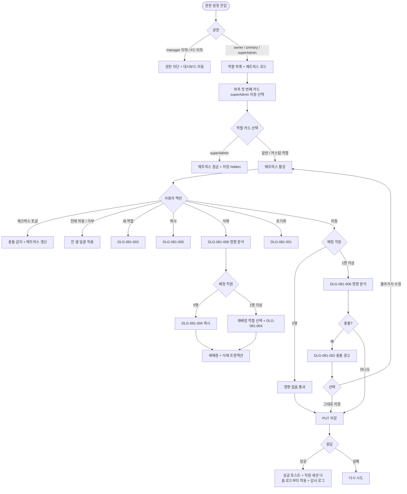
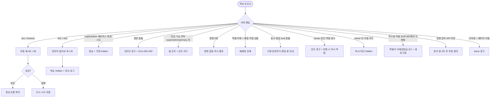

# SCR-081 권한 설정 페이지

## 1. 화면 메타 정보

이 문서는 권한 설정 페이지에 대한 자기완결형 요구사항 정의서입니다. 다른 문서를 함께 보지 않아도 이 문서 한 장만으로 권한 설정 페이지에 들어가는 모든 영역, 모든 버튼, 모든 모달, 모든 권한, 모든 예외 처리, 그리고 이 화면을 지탱하는 운영 정책까지 전부 이해하고 구현할 수 있도록 작성합니다.

| 항목 | 값 |
|---|---|
| 작성일 | 2026-05-22 |
| 버전 | v1.0 |
| 상태 | 최신 통합본 반영 (정합화 완료) |
| 도메인 | D09 설정관리 |
| 화면 ID | SCR-081 |
| 화면명 | 권한 설정 |
| 화면 유형 | 허브 화면 (Hub Screen) |
| 라우트 (URL) | `/settings/permissions` |
| 플랫폼 | 데스크톱(기본), 태블릿 |
| 우선순위 | P0 (출시 필수) |
| 기능코드 | SET-02 (권한 설정), AUTH-03, AUTH-04, CTR-05 |
| 계약코드 | AUTH-03, AUTH-04, CTR-05, SET-02 |
| 계약 상태 | 계약 범위 본기능 |
| 부모 기능 prefix | SET |
| Lv1 코드 | SET-02 |
| Lv2 / Lv3 세분화 | SET-02-01 ~ SET-02-10 (역할 목록·권한 매트릭스·권한 변경·민감 기능·역할 생성·복사·삭제·영향 분석·초기화·저장) |
| 연계 화면 | SCR-087 커스텀 역할 생성, SCR-060 직원 관리, SCR-097 감사로그 |
| 호출 다이얼로그 | DLG-081-001 권한초기화, DLG-081-002 충돌경고, DLG-081-003 역할생성, DLG-081-004 역할삭제, DLG-081-005 역할복사, DLG-081-006 역할영향분석 |

## 2. 화면 개요와 목적

권한 설정 페이지는 관리자 웹에서 사용하는 모든 권한 템플릿(역할)을 한 화면에서 조정하는 RBAC 운영의 중심 화면입니다. 좌측에는 기본 제공 7종 권한 템플릿(superAdmin·primary·owner·manager·fc·staff·readonly)과 SCR-087에서 생성한 커스텀 역할이 카드 형태로 펼쳐지고, 우측에는 선택한 역할의 9개 메뉴 그룹(회원·수업·매출·상품·직원·급여·시설·메시지·설정) × 5종 권한(접근·조회·생성·수정·삭제) 매트릭스가 표시됩니다. 각 직원은 로그인 계정과 1:1로 연결되며, 그 로그인 계정은 정확히 하나의 권한 템플릿을 가져야 합니다. 트레이너·골프강사·프런트 같은 직무값은 직원 관리 화면(SCR-060)에서 별도로 관리되며 이 화면의 좌측 패널에는 노출되지 않습니다.

운영 흐름은 매우 다양합니다. 신규 매니저를 영입한 직후 본사 슈퍼관리자가 매니저 역할의 회원 영구 삭제·환불 권한이 비활성인지 점검하고, 사고가 발생한 직후 owner가 특정 역할의 위험 메뉴를 일괄 거부 처리해 즉시 권한을 잠그며, 본사 정책 변경에 따라 환불 권한을 owner로 한정하기 전 DLG-081-006 영향 분석에서 영향 직원 12명을 확인한 다음 진행합니다. 신규 메뉴 그룹을 출시할 때 owner·manager에 [전체 허용]로 한꺼번에 부여하고, "삭제 있는데 수정 없음" 같은 모순을 DLG-081-002 충돌 경고로 정리한 뒤 저장하며, 잘못 변경한 권한은 DLG-081-001 초기화로 마지막 저장 시점으로 복원합니다. 역할을 삭제할 때는 DLG-081-006에서 영향 직원과 담당 회원을 확인하고 DLG-081-004로 다른 역할에 일괄 재배정한 후 삭제합니다.

권한 변경은 운영 안전이 핵심이므로, 배정 직원이 한 명이라도 있으면 저장 직전에 DLG-081-006 영향 분석이 강제로 표시되어 운영자가 변경 영향을 한 번 더 확인하도록 보장합니다. 6종 민감 기능(회원 영구 삭제·환불 처리·급여 확정·슈퍼관리자 권한 부여/회수·데이터 복원·감사로그 내보내기)은 superAdmin/primary 외 역할에 부여되면 인라인 강조 표시와 별도 강조 카드가 함께 노출됩니다. 모든 변경은 SCR-097 감사 로그에 actor·역할 ID·변경 전후 스냅샷이 INSERT되며, 배정된 직원의 활성 세션은 다음 페이지 로드부터 신규 권한이 적용됩니다.

## 3. 진입 경로와 인접 화면

권한 설정 페이지에 진입하는 경로는 사이드바의 "설정 > 권한 설정" 메뉴가 가장 일반적입니다. 메뉴는 owner와 superAdmin/primary에게만 노출되며, 매니저 이하 계정에는 보이지 않습니다.

두 번째 경로는 SCR-087 커스텀 역할 생성 화면에서 새 역할을 만든 직후 "권한 설정에서 매트릭스를 편집하시겠습니까?" 안내를 누르는 경우입니다. 이때는 새로 생성한 커스텀 역할이 좌측 패널에서 자동 선택된 상태로 진입합니다.

세 번째 경로는 SCR-060 직원 관리 화면에서 직원 상세의 "권한 변경" 링크를 누르는 경우입니다. 그 직원이 현재 배정된 역할이 좌측에서 자동 선택되어 권한 점검이 빠르게 이뤄지도록 설계되었습니다.

네 번째 경로는 감사 로그(SCR-097)의 권한 변경 이력 행을 누르는 경우이며, 변경된 역할이 좌측에서 자동 선택되어 변경 후 상태를 즉시 확인할 수 있습니다.

이 화면에서 빠져나가는 인접 화면으로는 새 역할을 별도로 만드는 SCR-087, 권한 매트릭스를 그 직원에게 실제 적용하는 SCR-060, 모든 권한 변경이 기록되는 SCR-097이 있습니다.

## 4. 레이아웃과 UI 구성

권한 설정 페이지는 좌우 2단 분할 레이아웃을 기본으로 합니다. 좌측에는 역할 목록 패널이 30% 폭으로 고정되어 있고, 우측에는 권한 매트릭스 패널이 70% 폭을 차지합니다. 태블릿에서는 좌측 패널이 가로로 펼쳐지고 우측 매트릭스가 그 아래에 배치되는 1단 레이아웃으로 자동 전환됩니다.

가장 위에는 페이지 헤더가 있습니다. 헤더 좌측에는 "권한 설정"이라는 페이지 타이틀과 함께 현재 편집 컨텍스트(본사 통합 또는 특정 지점)가 표시됩니다. 헤더 우측에는 두 개의 액션 버튼이 있는데, 좌측은 [초기화] 버튼으로 DLG-081-001을 호출해 마지막 저장 상태로 복원하고, 우측은 [변경 사항 저장] 버튼으로 변경이 있을 때만 활성됩니다. 본사 슈퍼관리자가 통합 모드에서 진입한 경우 헤더에 지점 컨텍스트 드롭다운이 추가로 표시됩니다.

좌측 역할 목록 패널의 가장 위에는 [+ 새 역할] 버튼이 있고 그 아래로 카드들이 위에서 아래로 나열됩니다. 카드 순서는 위에서부터 superAdmin, primary, owner, manager, fc, staff, readonly의 7종 기본 템플릿이 먼저 표시되고, 그 아래에 SCR-087에서 만든 커스텀 역할이 생성 순서대로 따라옵니다. 각 카드에는 역할 이름·짧은 설명·배정 직원 수·연결된 로그인 계정 수가 표시되며, 카드 우측에는 [복사] / [삭제] 아이콘 액션이 호버 시 노출됩니다. superAdmin 카드는 시스템 역할로 잠금 표시되어 [복사]만 가능하고 [삭제]는 비활성됩니다. 카드 선택은 클릭으로 이뤄지며, 선택된 카드는 우측 강조 색상이 들어와 시각적으로 명확히 구분됩니다.

우측 권한 매트릭스 패널은 9 메뉴 그룹 × 5 권한의 큰 표 형태입니다. 행은 메뉴 그룹(회원·수업·매출·상품·직원·급여·시설·메시지·설정)이고 열은 권한 종류(접근·조회·생성·수정·삭제)입니다. 각 셀에는 체크박스가 있어 활성/비활성을 토글할 수 있습니다. 매트릭스 상단에는 [전체 허용] / [전체 거부] 버튼이 있어 전 셀을 한 번에 활성 또는 비활성으로 바꿀 수 있고, 그 옆에는 권한 충돌 감지 결과가 작은 경고 영역으로 표시됩니다.

매트릭스 본문 중에서 6종 민감 기능(회원 영구 삭제·환불 처리·급여 확정·슈퍼관리자 권한 부여/회수·데이터 복원·감사로그 내보내기)에 해당하는 셀에는 별도의 강조 아이콘이 함께 표시됩니다. superAdmin과 primary 외의 역할에서 이 민감 기능이 체크되면 해당 셀의 색상이 강한 톤으로 변경되어 사용자에게 시각적 경고를 줍니다.

권한 매트릭스 패널 좌측 상단에는 현재 선택된 역할의 이름·설명·배정 직원 수·연결 로그인 계정 수가 다시 한번 요약 표시되어, 운영자가 어떤 역할을 편집 중인지 항상 인지하도록 합니다. superAdmin이 선택된 상태에서는 매트릭스 전체가 잠금 표시(자물쇠 아이콘 + 회색 톤)로 보이고, 모든 체크박스가 비활성 상태로 표시되며, 저장 버튼은 hidden 처리됩니다.

페이지 최하단에는 액션 풋바가 fixed로 떠 있어 페이지를 스크롤해도 보이며, 좌측에 "저장되지 않은 변경 사항이 있습니다" 안내 배지(변경 시에만), 우측에 [초기화] / [변경 사항 저장] 버튼이 배치됩니다.

## 5. 탭 구성과 탭별 동작

이 화면은 별도의 탭 구조 없이 좌측 패널의 역할 카드 선택이 1차 분기 역할을 합니다. 좌측에서 카드를 누르면 우측 매트릭스가 그 역할 기준으로 다시 fetch되어 표시됩니다. 미저장 변경이 있는 상태에서 다른 역할 카드를 누르면 미저장 경고가 표시되어 변경 손실을 막습니다.

역할 카드 목록의 정렬은 기본 템플릿 7종(superAdmin → primary → owner → manager → fc → staff → readonly)이 먼저 표시되고 그 아래에 커스텀 역할이 생성 순서대로 따라오는 고정 정렬이 적용됩니다. 운영자가 정렬 순서를 변경할 수는 없습니다.

본사 슈퍼관리자가 통합 모드에서 다른 지점을 선택하면, 그 지점에 적용되는 권한 템플릿과 커스텀 역할이 좌측 패널에 다시 로드됩니다. owner는 자기 지점 외의 역할에 접근할 수 없으므로 RLS branchId 필터로 카드가 차단됩니다.

## 6. 버튼·아이콘·링크 액션 전체 정의

이 화면에 등장하는 모든 클릭 가능한 요소를 빠짐없이 정의합니다.

페이지 헤더의 [초기화] 버튼은 DLG-081-001 권한 초기화 다이얼로그를 호출합니다. 운영자가 확인하면 현재 편집 중인 역할의 권한이 마지막 저장 시점으로 복원되고, 진행 중인 미저장 변경은 폐기됩니다.

페이지 헤더의 [변경 사항 저장] 버튼은 변경이 한 건 이상 있을 때만 활성됩니다. 누르면 배정 직원이 1명 이상인 경우 DLG-081-006 영향 분석이 먼저 표시되고, 충돌이 감지된 경우 DLG-081-002 충돌 경고가 추가로 표시된 후 최종 저장이 진행됩니다. 배정 직원이 0명이면 영향 분석에서 "영향 없음" 안내가 표시되고 즉시 통과됩니다.

좌측 패널의 [+ 새 역할] 버튼은 DLG-081-003 역할 생성 다이얼로그를 호출합니다. 이름과 설명을 입력하고 복사 베이스를 선택한 후 생성하면, 좌측 패널 하단에 새 카드가 추가되고 우측 매트릭스가 그 역할로 자동 전환됩니다. 새 역할 생성은 SCR-087에서도 가능하므로 두 화면이 동일한 데이터 소스를 공유합니다.

각 카드의 [복사] 아이콘은 DLG-081-005 역할 복사 다이얼로그를 호출합니다. 새 이름을 입력하고 확정하면 권한 매트릭스가 그대로 복사된 새 역할이 좌측 패널에 추가됩니다. 배정 직원은 복사되지 않습니다.

각 카드의 [삭제] 아이콘은 DLG-081-006 영향 분석을 먼저 호출합니다. 배정 직원이 0명이면 즉시 DLG-081-004 역할 삭제 확인으로 진행되고, 배정 직원이 1명 이상이면 재배정 역할을 선택한 후에야 DLG-081-004로 진행됩니다. superAdmin 카드는 삭제할 수 없으므로 아이콘이 hidden 처리됩니다.

좌측 카드 클릭은 우측 매트릭스를 그 역할 기준으로 다시 로드합니다. 미저장 변경이 있는 경우 미저장 경고가 먼저 표시됩니다.

우측 매트릭스의 각 체크박스는 클릭으로 활성/비활성을 토글하며, 누른 즉시 충돌 감지가 실행되어 매트릭스 상단의 경고 영역에 충돌 항목이 표시될 수 있습니다. 6종 민감 기능 셀은 클릭 시 셀 색상이 강한 톤으로 변경되어 시각적 경고가 표시됩니다.

매트릭스 상단의 [전체 허용] 버튼은 9 메뉴 그룹 × 5 권한의 모든 셀을 활성화합니다. superAdmin이 선택된 상태에서는 이 버튼이 비활성됩니다. 누르면 충돌이 자동으로 해소되지는 않으므로, 운영자는 의도적으로 일부 권한을 다시 비활성화해 정합성을 맞춰야 합니다.

매트릭스 상단의 [전체 거부] 버튼은 모든 셀을 비활성화합니다. owner가 본인이 속한 역할에서 [전체 거부]를 시도하면 "본인 권한이 박탈됩니다" 강조 경고가 표시되고 진행 여부를 한 번 더 확인합니다.

본사 슈퍼관리자에게 노출되는 지점 컨텍스트 드롭다운은 다른 지점의 역할 카드를 불러오는 데 사용됩니다.

페이지 최하단 액션 풋바의 [초기화] 버튼과 [변경 사항 저장] 버튼은 헤더의 동일 버튼과 같은 동작을 수행합니다.

모든 버튼은 클릭 후 응답이 돌아오기 전까지 자동으로 비활성화되어 중복 요청이 차단됩니다.

## 7. 호출되는 모달 동작

이 화면에서 호출되는 모달은 여섯 가지이며, 각각 어떤 트리거로 열리고, 어떤 입력을 받고, 확인/취소를 누르면 부모 화면에서 어떤 변화가 일어나는지가 모두 달라집니다.

### 7-1. DLG-081-001 권한 초기화

권한 초기화 다이얼로그는 운영자가 [초기화] 버튼을 눌렀을 때 진행 중인 미저장 변경을 모두 폐기하고 마지막 저장 시점으로 복원하기 전에 최종 확인을 받는 모달입니다. 모달 상단에 "변경 사항을 마지막 저장 상태로 되돌리시겠습니까?" 제목과 함께 현재 미저장 변경 요약이 표시됩니다. 확인 시 모달이 닫히고 우측 매트릭스가 마지막 저장 상태로 즉시 갱신됩니다. 취소 시 모달만 닫히고 부모 화면은 그대로 유지됩니다.

### 7-2. DLG-081-002 충돌 경고

충돌 경고 다이얼로그는 권한 매트릭스에 충돌이 감지된 상태(예: 삭제 활성·수정 비활성, 생성 활성·접근 비활성, 수정 활성·조회 비활성 등 6종 패턴)에서 운영자가 저장을 시도할 때 추가 확인을 받는 모달입니다. 모달 본문에 충돌 항목 목록이 행 단위로 표시되며, 각 행에 메뉴 그룹과 충돌 사유가 함께 설명됩니다. 하단에는 [그대로 저장]과 [돌아가서 수정] 두 버튼이 있으며, [그대로 저장]을 선택하면 충돌을 무시하고 저장이 진행되고, [돌아가서 수정]을 선택하면 모달이 닫히고 운영자는 매트릭스에서 충돌을 직접 수정할 수 있습니다.

### 7-3. DLG-081-003 역할 생성

역할 생성 다이얼로그는 좌측 패널의 [+ 새 역할] 버튼으로 호출됩니다. 이름·설명·복사 베이스(선택)를 입력하고 확정하면 새 역할이 생성되어 좌측 패널 하단에 카드로 추가되고, 우측 매트릭스가 그 역할로 자동 전환됩니다. 이름은 1~30자 필수이며 기본 7종 역할명과 동일 지점 내 커스텀 역할명 중복은 차단됩니다. 복사 베이스를 선택하면 그 역할의 매트릭스가 그대로 새 역할에 복사됩니다.

### 7-4. DLG-081-004 역할 삭제

역할 삭제 다이얼로그는 카드의 [삭제] 아이콘 → DLG-081-006 영향 분석 → 재배정 역할 선택(필요 시) → 이 다이얼로그 순서로 최종 단계에 호출됩니다. 모달 상단에 "역할 '{이름}'을 삭제하시겠습니까?" 제목이 표시되고, 본문에 배정 직원이 어느 역할로 재배정되는지 요약이 표시됩니다. 확인 시 재배정 트랜잭션과 삭제가 함께 처리되고, 좌측 패널에서 그 카드가 사라집니다.

### 7-5. DLG-081-005 역할 복사

역할 복사 다이얼로그는 카드의 [복사] 아이콘으로 호출됩니다. 새 이름을 입력하고 확정하면 권한 매트릭스가 그대로 복사된 새 역할이 좌측 패널에 추가됩니다. 배정 직원은 복사되지 않으며 새 역할의 배정 직원 수는 0으로 시작합니다. 이름 중복 검증은 DLG-081-003과 동일하게 적용됩니다.

### 7-6. DLG-081-006 역할 영향 분석

역할 영향 분석 다이얼로그는 권한 변경 저장 전 또는 역할 삭제 전에 영향 범위를 한 번 더 확인하기 위한 모달입니다. 모달 본문에는 배정 직원 수, 담당 회원 합계, 영향 직원 목록(5명 미리보기 + 더보기), before/after 권한 차이가 표시됩니다. 영향 직원이 0명이면 "영향 없음" 안내와 함께 [그대로 진행] 버튼이 즉시 활성되어 빠르게 통과할 수 있습니다. 영향 직원이 1명 이상이면 [그대로 진행] 또는 [돌아가서 수정] 중 하나를 선택해야 합니다. 이 다이얼로그는 예측·시뮬레이션 리포트가 아니라 저장 전 확인 안내이며, 별도 시뮬레이션 분석은 포함하지 않습니다.

각 다이얼로그의 상세 동작은 해당 다이얼로그 문서에서 자기완결로 다시 정의되며, 이 화면의 책임은 정확한 트리거와 결과 반영에 한정됩니다.

## 8. 토스트와 확인 팝업과 알럿

성공 토스트는 우측 상단에 녹색 계열로 3초 동안 표시되며, "권한이 저장되었습니다", "역할이 생성되었습니다", "역할이 복사되었습니다", "역할이 삭제되었습니다", "권한이 초기화되었습니다" 같은 짧은 문구로 결과를 알려줍니다.

실패 토스트는 빨강 계열로 "저장에 실패했습니다", "역할 생성에 실패했습니다", "역할 삭제에 실패했습니다" 같은 문구와 함께 다시 시도 버튼이 따라옵니다. 충돌·민감 기능·동시 편집 같은 서버 검증 실패는 사유와 함께 표시됩니다.

인라인 경고는 매트릭스 상단의 충돌 감지 영역에서 실시간으로 표시됩니다. 충돌 패턴은 6종(삭제↔수정, 생성↔접근, 수정↔조회 등)이며, 각 충돌이 어느 메뉴 그룹에서 발생했는지가 함께 표시됩니다.

확인 팝업은 owner가 본인 역할의 권한을 회수할 때 "본인 권한이 박탈됩니다. 진행하시겠습니까?" 형태로 한 번 더 표시됩니다. 진행 시 즉시 적용되어 운영자 본인이 그 자리에서 권한이 박탈될 수 있습니다.

알럿은 권한이 없는 계정이 직접 URL로 접근했을 때 차단형으로 표시되며 3초 후 대시보드로 자동 이동됩니다.

동시 편집 충돌(다른 운영자가 같은 역할을 편집 중)은 모달 형태로 "다른 운영자가 편집 중입니다. 새로고침 후 재시도해주세요" 안내가 표시되며 진입 시 30초 lock이 자동으로 획득됩니다.

## 9. 데이터 흐름과 외부 연동

화면 진입 시 `GET /api/permissions/roles` 호출로 좌측 패널의 모든 역할 카드 데이터가 한 번에 내려옵니다. 각 카드의 배정 직원 수와 연결 로그인 계정 수가 함께 포함됩니다.

카드 선택 시 `GET /api/permissions/role/:id` 호출로 그 역할의 매트릭스(9 × 5 셀)가 fetch됩니다. 진입 시점 첫 번째 카드(superAdmin)는 자동 선택되며 매트릭스는 잠금 상태로 표시됩니다.

매트릭스 저장은 `PUT /api/permissions/role/:id` 호출로 처리되며, 변경된 셀의 활성/비활성 상태가 전송됩니다. 응답이 성공하면 배정된 직원의 활성 세션은 다음 페이지 로드(JWT refresh) 시점부터 새 권한이 적용됩니다.

영향 분석은 `GET /api/permissions/role/:id/impact` 호출로 처리되며, 배정 직원 수·담당 회원 합계·영향 직원 목록·before/after 권한 차이가 반환됩니다. 이 응답이 DLG-081-006의 본문에 그대로 표시됩니다.

역할 생성은 `POST /api/permissions/roles` 호출로 처리됩니다. 이름·설명·복사 베이스 역할 ID가 요청에 포함됩니다.

역할 복사는 `POST /api/permissions/roles/:id/copy` 호출로 처리되며, 매트릭스가 그대로 복사된 새 역할이 생성됩니다. 배정 직원은 복사되지 않습니다.

역할 삭제는 재배정과 삭제가 한 트랜잭션으로 처리되며, 재배정이 필요한 경우 재배정 역할 ID와 함께 `DELETE /api/permissions/roles/:id` 호출이 전송됩니다.

초기화는 `POST /api/permissions/roles/:id/reset` 호출로 마지막 저장 상태의 매트릭스를 반환받아 화면에 다시 그립니다.

커스텀 역할은 SCR-087과 단일 source-of-truth로 운영되므로, 어느 화면에서 변경하든 양쪽이 동일하게 갱신됩니다.

권한 변경 저장 시 6종 민감 기능 부여는 NFR-22 보안 이벤트로 별도 INSERT되며, 슈퍼관리자에게 알림이 발송됩니다. primary/superAdmin 권한 부여는 운영팀에 메일·슬랙 알림이 추가로 발송됩니다(테넌트 정책).

동시 편집 lock은 진입 시 30초 단위로 자동 획득되며, lock이 다른 운영자에게 잡혀 있으면 진입이 차단되고 lock 보유자 이름이 표시됩니다.

매일 04:00에는 일별 권한 점검 배치가 실행되어 비활성 직원의 잔여 권한 회수 후보를 본사에 보고합니다.

모든 권한 변경·역할 생성·삭제·복사·초기화는 SCR-097 감사 로그에 actor·role_id·diff JSON·timestamp로 INSERT됩니다.

화면에서 호출하는 주요 API는 `GET /api/permissions/roles`, `GET /api/permissions/role/:id`, `PUT /api/permissions/role/:id`, `POST /api/permissions/roles`, `DELETE /api/permissions/roles/:id`, `POST /api/permissions/roles/:id/copy`, `GET /api/permissions/role/:id/impact`, `POST /api/permissions/roles/:id/reset`입니다.

## 10. 화면 상태와 예외 처리

이 화면은 다음 상태들을 가질 수 있습니다.

로딩 중 상태에서는 좌측 패널과 우측 매트릭스 자리에 스켈레톤이 표시됩니다.

기본 상태는 200 응답과 함께 카드 목록과 매트릭스가 모두 채워진 상태입니다. 변경이 없으면 저장 버튼은 비활성입니다.

수정 중 상태는 매트릭스의 한 셀 이상이 변경된 상태로, 상단에 "저장되지 않은 변경 사항이 있습니다" 배지가 표시되고 저장 버튼이 활성됩니다.

superAdmin 선택 상태는 매트릭스 전체가 잠금(자물쇠 + 회색 톤) 표시되고 저장 버튼이 hidden 처리됩니다.

충돌 감지 상태는 매트릭스 상단에 충돌 항목 목록이 인라인 경고로 표시된 상태로, 저장 시 DLG-081-002가 호출됩니다.

영향 분석 중 상태는 DLG-081-006이 열린 상태로, 부모 화면은 비활성됩니다.

충돌 다이얼로그 상태는 DLG-081-002가 열린 상태로, 부모 화면은 비활성됩니다.

저장 중 상태는 액션 풋바 버튼이 비활성되고 스피너가 표시됩니다.

저장 완료 상태는 성공 토스트가 표시되고 매트릭스가 새 권한으로 갱신된 상태입니다.

권한 부족 상태는 매니저 이하 계정이 직접 URL로 접근한 경우로, 매트릭스가 비활성 상태로 표시되고 저장 버튼이 hidden됩니다.

예외 케이스별 처리는 다음과 같습니다.

superAdmin 카드를 선택하면 매트릭스가 잠금 상태로 표시되고 저장 버튼이 hidden 처리됩니다. 모든 체크박스가 비활성되어 누를 수 없습니다.

권한 충돌이 감지되면 인라인 경고가 즉시 표시되며 저장 시 DLG-081-002로 확인이 요구됩니다. [그대로 저장]을 선택하면 충돌을 무시하고 저장됩니다.

6종 민감 기능을 superAdmin/primary 외 역할에 부여하면 셀 색상이 강한 톤으로 바뀌고 저장 시 별도 강조 카드가 노출됩니다. 테넌트 정책으로 manager 이하에 민감 기능 부여 자체를 차단하는 옵션을 사용할 수 있습니다.

DLG-081-006에서 영향 직원이 0명이면 "영향 없음" 안내가 표시되어 즉시 통과됩니다. 1명 이상이면 [그대로 진행] 또는 [돌아가서 수정]을 선택해야 합니다.

역할 삭제 시 배정 직원이 1명 이상이면 재배정 역할을 선택해야 [삭제] 버튼이 활성화됩니다. 재배정 후 트랜잭션으로 처리됩니다.

동시 편집 충돌이 발생하면 "다른 운영자가 편집 중입니다" 안내가 표시되고 새로고침 후 재시도가 안내됩니다. 30초 lock으로 보호됩니다.

권한 부족 계정(manager 이하)이 진입을 시도하면 사이드바 메뉴가 hidden 되고 직접 URL 접근 시 차단됩니다.

owner가 다른 지점의 카드 클릭을 시도하면 RLS branchId 필터로 카드 자체가 hidden 처리됩니다.

owner가 본인 역할의 권한을 회수하려고 하면 "본인 권한이 박탈됩니다" 강조 경고가 표시되고, 진행 시 즉시 적용되어 그 자리에서 권한이 박탈됩니다.

저장 API가 네트워크 오류로 실패하면 "저장에 실패했습니다" 토스트와 다시 시도 안내가 표시됩니다. 서버 검증 실패는 충돌·민감 기능 사유가 함께 표시되어 운영자가 매트릭스를 수정한 뒤 재시도할 수 있습니다.

매트릭스 로딩이 실패하면 "권한을 불러오지 못했습니다" 안내와 다시 시도 버튼이 표시됩니다.

미저장 변경 상태에서 페이지를 이탈하려고 하면 leave 경고 모달이 표시되어 저장·이탈·취소를 선택하도록 합니다.

[전체 허용] / [전체 거부] 버튼은 superAdmin에 대해서는 비활성됩니다.

커스텀 역할을 편집하는 도중 SCR-087에서 해당 역할이 삭제되면 "역할이 삭제되었습니다" 안내가 표시되고 좌측 패널이 새로고침됩니다.

영향 분석 API가 지연되면 스피너와 "분석 중" 안내가 표시되며 5초 후 부분 결과로 진행할 수 있습니다.

6종 민감 기능을 일괄로 부여하려고 시도하면 DLG-081-002 강조 표시와 함께 추가 확인이 요구되며 진행은 가능합니다.

## 11. 권한별 처리

이 화면은 권한에 따라 진입 가능 여부와 가능한 액션이 모두 달라집니다.

슈퍼관리자(superAdmin)와 본사 최고관리자(primary)는 모든 역할의 권한 매트릭스를 자유롭게 편집할 수 있습니다. 본사 통합 모드에서 다른 지점의 역할 카드를 선택해 편집할 수 있고, 6종 민감 기능을 부여할 수 있으며, 새 역할 생성·복사·삭제·초기화까지 모든 기능을 사용할 수 있습니다. superAdmin 카드 자체의 매트릭스는 시스템적으로 잠금 처리되어 변경 불가합니다. primary/superAdmin 권한 부여는 별도 절차를 따르며, superAdmin 부여는 superAdmin만 가능하고 primary 부여는 superAdmin/primary가 가능합니다.

센터장(owner)은 자기 지점의 역할만 편집할 수 있습니다. 본사 통합 모드는 사용할 수 없으며, RLS branchId 필터로 다른 지점의 역할은 좌측 패널에서 hidden 처리됩니다. 새 역할 생성·복사·삭제가 가능하고, 6종 민감 기능 부여 시 강조 경고가 표시됩니다. owner가 자신의 역할 권한을 회수하면 본인 권한이 즉시 박탈되므로 강조 경고와 함께 한 번 더 확인이 요구됩니다.

매니저(manager), FC(fc), 트레이너(trainer), 스태프(staff), 프런트(front), 읽기 전용(readonly)은 이 화면에 접근할 수 없습니다. 사이드바에 권한 설정 메뉴 자체가 보이지 않고, 직접 URL 접근 시 차단되며 3초 후 대시보드로 자동 이동됩니다.

권한이 부족해서 액션이 차단된 경우의 사용자 경험은 단계별로 일관됩니다. 사이드바 메뉴 자체 숨김, superAdmin 매트릭스의 시스템 잠금, owner의 RLS branchId 차단, 본인 권한 회수 시 강조 경고가 단계적으로 적용되며, 직접 URL로 백엔드까지 도달한 요청이 권한 부족이면 403 응답과 "권한이 없어요" 토스트가 표시됩니다. 모든 권한 차단 이벤트는 감사 로그에 기록되어 사후 추적 가능합니다.

권한 외에도 운영 모드에 따라 일부 영역이 달라집니다. 테넌트 정책이 "manager 이하 민감 기능 부여 차단"으로 설정된 경우, 매트릭스의 민감 기능 셀이 manager 이하 역할에서는 disabled 상태로 표시됩니다.

## 12. 메인 흐름

## 13. 에러와 예외 흐름

## 14. 핵심 디자인 요청사항

좌측 역할 카드는 가로 폭을 충분히 확보해 역할 이름과 배정 직원 수가 한 줄에 표시되며, 선택된 카드는 강한 강조 색상으로 명확히 구분됩니다. superAdmin 카드는 시스템 역할임을 알리는 자물쇠 아이콘이 함께 표시되어 다른 카드와 차별화됩니다.

우측 권한 매트릭스는 9 행 × 5 열의 큰 표 형태로, 행 헤더(메뉴 그룹)와 열 헤더(권한 종류)가 sticky 처리되어 매트릭스를 스크롤해도 항상 보입니다. 6종 민감 기능 셀은 별도 아이콘과 함께 시각적으로 구분되며, 부여 시 셀 배경이 강한 톤으로 바뀌어 시선을 끕니다.

[전체 허용] / [전체 거부] 버튼은 매트릭스 상단에 작게 배치되어 일상적으로 사용되지 않는 강력한 액션임을 표현합니다. 충돌 감지 영역은 매트릭스 상단의 인라인 경고로 표시되며, 충돌 항목이 한 건도 없으면 영역 자체가 hidden 됩니다.

superAdmin 매트릭스의 잠금 표시는 자물쇠 아이콘과 함께 매트릭스 전체에 회색 톤이 적용되어 운영자가 즉시 "수정 불가" 상태를 인지하도록 합니다.

owner가 본인 역할의 권한을 회수할 때의 강조 경고는 일반 토스트가 아닌 모달 형태로 표시되어 운영자가 의식적으로 진행 여부를 결정하도록 보장합니다.

DLG-081-006 영향 분석 모달은 영향 직원 미리보기(5명) + 더보기 버튼 + before/after 차이의 카드 그리드로 구성되어, 운영자가 변경 영향을 한눈에 파악할 수 있습니다.

액션 풋바는 페이지 최하단에 fixed로 떠 있어 매트릭스를 길게 스크롤해도 [초기화] / [변경 사항 저장] 버튼에 항상 접근 가능합니다.

진행 스피너와 로딩 스켈레톤은 동일한 톤으로 통일됩니다.

## 15. 운영 정책 (이 화면에 연결된 부분)

권한 매트릭스의 9 메뉴 그룹(회원·수업·매출·상품·직원·급여·시설·메시지·설정) × 5 권한(접근·조회·생성·수정·삭제) 구조는 시스템 전체의 RBAC 표준입니다. 모든 화면의 접근 제어가 이 매트릭스를 기준으로 동작하며, 매트릭스를 변경하면 그 역할에 배정된 모든 직원의 활성 세션이 다음 페이지 로드(JWT refresh) 시점부터 새 권한으로 동작합니다.

권한 템플릿 7종(superAdmin·primary·owner·manager·fc·staff·readonly)은 시스템 표준 역할입니다. 트레이너·골프강사·프런트는 직무값(앱 또는 직원 관리 측면의 역할)으로 분리되며 이 화면의 권한 템플릿 패널에는 노출되지 않습니다. front는 staff에 포함되며 trainer는 회원앱 또는 수업 운영 관점의 역할로 다뤄집니다.

직원-권한 연결 규칙은 활성 직원의 로그인 계정이 반드시 하나의 권한 템플릿을 가져야 한다는 점입니다. "권한 없음" 상태로 저장할 수 없으며, 역할 삭제 시 배정 직원은 다른 역할로 재배정되어야 합니다.

6종 민감 기능은 회원 영구 삭제·환불 처리·급여 확정·슈퍼관리자 권한 부여/회수·데이터 복원·감사로그 내보내기입니다. 이들 기능은 운영 사고 발생 시 회복이 어렵거나 보안 영향이 크므로, superAdmin/primary 외 역할에 부여하면 인라인 강조와 별도 강조 카드가 함께 표시됩니다. 테넌트 정책에 따라 manager 이하에 민감 기능 부여 자체를 차단하는 옵션을 사용할 수 있습니다.

핵심 기능별 최소 운영 권한 매트릭스에 따라, 리드 등록/수정은 fc, 회원 등록/수정은 staff, 회원 상태 일괄 변경은 manager, 상품 배포는 primary 이상, 결제 승인/환불은 manager 이상, 지점 이관 승인은 manager 이상, 자동화 정책 생성은 primary 이상, 자동화 정책 적용은 owner 또는 manager, 권한 템플릿 관리는 superAdmin 또는 primary, 본사 통합 KPI 조회는 primary 이상, 지점 KPI 조회는 owner 이상, 개인 KPI 조회는 manager 이상이 권장되며, 권한 매트릭스 편집 시 이 기준을 참고합니다.

영향 분석 정책은 변경 사항이 실제 운영에 어떤 영향을 주는지를 저장 전에 확인하는 안전망입니다. 배정 직원이 1명 이상이면 DLG-081-006이 강제 표시되며, 배정 직원 수·담당 회원 합계·영향 직원 목록·before/after 권한 차이가 함께 보여집니다. 단, 이 분석은 예측·시뮬레이션 리포트가 아니라 저장 전 확인 안내입니다. 별도 예측 산식이나 영향 시뮬레이션 기능은 포함하지 않습니다.

충돌 정의는 6종 패턴이며 삭제 활성·수정 비활성, 생성 활성·접근 비활성, 수정 활성·조회 비활성 같은 논리적 모순을 의미합니다. 운영자는 충돌을 무시하고 저장할 수도 있지만, 충돌이 있는 권한 조합은 화면별 권한 검증에서 예상치 못한 동작을 일으킬 수 있으므로 정리 후 저장하는 것이 권장됩니다.

역할 생성·복사·삭제 정책은 운영 안전을 위해 단계적으로 보호됩니다. 생성과 복사는 자유롭게 가능하지만, 삭제는 배정 직원이 1명 이상이면 재배정 역할을 선택해야 진행되며, 재배정 트랜잭션과 삭제가 한 묶음으로 처리됩니다. 배정 직원이 0명이면 즉시 삭제가 가능합니다.

이름 정책은 역할명 1~30자 필수이고, 기본 7종 역할명과 동일 지점 내 커스텀 역할명 중복은 차단됩니다. 다른 지점은 같은 이름의 커스텀 역할을 가질 수 있습니다.

초기화 정책은 마지막 저장 상태로 복원하는 것이며, 진행 중 미저장 변경은 폐기됩니다. DLG-081-001에서 한 번 더 확인을 받습니다.

본사·지점 권한 분리 정책에 따라 superAdmin/primary는 전 지점 역할을 편집할 수 있고, owner는 자기 지점 역할만 편집할 수 있습니다. owner가 다른 지점 카드에 접근하려고 하면 RLS branchId 필터로 카드 자체가 hidden 처리됩니다.

owner의 자기 역할 권한 회수는 본인 권한이 즉시 박탈되는 위험한 동작이므로 강조 경고와 함께 한 번 더 확인이 요구됩니다.

동시 편집 lock 정책은 같은 역할을 두 운영자가 동시에 편집할 수 없도록 30초 lock으로 보호합니다. lock 보유자 이름이 표시되며, 새로고침 후 재시도가 안내됩니다.

권한 변경 즉시 반영 범위는 저장 직후 그 역할에 배정된 모든 직원의 활성 세션입니다. JWT refresh 시점 또는 다음 페이지 로드 시점부터 새 권한이 적용되며, 강제 만료를 트리거하면 즉시 반영도 가능합니다(테넌트 정책).

권한 변경에 의한 직원 KPI/실적 영향은 별도로 없습니다. 권한은 화면 접근 제어이며, 실적 데이터는 권한과 무관하게 산정됩니다.

커스텀 역할은 SCR-087과 단일 source-of-truth로 운영되며, 양 화면에서 동일하게 편집됩니다. 어느 화면에서 변경해도 다른 화면이 즉시 갱신됩니다.

감사 로그에는 권한 매트릭스 저장·역할 생성·삭제·복사·초기화가 모두 INSERT됩니다. 기록되는 필드는 actor·role_id·diff JSON·timestamp이며, 6종 민감 기능 부여는 별도로 NFR-22 보안 이벤트에도 INSERT되어 슈퍼관리자에게 알림이 발송됩니다. primary/superAdmin 권한 부여는 운영팀에 메일·슬랙 알림이 추가로 발송됩니다(테넌트 정책).

매일 04:00에 실행되는 일별 권한 점검 배치는 비활성 직원의 잔여 권한 회수 후보를 본사에 보고하며, 인사 변동 사고를 사전에 예방합니다.

이상의 모든 정책은 이 화면을 구현하고 운영하는 사람이 별도 문서 없이 이 한 장만 보면 이해할 수 있도록 풀어 적었습니다. 정책이 바뀌면 이 문서가 함께 갱신되어야 하며, 코드 변경과 정책 변경은 항상 짝지어 진행됩니다.
