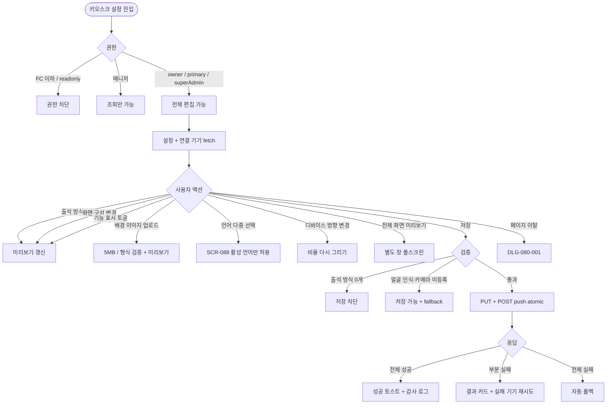
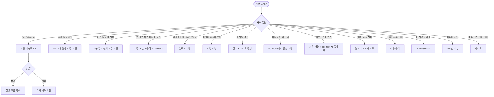

# SCR-082 키오스크 설정 페이지

## 1. 화면 메타 정보

이 문서는 키오스크 설정 페이지에 대한 자기완결형 요구사항 정의서입니다. 다른 문서를 함께 보지 않아도 이 문서 한 장만으로 키오스크 설정 페이지에 들어가는 모든 영역, 모든 버튼, 모든 모달, 모든 권한, 모든 예외 처리, 그리고 이 화면을 지탱하는 운영 정책까지 전부 이해하고 구현할 수 있도록 작성합니다.

| 항목 | 값 |
|---|---|
| 작성일 | 2026-05-22 |
| 버전 | v1.0 |
| 상태 | 최신 통합본 반영 (정합화 완료) |
| 도메인 | D09 설정관리 |
| 화면 ID | SCR-082 |
| 화면명 | 키오스크 설정 |
| 화면 유형 | 설정 화면 (Settings Screen with Live Preview) |
| 라우트 (URL) | `/settings/kiosk` |
| 플랫폼 | 데스크톱(기본), 태블릿 |
| 우선순위 | P0 (출시 필수) |
| 기능코드 | IoT-01 (키오스크 설정) |
| 계약 상태 | 계약 범위 본기능 |
| 부모 기능 prefix | IoT |
| Lv1 코드 | IoT-01 |
| Lv2 / Lv3 세분화 | IoT-01-01 ~ IoT-01-06 (출석 방식·화면 구성·기능 표시·미리보기·저장·키오스크 연결) |
| 연계 화면 | SCR-082A 키오스크IoT설정, SCR-083 IoT출입관리, SCR-088 다국어설정, SCR-085 공지사항관리, SCR-097 감사로그 |
| 호출 다이얼로그 | DLG-080-001 미저장경고 |

## 2. 화면 개요와 목적

키오스크 설정 페이지는 센터 입구에 설치된 키오스크 기기의 화면 구성과 동작 방식을 통합 관리하는 화면입니다. 회원이 키오스크에서 출석 체크를 하는 방식(QR·회원번호·얼굴 인식 3종, 다중 선택 가능), 키오스크 화면에 표시할 환영 메시지·배경·로고·표시 언어, 사용 가능한 기능 4종(이용권 잔여 조회·수업 예약 조회·락커 번호 확인·공지사항 조회) 토글이 한 화면에서 처리됩니다. 미리보기 영역이 실시간으로 변경 사항을 반영해 운영자가 결과를 즉시 확인할 수 있고, 저장 시 연결된 모든 키오스크 기기에 MQTT/WebSocket으로 push되어 즉시 반영됩니다. 미연결 기기는 다음 connect 시점에 동기화됩니다.

운영 흐름은 다양합니다. 신규 오픈 센터의 Owner(지점장)이 출석 방식 QR + 얼굴 인식을 활성화하고 로고와 환영 메시지를 등록한 다음 미리보기로 결과를 확인한 후 저장합니다. 본사 슈퍼관리자가 계절 캠페인 메시지(예: "여름 PT 30% 할인 진행 중!")를 임시로 적용했다가 캠페인 종료 시 복원합니다. 카메라 고장으로 얼굴 인식이 일시 비활성되어야 할 때 매니저가 얼굴 인식 토글만 OFF로 변경해 저장하면 즉시 push되어 키오스크가 QR·회원번호만 활성된 상태로 동작합니다. 외국인 회원 비중이 증가하면 다국어 설정(SCR-088)에서 영어·중국어를 활성한 뒤 이 화면에서 키오스크 표시 언어를 다중 선택해 즉시 반영합니다. 회원앱 출시에 따라 키오스크의 이용권 조회·수업 예약 토글을 OFF로 바꿔 회원이 앱을 더 적극적으로 사용하도록 유도하기도 합니다.

저장 시점에는 키오스크 기기에 atomic 트랜잭션으로 push되어 DB 저장과 기기 push가 함께 성공해야 변경이 확정됩니다. 한쪽이 실패하면 자동 롤백되며, 부분 실패(일부 기기 push 실패)는 실패 기기 목록과 재시도 버튼이 노출됩니다. 모든 변경은 SCR-097 감사 로그에 기록되며, 미저장 변경 + 페이지 이탈 시 DLG-080-001 미저장 경고가 떠서 손실을 막습니다.

## 3. 진입 경로와 인접 화면

키오스크 설정 페이지에 진입하는 경로는 사이드바의 "설정 > 키오스크 설정" 메뉴가 가장 일반적입니다. 메뉴는 owner와 superAdmin/primary에게 노출되며, 매니저는 메뉴는 보이지만 조회만 가능합니다. FC/트레이너/스태프/프런트/readonly는 메뉴 자체가 보이지 않습니다.

두 번째 경로는 SCR-082A 키오스크 IoT 설정에서 카메라·QR 스캐너 등을 등록한 직후 "키오스크 설정에서 출석 방식을 활성화하시겠습니까?" 안내를 누르는 경우입니다. 이때는 출석 방식 토글 영역으로 자동 스크롤됩니다.

세 번째 경로는 SCR-088 다국어 설정에서 새 언어를 활성한 직후 "키오스크 표시 언어에 추가하시겠습니까?" 안내를 누르는 경우입니다. 화면 구성 탭의 표시 언어 영역으로 진입합니다.

네 번째 경로는 알림 센터(NFR-19)에서 "키오스크 push 실패 알림" 또는 "키오스크가 N분 이상 미연결 상태입니다" 알림을 누르는 경우입니다.

이 화면에서 빠져나가는 인접 화면으로는 키오스크 IoT 기기(카메라·QR 스캐너)를 등록하는 SCR-082A, IoT 출입 게이트를 관리하는 SCR-083, 표시 언어를 활성하는 SCR-088, 키오스크에 노출되는 공지를 관리하는 SCR-085, 모든 변경이 기록되는 SCR-097이 있습니다.

## 4. 레이아웃과 UI 구성

키오스크 설정 페이지는 좌우 2단 분할 레이아웃을 기본으로 합니다. 좌측 60% 폭에는 설정 입력 영역이 출석 방식·화면 구성·기능 표시 순서로 위에서 아래로 배치되고, 우측 40% 폭에는 키오스크 미리보기가 sticky 형태로 고정되어 입력 변경에 따라 실시간 갱신됩니다. 태블릿에서는 미리보기가 본문 하단으로 이동하는 1단 레이아웃으로 자동 전환됩니다.

가장 위에는 페이지 헤더가 있습니다. 헤더 좌측에는 "키오스크 설정"이라는 페이지 타이틀과 함께 연결된 키오스크 기기 수가 작은 배지로 표시됩니다("연결 5대 / 전체 6대" 같은 형식). 헤더 우측에는 [변경 사항 저장] 버튼이 있고 변경이 있을 때만 활성됩니다. 본사 슈퍼관리자가 통합 모드에서 진입한 경우 지점 컨텍스트 드롭다운이 추가로 표시됩니다.

페이지 헤더 바로 아래에는 연결 상태 요약 배너가 있습니다. 이 배너는 현재 등록된 키오스크 기기의 연결 상태를 한 줄로 요약하며, "정상 4대 / 오프라인 1대 / 오류 1대" 같은 형식으로 표시됩니다. 미연결 기기가 있으면 노랑 톤으로 강조되고, 본문 어디서 저장하더라도 미연결 기기는 다음 connect 시점에 동기화된다는 안내가 함께 표시됩니다.

좌측 본문의 첫 번째 섹션은 출석 방식 설정입니다. QR코드·회원번호 입력·얼굴 인식 세 가지 출석 방식이 각각 토글과 함께 표시되며, 활성된 방식 중 하나를 기본 출석 방식(키오스크 첫 화면에 표시되는 방식)으로 라디오 선택합니다. 얼굴 인식은 SCR-083 또는 SCR-082A에 얼굴 인식 카메라가 1대 이상 정상 상태로 등록되어 있어야 정상 동작하며, 미등록 상태에서 활성하면 인라인 경고가 표시되고 "카메라 등록 화면으로 이동" 링크가 함께 노출됩니다. 출석 방식을 모두 비활성한 상태로 저장하려고 하면 "최소 1개 출석 방식 활성 필수" 안내와 함께 저장이 차단됩니다.

두 번째 섹션은 화면 구성 설정입니다. 표시 언어는 SCR-088에서 활성된 언어 중 다중 선택이 가능하며 기본 언어 1개를 라디오로 지정합니다. 대기 화면 배경은 이미지(PNG/JPG 5MB 이내) 또는 색상 선택을 선택적으로 적용할 수 있으며, 권장 해상도는 세로 키오스크 1080×1920 또는 가로 키오스크 1920×1080입니다. 센터 로고 표시 토글로 SCR-080에서 등록한 센터 로고를 키오스크 상단에 노출할지 결정합니다. 환영 메시지는 100자 이내 텍스트로 `{회원명}` 변수가 출석 시 회원 이름으로 자동 치환되며, 그 외 변수는 텍스트 그대로 표시됩니다. 출석 완료 메시지도 100자 이내 별도 입력으로 관리됩니다.

세 번째 섹션은 기능 표시 설정입니다. 이용권 잔여 조회·수업 예약 조회·락커 번호 확인·공지사항 조회 네 가지 기능 토글이 나열되며, 모두 비활성도 허용됩니다(출석 체크 전용 키오스크 운영 가능). 이용권 잔여 조회는 회원 본인 카드 정보를 키오스크에 노출하므로 개인정보 정책을 준수해야 합니다. 수업 예약 조회는 D03 수업 예약 기능과 연동되어 회원의 예약 정보를 노출하며, 정책 토글에 따라 예약·취소가 키오스크에서 가능할지 추가 결정됩니다. 락커 번호 확인은 D02 락커 정보 매핑이 필수이며, 공지사항 조회는 SCR-085에서 "키오스크 노출" 토글이 켜진 공지가 노출됩니다.

우측 미리보기 영역은 실제 키오스크 화면의 형태와 비율을 그대로 따른 시뮬레이션입니다. 입력 항목이 변경될 때마다 미리보기가 실시간으로 다시 그려져 운영자가 결과를 즉시 확인할 수 있습니다. 미리보기 우측 상단에는 디바이스 방향(세로/가로) 토글이 있어 키오스크 설치 방향에 맞춰 비율을 바꿀 수 있습니다. 미리보기 우측 하단에는 [전체 화면 미리보기] 버튼이 있어 별도 창으로 풀스크린 시뮬레이션을 띄울 수 있습니다.

페이지 최하단에는 액션 풋바가 fixed로 떠 있으며, [변경 사항 저장] / [변경 취소] 두 버튼이 우측에 배치됩니다.

## 5. 탭 구성과 탭별 동작

이 화면은 탭 구조가 없는 단일 페이지로, 세 개의 섹션(출석 방식·화면 구성·기능 표시)이 좌측 본문에 위에서 아래로 펼쳐집니다. 운영자는 스크롤로 섹션 사이를 이동하며, 각 섹션의 변경은 우측 미리보기에 실시간으로 반영됩니다.

매니저가 진입한 경우 모든 토글과 입력이 비활성 상태로 표시되며, [변경 사항 저장] 버튼은 hidden 처리됩니다. 매니저는 현재 설정을 조회만 가능합니다.

본사 슈퍼관리자가 통합 모드에서 다른 지점을 선택하면 그 지점의 설정과 연결 기기 정보가 다시 fetch되어 화면에 표시됩니다. 미저장 변경이 있는 경우 DLG-080-001이 먼저 표시되어 손실을 막습니다.

## 6. 버튼·아이콘·링크 액션 전체 정의

페이지 헤더의 [변경 사항 저장] 버튼은 변경이 한 건 이상 있을 때만 활성되며, 누르면 백엔드 저장과 키오스크 push가 atomic 트랜잭션으로 실행됩니다. 전체 성공이면 성공 토스트, 부분 실패면 실패 기기 목록과 재시도 버튼, 전체 실패면 자동 롤백과 실패 토스트가 표시됩니다.

연결 상태 요약 배너의 "미연결 기기 보기" 링크는 SCR-082A 또는 SCR-083으로 이동시켜 기기 상세 정보를 확인할 수 있게 합니다.

출석 방식 섹션의 각 토글은 누르면 즉시 미리보기가 갱신되지만, 실제 키오스크에는 저장 후에야 push됩니다. 기본 출석 방식 라디오는 활성된 방식 중에서만 선택할 수 있으며, 어떤 방식도 활성되지 않은 경우 라디오 자체가 비활성됩니다. 얼굴 인식 토글을 활성하려고 할 때 카메라가 등록되어 있지 않으면 "카메라 등록 화면으로 이동" 링크가 인라인으로 표시됩니다.

화면 구성 섹션의 표시 언어 드롭다운은 SCR-088에서 활성된 언어만 옵션으로 노출됩니다. 다중 선택 가능하며, 미활성 언어를 시도하면 "SCR-088에서 먼저 활성하세요" 안내가 표시됩니다.

배경 이미지 업로드 영역은 클릭 또는 드래그 앤 드롭으로 파일을 받습니다. 5MB 초과나 PNG/JPG 외 형식은 업로드 단계에서 차단됩니다. 업로드 후에는 미리보기에 즉시 반영되며 저장 전까지는 임시 영역에 보관됩니다.

배경 색상 선택기는 HEX 색상 또는 팔레트로 선택하며, 이미지와 동시에 적용할 수 없으므로 둘 중 하나를 선택하는 라디오 형태로 동작합니다.

환영 메시지 입력란은 100자 카운터가 함께 표시되며, `{회원명}` 변수가 인라인 안내로 강조되어 운영자가 변수 사용을 인지할 수 있습니다. 100자 초과 시 인라인 카운터가 빨강 톤으로 바뀌고 저장이 차단됩니다.

기능 표시 섹션의 네 가지 토글은 누르면 즉시 미리보기 카드가 보이거나 사라지는 형태로 시각적 피드백을 제공합니다. 락커 번호 확인은 D02 락커 매핑이 없는 회원에게는 어차피 표시되지 않으므로 토글 켜기는 가능하지만 실제 효과는 매핑된 회원에 한정됩니다.

우측 미리보기의 디바이스 방향 토글은 세로/가로 두 옵션이며, 클릭 즉시 비율과 레이아웃이 다시 그려집니다.

[전체 화면 미리보기] 버튼은 별도 창으로 풀스크린 시뮬레이션을 띄웁니다. 별도 창에서는 실제 키오스크와 동일한 인터랙션(터치·QR 스캔 시뮬레이션·회원번호 입력)을 시도할 수 있어 운영자가 화면 흐름을 점검할 수 있습니다.

[변경 취소] 버튼은 마지막 저장 시점으로 모든 입력을 되돌리며, 한 번 더 확인이 표시됩니다.

모든 버튼은 클릭 후 응답이 돌아오기 전까지 자동으로 비활성화되어 중복 요청이 차단됩니다.

## 7. 호출되는 모달 동작

이 화면에서 호출되는 모달은 DLG-080-001 미저장 경고 하나입니다.

### 7-1. DLG-080-001 미저장 경고 다이얼로그

미저장 경고 다이얼로그는 운영자가 변경 사항을 저장하지 않은 상태에서 페이지를 떠나려고 할 때 변경 손실을 막기 위해 강제로 표시되는 모달입니다. 사이드바·헤더 메뉴·브라우저 뒤로가기 등으로 페이지를 떠나려고 할 때, 본사 슈퍼관리자가 지점 컨텍스트 드롭다운에서 다른 지점을 선택할 때 트리거됩니다.

모달에는 "저장되지 않은 변경 사항이 있습니다" 제목과 함께 변경 요약이 표시됩니다. [저장] / [이탈] / [취소] 세 버튼이 있으며, 저장은 변경을 즉시 백엔드에 저장한 후 새 위치로 이동하고, 이탈은 변경을 폐기한 후 새 위치로 이동하며, 취소는 모달만 닫고 현재 페이지에 머무릅니다. ESC 키와 배경 클릭은 취소와 동일하게 동작합니다.

이 모달의 자세한 동작은 DLG-080-001 다이얼로그 문서에서 자기완결로 다시 정의됩니다.

## 8. 토스트와 확인 팝업과 알럿

성공 토스트는 우측 상단에 녹색 계열로 3초 동안 "키오스크 설정이 저장되었습니다", "키오스크 N대에 즉시 반영되었습니다" 같은 문구로 표시됩니다. 키오스크 push가 완료된 기기 수가 함께 표시됩니다.

실패 토스트는 빨강 계열로 "저장에 실패했습니다", "키오스크 push에 실패했습니다" 같은 문구와 함께 다시 시도 버튼이 따라옵니다.

부분 실패 안내는 토스트가 아니라 화면 중앙 하단의 결과 카드로 표시됩니다. "키오스크 N대 중 M대 push 실패" 같은 형식이며 실패 기기 목록과 재시도 버튼이 함께 노출됩니다. 재시도 버튼을 누르면 실패한 기기에 한해서만 push가 다시 시도됩니다.

미연결 안내는 페이지 헤더 아래의 연결 상태 요약 배너에 항상 표시됩니다. "미연결 기기는 다음 connect 시점에 자동 동기화됩니다" 안내가 함께 표시되어 운영자의 불안을 줄입니다.

확인 팝업은 [변경 취소] 버튼을 눌렀을 때 한 번 더 표시됩니다.

알럿은 권한이 없는 계정이 직접 URL로 접근했을 때 차단형으로 표시됩니다.

매니저로 진입한 경우 모든 입력이 비활성 상태로 표시되며, 입력 영역 상단에 "조회만 가능합니다" 안내 배지가 작게 표시됩니다.

## 9. 데이터 흐름과 외부 연동

화면 진입 시 `GET /api/settings/kiosk`로 현재 설정값이 fetch되고 `GET /api/settings/kiosk/devices`로 연결된 키오스크 기기 목록과 상태가 fetch됩니다. 두 응답이 모두 도착하면 본문 입력과 연결 상태 배너가 한 번에 표시됩니다.

저장은 `PUT /api/settings/kiosk` 호출로 DB 저장이 먼저 실행되고, 응답이 성공하면 `POST /api/settings/kiosk/push` 호출로 연결된 기기에 MQTT/WebSocket signal이 전송됩니다. DB 저장과 기기 push는 atomic 트랜잭션으로 묶여 한쪽이 실패하면 자동 롤백됩니다.

배경 이미지 업로드는 `POST /api/settings/kiosk/upload-image`로 처리되며, 멀티파트 업로드로 진행됩니다. 업로드된 파일은 즉시 미리보기에 반영되지만 저장 전까지는 임시 영역에 보관됩니다.

미리보기는 `POST /api/settings/kiosk/preview`로 서버 사이드 렌더링을 호출하거나 클라이언트 렌더링으로 처리됩니다. 운영자의 입력에 따라 실시간으로 다시 그려집니다.

표시 언어 옵션은 SCR-088과 동기화되며, 키오스크에 노출되는 공지는 SCR-085와 동기화됩니다. 락커 매핑은 D02 회원관리의 락커 정보를, 수업 예약은 D03 수업관리의 예약 정보를 참조합니다.

키오스크 기기 헬스체크는 5분 간격으로 실행되어 미연결 기기를 자동으로 재시도합니다. 일정 시간 이상 오프라인 상태가 지속되면 NFR-19 알림 센터로 운영자 알림이 발송됩니다.

얼굴 인식 활성 시에는 SCR-083 또는 SCR-082A의 얼굴 인식 카메라 등록 상태가 검증됩니다. 등록되지 않은 상태에서 활성하면 저장은 가능하지만 실제 키오스크 동작 시 fallback 메시지가 표시됩니다.

모든 설정 변경은 SCR-097 감사 로그에 actor·diff JSON·timestamp로 INSERT됩니다.

화면에서 호출하는 주요 API는 `GET /api/settings/kiosk`, `PUT /api/settings/kiosk`, `POST /api/settings/kiosk/preview`, `GET /api/settings/kiosk/devices`, `POST /api/settings/kiosk/push`, `POST /api/settings/kiosk/upload-image`입니다.

## 10. 화면 상태와 예외 처리

로딩 중 상태에서는 입력 영역과 미리보기에 스켈레톤이 표시됩니다.

기본 상태는 200 응답과 함께 입력이 모두 채워진 상태로, 저장 버튼은 비활성이며 미리보기는 현재 설정으로 그려져 있습니다.

수정 중 상태는 한 건 이상 변경이 발생한 상태로, 미리보기가 실시간으로 갱신되고 저장 버튼이 활성됩니다.

저장 중 상태는 액션 풋바 버튼이 비활성되고 스피너가 표시됩니다.

저장 완료 상태는 성공 토스트와 함께 키오스크 push 결과(N대 즉시 반영)가 표시됩니다.

키오스크 미연결 상태는 등록된 기기가 0대이거나 모두 오프라인일 때 표시됩니다. "연결된 키오스크가 없습니다" 안내와 함께 SCR-082A로 이동하는 링크가 제공되며, 저장 자체는 가능하지만 push 동기화는 다음 connect 시점에 진행됩니다.

부분 push 실패 상태는 일부 기기에 push가 실패한 상태로, 화면 중앙 하단에 결과 카드가 표시되고 실패 기기 재시도 버튼이 노출됩니다.

권한 부족 상태는 매니저가 진입한 경우로, 모든 입력이 비활성 상태로 표시되고 저장 버튼은 hidden입니다.

예외 케이스별 처리는 다음과 같습니다.

출석 방식을 모두 비활성한 채 저장을 시도하면 "최소 1개 출석 방식 활성 필수" 인라인 경고가 표시되고 저장이 차단됩니다.

기본 출석 방식이 지정되지 않은 채 저장을 시도하면 "기본 방식을 선택하세요" 안내가 표시되고 차단됩니다.

얼굴 인식을 활성했지만 카메라가 등록되어 있지 않으면 인라인 경고가 표시되며, 저장은 가능하지만 실제 키오스크 동작 시 fallback이 적용됩니다.

배경 이미지가 5MB를 초과하거나 PNG/JPG 외 형식이면 업로드 단계에서 차단됩니다.

환영 메시지·완료 메시지가 100자를 초과하면 인라인 카운터가 빨강 톤으로 바뀌고 저장이 차단됩니다.

`{회원명}` 외의 변수를 입력하면 "지원하지 않는 변수입니다" 경고가 표시되지만 텍스트 그대로 보존되어 저장은 가능합니다(키오스크에서는 변수가 치환되지 않고 그대로 표시됨).

SCR-088에서 미활성된 언어를 선택하려고 하면 "다국어 설정에서 먼저 활성하세요" 안내가 표시되고 차단됩니다.

키오스크가 한 대도 연결되지 않은 상태에서 저장하면 저장은 가능하지만 push는 일어나지 않습니다. 다음 connect 시점에 자동 동기화됩니다.

일부 기기 push가 실패하면 결과 카드에 실패 기기 목록이 표시되고 재시도 버튼이 노출됩니다. 전체 실패는 atomic 트랜잭션으로 자동 롤백됩니다.

저장 API가 네트워크 오류로 실패하면 "저장 실패" 토스트와 다시 시도 안내가 표시됩니다.

미저장 변경 + 페이지 이탈 시 DLG-080-001이 강제 표시됩니다.

매니저로 진입하면 조회만 가능하며 저장 버튼이 hidden 됩니다. 권한 부족(스태프 이하) 접근은 사이드바 메뉴 자체가 hidden 되고 직접 URL 접근 시 차단됩니다.

미리보기 렌더링이 실패하면 "미리보기를 불러오지 못했습니다" 안내와 재시도 버튼이 표시됩니다.

## 11. 권한별 처리

슈퍼관리자(superAdmin)와 본사 최고관리자(primary)는 모든 키오스크 설정을 자유롭게 편집할 수 있으며, 본사 통합 모드에서 다른 지점의 키오스크 설정도 편집할 수 있습니다.

Owner(지점장)은 자기 지점의 키오스크 설정을 편집할 수 있습니다. RLS branchId 필터로 다른 지점의 키오스크에는 접근할 수 없습니다.

매니저(manager)는 현재 설정을 조회만 가능합니다. 모든 토글과 입력이 비활성 상태로 표시되며 저장 버튼은 hidden 됩니다. 미리보기는 정상적으로 보이므로 현재 키오스크 상태를 확인하는 용도로 사용할 수 있습니다.

FC(fc), 트레이너(trainer), 스태프(staff), 프런트(front), 읽기 전용(readonly)은 이 화면에 접근할 수 없습니다. 사이드바 메뉴 자체가 보이지 않습니다.

권한 외에 운영 옵션에 따라 일부 영역이 달라질 수 있습니다. 키오스크가 한 대도 연결되지 않은 신규 센터에서는 연결 상태 배너가 안내로 채워지고, 락커 매핑이 없는 센터에서는 락커 번호 확인 토글이 비활성될 수 있습니다.

## 12. 메인 흐름

## 13. 에러와 예외 흐름

## 14. 핵심 디자인 요청사항

좌우 2단 분할 레이아웃에서 우측 미리보기는 sticky로 고정되어 운영자가 좌측 입력을 변경하는 동안 항상 결과를 볼 수 있어야 합니다. 미리보기의 비율은 실제 키오스크와 동일해야 하며 디바이스 방향(세로/가로) 토글로 즉시 전환됩니다.

연결 상태 요약 배너는 페이지 헤더 바로 아래에 가로 폭을 모두 차지하며, 정상·오프라인·오류 기기 수가 색상으로 구분(녹색·노랑·빨강)되어 멀리서도 식별 가능해야 합니다.

출석 방식 토글은 QR·회원번호·얼굴 인식 세 항목이 동일 크기로 가로 배치되며, 각 토글 아래에 기본 방식 라디오가 함께 표시됩니다. 활성된 방식 중에서만 라디오 선택이 가능하며, 비활성 상태의 라디오는 회색 톤으로 표시됩니다.

배경 이미지 업로드 영역은 드래그 앤 드롭 가능한 충분한 크기로 디자인되며, 업로드된 이미지가 미리보기에 즉시 반영됩니다. 배경 색상 선택과 이미지 업로드는 라디오로 둘 중 하나만 적용되도록 시각적으로 분리됩니다.

환영 메시지 입력란에는 `{회원명}` 변수 사용 안내가 인라인 도움말로 표시되며, 100자 카운터가 우측 하단에 작게 보입니다. 한도에 가까워질수록 카운터 색상이 점진적으로 강조됩니다.

기능 표시 토글은 4개가 카드형 그리드로 배치되어 각 기능이 어떤 효과를 내는지 짧은 설명과 함께 표시됩니다. 토글이 켜진 카드는 강조 색상이 들어와 활성 상태가 즉시 보입니다.

부분 push 실패 결과 카드는 화면 중앙 하단에 떠 있는 형태로 디자인되어 운영자가 닫을 때까지 사라지지 않으며, 실패 기기 목록과 재시도 버튼이 한눈에 들어옵니다.

매니저로 진입한 경우 비활성 입력의 톤이 회색으로 통일되어 "조회만 가능" 상태가 일관되게 인식되어야 합니다.

액션 풋바는 fixed로 떠 있어 페이지를 길게 스크롤해도 저장 버튼에 항상 접근 가능합니다.

## 15. 운영 정책 (이 화면에 연결된 부분)

출석 방식은 QR·회원번호·얼굴 인식 3종이며 다중 활성을 허용하되 최소 1개 활성이 필수입니다. 모두 비활성하면 키오스크가 출석 체크 자체를 수행할 수 없으므로 운영 안전성 측면에서 저장이 차단됩니다.

기본 출석 방식은 활성된 방식 중 1개를 라디오 선택해야 하며, 키오스크의 첫 화면에 그 방식이 표시됩니다. 회원이 키오스크에서 다른 방식으로 전환할 수 있도록 보조 진입점은 활성된 방식 전체에 대해 제공됩니다.

얼굴 인식은 SCR-083 또는 SCR-082A에 얼굴 인식 카메라가 1대 이상 정상 상태로 등록되어 있어야 정상 동작합니다. 미등록 상태에서 활성하는 것은 허용되지만(설정과 기기 등록의 비동기 진행을 지원하기 위함), 실제 키오스크 동작 시에는 fallback이 적용되어 QR·회원번호로 자동 전환됩니다.

표시 언어는 SCR-088 다국어 설정에서 활성된 언어 중에서만 키오스크용으로 다중 선택할 수 있습니다. 키오스크 기본 언어 1개를 라디오로 지정하며, 회원이 키오스크에서 언어 전환 버튼을 누르면 다른 활성 언어로 즉시 전환됩니다. 언어 전환 버튼 표시 여부는 SCR-088에서 별도 토글로 관리됩니다.

배경 이미지 정책은 PNG/JPG 5MB 이내, 권장 해상도 세로 1080×1920 또는 가로 1920×1080입니다. 이미지와 색상은 동시에 적용할 수 없으며 둘 중 하나만 키오스크 대기 화면에 노출됩니다.

환영 메시지와 출석 완료 메시지는 각 100자 이내이며, `{회원명}` 변수는 출석 시 회원 이름으로 자동 치환됩니다. 그 외 변수는 텍스트 그대로 표시되며, 운영자가 미지원 변수를 입력하면 인라인 경고가 표시되지만 저장 자체는 가능합니다.

기능 표시 4종(이용권 잔여 조회·수업 예약 조회·락커 번호 확인·공지사항 조회)은 모두 비활성도 허용됩니다. 출석 체크 전용 키오스크로 운영하는 센터도 있고, 회원앱으로 기능을 유도하는 센터도 있기 때문에 운영 선택권이 보장됩니다.

이용권 잔여 조회는 회원 본인 카드 정보를 키오스크에 노출하므로 개인정보 정책을 준수해야 합니다. 키오스크는 회원이 출석 인증(QR·번호·얼굴)을 거친 후에만 본인 정보를 표시하며, 인증 없이 정보가 노출되지 않습니다.

수업 예약 조회는 D03 수업 예약 기능과 연동되며, 예약·취소를 키오스크에서 가능하게 할지는 추가 정책 토글로 결정됩니다. 회원앱으로 유도하는 센터는 키오스크에서 조회만 허용하고 예약·취소는 차단할 수 있습니다.

락커 번호 확인은 D02 락커 정보 매핑이 필수이며, 매핑되지 않은 회원에게는 키오스크에서 락커 정보가 표시되지 않습니다.

공지사항 조회는 SCR-085에서 "키오스크 노출" 토글이 켜진 공지가 노출되며, 회원앱 노출과는 독립적으로 관리됩니다.

저장 시점 동기화 트랜잭션 정책은 DB 저장과 기기 push가 atomic 처리되어야 한다는 점입니다. 한쪽이 실패하면 자동 롤백되며, 부분 실패는 실패 기기 목록과 재시도 버튼이 노출됩니다.

키오스크 push는 MQTT 또는 WebSocket signal로 처리되며 연결된 모든 기기에 즉시 전송됩니다. 미연결 기기는 다음 connect 시점에 최신 설정을 자동 fetch해 동기화됩니다.

연결 기기 헬스체크는 5분 간격으로 실행되어 미연결 기기를 자동으로 재시도합니다. 일정 시간(테넌트 정책으로 N분 지정) 이상 오프라인 상태가 지속되면 NFR-19 알림 센터로 운영자 알림이 발송됩니다.

권한 정책은 owner와 superAdmin/primary가 편집 가능하고, 매니저는 조회만 가능하며, 스태프 이하는 화면에 접근할 수 없습니다. 본사 통합 모드는 superAdmin/primary에게만 활성됩니다.

미저장 변경 + 페이지 이탈 시 DLG-080-001이 강제 표시되어 변경 손실을 막습니다.

모든 변경은 SCR-097 감사 로그에 actor·diff JSON·timestamp로 INSERT되며, 5초 안에 감사 로그 화면에서 조회 가능합니다.

이상의 모든 정책은 이 화면을 구현하고 운영하는 사람이 별도 문서 없이 이 한 장만 보면 이해할 수 있도록 풀어 적었습니다. 정책이 바뀌면 이 문서가 함께 갱신되어야 하며, 코드 변경과 정책 변경은 항상 짝지어 진행됩니다.
