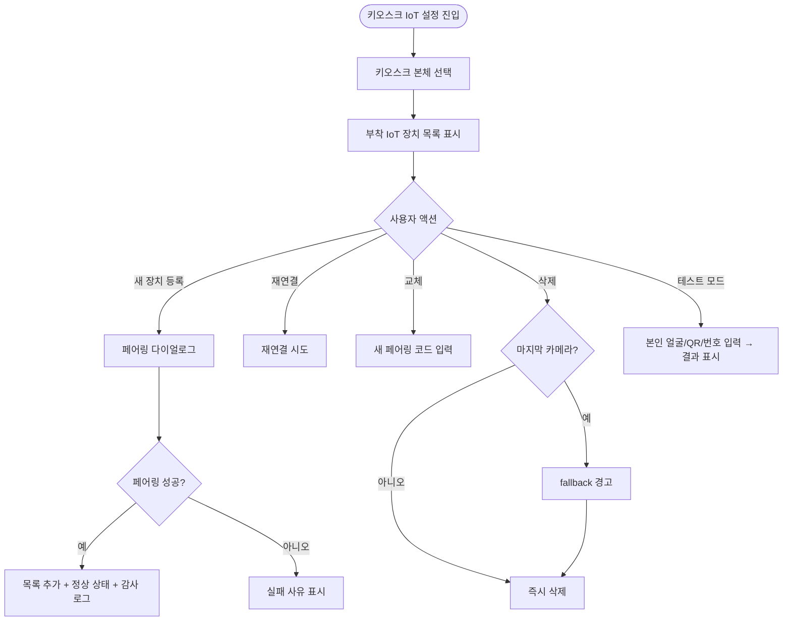
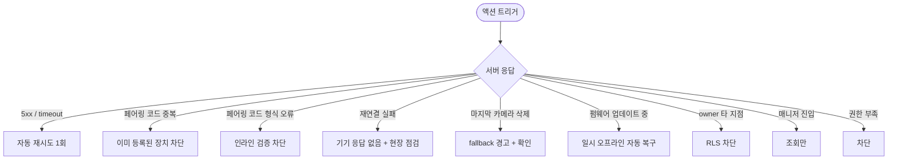

# SCR-082A 키오스크 IoT 설정 페이지

## 1. 화면 메타 정보

이 문서는 키오스크 IoT 설정 페이지에 대한 자기완결형 요구사항 정의서입니다.

| 항목 | 값 |
|---|---|
| 작성일 | 2026-05-22 |
| 버전 | v1.0 |
| 상태 | 최신 통합본 반영 (정합화 완료) |
| 도메인 | D09 설정관리 |
| 화면 ID | SCR-082A |
| 화면명 | 키오스크 IoT 설정 |
| 화면 유형 | 보조 설정 화면 (Companion Settings Screen) |
| 라우트 (URL) | `/settings/iot` (SCR-083 IoT 출입 관리와 동일 페이지의 탭) |
| 플랫폼 | 데스크톱(기본), 태블릿 |
| 우선순위 | P0 (출시 필수) |
| 기능코드 | IoT-01 (키오스크 설정 IoT 영역) |
| 계약 상태 | 계약 범위 본기능 |
| 부모 기능 prefix | IoT |
| Lv1 코드 | IoT-01 |
| 연계 화면 | SCR-082 키오스크설정, SCR-083 IoT출입관리, SCR-097 감사로그 |
| 호출 다이얼로그 | DLG-080-001 미저장경고 |

## 2. 화면 개요와 목적

키오스크 IoT 설정 페이지는 키오스크 본체에 부착되는 IoT 주변 장치(얼굴 인식 카메라·QR 스캐너·회원번호 키패드 등)를 키오스크와 연결·관리하는 화면입니다. SCR-082 키오스크 설정이 화면 구성·메시지·기능 토글에 집중한다면, 이 화면은 그 키오스크가 동작하는 데 필요한 입출력 하드웨어의 등록과 페어링, 동작 점검을 다룹니다. SCR-083이 출입 게이트(센터 전체의 출입 관리)를 다루는 데 반해, 이 화면은 키오스크 단말기에 직접 붙어 있는 주변 IoT만을 다룬다는 점에서 책임 범위가 분리됩니다.

운영 흐름은 다음과 같습니다. 신규 키오스크를 설치한 직후 운영자가 이 화면에서 얼굴 인식 카메라와 QR 스캐너를 키오스크에 페어링하고, SCR-082에서 얼굴 인식 출석 방식을 활성합니다. 카메라가 고장 나면 [재연결] 또는 [교체] 액션으로 새 카메라를 등록하고, 펌웨어 업데이트가 본사 OTA로 발생한 경우 일시 오프라인 상태를 거쳐 자동으로 재연결되는 동안 운영자는 이 화면에서 진행 상태를 확인합니다. 카메라 시야와 인식 정확도를 점검하는 테스트 모드를 통해 회원 등록 직후 얼굴 매칭이 잘 되는지 운영자 본인 얼굴로 사전 검증할 수 있습니다.

핵심 정책은 다음과 같습니다. 첫째, 키오스크 단말기와 IoT 주변 장치는 1:N 관계로, 한 키오스크에 카메라·스캐너·키패드를 동시에 붙일 수 있습니다. 둘째, 얼굴 인식 카메라가 한 대도 정상 상태로 등록되지 않으면 SCR-082의 얼굴 인식 출석 방식은 fallback 동작합니다. 셋째, 모든 등록·삭제·재연결은 SCR-097 감사 로그에 기록됩니다.

## 3. 진입 경로와 인접 화면

이 화면에 진입하는 경로는 사이드바의 "설정 > 키오스크 IoT 설정"이며, owner와 superAdmin/primary에게만 노출됩니다. 두 번째 경로는 SCR-082 키오스크 설정에서 얼굴 인식 활성 시 "카메라가 등록되지 않았습니다" 안내의 링크를 누르는 경우입니다. 세 번째 경로는 알림 센터의 "키오스크 IoT 기기가 오프라인 상태입니다" 알림을 누르는 경우입니다.

인접 화면은 SCR-082 키오스크 설정, SCR-083 IoT 출입 관리, SCR-097 감사 로그입니다.

## 4. 레이아웃과 UI 구성

페이지 헤더는 "키오스크 IoT 설정" 타이틀과 현재 등록된 키오스크 본체 목록 선택 드롭다운으로 구성됩니다. 키오스크 본체를 선택하면 그 키오스크에 부착된 IoT 주변 장치 목록이 본문에 표시됩니다.

본문 좌측에는 키오스크 본체 정보(설치 위치·연결 상태·마지막 통신 시각·펌웨어 버전) 카드가 있고, 우측에는 부착된 IoT 장치 목록 테이블이 있습니다. 테이블 컬럼은 장치 유형(카메라/스캐너/키패드)·장치명·연결 상태(정상/오프라인/오류)·마지막 통신·액션([재연결] / [교체] / [삭제])입니다. 테이블 상단에 [+ 새 장치 등록] 버튼이 있고, 누르면 장치 유형과 페어링 코드를 입력해 키오스크에 새 IoT를 추가할 수 있습니다.

본문 하단에는 [테스트 모드] 영역이 있어 운영자가 본인 얼굴이나 QR 코드를 직접 입력해 인식 정확도를 점검할 수 있습니다. 테스트 결과는 인식 성공 여부·매칭 점수·응답 시간으로 표시되며, 결과는 감사 로그에 기록되지 않습니다(점검 용도이므로).

페이지 최하단에는 액션 풋바가 있으며 [변경 사항 저장] 버튼은 등록·삭제·재연결 같은 즉시 적용 액션은 별도 트랜잭션으로 처리되므로 이 화면에서는 거의 사용되지 않고, 키오스크 본체의 설치 위치 같은 메타데이터 수정 시에만 활성됩니다.

## 5. 탭 구성과 탭별 동작

이 화면은 탭 구조 없이 키오스크 본체 선택 드롭다운이 1차 분기를 담당합니다. 선택한 키오스크에 부착된 IoT 장치만 본문에 표시됩니다.

## 6. 버튼·아이콘·링크 액션 전체 정의

키오스크 본체 선택 드롭다운은 등록된 키오스크 목록을 펼치며 선택 시 본문이 다시 fetch됩니다.

[+ 새 장치 등록] 버튼은 페어링 다이얼로그를 열어 장치 유형(카메라/스캐너/키패드)과 제조사 발급 페어링 코드를 입력받습니다. 페어링이 성공하면 테이블에 행이 추가되고 즉시 정상 상태로 표시됩니다.

각 행의 [재연결] 버튼은 그 장치에 재연결 신호를 보내며, 응답이 정상이면 상태가 다시 정상으로 갱신됩니다.

[교체] 버튼은 기존 장치의 위치(설치 위치·키오스크 본체와의 연결 슬롯)는 유지한 채 새 장치 페어링 코드만 갱신합니다. 고장 난 장치를 교체할 때 사용됩니다.

[삭제] 버튼은 그 장치를 키오스크에서 제거합니다. 얼굴 인식 카메라가 마지막 한 대인 경우 SCR-082의 얼굴 인식 활성 상태가 fallback으로 떨어진다는 경고가 표시됩니다.

[테스트 모드] 시작 버튼은 본문 하단의 테스트 영역을 활성화하며, 운영자가 본인 얼굴·QR·회원번호를 입력해 인식 결과를 확인합니다. 테스트 결과는 화면에만 표시되고 저장되지 않습니다.

모든 버튼은 클릭 후 응답이 돌아오기 전까지 자동으로 비활성화됩니다.

## 7. 호출되는 모달 동작

### 7-1. DLG-080-001 미저장 경고 다이얼로그

키오스크 본체의 설치 위치 같은 메타데이터를 변경하고 저장하지 않은 상태에서 페이지를 떠나려고 할 때 표시됩니다. [저장] / [이탈] / [취소] 세 옵션이 제공됩니다.

## 8. 토스트와 확인 팝업과 알럿

성공 토스트는 "장치가 등록되었습니다", "재연결되었습니다", "장치가 삭제되었습니다", "교체가 완료되었습니다" 같은 짧은 문구로 표시됩니다.

실패 토스트는 "페어링에 실패했습니다", "재연결에 실패했습니다 — 기기 응답 없음" 같은 문구와 함께 다시 시도 또는 현장 점검 안내가 따라옵니다.

확인 팝업은 마지막 얼굴 인식 카메라를 삭제하려고 할 때 "삭제 시 얼굴 인식 출석이 fallback으로 동작합니다. 진행하시겠습니까?"가 표시됩니다.

알럿은 권한이 없는 계정이 직접 URL로 접근했을 때 차단 표시됩니다.

## 9. 데이터 흐름과 외부 연동

화면 진입 시 키오스크 본체 목록과 각 본체에 부착된 IoT 장치 목록이 fetch됩니다. 새 장치 등록은 페어링 API로 처리되며, 페어링 성공 시 즉시 정상 상태가 됩니다.

테스트 모드는 별도 API로 인식 정확도를 점검합니다. 모든 등록·삭제·교체는 SCR-097 감사 로그에 기록됩니다.

키오스크 본체와 IoT 장치의 연결 상태는 5분 헬스체크로 갱신됩니다. 오프라인 N분 이상 지속 시 NFR-19 알림 센터로 운영자 알림이 발송됩니다.

## 10. 화면 상태와 예외 처리

로딩 중, 기본, 장치 없음(빈 상태), 페어링 진행 중, 테스트 모드 활성, 일부 오프라인, 권한 부족 등 여러 상태를 가집니다.

예외 케이스로는 페어링 코드 중복·형식 오류, 재연결 실패, 마지막 카메라 삭제 시 경고, 펌웨어 업데이트 중 일시 오프라인, owner 타 지점 접근 차단, 권한 부족 차단 등이 있습니다.

## 11. 권한별 처리

superAdmin와 primary, Owner(지점장)이 모든 액션(키오스크 본체·IoT 주변 장치 등록·페어링·재연결·교체·삭제·테스트 모드)을 수행할 수 있습니다. 매니저(manager)는 조회만 가능하며 모든 액션 버튼이 hidden 처리됩니다. FC(fc)·트레이너(trainer)·스태프(staff)·프런트(front)·읽기 전용(readonly)은 이 화면에 접근할 수 없으며 사이드바 메뉴 자체가 hidden 처리되고 직접 URL 접근 시 차단됩니다. owner는 RLS branchId 필터로 자기 지점의 키오스크와 IoT 장치만 관리할 수 있습니다.

## 12. 메인 흐름

## 13. 에러와 예외 흐름

## 14. 핵심 디자인 요청사항

키오스크 본체 카드와 IoT 장치 테이블은 좌우 또는 상하로 분리되어 본체와 부착 장치의 관계가 시각적으로 명확해야 합니다. 연결 상태 배지(정상/오프라인/오류)는 색상으로 구분되며 멀리서도 식별 가능해야 합니다.

테스트 모드는 본문 하단의 분리된 영역에 배치되어 일상 운영과 점검 액션이 시각적으로 구분됩니다. 테스트 결과 카드는 인식 성공 여부·매칭 점수·응답 시간을 큰 글자로 표시합니다.

## 15. 운영 정책 (이 화면에 연결된 부분)

키오스크 본체와 IoT 주변 장치는 1:N 관계로 운영됩니다. 한 키오스크에 카메라·스캐너·키패드를 동시에 부착할 수 있으며, 각 장치는 제조사 발급 페어링 코드로 등록됩니다.

얼굴 인식 카메라가 한 대도 정상 상태로 등록되지 않으면 SCR-082의 얼굴 인식 출석 방식은 fallback으로 동작합니다(QR·회원번호로 자동 전환). 마지막 카메라 삭제 시 이 영향이 사전 안내됩니다.

테스트 모드 결과는 감사 로그에 기록되지 않습니다(점검 용도이므로). 실제 운영 출석 기록만 감사 로그에 기록됩니다.

펌웨어 업데이트는 본사 OTA로 일괄 진행되며, 업데이트 중에는 일시 오프라인 상태가 됩니다. 자동 재연결 후 정상 상태로 돌아가며 운영자의 별도 조작이 필요하지 않습니다.

장치 헬스체크는 5분 간격이며 오프라인 N분 이상 지속 시 운영자 알림이 발송됩니다.

owner는 자기 지점의 키오스크와 IoT 장치만 관리할 수 있습니다(RLS branchId 필터). 본사 슈퍼관리자는 전 지점을 관리할 수 있습니다.

모든 등록·삭제·교체·재연결은 SCR-097 감사 로그에 기록되며, actor·device_id·diff JSON·timestamp가 INSERT됩니다.

이상의 정책은 이 화면을 구현하고 운영하는 사람이 별도 문서 없이 이 한 장만 보면 이해할 수 있도록 풀어 적었습니다.
