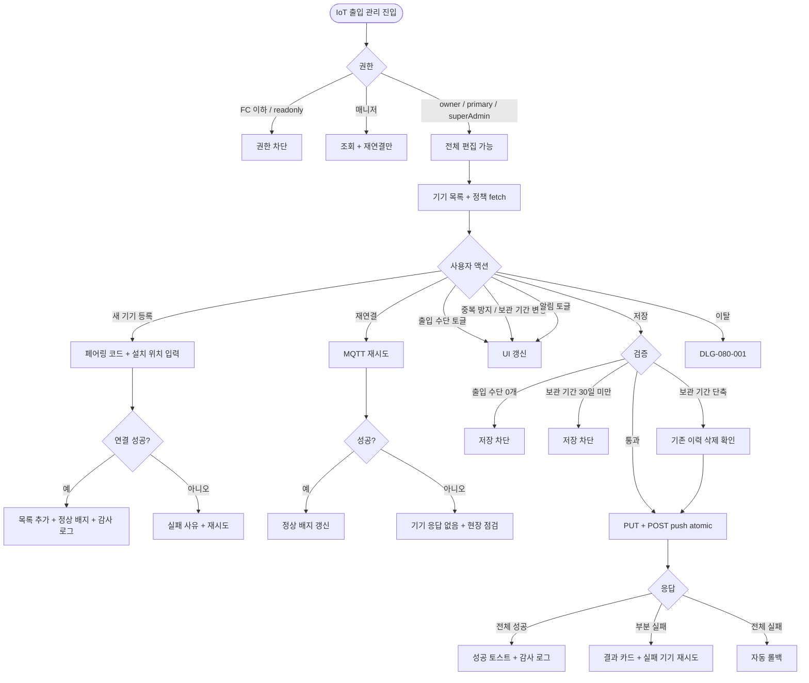
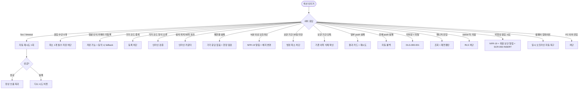

# SCR-083 IoT 출입 관리 페이지

## 1. 화면 메타 정보

이 문서는 IoT 출입 관리 페이지에 대한 자기완결형 요구사항 정의서입니다. 다른 문서를 함께 보지 않아도 이 문서 한 장만으로 IoT 출입 관리 페이지에 들어가는 모든 영역, 모든 버튼, 모든 모달, 모든 권한, 모든 예외 처리, 그리고 이 화면을 지탱하는 운영 정책까지 전부 이해하고 구현할 수 있도록 작성합니다.

| 항목 | 값 |
|---|---|
| 작성일 | 2026-05-22 |
| 버전 | v1.0 |
| 상태 | 최신 통합본 반영 (정합화 완료) |
| 도메인 | D09 설정관리 |
| 화면 ID | SCR-083 |
| 화면명 | IoT 출입 관리 |
| 화면 유형 | 기기 관리 화면 (Device Management Screen) |
| 라우트 (URL) | `/settings/iot` (SCR-082A 키오스크 IoT 설정과 동일 페이지의 탭) |
| 플랫폼 | 데스크톱(기본), 태블릿 |
| 우선순위 | P0 (출시 필수) |
| 기능코드 | IoT-02 (IoT 출입 관리) |
| 계약 상태 | 계약 범위 본기능 |
| 부모 기능 prefix | IoT |
| Lv1 코드 | IoT-02 |
| Lv2 / Lv3 세분화 | IoT-02-01 ~ IoT-02-06 (연결 기기 현황·새 기기 등록·출입 방식·출입 알림·저장·출입 이력 조회) |
| 연계 화면 | SCR-082 키오스크설정, SCR-093 출입 이력, SCR-052 RFID, SCR-086 출석관리설정, SCR-097 감사로그 |
| 호출 다이얼로그 | DLG-080-001 미저장경고 |

## 2. 화면 개요와 목적

IoT 출입 관리 페이지는 센터의 출입 게이트와 출입 인증 장치(스마트 밴드 RFID·QR 스캐너·얼굴 인식 카메라·핀번호 패드)를 등록·관리하고, 출입 방식·중복 방지·이력 보관·알림 정책을 한 화면에서 설정하는 운영 화면입니다. SCR-082A가 키오스크 단말기에 부착되는 IoT를 다룬다면, 이 화면은 센터 출입 게이트 자체를 관리합니다. 4종 출입 수단의 활성화 토글, 동일 회원의 재입장 어뷰징을 막는 중복 방지 시간(5/10/30/60분), 비정상 출입 시도(미등록 카드·만료 회원·얼굴 미일치·시간외 시도)에 대한 자동 알림으로 보안을 강화합니다. 기기 연결 상태 3종(정상/오프라인/오류)이 배지로 표시되어 운영자가 즉시 상황을 파악할 수 있으며, 오프라인 기기는 5분 헬스체크 기반 자동 재연결이 시도되고 N분 이상 지속되면 운영자 알림이 발송됩니다.

운영 흐름은 다양합니다. 신규 게이트를 설치한 직후 운영자가 [+ 새 기기 등록]으로 제조사 발급 기기 코드와 설치 위치(예: "1층 입구")를 입력해 등록하고 즉시 정상 배지를 확인합니다. 매니저가 오프라인 기기를 발견하면 [재연결] 버튼으로 MQTT 재시도를 트리거하고, 실패 시 현장 점검을 안내받습니다. 본사 슈퍼관리자가 어뷰징 방지 정책을 강화할 때 중복 출입 방지 시간을 30분으로 상향하면 즉시 적용되어 같은 회원의 연속 입장을 차단합니다. 비정상 출입 시도가 누적되면 SCR-093 출입 이력에서 시간대와 기기 위치를 분석해 보안 사고를 사전에 차단합니다. 얼굴 인식 카메라를 추가 등록한 후 IoT-01 키오스크 설정에서 얼굴 인식 출석 방식을 활성하면, 출석 방식이 다양화됩니다. 법정 보관 기간(최소 30일)을 준수하기 위해 출입 이력 보관 기간을 정책에 맞게 설정하며, 회원앱 입퇴장 푸시 ON으로 회원이 본인 출입 이력을 즉시 확인할 수 있게 합니다.

핵심 정책은 다음과 같습니다. 첫째, 출입 수단은 최소 1개 활성이 필수이며 모두 비활성 저장이 차단됩니다. 둘째, 출입 이력 보관 기간은 법정 최소 30일 이상이어야 합니다. 셋째, 비정상 출입 시도는 NFR-19 알림 센터로 즉시 알림됩니다. 넷째, 저장 시 DB와 기기 MQTT push가 atomic 트랜잭션으로 묶입니다. 다섯째, 모든 변경은 SCR-097 감사 로그에 기록됩니다.

## 3. 진입 경로와 인접 화면

이 화면에 진입하는 경로는 사이드바의 "설정 > IoT 출입 관리" 메뉴가 가장 일반적입니다. owner와 superAdmin/primary에게 메뉴가 노출되며, 매니저는 조회만 가능합니다. FC 이하는 메뉴 자체가 보이지 않습니다.

두 번째 경로는 SCR-082 키오스크 설정에서 얼굴 인식 활성 시 "출입 카메라 등록 화면으로 이동" 안내를 누르는 경우입니다. 세 번째 경로는 알림 센터의 "IoT 기기가 N분 이상 오프라인입니다" 또는 "비정상 출입 시도 감지" 알림을 누르는 경우입니다. 네 번째 경로는 SCR-093 출입 이력 화면에서 "출입 정책 변경" 링크를 누르는 경우입니다.

이 화면에서 빠져나가는 인접 화면으로는 SCR-082 키오스크 설정(얼굴 인식 출석 활성화), SCR-082A 키오스크 IoT 설정(키오스크 부착 IoT 관리), SCR-093 출입 이력(실제 출입 기록 조회·필터·내보내기), SCR-052 RFID(스마트 밴드 매핑 관리), SCR-086 출석 관리 설정(자동 출석 처리 정책), SCR-097 감사 로그가 있습니다.

## 4. 레이아웃과 UI 구성

IoT 출입 관리 페이지는 위에서 아래로 차곡차곡 쌓이는 세로형 단일 컬럼 레이아웃을 기본으로 하며, 좌우 폭이 충분한 데스크톱을 우선합니다.

가장 위에는 페이지 헤더가 있습니다. 헤더 좌측에는 "IoT 출입 관리" 페이지 타이틀과 함께 연결 기기 수 요약("연결 5대 / 전체 6대")이 배지로 표시됩니다. 헤더 우측에는 [변경 사항 저장] 버튼이 있으며, 출입 방식·중복 방지·보관 기간·알림 토글에 변경이 있을 때만 활성됩니다. 본사 슈퍼관리자가 통합 모드에서 진입한 경우 지점 컨텍스트 드롭다운이 추가로 표시됩니다.

페이지 헤더 바로 아래에는 연결 기기 현황 카드가 있습니다. 정상·오프라인·오류 기기 수가 색상으로 구분된 큰 숫자와 함께 표시되며, "오프라인 기기는 5분 헬스체크로 자동 재연결됩니다"라는 안내가 함께 표시됩니다.

그 아래에는 연결 기기 테이블이 있습니다. 컬럼은 기기명·설치 위치·연결 상태·마지막 통신 시각·기기 종류(RFID/QR/얼굴 인식 카메라/핀번호 패드)·액션([재연결] / [상세]) 순서로 배치됩니다. 테이블 상단에 [+ 새 기기 등록] 버튼이 있고, 누르면 페어링 모달이 열려 기기 코드와 설치 위치를 입력합니다. 각 행의 연결 상태 배지는 정상(녹색)·오프라인(주황)·오류(빨강) 세 가지로 명확히 구분되어 운영자가 한눈에 식별할 수 있습니다.

연결 기기 테이블 아래에는 출입 방식 설정 섹션이 있습니다. 스마트 밴드(RFID)·QR코드 스캔·얼굴 인식·핀번호 입력 네 가지 출입 수단이 토글과 함께 나열되며, 그 아래에 중복 출입 방지 시간 라디오(5분/10분/30분/60분)와 출입 이력 보관 기간 드롭다운(30일/90일/1년/영구)이 배치됩니다. 보관 기간 30일 미만 선택은 차단되며, 법정 최소 30일 안내가 함께 표시됩니다.

그 아래에는 출입 알림 설정 섹션이 있습니다. 입장 알림(회원앱 푸시)·퇴장 알림(회원앱 푸시)·비정상 출입 시도 알림(관리자) 세 가지 토글이 나열됩니다. 입장·퇴장 알림 ON 시 회원이 본인의 출입 이력을 즉시 푸시로 받게 되고, 비정상 시도 알림 ON 시 운영자(owner/manager)가 NFR-19 알림 센터로 즉시 알림을 받습니다.

페이지 최하단에는 액션 풋바가 fixed로 떠 있으며, [변경 사항 저장] / [변경 취소] 두 버튼이 우측에 배치됩니다.

## 5. 탭 구성과 탭별 동작

이 화면은 탭 구조가 없는 단일 페이지로, 연결 기기 현황·출입 방식 설정·출입 알림 설정 세 개의 섹션이 세로로 펼쳐집니다. 출입 이력 조회는 별도 화면(SCR-093)에서 처리되므로 이 화면에서는 진입 링크만 제공됩니다.

매니저로 진입한 경우 기기 목록은 조회 가능하지만 [재연결] 외의 모든 액션은 비활성됩니다. 출입 방식·알림 토글도 비활성 상태로 표시되며 저장 버튼은 hidden 처리됩니다.

본사 슈퍼관리자가 통합 모드에서 다른 지점을 선택하면 그 지점의 IoT 기기와 정책이 다시 fetch됩니다. 미저장 변경이 있는 경우 DLG-080-001이 먼저 표시됩니다.

## 6. 버튼·아이콘·링크 액션 전체 정의

페이지 헤더의 [변경 사항 저장] 버튼은 변경이 한 건 이상 있을 때만 활성되며, 누르면 DB 저장과 기기 MQTT push가 atomic 트랜잭션으로 실행됩니다. 전체 성공이면 성공 토스트, 부분 실패면 실패 기기 목록과 재시도 버튼, 전체 실패면 자동 롤백과 실패 토스트가 표시됩니다.

연결 기기 현황 카드의 "오프라인 기기 보기" 링크는 테이블에서 오프라인 기기만 필터링한 상태로 스크롤됩니다.

[+ 새 기기 등록] 버튼은 페어링 모달을 열어 제조사 발급 기기 코드와 설치 위치를 입력받습니다. 기기 코드는 unique 형식이며, 중복 등록은 차단됩니다. 설치 위치는 자유 텍스트(예: "1층 입구·B1 출구·여성 탈의실") 50자 이내입니다. 연결 시도 성공 시 정상 배지로 테이블에 추가됩니다.

각 행의 [재연결] 버튼은 그 기기에 MQTT 재연결 시도를 트리거합니다. 성공 시 정상 배지로 갱신되고, 실패 시 "기기 응답 없음" 안내와 함께 현장 점검 권고가 표시됩니다.

[상세] 액션은 그 기기의 펌웨어 버전·등록 일시·최근 출입 통계 같은 부가 정보를 보여주는 패널을 엽니다. 매니저는 상세 조회까지만 가능합니다.

출입 방식 섹션의 토글들은 누르면 즉시 UI 상태만 바뀌고, 실제 출입 정책은 저장 후에 적용됩니다. 출입 방식을 모두 비활성한 채 저장을 시도하면 "최소 1개 출입 수단 활성 필수" 안내와 함께 저장이 차단됩니다.

중복 출입 방지 시간 라디오는 5/10/30/60분 중 하나를 선택하며, 보관 기간 드롭다운은 30일/90일/1년/영구 중 선택합니다. 보관 기간을 단축하면 "기존 출입 이력 중 {대상건수}건이 즉시 삭제됩니다" 확인 모달이 표시되어 운영자가 확정해야 합니다.

출입 알림 토글들은 누르면 즉시 UI 변경되고 저장 후 알림 정책이 적용됩니다. 회원앱 푸시 ON 시 NFR-19 알림 채널을 사용해 회원에게 본인 출입 푸시가 발송됩니다.

[변경 취소] 버튼은 마지막 저장 시점으로 모든 입력을 되돌리며, 한 번 더 확인이 표시됩니다.

모든 버튼은 클릭 후 응답이 돌아오기 전까지 자동으로 비활성화됩니다.

## 7. 호출되는 모달 동작

### 7-1. DLG-080-001 미저장 경고 다이얼로그

이 화면에서 호출되는 모달은 DLG-080-001 미저장 경고 하나입니다. 출입 방식·중복 방지·보관 기간·알림 토글에 변경이 있는 상태에서 페이지를 떠나려고 하거나, 본사 슈퍼관리자가 다른 지점을 선택하려고 할 때 트리거됩니다. [저장] / [이탈] / [취소] 세 버튼이 제공됩니다.

기기 등록·재연결·상세 조회는 별도 트랜잭션으로 처리되므로 이 모달과는 독립적으로 동작합니다.

## 8. 토스트와 확인 팝업과 알럿

성공 토스트는 "정책이 저장되었습니다 — N대 즉시 반영", "기기가 등록되었습니다", "재연결되었습니다" 같은 짧은 문구로 표시됩니다.

실패 토스트는 "저장에 실패했습니다", "기기 등록에 실패했습니다", "재연결에 실패했습니다" 같은 문구와 함께 다시 시도 또는 현장 점검 안내가 따라옵니다.

부분 실패 안내는 결과 카드 형태로 화면 중앙 하단에 표시됩니다. "기기 N대 중 M대 push 실패" 형식이며 실패 기기 목록과 재시도 버튼이 제공됩니다.

확인 팝업은 [변경 취소] 시, 보관 기간 단축으로 기존 이력이 즉시 삭제될 때 표시됩니다.

알럿은 권한이 없는 계정이 직접 URL로 접근했을 때 차단 표시됩니다.

비정상 출입 시도 알림은 NFR-19 알림 센터에서 실시간으로 푸시되며, 알림을 누르면 SCR-093 출입 이력 화면으로 이동해 상세를 추적할 수 있습니다.

## 9. 데이터 흐름과 외부 연동

화면 진입 시 `GET /api/iot/devices`로 기기 목록과 연결 상태가 fetch되고, `GET /api/iot/access-policy`로 출입 방식·중복 방지·보관 기간·알림 설정이 fetch됩니다.

새 기기 등록은 `POST /api/iot/devices`로 처리됩니다. 페어링 코드 검증과 연결 시도가 동기적으로 실행되며, 성공 시 정상 배지로 테이블에 추가됩니다.

기기 삭제는 별도 액션(이 화면에서는 다루지 않음, SCR-083 V2에서 처리)이며, 본 문서에서는 등록과 재연결만 포함합니다.

재연결은 `POST /api/iot/devices/:id/reconnect`로 MQTT 재시도를 트리거합니다.

정책 저장은 `PUT /api/iot/access-policy`로 처리되며, 응답 성공 시 `POST /api/iot/access-policy/push`로 모든 연결 기기에 정책이 push됩니다. DB 저장과 기기 push는 atomic 트랜잭션으로 묶입니다.

기기 헬스체크는 5분 간격으로 실행되어 통신 상태를 갱신합니다. 일정 시간 이상 오프라인 지속 시 NFR-19 알림 센터로 운영자 알림이 발송됩니다.

출입 이벤트는 회원이 게이트에 카드 태그·QR 스캔·얼굴 인식·핀번호 입력을 할 때 발생하며, SCR-093 출입 이력에 INSERT됩니다. 비정상 출입 시도(미등록 카드·만료 회원·얼굴 미일치·시간외 시도)는 별도 플래그와 함께 INSERT되고, 운영자에게 NFR-19 알림 + 회원 본인에게 보안 알림이 발송됩니다.

회원앱 입장·퇴장 푸시는 NFR-19 알림 채널을 사용하며, 회원의 푸시 수신 동의 여부에 따라 발송 여부가 결정됩니다.

자동 삭제 배치는 매일 02:00에 실행되어 보관 기간을 초과한 출입 이력을 삭제합니다. 보관 기간 단축 시에는 즉시 삭제 트랜잭션이 별도로 실행됩니다.

기기 펌웨어 업데이트는 본사 OTA로 일괄 진행되며, 업데이트 중 일시 오프라인 상태가 되었다가 자동 재연결됩니다.

회원 만료 이벤트는 IoT 정책에 즉시 반영되어 만료 회원의 입장이 차단됩니다.

IoT-01 키오스크 설정과의 연계: 얼굴 인식 카메라가 이 화면에 등록되면 SCR-082에서 얼굴 인식 출석 방식을 활성화할 수 있게 됩니다.

모든 변경은 SCR-097 감사 로그에 actor·diff JSON·timestamp로 INSERT됩니다.

화면에서 호출하는 주요 API는 `GET /api/iot/devices`, `POST /api/iot/devices`, `POST /api/iot/devices/:id/reconnect`, `DELETE /api/iot/devices/:id`, `GET /api/iot/access-policy`, `PUT /api/iot/access-policy`, `GET /api/iot/access-history`, `POST /api/iot/access-policy/push`입니다.

## 10. 화면 상태와 예외 처리

로딩 중 상태에서는 기기 테이블과 정책 입력 자리에 스켈레톤이 표시됩니다.

기본 상태는 200 응답과 함께 기기 목록과 정책이 모두 채워진 상태입니다. 저장 버튼은 비활성이며 기기 상태 배지는 색상으로 구분되어 표시됩니다.

수정 중 상태는 정책에 변경이 발생한 상태로, 저장 버튼이 활성됩니다. 기기 등록·재연결은 별도 트랜잭션이므로 수정 중 상태와는 독립적으로 동작합니다.

기기 재연결 중 상태는 행에 스피너가 표시되고 응답을 기다립니다.

기기 미등록 상태는 등록된 기기가 0대일 때 표시됩니다. "등록된 기기가 없습니다" 안내와 함께 [+ 새 기기 등록] CTA가 노출됩니다.

일부 오프라인 상태는 한 대 이상이 오프라인일 때 표시되며, 연결 기기 현황 카드의 오프라인 숫자가 주황 색상으로 강조됩니다.

일부 오류 상태는 한 대 이상이 오류일 때 표시되며, 오류 사유가 행의 마지막 통신 시각 옆에 함께 노출됩니다.

저장 중 상태는 액션 풋바 버튼이 비활성되고 스피너가 표시됩니다.

저장 완료 상태는 성공 토스트와 함께 기기 push 결과가 표시됩니다.

부분 push 실패 상태는 화면 중앙 하단의 결과 카드로 실패 기기 목록과 재시도 버튼이 노출됩니다.

권한 부족 상태는 매니저로 진입한 경우 정책 토글이 비활성되고 저장 버튼이 hidden 처리됩니다. FC 이하 진입 시 화면 자체가 차단됩니다.

예외 케이스별 처리는 다음과 같습니다.

출입 수단을 모두 비활성한 채 저장을 시도하면 "최소 1개 출입 수단 활성 필수" 안내와 함께 저장이 차단됩니다.

얼굴 인식 활성 시 카메라가 등록되어 있지 않으면 "카메라 등록 화면으로 이동" 링크가 인라인으로 표시됩니다. 저장은 가능하지만 실제 동작 시 fallback이 적용됩니다.

기기 코드를 중복 등록하려고 하면 "이미 등록된 기기 코드입니다" 안내와 함께 등록이 차단됩니다.

기기 코드 형식 오류는 인라인 검증으로 차단됩니다.

설치 위치 50자 초과는 인라인 카운터로 차단됩니다.

재연결 시도 실패는 "기기 응답 없음" 안내와 함께 현장 점검 권고가 표시됩니다.

N분 이상 오프라인 지속 기기는 오렌지 배지로 표시되며 NFR-19 알림 센터로 운영자 알림이 발송됩니다.

보관 기간 30일 미만 선택은 "법정 최소 30일" 안내와 함께 차단됩니다.

보관 기간 단축 시 기존 이력 즉시 삭제 경고가 확인 모달로 표시됩니다.

저장 push 부분 실패는 결과 카드와 재시도 버튼이 노출됩니다. 전체 실패는 atomic 트랜잭션으로 자동 롤백됩니다.

미저장 변경 + 페이지 이탈 시 DLG-080-001이 강제 표시됩니다.

매니저로 진입하면 정책 토글이 비활성되고 저장 버튼이 hidden 됩니다.

owner가 다른 지점 기기에 접근하려고 하면 RLS branchId 필터로 행이 hidden 처리됩니다.

비정상 출입 시도가 누적되면 NFR-19 알림이 운영자에게 발송되고, 회원 본인에게는 보안 알림이 발송됩니다.

기기 펌웨어 업데이트 중에는 일시 오프라인 배지가 표시되고 자동 재연결됩니다.

권한 부족 (FC 이하) 진입 시 사이드바 메뉴 자체가 hidden 됩니다.

## 11. 권한별 처리

superAdmin와 primary는 모든 기능을 사용할 수 있습니다. 본사 통합 모드에서 다른 지점의 IoT 기기와 정책을 자유롭게 편집할 수 있으며, 모든 액션이 가능합니다.

Owner(지점장)은 자기 지점의 IoT 기기와 정책을 편집할 수 있습니다. RLS branchId 필터로 다른 지점의 기기는 행 자체가 hidden 처리됩니다. 새 기기 등록·재연결·정책 변경이 모두 가능합니다.

매니저(manager)는 기기 연결 상태를 조회할 수 있고 [재연결] 버튼만 사용할 수 있습니다. 출입 방식·중복 방지·보관 기간·알림 토글은 비활성 상태로 표시되며 저장 버튼은 hidden 됩니다. 새 기기 등록도 불가능합니다.

FC(fc), 트레이너(trainer), 스태프(staff), 프런트(front), 읽기 전용(readonly)은 이 화면에 접근할 수 없습니다. 사이드바 메뉴 자체가 보이지 않습니다.

권한 외에 운영 옵션에 따라 일부 영역이 달라질 수 있습니다. 신규 센터에서 기기가 0대일 때는 등록 가이드 영역이 강조됩니다.

## 12. 메인 흐름

## 13. 에러와 예외 흐름

## 14. 핵심 디자인 요청사항

연결 기기 현황 카드는 페이지 상단에 가로 폭을 모두 차지하며, 정상·오프라인·오류 기기 수가 큰 숫자와 색상(녹색/주황/빨강)으로 멀리서도 식별 가능해야 합니다. 카드 우측에는 마지막 헬스체크 시각이 작은 글씨로 표시되어 데이터 신선도가 보입니다.

기기 테이블은 행 단위로 연결 상태 배지가 좌측 또는 우측에 시각적으로 강조되며, 오프라인·오류 기기는 행 전체 톤이 약하게 색상으로 물들어 일별이 쉬워야 합니다.

[+ 새 기기 등록] 버튼은 테이블 상단 우측에 강한 강조 색상으로 표시되어 신규 설치 시 즉시 진입할 수 있도록 합니다.

출입 방식 토글은 4개가 카드형 그리드로 배치되어 각 수단이 어떤 회원에게 적용되는지 짧은 설명과 함께 표시됩니다. 토글 ON 시 강조 색상이 적용되어 활성 상태가 즉시 보입니다.

중복 출입 방지 시간 라디오는 5/10/30/60분의 4개 옵션이 가로로 동일 크기로 배치되어 한눈에 비교 가능합니다.

보관 기간 드롭다운에는 "법정 최소 30일" 안내가 옵션 옆에 작게 표시되어 운영자가 정책을 이해하도록 돕습니다.

출입 알림 토글은 회원앱 푸시와 운영자 알림이 시각적으로 구분되어, 어느 토글이 누구에게 영향을 주는지 즉시 알 수 있어야 합니다.

부분 push 실패 결과 카드는 화면 중앙 하단에 떠 있는 형태로 디자인되며 실패 기기 목록과 재시도 버튼이 한눈에 보입니다.

매니저로 진입한 경우 비활성 입력의 톤이 회색으로 통일되어 "조회만 가능" 상태가 일관되게 인식되어야 합니다.

액션 풋바는 fixed로 떠 있어 페이지를 길게 스크롤해도 저장 버튼에 항상 접근 가능합니다.

## 15. 운영 정책 (이 화면에 연결된 부분)

출입 수단은 스마트 밴드(RFID)·QR코드 스캔·얼굴 인식·핀번호 입력 4종이며, 다중 활성을 허용하되 최소 1개 활성이 필수입니다. 모두 비활성 저장은 차단되어 센터가 출입 통제를 잃지 않도록 보호합니다.

중복 출입 방지 시간은 동일 회원의 연속 입장을 차단해 어뷰징을 방지하는 정책입니다. 5/10/30/60분 옵션 중 선택하며, 운영 정책에 따라 본사 슈퍼관리자가 강화할 수 있습니다.

출입 이력 보관 기간은 법정 최소 30일 이상이어야 합니다. 개인정보보호법에 따른 최소 보관 의무이며, 30일 미만은 시스템적으로 차단됩니다. 보관 기간을 단축하면 기존 이력 중 초과분이 즉시 삭제되므로 변경 전 확인 모달로 운영자에게 영향을 안내합니다.

비정상 출입 시도(미등록 카드·만료 회원·얼굴 미일치·시간외 시도)는 관리자에게 즉시 알림(NFR-19)됩니다. 비정상 시도 알림 ON 시 운영자(owner/manager)가 알림을 받고, 회원 본인에게는 보안 알림이 별도로 발송됩니다.

오프라인 기기는 5분 헬스체크 기반 자동 재연결이 시도됩니다. N분(테넌트 정책) 이상 오프라인이 지속되면 NFR-19 알림 센터로 운영자 알림이 발송되어 현장 점검이 안내됩니다.

기기 코드는 제조사 발급 unique 코드이며, 등록 시 형식 검증과 중복 차단이 적용됩니다.

연결 상태 3종은 정상(통신 정상)·오프라인(N분 무응답)·오류(인증 실패 또는 하드웨어 오류)로 구분됩니다.

얼굴 인식 활성 조건은 얼굴 인식 카메라가 1대 이상 등록·정상 상태인 것입니다. 미충족 상태에서 저장은 가능하지만 실제 동작 시 fallback(QR·회원번호 등으로 전환)이 적용됩니다.

회원앱 푸시 정책은 입장·퇴장 알림 ON 시 회원에게 본인 출입 이력 푸시가 발송되는 것입니다. NFR-19 알림 채널이 사용되며, 회원의 푸시 수신 동의 여부에 따라 발송 여부가 결정됩니다.

권한 정책은 owner와 superAdmin/primary가 모든 기능을 사용하고, 매니저는 조회와 [재연결]만 가능하며, FC 이하는 화면에 접근할 수 없습니다. 본사 통합 모드는 superAdmin/primary에게만 활성됩니다.

저장 시점 동기화 트랜잭션 정책은 DB 저장과 기기 MQTT push가 atomic 처리되어야 한다는 점입니다. 부분 실패는 실패 기기 목록과 재시도 버튼이, 전체 실패는 자동 롤백이 적용됩니다.

출입 이력은 별도 화면(SCR-093)에서 조회·필터(회원·기기·기간·정상/비정상)·CSV 내보내기가 가능합니다. 이 화면은 정책 설정에 집중하고, 실제 이력 조회는 SCR-093이 담당합니다.

법정 보관 정책에 따라 보관 기간 경과 시 매일 02:00 자동 삭제 배치가 동작합니다. 보관 기간 단축 시에는 즉시 삭제 트랜잭션이 별도로 실행됩니다.

MQTT/WebSocket 채널은 출입 정책 변경 시 모든 기기에 신호 push를 담당합니다. 미연결 기기는 다음 connect 시점에 자동으로 최신 정책을 fetch합니다.

기기 펌웨어 업데이트는 본사 OTA로 일괄 진행되며, 업데이트 중 일시 오프라인 상태가 자동 재연결을 거쳐 정상 상태로 복구됩니다. 운영자의 별도 조작은 필요하지 않습니다.

회원 만료 이벤트는 IoT 정책에 즉시 반영됩니다. 만료 회원의 입장은 자동으로 차단되며, 차단 이벤트는 SCR-093 출입 이력에 INSERT되어 사후 추적이 가능합니다.

IoT-01 키오스크 설정과의 연계는 얼굴 인식 카메라가 이 화면에 등록되어 정상 상태가 되어야 SCR-082에서 얼굴 인식 출석 방식을 안정적으로 활성할 수 있다는 점입니다. 양 화면은 데이터 source-of-truth를 공유합니다.

미저장 변경 + 페이지 이탈 시 DLG-080-001이 강제 표시되어 변경 손실을 막습니다.

모든 변경은 SCR-097 감사 로그에 actor·diff JSON·timestamp로 INSERT되며, 5초 안에 감사 로그 화면에서 조회 가능합니다.

이상의 모든 정책은 이 화면을 구현하고 운영하는 사람이 별도 문서 없이 이 한 장만 보면 이해할 수 있도록 풀어 적었습니다. 정책이 바뀌면 이 문서가 함께 갱신되어야 하며, 코드 변경과 정책 변경은 항상 짝지어 진행됩니다.
