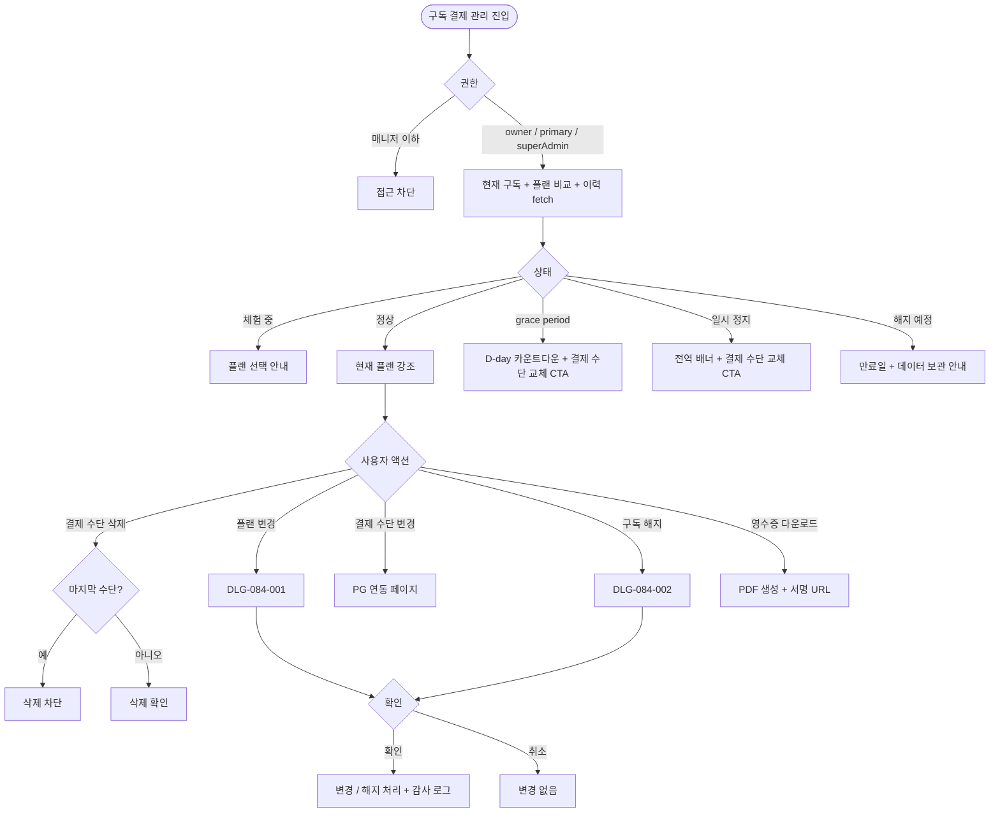
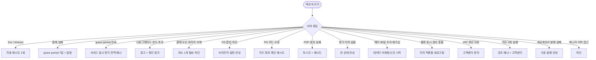

# SCR-084 구독 결제 관리 페이지

## 1. 화면 메타 정보

이 문서는 구독 결제 관리 페이지에 대한 자기완결형 요구사항 정의서입니다.

| 항목 | 값 |
|---|---|
| 작성일 | 2026-05-22 |
| 버전 | v1.0 |
| 상태 | 최신 통합본 반영 (정합화 완료) |
| 도메인 | D09 설정관리 |
| 화면 ID | SCR-084 |
| 화면명 | 구독 결제 관리 |
| 화면 유형 | 구독/결제 화면 (Billing Screen) |
| 라우트 (URL) | `/subscription` |
| 플랫폼 | 데스크톱(기본), 태블릿 |
| 우선순위 | P0 (출시 필수) |
| 기능코드 | SET-03 (구독 결제 관리) |
| 계약코드 | SET-03 |
| 계약 상태 | 계약 범위 본기능 |
| 부모 기능 prefix | SET |
| Lv1 코드 | SET-03 |
| Lv2 / Lv3 세분화 | SET-03-01 ~ SET-03-06 (현재 구독·플랜 비교·결제 수단·청구 이력·플랜 변경·구독 해지) |
| 연계 화면 | SCR-080 센터설정, SCR-097 감사로그 |
| 호출 다이얼로그 | DLG-084-001 플랜변경확인, DLG-084-002 구독해지확인 |

## 2. 화면 개요와 목적

구독 결제 관리 페이지는 센터가 사용 중인 Pando 서비스 구독 플랜과 결제 수단을 확인하고 변경하는 비즈니스 인프라 관리 화면입니다. 현재 플랜 정보·다음 결제 예정일·플랜 비교 카드·결제 수단·청구 이력·영수증 다운로드가 한 화면에 모여 있으며, 플랜 업그레이드와 다운그레이드는 즉시 또는 다음 결제일부터 적용되는 정책에 따라 처리됩니다.

운영 흐름은 다음과 같습니다. 무료 체험 종료 D-3 알림을 받은 Owner(지점장)이 플랜을 선택하고 결제 수단을 등록해 자동 갱신을 활성합니다. 회원 수 한도 95% 도달 배너를 클릭한 운영자가 상위 플랜으로 업그레이드하면 즉시 적용되며 잔여 기간 일할 차액이 청구됩니다. 비수기 비용 절감 목적으로 하위 플랜으로 다운그레이드하면 다음 결제일부터 적용되며, 데이터 한도 초과 시 경고가 표시됩니다. 결제 실패 시 7일 grace period 동안 수단 교체로 복구할 수 있고, 7일이 초과되면 서비스가 일시 정지되어 전역 배너가 노출됩니다. 구독 해지 후 90일 이내 재가입하면 이전 데이터 복구가 가능하며, 90일 초과 시에는 데이터가 영구 삭제되어 신규 시작합니다.

핵심 정책은 다음과 같습니다. 첫째, 매니저 이하는 재무 정보 보호를 위해 이 화면에 접근할 수 없습니다. 둘째, PG 카드 정보는 토큰으로만 저장되며 Pando 서버에는 카드 마지막 4자리와 카드사만 보관됩니다. 셋째, 청구 이력은 법적 보관 의무(5년)에 따라 영구 보관됩니다. 넷째, 모든 변경은 SCR-097 감사 로그에 기록됩니다.

## 3. 진입 경로와 인접 화면

이 화면에 진입하는 경로는 사이드바의 "설정 > 구독 결제 관리"가 가장 일반적이며, owner와 superAdmin/primary에게만 노출됩니다. 두 번째 경로는 결제 실패 알림 또는 무료 체험 만료 알림을 누르는 경우, 세 번째는 회원 수 한도 임박 배너의 [업그레이드] CTA, 네 번째는 청구 이력 PDF 링크 알림입니다.

인접 화면은 SCR-080 센터 설정(VAT·사업자 등록 정보 연계), SCR-097 감사 로그입니다.

## 4. 레이아웃과 UI 구성

페이지 헤더에는 "구독 결제 관리" 타이틀과 현재 구독 상태 배지(체험 중·정상·grace period·일시 정지·해지 예정·해지 완료)가 표시됩니다. grace period나 일시 정지 상태에서는 페이지 상단에 빨강·노랑 톤의 전역 경고 배너가 표시되며, D-day 카운트다운과 [결제 수단 교체] CTA가 함께 노출됩니다.

본문 가장 위에는 현재 구독 정보 카드가 있습니다. 현재 플랜명, 주요 혜택 요약(5~10개), 다음 결제 예정일, 다음 결제 금액(VAT 포함)이 큰 글자로 표시되고, 카드 우측에 [플랜 변경] / [구독 해지] 액션 버튼이 배치됩니다.

그 아래에는 플랜 비교 섹션이 있습니다. 이용 가능한 전체 플랜이 카드 형태로 가로 배치되며, 각 카드에는 포함 기능·월 요금·회원 수 한도가 표시됩니다. 현재 플랜에는 강조 배지가 붙고, 다른 플랜 카드에는 [이 플랜으로 변경] CTA가 표시됩니다. 현재 회원 수가 하위 플랜 한도를 초과하는 경우 그 카드에 "데이터 한도 초과" 경고 배지가 함께 표시됩니다.

플랜 비교 아래에는 결제 수단 관리 영역이 있습니다. 카드사·카드번호 마지막 4자리·유효기간이 카드 형태로 표시되고, [결제 수단 변경] / [삭제] 액션이 제공됩니다. 결제 수단이 한 개도 없으면 "결제 수단을 등록해주세요" 안내와 [등록] CTA가 표시됩니다.

페이지 하단에는 청구 이력 테이블이 있습니다. 컬럼은 날짜·플랜명·금액(VAT 포함)·상태(결제 완료·실패·환불·미수)·영수증([PDF 다운로드])입니다. 기간 필터는 최근 3개월·6개월·1년이며, 상태 필터로 실패/미수만 모아 볼 수 있습니다.

## 5. 탭 구성과 탭별 동작

이 화면은 탭 구조 없이 위에서 아래로 섹션이 펼쳐집니다. 청구 이력 테이블의 기간 필터와 상태 필터가 1차 분기 역할을 합니다.

## 6. 버튼·아이콘·링크 액션 전체 정의

[플랜 변경] 버튼 또는 플랜 카드의 [이 플랜으로 변경] CTA는 DLG-084-001 플랜 변경 확인 다이얼로그를 호출합니다. 변경 후 차액과 적용 시점, 다운그레이드 시 데이터 한도 초과 경고가 함께 표시됩니다.

[구독 해지] 버튼은 DLG-084-002 구독 해지 확인 다이얼로그를 호출합니다. 만료 일시와 데이터 보관 정책(90일)이 함께 안내됩니다.

[결제 수단 변경] 버튼은 PG사 연동 페이지를 별도 창으로 엽니다. 새 카드 등록 후 자동 갱신이 활성화됩니다. 팝업 차단 상태이면 "팝업 차단을 해제해주세요" 모달이 표시됩니다.

[삭제] 버튼은 결제 수단이 마지막 한 개인 경우 "구독 중에는 최소 1개의 결제 수단이 필요합니다" 모달이 표시되어 삭제가 차단됩니다.

청구 이력의 [PDF 다운로드] 버튼은 영수증 PDF를 비동기로 생성해 서명된 URL로 다운로드합니다. URL은 1시간 유효합니다.

기간 필터와 상태 필터는 즉시 적용되어 테이블이 다시 fetch됩니다.

## 7. 호출되는 모달 동작

### 7-1. DLG-084-001 플랜 변경 확인

플랜 변경 확인 다이얼로그는 변경 후 차액·적용 시점·데이터 한도 초과 여부를 사전 안내합니다. 업그레이드는 즉시 적용 + 잔여 기간 일할 차액 청구, 다운그레이드는 다음 결제일부터 적용 + 차액 환급 없음 + 데이터 한도 초과 경고가 표시됩니다. 운영자가 확인하면 변경이 처리되고 감사 로그에 기록됩니다.

### 7-2. DLG-084-002 구독 해지 확인

구독 해지 확인 다이얼로그는 만료 일시·데이터 보관 정책(90일 후 영구 삭제)·grace period 정책을 안내합니다. 운영자가 확인하면 해지 예약이 등록되고 만료일까지는 서비스를 계속 이용할 수 있습니다.

## 8. 토스트와 확인 팝업과 알럿

성공 토스트는 "플랜이 변경되었습니다", "결제 수단이 변경되었습니다", "구독 해지가 예약되었습니다", "영수증 다운로드가 시작되었습니다" 같은 문구로 표시됩니다.

실패 토스트는 "결제 처리에 실패했습니다", "PDF 생성에 실패했습니다", "PG 연동 오류" 같은 문구와 함께 다시 시도 또는 고객센터 안내가 따라옵니다.

상단 경고 배너는 grace period 중 D-day 카운트다운과 [결제 수단 교체] CTA, 일시 정지 시 "서비스가 일시 정지되었습니다" 전역 배너로 표시됩니다.

확인 팝업은 결제 수단 삭제 시(마지막 수단인 경우), 다운그레이드 시 데이터 초과 경고에서 표시됩니다.

알럿은 권한 부족 시(매니저 이하 접근) 차단 표시됩니다.

## 9. 데이터 흐름과 외부 연동

화면 진입 시 `GET /api/subscription/current`로 현재 구독 정보, `GET /api/subscription/plans`로 플랜 목록, `GET /api/subscription/payment-method`로 결제 수단, `GET /api/subscription/invoices`로 청구 이력이 fetch됩니다.

플랜 변경은 `POST /api/subscription/change-plan`, 구독 해지는 `POST /api/subscription/cancel`, 결제 수단 등록은 `POST /api/subscription/payment-method`, 삭제는 `DELETE /api/subscription/payment-method`로 처리됩니다.

영수증 PDF는 `GET /api/subscription/invoices/:id/pdf`로 서명된 URL을 발급받아 다운로드합니다.

자동 갱신은 매 결제 예정일 00:00 KST에 등록된 PG 토큰으로 자동 청구가 실행됩니다. 실패 시 7일 grace period가 부여되고, 7일 내 수단 교체 시 소급 처리되며 초과 시 서비스 일시 정지로 전환됩니다.

세금계산서는 사업자 등록 고객의 경우 결제 성공 이벤트마다 국세청 전자 세금계산서 API로 자동 발행됩니다. VAT 10%가 표시 금액에 합산되어 청구됩니다.

데이터 삭제 배치는 구독 해지 후 90일 경과 시 센터 데이터를 영구 삭제하며, 삭제 7일 전 경고 메일이 발송됩니다.

플랜 한도 임박 알림은 회원 수가 한도 90%에 도달하면 Owner(지점장)에게 업그레이드 권유 알림이 발송됩니다.

체험 종료 알림은 무료 체험 만료 D-7/D-3/D-1에 자동 발송됩니다.

다운그레이드 데이터 초과 정리 배치는 다운그레이드 적용일 자정에 한도 초과 데이터(비활성 회원 우선)를 자동 아카이빙하고 운영자 리포트를 생성합니다.

청구 이력 PDF는 결제 성공 이벤트마다 비동기 생성되어 S3에 저장되며 다운로드 링크는 7일 유효합니다.

PG 카드 정보는 토큰으로만 PG사 측에 저장되며 Pando 서버에는 카드 마지막 4자리·카드사만 보관됩니다.

모든 플랜 변경·해지·결제 수단 변경은 SCR-097 감사 로그에 actor·before·after·timestamp로 INSERT됩니다.

## 10. 화면 상태와 예외 처리

기본·로딩·플랜 없음(미가입)·결제 수단 없음·grace period·서비스 일시 정지·해지 완료·해지 예정 등 다양한 상태를 가집니다.

예외 케이스: 플랜 없음·결제 수단 없음·결제 실패·grace period 만료 일시 정지·다운그레이드 데이터 한도 초과·결제 수단 마지막 삭제 차단·PG 팝업 차단·PG 카드 등록 실패·영수증 PDF 생성 실패·청구 이력 없음·해지 90일 초과 재가입·플랜 변경 동시 접속 충돌·VAT 계산 오류·미수 3회 실패·세금계산서 발행 실패·권한 부족 등 다수의 케이스가 각자의 안내 메시지와 후속 조치로 처리됩니다.

## 11. 권한별 처리

슈퍼관리자와 본사 최고관리자는 전체 구독 정보를 조회·관리·해지할 수 있습니다. 다중 지점 구독 상태도 통합 조회 가능합니다.

Owner(지점장)은 소속 지점의 구독을 조회·관리·해지할 수 있습니다.

매니저와 FC/트레이너/스태프/프런트/readonly는 이 화면에 접근할 수 없습니다(재무 정보 보호).

## 12. 메인 흐름

## 13. 에러와 예외 흐름

## 14. 핵심 디자인 요청사항

현재 구독 정보 카드는 페이지 상단에 가장 큰 비중으로 배치되며, 플랜명·다음 결제일·금액이 한눈에 들어와야 합니다.

플랜 비교 카드는 가로 그리드로 나란히 배치되어 가격·기능·한도가 시각적으로 비교 가능해야 합니다. 현재 플랜에는 강조 배지가, 회원 수 초과 플랜에는 경고 배지가 부착됩니다.

grace period 상태에서는 페이지 상단의 전역 배너가 노랑 톤으로, 일시 정지 상태에서는 빨강 톤으로 강조되어 운영자가 즉시 위기를 인지할 수 있어야 합니다. D-day 카운트다운은 큰 숫자로 표시됩니다.

청구 이력 테이블의 상태 배지는 결제 완료(녹색)·실패(빨강)·환불(주황)·미수(노랑)로 색상 구분되며, [PDF] 액션은 행 우측에 작게 배치됩니다.

## 15. 운영 정책 (이 화면에 연결된 부분)

플랜 업그레이드는 즉시 적용되며 잔여 기간 차액이 일할 계산되어 청구됩니다. 잔여 일수 × 플랜 간 일일 단가 차액 공식으로 계산됩니다.

플랜 다운그레이드는 다음 결제일부터 적용되며 선납 차액 환급은 없습니다. 다운그레이드 확정 전 현재 회원 수·데이터 용량이 하위 플랜 한도를 초과하면 경고가 표시되며, 미정리 시에도 다음 결제일 이후 자동 초과 데이터 정리 배치가 동작합니다.

구독 해지는 만료일까지 서비스를 이용할 수 있으며, 만료 후 90일 동안 데이터가 보관됩니다. 90일 경과 시 자동 삭제 배치로 영구 삭제되며, 삭제 7일 전 경고 메일이 발송됩니다.

자동 갱신은 매 결제 예정일 00:00 KST에 등록된 결제 수단으로 자동 청구됩니다.

결제 실패 시 7일 grace period가 부여되며, 그 기간 내 수단 교체 시 소급 처리됩니다. 7일 초과 시 서비스가 일시 정지되며, 전역 배너가 모든 화면(설정 화면 외)에 표시되어 결제 수단 교체가 유도됩니다.

미수 처리는 grace period 초과 후 서비스 정지 상태로 전환되며, 미수금 납부 확인 후 서비스가 즉시 복구됩니다.

VAT 정책은 청구 금액이 공급가 + 부가세 10% 합산 표기이며, 사업자 등록 고객은 전자 세금계산서가 자동 발행됩니다.

결제 수단은 구독 중 최소 1개가 보장되어야 하며, 마지막 결제 수단의 삭제는 차단됩니다.

재가입 데이터 복구 기간은 해지 후 90일 이내이며, 90일 초과 시 신규 시작입니다.

플랜별 회원 수 한도는 플랜 카드에 명시되며, 현재 회원 수가 하위 플랜 한도를 초과하면 해당 플랜 선택 시 경고 또는 차단이 적용됩니다.

청구 이력은 법적 보관 의무(5년)에 따라 영구 보관됩니다. 영구 삭제는 불가능합니다.

다중 지점 구독은 본사 슈퍼관리자가 통합 조회할 수 있으며, 개별 지점 과금은 지점 단위로 독립 청구됩니다.

PG 결제 토큰 보안 정책에 따라 카드 정보는 PG사 측에 토큰으로만 저장되고, Pando 서버에는 카드 마지막 4자리와 카드사만 보관됩니다.

구독 해지 쿨다운 정책은 해지 후 동일 결제 수단으로 당일 재가입 시 PG 이중 청구 방지 로직이 동작합니다.

플랜 없음 상태(체험 미설정 또는 해지 완료 후)에서는 설정 화면 외 일부 기능 접근이 차단되며 플랜 선택 안내 오버레이가 표시됩니다.

권한 정책에 따라 매니저 이하는 재무 정보 보호 목적으로 이 화면에 접근할 수 없습니다.

모든 플랜 변경·해지·결제 수단 변경은 SCR-097 감사 로그에 actor·before·after·timestamp로 INSERT되어 5초 안에 감사 로그 화면에서 조회 가능합니다.

이상의 모든 정책은 이 화면을 구현하고 운영하는 사람이 별도 문서 없이 이 한 장만 보면 이해할 수 있도록 풀어 적었습니다.
