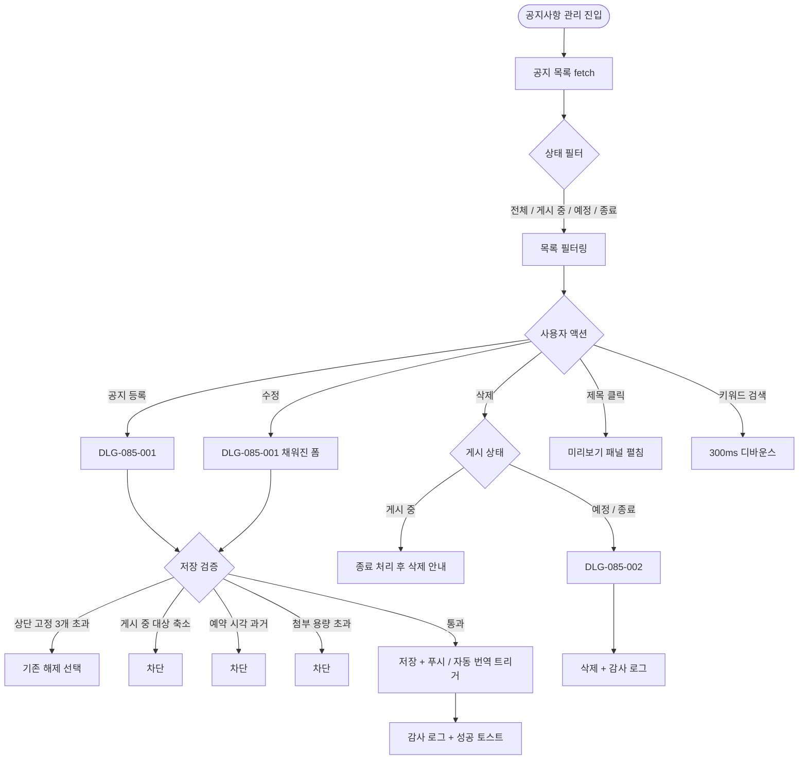
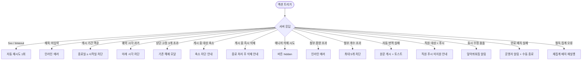

# SCR-085 공지사항 관리 페이지

## 1. 화면 메타 정보

이 문서는 공지사항 관리 페이지에 대한 자기완결형 요구사항 정의서입니다.

| 항목 | 값 |
|---|---|
| 작성일 | 2026-05-22 |
| 버전 | v1.0 |
| 상태 | 최신 통합본 반영 (정합화 완료) |
| 도메인 | D09 설정관리 |
| 화면 ID | SCR-085 |
| 화면명 | 공지사항 관리 |
| 화면 유형 | 콘텐츠 관리 화면 (CMS Screen) |
| 라우트 (URL) | `/settings/notices` |
| 플랫폼 | 데스크톱(기본), 태블릿 |
| 우선순위 | P0 (출시 필수) |
| 기능코드 | SET-EXT-04 (공지사항 관리) |
| 계약 상태 | 파생 기획 |
| 부모 기능 prefix | SET |
| Lv1 코드 | SET-EXT-04 |
| Lv2 / Lv3 세분화 | SET-EXT-04-01 ~ SET-EXT-04-08 (공지 목록·상태 필터·검색·등록·수정·삭제·미리보기·자동 게시 처리) |
| 연계 화면 | SCR-082 키오스크설정, SCR-088 다국어설정, 회원앱 공지 화면, SCR-097 감사로그 |
| 호출 다이얼로그 | DLG-085-001 공지등록수정, DLG-085-002 공지삭제확인 |

## 2. 화면 개요와 목적

공지사항 관리 페이지는 센터 내 공지사항을 작성·수정·삭제하고 게시 대상과 게시 기간을 설정하는 콘텐츠 관리 화면입니다. 전체·직원·회원·특정 역할로 수신 대상을 구분해 필요한 정보를 원하는 시점에 전달하며, 중요(상단 고정)·예약 발행·푸시 발송·필독 처리·회원앱 노출·자동 다국어 번역 같은 운영 옵션을 폭넓게 지원합니다.

운영 흐름은 다양합니다. 센터장이 임시 휴관 결정 직후 긴급 카테고리로 상단 고정·푸시 발송·회원앱 노출 ON으로 공지를 등록해 전 회원에게 즉시 인지시킵니다. 이벤트 시작 D-7에 맞춰 예약 발행을 설정하면 자동으로 게시되고 종료일에 자동으로 비공개로 전환됩니다. 매니저가 직원 대상 내부 공지를 작성할 때 게시 대상을 "직원"으로, 회원앱 노출을 OFF로 설정하면 회원에게는 노출되지 않고 직원 로그인 시에만 표시됩니다. 특정 역할(PT 트레이너) 대상 공지를 작성하면 그 역할 계정에만 노출됩니다. 외국인 회원이 많은 센터에서는 SET-05 자동 번역 ON과 연계해 한국어 원문 작성 시 영·일·중 번역본이 자동 생성됩니다. 긴급 안전 공지에는 필독 처리 ON으로 회원 확인까지 추적할 수 있습니다.

핵심 정책은 다음과 같습니다. 첫째, 상단 고정은 동시 최대 3개입니다. 둘째, 게시 중인 공지는 대상 축소가 불가능하며 종료 처리 후 삭제 가능합니다. 셋째, 매니저는 공지 작성·수정은 가능하지만 삭제는 불가합니다. 넷째, 만료 자동 비공개와 예약 발행은 자정 배치로 자동 처리됩니다. 다섯째, 모든 변경은 SCR-097 감사 로그에 기록됩니다.

## 3. 진입 경로와 인접 화면

이 화면에 진입하는 경로는 사이드바의 "설정 > 공지사항 관리"가 가장 일반적이며, manager 이상 계정에 노출됩니다. FC 이하·readonly는 자신이 수신 대상인 공지만 다른 영역(헤더 알림)에서 조회할 수 있고 이 관리 화면에는 접근할 수 없습니다.

두 번째 경로는 키오스크 설정(SCR-082)에서 "공지사항 조회 ON"으로 키오스크에 노출할 공지를 관리하러 진입하는 경우입니다.

세 번째 경로는 알림 센터에서 "공지 만료 자동 비공개 실패" 또는 "필독 확인율 알림"을 누르는 경우입니다.

인접 화면은 SCR-082 키오스크 설정, SCR-088 다국어 설정(자동 번역 연계), 회원앱 공지 화면, SCR-097 감사 로그입니다.

## 4. 레이아웃과 UI 구성

페이지 헤더에는 "공지사항 관리" 타이틀과 함께 [+ 공지 등록] 버튼이 우측에 강조 색상으로 표시됩니다. 본사 슈퍼관리자가 통합 모드에서 진입한 경우 "전체 지점 공지" 토글이 헤더에 추가로 노출됩니다.

헤더 아래에는 상태 필터 탭이 있습니다. 전체·게시 중·예정·종료의 4개 탭이 옆으로 펼쳐지며 각 탭 우측에는 해당 상태의 공지 수가 배지로 표시됩니다.

상태 필터 탭 아래에는 검색 바가 있습니다. 제목 기준 키워드 검색이 가능하며, 입력 후 300ms 디바운스 적용으로 자동 갱신됩니다.

본문은 공지 목록 테이블입니다. 컬럼은 제목(클릭 시 미리보기)·게시 대상(전체/직원/회원/특정 역할)·게시 기간(시작 ~ 종료)·게시 상태(예정/게시 중/종료 배지)·작성자·작성일·액션([수정] / [삭제]) 순서로 배치됩니다. 상단 고정 공지는 행 좌측에 별 아이콘이 표시되며 목록 최상단에 우선 정렬됩니다.

테이블 우측에는 미리보기 패널이 펼쳐질 수 있는 영역이 있습니다. 운영자가 행의 제목을 클릭하면 우측 패널에 본문·첨부 이미지·게시 옵션 요약이 표시됩니다.

필독 처리된 공지의 경우 행 안에 "필독 완료율" 프로그레스 바가 함께 표시되어 확인율을 즉시 파악할 수 있습니다.

페이지 최하단에는 페이지네이션이 있습니다.

## 5. 탭 구성과 탭별 동작

상태 필터 탭은 4개로 전체·게시 중·예정·종료입니다. 탭을 누르면 해당 상태의 공지만 즉시 필터링되며 검색·페이지 상태는 유지됩니다. 종료 탭은 만료 자동 비공개 배치로 종료 처리된 공지가 모이며, 운영자가 일괄 정리 검토를 할 때 사용합니다.

## 6. 버튼·아이콘·링크 액션 전체 정의

[+ 공지 등록] 버튼은 DLG-085-001 공지 등록/수정 다이얼로그를 열어 새 공지를 작성하게 합니다.

행의 [수정] 버튼은 DLG-085-001을 채워진 폼 상태로 호출합니다. 게시 중 공지는 대상 축소가 불가하며 대상 추가만 허용됩니다.

행의 [삭제] 버튼은 DLG-085-002 공지 삭제 확인 다이얼로그를 호출합니다. 게시 중 공지는 종료 처리 후에야 삭제 가능합니다. 매니저는 [삭제] 버튼이 hidden 처리됩니다.

행의 제목 클릭은 우측 패널에 미리보기를 펼칩니다. 패널 안에는 본문 리치 텍스트와 첨부 이미지가 표시되며, [수정] / [삭제] 빠른 액션이 함께 제공됩니다.

상태 필터 탭은 누르면 즉시 필터링됩니다.

검색 바는 300ms 디바운스로 입력 후 자동 갱신됩니다.

본사 슈퍼관리자의 "전체 지점 공지" 토글은 누르면 전국 모든 지점에 동일 공지가 배포되는 모드로 전환됩니다.

페이지네이션은 페이지당 20/50/100건 선택, 이전·다음 이동을 지원합니다.

## 7. 호출되는 모달 동작

### 7-1. DLG-085-001 공지 등록/수정

공지 등록/수정 다이얼로그는 새 공지 작성과 기존 공지 수정 모두에 사용됩니다. 카테고리(운영·이벤트·시설·긴급 4종)·제목·내용(리치 텍스트)·게시 대상(전체/직원/회원/특정 역할)·게시 기간·중요(상단 고정) 토글·예약 발행·푸시 발송·필독 처리·회원앱 노출·첨부 파일(이미지 5MB·PDF 20MB·최대 5개) 항목을 입력합니다. 자세한 동작은 DLG-085-001 다이얼로그 문서에서 자기완결로 다시 정의됩니다.

### 7-2. DLG-085-002 공지 삭제 확인

공지 삭제 확인 다이얼로그는 행의 [삭제] 버튼으로 호출됩니다. 게시 중 공지는 종료 처리 후에야 삭제 가능하다는 안내가 표시되며, 운영자가 종료 처리 + 삭제 2단계를 선택할 수 있습니다. 삭제된 공지는 복구 불가하며 감사 로그에는 제목·삭제자·삭제일만 보관됩니다.

## 8. 토스트와 확인 팝업과 알럿

성공 토스트는 "공지가 등록되었습니다", "공지가 수정되었습니다", "공지가 삭제되었습니다", "푸시 발송이 완료되었습니다" 같은 문구로 표시됩니다.

실패 토스트는 "공지 등록에 실패했습니다", "푸시 발송에 실패했습니다", "자동 번역에 실패했습니다 — 한국어 원문으로 게시" 같은 문구와 함께 다시 시도 안내가 따라옵니다.

확인 팝업은 게시 중 공지 즉시 삭제 시도(종료 처리 안내), 상단 고정 3개 초과 시 기존 해제 선택, 게시 대상 축소 시도 차단 등에서 표시됩니다.

알럿은 권한 부족 시 차단 표시됩니다.

## 9. 데이터 흐름과 외부 연동

화면 진입 시 `GET /api/notices`로 공지 목록이 fetch됩니다. 상태 필터·검색·페이지 파라미터가 쿼리에 포함됩니다.

공지 등록은 `POST /api/notices`, 수정은 `PUT /api/notices/:id`, 삭제는 `DELETE /api/notices/:id`로 처리됩니다.

첨부 파일 업로드는 `POST /api/notices/:id/upload`로 멀티파트 처리됩니다.

푸시 발송은 `POST /api/notices/:id/push`로 게시 즉시 또는 예약 시각에 수신 대상에게 FCM/APNs로 발송됩니다.

필독 확인율은 `GET /api/notices/:id/read-status`로 조회됩니다.

예약 발행 배치는 설정된 예약 시각에 자동으로 상태를 "예정 → 게시 중"으로 전환합니다.

만료 자동 비공개 배치는 매일 자정에 종료일이 지난 공지를 "게시 중 → 종료"로 전환하며 회원앱·키오스크에서 자동 숨김됩니다.

필독 미확인 재푸시는 필독 공지 게시 후 24시간 경과 시 미확인 회원에게 1회 재푸시가 발송됩니다.

자동 번역은 SET-05 자동 번역 ON 시 공지 저장 즉시 외부 번역 API가 비동기 호출되어 활성 키오스크 언어 기준으로 번역본이 생성됩니다. 번역 실패 시 한국어 원문으로 fallback됩니다.

키오스크 공지 동기화는 공지 상태 변경 시 SCR-082가 연결된 키오스크 기기에 실시간 push합니다.

전 지점 공지 배포(superAdmin)는 모든 테넌트의 공지 피드에 동일 공지를 복제합니다.

필독 확인율 집계는 매시간 배치로 집계됩니다.

모든 등록·수정·삭제는 SCR-097 감사 로그에 actor·notice_id·title·type INSERT됩니다.

화면에서 호출하는 주요 API는 `GET /api/notices`, `POST /api/notices`, `PUT /api/notices/:id`, `DELETE /api/notices/:id`, `GET /api/notices/:id`, `POST /api/notices/:id/upload`, `POST /api/notices/:id/push`, `GET /api/notices/:id/read-status`입니다.

## 10. 화면 상태와 예외 처리

기본·로딩·검색 결과 없음·공지 없음·예약 발행 대기·필독 진행 중·미리보기 펼침 등 다양한 상태를 가집니다.

예외 케이스: 제목 미입력 / 게시 기간 역순 / 예약 발행 과거 / 상단 고정 3개 초과 / 게시 중 대상 축소 시도 / 게시 중 즉시 삭제 / 매니저 삭제 시도(버튼 hidden) / 첨부 파일 용량·개수 초과 / 자동 번역 API 실패 / 직원 대상 + 푸시 설정 충돌 / 동시 수정 충돌 / 만료 배치 실패 / 필독 확인율 집계 오류 등.

## 11. 권한별 처리

슈퍼관리자와 본사 최고관리자는 전체 지점 공지를 작성·수정·삭제할 수 있습니다. 전 지점 공지 배포 모드도 사용 가능합니다.

센터장(owner)은 자기 지점 공지를 작성·수정·삭제할 수 있습니다.

매니저는 자기 지점 공지를 작성·수정할 수 있지만 삭제는 불가합니다. [삭제] 버튼이 hidden 처리됩니다.

FC·트레이너·스태프·프런트·readonly는 자신이 수신 대상인 공지만 조회 가능하며 관리 화면에는 접근할 수 없습니다.

## 12. 메인 흐름

## 13. 에러와 예외 흐름

## 14. 핵심 디자인 요청사항

상태 필터 탭은 4개 탭이 가로 동일 크기로 배치되며 각 탭의 공지 수 배지가 작은 라벨로 표시됩니다. 활성 탭은 강조 색상이 적용됩니다.

상단 고정 공지는 행 좌측의 별 아이콘으로 즉시 인식되며 목록 최상단에 우선 정렬됩니다.

게시 상태 배지는 예정(노랑)·게시 중(녹색)·종료(회색)로 색상 구분됩니다. 긴급 카테고리 공지는 행 전체 톤이 빨강 계열로 강조됩니다.

필독 처리 공지의 확인율 프로그레스 바는 행 안에 작게 표시되어 운영자가 한눈에 추적 가능합니다.

미리보기 패널은 우측에 슬라이드 인 되며 본문이 풍부한 콘텐츠를 표시할 수 있는 충분한 폭을 가집니다.

## 15. 운영 정책 (이 화면에 연결된 부분)

게시 기간은 시작일 자정 자동 활성, 종료일 자정 자동 종료됩니다. 만료 자동 비공개 배치가 매일 자정에 실행되어 종료 처리되며 회원앱·키오스크에서 자동 숨김됩니다.

상단 고정은 동시 최대 3개로 제한됩니다. 초과 시도 시 기존 고정 해제 선택을 요구합니다. 복수 고정 공지는 최신 등록 순으로 우선 표시됩니다.

회원앱 노출 토글이 활성된 공지만 회원앱에 표시됩니다. 직원 대상 공지는 회원앱에 노출되지 않습니다.

매니저는 공지 작성·수정은 가능하나 삭제는 불가합니다(운영 안전 정책).

게시 중인 공지의 게시 대상은 추가만 허용되고 축소는 차단됩니다(이미 발송된 회원에게 일관성 보장).

예약 발행은 지정 날짜·시각에 자동으로 상태가 "예정 → 게시 중"으로 전환됩니다. 발행 전 취소 가능합니다.

푸시 발송은 게시 즉시 또는 예약 시각에 수신 대상에게 FCM/APNs로 발송됩니다. 직원 대상 공지는 앱 푸시가 미지원되며 자동 OFF로 전환됩니다.

필독 처리 ON 공지는 회원 앱에서 확인 전까지 팝업으로 표시됩니다. 게시 후 24시간 경과 시 미확인 회원에게 1회 재푸시가 발송됩니다. 확인 완료율은 관리자 화면에서 집계됩니다.

자동 다국어 번역은 SET-05 자동 번역 ON 시 공지 저장 즉시 외부 번역 API가 비동기 호출됩니다. 활성 키오스크 언어(한국어 제외) 전체에 번역 적용되며, 실패 시 한국어 원문으로 fallback됩니다.

첨부 파일은 이미지 5MB·PDF 20MB·공지당 최대 5개로 제한됩니다.

만료 자동 비공개는 종료일 자정 배치로 처리되며 회원앱·키오스크에서 자동 숨김됩니다.

삭제된 공지는 복구 불가하며, 감사 로그에는 제목·삭제자·삭제일만 보관됩니다.

게시 중 즉시 삭제는 제한되며 종료 처리 후 삭제 가능합니다(UX 보호).

본사 슈퍼관리자의 "전체 지점" 모드는 모든 지점 회원앱에 동일 공지를 배포합니다.

특정 역할 노출은 게시 대상 "특정 역할" 선택 시 그 역할 계정 로그인 시에만 공지가 표시됩니다.

키오스크 노출 연계는 회원앱 노출 ON + SCR-082 공지사항 조회 ON 시 키오스크 화면에 표시됩니다.

공지 제목 최대 100자, 내용 리치 텍스트 최대 10,000자입니다.

게시 중 공지 수정 시 수정 전 원문은 히스토리 테이블에 버전 관리(최대 10버전)됩니다.

감사 로그에는 공지 ID·제목·카테고리·게시 대상·게시 기간·작성자·변경 유형(등록/수정/삭제)이 INSERT됩니다.

이상의 모든 정책은 이 화면을 구현하고 운영하는 사람이 별도 문서 없이 이 한 장만 보면 이해할 수 있도록 풀어 적었습니다.
