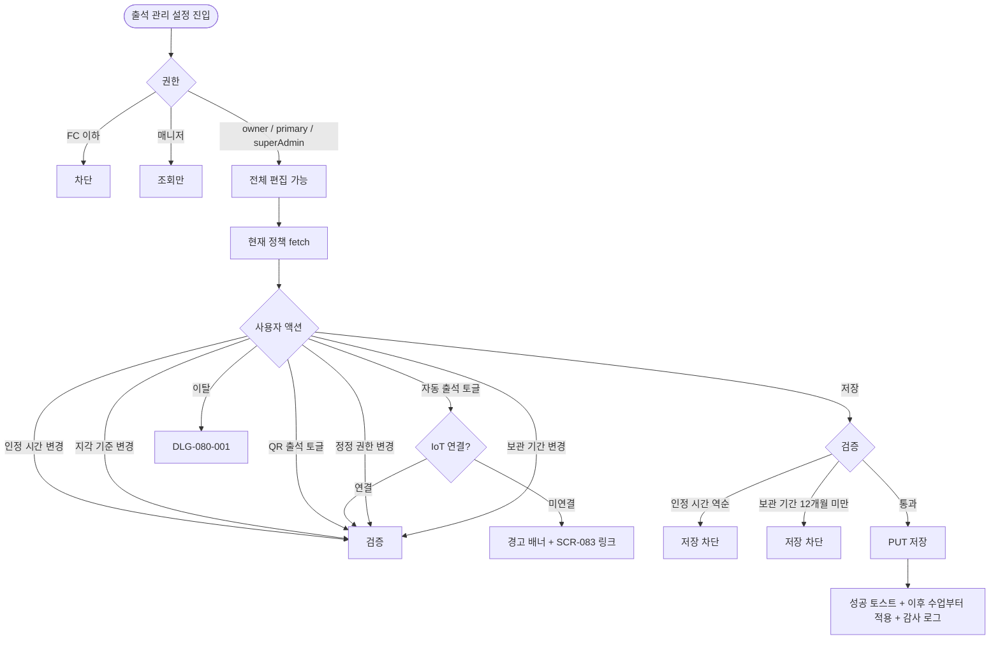
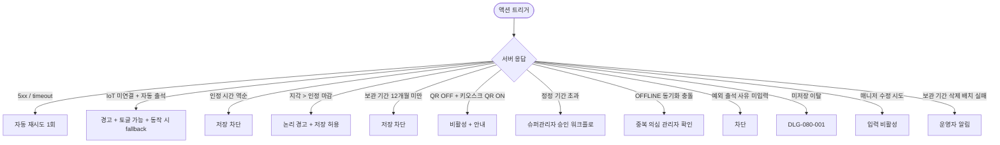

# SCR-086 출석 관리 설정 페이지

## 1. 화면 메타 정보

이 문서는 출석 관리 설정 페이지에 대한 자기완결형 요구사항 정의서입니다.

| 항목 | 값 |
|---|---|
| 작성일 | 2026-05-22 |
| 버전 | v1.0 |
| 상태 | 최신 통합본 반영 (정합화 완료) |
| 도메인 | D09 설정관리 |
| 화면 ID | SCR-086 |
| 화면명 | 출석 관리 설정 |
| 화면 유형 | 설정 화면 (Policy Settings Screen) |
| 라우트 (URL) | `/settings/attendance` |
| 플랫폼 | 데스크톱(기본), 태블릿 |
| 우선순위 | P0 (출시 필수) |
| 기능코드 | SET-EXT-05 (출석 관리 설정) |
| 계약 상태 | 파생 기획 |
| 부모 기능 prefix | SET |
| Lv1 코드 | SET-EXT-05 |
| Lv2 / Lv3 세분화 | SET-EXT-05-01 ~ SET-EXT-05-07 (출석 인정 시간·지각 기준·QR 출석·자동 출석·정정 권한·보관 기간·저장) |
| 연계 화면 | SCR-083 IoT출입관리, SCR-082 키오스크설정, SCR-C014 출석 QR, SCR-097 감사로그 |
| 호출 다이얼로그 | DLG-080-001 미저장경고 |

## 2. 화면 개요와 목적

출석 관리 설정 페이지는 회원의 출석을 인정하는 기준과 자동 처리 규칙을 센터 운영 방침에 맞게 설정하는 화면입니다. 출석 인정 시간대(수업 시작 N분 전부터 N분 후까지)·지각 판단 기준·자동 출석 처리 조건(IoT 기반)·자유 이용 출석 인정·OFFLINE 키오스크 동기화 정책·출석 정정 권한·출석 기록 보관 기간(법정 최소 12개월)을 한 화면에서 통합 관리합니다. QR 출석은 독립 QR 발급/검증 기능이 아니라 출석 수단 중 하나로 사용할지와 키오스크 노출 여부만 결정하는 토글로 한정됩니다.

운영 흐름은 다양합니다. 신규 IoT 출입 장치를 연동한 직후 센터장이 자동 출석 처리 토글을 ON으로 변경하면 IoT 입장 태그 기록이 즉시 출석으로 처리됩니다. 지각자 민원이 증가하면 지각 판단 시간을 10분에서 15분으로 완화해 이후 수업부터 15분 이내 입장을 정시로 인정합니다. 자유 이용 회원의 출석 이력이 필요한 센터에서는 자유 이용 출석 토글 ON과 함께 "첫 입장만" 중복 처리를 선택해 당일 최초 입장 1건만 기록합니다. OFFLINE 키오스크 동기화 정책으로 "지연 허용 30분"을 선택하면 네트워크 복구 후 30분 이내 기록은 유효 출석으로 소급 반영됩니다. 정정 권한을 "센터장+매니저", 정정 가능 기간 3일로 확대하면 매니저도 3일 이내 출석 정정이 가능해집니다.

핵심 정책은 다음과 같습니다. 첫째, 출석 기록 보관 기간은 법정 최소 12개월 이상이어야 합니다. 둘째, 자동 출석은 IoT 미연결 시 fallback 동작하며 SCR-083 안내 링크가 함께 표시됩니다. 셋째, 설정 변경은 저장 즉시 이후 수업부터 적용되며 과거 출석 데이터 소급 변경은 불가합니다. 넷째, 모든 변경은 SCR-097 감사 로그에 기록됩니다.

## 3. 진입 경로와 인접 화면

이 화면에 진입하는 경로는 사이드바의 "설정 > 출석 관리 설정"이며 owner와 superAdmin/primary에게 노출됩니다. 매니저는 조회만 가능합니다. FC 이하는 메뉴 자체가 보이지 않습니다.

두 번째 경로는 SCR-083 IoT 출입 관리에서 "출석 자동 처리 정책 변경" 링크를 누르는 경우, 세 번째는 키오스크 설정에서 "출석 정책 확인" 링크를 누르는 경우입니다.

인접 화면은 SCR-083 IoT 출입 관리, SCR-082 키오스크 설정, SCR-C014 출석 QR, SCR-C011 유효 수업, SCR-097 감사 로그입니다.

## 4. 레이아웃과 UI 구성

페이지 헤더에 "출석 관리 설정" 타이틀과 [변경 사항 저장] 버튼이 표시됩니다.

본문은 위에서 아래로 여섯 개의 섹션으로 구성됩니다.

첫 번째 섹션은 출석 인정 시간 설정입니다. "수업 시작 N분 전부터", "수업 시작 N분 후까지" 두 개의 숫자 입력과 주말/공휴일 출석 토글이 있습니다. 마감 시간이 시작 시간보다 같거나 빠르면 인라인 에러가 표시되고 저장이 차단됩니다.

두 번째 섹션은 지각 기준 설정입니다. 지각 판단 시간(수업 시작 후 N분), 지각 누적 알림 횟수, 노쇼 판단 시간(출석 인정 마감 후 미입장)을 입력합니다. 지각 판단 시간이 출석 인정 마감보다 길면 논리 오류 경고가 표시됩니다(저장은 허용).

세 번째 섹션은 QR 출석 설정입니다. QR 출석 사용 토글과 키오스크 QR 표시 토글이 있습니다. QR 출석 OFF 상태에서는 키오스크 QR 표시 토글이 비활성됩니다. 그 아래에 "출석 수단 안내" 영역이 있어 QR/키오스크/IoT/수동 출석의 사용 범위와 설정 위치가 텍스트로 안내됩니다. QR 발급·검증 상세는 출석 처리 화면에서 다루며 본 설정에서는 사용 여부와 노출만 결정합니다.

네 번째 섹션은 자동 출석 규칙입니다. 자동 출석 처리(IoT 기반) 토글, 자유 이용 출석 토글, 동일 회원 중복 처리(첫 입장만/매 입장 라디오), OFFLINE 키오스크 동기화 정책(즉시/지연 허용 N분)이 있습니다. IoT 미연결 상태에서 자동 출석 활성 시 "IoT 장치가 연결되어 있지 않습니다. SCR-083에서 연결해주세요" 경고 배너가 표시됩니다.

다섯 번째 섹션은 출석 정정 권한입니다. 정정 허용 역할 라디오(센터장만 / 센터장+매니저)와 정정 가능 기간 입력(출석일 기준 기본 7일 이내)이 있습니다.

여섯 번째 섹션은 출석 기록 보관 기간입니다. 개월 단위 입력이며 법정 최소 12개월 이상이어야 합니다. 12개월 미만 입력 시 인라인 에러가 표시되고 저장이 차단됩니다.

일곱 번째 섹션은 직원 근태 기준 설정입니다. 직원 지각 허용 시간(기본값 10분, 정규 출근 시각 기준 10분까지는 정상, 설정값 초과 출근부터 지각), 직원 지각 누적 알림 기준(월 또는 지점 설정 기간 내 N회 초과 시 알림), 직원 지각 알림 수신자(센터장 / 매니저 / 직원 본인 중 지점 선택), 직원 근태 기준 적용 시점(저장 이후 신규 출퇴근 기록부터 적용, 과거 기록 소급 변경 없음)이 있습니다. 이 값은 SCR-063 직원 근태 관리 화면 상단 정책 배지에 읽기 전용으로 표시됩니다. 기본 수정 권한은 소속 지점 센터장(owner)에게 있으며, 슈퍼관리자의 개별 지점값 수정은 비상 사유 입력 시에만 허용합니다.

페이지 최하단에는 액션 풋바가 fixed로 떠 있으며 [변경 사항 저장] / [변경 취소] 버튼이 배치됩니다.

## 5. 탭 구성과 탭별 동작

이 화면은 탭 구조가 없는 단일 페이지로, 일곱 개의 섹션이 세로로 펼쳐집니다.

매니저로 진입한 경우 모든 입력이 비활성 상태로 표시되며 저장 버튼은 hidden 됩니다.

## 6. 버튼·아이콘·링크 액션 전체 정의

페이지 헤더와 액션 풋바의 [변경 사항 저장] 버튼은 변경이 있을 때만 활성됩니다. 누르면 저장 직후 이후 수업부터 새 정책이 적용됩니다.

자동 출석 처리 토글을 IoT 미연결 상태에서 활성하면 경고 배너가 표시되고 SCR-083으로 이동하는 링크가 함께 노출됩니다.

QR 출석 사용 토글이 OFF인 상태에서 키오스크 QR 표시 토글을 활성하려고 하면 "QR 출석 사용을 먼저 켜주세요" 안내가 표시되고 차단됩니다.

OFFLINE 동기화 정책 라디오는 즉시 또는 지연 허용 N분 중 선택합니다.

정정 허용 역할 라디오는 센터장만 또는 센터장+매니저 중 선택합니다.

[변경 취소] 버튼은 마지막 저장 시점으로 되돌립니다.

모든 버튼은 클릭 후 응답이 돌아오기 전까지 자동으로 비활성화됩니다.

## 7. 호출되는 모달 동작

### 7-1. DLG-080-001 미저장 경고 다이얼로그

미저장 변경 + 페이지 이탈 시 표시됩니다.

## 8. 토스트와 확인 팝업과 알럿

성공 토스트는 "출석 정책이 저장되었습니다 — 이후 수업부터 적용됩니다" 같은 문구로 표시됩니다.

실패 토스트는 "저장에 실패했습니다" 같은 문구와 함께 다시 시도 안내가 표시됩니다.

확인 팝업은 [변경 취소] 시 표시됩니다.

알럿은 권한 부족 시 차단 표시됩니다.

매니저 진입 시 입력 비활성 상태와 "조회만 가능합니다" 안내 배지가 표시됩니다.

## 9. 데이터 흐름과 외부 연동

화면 진입 시 `GET /api/settings/attendance`로 현재 정책이 fetch됩니다.

저장은 `PUT /api/settings/attendance`로 처리됩니다.

자동 출석 처리는 IoT 출입 이벤트(SCR-083)가 발생할 때 설정 기준 내 시간이면 자동 INSERT됩니다.

OFFLINE 동기화 배치는 키오스크 네트워크 복구 이벤트에 트리거되어 로컬 출석 큐를 서버에 소급 반영합니다.

노쇼 자동 처리 배치는 수업 종료 시각 + 인정 마감 경과 시점에 미입장 회원을 노쇼로 기록합니다.

지각 누적 알림은 지각 N회 초과 이벤트 시 회원앱과 관리자에게 알림 발송됩니다.

출석 기록 보관 기간 만료 삭제 배치는 매월 1일 02:00에 보관 기간 초과 레코드를 삭제하며 7일 전 사전 알림이 운영자에게 발송됩니다.

지점 자동화 적용(SET-EXT-01)으로 본사 정책 세트가 적용되면 출석 정책이 일괄 덮어쓰기될 수 있습니다.

회원 알림 센터는 지각·노쇼 이벤트 시 회원앱 푸시와 인앱 알림을 발송합니다.

주말·공휴일 캘린더 연동은 연 1회 공휴일 갱신 배치로 자동 출석 처리 여부를 결정합니다.

모든 설정 변경과 출석 정정은 SCR-097 감사 로그에 actor·before·after·timestamp INSERT됩니다.

수동 출석 처리는 `POST /api/attendance/manual`, 출석 정정은 `PATCH /api/attendance/:id/correct`, OFFLINE 동기화는 `POST /api/attendance/offline-sync`로 처리됩니다.

## 10. 화면 상태와 예외 처리

기본·수정 중·저장 완료·IoT 미연결 경고·OFFLINE 동기화 대기 등 상태를 가집니다.

예외 케이스: IoT 미연결 + 자동 출석 활성 / 인정 시간 역순(마감 < 시작) / 지각 시간 > 인정 마감(논리 경고) / 보관 기간 12개월 미만 / QR 출석 OFF + 키오스크 QR 표시 ON / 정정 기간 초과 후 정정 시도(슈퍼관리자 승인 필요) / OFFLINE 동기화 충돌 / 예외 출석 사유 미입력 / 저장 네트워크 오류 / 미저장 이탈 / 매니저 수정 시도 / 보관 기간 삭제 배치 실패 / OFFLINE 동기화 지연 허용 시간 초과 등.

## 11. 권한별 처리

슈퍼관리자와 본사 최고관리자는 전체 설정을 조회·수정할 수 있습니다.

센터장(owner)은 자기 지점 설정을 조회·수정할 수 있습니다(RLS branchId 필터).

매니저(manager)는 전체 설정을 조회만 가능합니다. 모든 입력이 비활성되고 저장 버튼은 hidden 됩니다.

FC(fc)·트레이너(trainer)·스태프(staff)·프런트(front)·읽기 전용(readonly)은 이 화면에 접근할 수 없습니다.

## 12. 메인 흐름

## 13. 에러와 예외 흐름

## 14. 핵심 디자인 요청사항

여섯 개의 섹션이 세로로 명확히 구분되며 각 섹션 헤더에 짧은 설명이 함께 표시되어 운영자가 정책 의도를 이해할 수 있어야 합니다.

자동 출석 토글 영역에서 IoT 연결 상태가 배지로 표시되어 운영자가 활성 가능 여부를 즉시 인지할 수 있어야 합니다.

QR 출석 섹션의 "출석 수단 안내" 영역은 정보형 카드로 디자인되어 QR/키오스크/IoT/수동의 사용 위치가 한눈에 들어와야 합니다.

보관 기간 입력란 옆에는 "법정 최소 12개월" 안내가 항상 표시되어 운영자가 정책을 인지하도록 합니다.

매니저 진입 시 모든 입력이 회색 톤 비활성으로 통일되어 "조회만 가능" 상태가 일관되게 보입니다.

## 15. 운영 정책 (이 화면에 연결된 부분)

출석 인정 시작은 수업 시작 N분 전부터 적용됩니다. 인정 마감은 수업 시작 N분 후까지이며, 마감이 시작보다 같거나 빠르면 저장이 차단됩니다.

자동 출석은 IoT 출입 기록 기반이며, IoT(SCR-083) 미연결 시 경고 배너가 표시되고 자동 처리는 미동작합니다. 토글 자체는 ON 가능하며, IoT 연결 후 자동으로 정상 동작합니다.

QR 출석은 본 설정에서 사용 여부와 키오스크 노출만 관리합니다. QR 생성·토큰 만료·서버 검증·스캔 처리 로직은 출석 처리 화면/구현 영역에서 다루며, 본 설정 기능에서는 제외됩니다. QR 출석 사용이 ON일 때만 키오스크 QR 표시 토글이 활성됩니다.

동일 회원 중복 처리는 "첫 입장만" 또는 "매 입장마다" 중 선택할 수 있습니다. "첫 입장만"은 당일 최초 입장 1건만 출석으로 기록하고, "매 입장"은 매 입장마다 기록하되 출석 횟수는 1회로 집계됩니다(입장 이력은 별도 유지).

노쇼 판단은 출석 인정 마감 시간까지 미입장 시 자동 노쇼로 기록됩니다. 노쇼 횟수 N회 초과 시 회원에게 알림이 발송됩니다.

출석 정정 권한은 정정 허용 역할(센터장만 또는 센터장+매니저)과 정정 가능 기간(출석일 기준 기본 7일)으로 관리됩니다. 기간 초과 정정은 슈퍼관리자 승인이 필요합니다.

OFFLINE 키오스크 동기화 정책은 네트워크 단절 시 키오스크 로컬 DB에 출석 기록이 임시 저장되고, 복구 후 정책 시간(즉시 또는 지연 허용 N분) 내 동기화됩니다. 중복 충돌 시 서버 기록이 우선되고 OFFLINE 기록은 "중복 의심" 태그가 부착되어 관리자 확인이 요청됩니다.

예외 출석은 운영자가 수동으로 입력하는 출석으로 사유 필수 입력, "예외" 태그 부착, 감사 로그 필수 기록입니다.

주말·공휴일 출석 토글이 OFF면 해당일 자동 출석 처리는 미동작하며, 수동 정정은 권한 내에서 가능합니다.

설정 변경은 저장 즉시 이후 수업부터 적용됩니다. 과거 출석 데이터의 소급 변경은 불가합니다.

자유 이용 출석은 이용권 타입이 "자유 이용"인 회원의 입장 기록을 출석으로 인정합니다. 수업 연동 없이 단독 출석 이력이 생성됩니다.

지각 임계 시간은 출석 인정 마감 시간 이내로 제한됩니다(논리 오류 방지).

보관 기간 초과 데이터 자동 삭제는 매월 1일 02:00 배치로 실행되며, 삭제 7일 전 운영자 알림이 발송됩니다.

감사 로그에는 설정 변경 시 변경 전·후 값·actor·timestamp가 기록되고, 출석 정정 시 정정자·정정 사유·원본값이 별도 기록됩니다.

본사 정책 세트(SET-EXT-01)가 적용되면 출석 정책이 일괄 덮어쓰기될 수 있습니다.

이상의 모든 정책은 이 화면을 구현하고 운영하는 사람이 별도 문서 없이 이 한 장만 보면 이해할 수 있도록 풀어 적었습니다.
