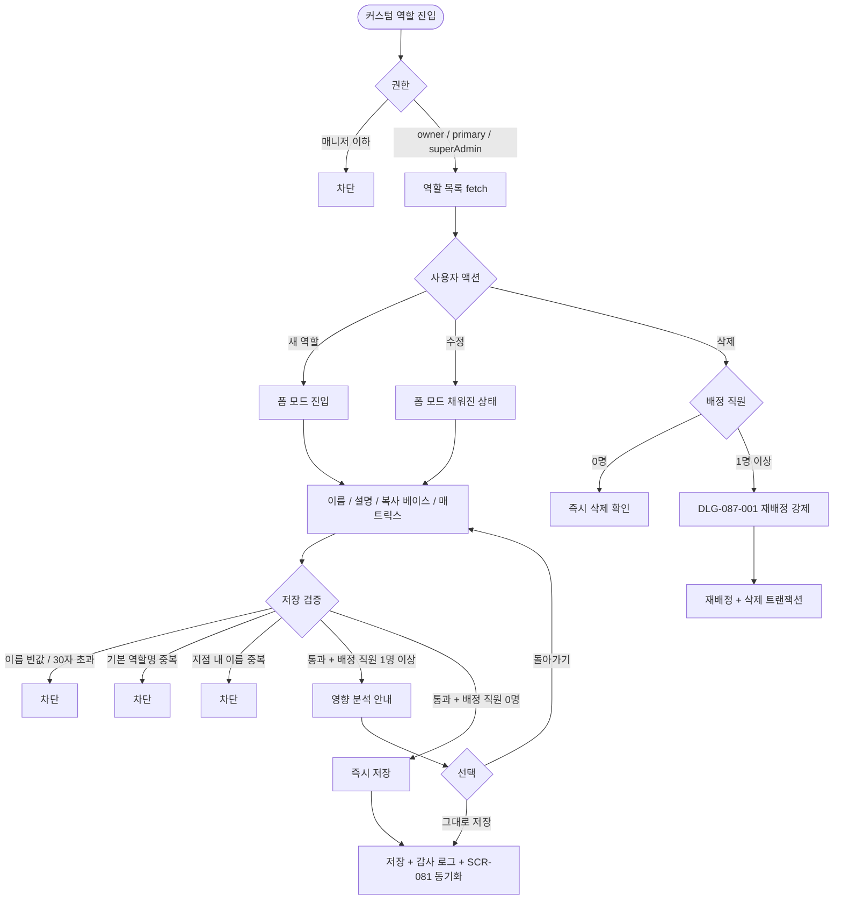
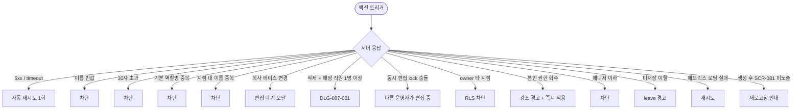

# SCR-087 커스텀 역할 생성 페이지

## 1. 화면 메타 정보

이 문서는 커스텀 역할 생성 페이지에 대한 자기완결형 요구사항 정의서입니다.

| 항목 | 값 |
|---|---|
| 작성일 | 2026-05-22 |
| 버전 | v1.0 |
| 상태 | 최신 통합본 반영 (정합화 완료) |
| 도메인 | D09 설정관리 |
| 화면 ID | SCR-087 |
| 화면명 | 커스텀 역할 생성 |
| 화면 유형 | 콘텐츠 관리 화면 (Role CRUD Screen) |
| 라우트 (URL) | `/settings/custom-role` |
| 플랫폼 | 데스크톱(기본), 태블릿 |
| 우선순위 | P0 (출시 필수) |
| 기능코드 | SET-04 (커스텀 역할 생성) |
| 계약코드 | SET-04 |
| 계약 상태 | 계약 범위 본기능 |
| 부모 기능 prefix | SET |
| Lv1 코드 | SET-04 |
| Lv2 / Lv3 세분화 | SET-04-01 ~ SET-04-06 (역할 목록·역할 생성·역할 수정·역할 삭제·직원 매핑·영향 분석) |
| 연계 화면 | SCR-081 권한 설정, SCR-060 직원 관리, SCR-097 감사로그 |
| 호출 다이얼로그 | DLG-087-001 역할삭제재배정 |

## 2. 화면 개요와 목적

커스텀 역할 생성 페이지는 기본 제공 7종 역할(superAdmin·primary·owner·manager·fc·staff·readonly) 외에 센터 운영 특성에 맞는 맞춤형 역할을 생성·관리하는 화면입니다. 역할 이름·설명을 정의하고 SCR-081과 동일한 9 메뉴 그룹 × 5 권한 매트릭스로 권한 조합을 직접 구성합니다. 보조 매니저·시간제 강사·야간 매니저·신입 인턴·프로젝트 PM 같이 기본 역할로 표현하기 어려운 운영 시나리오를 유연하게 반영할 수 있도록 설계되었습니다. 커스텀 역할은 SCR-081 권한 설정과 단일 source-of-truth로 운영되며 양 화면에서 동일하게 편집됩니다.

운영 흐름은 다음과 같습니다. 보조 매니저 신규 도입 시 manager 권한을 복사한 후 환불·급여 권한을 회수해 "보조 매니저" 역할을 생성합니다. 시간제 강사용 표준 역할은 staff를 복사한 후 수업·출석만 활성하고 재무 정보를 차단합니다. 야간 매니저 안전망을 구축할 때는 owner를 복사한 후 회원 영구 삭제·매출 수정 권한을 거부 처리합니다. 신입 인턴은 1개월 한정 [조회]만 활성 매트릭스로 생성한 후 정식 전환 시 DLG-087-001로 정식 매니저 역할로 재배정합니다. 프로젝트 PM 같은 한시적 역할은 종료 시 DLG-087-001 재배정으로 권한 공백 없이 정리합니다.

핵심 정책은 다음과 같습니다. 첫째, 역할 이름은 1~30자 필수이며 기본 7종 역할명과 동일 지점 내 커스텀 역할명 중복은 차단됩니다. 둘째, 역할 삭제 시 배정 직원이 1명 이상이면 DLG-087-001 재배정이 강제됩니다. 셋째, 커스텀 역할은 SCR-081과 단일 source-of-truth로 운영되며 양 화면 동기화됩니다. 넷째, 모든 변경은 SCR-097 감사 로그에 기록됩니다.

## 3. 진입 경로와 인접 화면

이 화면에 진입하는 경로는 사이드바의 "설정 > 커스텀 역할 생성"이며 owner와 superAdmin/primary에게 노출됩니다. 매니저 이하는 메뉴 자체가 보이지 않습니다.

두 번째 경로는 SCR-081 권한 설정 좌측 패널의 [+ 새 역할] 버튼이 SCR-087을 호출하는 경우입니다. 세 번째는 SCR-060 직원 관리에서 "역할 관리" 링크를 누르는 경우, 네 번째는 알림 센터의 "미사용 역할 보고" 알림을 누르는 경우입니다.

인접 화면은 SCR-081 권한 설정, SCR-060 직원 관리, SCR-097 감사 로그입니다.

## 4. 레이아웃과 UI 구성

페이지 헤더에 "커스텀 역할 생성" 타이틀과 [+ 새 역할 만들기] 버튼이 우측에 강조 색상으로 표시됩니다. 본사 슈퍼관리자가 통합 모드에서 진입한 경우 지점 컨텍스트 드롭다운이 추가로 노출됩니다.

본문은 커스텀 역할 목록 테이블입니다. 컬럼은 역할명·설명·배정 직원 수(0명도 표시)·생성일·액션([수정] / [삭제]) 순서로 배치됩니다. 배정 직원 수가 0인 행은 회색 톤으로 약하게 표시되어 미사용 역할 식별이 쉬워집니다.

행의 [수정] 버튼을 누르면 페이지가 폼 모드로 전환되어 역할 이름·설명·권한 매트릭스(9 × 5)가 편집 가능한 상태로 표시됩니다. 폼 모드의 우측에는 SCR-081과 동일한 권한 매트릭스가 배치되어 운영자가 일관된 경험으로 권한을 조정할 수 있습니다.

새 역할 생성 시에도 동일한 폼 모드로 전환되며 빈 매트릭스 또는 복사 베이스 매트릭스가 로드됩니다.

폼 모드 하단에는 [저장] / [취소] 버튼이 배치되며, 매트릭스 변경 사항은 저장 직전에 영향 분석 안내가 자동 표시됩니다(배정 직원이 1명 이상인 경우).

## 5. 탭 구성과 탭별 동작

이 화면은 탭 구조 없이 목록 모드와 폼 모드 두 가지 화면 상태가 전환됩니다. 목록 모드에서 [+ 새 역할 만들기] 또는 행의 [수정]을 누르면 폼 모드로, 폼 모드에서 [저장] 또는 [취소]를 누르면 목록 모드로 돌아갑니다.

## 6. 버튼·아이콘·링크 액션 전체 정의

[+ 새 역할 만들기] 버튼은 폼 모드로 전환합니다. 역할 이름·설명·복사 베이스·권한 매트릭스를 입력합니다.

행의 [수정] 버튼은 채워진 폼 모드로 전환합니다. 권한 변경 시 배정 직원이 1명 이상이면 저장 직전에 영향 분석 안내가 자동 표시됩니다.

행의 [삭제] 버튼은 배정 직원이 0명이면 즉시 삭제 확인이, 1명 이상이면 DLG-087-001 역할 삭제 재배정 다이얼로그를 호출합니다.

복사 베이스 드롭다운은 기본 7종 역할과 다른 커스텀 역할 중에서 선택합니다. 선택하면 그 역할의 매트릭스가 자동 로드됩니다. 편집 도중 복사 베이스를 변경하면 "현재 편집 내용이 사라집니다" 모달이 표시됩니다.

폼 모드의 [저장] 버튼은 입력 검증과 영향 분석 안내를 거쳐 저장합니다.

[취소] 버튼은 목록 모드로 돌아가며, 미저장 변경이 있는 경우 미저장 경고가 표시됩니다.

모든 버튼은 클릭 후 응답이 돌아오기 전까지 자동으로 비활성화됩니다.

## 7. 호출되는 모달 동작

### 7-1. DLG-087-001 역할 삭제 재배정

역할 삭제 시 배정 직원이 1명 이상이면 호출됩니다. 재배정 역할 선택과 영향 직원 목록이 함께 표시되며, 재배정 후 트랜잭션으로 삭제됩니다.

## 8. 토스트와 확인 팝업과 알럿

성공 토스트는 "역할이 생성되었습니다", "역할이 수정되었습니다", "역할이 삭제되었습니다 — N명 재배정 완료" 같은 문구로 표시됩니다.

실패 토스트는 "저장에 실패했습니다", "역할 삭제에 실패했습니다" 같은 문구와 함께 다시 시도 안내가 따라옵니다.

인라인 검증은 이름·설명·매트릭스 변경 시 실시간으로 동작합니다(글자 수·중복).

확인 팝업은 복사 베이스 변경 시 편집 폐기 경고, 본인 권한 회수 경고, 미저장 이탈 경고에서 표시됩니다.

알럿은 권한 부족 시 차단 표시됩니다.

## 9. 데이터 흐름과 외부 연동

화면 진입 시 `GET /api/permissions/custom-roles`로 커스텀 역할 목록이 fetch됩니다.

생성은 `POST /api/permissions/custom-roles`, 수정은 `PUT /api/permissions/custom-roles/:id`, 삭제는 `DELETE /api/permissions/custom-roles/:id`로 처리됩니다.

재배정은 `POST /api/permissions/custom-roles/:id/reassign`으로 처리되며 일괄 트랜잭션으로 실행됩니다.

영향 분석은 `GET /api/permissions/custom-roles/:id/impact`로 배정 직원 수·담당 회원 합계·before/after 권한 차이가 반환됩니다.

SCR-081 권한 설정과 단일 source-of-truth로 동기화되어 양 화면에서 변경이 즉시 반영됩니다.

직원 활성 세션은 권한 변경·재배정 시 다음 페이지 로드(JWT refresh)부터 신규 권한이 적용됩니다.

owner는 RLS branchId 필터로 자기 지점 역할만 노출됩니다.

NFR-19 알림 센터는 역할 삭제·민감 기능 부여 시 본사 슈퍼관리자에게 알림을 발송합니다.

동시 편집 lock은 진입 시 30초 lock으로 보호됩니다.

매일 04:00에는 일별 미사용 역할 점검 배치가 실행되어 30일 이상 배정 0명인 역할을 본사에 보고합니다.

매주 월요일 04:00에는 역할 사용 통계 배치가 실행되어 역할별 배정 추이가 집계됩니다.

모든 생성·수정·삭제는 SCR-097 감사 로그에 actor·role_id·diff JSON·timestamp INSERT됩니다.

## 10. 화면 상태와 예외 처리

기본(목록)·역할 없음·생성 폼·수정 폼·저장 중·저장 완료·삭제 중(DLG-087-001)·권한 부족 등 상태를 가집니다.

예외 케이스: 이름 빈값·30자 초과·기본 역할명 중복·지점 내 이름 중복·복사 베이스 변경 시 편집 폐기·삭제 시 배정 직원 1명 이상(DLG-087-001 강제)·동시 편집 충돌(30초 lock)·owner 타 지점 접근·매니저 이하 접근·저장 네트워크 오류·매트릭스 로딩 실패·미저장 이탈·본인 권한 회수 경고·생성 후 SCR-081 미노출(새로고침 안내) 등.

## 11. 권한별 처리

슈퍼관리자와 본사 최고관리자는 전체 커스텀 역할을 생성·수정·삭제할 수 있습니다.

Owner(지점장)은 자기 지점 커스텀 역할을 생성·수정·삭제할 수 있습니다(RLS branchId 필터).

매니저·FC·트레이너·스태프·프런트·readonly는 이 화면에 접근할 수 없습니다.

## 12. 메인 흐름

## 13. 에러와 예외 흐름

## 14. 핵심 디자인 요청사항

목록 테이블은 배정 직원 수 컬럼이 명확히 표시되어 미사용 역할(0명) 식별이 쉬워야 합니다. 0명 행은 회색 톤으로 약하게 표시됩니다.

폼 모드의 권한 매트릭스는 SCR-081과 동일한 9 × 5 구조로 일관된 사용자 경험을 제공합니다.

[+ 새 역할 만들기] 버튼은 헤더 우측에 강조 색상으로 표시되어 신규 생성 동선이 명확합니다.

복사 베이스 드롭다운에는 기본 7종과 커스텀 역할이 그룹별로 구분 표시되어 운영자가 원하는 베이스를 빠르게 찾을 수 있습니다.

매니저 이하 진입 시 차단 화면은 일관된 톤으로 통일됩니다.

## 15. 운영 정책 (이 화면에 연결된 부분)

커스텀 역할 이름은 1~30자 필수이며 빈값과 30자 초과는 차단됩니다. 기본 7종 역할명(superAdmin/primary/owner/manager/fc/staff/readonly) 및 한글 표기와 중복은 차단됩니다.

동일 지점 내 커스텀 역할명은 unique이며 다른 지점은 같은 이름을 사용할 수 있습니다.

권한 복사 베이스 선택 시 그 역할의 9 그룹 × 5 권한 매트릭스가 자동 로드됩니다.

역할 삭제 시 배정 직원이 1명 이상이면 DLG-087-001 재배정이 강제됩니다. 재배정 역할 선택 후에만 삭제가 가능하며, 재배정과 삭제는 한 트랜잭션으로 처리됩니다.

커스텀 역할은 SCR-081 권한 설정과 단일 source-of-truth로 운영되며 양 화면에서 동일하게 편집됩니다.

권한 변경 시 배정 직원이 1명 이상이면 배정 직원 수·담당 회원 합계·before/after 권한 차이를 보여주는 영향 분석 안내가 표시됩니다.

owner는 소속 지점 커스텀 역할만 생성·수정·삭제 가능합니다(RLS branchId 필터).

역할 설명은 200자 이내 선택 항목입니다.

6종 민감 기능을 포함하는 경우 SCR-081과 동일하게 강조 표시 + 저장 시 추가 확인이 적용됩니다.

권한 매트릭스 공통은 SCR-081과 동일한 9 그룹(회원·수업·매출·상품·직원·급여·시설·메시지·설정) × 5 권한(접근·조회·생성·수정·삭제)입니다.

역할 삭제 후 직원 재배정은 DLG-087-001에서 선택한 역할로 일괄 처리됩니다.

재배정 후 직원 활성 세션은 다음 페이지 로드(JWT refresh)부터 신규 권한이 적용됩니다.

삭제 시 담당 회원 영향은 직원 재배정 후에도 담당 회원 매핑은 유지됩니다.

역할명 변경 시 기존 배정 직원의 권한은 그대로 유지됩니다(역할 ID 기준).

역할 생성 후 권한이 전혀 부여되지 않은(전체 거부) 상태도 허용되지만, 직원 배정 시 권한 없음 상태가 되어 경고가 표시됩니다.

동시 편집 lock은 같은 역할을 다른 운영자가 편집 중이면 30초 lock으로 보호됩니다.

수정 중 페이지 이탈 시 미저장 경고 모달이 표시됩니다.

인라인 검증은 이름·설명 입력 시 실시간 글자 수·중복 검증이 동작합니다.

본인이 해당 역할에 배정된 경우 권한 회수 시 본인 권한도 박탈된다는 경고가 표시됩니다.

미사용 역할 점검 배치는 매일 04:00에 30일 이상 배정 0명인 역할을 본사에 보고합니다.

역할 사용 통계 배치는 매주 월요일 04:00에 역할별 배정 추이를 집계합니다.

NFR-19 알림 센터는 역할 삭제·민감 기능 부여 시 본사 슈퍼관리자에게 알림을 발송합니다.

모든 생성·수정·삭제는 SCR-097 감사 로그에 actor·role_id·diff JSON·timestamp INSERT됩니다.

이상의 모든 정책은 이 화면을 구현하고 운영하는 사람이 별도 문서 없이 이 한 장만 보면 이해할 수 있도록 풀어 적었습니다.
