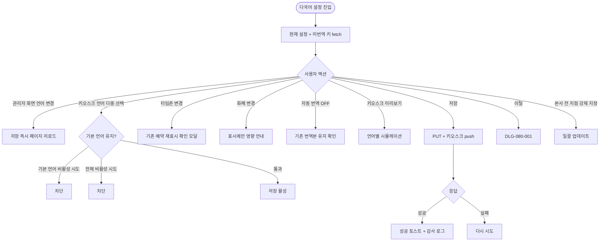
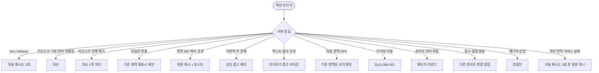

# SCR-088 다국어 설정 페이지

## 1. 화면 메타 정보

이 문서는 다국어 설정 페이지에 대한 자기완결형 요구사항 정의서입니다.

| 항목 | 값 |
|---|---|
| 작성일 | 2026-05-22 |
| 버전 | v1.0 |
| 상태 | 최신 통합본 반영 (정합화 완료) |
| 도메인 | D09 설정관리 |
| 화면 ID | SCR-088 |
| 화면명 | 다국어 설정 |
| 화면 유형 | 설정 화면 (i18n Settings Screen) |
| 라우트 (URL) | `/settings/language` |
| 플랫폼 | 데스크톱(기본), 태블릿 |
| 우선순위 | P0 (출시 필수) |
| 기능코드 | SET-05 (다국어 설정) |
| 계약 상태 | 파생 기획 |
| 부모 기능 prefix | SET |
| Lv1 코드 | SET-05 |
| Lv2 / Lv3 세분화 | SET-05-01 ~ SET-05-06 (시스템 언어·국가 지역·자동 번역·키오스크 미리보기·저장·번역 매핑) |
| 연계 화면 | SCR-082 키오스크설정, SCR-085 공지사항관리, SCR-097 감사로그 |
| 호출 다이얼로그 | DLG-080-001 미저장경고 |

## 2. 화면 개요와 목적

다국어 설정 페이지는 시스템 전체에서 사용하는 언어와 국가·지역 관련 표시 형식을 설정하는 화면입니다. 외국인 회원이 많은 센터나 해외 지점 운영 시 관리자 화면과 키오스크 화면의 표시 언어를 다르게 구성할 수 있으며, 자동 번역 기능으로 공지사항의 다국어 운영 부담을 줄입니다.

운영 흐름은 다음과 같습니다. 외국인 회원 등록이 증가한 센터장이 키오스크 언어에 영어를 추가하면 키오스크 언어 전환 버튼이 노출되어 외국인 회원이 영어로 이용 가능해집니다. 해외 지점 개설 시 타임존을 Asia/Tokyo, 화폐를 ¥, 날짜 형식을 YYYY/MM/DD로 설정하면 관리자·키오스크·리포트 전체가 현지 기준으로 표시됩니다. 관리자 화면 언어를 영어로 전환하면 저장 즉시 페이지가 리로드되어 영문 UI로 동작합니다. 자동 번역 ON 설정 시 공지 저장 후 영·일·중 번역본이 자동 생성되며, 번역 부족 키는 한국어 원문으로 fallback됩니다. 키오스크 미리보기로 일본어·독일어 같이 텍스트가 긴 언어의 레이아웃 깨짐을 사전 검증합니다. 본사 슈퍼관리자가 프랜차이즈 전 지점의 키오스크 기본 언어를 일괄 지정할 수도 있습니다.

핵심 정책은 다음과 같습니다. 첫째, 키오스크 활성 언어는 최소 1개 필수이며 기본 언어로 지정된 언어는 비활성화가 차단됩니다. 둘째, 타임존 변경은 표시 계층(UI)에만 적용되며 모든 시각 데이터는 UTC로 저장됩니다. 셋째, 화폐 단위 변경은 표시에만 영향을 주고 저장된 금액 숫자는 변경되지 않습니다. 넷째, 번역 부족 키는 한국어 원문으로 자동 fallback됩니다. 다섯째, 자동 번역은 외부 API 비용이 발생할 수 있습니다.

## 3. 진입 경로와 인접 화면

이 화면에 진입하는 경로는 사이드바의 "설정 > 다국어 설정"이며 owner와 superAdmin/primary에게 노출됩니다. 매니저는 조회만 가능합니다.

두 번째 경로는 SCR-082 키오스크 설정에서 "다국어 활성" 안내를 누르는 경우, 세 번째는 알림 센터에서 "번역 API 쿼터 80% 소진 알림" 또는 "미번역 키 발견 알림"을 누르는 경우입니다.

인접 화면은 SCR-082 키오스크 설정(표시 언어 동기화), SCR-085 공지사항 관리(자동 번역 연계), SCR-097 감사 로그입니다.

## 4. 레이아웃과 UI 구성

페이지 헤더에 "다국어 설정" 타이틀과 [변경 사항 저장] 버튼이 표시됩니다. 본사 슈퍼관리자가 통합 모드에서 진입한 경우 "전 지점 언어 강제 지정" 버튼이 추가로 노출됩니다.

본문은 네 개의 섹션으로 구성됩니다.

첫 번째 섹션은 시스템 언어 설정입니다. 관리자 화면 언어 라디오(한국어/영어/일본어/중국어 간체), 키오스크 화면 언어 다중 선택 체크박스(동일 4개 옵션), 키오스크 기본 언어 라디오(활성 중 1개 선택 강제), 키오스크 언어 전환 버튼 표시 여부 토글이 배치됩니다.

두 번째 섹션은 국가·지역 설정입니다. 날짜 표시 형식(YYYY-MM-DD / MM/DD/YYYY / DD/MM/YYYY), 시간 표시 형식(24시간제 / 12시간제), 화폐 단위(₩ / $ / ¥ 등), 시간대(UTC ~ Asia/Seoul 등) 드롭다운이 배치됩니다.

세 번째 섹션은 자동 번역 설정입니다. 공지사항 자동 번역 토글, 번역 대상 언어(활성 키오스크 언어 기준 자동 선택 표시), 번역 부족 시 fallback 정책(한국어 원문 표시) 안내가 배치됩니다.

네 번째 섹션은 키오스크 미리보기입니다. 활성된 키오스크 언어별로 키오스크 주요 화면(환영·출석·완료) 시뮬레이션이 카드 형태로 나열됩니다. 텍스트 길이가 UI 컨테이너를 초과하는 언어는 카드에 노랑 경고 아이콘과 "레이아웃 검토 필요" 안내가 함께 표시됩니다.

페이지 상단에는 미번역 키 경고 배지가 있을 수 있습니다. i18n 키 vs 번역 데이터 비교 결과 누락된 키가 있으면 "번역 부족 언어: N개 키" 안내가 표시됩니다.

페이지 최하단에는 액션 풋바가 fixed로 떠 있으며 [변경 사항 저장] / [변경 취소] 버튼이 배치됩니다.

## 5. 탭 구성과 탭별 동작

이 화면은 탭 구조 없이 네 개의 섹션이 세로로 펼쳐집니다. 매니저로 진입한 경우 모든 입력이 비활성되고 저장 버튼은 hidden 됩니다.

## 6. 버튼·아이콘·링크 액션 전체 정의

관리자 화면 언어 라디오를 변경하고 저장하면 페이지가 리로드되어 새 언어로 표시됩니다. 미저장 작업이 있으면 DLG-080-001이 먼저 표시됩니다.

키오스크 언어 다중 선택 체크박스는 SET-05 활성 언어 4종 중에서만 선택 가능합니다. 기본 언어로 지정된 언어를 비활성하려고 하면 "먼저 기본 언어를 변경해주세요" 안내가 표시됩니다. 모든 언어를 비활성하려고 하면 "최소 1개 필요" 안내가 표시되고 차단됩니다.

키오스크 기본 언어 라디오는 활성 키오스크 언어 중에서만 선택 가능합니다.

타임존 드롭다운 변경 시 "기존 예약 수업 시각이 새 타임존 기준으로 재표시됩니다. 실제 UTC 시각은 유지됩니다" 확인 모달이 표시됩니다.

화폐 단위 변경 시 "표시에만 영향을 미치며 저장된 금액 데이터는 변경되지 않습니다" 인라인 안내가 표시됩니다.

자동 번역 토글 OFF 전환 시 "기존 번역본은 유지되나 신규 공지는 번역되지 않습니다" 확인 모달이 표시됩니다.

키오스크 미리보기 카드는 누르면 별도 창으로 풀스크린 미리보기를 띄울 수 있습니다.

본사 슈퍼관리자의 "전 지점 언어 강제 지정" 버튼은 모든 테넌트의 키오스크 기본 언어를 일괄 지정합니다.

[변경 사항 저장] / [변경 취소] 버튼은 표준 동작입니다.

## 7. 호출되는 모달 동작

### 7-1. DLG-080-001 미저장 경고 다이얼로그

미저장 변경 + 페이지 이탈 또는 관리자 화면 언어 변경 저장 직전에 표시됩니다.

## 8. 토스트와 확인 팝업과 알럿

성공 토스트는 "다국어 설정이 저장되었습니다", "키오스크에 새 언어가 반영되었습니다" 같은 문구로 표시됩니다.

실패 토스트는 "저장 실패", "번역 API 연결 오류 — 원문 게시" 같은 문구와 함께 자동 재시도 또는 다시 시도 안내가 따라옵니다.

확인 팝업은 타임존 변경, 자동 번역 OFF 전환, 키오스크 기본 언어 비활성 시도 등에서 표시됩니다.

번역 부족 키 경고 배지는 페이지 상단에 항상 표시되어 운영자가 누락된 번역을 인지하도록 합니다.

알럿은 권한 부족 시 차단 표시됩니다.

매니저 진입 시 모든 입력 비활성과 "조회만 가능합니다" 안내가 표시됩니다.

## 9. 데이터 흐름과 외부 연동

화면 진입 시 `GET /api/settings/i18n`으로 현재 설정과 `GET /api/settings/i18n/missing-keys`로 미번역 키 목록이 fetch됩니다.

저장은 `PUT /api/settings/i18n`로 처리됩니다. 응답 성공 시 키오스크 언어 변경은 WebSocket/polling으로 연결된 모든 키오스크 기기에 즉시 push됩니다.

자동 번역 API는 `POST /api/settings/i18n/translate`로 호출되며, 공지 저장 이벤트가 발생하면 비동기로 외부 번역 서비스(Google Translate 등)에 요청합니다.

키오스크 미리보기는 `GET /api/settings/i18n/preview/:lang`으로 처리되며, 서버 사이드 렌더 또는 클라이언트 i18n 즉시 적용으로 렌더링됩니다.

번역 API 쿼터 모니터링 배치는 매일 06:00에 실행되어 잔여 쿼터가 80% 소진되면 운영자에게 경고 알림을 발송합니다.

미번역 키 감사 배치는 매주 월요일 03:00에 i18n 키와 번역 데이터를 비교해 누락된 키 목록 리포트를 생성하고 운영자 알림을 발송합니다.

타임존 기반 UI 변환은 타임존 저장 이벤트 발생 시 이후 모든 날짜·시각 표시를 새 타임존 offset으로 계산합니다.

본사 슈퍼관리자의 "전 지점 언어 강제 지정"은 모든 테넌트 언어 설정을 일괄 업데이트합니다.

관리자 화면 i18n 리로드는 언어 저장 후 클라이언트 i18n 번들을 새로 로드(페이지 리로드)합니다.

모든 변경은 SCR-097 감사 로그에 변경 항목·전후값·actor·timestamp INSERT됩니다.

화면에서 호출하는 주요 API는 `GET /api/settings/i18n`, `PUT /api/settings/i18n`, `POST /api/settings/i18n/translate`, `GET /api/settings/i18n/preview/:lang`, `GET /api/settings/i18n/missing-keys`입니다.

## 10. 화면 상태와 예외 처리

기본·수정 중·언어 전환 중(리로드 스피너)·저장 완료·번역 부족 경고·키오스크 미리보기·권한 부족 등 상태를 가집니다.

예외 케이스: 키오스크 기본 언어 비활성 시도(차단) / 키오스크 활성 언어 전체 제거 시도(최소 1개 차단) / 타임존 변경 시 기존 예약 혼선 경고 / 자동 번역 API 쿼터 초과(원문 게시) / 번역 부족 키 존재(상단 경고 배지) / 텍스트 길이 초과(키오스크 미리보기 경고) / 화폐 단위 변경 오해 방지 안내 / 자동 번역 OFF 전환 확인 / 미저장 이탈 / 관리자 언어 변경 저장 후 리로드 / 동시 설정 충돌 / 매니저 수정 시도(읽기 전용) / 외부 번역 서비스 연결 실패 / 지원하지 않는 언어 입력 등.

## 11. 권한별 처리

슈퍼관리자와 본사 최고관리자는 전체 설정을 조회·수정할 수 있으며 전 지점 언어 강제 지정도 가능합니다.

센터장(owner)은 소속 지점 설정을 조회·수정할 수 있습니다.

매니저는 전체 설정을 조회만 가능합니다. 모든 입력이 비활성되고 저장 버튼은 hidden 됩니다.

FC(fc)·트레이너(trainer)·스태프(staff)·프런트(front)·읽기 전용(readonly)은 이 화면에 접근할 수 없습니다.

## 12. 메인 흐름

## 13. 에러와 예외 흐름

## 14. 핵심 디자인 요청사항

네 개 섹션은 세로로 명확히 구분되며 섹션 헤더에 짧은 설명이 함께 표시됩니다.

키오스크 미리보기 카드는 각 활성 언어별로 동일 크기로 나열되어 비교 가능하며, 레이아웃 깨짐이 있는 언어는 노랑 경고 아이콘이 함께 표시됩니다.

미번역 키 경고 배지는 페이지 상단에 항상 보여 운영자가 인지하도록 합니다.

타임존 변경 확인 모달은 변경 영향이 표시 계층에만 적용된다는 점을 명확히 강조해 오해를 막습니다.

자동 번역 OFF 전환 모달은 기존 번역본이 유지된다는 점을 강조해 운영자가 안심하고 결정하도록 합니다.

본사 슈퍼관리자의 "전 지점 언어 강제 지정" 버튼은 일반 운영 흐름과 시각적으로 분리되어 잘못 누르지 않도록 디자인됩니다.

## 15. 운영 정책 (이 화면에 연결된 부분)

관리자 화면 언어 변경 시 저장 즉시 화면 전체가 선택 언어로 전환됩니다(페이지 리로드).

키오스크 언어 변경 시 연결된 모든 키오스크에 즉시 반영됩니다(WebSocket 또는 polling).

키오스크 기본 언어는 활성된 언어 중 1개 필수 지정입니다.

화폐 단위 변경은 매출·결제 화면 표시에만 영향을 주고 저장 데이터(숫자값)는 변경되지 않습니다.

자동 번역은 외부 서비스(Google Translate 등) API 사용량에 따라 비용이 발생할 수 있습니다.

키오스크 최소 언어는 활성 키오스크 언어가 최소 1개 이상 유지되어야 합니다.

기본 언어 보호 정책은 키오스크 기본 언어로 지정된 언어를 활성 목록에서 제거할 수 없다는 것입니다. 먼저 기본 언어 변경이 필요합니다.

타임존 적용 범위는 표시 계층(UI)에만 적용됩니다. 모든 시각 데이터는 UTC로 저장되며 조회 시 설정 타임존으로 변환 표시됩니다.

번역 부족 fallback 정책은 i18n 키에 번역 데이터가 없을 시 한국어 원문으로 자동 fallback되며, 관리자 화면 상단에 미번역 키 수 경고 배지가 노출됩니다.

텍스트 길이 검증은 키오스크 미리보기에서 번역 문자열이 UI 컨테이너 너비를 초과할 때 경고만 표시되며 강제 차단은 아닙니다.

자동 번역 대상은 활성 키오스크 언어(한국어 제외) 전체에 번역 적용되며, 번역 결과는 공지 레코드에 언어별 컬럼으로 저장됩니다.

번역 API 쿼터 초과 시 자동 번역이 실패하고 한국어 원문 fallback이 게시되며, 운영자에게 쿼터 소진 알림이 발송됩니다.

관리자 언어 변경 전 미저장 작업이 있으면 DLG-080-001이 먼저 표시됩니다.

키오스크 언어 전환 버튼은 표시 설정 시 키오스크 메인 화면에 언어 선택 버튼이 노출되고, 숨김 설정 시 기본 언어가 고정됩니다.

본사 슈퍼관리자는 전 지점 키오스크 기본 언어를 일괄 지정할 수 있습니다.

화폐 기호 + 금액 표시 순서는 locale에 맞게 기호 위치(앞/뒤)와 천 단위 구분자(,/.)가 자동 적용됩니다.

감사 로그 기록 항목은 변경 항목(언어/타임존/화폐/날짜형식)·변경 전·후값·actor·timestamp입니다.

번역 API 쿼터 모니터링 배치는 매일 06:00에 실행되어 80% 소진 시 운영자에게 경고 알림을 발송합니다.

미번역 키 감사 배치는 매주 월요일 03:00에 i18n 키와 번역 데이터를 비교해 누락 키 목록 리포트를 생성합니다.

키오스크 언어 동기화는 언어 설정 저장 이벤트 시 연결된 모든 키오스크 기기에 WebSocket 또는 polling으로 즉시 push됩니다.

공지 자동 번역(SET-EXT-04 연계)은 공지 저장 이벤트 시 외부 번역 API를 비동기 호출해 번역본을 공지 레코드에 저장합니다.

이상의 모든 정책은 이 화면을 구현하고 운영하는 사람이 별도 문서 없이 이 한 장만 보면 이해할 수 있도록 풀어 적었습니다.
