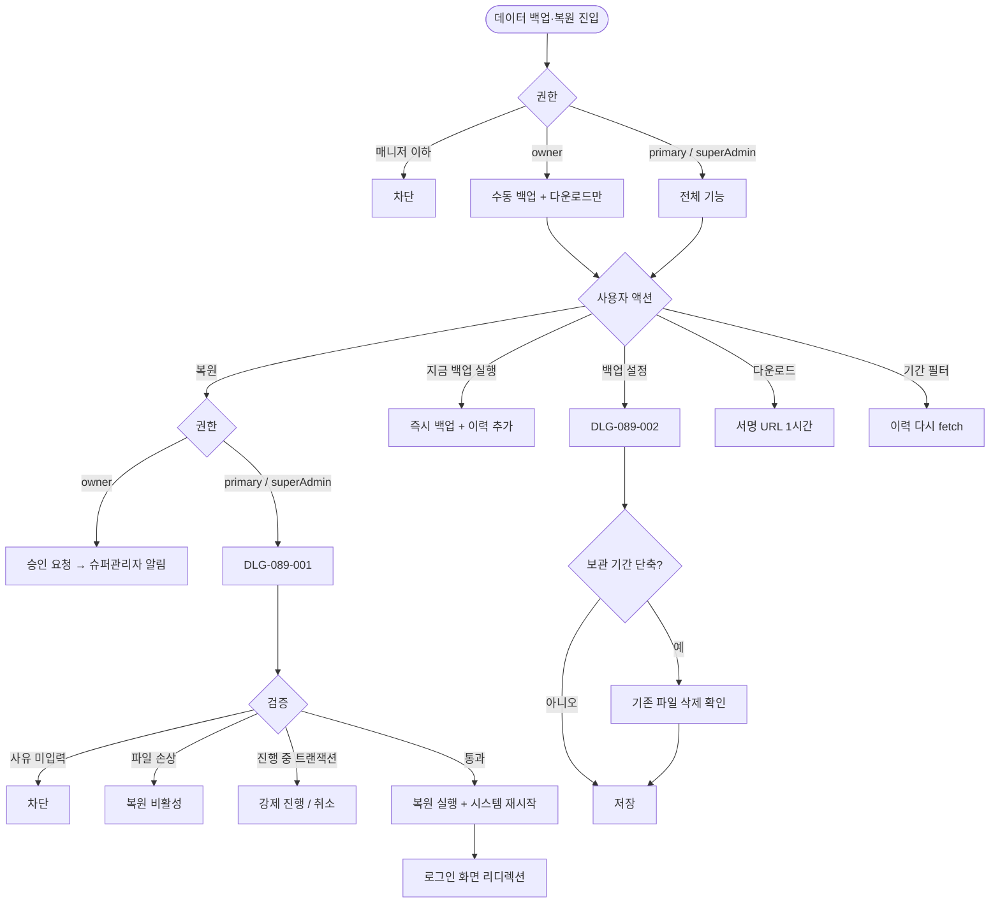
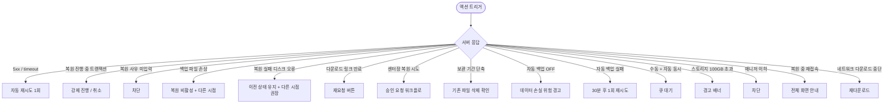

# SCR-089 데이터 백업·복원 페이지

## 1. 화면 메타 정보

이 문서는 데이터 백업·복원 페이지에 대한 자기완결형 요구사항 정의서입니다.

| 항목 | 값 |
|---|---|
| 작성일 | 2026-05-22 |
| 버전 | v1.0 |
| 상태 | 최신 통합본 반영 (정합화 완료) |
| 도메인 | D09 설정관리 |
| 화면 ID | SCR-089 |
| 화면명 | 데이터 백업·복원 |
| 화면 유형 | 시스템 운영 화면 (Disaster Recovery Screen) |
| 라우트 (URL) | `/settings/backup` |
| 플랫폼 | 데스크톱(기본) |
| 우선순위 | P0 (출시 필수) |
| 기능코드 | SET-EXT-03 (데이터 백업·복원) |
| 계약코드 | SET-EXT-03 |
| 계약 상태 | 계약 범위 본기능 |
| 부모 기능 prefix | SET |
| Lv1 코드 | SET-EXT-03 |
| Lv2 / Lv3 세분화 | SET-EXT-03-01 ~ SET-EXT-03-06 (자동 백업·수동 백업·백업 이력·시점 복원·복원 이력·다운로드) |
| 연계 화면 | SCR-097 감사로그 |
| 호출 다이얼로그 | DLG-089-001 데이터복원확인, DLG-089-002 백업설정 |

## 2. 화면 개요와 목적

데이터 백업·복원 페이지는 센터 운영 데이터의 안전망을 관리하는 시스템 운영 화면입니다. 자동 백업 주기 설정, 수동 백업 즉시 실행, 백업 이력 조회와 다운로드, 시점 복원, 복원 이력 추적이 한 화면에 모여 있어 데이터 손실 사고에 대비합니다. 복원 시 시스템 재시작이 발생하므로 슈퍼관리자 전용 또는 센터장의 슈퍼관리자 승인 워크플로로 제한됩니다.

운영 흐름은 다음과 같습니다. 시스템 마이그레이션 전날 슈퍼관리자가 [지금 백업 실행]으로 즉시 백업을 진행하고 [다운로드]로 외부 스토리지에 추가 보관합니다. 자동 백업 스케줄(매일 03:00 + 90일 보관 + 암호화)을 설정하면 평상시 운영 데이터 안전망이 확보됩니다. 직원 실수로 회원이 대량 삭제된 경우 백업 이력에서 삭제 직전 백업을 선택해 [복원] → DLG-089-001 → 사유 입력 → 복원 실행으로 시점 복구합니다. 센터장이 복원이 필요할 때는 "슈퍼관리자 승인 요청" 안내를 누르면 슈퍼관리자에게 승인 요청 알림이 발송되고 승인 후 자동 복원이 실행됩니다. 보관 기간을 단축하면 기존 초과 파일이 즉시 삭제되므로 변경 전 확인 모달이 표시됩니다. 백업 파일 손상(checksum 불일치) 시 이력에 "손상" 배지가 부착되어 [복원] 버튼이 비활성됩니다.

핵심 정책은 다음과 같습니다. 첫째, 복원은 슈퍼관리자 권한 또는 센터장의 슈퍼관리자 승인 후에만 실행 가능합니다. 둘째, 복원 시 시스템이 재시작되며 진행 중인 작업이 중단될 수 있습니다. 셋째, 백업 파일은 AES-256 암호화되며 다운로드 시 권한 검증이 필요합니다. 넷째, 복원 사유는 필수 입력입니다. 다섯째, 모든 백업·복원은 SCR-097 감사 로그에 기록됩니다. 여섯째, 백업 파일 자체는 보관 기간 후 삭제되나 이력 메타데이터는 영구 보관됩니다.

## 3. 진입 경로와 인접 화면

이 화면에 진입하는 경로는 사이드바의 "설정 > 데이터 백업·복원"이며 owner와 superAdmin/primary에게만 노출됩니다. 매니저 이하는 메뉴 자체가 보이지 않습니다.

두 번째 경로는 알림 센터의 "자동 백업 실패" 또는 "스토리지 용량 경고" 알림을 누르는 경우입니다.

세 번째 경로는 센터장의 복원 승인 요청 후 슈퍼관리자가 승인 알림을 누르는 경우입니다.

인접 화면은 SCR-097 감사 로그입니다.

## 4. 레이아웃과 UI 구성

페이지 헤더에 "데이터 백업·복원" 타이틀과 [백업 설정] / [지금 백업 실행] 두 개의 핵심 액션 버튼이 우측에 배치됩니다.

본문은 다섯 개의 섹션으로 구성됩니다.

첫 번째 섹션은 자동 백업 설정 카드입니다. 현재 자동 백업 활성 여부, 백업 주기(매일/매주/매월), 백업 실행 시각, 보관 기간(30/90/180일/무제한), 마지막 자동 백업 시각이 카드 형태로 표시됩니다. [백업 설정] 버튼으로 DLG-089-002를 호출해 상세 설정을 변경할 수 있습니다.

두 번째 섹션은 수동 백업 카드입니다. [지금 백업 실행] 버튼, 마지막 백업 일시, [최신 백업 다운로드] 버튼이 있습니다. 다운로드는 슈퍼관리자 전용이며 파일 암호화·서명 URL 만료·감사 로그 기록 정책이 확정된 뒤 활성화됩니다.

세 번째 섹션은 백업 이력 테이블입니다. 컬럼은 백업 일시·데이터 크기·백업 방식(자동/수동)·상태(성공/실패/진행 중)·암호화 여부(암호화/미암호화 배지)·액션([복원] / [다운로드])입니다. 기간 필터는 오늘·이번 주·이번 달·사용자 지정 네 가지입니다. 백업 파일 손상이 감지된 행은 "손상" 배지가 부착되고 [복원]이 비활성됩니다.

네 번째 섹션은 복원 이력 테이블입니다. 컬럼은 복원 일시·복원 백업 시점·실행자·복원 사유·복원 결과(성공/실패)입니다. 기간 필터는 동일 4종입니다. 복원 이력은 영구 보관되며 삭제 불가합니다.

다섯 번째 섹션은 스토리지 용량 모니터링 카드입니다. 누적 백업 크기와 임계값(100GB) 대비 사용률이 표시되며, 100GB 초과 시 경고 배너가 활성됩니다.

페이지 상단에는 복원 진행 중일 때 전체 화면 오버레이가 표시되어 "복원이 진행 중입니다. N분 후 완료됩니다" 안내와 함께 다른 모든 액션이 차단됩니다.

## 5. 탭 구성과 탭별 동작

이 화면은 탭 구조 없이 다섯 개의 섹션이 세로로 펼쳐집니다. 백업 이력과 복원 이력 테이블의 기간 필터가 1차 분기 역할을 합니다.

## 6. 버튼·아이콘·링크 액션 전체 정의

[백업 설정] 버튼은 DLG-089-002 백업 설정 다이얼로그를 열어 자동 백업 주기·시각·보관 기간·암호화 옵션을 편집합니다.

[지금 백업 실행] 버튼은 즉시 수동 백업을 트리거합니다. 진행 표시와 함께 백업이 완료되면 이력에 행이 추가됩니다. 백업 진행 중에는 버튼이 비활성됩니다.

[최신 백업 다운로드] 버튼은 가장 최근 성공한 백업 파일을 다운로드합니다. 서명된 URL이 1시간 유효합니다. 슈퍼관리자 전용입니다.

행의 [복원] 버튼은 DLG-089-001 데이터 복원 확인 다이얼로그를 호출합니다. 영향 안내·진행 중 트랜잭션 경고·복원 사유 입력이 함께 표시됩니다. 백업 파일 손상 또는 슈퍼관리자가 아닌 경우 버튼이 비활성됩니다.

센터장이 복원이 필요할 때는 [복원] 버튼이 [승인 요청] 형태로 변경되어 누르면 슈퍼관리자에게 승인 요청 알림이 발송됩니다.

행의 [다운로드] 버튼은 그 백업 파일을 다운로드합니다. 서명된 URL이 1시간 유효합니다.

기간 필터는 누르면 즉시 테이블이 다시 fetch됩니다.

## 7. 호출되는 모달 동작

### 7-1. DLG-089-001 데이터 복원 확인

데이터 복원 확인 다이얼로그는 [복원] 버튼으로 호출됩니다. 복원 시점·복원 시점 이후 데이터 손실 안내·진행 중 트랜잭션 경고·복원 사유 입력이 함께 표시됩니다. 사유 미입력 시 [복원 실행] 버튼이 비활성됩니다. 진행 중 트랜잭션이 있는 경우 "N건 진행 중 — 복원 시 취소됨" 경고가 표시되고 강제 진행 또는 취소를 선택합니다. 복원 실행 시 시스템 재시작 안내(N분 소요)가 표시됩니다.

### 7-2. DLG-089-002 백업 설정

백업 설정 다이얼로그는 자동 백업 주기·시각·보관 기간·암호화 옵션을 편집합니다. 보관 기간 단축 시 "기존 초과 파일 N건이 즉시 삭제됩니다" 확인 모달이 한 단계 더 표시됩니다. 자동 백업 OFF 시 "데이터 손실 위험" 경고 모달이 표시됩니다.

## 8. 토스트와 확인 팝업과 알럿

성공 토스트는 "백업이 완료되었습니다", "백업 설정이 저장되었습니다", "다운로드가 시작되었습니다" 같은 문구로 표시됩니다.

실패 토스트는 "백업에 실패했습니다", "복원에 실패했습니다", "다운로드 링크가 만료되었습니다" 같은 문구와 함께 재시도 안내가 따라옵니다.

확인 팝업은 보관 기간 단축, 자동 백업 OFF, 백업 파일 손상으로 복원 차단 등에서 표시됩니다.

전체 화면 오버레이는 복원 진행 중일 때 표시되어 다른 액션을 차단합니다. 복원 완료 후 로그인 화면으로 자동 리디렉션됩니다.

알럿은 권한 부족 시 차단 표시됩니다.

## 9. 데이터 흐름과 외부 연동

화면 진입 시 `GET /api/backup/settings`로 자동 백업 설정, `GET /api/backup/history`로 백업 이력, `GET /api/backup/restore-history`로 복원 이력이 fetch됩니다.

수동 백업 실행은 `POST /api/backup/run`으로 트리거되며 비동기 처리됩니다.

백업 설정 변경은 `PUT /api/backup/settings`로 처리됩니다.

복원은 `POST /api/backup/:id/restore`로 트리거됩니다. 사유와 진행 중 트랜잭션 강제 진행 여부가 요청에 포함됩니다.

다운로드 URL 생성은 `GET /api/backup/:id/download`로 서명된 임시 URL(유효 1시간)을 발급받습니다.

센터장의 승인 요청은 `POST /api/backup/restore-approval-request`로 처리되며 슈퍼관리자에게 알림이 발송됩니다.

자동 백업 배치는 설정된 주기·시각에 실행되어 전체 DB 스냅샷을 생성하고 S3/Object Storage에 AES-256 암호화로 저장합니다. 이력 INSERT가 함께 처리됩니다.

자동 백업 실패 재시도는 30분 후 1회 시도되며, 재실패 시 운영자 알림이 발송됩니다.

백업 파일 만료 삭제 배치는 매일 04:00에 보관 기간 초과 파일을 삭제하며 이력 메타데이터는 유지됩니다.

무결성 검증 배치는 백업 완료 이벤트마다 checksum(SHA-256)을 계산해 이력 레코드에 저장합니다. 복원 전 checksum 재검증 시 불일치 시 손상 처리됩니다.

자동 백업 2회 연속 실패 시 슈퍼관리자에게 이메일·앱 알림이 발송됩니다.

스토리지 용량 모니터링 배치는 매일 06:00에 누적 백업 크기를 집계해 100GB 초과 시 경고 배너를 활성합니다.

복원 완료 후 시스템 재시작 이벤트는 애플리케이션 서버 재시작 → 사용자 세션 초기화 → 로그인 화면 리디렉션으로 처리됩니다.

타임존 기반 실행 시각 표시는 저장된 UTC 시각을 SET-05의 설정 타임존으로 변환해 표시합니다.

모든 백업·복원·설정 변경은 SCR-097 감사 로그에 actor·type·backup_id·timestamp·사유 INSERT됩니다.

화면에서 호출하는 주요 API는 `GET /api/backup/settings`, `PUT /api/backup/settings`, `POST /api/backup/run`, `GET /api/backup/history`, `POST /api/backup/:id/restore`, `GET /api/backup/:id/download`, `GET /api/backup/restore-history`, `POST /api/backup/restore-approval-request`입니다.

## 10. 화면 상태와 예외 처리

기본·백업 진행 중·백업 완료·복원 진행 중(전체 화면 오버레이)·이력 없음·백업 파일 손상·스토리지 경고·권한 부족 등 상태를 가집니다.

예외 케이스: 복원 시 진행 중 트랜잭션 / 복원 사유 미입력(차단) / 백업 파일 손상 checksum 불일치(복원 비활성) / 복원 실패 디스크 오류(이전 상태 유지) / 다운로드 링크 만료 1시간(재요청) / 센터장 복원 시도(승인 요청 워크플로) / 보관 기간 단축 시 기존 파일 삭제 확인 / 자동 백업 OFF 시도(경고) / 자동 백업 실패(재시도 1회 후 알림) / 수동 백업 + 자동 백업 동시(큐 대기) / 스토리지 100GB 초과(경고 배너) / 백업 이력 없음(빈 상태) / 매니저 이하 접근 차단 / 복원 진행 중 재접속(전체 화면 안내) / 백업 파일 네트워크 다운로드 중단 등.

## 11. 권한별 처리

슈퍼관리자와 본사 최고관리자는 전체 백업·복원·다운로드·설정 변경이 가능합니다.

센터장(owner)은 소속 지점 백업 이력 조회와 수동 백업·다운로드가 가능합니다. 복원은 슈퍼관리자 승인 후에만 실행 가능하며, [복원] 버튼이 [승인 요청] 형태로 표시됩니다.

매니저·FC·트레이너·스태프·프런트·readonly는 이 화면에 접근할 수 없습니다.

## 12. 메인 흐름

## 13. 에러와 예외 흐름

## 14. 핵심 디자인 요청사항

페이지 헤더의 [지금 백업 실행] 버튼은 강한 강조 색상으로 표시되어 즉시 백업 동선이 명확합니다.

자동 백업 설정 카드는 현재 활성 여부·다음 백업 시각·보관 기간이 한눈에 보여야 합니다.

백업 이력 테이블의 암호화 배지는 색상으로 명확히 구분되며, 손상 배지는 빨강 톤으로 강조되어 [복원] 비활성 상태가 즉시 인식됩니다.

복원 진행 중 전체 화면 오버레이는 다른 모든 상호작용을 차단하며 진행률과 예상 완료 시각이 큰 글자로 표시됩니다.

스토리지 용량 모니터링 카드는 누적 크기와 임계값 대비 사용률이 프로그레스 바로 시각화됩니다. 100GB 초과 시 빨강 톤으로 강조됩니다.

센터장의 [승인 요청] 버튼은 슈퍼관리자의 [복원] 버튼과 시각적으로 분리되어 권한 차이가 명확히 보입니다.

## 15. 운영 정책 (이 화면에 연결된 부분)

자동 백업은 후순위 옵션입니다. 활성화된 경우 설정된 주기·시각에 자동 실행되며 보관 기간 경과 시 자동 삭제됩니다.

수동 백업은 즉시 실행되며 자동 백업과 별도 보관됩니다.

복원은 슈퍼관리자 권한 또는 센터장의 슈퍼관리자 승인 후에만 실행 가능합니다(오작동 방지).

복원 시 시스템이 재시작되며 진행 중 작업이 중단될 수 있습니다.

백업 파일은 AES-256 암호화되어 저장되며 다운로드 시에도 권한 검증이 필요합니다.

모든 백업·복원 이력은 감사 로그에 기록됩니다.

무결성 검증은 백업 완료 후 checksum(SHA-256)이 생성·저장되며, 복원 전 checksum 재검증이 일어나 불일치 시 손상 처리됩니다.

다운로드 링크 유효 기간은 다운로드 요청 후 서명된 URL이 1시간 유효합니다. 만료 후 재요청이 필요합니다.

복원 사유는 DLG-089-001에서 필수 입력되며 감사 로그에 사유가 포함됩니다.

트랜잭션 점검은 복원 전 진행 중 결제·예약 트랜잭션 카운트가 표시되고, 복원 시 해당 트랜잭션이 취소된다는 안내가 표시됩니다.

보관 기간 단축 시 소급 삭제 정책은 기존 초과 파일을 즉시 삭제하며, 변경 전 확인 모달이 필수로 표시됩니다.

자동 백업과 수동 백업 동시 실행 방지 정책은 백업 진행 중 다른 백업 요청이 들어오면 큐에 대기하다가 완료 후 순차 실행됩니다.

복원 후 복원 시점 이후 데이터 손실은 복원 시점 이후 생성·수정된 데이터가 모두 손실됨을 DLG-089-001에서 명시합니다.

센터장 복원 승인 워크플로는 센터장이 복원 요청 시 슈퍼관리자에게 승인 요청 알림이 발송되고 승인 후 자동 복원이 실행됩니다.

자동 백업 실패 시 30분 후 1회 재시도되며, 재실패 시 운영자에게 알림이 발송됩니다.

스토리지 용량 임계 경고는 누적 백업 크기 100GB 초과 시 경고 배너가 활성됩니다.

백업 이력 영구 보관 정책은 백업 파일 자체는 보관 기간 후 삭제되나 이력 메타데이터(일시·크기·방식·상태)는 영구 보관된다는 것입니다.

복원 이력 영구 보관 정책은 복원 실행 이력(일시·시점·실행자·사유·결과)이 영구 삭제 불가하며 감사 목적으로 영구 보관됩니다.

자동 백업 OFF 강제 경고는 데이터 손실 위험 경고 모달이 필수로 표시되며 확인 후에만 OFF 전환 가능합니다.

슈퍼관리자 전용 복원 접근은 [복원] 버튼이 슈퍼관리자에게만 활성되고, 센터장은 회색 처리 + [승인 요청] 버튼이 표시됩니다.

백업 실행 시각은 서버 UTC 기준으로 저장되며 UI에서는 SET-05의 설정 타임존으로 변환 표시됩니다.

이상의 모든 정책은 이 화면을 구현하고 운영하는 사람이 별도 문서 없이 이 한 장만 보면 이해할 수 있도록 풀어 적었습니다.
