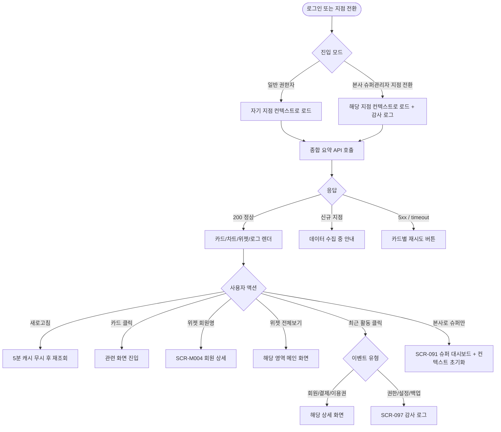
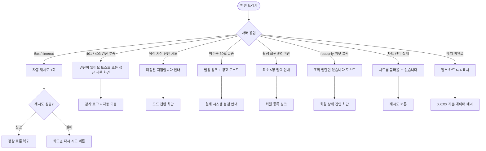

# SCR-090 본사 대시보드 (지점 대시보드) 페이지

## 1. 화면 메타 정보

이 문서는 본사 대시보드(지점 대시보드) 페이지에 대한 자기완결형 요구사항 정의서입니다. 다른 문서를 함께 보지 않아도 이 한 장만으로 이 화면에 들어가는 모든 영역, 모든 버튼, 모든 위젯, 모든 권한, 모든 예외 처리, 그리고 이 화면을 지탱하는 운영 정책까지 전부 이해하고 구현할 수 있도록 작성합니다.

| 항목 | 값 |
|---|---|
| 작성일 | 2026-05-22 |
| 버전 | v1.0 |
| 상태 | 최신 통합본 반영 (정합화 완료) |
| 도메인 | D10 본사관리 |
| 화면 ID | SCR-090 |
| 화면명 | 본사 대시보드 (지점 대시보드) |
| 화면 유형 | 허브 화면 (Hub Screen) |
| 라우트 (URL) | `/` |
| 플랫폼 | 데스크톱(기본), 태블릿, 모바일(축소형 카드 리스트) |
| 우선순위 | P0 (출시 필수) |
| 기능코드 | DASH-01 |
| 계약코드 | DASH-01, DASH-02, DASH-03, DASH-04 |
| 계약 상태 | 계약 범위 본기능 |
| 부모 기능 prefix | DASH |
| Lv1 코드 | DASH-01 |
| Lv2 / Lv3 세분화 | DASH-01-01 ~ DASH-01-07 (핵심 지표 카드, 분포 차트, 추이 차트, 주의 대상 위젯, 최근 활동 로그, 상단 액션, 회원 상세 진입) |
| 연계 화면 | SCR-091 슈퍼대시보드, SCR-092 지점관리, SCR-093 지점성과리포트, SCR-094 KPI대시보드, SCR-097 감사로그, SCR-098 오늘의할일, SCR-071 메시지발송, SCR-101 통합대시보드, SCR-M001 회원목록, SCR-M004 회원상세, SCR-M013 만료임박, SCR-S001 매출현황, SCR-S009 미수금관리 |
| 호출 다이얼로그 | 없음 (위젯 상세 패널만 슬라이드) |

## 2. 화면 개요와 목적

본사 대시보드는 Owner(지점장)·매니저(manager)·FC·스태프가 로그인하자마자 자동으로 진입하는 운영 메인 화면입니다. 본사 슈퍼관리자가 슈퍼 대시보드(SCR-091)에서 "지점 전환"을 누르고 들어왔을 때도 같은 화면이 표시되며, 다만 이 경우에는 어느 지점 컨텍스트로 보고 있는지가 헤더에 명시됩니다. 운영 명칭은 "지점 대시보드"이지만 D10 본사관리 도메인 안에서 다루어지므로 도메인 폴더에서는 본사 대시보드라는 이름으로도 통용됩니다. 공통 통합 진입 뷰(SCR-101)는 별도로 관리되며, 이 화면은 어디까지나 단일 지점 컨텍스트의 운영 컨트롤 타워입니다.

이 화면이 다루는 운영 흐름은 매우 다양합니다. Owner(지점장)은 출근 직후 5개의 핵심 지표 카드를 한눈에 훑으면서 오늘의 출석과 이번 달 매출이 정상 페이스인지 점검하고, 주의 대상 위젯 4종(생일 회원, 미수금 발생 회원, 홀딩 중 회원, 만료 임박 회원)을 보면서 오늘 안에 처리해야 할 액션의 우선순위를 결정합니다. 매니저는 만료 임박 위젯에서 회원명을 클릭해 회원 상세(SCR-M004)로 들어가 재등록 상담을 시작하고, FC는 생일 위젯에서 [전체보기]를 눌러 메시지 발송(SCR-071)으로 일괄 축하 메시지를 보냅니다. 본사 슈퍼관리자가 지점 전환으로 들어온 경우에는 해당 지점의 액션 큐 진입(SCR-098)으로 후속 액션을 분배합니다. 저녁 마감 시점에는 이번 달 매출 카드와 오늘 출석 카드를 보면서 일일 마감 보고를 만들고, 매출 추이 차트로 월중 목표 달성 가능성을 판단합니다. 신규 사용자가 처음 로그인하면 환영 배너가 상단에 표시되어 시스템 사용법을 안내합니다.

따라서 이 화면은 단순히 숫자를 나열하는 보드가 아니라, 권한·상태·정책·외부 연동·자동화 배치 결과까지 모두 반영된 운영 허브로 동작해야 합니다.

## 3. 진입 경로와 인접 화면

본사 대시보드 페이지에 진입하는 경로는 여러 가지이고, 각 경로마다 진입 직후 화면의 초기 상태가 조금씩 달라집니다.

첫 번째 경로는 로그인입니다. 사용자가 관리자 웹에 로그인하면 권한과 상관없이 가장 먼저 이 화면이 표시됩니다. superAdmin·primary는 로그인 직후 슈퍼 대시보드(SCR-091)가 디폴트일 수도 있고, 운영 정책에 따라 본사 대시보드가 디폴트일 수도 있습니다. 일반 권한자는 항상 본사 대시보드가 첫 화면이 됩니다.

두 번째 경로는 슈퍼 대시보드(SCR-091)에서 "지점 전환" 버튼을 누른 경우입니다. 본사 슈퍼관리자가 특정 지점 카드의 "지점 전환"을 클릭하면 그 지점 컨텍스트로 본사 대시보드 화면에 진입하며, 헤더에 "현재 지점: XX점 (본사 모드 → 지점 모드)"가 표시됩니다. 이 모드에서는 RLS가 우회되어 해당 지점의 모든 데이터가 보입니다.

세 번째 경로는 사이드바의 본사관리 메뉴를 직접 클릭하는 경우입니다. 다른 화면에서 작업하다가 사이드바의 "지점 대시보드" 또는 "대시보드" 메뉴로 돌아올 때 진입합니다.

네 번째 경로는 인접 화면에서 "대시보드로 돌아가기" 링크를 누르는 경우입니다. 알림 센터(SCR-104)나 글로벌 검색(SCR-103)에서 메인으로 돌아오는 경로로도 사용됩니다.

이 화면에서 다시 빠져나가는 인접 화면은 매우 다양합니다. 위젯의 회원명을 클릭하면 회원 상세(SCR-M004)로 진입하고, 위젯의 [전체보기] 링크는 만료 임박 위젯은 SCR-M013, 미수금 위젯은 SCR-S009, 홀딩 위젯은 SCR-M001(홀딩 필터), 생일 위젯은 SCR-071 메시지 발송으로 이동합니다. 최근 활동 로그의 회원 관련 이벤트는 회원 상세로, 결제 이벤트는 SCR-S001 매출 현황으로, 권한·설정·백업·복원 이벤트는 SCR-097 감사 로그 상세로 분기됩니다. 본사 슈퍼관리자가 본사 모드로 복귀하려면 헤더의 [본사로] 또는 사이드바를 통해 SCR-091로 돌아갑니다.

## 4. 레이아웃과 UI 구성

본사 대시보드는 위에서 아래로 흐르는 세로형 단일 컬럼 레이아웃을 기본으로 합니다. 데스크톱에서는 가로 폭이 넓으므로 카드와 차트가 2~3열 그리드로 배치되고, 태블릿에서는 2열, 모바일에서는 1열로 자동 재배치됩니다. 화면은 위에서부터 다음 영역이 순서대로 쌓입니다.

가장 위에는 페이지 헤더가 있습니다. 헤더 좌측에는 "지점 대시보드"라는 페이지 타이틀과 함께 현재 조회 중인 지점을 알려주는 지점 컨텍스트 배지가 따라옵니다. 일반 사용자는 자기 소속 지점이 그대로 표시되고, 본사 슈퍼관리자가 지점 전환으로 들어온 경우에는 "본사 모드 → 지점 모드: XX점"라는 모드 표시가 함께 나옵니다. 헤더 우측에는 수동 새로고침 버튼이 있고, 첫 방문 사용자에게는 환영 배너가 헤더 아래에 표시되며 닫기 버튼으로 제거합니다. 환영 배너는 사용자별로 1회만 보이고, 닫고 나면 `welcomed_at` 플래그가 저장되어 다시 표시되지 않습니다.

페이지 헤더 바로 아래에는 핵심 지표 요약 카드 5개가 가로로 배치됩니다. 첫 번째 카드는 "전체 회원 수"로 등록된 모든 회원의 합계를 보여주고, 두 번째 카드는 "활성 회원 수"로 status=active 상태인 회원만 카운트합니다. 세 번째 카드는 "만료 예정 (30일 이내)"으로 만료일이 D-30 안에 있는 회원 수입니다. 네 번째 카드는 "오늘 출석 수"로 오늘 00:00~23:59 출입 기록 합계이며 중복 출입은 1회로만 카운트됩니다. 다섯 번째 카드는 "이번 달 매출"로 1일부터 오늘까지의 결제 합계이며 환불 금액이 차감된 순매출입니다. 각 카드는 호버 시 약간의 그림자가 들어가고, 권한이 있으면 클릭해서 관련 화면으로 진입할 수 있습니다.

요약 카드 바로 아래에는 분포 차트 영역이 있습니다. 좌측에는 회원 성별 분포 원형 차트, 우측에는 회원 연령대 분포 막대 차트가 배치되며, 두 차트 모두 활성 회원 기준으로 계산됩니다. 활성 회원이 5명 미만인 신규 지점에서는 "최소 5명 이상 데이터 필요"라는 안내가 표시되고, 성별 미입력 회원은 "미상" 카테고리로 분류됩니다.

분포 차트 아래에는 추이 차트 영역이 있습니다. 좌측에는 월별 매출 추이 선 차트(최근 12개월), 우측에는 주간 출석 현황 막대 차트(최근 8주)가 배치되며, 사용자가 토글로 기간 범위를 변경할 수 있습니다.

추이 차트 아래에는 주의 대상 위젯 4종이 2×2 또는 4열 그리드로 배치됩니다. 첫 번째 위젯은 "오늘 생일 회원"으로 오늘 생일인 회원 명단이 표시되며, 음력 생일 옵션과 이번 주 생일 토글이 함께 제공됩니다. 두 번째 위젯은 "미수금 발생 회원"으로 결제 미완료 + 만료일 경과 회원이 명단과 금액 합계로 표시되며, 전일 대비 30% 이상 급증하면 카드가 빨강으로 강조되고 알림 토스트가 뜹니다. 세 번째 위젯은 "홀딩 중인 회원"으로 현재 홀딩 상태 회원이 명단과 홀딩 기간으로 표시되고 홀딩 종료일 임박 순으로 정렬됩니다. 네 번째 위젯은 "만료 임박 회원"으로 30일 이내 만료 회원이 명단과 만료일로 표시됩니다. 각 위젯의 우측 상단에는 [전체보기] 링크가 있어서 해당 영역의 메인 화면(만료 임박은 SCR-M013, 미수금은 SCR-S009 등)으로 이동합니다.

주의 대상 위젯 아래에는 최근 활동 로그 영역이 있습니다. 현재 지점 기준 최근 10건의 시스템 활동 이력이 시간순으로 나열되며, 각 행에는 발생 시각, 작업자(이름·계정), 작업 유형 아이콘, 작업 대상, 요약 문구가 표시됩니다. 표시 대상이 되는 이벤트는 회원 등록·수정·탈퇴·복구, 결제 등록·취소·환불, 이용권 등록·홀딩·연장·만료 처리, 수업 등록·수정·취소·출석·노쇼 처리, 권한 변경, 백업·복원, 중요 설정 변경입니다. 단순 조회, 페이지 진입, 자동 새로고침, 실패 없는 백그라운드 polling은 제외됩니다. 행을 클릭하면 대상이 명확한 이벤트는 해당 상세 화면(회원 상세, 결제 상세 등)으로 이동하고, 설정·권한·감사 이벤트는 감사 로그 상세(SCR-097)로 이동합니다. 영역 우측에는 [전체보기] 링크가 있어서 SCR-097로 현재 지점 필터를 유지한 채 이동합니다. 활동이 한 건도 없으면 "최근 활동이 없습니다"라는 빈 상태 안내가 표시됩니다.

본사 슈퍼관리자가 지점 전환으로 들어온 경우에는 화면 우측 상단 또는 헤더에 [본사로] 버튼이 추가로 노출되어, 슈퍼 대시보드(SCR-091)로 즉시 복귀할 수 있습니다.

## 5. 탭 구성과 탭별 동작

이 화면은 별도의 탭 구조를 가지지 않습니다. 모든 위젯이 한 화면에 동시에 표시되며, 운영자는 위에서 아래로 스크롤하거나 위젯 [전체보기] 링크를 통해 깊은 화면으로 진입합니다. 다만 추이 차트의 기간 토글(매출 12개월/6개월/3개월, 출석 8주/4주/2주)과 생일 위젯의 오늘/이번 주 토글이 작은 단위의 뷰 전환을 제공합니다.

본사 슈퍼관리자가 본사 모드와 지점 모드를 오가는 것은 사실상 탭 전환과 같은 의미를 가지지만, 이는 SCR-091(슈퍼 대시보드)과 SCR-090(본사 대시보드) 사이의 화면 전환으로 처리되며 같은 화면 내부의 탭이 아닙니다.

## 6. 버튼·아이콘·링크 액션 전체 정의

이 화면에 등장하는 모든 클릭 가능한 요소를 빠짐없이 정의합니다.

페이지 헤더의 수동 새로고침 버튼은 모든 카드·차트·위젯 데이터를 즉시 재조회하며 5분 캐시를 무시합니다. 모든 권한에서 사용 가능합니다.

환영 배너의 [둘러보기] 버튼은 시스템 주요 기능 가이드 화면 또는 도움말 모달로 이동하며, 닫기 버튼(X)은 배너를 숨기고 사용자별 `welcomed_at` 플래그를 저장합니다. 한 번 닫으면 재로그인해도 다시 표시되지 않습니다.

핵심 지표 요약 카드 5개는 권한이 있을 때 클릭 가능합니다. 전체 회원 수 카드를 누르면 회원 목록(SCR-M001) 전체 필터로 이동하고, 활성 회원 수 카드는 활성 필터, 만료 예정 카드는 SCR-M013 만료 임박 또는 SCR-M001의 만료 예정 필터, 오늘 출석 수 카드는 출석 관리 화면, 이번 달 매출 카드는 SCR-S001 매출 현황으로 이동합니다. readonly 권한자는 카드 클릭이 비활성화됩니다.

분포 차트의 항목 클릭은 해당 항목으로 필터링된 회원 목록으로 이동합니다(예: "여성" 슬라이스 클릭 → SCR-M001?gender=female). 추이 차트는 마우스 오버 시 해당 시점의 정확한 수치가 툴팁으로 표시되고, 점 또는 막대 클릭으로 해당 기간의 상세 매출/출석 화면으로 진입할 수 있습니다.

주의 대상 위젯의 회원명 클릭은 회원 상세(SCR-M004)로 이동합니다. RLS로 차단된 회원은 위젯에 표시되지 않으므로 권한 없는 진입이 발생하지 않습니다. readonly 권한자는 회원 상세 진입이 차단되어 안내 토스트가 표시됩니다.

각 위젯의 [전체보기] 링크는 화면 단위로 분기됩니다. 생일 위젯 [전체보기]는 이번 달 생일자 전체 목록 또는 SCR-071 메시지 발송으로 이동하고, 미수금 위젯 [전체보기]는 SCR-S009 미수금 관리로, 홀딩 위젯 [전체보기]는 SCR-M001의 홀딩 필터로, 만료 임박 위젯 [전체보기]는 SCR-M013 또는 SCR-M001의 만료 임박 필터로 이동합니다.

최근 활동 로그의 행 클릭은 이벤트 유형에 따라 분기됩니다. 회원 등록·수정·탈퇴·복구는 SCR-M004 회원 상세, 결제 등록·취소·환불은 결제 상세 또는 SCR-S001, 이용권 등록·홀딩·연장·만료는 이용권 상세, 수업 등록·수정·취소·출석·노쇼는 수업/예약 화면, 권한 변경·백업·복원·중요 설정 변경은 SCR-097 감사 로그 상세로 이동합니다. [전체보기]는 SCR-097로 현재 지점 필터가 유지된 채 이동합니다.

본사 슈퍼관리자의 [본사로] 버튼은 세션 컨텍스트의 `current_branch_id`를 해제하고 SCR-091 슈퍼 대시보드로 이동합니다.

모든 버튼은 클릭 후 응답이 돌아오기 전까지 자동으로 비활성화되며, 위젯 데이터 로딩 중에도 다른 위젯과 헤더는 정상 동작합니다.

## 7. 호출되는 모달 동작

본사 대시보드 화면에서는 별도의 다이얼로그가 호출되지 않습니다. 모든 액션은 화면 전환 또는 위젯 내부의 인라인 동작으로 처리됩니다. 다만 몇 가지 인라인 확인 UI는 존재합니다.

환영 배너 닫기는 별도 확인 없이 즉시 닫히지만, 사용자별 `welcomed_at` 플래그가 저장되어 다시는 표시되지 않습니다.

본사 슈퍼관리자의 지점 전환 또는 [본사로] 액션은 별도 확인 다이얼로그 없이 즉시 모드가 전환되고 자동 이동합니다. 다만 모든 모드 전환은 감사 로그(SCR-097)에 actor·source_branch_id·target_branch_id·timestamp로 자동 기록됩니다.

위젯의 회원명 클릭이나 [전체보기] 링크 클릭도 즉시 화면이 전환되며, 별도의 확인 모달은 띄우지 않습니다.

## 8. 토스트와 확인 팝업과 알럿

본사 대시보드에서 발생하는 알림성 UI는 다음과 같은 패턴으로 동작합니다.

성공 토스트는 우측 상단에 녹색 계열로 5초 동안 표시됩니다. "데이터를 새로고침했어요", "환영 배너를 닫았어요", "지점 모드로 전환했어요" 같은 짧은 결과 문구가 표시됩니다.

실패 토스트는 우측 상단에 빨강 계열로 표시되며, "데이터를 불러올 수 없어요", "이 지점에 접근 권한이 없어요", "환영 배너 닫기에 실패했어요" 같은 문구와 함께 [다시 시도] 또는 [새로고침] 보조 액션이 따라옵니다. 자동 재시도가 가능한 네트워크 오류는 5초 후 1회 자동으로 다시 시도된 다음 사용자 액션을 기다립니다.

알림 토스트는 주의 대상 위젯에서 이상 감지가 발생했을 때 표시됩니다. 미수금 위젯이 전일 대비 30% 이상 급증하면 "미수금이 전일 대비 {증가비율}% 급증했습니다"라는 경고 토스트가 자동으로 뜨고, 결제 시스템 점검 또는 일괄 미수 처리 안내 링크가 함께 제공됩니다.

권한 없는 계정이 직접 URL로 접근했을 때는 알럿 형태의 차단 UI가 표시됩니다. 본문이 모두 가려지고 "이 화면에 접근할 권한이 없습니다. 3초 후 대시보드로 이동합니다"라는 메시지가 표시되며 자동 이동됩니다. 슈퍼관리자가 폐점된 지점으로 모드 전환을 시도하면 "폐점된 지점입니다. 다른 지점을 선택해주세요"라는 안내가 표시되고 모드 전환이 차단됩니다.

분포 차트에서 활성 회원 5명 미만이면 "최소 5명 이상 데이터 필요"라는 안내가 차트 자리에 표시되고, 회원 등록 안내 링크가 함께 노출됩니다.

## 9. 데이터 흐름과 외부 연동

이 화면은 여러 데이터 소스와 외부 연동에 의존합니다.

화면 진입 시점에는 종합 요약 API가 호출됩니다. 응답으로는 5개 핵심 지표 카드의 현재값, 분포 차트 데이터(성별·연령대), 추이 차트 데이터(매출 12개월·출석 8주), 4개 주의 대상 위젯의 명단과 합계, 최근 활동 로그 10건이 한꺼번에 내려옵니다. 본사 슈퍼관리자가 지점 모드로 진입한 경우에는 세션 컨텍스트의 `current_branch_id`가 요청에 포함되어 해당 지점 데이터만 반환되며, RLS는 우회됩니다.

위젯 데이터의 캐시 정책은 5분이 기본입니다. 5분이 경과하면 자동으로 무효화되어 다음 조회 시 재계산되며, 큰 지점은 10분으로 늘릴 수 있습니다. 사용자가 수동 새로고침 버튼을 누르면 캐시가 즉시 무시되고 모든 카드·차트·위젯이 동시에 재조회됩니다.

핵심 지표 카드의 활성 회원 수와 매출은 매시간 배치(매 정각)로 갱신되고, KPI 일별 배치(매일 03:00)는 회원·매출·출석 데이터를 확정 집계합니다. NFR-05 회원 이용권 만료 결과 동기화(매일 00:00)는 만료 임박과 만료 회원을 분류하여 위젯에 사용합니다. 미수금 위젯은 결제 트랜잭션 이벤트에 따라 실시간 갱신되며, 출석 카운트는 출입 이벤트가 발생할 때마다 즉시 반영됩니다.

홀딩 자동 처리는 A04 배치(매일 새벽 2시)가 담당하며, 홀딩 종료일이 도래한 회원은 자동으로 활성 상태로 전환되고 만료일이 홀딩 기간만큼 연장됩니다. 이 결과는 다음 새로고침 시점에 위젯에 반영됩니다.

세그먼트 라벨은 D+1 배치(MBR-EXT-04, 매일 새벽 4시)로 갱신되므로, 만료 임박이나 이탈 위험 같은 라벨은 새벽 4시 이후에야 최신값이 반영됩니다.

이상 감지 배치는 매시간 실행되어 미수금이 전일 대비 30% 이상 급증한 경우와 직원 수 0 또는 출석 -50% 초과 같은 이상 신호를 감지하면 알림 센터(NFR-19)를 경유하여 슈퍼관리자 또는 Owner(지점장)에게 푸시 알림을 발송합니다.

본사 슈퍼관리자의 지점 모드 전환은 세션 컨텍스트에 `current_branch_id`를 설정하는 액션이고, 이는 감사 로그(SCR-097)에 자동 기록됩니다. 본사 모드 복귀는 컨텍스트를 초기화하고 슈퍼 대시보드로 이동합니다.

환영 배너 닫기는 사용자 프로필의 `welcomed_at` 필드를 현재 시각으로 업데이트하는 한 번의 API 호출이며, 다음 로그인부터 배너가 표시되지 않습니다.

위젯 클릭 이벤트(회원명 클릭, [전체보기] 클릭, 카드 클릭)는 사용 빈도 분석을 위해 익명으로 수집되며 개인정보는 포함되지 않습니다.

화면에서 호출하는 주요 API 엔드포인트는 다음과 같습니다. 종합 요약 `GET /api/dashboard/summary`, 차트 데이터 `GET /api/dashboard/charts`, 생일 위젯 `GET /api/dashboard/widgets/birthdays`, 미수금 위젯 `GET /api/dashboard/widgets/overdue`, 홀딩 위젯 `GET /api/dashboard/widgets/holding`, 만료 임박 위젯 `GET /api/dashboard/widgets/expiring`, 최근 활동 `GET /api/dashboard/recent-activities`, 환영 배너 닫기 `POST /api/dashboard/welcome-banner-dismiss`.

## 10. 화면 상태와 예외 처리

본사 대시보드는 다음 상태들을 가질 수 있고, 각 상태마다 사용자에게 보이는 모습이 달라집니다.

로딩 중 상태에서는 모든 카드·차트·위젯 자리에 스켈레톤이 표시됩니다. 헤더는 미리 렌더되지만 새로고침 버튼은 잠깐 비활성화됩니다.

정상 상태는 가장 일반적인 상태로, 5개 카드·2개 분포 차트·2개 추이 차트·4개 주의 대상 위젯·최근 활동 로그가 모두 정상으로 채워집니다.

신규 지점 상태는 등록된 회원이 거의 없거나 데이터가 막 수집되기 시작한 지점에서 나타납니다. 모든 카드 숫자가 0으로 표시되거나 분포 차트가 "최소 5명 이상 데이터 필요" 안내를 보여주고, 화면 상단에 "데이터를 수집 중입니다"라는 안내 배너가 표시됩니다.

위젯 부분 데이터 없음 상태는 일부 위젯만 비어 있는 경우입니다. "오늘 생일자가 없어요", "미수금이 없어요", "홀딩 중인 회원이 없어요", "HQ-09 만료 알림 대상 회원이 없어요"처럼 위젯별로 빈 상태 안내가 표시되며 위젯 자체는 숨기지 않습니다.

최근 활동 없음 상태는 최근 활동 로그 영역이 비어 있을 때이고, "최근 활동이 없습니다"라는 안내만 표시됩니다.

이상 감지 상태는 미수금 급증 같은 이상 신호가 감지되었을 때입니다. 해당 위젯이 빨강으로 강조되고 알림 토스트가 함께 뜹니다.

본사 지점 모드 상태는 슈퍼관리자가 지점 전환으로 들어온 상태입니다. 헤더에 컨텍스트 표시가 나오고 [본사로] 버튼이 노출됩니다.

권한 없음 상태는 readonly가 회원 상세 진입을 시도하거나 권한 없는 계정이 URL로 직접 들어왔을 때입니다. 회원 상세 진입 시도는 "조회 권한만 있습니다"라는 토스트로 안내되고, URL 직접 접근은 접근 제한 화면 후 자동 이동이 일어납니다.

오류 상태는 데이터 로드 실패 시이며, 카드별로 재시도 버튼이 표시되고 토스트에 "일시 오류, 잠시 후 다시 시도해주세요"가 뜹니다. 자동 재시도 1회 후 사용자 액션을 기다립니다.

캐시 만료 상태는 5분 캐시가 만료되어 다음 조회 시 재계산이 일어나는 시점입니다. 사용자에게는 거의 인지되지 않습니다.

차트 렌더링 실패 상태는 SVG 또는 차트 라이브러리 오류일 때 발생하며, "차트를 불러올 수 없습니다"라는 메시지와 재시도 버튼이 표시됩니다.

예외 케이스별 처리는 다음과 같이 정의됩니다.

네트워크 오류(5xx 또는 timeout)가 발생하면 카드별 재시도 버튼이 표시되고 5초 후 자동 재시도가 1회 일어납니다. 그래도 실패하면 사용자 액션을 기다립니다.

권한 없는 계정이 진입하면 접근 제한 화면이 표시되고 본인의 디폴트 화면(슈퍼 대시보드 또는 권한 없음 메시지)으로 자동 이동합니다.

본사 모드에서 폐점된 지점으로 전환을 시도하면 차단되고 안내 토스트가 표시됩니다.

readonly 권한자가 위젯의 회원명을 클릭하면 회원 상세 진입이 차단되고 "조회 권한만 있습니다"라는 토스트가 뜹니다.

미수금 위젯의 전일 대비 30% 이상 급증은 빨강 강조와 알림 토스트로 표시되고, 결제 시스템 점검 안내가 함께 제공됩니다.

분포 차트의 활성 회원 5명 미만은 "최소 5명 이상 데이터 필요" 안내로 차트가 대체되고, 회원 등록 안내 링크가 함께 표시됩니다.

위젯의 회원이 RLS로 차단된 경우에는 해당 회원이 위젯에 표시되지 않습니다.

본사 슈퍼관리자가 지점 전환 후 권한이 변경된 경우에는 자동으로 권한 컨텍스트가 갱신되어 그 권한 기준으로 동작합니다.

환영 배너 닫기 API가 실패하면 사용자에게는 일단 닫힘 상태를 보여주고, 백엔드는 재시도 3회까지 진행한 후 실패하면 다음 로그인 시 다시 표시될 수 있습니다.

## 11. 권한별 처리

이 화면은 권한에 따라 진입 가능 여부, 보이는 영역, 가능한 액션이 모두 달라집니다.

superAdmin와 primary는 모든 지점의 데이터를 볼 수 있습니다. 슈퍼 대시보드(SCR-091)에서 지점 전환으로 들어오면 해당 지점 컨텍스트에서 본사 대시보드가 표시되고, 헤더에 모드 표시와 [본사로] 버튼이 노출됩니다. 위젯과 카드의 모든 클릭이 가능하며, RLS가 우회되어 모든 회원의 상세에 접근할 수 있습니다. 본사 표준 정책 세트가 자동으로 적용된 상태로 데이터가 보입니다.

Owner(지점장)은 자기 지점만 볼 수 있습니다. 헤더의 지점 컨텍스트 배지에 본인 지점이 고정 표시되고, 본사 모드 토글은 보이지 않습니다. 위젯의 모든 회원에 접근 가능하며, [전체보기]로 회원 목록·매출 현황·미수금 관리 같은 메인 화면에 진입할 수 있습니다.

매니저(manager)는 자기 지점의 대시보드를 모두 볼 수 있고, 위젯 회원명 클릭으로 회원 상세에 진입할 수 있습니다. 만료 임박 위젯의 [전체보기]로 회원 목록의 만료 임박 필터로 이동해 일괄 메시지를 보내는 것도 가능합니다. 일괄 탈퇴 같은 고위험 액션은 회원 목록 화면에서 수행하며 이 화면에서는 직접 트리거되지 않습니다.

FC(fc)는 자기 지점의 대시보드를 볼 수 있고, 생일 위젯에서 메시지 발송으로 이동하거나 만료 임박 회원에게 재등록 상담을 진행하는 것이 주된 사용 패턴입니다. 본인 담당 회원 우선 표시 토글이 제공되는 경우도 있습니다.

스태프(staff)와 프런트(front)는 자기 지점의 대시보드를 보는 정도가 일반적이고, 출석 처리·미수금 회수 같은 액션을 위해 [전체보기]로 진입합니다.

트레이너(trainer)는 본인이 담당하는 회원만 위젯에 표시되도록 RLS가 적용됩니다. 다른 회원의 데이터는 보이지 않으며, 회원명 클릭은 회원 상세 조회만 가능합니다.

읽기 전용(readonly)은 화면 진입은 가능하지만 모든 카드·위젯·차트가 조회만 가능합니다. 카드 클릭이나 위젯의 회원명 클릭은 비활성화 또는 안내 토스트로 차단되고, [전체보기] 링크는 진입할 수는 있으나 다음 화면에서도 조회로 제한됩니다.

권한 외에도 운영 모드에 따라 일부 영역이 추가로 보이거나 숨겨집니다. 본사 통합 모드는 SCR-091에서만 의미가 있고 본 화면에서는 사용되지 않습니다. 환영 배너는 첫 방문 사용자에게만 1회 표시되며 권한과 무관합니다.

권한이 부족해서 액션이 차단된 경우의 사용자 경험은 단계별로 일관됩니다. 첫째, 사이드바·헤더·카드 같은 1차 진입점에서는 권한 외 요소가 숨겨지거나 비활성화됩니다. 둘째, 화면 내부에서 권한이 부족한 클릭은 안내 토스트로 차단됩니다. 셋째, 직접 URL 접근 같은 우회는 백엔드 403 응답으로 거부되고 감사 로그에 기록됩니다.

## 12. 메인 흐름

본사 대시보드의 핵심 동작 흐름입니다.

## 13. 에러와 예외 흐름

에러와 예외 상황에서의 분기를 별도 흐름으로 표현합니다.

## 14. 핵심 디자인 요청사항

이 화면이 운영자에게 잘 작동하려면 다음 디자인 원칙이 시각적으로 명확히 드러나야 합니다. 색상 토큰·간격·폰트 같은 일반 디자인 시스템 규칙은 별도로 다루고, 여기서는 본사 대시보드에 고유한 디자인 요청만 적습니다.

핵심 지표 요약 카드 5개는 동일 크기·동일 그리드로 배치되어 한눈에 비교 가능해야 합니다. 카드 안의 숫자는 가장 큰 폰트로, 라벨은 그 아래 작은 글씨로 배치되며, 권한이 있을 때만 호버 시 약간의 그림자와 색상 변화가 일어나 클릭 가능함을 알려야 합니다.

분포 차트(성별 원형, 연령대 막대)는 같은 줄에 좌우로 배치되어 시각적으로 한 쌍의 분석 영역임을 알려야 합니다. 데이터 부족 상태에서는 차트 자리에 안내 카드만 표시되고 빈 차트로 어지럽게 보이지 않아야 합니다.

추이 차트(매출 선, 출석 막대)도 같은 줄에 배치되며, 매출 추이는 누적 증가 흐름을, 출석 막대는 주별 변화를 보여주도록 차트 종류를 분리합니다. 사용자가 기간 토글을 누르면 부드러운 트랜지션으로 데이터가 갱신되어야 합니다.

주의 대상 위젯 4종은 2×2 그리드(데스크톱) 또는 1열(모바일)로 배치되며, 각 위젯의 헤더에 위젯명과 [전체보기] 링크가 위치합니다. 위젯 안의 회원명은 클릭 가능하다는 시각적 단서(언더라인 또는 호버 색상)를 가지고, 위젯 카드 자체에도 호버 효과가 있어야 합니다. 미수금 위젯이 이상 감지로 빨강 강조될 때는 카드 테두리와 헤더 배경이 함께 빨강 톤으로 바뀌어 즉시 인식할 수 있게 합니다.

최근 활동 로그는 시간순으로 흐르는 타임라인 시각을 줍니다. 각 행에는 작업 유형 아이콘이 좌측에 배치되어 회원·결제·이용권·수업·권한 같은 카테고리를 색상과 아이콘으로 구분합니다. 행 호버 시 약간의 배경 변화가 일어나고 클릭 가능함을 알려야 합니다.

환영 배너는 부드러운 그라데이션 또는 일러스트와 함께 표시되어 처음 들어온 사용자에게 위화감 없이 안내가 들어가야 합니다. 닫기 버튼은 우측 상단에 작게 배치되어 클릭이 어렵지 않도록 합니다.

지점 컨텍스트 배지(본사 슈퍼관리자 모드 표시)는 헤더 좌측에 명확히 표시되어 본사 모드와 지점 모드를 혼동하지 않도록 합니다. 본사 모드 → 지점 모드 표시 옆에는 [본사로] 버튼이 시각적으로 분명하게 배치되어 언제든 복귀 가능함을 알립니다.

진행 스피너와 로딩 스켈레톤은 동일한 톤으로 통일하여, 운영자가 어떤 영역이 로딩 중인지 직관적으로 파악할 수 있어야 합니다. 카드별 재시도 버튼은 작지만 눈에 띄는 형태로 배치됩니다.

모바일에서는 5개 카드가 가로 스크롤 가능한 카드 캐러셀로 전환될 수 있고, 위젯은 1열로 쌓이며, 추이 차트는 가독성을 위해 약간 축소된 형태로 표시됩니다.

## 15. 운영 정책 (이 화면에 연결된 부분)

이 화면은 단순한 UI가 아니라 본사 운영 정책이 그대로 반영된 도구입니다. 다른 문서를 보지 않아도 이 화면을 구현·운영하는 사람이 알아야 할 정책을 모두 풀어 씁니다.

본사와 지점의 역할 분리 원칙에 따라, 본사 슈퍼관리자(superAdmin/primary)는 전사 표준·정책·감사·통합 KPI를 담당하고, 지점은 본사가 허용한 범위 안에서 회원 운영·현장 판매·수업 운영·시설 운영을 수행합니다. 따라서 본사 대시보드는 지점 운영의 1차 진입점이고, 본사 슈퍼관리자는 지점 전환을 통해 일시적으로 지점 컨텍스트로 들어와 점검을 수행합니다. 이때 RLS는 우회되지만 모든 전환과 조회는 감사 로그에 기록됩니다.

본사 통합 KPI는 SCR-091(슈퍼 대시보드)에서 다루고, 이 화면(SCR-090)은 단일 지점 컨텍스트의 일일 운영 KPI를 다룹니다. 두 화면의 카드 구성은 분리되어 있으며, 운영 정책상 본사 통합 대시보드와 지점 일반 대시보드는 메뉴·권한·카드 구성을 분리한다고 명시되어 있습니다.

핵심 지표 5종의 정의는 명확합니다. 전체 회원 수는 등록된 모든 회원(탈퇴 제외)의 합계이고, 활성 회원 수는 유효 이용권 보유 + 탈퇴 안 된 회원으로 홀딩 중 회원도 정책에 따라 활성에 포함됩니다. 만료 예정 (30일 이내)는 만료일이 D-30 ~ D-Day 범위인 회원이고, 시스템 설정에서 7/14/30/60일로 변경 가능합니다. 오늘 출석 수는 오늘 00:00~23:59 출입 기록 합계이며 중복 출입은 1회로만 카운트됩니다. 이번 달 매출은 1일~오늘까지 결제 합계에서 환불을 차감한 순매출이며, 매출관리 도메인의 SCR-S004 표준 정의를 그대로 따릅니다.

만료 임박 위젯은 30일 이내 만료 회원을 보여주고, 만료 임박과 만료(이미 만료)는 분리해서 다룹니다. 만료 임박은 D-30 ~ D-1, 만료는 이미 만료된 회원입니다. 운영 정책상 04/29 기준으로 KPI 화면에는 만료일별 D-7/D-14/D-30 대상자 분포 위젯을 추가하지 않고, 기존 30일 이내 만료 예정 단일 지표를 유지합니다.

미수금 위젯은 결제 미완료 + 만료일 경과 회원을 표시하며 금액 합계를 함께 보여줍니다. 이상 감지 기준은 전일 대비 30% 이상 급증이고, 감지되면 빨강 강조와 알림 토스트가 함께 발동됩니다. 결제 시스템 점검 또는 일괄 미수 처리 안내가 자동으로 제공됩니다.

홀딩 위젯은 현재 홀딩 상태 회원을 보여주며, 홀딩 종료일 임박 순으로 정렬됩니다. 홀딩 자동 처리는 A04 배치(매일 새벽 2시)가 담당하며, 홀딩 종료일이 도래하면 자동으로 활성 상태로 전환되고 만료일이 홀딩 기간만큼 연장됩니다.

생일 위젯은 오늘 생일 또는 이번 주 생일 토글로 표시 범위를 바꿀 수 있고, 음력 생일 옵션도 제공됩니다. FC가 [전체보기]로 SCR-071 메시지 발송에 들어가 일괄 축하 메시지를 보내는 운영 흐름이 일반적입니다.

최근 활동 로그의 범위 정책은 매우 중요합니다. 감사 로그(SCR-097) 전체가 아니라 대시보드에서 운영자가 바로 확인해야 하는 변경 이벤트만 표시한다는 정책이 적용됩니다. 포함 이벤트는 회원·결제·이용권·수업·출석·권한·설정·백업·복원 변경이고, 제외 이벤트는 단순 조회·페이지 진입·자동 새로고침·실패 없는 백그라운드 polling입니다. 행 클릭은 대상이 명확한 이벤트는 해당 상세로, 설정·권한·감사 이벤트는 감사 로그 상세로 이동합니다.

캐시 정책은 5분이 기본입니다. 큰 지점은 10분까지 늘릴 수 있고, 수동 새로고침 시에는 즉시 무효화됩니다. 이는 서버 부하를 최적화하면서도 운영자가 필요할 때 최신 데이터를 볼 수 있게 하는 트레이드오프입니다.

본사 슈퍼관리자의 지점 전환은 감사 로그에 actor·source_branch_id·target_branch_id·timestamp로 자동 기록됩니다. RLS 우회 권한은 슈퍼관리자에게만 부여되고, 일반 권한자는 자기 지점 외 데이터에 접근할 수 없습니다.

환영 배너 정책은 사용자별 1회 표시입니다. 닫기 후 `welcomed_at` 플래그가 저장되어 다시는 표시되지 않으며, 이는 신규 사용자의 시스템 친숙화를 돕는 일회성 가이드입니다.

이상 감지 정책은 미수금 30% 급증과 출석 -50% 급감 같은 임계값이 정의되어 있고, 감지 시 알림 센터(NFR-19)를 경유하여 슈퍼관리자 또는 Owner(지점장)에게 푸시 알림이 발송됩니다. 이는 위기 신호를 사전에 포착하기 위한 정책입니다.

본사-지점 권한 정책의 핵심은 데이터 노출 범위 제어와 보안입니다. 일반 지점 사용자는 자기 지점 외 데이터에 접근할 수 없고, 본사 슈퍼관리자만이 RLS 우회 권한을 가집니다. 모든 우회 액션은 추적 가능하며, 후속 감사가 가능합니다.

자동화 정책 세트(SCR-H1001)와 관련해서는, 본사 대시보드 자체는 정책 세트를 적용받지 않지만 만료 임박 위젯의 데이터는 본사 정책 세트의 step 결과에 따라 채워지는 회원군과 동일합니다. 본사가 D-30·D-7·D-1 같은 step을 등록해 두면 그 시점에 알림이 발송되고, 발송 대상 회원이 만료 임박 위젯에 노출됩니다.

KPI 측정 기준은 운영 정책의 일부로서 이 화면의 카드와 연결됩니다. 활성률은 활성 회원 ÷ 전체 회원(탈퇴 제외)으로 일 단위, 매출 추이는 월별 12개월, 출석 추이는 주별 8주가 기본입니다. 운영 정책에 따라 기간 범위는 조정 가능합니다.

이상의 모든 정책은 이 화면을 구현하고 운영하는 사람이 별도 문서 없이 이 한 장만 보면 이해할 수 있도록 풀어 적었습니다. 정책이 바뀌면 이 문서가 함께 갱신되어야 하며, 코드 변경과 정책 변경은 항상 짝지어 진행됩니다.
