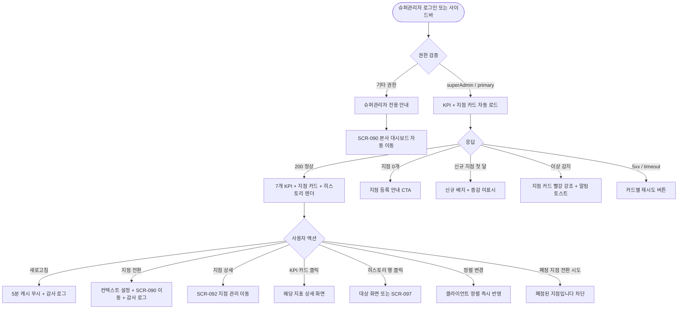
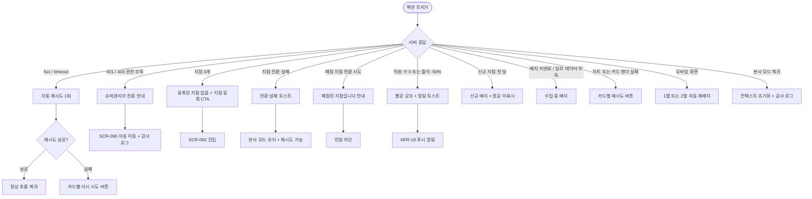

# SCR-091 슈퍼 대시보드 페이지

## 1. 화면 메타 정보

이 문서는 슈퍼 대시보드 페이지에 대한 자기완결형 요구사항 정의서입니다. 다른 문서를 함께 보지 않아도 이 한 장만으로 이 화면에 들어가는 모든 영역, 모든 버튼, 모든 액션, 모든 권한, 모든 예외 처리, 그리고 이 화면을 지탱하는 운영 정책까지 전부 이해하고 구현할 수 있도록 작성합니다.

| 항목 | 값 |
|---|---|
| 작성일 | 2026-05-22 |
| 버전 | v1.0 |
| 상태 | 최신 통합본 반영 (정합화 완료) |
| 도메인 | D10 본사관리 |
| 화면 ID | SCR-091 |
| 화면명 | 슈퍼 대시보드 (본사 지휘 통제실) |
| 화면 유형 | 허브 화면 (Hub Screen, 본사 전용) |
| 라우트 (URL) | `/super-dashboard` |
| 플랫폼 | 데스크톱(기본), 태블릿(2열 자동 재배치), 모바일(1열 또는 2열 카드) |
| 우선순위 | P0 (출시 필수) |
| 기능코드 | HQ-01 |
| 계약코드 | HQ-01 |
| 계약 상태 | 계약 범위 본기능 |
| 부모 기능 prefix | HQ |
| Lv1 코드 | HQ-01 |
| Lv2 / Lv3 세분화 | HQ-01-01 ~ HQ-01-06 (전사 통합 KPI, 지점별 현황 카드, 히스토리 로그, 지점 전환, 권한 검증, 수동 새로고침) |
| 연계 화면 | SCR-090 본사대시보드, SCR-092 지점관리, SCR-093 지점성과리포트, SCR-094 KPI대시보드, SCR-097 감사로그 |
| 호출 다이얼로그 | 없음 (지점 전환은 즉시 이동) |

## 2. 화면 개요와 목적

슈퍼 대시보드는 본사 슈퍼관리자(superAdmin)와 본사 최고관리자(primary) 전용 화면으로, 전 지점의 통합 KPI 7종과 지점별 현황 카드, 최근 히스토리 로그를 한 화면에서 파악하는 본사 지휘 통제실(Command Center)입니다. 이 화면이 의도하는 단 하나의 목표는 "본사 임원이 매일 아침 5분 안에 전사 운영 상태를 파악하고, 위기 지점을 즉시 식별해 대응할 수 있도록 만든다"입니다.

화면 안에서 본사 슈퍼관리자가 수행하는 운영 흐름은 매우 다양합니다. 매일 아침 출근 직후 7개의 전사 KPI 카드(전체 회원·전체 매출·전체 출석·전체 직원·이번 달 신규·만료 예정·만료 회원)를 훑으면서 전월 대비 색상 코딩(양수 초록↑/음수 빨강↓)으로 위기 시그널을 캐치합니다. 매출이 -20% 이상 떨어진 지점 카드를 발견하면 [지점 전환] 버튼을 눌러 그 지점 모드로 진입해 운영 상태를 점검하고, [지점 상세]로 운영 정보 페이지(SCR-092)에 들어가서 직원·시설·정책을 확인합니다. 본사 영업 회의 자료를 준비할 때는 7개 KPI와 지점별 비교를 캡처해 PPT로 옮기거나 [KPI 대시보드](SCR-094)로 이동해 24종 KPI 상세 분석을 수행합니다. 신규 오픈 지점은 "오픈 예정" 상태 배지로 표시되어 운영 시작일이 임박한 지점을 사전 점검할 수 있고, 임시휴업 지점은 흐림 처리되어 진행 중 회원 영향을 점검할 수 있습니다. 직원 수가 0이거나 출석이 전일 대비 -50% 초과로 급감한 지점은 빨강 강조와 알림 토스트로 즉시 식별됩니다.

따라서 이 화면은 단순한 통합 보드가 아니라, RLS 우회 권한과 감사 로그 기반 추적성을 모두 갖춘 본사 권한 행사 도구로 동작해야 합니다.

## 3. 진입 경로와 인접 화면

슈퍼 대시보드에 진입하는 경로는 다음과 같습니다.

첫 번째 경로는 슈퍼관리자 로그인입니다. 본사 슈퍼관리자(superAdmin)와 본사 최고관리자(primary)는 로그인 직후 디폴트로 이 화면이 표시되도록 운영 정책에 설정될 수 있습니다. 로그인하자마자 전체 지점 KPI가 자동 로드됩니다.

두 번째 경로는 사이드바입니다. 사이드바의 본사관리 메뉴 또는 별도의 "슈퍼 대시보드" 메뉴로 진입합니다. 본사 슈퍼관리자만 이 메뉴가 보이고, 다른 권한자는 메뉴 자체가 숨겨집니다.

세 번째 경로는 본사 대시보드(SCR-090)에서 지점 전환 모드로 들어간 상태에서 [본사로] 버튼을 누르는 경우입니다. 세션 컨텍스트의 `current_branch_id`가 초기화되고 본사 모드로 복귀하면서 슈퍼 대시보드에 진입합니다.

네 번째 경로는 인접 화면에서의 "본사 대시보드로 돌아가기" 또는 "통합 대시보드" 링크입니다. 알림 센터의 본사 관련 알림 클릭 시에도 이 화면으로 진입할 수 있습니다.

다른 권한자가 직접 URL(`/super-dashboard`)로 접근하면 권한 검증에 실패하고 "본 화면은 슈퍼관리자 전용입니다"라는 안내와 함께 본사 대시보드(SCR-090)로 자동 이동됩니다.

이 화면에서 빠져나가는 인접 화면은 매우 다양합니다. 지점 카드의 [지점 전환]은 해당 지점 컨텍스트로 본사 대시보드(SCR-090) 진입이며, [지점 상세]는 지점 관리(SCR-092)로의 진입입니다. KPI 카드 클릭은 SCR-094 KPI 대시보드로 진입할 수 있고, 히스토리 로그의 [전체보기]는 SCR-097 감사 로그로 이동합니다. 지점 성과 비교가 필요할 때는 SCR-093 지점 성과 리포트로 이동합니다.

## 4. 레이아웃과 UI 구성

슈퍼 대시보드는 위에서 아래로 흐르는 세로형 단일 컬럼 레이아웃이며, 데스크톱에서는 카드와 카드가 그리드로 배치됩니다. 화면은 위에서부터 다음 영역이 순서대로 쌓입니다.

가장 위에는 페이지 헤더가 있습니다. 헤더 좌측에는 "슈퍼 대시보드"라는 페이지 타이틀과 함께 "본사 모드" 컨텍스트 배지가 표시됩니다. 헤더 우측에는 수동 새로고침 버튼이 있고, 지점 카드 정렬 토글(매출 순/가나다 순)이 함께 노출됩니다. 본사 슈퍼관리자가 지점 전환 모드에서 복귀해 들어온 경우에는 환영 인사 대신 곧바로 통계가 표시됩니다.

페이지 헤더 바로 아래에는 전사 통합 KPI 카드 7종이 가로로 배치됩니다. 첫 번째 카드는 "전체 회원 수"로 전 지점 합산이며 전월 대비 증감률(예: +120 / +8.3%)이 색상 코딩(양수 초록↑/음수 빨강↓)으로 함께 표시됩니다. 두 번째 카드는 "전체 매출"로 전 지점 합산 매출이며 전월 대비 증감률이 표시되고, 세 번째 카드는 "전체 출석 수"로 오늘 출입 합계이며 전일 대비 증감률이 표시됩니다. 네 번째 카드는 "전체 직원 수"로 활성 직원 합계, 다섯 번째 카드는 "이번 달 신규 회원"으로 당월 신규 등록(환불·삭제 제외), 여섯 번째 카드는 "만료 예정 회원 (30일 이내)"으로 만료 임박 카운트, 일곱 번째 카드는 "만료 회원 수"로 이미 만료된 회원 카운트입니다. 신규 지점(개설 1개월 미만)은 전월 대비 데이터가 없으므로 "신규" 배지로 표시되고 증감은 미표시됩니다.

KPI 카드 아래에는 지점별 현황 카드가 그리드(보통 3~4열)로 배치됩니다. 각 카드는 해당 지점의 운영 현황을 한눈에 보여주며 다음 항목을 포함합니다. 지점명, 활성 회원 수, 직원 수, 월 매출(천 단위 축약), 만료 회원 수, 오늘 출석 수, 운영 상태 배지(운영 중/오픈 예정/임시휴업/폐점), 그리고 카드 하단에 [지점 전환]과 [지점 상세] 두 개의 액션 버튼이 배치됩니다. 운영 상태 배지의 색상은 운영 중(초록), 오픈 예정(노랑), 임시휴업(주황 + 카드 흐림), 폐점(회색 + 카드 흐림)으로 명확히 구분됩니다. 직원 수 0 또는 출석 -50% 초과 같은 이상 신호가 감지된 지점은 카드 테두리가 빨강으로 강조되고 알림 토스트가 함께 뜹니다. 카드 정렬 기본값은 매출 순(내림차순)이며 헤더의 토글로 가나다 순으로 전환할 수 있습니다.

지점별 카드 아래에는 최근 히스토리 로그 영역이 있습니다. 시스템 전체에서 발생한 최근 10건의 주요 활동 이력이 시간순으로 나열되며, 각 행에는 발생 시각, 작업자, 작업 유형, 지점, 작업 대상, 요약 문구가 표시됩니다. 본사 대시보드의 최근 활동 로그가 단일 지점 기준이라면, 슈퍼 대시보드의 히스토리 로그는 시스템 전체 기준입니다. 표시 이벤트는 회원 등록·결제·환불·이용권 변경·권한 변경·정책 변경 등 본사가 관심을 가지는 주요 이벤트로 한정됩니다. 영역 우측에는 [전체보기] 링크가 있어서 SCR-097 감사 로그로 이동합니다.

지점 수가 0인 신규 본사에는 KPI 카드 자리에 "데이터를 수집 중입니다"라는 안내가 표시되고, 지점별 카드 영역에는 "등록된 지점이 없습니다 [지점 등록]" CTA가 표시되어 SCR-092로 진입할 수 있습니다.

## 5. 탭 구성과 탭별 동작

이 화면은 별도의 탭 구조를 가지지 않습니다. 모든 KPI와 지점 카드가 한 화면에 동시에 표시되며, 본사 슈퍼관리자는 위에서 아래로 스크롤하며 정보를 흡수합니다. 본사 모드와 지점 모드 사이의 전환은 화면 간 전환(SCR-091 ↔ SCR-090)으로 처리되며, 이 화면 내부의 탭이 아닙니다.

지점 카드 정렬은 헤더의 토글(매출 순/가나다 순)로 변경되며, 클라이언트 사이드 정렬이므로 즉시 반영됩니다. 운영 상태 배지로 필터링(예: 임시휴업 지점만 보기)이 필요한 경우에는 헤더에 별도의 필터 드롭다운이 제공될 수 있습니다.

## 6. 버튼·아이콘·링크 액션 전체 정의

이 화면에 등장하는 모든 클릭 가능한 요소를 빠짐없이 정의합니다.

페이지 헤더의 수동 새로고침 버튼은 모든 KPI 카드와 지점 카드 데이터를 즉시 재조회하며 5분 캐시를 무시합니다. 새로고침 액션은 감사 로그에 actor·branch_ids·timestamp로 기록됩니다.

헤더의 정렬 토글(매출 순/가나다 순)은 지점 카드 배열을 즉시 정렬하며, 클라이언트 사이드에서 처리되므로 API 호출은 일어나지 않습니다.

전사 통합 KPI 카드 7종은 호버 시 약간의 그림자 효과가 들어가고, 클릭하면 해당 지표의 상세 화면으로 진입합니다. 전체 회원 수 카드는 SCR-M001 회원 목록(전체 지점 통합 모드), 전체 매출 카드는 SCR-S001 매출 현황(통합) 또는 SCR-094 KPI 대시보드, 전체 출석 카드는 출석 현황, 전체 직원 수 카드는 SCR-061 직원 관리, 이번 달 신규 회원 카드는 SCR-096 온보딩 대시보드, 만료 예정 카드는 SCR-M013 만료 임박(통합), 만료 회원 수 카드는 SCR-M001의 만료 필터로 이동합니다. 카드의 증감률 영역도 클릭 가능하며 SCR-094 KPI 대시보드의 해당 지표 상세 차트로 진입합니다.

지점 카드의 [지점 전환] 버튼은 본사 모드에서 해당 지점 모드로 컨텍스트를 변경합니다. 세션 컨텍스트의 `current_branch_id`가 설정되고 본사 대시보드(SCR-090)로 자동 이동되며, 헤더에 "본사 모드 → 지점 모드: XX점" 표시가 노출됩니다. 모든 지점 전환은 감사 로그에 actor·source_branch_id·target_branch_id·timestamp로 자동 기록됩니다. RLS는 우회되어 해당 지점의 모든 데이터를 볼 수 있습니다. 폐점된 지점은 [지점 전환]이 비활성화되거나 "폐점된 지점입니다" 안내 후 차단됩니다.

지점 카드의 [지점 상세] 버튼은 지점 관리(SCR-092)의 해당 지점 상세로 이동합니다. 여기서 지점 정보를 수정하거나 운영 상태를 변경할 수 있습니다.

지점 카드의 운영 상태 배지는 클릭 가능 여부가 정책에 따라 다릅니다. 운영 중 배지는 클릭 동작 없음, 오픈 예정 배지는 운영 시작일 안내 툴팁, 임시휴업 배지는 휴업 사유와 정상화 일정 툴팁, 폐점 배지는 폐점 사유와 데이터 보관 기간 안내 툴팁이 표시됩니다.

지점 카드의 매출·회원·출석 같은 수치 영역도 클릭 가능합니다. 매출 수치 클릭은 그 지점의 매출 상세, 회원 수치 클릭은 그 지점의 회원 목록(슈퍼 우회 RLS), 출석 수치 클릭은 그 지점의 출석 현황으로 이동합니다.

히스토리 로그의 행 클릭은 작업 유형에 따라 분기됩니다. 회원·결제·이용권 같은 운영 이벤트는 해당 상세 화면, 정책·권한·설정 같은 시스템 이벤트는 SCR-097 감사 로그 상세로 이동합니다. 영역 우측 [전체보기] 링크는 SCR-097로 전체 지점 필터로 이동합니다.

지점이 0개일 때 표시되는 [지점 등록] CTA 버튼은 SCR-092로 이동하면서 DLG-092-001(신규 지점 등록)을 자동으로 열도록 트리거합니다.

본사 모드 → 지점 모드 진입은 단방향이 아닙니다. 지점 모드로 들어간 SCR-090에서 [본사로] 버튼을 누르면 컨텍스트가 초기화되고 다시 이 화면으로 복귀합니다. 이 복귀도 감사 로그에 기록됩니다.

모든 버튼은 클릭 후 응답이 돌아오기 전까지 자동으로 비활성화되며, KPI 데이터 로딩 중에는 카드별 스켈레톤이 표시됩니다.

## 7. 호출되는 모달 동작

슈퍼 대시보드 화면에서는 별도의 다이얼로그가 호출되지 않습니다. 모든 액션은 화면 전환 또는 카드 내부의 인라인 동작으로 처리됩니다.

지점 전환과 [본사로] 복귀는 별도의 확인 다이얼로그 없이 즉시 모드가 전환되고 자동 이동됩니다. 다만 모든 모드 전환은 감사 로그에 자동 기록되어 후속 추적이 가능합니다.

지점이 0개일 때의 [지점 등록] CTA는 SCR-092로 이동하면서 DLG-092-001을 자동으로 트리거합니다. 이 다이얼로그는 SCR-092의 책임 범위에서 정의되며, 이 화면은 트리거만 담당합니다.

이상 감지 알림 토스트는 별도의 다이얼로그가 아니라 인라인 토스트로 표시되고, [지점 상세]나 [지점 전환] 같은 후속 액션 링크가 토스트 안에 함께 제공됩니다.

## 8. 토스트와 확인 팝업과 알럿

슈퍼 대시보드에서 발생하는 알림성 UI는 다음과 같은 패턴으로 동작합니다.

성공 토스트는 우측 상단에 녹색 계열로 5초 동안 표시됩니다. "데이터를 새로고침했어요", "XX점으로 전환했어요", "본사 모드로 복귀했어요" 같은 짧은 결과 문구가 표시됩니다.

실패 토스트는 우측 상단에 빨강 계열로 표시되며, "데이터를 불러올 수 없어요", "지점 전환에 실패했어요", "이 지점은 폐점 상태입니다" 같은 문구와 함께 [다시 시도] 또는 [지점 목록] 같은 보조 액션이 따라옵니다. 자동 재시도는 5초 후 1회 수행됩니다.

알림 토스트는 이상 감지가 발생했을 때 자동으로 뜹니다. "지점 카드 빨강 강조: XX점 직원 수 0명", "지점 카드 빨강 강조: XX점 출석이 전일 대비 -50% 급감"처럼 위기 시그널을 즉시 운영자에게 알리며, 토스트를 클릭하면 해당 지점의 [지점 상세]로 진입합니다. 이상 감지 배치(매시간 실행)가 새로운 위기를 발견하면 운영자에게 푸시 알림(NFR-19)도 함께 발송됩니다.

권한 외 사용자가 직접 URL로 접근하면 알럿 형태의 차단 UI가 표시됩니다. 본문이 모두 사라지고 "본 화면은 슈퍼관리자 전용입니다. 3초 후 본사 대시보드로 이동합니다"라는 메시지가 표시된 후 SCR-090으로 자동 이동됩니다.

지점이 0개인 신규 본사의 경우에는 알럿이 아닌 빈 상태 안내가 표시됩니다. "등록된 지점이 없습니다. 지점을 먼저 등록해주세요"라는 메시지와 [지점 등록] CTA 버튼이 화면 중앙에 표시됩니다.

KPI 데이터 일부가 신규 지점 첫 달 데이터 부재로 비교 불가일 때는 별도 토스트 없이 카드에 "신규" 배지가 붙고 증감은 미표시됩니다.

## 9. 데이터 흐름과 외부 연동

이 화면은 본사 전체 지점의 통합 데이터에 의존하므로 여러 데이터 소스와 외부 연동에 연결됩니다.

화면 진입 시점에는 슈퍼 대시보드 KPI API와 지점 카드 API가 병렬로 호출됩니다. KPI API 응답에는 7개 통합 카드의 현재값과 전월/전일 대비 증감률이 포함되고, 지점 카드 API 응답에는 등록된 모든 지점의 현황(활성 회원·직원·매출·만료·출석·운영 상태)이 포함됩니다. 본사 슈퍼관리자는 RLS 우회 권한을 가지므로 모든 지점 데이터가 합산되어 반환됩니다.

데이터 캐시 정책은 본사 대시보드와 동일하게 5분이 기본입니다. 5분이 경과하면 자동 무효화되고 다음 조회 시 재계산되며, 수동 새로고침 시 즉시 갱신됩니다.

KPI 매시간 배치(매 정각)는 활성 회원·매출·출석 데이터를 갱신하며, KPI 일별 배치(매일 03:00)는 전월 대비 증감 산출을 위한 확정 데이터를 만듭니다. 운영 시작일 도래 배치(매일 00:00)는 `오픈 예정` 상태의 지점 중 운영 시작일이 도래한 지점을 자동으로 `운영 중`으로 전환합니다. 폐점 후 6개월 배치(매일 03:00)는 보관 기간이 만료된 폐점 지점을 자동으로 아카이브하여 슈퍼 대시보드에서 제외시킵니다.

이상 감지 배치는 매시간 실행되어 직원 수 0 또는 출석 전일 대비 -50% 초과 같은 임계 신호를 감지하면 카드 빨강 강조 플래그를 설정하고 알림 토스트를 트리거합니다. 동시에 알림 센터(NFR-19)를 경유하여 슈퍼관리자에게 푸시 알림이 발송됩니다.

히스토리 로그는 SCR-097 감사 로그의 일부로, 시스템 전체에서 발생한 액션 중 본사 관심 이벤트(회원·결제·환불·정책·권한·설정)만 필터링되어 최근 10건이 노출됩니다. 감사 로그 자체는 append-only이고 5년 보관 정책이 적용됩니다.

지점 전환 액션은 세션 컨텍스트의 `current_branch_id`를 설정하는 API 호출(`POST /api/super-dashboard/switch-branch`)이며, 응답이 성공하면 SCR-090으로 자동 이동되고 감사 로그에 actor·source_branch_id·target_branch_id·timestamp가 기록됩니다. 본사 모드 복귀(`POST /api/super-dashboard/switch-back`)는 컨텍스트를 초기화하고 슈퍼 대시보드로 돌아옵니다.

수동 새로고침 액션도 감사 로그에 기록됩니다. 이는 본사 권한 행사의 전수 추적을 위한 정책입니다.

새 지점 등록은 SCR-092에서 일어나지만, 등록 직후 본사 표준 정책 세트(HQ-09)가 자동 적용되고 운영 시작일이 도래하면 자동으로 슈퍼 대시보드의 지점 카드에 추가됩니다.

화면에서 호출하는 주요 API 엔드포인트는 다음과 같습니다. KPI 조회 `GET /api/super-dashboard/kpi`, 지점 카드 `GET /api/super-dashboard/branches`, 최근 히스토리 `GET /api/super-dashboard/recent-activities`, 지점 전환 `POST /api/super-dashboard/switch-branch`, 본사 복귀 `POST /api/super-dashboard/switch-back`.

## 10. 화면 상태와 예외 처리

슈퍼 대시보드는 다음 상태들을 가질 수 있고, 각 상태마다 사용자에게 보이는 모습이 달라집니다.

로딩 중 상태에서는 7개 KPI 카드와 지점 카드 자리에 모두 스켈레톤이 표시됩니다. 헤더는 미리 렌더되지만 새로고침 버튼과 정렬 토글은 잠깐 비활성화됩니다.

정상 상태는 가장 일반적인 상태로, 7개 통합 KPI 카드와 지점별 현황 카드가 모두 채워지고 최근 히스토리 로그가 표시됩니다.

신규 본사 상태는 등록된 지점이 0개일 때이고, KPI 카드 자리에 "데이터를 수집 중입니다"가 표시되며 지점 카드 영역에는 "등록된 지점이 없습니다 [지점 등록]" CTA가 표시됩니다.

신규 지점 첫 달 상태는 개설 1개월 미만 지점이 포함된 경우입니다. 해당 지점의 KPI 일부 비교가 불가하므로 카드에 "신규" 배지가 붙고 증감은 미표시됩니다. 개설 후 91일 경과 시 자동으로 일반 비교 테이블에 편입됩니다.

지점 부분 데이터 부족 상태는 일부 지점만 데이터가 부족할 때이고, 해당 지점 카드에 "수집 중" 배지가 표시되며 다른 지점은 정상 표시됩니다.

이상 감지 상태는 직원 수 0 또는 출석 -50% 같은 위기 신호가 감지된 경우입니다. 해당 지점 카드가 빨강으로 강조되고 알림 토스트가 자동으로 뜹니다.

임시휴업/폐점 상태는 카드가 흐림 처리되고 운영 상태 배지가 강조되며, KPI는 휴업 시 부분 표시, 폐점 시 비표시로 구분됩니다.

권한 없음 상태는 슈퍼관리자가 아닌 계정이 직접 URL로 접근했을 때이고, "본 화면은 슈퍼관리자 전용입니다" 안내 후 SCR-090으로 자동 이동됩니다.

지점 전환 처리 중 상태는 [지점 전환] 클릭 후 응답을 기다리는 짧은 순간입니다. 버튼이 비활성화되고 로딩 인디케이터가 표시됩니다.

오류 상태는 API 실패 시이며, 카드별 재시도 버튼이 표시되고 토스트로 안내됩니다. 자동 재시도 1회 후 사용자 액션을 기다립니다.

5분 캐시 만료 상태는 자동으로 처리되며 사용자에게는 거의 인지되지 않습니다.

본사 모드 복귀 직후 상태는 SCR-090의 지점 모드에서 [본사로]로 들어온 직후이며, 컨텍스트가 초기화된 슈퍼 대시보드가 표시됩니다.

예외 케이스별 처리는 다음과 같이 정의됩니다.

권한 부족(owner/manager/fc 등) 계정이 URL 직접 접근하면 안내 메시지 후 SCR-090으로 자동 이동됩니다.

지점 0개 신규 본사에서는 [지점 등록] CTA가 표시되고 SCR-092로 진입할 수 있습니다.

KPI 데이터 없음(신규)에서는 모든 카드 0과 "데이터를 수집 중입니다"가 표시됩니다.

지점 카드 데이터 부족에서는 해당 지점 카드에 "수집 중" 배지가 붙고 다른 지점은 정상 표시됩니다.

API 오류 시 카드별 재시도 버튼과 토스트가 표시되고 5초 후 자동 재시도가 일어납니다.

5분 캐시 만료는 자동 재조회로 처리됩니다.

지점 전환 실패 시 토스트로 안내되고 본사 모드가 유지되며 재시도가 가능합니다.

휴업/폐점 카드는 흐림 + 상태 배지로 표시되고 KPI는 부분 표시됩니다.

신규 지점 첫 달은 "신규" 배지와 증감 미표시로 처리됩니다.

직원 수 0이 감지되면 빨강 강조 + 토스트로 점검 안내가 제공됩니다.

출석 급감이 감지되면 빨강 강조 + 토스트로 [지점 상세] 권장이 제공됩니다.

지점 전환 후 권한 변경은 자동으로 권한 컨텍스트가 갱신되어 그 권한으로 동작합니다.

모바일 화면에서는 카드가 1열 또는 2열로 자동 재배치됩니다.

지점 카드 정렬 변경은 클라이언트 사이드 즉시 반영입니다.

본사 모드 복귀는 컨텍스트 초기화 + 슈퍼 대시보드 진입으로 처리됩니다.

## 11. 권한별 처리

이 화면은 본사 슈퍼관리자 전용이므로 권한 처리가 매우 엄격합니다.

슈퍼관리자(superAdmin)와 본사 최고관리자(primary)는 모든 기능을 사용할 수 있습니다. 전 지점의 통합 KPI를 보고, 지점 카드를 통해 각 지점의 현황을 파악하며, [지점 전환]으로 임의의 지점 모드로 진입할 수 있습니다. RLS 우회 권한을 가지므로 모든 지점의 데이터에 접근 가능하며, 모든 지점 전환은 감사 로그에 기록됩니다. 수동 새로고침과 정렬 변경도 자유롭게 수행할 수 있습니다.

Owner(지점장), 매니저(manager), FC, 트레이너, 스태프, 프런트는 이 화면에 접근할 수 없습니다. 사이드바에 슈퍼 대시보드 메뉴가 보이지 않고, 직접 URL로 접근하면 "본 화면은 슈퍼관리자 전용입니다" 안내가 표시된 후 본사 대시보드(SCR-090)로 자동 이동됩니다. 권한 검증은 서버에서 다시 한 번 수행되어 클라이언트 우회를 방지합니다.

읽기 전용(readonly)은 본 화면에 접근 불가입니다. 슈퍼관리자가 아닌 한 어떤 권한자도 이 화면을 볼 수 없습니다.

권한 외 사용자가 이 화면에 접근을 시도하면 그 자체가 보안 이벤트로 간주되어 감사 로그(SCR-097)에 actor·attempted_access·timestamp로 기록됩니다. 이는 사후 권한 우회 시도를 추적하기 위한 정책입니다.

권한이 부족해서 액션이 차단된 경우의 사용자 경험은 단계별로 일관됩니다. 첫째, 사이드바에서 메뉴가 숨겨집니다. 둘째, 직접 URL 접근 시 안내 화면 후 자동 이동됩니다. 셋째, 백엔드는 401/403으로 거부합니다. 넷째, 접근 시도가 감사 로그에 기록됩니다.

본사 슈퍼관리자가 [지점 전환]으로 지점 모드에 들어간 후에도 권한 컨텍스트는 슈퍼관리자가 유지됩니다. 일반 직원처럼 권한이 낮아지지 않으며, RLS 우회 권한도 유지됩니다. 이는 본사가 임의의 지점을 점검할 때 데이터에 막힘없이 접근할 수 있도록 하기 위한 정책입니다.

지점 카드의 [지점 상세] 버튼은 SCR-092 지점 관리로 이동하며, 여기서 지점 정보 수정·운영 상태 변경 같은 액션이 슈퍼관리자 권한으로 수행 가능합니다.

## 12. 메인 흐름

슈퍼 대시보드의 핵심 동작 흐름입니다.

## 13. 에러와 예외 흐름

에러와 예외 상황에서의 분기를 별도 흐름으로 표현합니다.

## 14. 핵심 디자인 요청사항

이 화면이 본사 슈퍼관리자에게 잘 작동하려면 다음 디자인 원칙이 시각적으로 명확히 드러나야 합니다.

전사 통합 KPI 카드 7종은 같은 줄에 동일 크기로 배치되어 한눈에 비교 가능해야 합니다. 카드 안의 큰 숫자는 시선을 끄는 가장 큰 폰트로, 라벨은 그 아래 작은 글씨로, 증감률은 카드 우측 상단 또는 라벨 옆에 화살표와 색상(양수 초록↑, 음수 빨강↓)으로 강조됩니다. 신규 지점의 "신규" 배지는 노랑 또는 파랑 톤으로 표시되어 비교 불가 상태임을 알립니다.

지점별 현황 카드는 그리드(데스크톱 3~4열, 태블릿 2열, 모바일 1열)로 배치되며, 각 카드는 헤더(지점명 + 운영 상태 배지)와 본문(5개 지표 + 2개 액션 버튼)으로 구성됩니다. 운영 상태 배지의 색상은 운영 중(초록), 오픈 예정(노랑), 임시휴업(주황), 폐점(회색)으로 즉시 인식 가능해야 합니다. 임시휴업과 폐점 카드는 카드 전체에 약간의 흐림(opacity 60%)을 적용해 활성 지점과 시각적으로 구분합니다.

이상 감지 빨강 강조 지점 카드는 카드 테두리가 빨강으로 굵게 표시되고, 헤더 배경에 약간의 빨강 톤이 들어가며, 위험 아이콘이 헤더 우측에 추가됩니다. 토스트와 카드 강조가 동시에 일어나 즉시 운영자 시선을 잡아야 합니다.

지점 카드의 [지점 전환] 버튼은 메인 액션이므로 primary 컬러로 배치되고, [지점 상세] 버튼은 보조 액션이므로 outline 또는 secondary 컬러로 배치됩니다. 두 버튼은 카드 하단에 나란히 놓이며 호버 시 미세한 변화로 클릭 가능성을 알립니다.

히스토리 로그는 본사 대시보드와 동일하게 타임라인 형태로 표시되지만, 시스템 전체 이벤트가 모이므로 지점명이 추가 컬럼으로 표시됩니다. 작업 유형 아이콘은 회원·결제·이용권·정책·권한·설정 등 카테고리별로 색상과 모양이 구분됩니다.

[지점 등록] CTA(지점 0개일 때)는 화면 중앙에 큰 일러스트와 함께 표시되어 신규 본사가 첫 액션을 자연스럽게 시작할 수 있도록 합니다.

본사 모드 컨텍스트 배지(헤더의 "본사 모드")는 명확히 표시되어 슈퍼관리자가 자신이 어떤 모드에 있는지 항상 인지할 수 있어야 합니다. SCR-090에서 지점 모드로 들어갔을 때의 "본사 모드 → 지점 모드: XX점" 표시와 일관성을 가져야 합니다.

진행 스피너와 로딩 스켈레톤은 본사 대시보드와 동일한 톤으로 통일됩니다. 카드별 재시도 버튼은 작지만 눈에 띄는 형태로 배치됩니다.

모바일에서는 7개 KPI 카드가 가로 스크롤 가능한 캐러셀로 전환되고, 지점 카드는 1열로 쌓이며, 히스토리 로그는 가독성을 위해 축약된 형태로 표시됩니다.

## 15. 운영 정책 (이 화면에 연결된 부분)

이 화면은 본사 권한 정책이 가장 강하게 작동하는 화면이므로, 운영 정책을 풀어 적습니다.

본사와 지점의 역할 분리 원칙에 따라 본사는 전사 표준·정책·감사·통합 KPI를 담당합니다. 슈퍼 대시보드는 그 본사 역할을 수행하는 1차 진입점이며, 본사 슈퍼관리자(superAdmin/primary)에게만 노출됩니다. 이는 데이터 노출 범위 제어와 보안 정책의 결과이고, 일반 지점 사용자는 자기 지점 외 데이터에 접근할 수 없습니다.

본사 통합 KPI는 SCR-091에서 다루고, SCR-090(본사 대시보드)은 단일 지점 컨텍스트의 일일 운영 KPI를 다룹니다. 두 화면의 카드 구성은 분리되어 있으며, 운영 정책상 본사 통합 대시보드와 지점 일반 대시보드는 메뉴·권한·카드 구성을 분리한다고 명시되어 있습니다. SCR-091은 카드 수를 늘리는 것보다 전사 위험, 편차, 유지율을 빠르게 읽게 하는 구성이 우선입니다.

7개 통합 KPI의 정의는 명확합니다. 전체 회원 수는 전 지점 합산 등록 회원(탈퇴 제외)이고, 전체 매출은 전 지점 합산 매출이며, 전체 출석 수는 오늘 출입 합계, 전체 직원 수는 활성 직원 합계, 이번 달 신규 회원은 1일~오늘 등록(환불·삭제 제외), 만료 예정 (30일 이내)은 D-30 안에 만료될 회원, 만료 회원 수는 이미 만료된 회원입니다. 증감률은 매출·회원은 전월 대비, 출석은 전일 대비로 계산되며, 양수는 초록 ↑, 음수는 빨강 ↓로 색상 코딩됩니다.

신규 지점(개설 1개월 미만)은 전월 비교 데이터가 없으므로 "신규" 배지로 표시되고 증감은 미표시됩니다. 개설 후 91일 경과 시 자동 배치(`매일 00:00`)로 신규 배지가 제거되고 일반 비교 테이블에 편입됩니다.

지점 운영 상태 4종(`운영 중` / `오픈 예정` / `임시휴업` / `폐점`)은 SCR-092에서 설정된 그대로 슈퍼 대시보드의 지점 카드에 반영됩니다. 운영 시작일 도래 배치(매일 00:00)는 `오픈 예정`을 `운영 중`으로 자동 전환합니다. 폐점 후 6개월 배치(매일 03:00)는 보관 기간 만료된 폐점 지점을 아카이브하여 슈퍼 대시보드에서 제외시킵니다.

지점 전환 메커니즘은 본사 슈퍼관리자가 RLS 우회 권한으로 임의의 지점 컨텍스트에 진입하는 액션입니다. 세션 컨텍스트에 `current_branch_id`가 설정되고 SCR-090으로 이동하면서 감사 로그가 자동 INSERT됩니다. 모든 전환은 actor·source_branch_id·target_branch_id·timestamp로 기록되어 사후 감사 가능합니다. RLS 우회는 슈퍼관리자만 가능하며, 폐점된 지점으로는 전환이 차단됩니다.

본사 모드 복귀는 헤더의 [본사로] 버튼이나 사이드바를 통해 가능하며, 컨텍스트가 초기화되고 SCR-091로 돌아옵니다. 이 복귀도 감사 로그에 기록됩니다.

데이터 캐시는 5분이 기본이며, 수동 새로고침으로 즉시 갱신할 수 있습니다. 이는 본사 모니터링 부하를 분산하기 위한 정책입니다.

이상 감지 정책은 직원 수 0 또는 출석 전일 대비 -50% 초과 같은 임계 신호를 감지하면 자동으로 카드 빨강 강조와 알림 토스트를 발동시키고, 알림 센터(NFR-19)를 경유하여 슈퍼관리자에게 푸시 알림을 발송합니다. 이는 위기 지점을 사전에 포착하기 위한 정책입니다.

히스토리 로그는 시스템 전체에서 발생한 액션 중 본사 관심 이벤트(회원·결제·환불·이용권·정책·권한·설정)만 필터링되며, 감사 로그 전체는 SCR-097에서 조회합니다. 감사 로그는 append-only이고 5년 보관 정책이 적용되며, 90일 경과 시 PII가 자동 익명화됩니다.

지점 수 한도는 본사 라이선스 정책에 따라 제한됩니다. 한도를 초과하면 신규 지점 등록이 차단되며, 슈퍼 대시보드에서 [지점 등록] CTA를 누른 후 한도 초과 안내를 받게 됩니다.

지점 전환 시 권한 컨텍스트는 슈퍼관리자가 유지됩니다. 일반 직원처럼 권한이 낮아지지 않으며, 이는 본사가 임의 지점을 점검할 때 데이터 접근에 막힘이 없도록 하기 위한 정책입니다. 다만 모든 액션은 감사 로그에 기록되어 권한 행사가 투명하게 추적됩니다.

지점 카드 정렬은 기본값이 매출 순(내림차순)이며 토글로 가나다 순으로 전환 가능합니다. 위기 지점을 빠르게 식별하기 위해 매출 순이 디폴트로 설정되어 있고, 정렬 변경은 클라이언트 사이드에서 즉시 반영됩니다.

본사 통합 KPI의 운영 정의는 매출관리(SCR-S004) 표준을 따르며, 세금 포함/미포함 정책 등은 동일합니다. 환불은 매출에서 차감되며, 위약금·VAT 같은 보조 지표는 별도 KPI 화면에서 확인합니다.

본사 통합 대시보드에는 전사 환불 규모, 전사 재등록률, 지점 간 매출 편차 같은 본사 전용 지표가 추가 표시될 수 있으며, 이는 본사 통합 KPI 기준에 따라 운영됩니다. 다만 본 화면의 핵심은 7개 KPI와 지점 카드이며, 상세 분석은 SCR-094 KPI 대시보드와 SCR-093 지점 성과 리포트에서 수행됩니다.

이상의 모든 정책은 이 화면을 구현하고 운영하는 사람이 별도 문서 없이 이 한 장만 보면 이해할 수 있도록 풀어 적었습니다. 정책이 바뀌면 이 문서가 함께 갱신되어야 하며, 코드 변경과 정책 변경은 항상 짝지어 진행됩니다.
