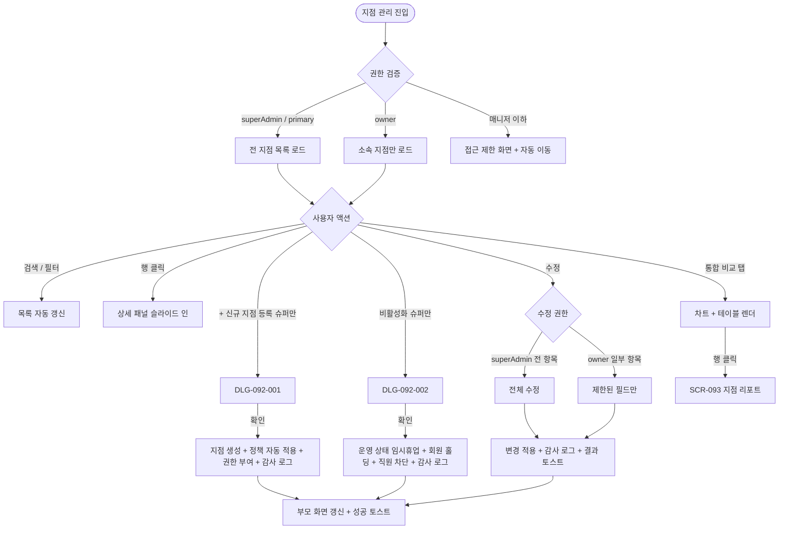

# SCR-092 지점 관리 페이지

## 1. 화면 메타 정보

이 문서는 지점 관리 페이지에 대한 자기완결형 요구사항 정의서입니다. 다른 문서를 함께 보지 않아도 이 한 장만으로 이 화면에 들어가는 모든 영역, 모든 버튼, 모든 다이얼로그, 모든 권한, 모든 예외 처리, 그리고 이 화면을 지탱하는 운영 정책까지 전부 이해하고 구현할 수 있도록 작성합니다.

| 항목 | 값 |
|---|---|
| 작성일 | 2026-05-22 |
| 버전 | v1.0 |
| 상태 | 최신 통합본 반영 (정합화 완료) |
| 도메인 | D10 본사관리 |
| 화면 ID | SCR-092 |
| 화면명 | 지점 관리 |
| 화면 유형 | 일반 화면 (Branch Management Screen) |
| 라우트 (URL) | `/branches` |
| 플랫폼 | 데스크톱(기본), 태블릿 |
| 우선순위 | P0 (출시 필수) |
| 기능코드 | CTR-01 |
| 계약코드 | CTR-01, CTR-02, CTR-03 |
| 계약 상태 | 계약 범위 본기능 |
| 부모 기능 prefix | CTR |
| Lv1 코드 | CTR-01 |
| Lv2 / Lv3 세분화 | CTR-01-01 ~ CTR-01-07 (지점 목록, 검색/필터, 신규 등록, 지점 수정, 비활성화, 통합 비교, 정책 적용) |
| 연계 화면 | SCR-091 슈퍼대시보드, SCR-080A 지점 자동화, SCR-093 지점성과리포트, SCR-097 감사로그, SCR-H1001 자동화정책라이브러리 |
| 호출 다이얼로그 | DLG-092-001 신규지점등록, DLG-092-002 비활성화확인 |

## 2. 화면 개요와 목적

지점 관리 페이지는 본사 슈퍼관리자가 가맹·직영 지점 전체의 현황을 한곳에서 조회하고, 신규 지점을 등록하거나 기존 지점의 운영 상태를 변경하거나 지점 간 통합 성과를 비교하는 D10 본사관리 도메인의 핵심 운영 화면입니다. 본사 차원의 인사·자원 배분, 정책 세트 적용, 신규 오픈 워크플로우, 폐점 정리, 위기 지점 식별 의사결정의 단일 진입점이며, 등록된 지점은 자동으로 본사 표준 정책 세트(HQ-09)가 적용되고 모든 변경은 감사 로그(SCR-097)에 기록됩니다.

이 화면이 다루는 운영 흐름은 다음과 같이 다양합니다. 본사 슈퍼관리자가 신규 가맹 계약을 체결한 직후에 DLG-092-001로 지점을 등록하고 초기 Owner(지점장)을 매핑한 다음 본사 표준 정책을 자동 적용하면, 운영 시작일이 도래하는 시점에 자동으로 `오픈 예정`에서 `운영 중`으로 전환됩니다. 임시휴업(리모델링·휴업 신고)이 필요한 지점은 DLG-092-002로 운영 상태를 `임시휴업`으로 변경하면서 진행 중 회원 이용권을 자동 홀딩(정책 토글에 따라)으로 처리하고 신규 가입을 차단합니다. 폐점 처리는 활성 회원에 대한 환불·이관(MBR-ADV-02)을 강제한 후 운영 상태를 `폐점`으로 변경하며, 데이터는 6개월 보관 후 아카이브됩니다. Owner(지점장) 교체는 신규 Owner(지점장) 매핑과 기존 Owner(지점장) 권한 회수를 한 번에 처리하고, 본사 임원은 통합 현황 비교 탭에서 지점별 매출·회원·출석을 한눈에 비교하면서 위기 지점을 식별합니다. Owner(지점장)이 본 화면에 들어오면 자기 지점만 보이며 연락처·주소 같은 일부 항목만 수정 가능하고, 운영 상태나 Owner(지점장) 매핑 같은 본사 권한 영역은 차단됩니다.

따라서 이 화면은 단순한 지점 목록 테이블이 아니라, 본사 운영의 모든 의사결정이 모이는 지휘 화면으로 동작해야 합니다.

## 3. 진입 경로와 인접 화면

지점 관리 페이지에 진입하는 경로는 여러 가지입니다.

첫 번째 경로는 사이드바입니다. 사이드바의 본사관리 메뉴 아래 "지점 관리" 항목을 클릭하면 진입합니다. URL은 `/branches`이고 화면은 전체 지점 목록의 기본 필터 상태(상태 필터: 전체)로 시작합니다.

두 번째 경로는 슈퍼 대시보드(SCR-091)의 지점 카드에서 [지점 상세] 버튼을 누른 경우입니다. 이 경로로 들어오면 해당 지점이 자동으로 선택된 상태(예: `/branches?id=BR0001`)로 진입합니다. 본사 슈퍼관리자가 특정 지점의 운영 정보를 점검하거나 수정할 때 사용하는 가장 일반적인 흐름입니다.

세 번째 경로는 KPI 대시보드(SCR-094)의 지점별 비교 테이블에서 행을 클릭한 경우입니다. 이 경우 SCR-093 지점 성과 리포트로 이동할 수도 있지만, 운영 정보 수정이 목적이면 [지점 상세] 링크로 본 화면에 진입합니다.

네 번째 경로는 슈퍼 대시보드의 [지점 등록] CTA(지점 0개인 신규 본사)입니다. 이 CTA는 SCR-092로 이동하면서 DLG-092-001을 자동으로 트리거합니다.

다섯 번째 경로는 본사 표준 정책 라이브러리(SCR-H1001)에서 "이 정책을 적용 중인 지점 목록"으로의 진입입니다. 정책 변경 영향 범위를 확인할 때 사용됩니다.

이 화면에서 빠져나가는 인접 화면은 신규 지점 등록 다이얼로그(DLG-092-001), 비활성화 확인 다이얼로그(DLG-092-002), 통합 비교 탭에서 행 클릭으로 진입하는 SCR-093 지점 성과 리포트, 지점별 자동화 설정으로 들어가는 SCR-080A 지점 자동화, 본사 표준 정책 라이브러리(SCR-H1001), 모든 변경 이벤트가 기록되는 SCR-097 감사 로그입니다.

## 4. 레이아웃과 UI 구성

지점 관리 페이지는 위에서 아래로 흐르는 세로형 단일 컬럼 레이아웃이며, 데스크톱에서는 가로 폭이 넓으므로 우측 상세 패널이 슬라이드 인 될 때 본문 가로폭이 자동 축소됩니다. 화면은 위에서부터 다음 영역이 순서대로 쌓입니다.

가장 위에는 페이지 헤더가 있습니다. 헤더 좌측에는 "지점 관리"라는 페이지 타이틀과 함께 현재 등록된 지점 수(`총 N개 지점`) 요약이 표시됩니다. 헤더 우측에는 [+ 신규 지점 등록] 버튼이 있고, 권한이 없는 owner에게는 보이지 않습니다. 헤더 아래에는 상위 탭 두 개가 있습니다. "지점 목록" 탭과 "통합 현황 비교" 탭으로 나뉘며, 기본 진입은 지점 목록 탭입니다.

지점 목록 탭에서는 헤더 아래에 검색 및 필터 바가 있습니다. 좌측에 통합 검색창이 있고 지점명과 주소를 동시에 OR 조건으로 검색하며 300ms 디바운스가 적용됩니다. 검색창 우측에는 운영 상태 필터 드롭다운이 있고 전체 / 운영 중 / 오픈 예정 / 임시휴업 / 폐점 5종 옵션을 제공합니다. 검색·필터가 변경되면 목록이 자동으로 갱신됩니다.

검색 바 아래에는 지점 목록 테이블이 있습니다. 컬럼은 좌측부터 지점명, 지점 코드, 주소, 연락처, 회원 수(활성), 직원 수, 운영 상태 배지, 등록일, 행 액션(수정/비활성화)입니다. 운영 상태 배지는 `운영 중`(초록), `오픈 예정`(노랑), `임시휴업`(주황 + 행 흐림), `폐점`(회색 + 행 흐림)으로 시각적으로 분리됩니다. 행을 클릭하면 우측에 지점 상세 정보 패널이 슬라이드 인 되거나(슬라이드 패널 모드), 별도 상세 페이지로 이동합니다. 행의 [수정] 버튼은 슈퍼관리자는 전 항목 수정, owner는 일부 항목 수정만 가능하며, [비활성화] 버튼은 슈퍼관리자만 활성화되고 owner에게는 hidden 또는 비활성으로 표시됩니다.

통합 현황 비교 탭에서는 화면 상단에 기간 선택(월간/주간/연간) 토글과 비교 기준(전기간 대비 / 지점 간 비교) 토글이 있고, 그 아래에 지점별 회원 수·매출·출석률 비교 차트(막대)와 지점별 매출 순위 테이블이 표시됩니다. 행을 클릭하면 해당 지점의 SCR-093 지점 성과 리포트로 이동합니다.

페이지 하단에는 페이지네이션 영역이 있습니다. 페이지당 표시 건수(20/50/100), 페이지 번호 이동, 총 건수가 표시되며 본사 라이선스 한도 내에서 모든 지점이 한 화면에 나오는 경우가 많아 페이지네이션이 거의 노출되지 않는 경우도 있습니다.

지점 목록이 0개인 신규 본사에서는 테이블 자리에 "등록된 지점이 없습니다. 첫 지점을 등록해보세요"라는 안내와 [+ 신규 지점 등록] CTA가 큰 일러스트와 함께 표시됩니다.

## 5. 탭 구성과 탭별 동작

이 화면은 2개의 상위 탭을 가집니다.

지점 목록 탭(기본)은 등록된 모든 지점을 테이블 형태로 보여주는 운영 화면입니다. 검색·필터·행 액션이 활성화되어 있고, 신규 지점 등록과 운영 상태 변경 같은 운영 액션이 이 탭에서 수행됩니다.

통합 현황 비교 탭은 지점 간 성과를 비교하는 분석 화면입니다. 기간 선택 토글로 월간·주간·연간 데이터를 전환할 수 있고, 비교 기준 토글로 전기간 대비 또는 지점 간 비교를 선택할 수 있습니다. 차트와 테이블이 동시에 표시되며 행 클릭으로 SCR-093 지점 성과 리포트로 진입할 수 있습니다.

두 탭 사이의 전환은 URL 쿼리 파라미터(`?tab=list` / `?tab=comparison`)로 보존되며, 페이지 새로고침 후에도 마지막 탭이 유지됩니다.

owner(Owner(지점장)) 권한자가 본 화면에 들어오면 통합 현황 비교 탭은 자기 지점 외 데이터를 비교할 수 없으므로 비활성화되거나 자기 지점 단독 표시로 제한됩니다.

## 6. 버튼·아이콘·링크 액션 전체 정의

이 화면에 등장하는 모든 클릭 가능한 요소를 빠짐없이 정의합니다.

페이지 헤더의 [+ 신규 지점 등록] 버튼은 DLG-092-001을 호출합니다. 슈퍼관리자(superAdmin/primary)만 활성화되고 owner에게는 hidden입니다. 본사 라이선스 한도를 초과한 상태면 버튼이 비활성화되고 호버 시 "라이선스 한도 초과" 안내가 표시됩니다.

검색창은 300ms 디바운스 후 자동으로 목록을 갱신하며, 최소 2자 이상 입력해야 검색이 시작됩니다. 검색어 X 버튼은 검색어를 즉시 초기화합니다.

운영 상태 필터 드롭다운은 선택 즉시 목록이 갱신되며, URL 쿼리 파라미터(`?status=active`)로 상태가 보존됩니다.

상위 탭 [지점 목록] / [통합 현황 비교] 클릭은 탭 전환과 함께 URL을 변경하며, 클라이언트 사이드 렌더링으로 즉시 반영됩니다.

지점 행 클릭은 우측 상세 패널 슬라이드 인 또는 상세 페이지 이동입니다. 슬라이드 패널 모드에서는 본문 가로폭이 약 65%로 축소되고 패널이 35% 폭으로 열립니다. 패널에는 지점 기본 정보, 직원 수 상세, 정책 적용 상태, 운영 시간, 휴무일 등이 표시됩니다.

행의 [수정] 버튼은 인라인 편집 모드를 켜거나 별도 수정 화면을 엽니다. 슈퍼관리자는 전 항목 수정 가능하고, owner는 연락처·주소·운영 시간 같은 일부 항목만 수정 가능합니다. 운영 상태·코드·Owner(지점장) 매핑은 슈퍼관리자 전용입니다.

행의 [비활성화] 버튼은 DLG-092-002를 호출합니다. 슈퍼관리자만 활성화되고 owner에게는 hidden입니다. 이미 임시휴업·폐점 상태의 지점에서는 버튼이 다른 동작(재활성화 또는 폐점 처리)으로 바뀌거나 비활성화됩니다.

행의 운영 상태 배지는 호버 시 상세 툴팁이 표시됩니다. `오픈 예정`은 운영 시작일, `임시휴업`은 휴업 사유와 정상화 일정, `폐점`은 폐점 사유와 데이터 보관 기간이 안내됩니다.

통합 현황 비교 탭의 차트 막대 또는 테이블 행 클릭은 해당 지점의 SCR-093 지점 성과 리포트로 이동합니다. 기간 토글(월간/주간/연간)은 차트와 테이블을 즉시 갱신하고, 비교 기준 토글(전기간 대비 / 지점 간 비교)은 차트 표시 방식을 변경합니다.

지점 0개일 때의 [+ 신규 지점 등록] CTA는 헤더의 버튼과 동일하게 DLG-092-001을 호출합니다.

페이지네이션의 페이지당 건수 드롭다운(20/50/100)은 즉시 재조회하고, 페이지 번호 이동도 즉시 재조회합니다.

상세 패널 내부의 [정책 적용 확인] 버튼은 SCR-H1001 자동화 정책 라이브러리로 이동하면서 해당 지점을 사용 중인 정책 세트 목록을 보여줍니다. [지점 자동화 설정] 버튼은 SCR-080A 지점 자동화로 이동하며, 본사 정책 범위 내에서 지점이 커스터마이징할 수 있는 항목을 표시합니다.

모든 버튼은 클릭 후 응답이 돌아오기 전까지 자동으로 비활성화되며, 운영 상태 변경 같은 중요한 액션은 결과 토스트가 추가로 표시됩니다.

## 7. 호출되는 모달 동작

이 화면에서 호출되는 모달은 두 가지이며, 각각 어떤 트리거로 열리고 어떤 입력을 받고 확인/취소를 누르면 부모 화면에서 어떤 변화가 일어나는지가 정의되어 있습니다.

### 7-1. DLG-092-001 신규 지점 등록 다이얼로그

신규 지점 등록 다이얼로그는 본사 슈퍼관리자가 가맹·직영 지점을 시스템에 등록하기 위한 모달입니다. 이 화면의 [+ 신규 지점 등록] 버튼 또는 지점 0개일 때의 CTA 버튼으로 트리거됩니다.

모달 상단에는 "신규 지점 등록" 제목이 표시되고, 그 아래에 입력 폼이 펼쳐집니다. 지점명(필수, 텍스트), 지점 코드(필수, 자동 생성 또는 수동 입력, 중복 검증), 대표 연락처(010 자동 포맷), 주소(주소 검색 버튼으로 다음/카카오 API 호출), 운영 시작일(캘린더), 수용 가능 회원 수(선택, 숫자), 초기 Owner(지점장)(직원 검색 드롭다운), 지점 관리자 계정 이메일(필수, 초기 관리자 계정 생성용), 정책 세트 적용(본사 표준 자동 선택 또는 수동 선택)으로 구성됩니다.

확인 버튼을 누르면 시스템이 다음 단계를 수행합니다. 첫째, 지점이 생성되고 `branchId`가 부여됩니다. 둘째, 초기 Owner(지점장)에게 owner 권한이 자동 부여되고 기존 Owner(지점장) 매핑이 있었다면 회수됩니다. 셋째, 본사 표준 정책 세트(HQ-09 기본 정책)가 자동 적용됩니다. 넷째, 알림 템플릿이 기본 활성화되고 기본 KPI 목표가 0으로 설정됩니다. 다섯째, 지점 관리자에게 초대 이메일이 발송됩니다. 여섯째, 감사 로그에 actor·branch_id·등록 정보·timestamp가 기록됩니다. 일곱째, 부모 화면(지점 목록 테이블)에 새 지점 행이 추가되고 성공 토스트와 함께 온보딩 대시보드(SCR-096) 이동 여부 확인 안내가 표시됩니다.

취소를 누르면 모달이 즉시 닫히고 아무 변경도 일어나지 않습니다. 입력 도중 ESC 또는 배경 클릭으로 닫으려고 하면 "변경 사항이 사라집니다. 닫으시겠습니까?" 확인이 한 번 더 표시됩니다.

권한은 슈퍼관리자(superAdmin/primary)만 사용할 수 있습니다. owner 이하 권한자는 이 모달에 진입조차 할 수 없으며 부모 화면의 버튼 자체가 hidden 처리됩니다.

DLG-092-001의 상세한 동작 정의는 별도 폴더(DLG-092-001 신규지점등록 다이얼로그)에 정의되어 있고, 이 화면의 책임은 트리거와 결과 반영까지입니다.

### 7-2. DLG-092-002 비활성화 확인 다이얼로그

비활성화 확인 다이얼로그는 지점을 비활성화(임시휴업)하기 전에 영향 범위를 안내하고 최종 확인을 받는 모달입니다. 이 화면의 행 [비활성화] 버튼으로 트리거됩니다.

모달 상단에는 "지점을 비활성화하시겠습니까?" 제목과 함께 대상 지점명이 강조 표시됩니다. 그 아래에 비활성화 시 발생하는 영향이 정량으로 표시됩니다. "활성 회원 {활성회원수}명에게 영향", "진행 중 예약 {진행예약수}건", "직원 {직원수}명의 시스템 접근 차단", "회원 앱에서 해당 지점 표시 중단"이 카드 형태로 나열됩니다. 그 아래에 비활성화 예정일 선택(즉시 또는 미래 날짜 지정) 옵션이 있습니다.

확인 버튼을 누르면 시스템이 다음을 수행합니다. 첫째, 지점 상태가 `임시휴업`으로 변경됩니다. 둘째, 회원 이용권 자동 홀딩 정책이 켜져 있으면 진행 중 이용권이 모두 홀딩 처리됩니다. 셋째, 신규 가입·결제·예약이 차단됩니다. 넷째, 직원 계정 접근이 차단됩니다. 다섯째, 진행 중 예약은 정책에 따라 자동 취소 또는 유지됩니다. 여섯째, 감사 로그에 actor·branch_id·전·후 상태·timestamp가 기록됩니다. 일곱째, 부모 화면(지점 목록 테이블)의 해당 행이 임시휴업 상태(주황 배지 + 행 흐림)로 갱신됩니다.

취소를 누르면 모달이 닫히고 지점 상태가 그대로 유지됩니다.

owner 이하 권한자는 [비활성화] 버튼 자체가 hidden 또는 비활성이므로 이 모달에 진입할 수 없습니다.

DLG-092-002의 상세한 동작 정의는 별도 폴더(DLG-092-002 비활성화확인 다이얼로그)에 정의되어 있습니다.

폐점 처리는 별도의 흐름으로 처리됩니다. 비활성화는 임시휴업으로 가는 액션이고, 폐점은 활성 회원에 대한 환불·이관(MBR-ADV-02)을 강제한 후 별도의 폐점 확정 흐름을 거치며 데이터 보관 기간 안내가 추가로 표시됩니다.

## 8. 토스트와 확인 팝업과 알럿

지점 관리에서 발생하는 알림성 UI는 다음과 같습니다.

성공 토스트는 우측 상단에 녹색 계열로 5초 동안 표시됩니다. "{지점명} 지점을 등록했어요", "{지점명} 지점을 비활성화했어요", "{지점명} 지점 정보를 수정했어요", "지점 정렬을 변경했어요" 같은 결과 문구가 표시됩니다.

실패 토스트는 우측 상단에 빨강 계열로 표시됩니다. "지점 코드가 이미 사용 중이에요", "초기 Owner(지점장)이 다른 지점 소속이에요", "활성 회원이 있어 폐점할 수 없어요", "라이선스 한도를 초과했어요" 같은 문구와 함께 [재시도] 또는 [Owner(지점장) 이동] 같은 보조 액션이 따라옵니다.

확인 팝업은 다이얼로그 입력 도중 닫기 시 "변경 사항이 사라집니다. 닫으시겠습니까?", 초기 Owner(지점장)이 다른 지점 소속일 때 "다른 지점 소속 직원입니다, 이동하시겠습니까?", 폐점 처리 시 "활성 회원 {활성회원수}명에 대한 환불·이관이 필요합니다" 같은 yes/no 확인이 사용됩니다.

알럿은 시스템 메시지에 가까운 차단형 안내입니다. 매니저 이하 권한자가 직접 URL로 접근하면 "이 화면에 접근할 권한이 없습니다. 3초 후 대시보드로 이동합니다"가 표시되고 자동 이동됩니다. 라이선스 한도 초과 시에는 [+ 신규 지점 등록] 버튼 옆에 "라이선스 한도 초과 - 본사 영업 문의" 인라인 안내가 표시됩니다.

본사 표준 정책 세트가 미설정 상태에서 신규 등록을 시도하면 "본사 표준 정책이 없습니다. 먼저 정책 라이브러리에서 정책을 등록해주세요" 안내와 함께 SCR-H1001 진입 링크가 함께 제공됩니다.

## 9. 데이터 흐름과 외부 연동

이 화면은 여러 데이터 소스와 외부 연동에 의존합니다.

화면 진입 시점에는 지점 목록 API가 호출됩니다. 응답에는 등록된 모든 지점의 기본 정보, 회원 수(활성), 직원 수, 운영 상태가 포함됩니다. 본사 슈퍼관리자는 RLS 우회로 모든 지점을 보지만, owner는 자기 지점만 반환됩니다.

신규 지점 등록 API(`POST /api/branches`)는 트랜잭션으로 다음을 처리합니다. 지점 생성 → 초기 Owner(지점장) 권한 부여 → 본사 표준 정책 세트 자동 적용(HQ-09 기본 정책 복제) → 알림 템플릿 활성화 → 기본 KPI 목표 0 설정 → 초대 이메일 발송 → 감사 로그 INSERT. 모든 단계가 성공해야 트랜잭션이 커밋되며, 부분 실패는 전체 롤백됩니다.

지점 수정 API(`PUT /api/branches/:id`)는 권한 기반으로 수정 가능한 필드가 제한됩니다. 슈퍼관리자는 전 필드, owner는 연락처·주소·운영 시간 같은 제한된 필드만 수정 가능합니다. 운영 상태·코드·Owner(지점장) 매핑 변경은 슈퍼관리자 전용입니다. 모든 변경은 감사 로그에 전·후 값과 함께 기록됩니다.

비활성화 API(`POST /api/branches/:id/deactivate`)는 운영 상태를 `임시휴업`으로 변경하면서 회원 이용권 자동 홀딩, 신규 가입 차단, 직원 접근 차단, 진행 예약 처리(자동 취소 또는 유지)를 트랜잭션으로 처리합니다.

폐점 API(`POST /api/branches/:id/close`)는 활성 회원에 대한 환불·이관이 완료된 후에만 호출 가능하며, MBR-ADV-02 회원 이관 트리거가 연계됩니다. 폐점 후 6개월이 경과하면 자동 아카이브 배치(매일 03:00)가 데이터를 별도 스토리지로 이관하고 운영 DB에서 삭제합니다.

아카이브 복원 API(`POST /api/branches/:id/restore`)는 슈퍼관리자만 호출 가능하며, 별도 승인 워크플로우를 거쳐 폐점된 지점의 데이터를 복원합니다. 감사 로그가 필수입니다.

운영 시작일 도래 배치(매일 00:00)는 `오픈 예정` 상태의 지점 중 운영 시작일이 도래한 지점을 자동으로 `운영 중`으로 전환합니다.

통합 비교 KPI 배치는 일별 03:00와 주간 월요일 04:00에 실행되어 지점별 매출·회원·출석을 집계하며, 통합 현황 비교 탭의 데이터로 사용됩니다.

알림 센터(NFR-19)는 운영 상태 변경 이벤트가 발생하면 본사 슈퍼관리자와 해당 지점 직원에게 푸시 알림을 발송합니다.

본사 표준 정책 라이브러리(SCR-H1001)와의 연계로, 신규 지점 등록 직후 본사 기본 정책 세트가 자동 복제되어 지점의 만료 알림 정책으로 설정됩니다.

화면에서 호출하는 주요 API 엔드포인트는 다음과 같습니다. 지점 목록 `GET /api/branches`, 단일 지점 `GET /api/branches/:id`, 등록 `POST /api/branches`, 수정 `PUT /api/branches/:id`, 비활성화 `POST /api/branches/:id/deactivate`, 폐점 `POST /api/branches/:id/close`, 복원 `POST /api/branches/:id/restore`, 통합 비교 `GET /api/branches/comparison`, Owner(지점장) 이관 `POST /api/branches/:id/transfer-owner`.

## 10. 화면 상태와 예외 처리

지점 관리 화면은 다음 상태들을 가질 수 있고, 각 상태마다 사용자에게 보이는 모습이 달라집니다.

로딩 중 상태에서는 테이블 자리에 행 모양 스켈레톤이 표시됩니다.

정상 목록 상태는 가장 일반적인 상태로, 등록된 지점이 테이블에 표시되고 검색·필터·페이지네이션이 활성화됩니다.

지점 없음 상태는 등록된 지점이 0개인 신규 본사에서 나타나며, 빈 일러스트와 [+ 신규 지점 등록] CTA가 화면 중앙에 표시됩니다.

검색 결과 없음 상태는 검색·필터 적용 후 결과가 0건일 때이고 "검색 결과가 없어요"와 [필터 초기화] 버튼이 표시됩니다.

상세 패널 열림 상태는 행 클릭으로 우측 패널이 슬라이드 인 된 상태이며 본문 가로폭이 축소됩니다.

수정 처리 중 상태는 지점 정보 수정이 백엔드에서 처리되는 동안이고, 행 또는 패널이 비활성화됩니다.

비활성화 확인 중 상태는 DLG-092-002가 열린 상태입니다.

비활성화 처리 중 상태는 운영 상태 변경 API가 진행 중이며, 행에 스피너가 표시되고 운영 상태 배지는 임시로 회색이 됩니다.

폐점 처리 중 상태는 활성 회원에 대한 환불·이관 → MBR-ADV-02 트리거 → 폐점 확정 흐름이 진행되는 동안이고, 행에 처리 진행률이 표시됩니다.

통합 비교 탭 상태는 사용자가 통합 현황 비교 탭으로 전환한 상태이며, 차트와 테이블이 렌더됩니다.

오류 상태는 5xx 또는 timeout 응답 시이며 행별 또는 전체 재시도 버튼이 표시됩니다.

접근 불가 상태는 매니저 이하 권한자가 직접 URL로 접근했을 때이고 안내 후 자동 이동됩니다.

예외 케이스별 처리는 다음과 같습니다.

지점 코드 중복 시 인라인 "이미 사용 중인 코드입니다"와 자동 생성 권장이 표시되고, 지점명 미입력·주소 미선택·초기 Owner(지점장) 미선택은 각각 인라인 오류로 저장이 차단됩니다.

초기 Owner(지점장)이 다른 지점 소속이면 "다른 지점 소속 직원입니다, 이동하시겠습니까?" 확인 모달이 표시되고, 이동을 확인하면 기존 지점에서 매핑이 해제되고 신규 지점에 owner 권한이 부여됩니다.

운영 시작일이 과거 날짜로 입력되면 경고가 표시되고 즉시 `운영 중` 상태로 자동 설정됩니다.

폐점 처리 시 활성 회원이 존재하면 "활성 회원 {활성회원수}명에 대한 환불·이관이 필요합니다"와 [환불 처리] / [이관 처리] / [취소] 버튼이 표시됩니다.

임시휴업 처리 시 진행 예약이 있으면 "진행 예약 {진행예약수}건, 처리 방식을 선택하세요"와 자동 취소 또는 유지 옵션이 표시됩니다.

본사 정책 세트가 미설정 상태에서 신규 등록을 시도하면 "본사 표준 정책이 없습니다" 안내와 SCR-H1001 진입 링크가 함께 제공됩니다.

owner가 운영 상태 변경을 시도하면 버튼이 hidden 또는 "권한이 부족합니다" 안내가 표시됩니다.

폐점된 지점에서 회원 등록을 시도하면 차단 + "폐점된 지점입니다" 안내가 표시됩니다.

라이선스 한도를 초과하면 [+ 신규 지점 등록] 버튼이 비활성화되고 "라이선스 한도 초과 - 본사 영업 문의" 안내가 표시됩니다.

통합 비교 탭에서 비교할 데이터가 없으면 "비교 가능한 지점이 없습니다" 안내가 표시됩니다.

주소 API 오류 시 "주소 검색 실패, 다시 시도" 토스트와 재시도 버튼이 제공됩니다.

정책 세트 적용 실패는 경고와 함께 수동 적용 안내가 표시되고 SCR-H1001 진입 링크가 제공됩니다.

동시 수정 충돌 시 "다른 사용자가 변경 중입니다" 안내가 표시되고 새로고침 후 재시도가 안내됩니다.

## 11. 권한별 처리

이 화면은 권한에 따라 진입 가능 여부, 보이는 영역, 가능한 액션이 모두 달라집니다.

superAdmin와 primary는 모든 지점을 보고 모든 액션을 수행할 수 있습니다. 신규 등록(DLG-092-001), 정보 수정(전 항목), 운영 상태 변경(비활성화/폐점/복원), 통합 비교, Owner(지점장) 매핑, 정책 적용, 아카이브 복원까지 모두 가능합니다. RLS 우회 권한을 가지므로 모든 지점 데이터가 보입니다.

Owner(지점장)은 자기 지점만 보입니다. 본인 지점의 일부 정보(연락처·주소·운영 시간·휴무일)만 수정 가능하며, 운영 상태·코드·Owner(지점장) 매핑 같은 본사 권한 영역은 차단됩니다. 신규 지점 등록 버튼은 보이지 않고, 비활성화 버튼도 보이지 않습니다. 통합 비교 탭은 자기 지점 단독 표시 또는 비활성화됩니다.

매니저(manager) 이하 권한자(fc, trainer, staff, front, readonly)는 본 화면에 접근할 수 없습니다. 사이드바에 지점 관리 메뉴가 보이지 않고, 직접 URL로 접근하면 접근 제한 화면 후 자동 이동됩니다.

권한 외 사용자의 직접 URL 접근 시도는 감사 로그에 actor·attempted_access·timestamp로 기록되어 사후 추적이 가능합니다.

권한이 부족해서 액션이 차단된 경우의 사용자 경험은 다음과 같이 일관됩니다. 첫째, 사이드바에서 메뉴가 숨겨집니다. 둘째, 화면 내 일부 버튼이 hidden 또는 비활성화됩니다. 셋째, 직접 URL 또는 API 호출 시 백엔드 401/403으로 거부됩니다. 넷째, 모든 권한 우회 시도가 감사 로그에 기록됩니다.

본사 슈퍼관리자가 본사 표준 정책 세트를 변경하면 그 영향이 모든 지점에 반영되며, 영향 범위는 SCR-H1001에서 확인할 수 있습니다. 지점별 커스터마이징은 SCR-080A 지점 자동화에서 수행되고, 본사가 허용한 범위 안에서만 가능합니다.

## 12. 메인 흐름

지점 관리의 핵심 동작 흐름입니다.



## 13. 에러와 예외 흐름

에러와 예외 상황에서의 분기를 별도 흐름으로 표현합니다.

```mermaid
flowchart TD
    A([액션 트리거]) --> B{서버 응답}
    B -->|5xx / timeout| C[자동 재시도 1회]
    C --> D{재시도 성공?}
    D -->|성공| E[정상 흐름 복귀]
    D -->|실패| F[재시도 버튼 + 사용자 대기]
    B -->|401 / 403 권한 부족| G["권한이 없어요" 토스트]
    G --> H[버튼 비활성화 + 감사 로그]
    B -->|409 동시 수정 충돌| I["다른 사용자가 변경 중" 모달]
    I --> J[새로고침 후 재시도]
    B -->|지점 코드 중복| K[인라인 오류 + 자동 생성 권장]
    B -->|Owner(지점장) 다른 지점 소속| L[이동 확인 모달]
    L -->|이동 확인| M[기존 지점 해제 + 신규 매핑]
    L -->|취소| N[저장 차단]
    B -->|폐점 시 활성 회원| O["환불·이관 필요" 안내]
    O --> P[환불 / 이관 / 취소 선택]
    B -->|임시휴업 시 진행 예약| Q["처리 방식 선택"]
    Q --> R[자동 취소 또는 유지]
    B -->|본사 정책 미설정| S["정책 라이브러리 진입" 안내]
    S --> T[SCR-H1001 이동]
    B -->|owner 운영 상태 변경 시도| U[버튼 hidden / "권한 부족"]
    B -->|폐점 지점 회원 등록 시도| V[차단 + "폐점된 지점"]
    B -->|라이선스 한도 초과| W["라이선스 한도 초과 - 본사 영업 문의"]
    B -->|주소 API 오류| X[재시도 + 수동 입력 안내]
    B -->|정책 세트 적용 실패| Y[수동 적용 안내 + SCR-H1001 진입]
```

## 14. 핵심 디자인 요청사항

이 화면이 본사 운영자에게 잘 작동하려면 다음 디자인 원칙이 시각적으로 명확히 드러나야 합니다.

운영 상태 배지는 색상과 라벨이 동시에 인식되어야 합니다. 운영 중(초록), 오픈 예정(노랑), 임시휴업(주황 + 행 흐림), 폐점(회색 + 행 흐림)으로 시각적으로 분리되어, 멀리서 봐도 색만으로 상태를 짐작할 수 있어야 합니다. 색맹 운영자를 고려해 텍스트 라벨이 색상과 함께 항상 표시됩니다.

지점 목록 테이블의 행 높이는 충분히 넓게, 폰트 크기는 일반 텍스트보다 약간 크게, 컬럼 정렬은 지점명·코드·주소는 좌측 정렬, 회원 수·직원 수 같은 숫자는 우측 정렬, 운영 상태 배지는 중앙 정렬로 통일합니다.

[+ 신규 지점 등록] 버튼은 primary 컬러로 강조되어 시선을 끌고, 행의 [수정] [비활성화] 버튼은 secondary 톤으로 배치됩니다. 비활성화 버튼은 빨강 톤이 약간 들어가 위험 액션임을 알립니다.

통합 현황 비교 탭의 차트는 막대(지점 비교), 선(추이) 형태로 분리되며, 우리 지점이 빨강 또는 초록 강조로 표시되어 본인 위치를 빠르게 인지할 수 있어야 합니다(슈퍼관리자는 모든 지점이 동일 톤).

지점 행의 우측 상세 패널은 부드럽게 슬라이드 인 되며, 본문 가로폭이 동시에 축소되는 애니메이션이 함께 일어나야 합니다. 패널 헤더에는 지점명과 운영 상태 배지가 크게 표시되고, 닫기 버튼은 우측 상단에 배치됩니다.

라이선스 한도 초과 안내는 [+ 신규 지점 등록] 버튼 옆에 인라인 형태로 표시되어 버튼 비활성 이유를 즉시 알려야 합니다.

지점 0개 상태의 빈 일러스트는 친근한 톤으로 신규 본사가 첫 액션을 자연스럽게 시작할 수 있도록 합니다.

진행 스피너와 로딩 스켈레톤은 슈퍼 대시보드와 동일한 톤으로 통일됩니다.

## 15. 운영 정책 (이 화면에 연결된 부분)

이 화면은 본사 운영 정책이 가장 강하게 작동하는 화면이므로, 운영 정책을 풀어 적습니다.

본사와 지점의 역할 분리 원칙에 따라 본사는 전사 표준·정책·감사·통합 KPI를 담당하고, 지점은 본사가 허용한 범위 안에서 회원 운영·현장 판매·수업 운영·시설 운영을 수행합니다. 지점 관리는 본사 권한의 핵심이며, 본사 슈퍼관리자만이 지점 등록·운영 상태 변경·정책 적용을 수행할 수 있습니다.

지점 코드는 시스템 내에서 unique하며, 자동 생성(예: BR0001) 또는 수동 입력이 가능합니다. 한 번 등록된 코드는 데이터 무결성을 위해 변경할 수 없으며, 변경이 필요하면 신규 등록 + 이관 흐름을 거쳐야 합니다.

운영 상태 4종(`운영 중` / `오픈 예정`(운영 시작일 이전) / `임시휴업` / `폐점`)은 운영 정책의 핵심입니다. 기본은 `운영 중`이고, 운영 시작일이 미래면 `오픈 예정`, 도래 시 자동으로 `운영 중`으로 전환됩니다(매일 00:00 배치). 임시휴업은 진행 중 회원·이용권은 유지되며 신규 가입·결제·예약만 차단되고, 회원 이용권 자동 홀딩 토글이 활성화되면 진행 중 이용권이 자동으로 홀딩 처리됩니다.

폐점은 가장 무거운 액션이고, 활성 회원이 존재하면 환불·이관(MBR-ADV-02)을 강제한 후에만 처리 가능합니다. 데이터는 기본 6개월 보관 후 자동 아카이브되며, 아카이브된 데이터는 슈퍼관리자 승인 워크플로우를 거쳐 복원할 수 있습니다.

초기 Owner(지점장) 매핑은 직원관리(STF)에서 등록된 직원만 가능합니다. 다른 지점 소속 직원을 선택하면 이동 확인 모달이 표시되며, 이동을 확인하면 기존 지점에서 owner 권한이 해제되고 신규 지점에 부여됩니다.

본사 표준 정책 세트는 SCR-H1001에서 관리되며, 신규 지점 등록 시 기본 정책 세트가 자동 적용됩니다(SET-DEFAULT 트리거). 본사 정책이 미설정 상태이면 신규 등록 시 경고가 표시되고 SCR-H1001 진입이 권장됩니다.

owner 수정 권한은 명확히 제한됩니다. 연락처·주소·운영 시간·휴무일 같은 일부 항목만 수정 가능하며, 운영 상태·코드·Owner(지점장) 매핑 같은 본사 권한 영역은 슈퍼관리자 전용입니다. 이는 본사-지점 권한 분리 정책의 결과입니다.

감사 로그는 지점 등록·수정·비활성화·폐점·복원·Owner(지점장) 변경 모두에 대해 자동으로 SCR-097에 기록됩니다. 기록 필드는 actor·branch_id·전·후 값·timestamp이며, 5초 안에 감사 로그 화면에서 조회 가능해야 합니다. 모든 본사 권한 행사는 추적 가능합니다.

매니저 이하 접근 차단은 본 화면의 기본 정책입니다. 사이드바에 메뉴가 보이지 않고, 직접 URL 접근은 자동 이동됩니다. 권한 우회 시도는 감사 로그에 기록됩니다.

통합 비교 탭의 데이터 격리도 명확합니다. owner는 자기 지점만 비교 가능(사실상 단독 표시), 슈퍼관리자는 RLS 우회로 전 지점 비교 가능합니다.

지점 수 한도는 본사 라이선스 정책에 따라 제한됩니다. 한도를 초과하면 신규 등록이 차단되고 본사 영업 문의 안내가 표시됩니다.

연락처는 010-XXXX-XXXX 자동 포맷이 적용되며, 02-XXXX-XXXX 같은 일반 전화도 허용됩니다. 주소 검색은 다음/카카오 주소 API를 사용하고 위경도가 자동 저장되어 매장 지도용으로 활용됩니다.

운영 시간은 지점별로 요일별로 등록되며, 회원 출입·예약 가능 시간의 기준이 됩니다. 정기 휴무와 특별 휴무(설/추석 등)는 자동 차단 처리됩니다.

신규 지점 등록 직후 자동 트리거가 작동합니다. 본사 표준 정책 세트 자동 적용, 본사 표준 알림 템플릿 활성화, 기본 KPI 목표 0 설정이 트랜잭션으로 처리됩니다.

폐점 시 직원 처리는 다른 지점 이동 또는 비활성화를 운영자가 직접 선택해야 합니다. 자동 비활성화는 일어나지 않으며, 이는 인사 의사결정을 시스템이 임의로 하지 않기 위한 정책입니다.

이상의 모든 정책은 이 화면을 구현하고 운영하는 사람이 별도 문서 없이 이 한 장만 보면 이해할 수 있도록 풀어 적었습니다. 정책이 바뀌면 이 문서가 함께 갱신되어야 하며, 코드 변경과 정책 변경은 항상 짝지어 진행됩니다.
