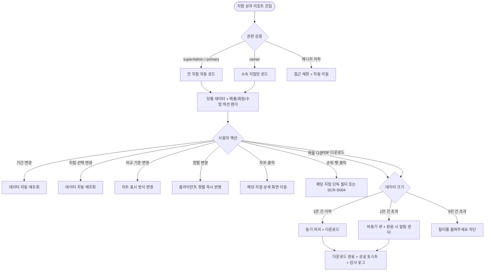
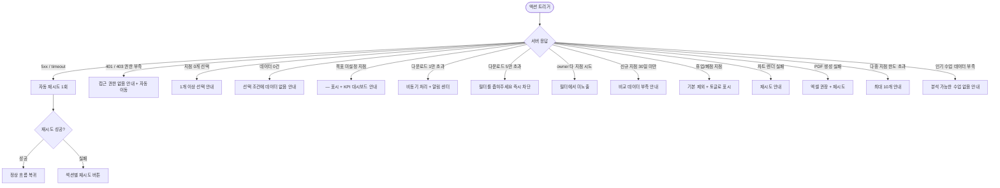

# SCR-093 지점 성과 리포트 페이지

## 1. 화면 메타 정보

이 문서는 지점 성과 리포트 페이지에 대한 자기완결형 요구사항 정의서입니다. 다른 문서를 함께 보지 않아도 이 한 장만으로 이 화면에 들어가는 모든 영역, 모든 버튼, 모든 다운로드 동작, 모든 권한, 모든 예외 처리, 그리고 이 화면을 지탱하는 운영 정책까지 전부 이해하고 구현할 수 있도록 작성합니다.

| 항목 | 값 |
|---|---|
| 작성일 | 2026-05-22 |
| 버전 | v1.0 |
| 상태 | 최신 통합본 반영 (정합화 완료) |
| 도메인 | D10 본사관리 |
| 화면 ID | SCR-093 |
| 화면명 | 지점 성과 리포트 |
| 화면 유형 | 분석/리포트 화면 |
| 라우트 (URL) | `/branch-report` |
| 플랫폼 | 데스크톱(기본), 태블릿 |
| 우선순위 | P0 (출시 필수) |
| 기능코드 | HQ-04 |
| 계약코드 | HQ-04 |
| 계약 상태 | 계약 범위 본기능 |
| 부모 기능 prefix | HQ |
| Lv1 코드 | HQ-04 |
| Lv2 / Lv3 세분화 | HQ-04-01 ~ HQ-04-06 (필터, 매출 성과, 회원 성과, 수업 성과, 정렬, 내보내기) |
| 연계 화면 | SCR-091 슈퍼대시보드, SCR-092 지점관리, SCR-094 KPI대시보드, SCR-097 감사로그, SCR-S004 매출통계, SCR-S011 매출예측 |
| 호출 다이얼로그 | 없음 (필터·내보내기 인라인 처리) |

## 2. 화면 개요와 목적

지점 성과 리포트는 본사 슈퍼관리자(전 지점) 또는 센터장(소속 지점)이 매출·회원·수업 3개 도메인의 성과를 다양한 기간(주간/월간/분기/연간/직접 입력)과 다중 지점 기준으로 비교 분석하고, 결과를 엑셀 또는 PDF로 내보내는 화면입니다. 본사 임원 정기 보고용, 월말 결산용, 분기 KPI 회의용, 외부 감사 자료 제출용, 그리고 위기 지점 진단용 보고 자료의 단일 진입점입니다.

이 화면이 다루는 운영 흐름은 매우 다양합니다. 본사 슈퍼관리자가 월말 본사 정기 보고를 준비할 때는 지난 달 전체 지점 매출을 비교 차트로 확인한 후 PDF로 다운로드해 임원 회의 자료로 사용합니다. 분기 KPI 회의에서는 분기 단위로 매출·회원 유지율·인기 수업을 비교 분석해 차기 분기 전략을 수립합니다. 위기 지점 진단에서는 매출 하위 지점과 회원 이탈 상위 지점을 식별하여 본사 지원 의사결정의 근거를 만듭니다. 우수 지점 best practice 공유에서는 인기 수업 분석을 통해 운영 방식을 추출하고 평균 이하 지점에 전파합니다. 신규 지점 정착 추적에서는 오픈 후 30일 ~ N개월 차의 매출 추이를 확인해 정착 속도를 평가합니다. 연간 결산에서는 12개월 누적 데이터로 가맹/직영 비교 또는 연간 보고서를 생성합니다. 센터장이 자기 지점만 점검할 때는 본인 지점 데이터로 자가 진단 후 운영 액션을 트리거합니다. 이탈 회원 패턴 분석에서는 유지율 낮은 지점을 식별해 HQ-EXT-03 예측 분석으로 진입합니다.

따라서 이 화면은 단순한 보고서 생성 도구가 아니라, 본사 의사결정의 핵심 자료를 만들어내는 분석 화면으로 동작해야 합니다.

## 3. 진입 경로와 인접 화면

지점 성과 리포트에 진입하는 경로는 다음과 같습니다.

첫 번째 경로는 사이드바입니다. 본사관리 메뉴 아래 "지점 리포트" 항목을 클릭하면 진입합니다. URL은 `/branch-report`이고 화면은 당월 전체 지점 성과 자동 로드 상태로 시작합니다.

두 번째 경로는 슈퍼 대시보드(SCR-091)의 지점 카드 클릭입니다. 특정 지점 카드의 매출이나 회원 수치 영역을 클릭하면 해당 지점이 자동 선택된 상태(`/branch-report?branchIds=BR0001`)로 진입합니다.

세 번째 경로는 KPI 대시보드(SCR-094)의 지점별 비교 테이블에서 행을 클릭한 경우입니다. 해당 지점이 자동 선택된 상태로 진입하면서 KPI 화면의 기간 필터도 함께 전달됩니다.

네 번째 경로는 지점 관리(SCR-092)의 통합 비교 탭에서 행을 클릭한 경우입니다. 해당 지점이 자동 선택된 상태로 진입합니다.

다섯 번째 경로는 알림 센터(SCR-104)의 본사 관련 알림(예: "월간 매출 -20% 지점 발생") 클릭입니다.

이 화면에서 빠져나가는 인접 화면은 SCR-094 KPI 대시보드(KPI 카드 상세 분석), SCR-093에서 다시 SCR-S011 매출 예측 또는 SCR-EXT-03 예측 분석(이탈 패턴 추가 분석), SCR-097 감사 로그(다운로드 이력 추적)입니다.

## 4. 레이아웃과 UI 구성

지점 성과 리포트는 위에서 아래로 흐르는 세로형 단일 컬럼 레이아웃이며, 화면 좌측 또는 상단에 필터 패널이 고정되고 그 아래에 분석 섹션이 펼쳐집니다. 화면은 위에서부터 다음 영역이 순서대로 쌓입니다.

가장 위에는 페이지 헤더가 있습니다. 헤더 좌측에는 "지점 성과 리포트" 페이지 타이틀과 현재 선택된 기간 요약(예: `2026년 5월 (월간)`)이 표시됩니다. 헤더 우측에는 [엑셀 다운로드]와 [PDF 다운로드] 버튼이 배치되고, 권한이 없는 owner의 본사 통합 모드에서는 일부 옵션이 비활성화됩니다.

페이지 헤더 바로 아래에는 필터 패널이 있습니다. 첫 줄에 조회 기간 선택(주간/월간/분기/연간/직접 입력 5종)이 있고, 둘째 줄에 지점 선택(전체 또는 특정 지점 복수 선택, 최대 10개 또는 엔터프라이즈 라이선스 30개), 셋째 줄에 비교 기준(전기간 대비 / 지점 간 비교 토글)이 배치됩니다. 필터 변경 시 데이터가 자동 재조회됩니다.

필터 패널 아래에는 매출 성과 섹션이 있습니다. 첫 번째 카드는 지점별 총 매출 비교 막대 차트로, 우리 지점 또는 선택 지점들이 막대로 표시되고 호버 시 정확한 매출 수치 툴팁이 뜹니다. 두 번째 카드는 지점별 매출 순위 테이블이며 지점명·매출액·점유율·전월 대비 증감이 컬럼으로 표시됩니다. 세 번째 카드는 목표 달성률로, 각 지점의 매출 목표 대비 달성률(%)이 게이지 차트 또는 색상 코딩(초과 초록·근접 노랑·미달 빨강)으로 표시됩니다.

매출 성과 섹션 아래에는 회원 성과 섹션이 있습니다. 지점별 신규 회원 수·활성 회원 수·이탈 회원 수가 막대 차트 또는 누적 차트로 비교 표시되고, 회원 유지율 차트가 별도로 노출되어 기간 종료 시점 활성 회원 ÷ 기간 시작 시점 회원의 백분율로 계산됩니다.

회원 성과 아래에는 수업 성과 섹션이 있습니다. 지점별 수업 운영 횟수·예약율·출석율 비교 차트와 인기 수업 유형 분석 카드가 표시됩니다. 인기 수업은 상위 5개 수업 유형이 점수·예약율·출석율·운영 횟수와 함께 나열되며, 운영 횟수 3회 미만 또는 예약 인원 10명 미만은 표본 부족으로 제외됩니다.

각 섹션 우측에는 정렬 토글(매출/회원/수업 기준 오름/내림)이 있어 사용자가 보고 싶은 순서로 정렬할 수 있고, 정렬은 클라이언트 사이드에서 즉시 반영됩니다.

페이지 가장 아래에는 데이터 기준일 표시(예: "데이터 기준: 2026-05-22 03:00 배치")가 작게 표시되어 운영자가 데이터의 신선도를 알 수 있게 합니다.

owner(센터장)가 진입하면 지점 선택 필터가 본인 소속 지점으로 고정되고 다른 지점은 선택 불가능합니다.

## 5. 탭 구성과 탭별 동작

이 화면은 별도의 탭 구조를 가지지 않습니다. 매출·회원·수업 3개 섹션이 한 화면에 동시에 표시되며, 필터 변경에 따라 데이터가 갱신됩니다. 단, 필터 패널의 기간 토글(주간/월간/분기/연간/직접 입력)과 비교 기준 토글(전기간 대비 / 지점 간 비교)이 작은 단위의 뷰 전환을 제공합니다.

기간 토글을 바꾸면 모든 섹션의 데이터가 함께 갱신되고, 비교 기준 토글을 바꾸면 차트 표시 방식이 변경됩니다. 예를 들어 "전기간 대비"는 같은 지점의 이전 기간과 비교(증감률 표시), "지점 간 비교"는 여러 지점을 동일 기간에서 비교(막대 옆쪽 배치)로 전환됩니다.

## 6. 버튼·아이콘·링크 액션 전체 정의

이 화면에 등장하는 모든 클릭 가능한 요소를 빠짐없이 정의합니다.

페이지 헤더의 [엑셀 다운로드] 버튼은 현재 필터·정렬을 그대로 적용한 전체 데이터(미리보기 페이지와 무관)를 엑셀(.xlsx)로 내려받습니다. 시트는 매출/회원/수업 3개로 분리되며 종합 시트가 추가됩니다. 다운로드 처리 중에는 버튼이 비활성화되고 진행률 토스트가 표시됩니다. 데이터가 1만 건을 초과하면 비동기 처리로 전환되어 완료 시 알림 센터로 알림이 발송됩니다. 다운로드 권한이 없는 계정에서는 버튼이 hidden입니다.

페이지 헤더의 [PDF 다운로드] 버튼은 동일 데이터를 PDF로 내려받으며, 헤더에 지점명·기간·필터 조건·생성 일시·생성자가 자동 삽입됩니다. 인쇄 시 차트가 SVG → PNG로 변환되며, 변환 실패 시 1회 재시도 후 차트 없이 텍스트만 인쇄됩니다.

필터 패널의 기간 선택 드롭다운은 주간·월간·분기·연간·직접 입력 5종 옵션을 제공하며, 직접 입력 시 날짜 범위 피커가 함께 노출됩니다. 변경 즉시 데이터가 자동 재조회됩니다.

지점 선택 멀티 셀렉트는 전체 또는 특정 지점을 복수 선택할 수 있으며, 슈퍼관리자는 모든 지점을 선택 가능하고 owner는 본인 소속 지점만 선택 가능합니다. 기본 최대 10개까지 선택 가능하며 엔터프라이즈 라이선스는 30개까지 확장됩니다. 한도 초과 시 "최대 10개 지점까지 선택할 수 있습니다" 토스트가 표시됩니다. 휴업/폐점 지점은 기본 비교에서 제외되며 토글로 표시 여부를 변경할 수 있습니다.

비교 기준 토글(전기간 대비 / 지점 간 비교)은 즉시 차트 표시 방식을 변경합니다.

매출 성과 섹션의 막대 차트는 호버 시 정확한 매출 수치 툴팁이 표시되고, 막대 클릭으로 해당 지점의 SCR-S004 매출 통계로 진입할 수 있습니다. 매출 순위 테이블의 행 클릭은 해당 지점의 상세 매출 화면 또는 SCR-093에서 그 지점만 필터링된 상태로 새로고침됩니다. 목표 달성률 카드는 색상 코딩이 핵심이며, 클릭 시 SCR-094 KPI 대시보드로 이동해 해당 지점의 매출 목표 설정 화면(DLG-094-001)으로 진입할 수 있습니다.

회원 성과 섹션의 차트는 호버 시 회원 수 툴팁, 클릭 시 해당 지점의 회원 목록(SCR-M001) 또는 회원 유지율 상세로 진입합니다.

수업 성과 섹션의 차트는 호버 시 운영 횟수와 출석율 툴팁, 클릭 시 해당 지점의 수업 관리 화면으로 진입합니다. 인기 수업 카드의 행 클릭은 해당 수업 유형의 상세 분석 화면으로 진입하며, 상품 마스터의 GX subCategory 6종 분포로 자동 연결됩니다.

각 섹션의 정렬 토글은 클라이언트 사이드 즉시 정렬이며 API 호출은 일어나지 않습니다.

owner의 본사 통합 비교 시도는 필터에서 미노출 처리되어 사용자가 그 가능성 자체를 인지하지 못합니다.

모든 버튼은 클릭 후 응답이 돌아오기 전까지 자동으로 비활성화되며, 다운로드 중에는 진행률 표시와 함께 완료 시 토스트가 추가됩니다.

## 7. 호출되는 모달 동작

지점 성과 리포트 화면에서는 별도의 다이얼로그가 호출되지 않습니다. 모든 액션은 인라인 동작 또는 다른 화면으로의 이동으로 처리됩니다.

다운로드 처리는 다이얼로그가 아닌 인라인 토스트와 진행률 표시로 안내됩니다. 다운로드 시작 시 "다운로드가 시작되었어요" 토스트, 1만 건 초과 비동기 처리 시 "백그라운드에서 생성 중, 완료 시 알림" 안내, 완료 시 "다운로드가 완료되었어요" 토스트가 차례로 표시됩니다.

매출 목표 설정으로의 진입은 SCR-094로 이동하면서 DLG-094-001(매출 목표 설정)을 자동 트리거합니다. 이 다이얼로그는 SCR-094의 책임 범위에서 정의되며 본 화면은 트리거만 담당합니다.

owner가 본사 통합 다운로드를 시도하면 알럿이 아닌 hidden 또는 비활성화로 자연스럽게 차단되며 별도 모달은 호출되지 않습니다.

## 8. 토스트와 확인 팝업과 알럿

지점 성과 리포트에서 발생하는 알림성 UI는 다음과 같습니다.

성공 토스트는 우측 상단에 녹색 계열로 5초 동안 표시되며, "엑셀 다운로드가 완료되었어요", "PDF 다운로드가 완료되었어요", "데이터를 새로고침했어요" 같은 결과 문구가 표시됩니다. 다운로드 토스트는 클릭하면 다운로드된 파일을 바로 열 수 있도록 링크 액션이 포함됩니다.

진행 토스트는 다운로드 시작 시 표시되며 "{유형} 다운로드 중... {진행률}%" 같은 진행률을 보여줍니다. 1만 건 초과 비동기 처리 시에는 "백그라운드에서 생성 중입니다. 완료되면 알림으로 안내드려요" 안내가 함께 표시됩니다.

실패 토스트는 빨강 계열로 표시되며, "데이터를 불러올 수 없어요", "엑셀 생성에 실패했어요", "PDF 생성에 실패했어요", "지점을 1개 이상 선택해주세요" 같은 문구와 함께 [다시 시도] 보조 액션이 따라옵니다. 자동 재시도는 5초 후 1회 수행됩니다.

확인 팝업은 사용되지 않습니다. 모든 액션이 인라인으로 처리됩니다.

알럿은 매니저 이하 권한자가 직접 URL로 접근했을 때 표시됩니다. "이 화면에 접근할 권한이 없습니다. 3초 후 대시보드로 이동합니다"가 표시되고 SCR-090으로 자동 이동됩니다.

신규 지점(30일 미만)이 비교 대상에 포함되면 "신규 지점은 오픈 30일 후부터 비교 가능합니다" 인라인 안내가 해당 지점 자리에 표시되고, 안정화 완료 후 자동으로 일반 비교에 편입됩니다.

다운로드 데이터가 5만 건을 초과하면 "데이터가 너무 많아요. 필터를 좁혀주세요" 에러가 즉시 반환되고 백엔드 작업은 시작되지 않습니다.

목표 미설정 지점은 목표 달성률 카드에 "—"가 표시되고 호버 시 "목표가 설정되지 않은 지점입니다. KPI 대시보드에서 설정하세요" 안내가 나옵니다.

## 9. 데이터 흐름과 외부 연동

이 화면은 여러 데이터 소스와 외부 연동에 의존합니다.

화면 진입 시점에는 지점 성과 리포트 API가 호출됩니다. 응답에는 매출·회원·수업 3개 도메인의 통합 데이터가 필터 조건에 맞게 포함됩니다. 슈퍼관리자는 RLS 우회로 모든 지점 데이터, owner는 자기 지점만 반환됩니다.

매출 데이터는 매출관리(SCR-S004) 표준을 따르며, 일별 03:00 배치로 지점별 매출이 갱신되고 매시간 배치로 당일 매출이 실시간 갱신됩니다.

회원 유지율은 주간 월요일 04:00 배치로 재계산되며, 기간 종료 시점 활성 회원 ÷ 기간 시작 시점 회원 × 100으로 산출됩니다. 신규 등록 회원은 별도 표시됩니다.

출석율은 매일 03:00 배치로 예약/출석이 집계되며, 출석 ÷ 예약 × 100으로 계산됩니다. 노쇼는 출석에서 제외되고, 취소는 분모에서 제외됩니다.

예약율은 예약 인원 합계 ÷ 정원 합계 × 100이며 정원 미설정 수업은 제외됩니다.

인기 수업 분석은 주간 월요일 04:00 배치로 종목별 분포가 갱신되며, 예약율 50% + 출석율 50% 가중으로 점수가 산출됩니다. 운영 횟수 3회 미만 또는 예약 인원 10명 미만은 표본 부족으로 제외됩니다.

목표 달성률은 KPI 대시보드(SCR-094) 또는 SCR-S011 매출 예측에서 설정한 월 매출 목표를 사용하며, 목표 미설정 시 "—"로 표시됩니다.

신규 지점 배치(매일 00:00)는 개설 후 30일이 도래한 지점을 자동으로 비교 가능 상태로 전환하고, 비교 테이블에 편입시킵니다.

엑셀 내보내기는 백그라운드 작업으로 분리됩니다. 사용자가 다운로드 버튼을 누르면 즉시 토스트가 표시되고 실제 파일 생성은 백그라운드에서 진행됩니다. 1만 건을 초과하면 비동기 큐로 전환되어 완료 시 알림 센터(NFR-19)로 다운로드 링크가 발송되고, 5만 건을 초과하면 즉시 차단됩니다.

다운로드 액션은 감사 로그(SCR-097)에 actor·필터 조건·생성 일시로 자동 기록됩니다. 이는 본사 정보 외부 유출 추적을 위한 정책입니다.

다운로드 파일에서 회원명·연락처 같은 개인정보는 마스킹 정책이 적용될 수 있으며, 본사 권한자만 마스킹 해제 옵션을 사용할 수 있습니다.

HQ-04 KPI 목표 변경 이벤트가 발생하면 목표 달성률이 자동 갱신되며, HQ-EXT-03 예측 진입 이벤트는 유지율 낮은 지점 식별 시 트리거됩니다.

화면에서 호출하는 주요 API 엔드포인트는 다음과 같습니다. 종합 조회 `GET /api/branch-reports`, 매출 `GET /api/branch-reports/sales`, 회원 `GET /api/branch-reports/members`, 수업 `GET /api/branch-reports/classes`, 동기 내보내기 `GET /api/branch-reports/export?format=excel|pdf`, 비동기 내보내기 `POST /api/branch-reports/export/async`.

## 10. 화면 상태와 예외 처리

지점 성과 리포트는 다음 상태들을 가질 수 있습니다.

로딩 중 상태에서는 차트와 테이블 자리에 스켈레톤이 표시됩니다.

정상 상태는 가장 일반적인 상태로, 매출·회원·수업 3개 섹션이 모두 채워지고 정렬·필터가 활성화됩니다.

데이터 없음 상태는 필터 조건에 해당하는 데이터가 0건일 때이며, "선택 기간/지점에 해당 데이터가 없습니다"와 필터 조정 안내가 표시됩니다.

다중 지점 미선택 상태는 사용자가 지점을 0개 선택한 경우이고, "비교할 지점을 1개 이상 선택해주세요"가 인라인으로 표시됩니다.

목표 미설정 상태는 일부 또는 모든 지점에 매출 목표가 설정되지 않은 상태이고, 해당 카드에 "—" 표시와 KPI 대시보드 설정 안내가 함께 표시됩니다.

내보내기 처리 중 상태는 다운로드 버튼 클릭 후 진행 중일 때이고, 버튼이 비활성화되고 진행률 토스트가 표시됩니다.

대용량 비동기 처리 상태는 1만 건 초과 다운로드 요청 시이며, "백그라운드에서 생성 중" 안내와 완료 시 알림 안내가 표시됩니다.

신규 지점 30일 미만 상태는 비교 대상에 포함된 신규 지점이 있을 때이며, 해당 지점에 "비교 데이터 부족" 인라인 안내가 표시됩니다.

휴업/폐점 지점 표시 토글 상태는 사용자가 휴업·폐점 지점을 표시 토글로 켰을 때이며, 흐림 처리된 지점이 추가로 노출됩니다.

권한 부족 상태는 매니저 이하 권한자가 직접 URL로 접근했을 때이며, 안내 후 자동 이동됩니다.

오류 상태는 5xx 또는 timeout 응답 시이며, 섹션별 재시도 버튼과 토스트가 표시됩니다.

5분 캐시 만료 상태는 자동 재조회로 처리됩니다.

예외 케이스별 처리는 다음과 같습니다.

다중 지점 미선택 시 "비교할 지점을 1개 이상 선택해주세요" 안내가 표시되고 차트는 비어 있습니다.

데이터 없음 시 필터 조정 안내가 표시되고, 다운로드 버튼은 비활성화됩니다.

목표 미설정 지점은 "—"로 표시되고 KPI 대시보드 설정 안내 링크가 제공됩니다.

다운로드 처리 중에는 버튼 로딩과 진행률 토스트가 표시되며, 완료 시 토스트가 추가됩니다.

다운로드 실패 시 "다시 시도해주세요" 토스트와 재시도 버튼이 제공됩니다.

1만 건 초과 시 비동기 처리로 전환되고 완료 시 알림 센터로 안내됩니다.

5만 건 초과 시 즉시 차단되고 "필터를 좁혀주세요" 안내가 표시됩니다.

권한 부족 매니저 이하 진입 시 안내 후 본사 대시보드로 자동 이동됩니다.

owner의 본사 통합 비교 시도는 필터에서 미노출 처리됩니다.

신규 지점 30일 미만은 "비교 데이터 부족" 안내가 표시되고 30일 도래 후 자동 편입됩니다.

휴업/폐점 지점은 기본 제외 토글로 표시 여부 조정 가능합니다.

차트 렌더링 실패 시 "차트 오류, 재시도" 안내가 표시됩니다.

PDF 생성 실패 시 "PDF 생성 오류" 안내와 엑셀 권장 메시지가 함께 표시됩니다.

다중 지점 한도 초과 시 "최대 10개 지점까지 선택할 수 있습니다" 토스트가 표시됩니다.

인기 수업 데이터 부족 시 "분석 가능한 수업이 없어요" 안내가 표시됩니다.

API 오류 시 섹션별 재시도가 가능하며 5초 후 자동 재시도됩니다.

## 11. 권한별 처리

이 화면은 권한에 따라 보이는 영역과 가능한 액션이 달라집니다.

슈퍼관리자(superAdmin)와 본사 최고관리자(primary)는 전체 지점 성과를 비교 분석할 수 있습니다. 필터에서 모든 지점이 선택 가능하며, RLS가 우회되어 모든 데이터에 접근 가능합니다. 다운로드(엑셀/PDF)도 모두 가능하며, 본사 통합 모드 다운로드는 본사 권한자만 사용할 수 있습니다.

센터장(owner)은 자기 지점만 분석 가능합니다. 지점 선택 필터에 본인 소속 지점이 고정되고 다른 지점은 노출되지 않습니다. 다운로드는 자기 지점 데이터에 한정해서 가능하며, 본사 통합 다운로드는 차단됩니다.

매니저(manager) 이하 권한자(fc, trainer, staff, front, readonly)는 본 화면에 접근할 수 없습니다. 사이드바에 메뉴가 보이지 않고, 직접 URL 접근 시 안내 후 자동 이동됩니다. 권한 우회 시도는 감사 로그에 기록됩니다.

다운로드 권한은 슈퍼관리자와 owner만 가지며, 다운로드된 파일에는 회원 개인정보가 마스킹 정책에 따라 처리됩니다. 본사 권한자는 마스킹 해제 옵션을 사용할 수 있습니다.

본사 통합 모드 다운로드는 본사 권한자만 허용되며, 다운로드 파일에 "소속 지점" 컬럼이 자동 추가됩니다. 일반 owner의 다운로드에는 이 컬럼이 없습니다.

권한이 부족해서 액션이 차단된 경우의 사용자 경험은 일관됩니다. 첫째, 사이드바·필터에서 권한 외 요소가 숨겨집니다. 둘째, 일부 다운로드 옵션이 비활성화됩니다. 셋째, 백엔드는 401/403으로 거부합니다. 넷째, 권한 우회 시도가 감사 로그에 기록됩니다.

## 12. 메인 흐름

지점 성과 리포트의 핵심 동작 흐름입니다.

## 13. 에러와 예외 흐름

## 14. 핵심 디자인 요청사항

이 화면이 본사 운영자에게 잘 작동하려면 다음 디자인 원칙이 시각적으로 명확해야 합니다.

필터 패널은 화면 상단에 고정되어 사용자가 어느 위치에서 스크롤하더라도 필터를 다시 변경할 수 있도록 합니다. 기간 토글은 5개 옵션이 가로로 배치된 세그먼트 컨트롤 형태이며 선택된 옵션이 명확히 강조됩니다.

매출·회원·수업 3개 섹션은 동일한 카드 톤으로 묶여 있되 색상 강조(매출은 파랑, 회원은 초록, 수업은 보라)로 도메인을 구분합니다.

매출 비교 막대 차트는 우리 지점 또는 선택 지점이 강조 색상으로 표시되고 나머지는 회색 톤으로 표시되어 본인 위치를 빠르게 인지할 수 있어야 합니다.

목표 달성률 게이지 차트는 초과 달성(100% 이상)은 초록, 근접(80~99%)은 노랑, 미달(79% 이하)은 빨강으로 색상 코딩되어 멀리서 봐도 달성 상태를 즉시 인지할 수 있어야 합니다.

회원 유지율 차트는 선 또는 막대 형태로 추이를 보여주며, 90% 이상은 초록, 80~89%는 노랑, 80% 미만은 빨강으로 강조됩니다.

수업 성과 차트는 예약율과 출석율이 동일 차트에 함께 표시되어 두 지표의 균형을 한눈에 볼 수 있어야 합니다. 인기 수업 카드는 점수 기준 정렬되고 상위 1~3위에는 메달 아이콘(금/은/동)이 추가로 표시됩니다.

다운로드 버튼은 primary 컬러로 강조되고 호버 시 아이콘(엑셀/PDF) 변화로 클릭 가능성을 알려야 합니다.

진행률 토스트는 다운로드 시작부터 완료까지 시각적으로 부드럽게 갱신되어야 합니다.

데이터 기준일 표시는 페이지 하단에 작게 배치되어 운영자가 데이터 신선도를 자연스럽게 인지하도록 합니다.

모바일/태블릿에서는 3개 섹션이 1열로 쌓이고, 차트는 축소된 형태로 표시되며, 필터 패널은 접힘 상태로 시작해 토글로 펼칩니다.

## 15. 운영 정책 (이 화면에 연결된 부분)

이 화면은 본사 운영 의사결정에 직접 연결되는 분석 도구이므로, 운영 정책을 풀어 적습니다.

매출 집계 기준은 매출관리 도메인의 SCR-S004 표준을 그대로 따릅니다. 담당자별/지점별/본사 통합 모두 동일한 정의이며, 환불은 매출에서 차감됩니다. 04/29 기준으로 매출/재무 추가 지표(위약금 합계, VAT 제외 순매출, 법인권 매출, 개월별 판매 비율, 담당자별 환불 책임)도 퍼블리싱에 반영됩니다.

회원 유지율은 기간 종료 시점 활성 회원 ÷ 기간 시작 시점 회원 × 100으로 정의됩니다. 신규 등록 회원은 별도 표시되어 유지율 분모와 분리됩니다.

출석율은 출석 ÷ 예약 × 100이며 노쇼는 출석에서 제외되고, 취소는 분모에서 제외됩니다. 예약율은 예약 ÷ 정원 × 100이며 정원 미설정 수업은 제외됩니다.

목표 달성률은 SCR-094 KPI 대시보드 또는 SCR-S011 매출 예측에서 설정한 월 매출 목표를 사용합니다. 목표 미설정 시 "—"로 표시되며 SCR-094 진입 안내가 제공됩니다.

owner 권한 제한은 명확합니다. 소속 지점만 조회 가능하며, 타 지점 비교는 슈퍼관리자만 가능합니다. 필터에 다른 지점이 노출되지 않아 owner가 그 가능성 자체를 인지하지 못합니다.

매니저 이하는 본 화면 접근이 차단됩니다.

다운로드 필터 일관성 정책은 엑셀·PDF가 현재 화면 필터 조건을 그대로 반영하며, 미리보기 페이지와 무관하다는 것입니다. 이는 운영자가 화면에서 본 그대로 보고서를 만들 수 있게 합니다.

감사 로그 필수 정책은 다운로드(엑셀/PDF) 모두 actor·필터 조건·생성 일시가 SCR-097에 기록되어야 한다는 것입니다. 이는 본사 정보 외부 유출 추적을 위한 정책입니다.

신규 지점 정착 기준은 오픈 후 30일 미만 지점이 비교 데이터 부족으로 표시되고, 30일 도래 시 자동으로 일반 비교에 편입된다는 것입니다.

휴업/폐점 지점은 기본 비교에서 제외되며 토글로 표시 가능합니다. 폐점 지점은 데이터 보관 기간 내에만 표시되며, 6개월 경과 후 자동 아카이브됩니다.

인기 수업 분석 정책은 예약율 50% + 출석율 50% 가중으로 점수를 산출하고, 운영 횟수 3회 미만 또는 예약 인원 10명 미만은 표본 부족으로 제외한다는 것입니다. 동점 처리는 출석 인원 합계 → 운영 횟수 → 가나다순으로 정해져 있습니다.

차트 타입 정책은 막대(비교), 선(추이), 도넛(분포)으로 정해져 있으며 사용자가 토글로 변경 가능합니다.

정렬 정책은 매출/회원 수/유지율 순으로 오름/내림 토글이 가능합니다.

다중 지점 비교 한도는 기본 10개이며 엔터프라이즈 라이선스는 30개까지 확장 가능합니다.

PDF 헤더 자동 삽입 정책은 지점명·기간·필터 조건·생성 일시·생성자가 모든 PDF에 자동 포함된다는 것입니다.

엑셀 시트 분리 정책은 매출/회원/수업 시트가 분리되고 종합 시트가 추가된다는 것입니다.

대용량 다운로드 비동기 정책은 1만 건 이상 시 비동기 처리로 전환되고 완료 시 알림 센터로 안내된다는 것이며, 5만 건 초과 시 즉시 차단됩니다.

개인정보 처리 정책은 다운로드 파일의 회원명·연락처가 마스킹 정책에 따라 처리될 수 있다는 것이며, 본사 권한자만 마스킹 해제 옵션을 사용할 수 있습니다.

데이터 갱신 주기는 일별 03:00 배치 + 매시간 매출 갱신이며, 화면은 5분 캐시가 적용됩니다.

본사 통합 KPI는 본사 슈퍼관리자만 조회·다운로드 가능하며, 04/29 기준으로 전사 환불 규모, 전사 재등록률, 지점 간 매출 편차가 본사 전용 통합 대시보드에 표시됩니다. 본 화면(SCR-093)은 지점 간 비교가 핵심이며 본사 통합 지표는 SCR-094에서 다룹니다.

이상의 모든 정책은 이 화면을 구현하고 운영하는 사람이 별도 문서 없이 이 한 장만 보면 이해할 수 있도록 풀어 적었습니다. 정책이 바뀌면 이 문서가 함께 갱신되어야 하며, 코드 변경과 정책 변경은 항상 짝지어 진행됩니다.
