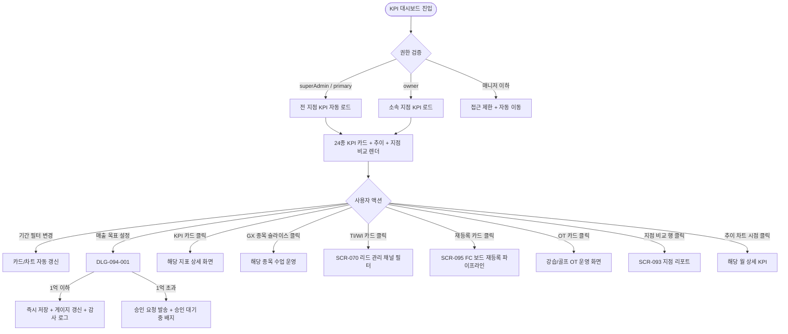

# SCR-094 KPI 대시보드 페이지

## 1. 화면 메타 정보

이 문서는 KPI 대시보드 페이지에 대한 자기완결형 요구사항 정의서입니다. 다른 문서를 함께 보지 않아도 이 한 장만으로 이 화면에 들어가는 모든 영역, 모든 카드, 모든 다이얼로그, 모든 권한, 모든 예외 처리, 그리고 이 화면을 지탱하는 운영 정책까지 전부 이해하고 구현할 수 있도록 작성합니다.

| 항목 | 값 |
|---|---|
| 작성일 | 2026-05-22 |
| 버전 | v1.0 |
| 상태 | 최신 통합본 반영 (정합화 완료) |
| 도메인 | D10 본사관리 |
| 화면 ID | SCR-094 |
| 화면명 | KPI 대시보드 (24종 + 강습 세션 + 상담 퍼널) |
| 화면 유형 | 허브 화면 (KPI Hub) |
| 라우트 (URL) | `/kpi` |
| 플랫폼 | 데스크톱(기본), 태블릿 |
| 우선순위 | P0 (출시 필수) |
| 기능코드 | HQ-02 |
| 계약코드 | CTR-04, HQ-02 |
| 계약 상태 | 계약 범위 본기능 |
| 부모 기능 prefix | HQ |
| Lv1 코드 | HQ-02 |
| Lv2 / Lv3 세분화 | HQ-02-01 ~ HQ-02-09 (KPI 카드, 상담 퍼널, 재등록, GX, OT 운영, 강습 세션 유형, 추이 차트, 지점별 비교, 매출 목표 설정) |
| 연계 화면 | SCR-091 슈퍼대시보드, SCR-093 지점성과리포트, SCR-095 KPI프리뷰보드, SCR-097 감사로그, SCR-S004 매출통계, SCR-070 리드 |
| 호출 다이얼로그 | DLG-094-001 매출목표설정 |

## 2. 화면 개요와 목적

KPI 대시보드는 본사 슈퍼관리자(전 지점) 또는 Owner(지점장)(소속 지점)이 24종 이상의 핵심 성과 지표를 통합 시각화하는 D10 본사관리 도메인의 허브 화면입니다. 매출·신규/유지·OT/체험·GX 종목·강습 세션·상담 퍼널·재등록 7개 카테고리의 KPI를 한 화면에서 보고, 매출 목표 대비 달성률을 게이지 차트로 직관 표시하며, WI(방문 문의) vs TI(전화 문의)를 분리해 상담 병목을 식별하고, OT 등록 전환율·거부율(거부+보류)·이월률·체험→등록률 같은 운영 정밀 지표까지 통합 표시합니다.

이 화면이 다루는 운영 흐름은 매우 다양합니다. 본사 임원이 매월 KPI 점검에서 24종 KPI 게이지와 추이 차트로 월간 달성률을 점검하고 미달 지점에 액션을 지시합니다. 매출 목표 설정에서는 DLG-094-001로 지점별 월 목표를 입력하고 다음 달 달성률을 추적합니다. 상담 퍼널 병목 진단에서는 TI/WI 분리를 통해 TI 방문 전환율이 낮으면 콜 스크립트 개선을 지시하고, 재등록 위기 진단에서는 재등록 성공률이 낮은 지점을 식별해 FC 보드(SCR-095)로 진입합니다. GX 종목 운영 의사결정에서는 6종 분포 차트로 비인기 종목 폐지와 인기 종목 증설을 결정하고, OT 운영 진단에서는 강습/골프 OT 분리와 거부율(거부+보류)로 트레이너 배정을 조정합니다. 연간 KPI 회의 자료는 월별 달성률 추이 차트로 분기/연간 종합 보고를 만들고, 신규 지점 KPI 안정화에서는 첫 3개월을 별도 표시한 후 안정화 완료 후 일반 비교에 편입합니다.

따라서 이 화면은 단순한 KPI 보드가 아니라, 본사 의사결정의 모든 핵심 지표가 모이는 KPI 허브로 동작해야 합니다.

## 3. 진입 경로와 인접 화면

KPI 대시보드에 진입하는 경로는 다음과 같습니다.

첫 번째 경로는 사이드바입니다. 본사관리 메뉴 아래 "KPI 대시보드" 항목을 클릭하면 진입합니다.

두 번째 경로는 슈퍼 대시보드(SCR-091)의 KPI 카드 클릭입니다. 통합 매출·신규 회원·만료 같은 카드를 클릭하면 SCR-094의 해당 지표 상세 차트로 진입합니다.

세 번째 경로는 지점 성과 리포트(SCR-093)에서 KPI 카드 상세 분석으로 들어가는 경우입니다.

네 번째 경로는 본사 대시보드(SCR-090)에서 추이 차트 클릭이나 매출 카드 클릭을 통해 진입하는 경우입니다.

다섯 번째 경로는 알림 센터에서 "월간 KPI 미달 알림" 클릭 시이며, 미달 지점이 자동 필터된 상태로 진입합니다.

이 화면에서 빠져나가는 인접 화면은 매출 목표 설정 다이얼로그(DLG-094-001), 지점별 비교 행 클릭 시 SCR-093 지점 성과 리포트, FC 보드(SCR-095), KPI 자체의 정밀 분석을 위한 SCR-S004 매출 통계와 SCR-070 리드 관리, 그리고 감사 로그(SCR-097)입니다.

## 4. 레이아웃과 UI 구성

KPI 대시보드는 위에서 아래로 흐르는 세로형 레이아웃이며, 카드와 차트가 그리드로 배치됩니다. 화면은 위에서부터 다음 영역이 순서대로 쌓입니다.

가장 위에는 페이지 헤더가 있습니다. 헤더 좌측에는 "KPI 대시보드" 페이지 타이틀과 현재 조회 중인 기간(예: `2026년 5월 (월간)`)이 표시됩니다. 헤더 우측에는 기간 필터(주간/월간/분기/연간 토글), [매출 목표 설정] 버튼이 배치됩니다.

페이지 헤더 바로 아래에는 KPI 카드 영역이 카테고리별 섹션으로 구분되어 표시됩니다.

매출 카테고리 섹션에는 매출 목표 대비 달성률 게이지 차트와 함께 4종 매출 지표(총매출/PT매출/이용권매출/기타매출)가 카드 형태로 표시됩니다. 게이지 차트는 100% 기준선이 표시되고 색상 코딩(초과 초록·근접 노랑·미달 빨강)이 적용됩니다. 전월 대비 증감이 카드마다 함께 표시됩니다.

신규/유지 카테고리 섹션에는 신규 회원 목표 대비 달성률·출석률 목표 대비 달성률·회원 유지율 목표 대비 달성률이 게이지 카드로 표시됩니다.

GX 수업 카테고리 섹션에는 GX 수업 KPI #19~#22(이번 달 수업 건수·예약 수·출석 수·수업 출석률) 4종 카드와 GX 세부 종목 6종 분포 차트(요가·필라테스·스피닝·줌바·에어로빅·GX 기타)가 표시됩니다. 종목 분포는 인기 종목 증설/비인기 종목 폐지 의사결정에 사용됩니다.

강습 세션 유형별 운영 KPI 섹션에는 PT·필라테스·스트레칭·테라피 4종의 강습세션수가 카드 또는 누적 막대 차트로 표시됩니다. 월간 합계와 주차별 추이를 함께 제공합니다.

상담 퍼널 KPI 섹션에는 WI vs TI 건수(방문 문의 vs 전화 문의 분리 막대 또는 2분할 카드), TI 방문 전환율, TI 등록률, WI 등록률 카드가 표시됩니다. FC 보드(SCR-095)의 상담 액션 큐와 연결되어 전화 문의 후 미방문·방문 후 미등록 대상이 후속 조치 대상으로 노출됩니다.

재등록/이탈 회복 KPI 섹션에는 재등록 상담 완료 건수와 재등록 성공률이 카드로 표시됩니다. 재등록 성공률은 `[재등록DB]` B열 등록 ÷ (등록+확정+예상+관리+실패)로 산출됩니다.

OT/수업운영 KPI 섹션에는 강습 OT 신규 배정·골프 OT 신규 배정·OT 등록 전환율·OT 거부율(거부+보류)·OT 이월률(이월/OT배정 인원)·OT 체험 → 등록률 카드가 표시되며, 강습 OT와 골프 OT는 별도 섹션 또는 탭으로 분리됩니다.

KPI 카드 영역 아래에는 목표 달성 추이 차트가 있습니다. 월별 KPI 달성률 추이 선 차트와 목표선(100% 기준선)이 함께 표시되어 시간에 따른 달성률 변화를 보여줍니다.

추이 차트 아래에는 지점별 KPI 비교 테이블이 있습니다. 컬럼은 지점명, 매출 달성률, 신규 회원 달성률, 출석률 달성률이며, 색상 구분(초과 초록·근접 노랑·미달 빨강)이 적용됩니다. 정렬 기본값은 달성률 낮은 순(미달 우선 식별)이고, 행 클릭으로 SCR-093 지점 리포트에 진입합니다.

페이지 가장 아래에는 데이터 기준 시각(예: "데이터 기준: 2026-05-22 03:00 배치")이 작게 표시됩니다.

owner(Owner(지점장))가 진입하면 지점 선택이 자기 지점으로 고정됩니다.

## 5. 탭 구성과 탭별 동작

이 화면은 별도의 상위 탭을 가지지 않지만, 카테고리 섹션 안에서 강습 OT와 골프 OT가 서브 탭으로 분리됩니다. 강습 OT 탭은 강습 OT 신규 배정·등록 전환율 등이 표시되고, 골프 OT 탭은 골프 프로그램의 영업 파이프라인이 독립적으로 표시됩니다.

기간 필터(주간/월간/분기/연간)는 헤더에서 통합 토글로 동작하며, 변경 시 모든 카드와 차트가 함께 갱신됩니다. 카드 영역 안에서 GX 종목 분포는 KPI #19~#22 GX 수업 지표의 보조 분석 위젯으로 종속 표시됩니다.

지점별 비교 테이블의 정렬 기준은 달성률 낮은 순이 디폴트이며, 매출 달성률·신규 회원 달성률·출석률 달성률 컬럼별로 정렬 변경 가능합니다.

## 6. 버튼·아이콘·링크 액션 전체 정의

이 화면에 등장하는 모든 클릭 가능한 요소를 빠짐없이 정의합니다.

페이지 헤더의 기간 필터 토글(주간/월간/분기/연간)은 즉시 데이터를 갱신합니다. 2년을 초과하는 직접 입력은 "최대 2년 조회 가능" 토스트로 차단됩니다.

[매출 목표 설정] 버튼은 DLG-094-001을 호출합니다. 슈퍼관리자(superAdmin/primary)와 Owner(지점장)만 활성화되며, manager 이하는 hidden입니다. 1억 초과 매출 목표 입력 시 본사 승인 워크플로우가 트리거됩니다.

KPI 카드는 호버 시 약간의 그림자 효과가 들어가고, 클릭하면 해당 지표의 상세 차트 또는 관련 화면으로 진입합니다. 매출 카드는 SCR-S004 매출 통계, 신규 회원 카드는 SCR-096 온보딩 대시보드, 출석률 카드는 출석 관리 상세, 회원 유지율 카드는 SCR-093 지점 리포트의 유지율 섹션으로 이동합니다.

GX 종목 분포 차트의 슬라이스 클릭은 해당 종목의 수업 운영 화면으로 이동합니다. 인기 종목 증설/비인기 폐지 의사결정의 출발점으로 사용됩니다.

상담 퍼널 카드의 WI vs TI 분리 막대는 클릭 시 SCR-070 리드 관리로 이동하면서 해당 채널 필터로 진입합니다. TI 방문 전환율 카드 클릭은 SCR-095 FC 보드의 상담 액션 큐로 진입합니다.

재등록 카드는 [재등록DB] 외부 시트 또는 SCR-095 FC 보드의 재등록 파이프라인으로 진입합니다.

OT 카드(강습/골프)는 각각 강습 OT 운영 화면과 골프 OT 운영 화면으로 진입합니다. 거부율 카드는 호버 시 "거부+보류 포함" 툴팁이 표시됩니다.

강습 세션 유형 카드(PT/필라/스트/테라)는 각각 해당 세션 유형의 수업 운영 화면으로 진입합니다.

목표 달성 추이 차트는 마우스 오버 시 시점별 달성률 툴팁이 표시되고, 점 클릭으로 해당 월의 상세 KPI 화면으로 진입합니다.

지점별 KPI 비교 테이블의 행 클릭은 SCR-093 지점 리포트로 이동하며 해당 지점 ID가 파라미터로 전달됩니다. 정렬 컬럼 헤더 클릭은 클라이언트 사이드 정렬을 토글합니다.

데이터 기준 시각 표시는 클릭 가능 영역이 아닙니다.

모든 버튼은 클릭 후 응답이 돌아오기 전까지 자동으로 비활성화되며, 데이터 로딩 중에는 카드별 스켈레톤이 표시됩니다.

## 7. 호출되는 모달 동작

이 화면에서 호출되는 모달은 DLG-094-001 매출 목표 설정 다이얼로그 한 가지입니다.

### 7-1. DLG-094-001 매출 목표 설정 다이얼로그

매출 목표 설정 다이얼로그는 본사 슈퍼관리자가 지점별 월 매출 목표를 설정하는 모달입니다. 이 화면의 [매출 목표 설정] 버튼으로 트리거됩니다.

모달 상단에는 "매출 목표 설정" 제목이 표시되고, 그 아래에 입력 폼이 펼쳐집니다. 대상 지점 선택(전체 일괄 또는 개별 선택), 목표 적용 기간 선택(특정 월 또는 기간 범위), 지점별 월 매출 목표 금액 입력(전체 일괄 또는 개별), 전년 동기 실적 참고 표시(입력 참고용)로 구성됩니다.

확인 버튼을 누르면 목표가 저장되고, SCR-094 KPI 대시보드의 게이지 차트가 즉시 갱신됩니다. 1억 초과 매출 목표 입력 시 본사 슈퍼관리자 2차 승인 워크플로우가 자동 트리거되며, 승인 완료 전에는 게이지에 "승인 대기 중" 배지가 표시됩니다. 음수 입력은 "0 이상의 금액을 입력하세요" 인라인 오류로 차단됩니다.

취소를 누르면 모달이 닫히고 목표가 변경되지 않습니다. 동시 저장 충돌(optimistic lock) 시 "다른 사용자가 수정 중입니다" 안내가 표시되고 재시도가 안내됩니다.

권한은 슈퍼관리자(superAdmin/primary)와 Owner(지점장)만 사용할 수 있으며, manager 이하는 모달에 진입할 수 없도록 부모 화면의 버튼이 hidden 처리됩니다.

매출 목표 설정 이력은 감사 로그에 actor·branch_id·금액·기간·timestamp로 자동 기록됩니다.

DLG-094-001의 상세한 동작 정의는 별도 폴더(DLG-094-001 매출목표설정 다이얼로그)에 정의되어 있고, 이 화면의 책임은 트리거와 결과 반영까지입니다.

## 8. 토스트와 확인 팝업과 알럿

KPI 대시보드에서 발생하는 알림성 UI는 다음과 같습니다.

성공 토스트는 우측 상단에 녹색 계열로 5초 동안 표시되며, "매출 목표를 저장했어요", "데이터를 새로고침했어요" 같은 결과 문구가 표시됩니다. 1억 초과 목표 저장 시에는 "승인 요청을 발송했어요" 안내가 함께 표시됩니다.

실패 토스트는 빨강 계열로 표시되며, "데이터를 불러올 수 없어요", "매출 목표 저장에 실패했어요", "최대 2년 조회 가능합니다" 같은 문구와 보조 액션이 표시됩니다.

확인 팝업은 DLG-094-001 모달 안에서만 사용되며 일반 화면에서는 거의 사용되지 않습니다.

알럿은 매니저 이하 권한자가 직접 URL로 접근했을 때 표시됩니다. "이 화면에 접근할 권한이 없습니다. 3초 후 대시보드로 이동합니다"가 표시되고 SCR-090으로 자동 이동됩니다.

배치 미완료 시(03:00 배치 실패) 상단에 "XX:XX 기준 데이터" 안내 배너가 표시되어 데이터 신선도를 명시합니다.

승인 대기 중인 목표가 있으면 게이지 카드에 "승인 대기 중" 배지가 표시되고 호버 시 안내 툴팁이 나옵니다.

GX 서브카테고리 매핑이 누락된 신규 종목이 있으면 어드민 알림(Slack)이 자동 발송됩니다.

## 9. 데이터 흐름과 외부 연동

이 화면은 매우 많은 데이터 소스에 의존합니다.

화면 진입 시점에는 KPI 종합 조회 API가 호출됩니다. 응답에는 24종 이상 KPI의 현재값, 전월 대비 증감, 목표 달성률, 추이 데이터가 포함됩니다.

매출 4종 지표(총매출/PT매출/이용권매출/기타매출)는 `[매출종합]` F열 결제금액 기준으로 산출됩니다.

상담 퍼널은 `[신규DB]` C열(`WI=방문`, `TI=전화문의`, `체험`, `일일입장`)을 원천으로 사용하며, TI 방문 전환율은 TI 문의 중 N/R/V열 중 하나 이상이 `대면`인 건이고, TI 등록률·WI 등록률은 `[주간월간보고]` AC14:AI14·AF14:AI14·AJ14:AM14 셀에서 산출됩니다.

재등록 KPI는 `[재등록DB]` B열 `상담결과` 기반으로 집계되며, 성공률 = 등록 ÷ (등록+확정+예상+관리+실패)입니다.

GX 세부 종목은 상품 마스터 `category=LESSON_PASS`이고 `lessonType=GX`이며 `subCategory` 6종(요가·필라테스·스피닝·줌바·에어로빅·GX 기타) 기준이며, 외부 원천은 `[월매출]` C열과 `[주간월간보고]` T5:U5입니다.

OT KPI는 `[OT관리-강습]`과 `[OT관리-골프]`의 `OT현황 Z6(OT배정 인원)`을 원천으로 사용합니다. 등록 전환율 = 등록 / OT 진행(`OT현황 Z9`), 거부율 = (거부+보류) / OT 진행(`OT현황 Z7`), 이월률 = 이월 / OT배정 인원(`OT현황 Z8`)으로 계산됩니다. 체험 → 등록률은 `OT현황 AC6/AC5`로 산출됩니다.

강습 세션 유형은 수업/출석/일정 원장의 세션 유형별 완료 수업수가 공식 원천이며, `[주간월간보고]` N5(강습) 및 `달성` 시트 `G열(강습)`, `[강습업무보고]` 주간보고 `O열(수업수)`은 검산용으로만 사용됩니다.

데이터 캐시는 5분(Redis TTL 300s)이 기본이며, 매시간 정각 배치로 KPI 집계가 갱신되고 일별 정산 배치(매일 03:00)로 전날 매출·출석·회원 데이터가 확정됩니다.

매출 목표 승인 이벤트는 1억 초과 목표 입력 → 승인 완료 시 승인자에게 알림이 발송되고 게이지에 반영됩니다.

배치 실패 시(03:00 배치 3회 실패) 온콜 팀 Slack/SMS 알림이 자동 발송되고 페이지 상단에 "XX:XX 기준 데이터" 배너가 자동 표시됩니다.

지점별 KPI 위기 알림은 매일 배치 완료 후 달성률 60% 미만 지점이 감지되면 해당 Owner(지점장)과 본사 담당자에게 푸시 알림이 발송됩니다.

신규 지점 안정화 자동 전환은 매일 00:00 크론으로 개설 후 91일 경과 시 신규 지점 배지를 제거하고 일반 비교 테이블에 편입됩니다.

월 목표 자동 복사는 신규 월 시작 시 목표 미설정 감지 시 전월 목표값으로 초기값을 제안하며, 실제 저장은 수동입니다.

GX 종목 분포 자동 업데이트는 상품 마스터 subCategory 변경 이벤트가 발생하면 분포 차트 데이터가 재집계되고 캐시가 무효화됩니다.

감사 로그는 KPI 대시보드 진입, 목표 설정/수정 모두에 대해 자동 기록됩니다.

화면에서 호출하는 주요 API 엔드포인트는 다음과 같습니다. KPI 종합 `GET /api/kpi/dashboard`, 상담 퍼널 `GET /api/kpi/sales-funnel`, OT `GET /api/kpi/ot`, 강습 세션 `GET /api/kpi/sessions`, 매출 목표 설정 `POST /api/kpi/sales-goal`.

## 10. 화면 상태와 예외 처리

KPI 대시보드는 다음 상태들을 가질 수 있습니다.

로딩 중 상태에서는 카드와 차트 자리에 스켈레톤이 표시됩니다.

정상 상태는 가장 일반적인 상태로, 모든 KPI 카드와 추이 차트, 지점별 비교 테이블이 모두 정상으로 채워집니다.

목표 미설정 상태는 매출·신규/유지 목표가 설정되지 않은 지점에서 나타납니다. 게이지 카드에 "목표 미설정" 배지와 0% 고정 게이지, [매출 목표 설정] 바로가기 링크가 표시됩니다.

초과 달성 상태는 달성률 100%를 넘은 카드에서 나타나며, 게이지가 초록으로 강조됩니다.

승인 대기 상태는 1억 초과 매출 목표가 본사 슈퍼관리자 2차 승인 전인 상태이며, 카드에 "승인 대기 중" 배지와 이전 값 유지 표시가 나옵니다.

배치 미완료 상태는 03:00 배치가 진행 중이거나 실패한 상태이며, 카드 일부에 N/A 또는 스켈레톤이 유지되고 상단에 "XX:XX 기준 데이터" 배너가 표시됩니다.

신규 지점 첫 3개월 상태는 개설 1~91일 사이 지점에서 나타나며, 카드에 "오픈 {경과일수}일" 또는 "신규" 배지가 표시되고 지점별 비교 테이블에서 별도 섹션으로 분리됩니다.

TI 방문 전환율 0% 상태는 상담 퍼널 경고 강조 상태이며, 빨강 강조와 FC 보드(SCR-095) 바로가기가 함께 노출됩니다.

캐시 만료 전 강제 새로고침 상태는 사용자가 새로고침을 눌렀을 때이며, 캐시 TTL 5분 내라면 캐시 데이터가 반환되고 "실시간 아님" 안내가 표시됩니다.

배치 실패 상태는 03:00 배치 3회 실패 시이며, 전일 확정 데이터가 표시되고 배너에 기준 시각이 명시됩니다. 온콜 팀에 자동 알림이 발송됩니다.

권한 없음 상태는 매니저 이하 권한자가 직접 URL로 접근했을 때이며, 안내 후 자동 이동됩니다.

기간 필터 3년 이상 선택 상태는 차트 데이터 과다 우려로 차단되며, "최대 2년 조회 가능합니다" 토스트와 필터 초기화가 일어납니다.

GX 서브카테고리 매핑 누락 상태는 종목 분포 차트 일부가 누락된 상태이며, "기타" 항목으로 집계되고 어드민 알림이 자동 발송됩니다.

매출 4종 중 하나의 API 실패 상태는 해당 카드만 오류 표시되고 나머지는 정상 렌더됩니다.

예외 케이스별 처리는 다음과 같습니다.

당월 매출 목표 미설정 시 게이지가 비활성되고 "목표 미설정" 배지와 DLG-094-001 안내가 표시됩니다.

배치 미완료(집계 진행 중)는 KPI 카드 일부에 N/A가 표시되고 스켈레톤이 유지되며 "집계 중" 툴팁이 나옵니다.

매출 목표 1억 초과 입력은 DLG-094-001 저장 시도 시 본사 승인 요청 모달이 표시되고 승인 전에는 미반영됩니다.

지점 데이터 0건(신규 지점)은 모든 KPI 카드가 0으로 표시되고 "오픈 {경과일수}일" 배지로 별도 표시됩니다.

TI 방문 전환율 0%는 상담 퍼널 카드가 빨강으로 강조되고 FC 보드 바로가기가 노출됩니다.

OT 이월률 분모 검증 필요 시 표준 산식(`이월 건수 / OT배정 인원 × 100`)으로 표시되고 원천 리포트와 상이하면 보조 지표로 검토됩니다.

캐시 TTL 5분 내 강제 새로고침은 캐시 데이터 반환 + 실시간 아님 안내로 처리됩니다.

배치 실패(03:00) 시 전일 데이터 표시 + 상단 배너로 안내됩니다.

owner 타 지점 URL 직접 접근은 403 + 접근 권한 없음 페이지로 차단됩니다.

기간 필터 3년 이상은 토스트 안내 + 필터 초기화로 처리됩니다.

GX 서브카테고리 매핑 누락은 "기타"로 집계 + 어드민 알림으로 처리됩니다.

매출 4종 중 하나의 API 실패는 카드 오류 표시 + 나머지 정상 렌더로 격리됩니다.

KPI 집계 API 전체 실패는 "데이터를 불러올 수 없습니다" 전체 화면 오류 + Sentry 에러 리포트 + 온콜 알림이 발생합니다.

DLG-094-001 저장 실패는 "목표 저장에 실패했습니다" 토스트와 트랜잭션 롤백으로 처리됩니다.

기간 필터 시작일 > 종료일 시 "시작일이 종료일보다 늦습니다" 인라인 오류와 API 호출 차단이 일어납니다.

PDF 인쇄 시 차트 렌더 실패는 SVG → PNG 변환 1회 재시도 후 폴백 처리됩니다.

DLG-094-001 동시 저장 충돌은 optimistic lock 충돌 감지 + 재시도 안내로 처리됩니다.

전월 데이터 미존재(오픈 첫 달)는 증감 컬럼이 "-"로 표시됩니다.

목표 설정 없이 게이지 접근은 0% 고정 + "목표 미설정" 배지 + DLG-094-001 바로가기 링크로 안내됩니다.

강습 세션 원천 데이터 불일치는 해당 카드에 "검산 필요" 표시 + 외부 시트 vs DB 차이값 로그 기록으로 처리됩니다.

## 11. 권한별 처리

이 화면은 권한에 따라 진입 가능 여부와 가능한 액션이 모두 달라집니다.

superAdmin와 primary는 전체 지점 KPI를 보고 매출 목표 설정과 비교 분석을 모두 수행할 수 있습니다. RLS 우회 권한으로 모든 지점 데이터에 접근 가능합니다.

Owner(지점장)은 소속 지점 KPI만 보이며, 소속 지점 매출 목표 설정이 가능합니다. 타 지점 데이터는 RLS로 차단됩니다.

매니저(manager) 이하 권한자(fc, trainer, staff, front, readonly)는 본 화면에 접근할 수 없습니다. 사이드바에 메뉴가 보이지 않고, 직접 URL 접근 시 안내 후 자동 이동됩니다.

매출 목표 설정 권한은 primary/superAdmin 및 owner 계정으로 제한됩니다. Owner(지점장)은 자기 지점 목표만 설정 가능하며, 슈퍼관리자는 전 지점 목표를 일괄 설정할 수 있습니다.

KPI 대시보드 접근 로그는 감사 로그에 자동 기록되어 본사 권한 행사가 추적됩니다.

권한이 부족해서 액션이 차단된 경우의 사용자 경험은 일관됩니다. 첫째, 사이드바에서 메뉴가 숨겨집니다. 둘째, 직접 URL 접근 시 안내 화면 후 자동 이동됩니다. 셋째, 백엔드는 403으로 거부합니다. 넷째, 모든 접근 시도가 감사 로그에 기록됩니다.

## 12. 메인 흐름

KPI 대시보드의 핵심 동작 흐름입니다.



## 13. 에러와 예외 흐름

```mermaid
flowchart TD
    A([액션 트리거]) --> B{서버 응답}
    B -->|5xx / timeout 전체 실패| C[전체 화면 오류 + Sentry + 온콜]
    B -->|카드별 API 실패| D[카드별 재시도 버튼]
    B -->|배치 미완료 진행 중| E[N/A + 스켈레톤 + 집계 중 툴팁]
    B -->|03:00 배치 3회 실패| F[전일 데이터 + 기준 시각 배너 + 온콜]
    B -->|목표 미설정| G[게이지 0% + 목표 미설정 배지 + DLG 바로가기]
    B -->|1억 초과 목표 입력| H[승인 요청 + 승인 대기 중 배지]
    B -->|음수 입력| I["0 이상 입력하세요" 인라인 오류]
    B -->|동시 저장 충돌| J[Optimistic lock 안내 + 재시도]
    B -->|기간 시작일 > 종료일| K["시작일이 늦음" 인라인 오류]
    B -->|기간 2년 초과| L["최대 2년" 토스트 + 필터 초기화]
    B -->|owner 타 지점 접근| M[403 + 접근 권한 없음]
    B -->|TI 방문 전환율 0%| N[빨강 강조 + FC 보드 바로가기]
    B -->|GX 서브카테고리 누락| O[기타 집계 + 어드민 알림]
    B -->|PDF 인쇄 차트 렌더 실패| P[SVG→PNG 재시도 + 폴백]
    B -->|전월 데이터 없음 오픈 첫 달| Q[증감 컬럼 "-"]
    B -->|강습 세션 원천 불일치| R[검산 필요 표시 + 로그]
```

## 14. 핵심 디자인 요청사항

이 화면이 본사 임원에게 잘 작동하려면 다음 디자인 원칙이 시각적으로 명확해야 합니다.

KPI 카테고리 섹션(매출/신규유지/GX/강습세션/상담퍼널/재등록/OT)은 시각적으로 명확히 구분되어야 합니다. 섹션 헤더가 명확히 표시되고 섹션 사이의 간격으로 카테고리 경계가 인식되어야 합니다.

게이지 차트는 100% 기준선이 명확하게 표시되고 초과(초록)·근접(노랑)·미달(빨강) 색상 코딩이 일관되게 적용됩니다. 게이지 위에는 현재값과 목표값이 명확히 표시됩니다.

WI vs TI 분리 표시는 한눈에 비교 가능하도록 동일 색조의 다른 톤(예: 진한 파랑 vs 연한 파랑)으로 표시되거나 막대 분할 형태로 시각화됩니다.

GX 종목 분포 6종 차트는 도넛 또는 막대 형태로 표시되고, 인기 종목(상위 2종)과 비인기 종목(하위 2종)이 색상 강조로 즉시 구분됩니다.

OT 거부율 카드는 "거부+보류 포함" 툴팁이 즉시 보이도록 카드 안에 작은 정보 아이콘(i)을 함께 표시합니다.

목표 달성 추이 차트는 100% 목표선이 점선으로 명확히 표시되고, 달성률이 목표선을 넘는 시점은 초록 영역, 미달 시점은 빨강 영역으로 시각화됩니다.

지점별 KPI 비교 테이블의 색상 구분은 셀 배경 또는 텍스트 색상으로 일관되게 적용되며, 정렬 컬럼이 분명히 강조되어야 합니다.

"승인 대기 중" 배지는 노랑 또는 주황 톤으로 표시되어 정상 상태와 구분됩니다.

배치 미완료 또는 데이터 기준 시각 배너는 상단에 부드러운 톤으로 표시되어 시선을 가리지 않으면서도 데이터 신선도를 알립니다.

진행 스피너와 로딩 스켈레톤은 본사 대시보드와 동일한 톤으로 통일됩니다.

## 15. 운영 정책 (이 화면에 연결된 부분)

KPI 대시보드는 본사 의사결정의 핵심 자료를 만들어내는 화면이므로 운영 정책을 풀어 적습니다.

강습 세션 유형은 PT/필라테스/스트레칭/테라피 4종으로 고정되며 화면 축약 표기(P.T, 필라)는 허용됩니다. 강습세션수는 수업/출석/일정 원장의 세션 유형별 완료 수업수가 공식 원천이고, 외부 시트(`[주간월간보고]` N5, `달성` 시트 G열, `[강습업무보고]` O열)는 검산용입니다.

GX 세부 종목은 상품 마스터 `category=LESSON_PASS`이고 `lessonType=GX`이며 `subCategory` 6종(요가·필라테스·스피닝·줌바·에어로빅·GX 기타)으로 고정 분류됩니다. 월별 외부 원천은 `[월매출]` C열, 주차별은 `[주간월간보고]` T5:U5입니다. GX 세부 종목 분포는 KPI #19~#22 GX 수업 지표의 보조 분석 위젯이며, 비인기 클래스 폐지와 인기 클래스 증설 의사결정에 사용됩니다.

상담 채널 원천은 `[신규DB]` C열 `경로`이며, `WI=방문`, `TI=전화문의`, `체험`, `일일입장`으로 해석됩니다. 상세 경로는 D열 `상세 경로1`(간판·인터넷·홍보물·회원소개·기타)이고, 상담 방식은 N/R/V열(`대면`, `유선`, `부재` 3종 제한)입니다. TI 방문 전환율은 TI 문의 중 N/R/V열 중 하나 이상이 `대면`인 건입니다.

`[주간월간보고]` 주차 시트의 셀 매핑은 다음과 같이 고정되어 있습니다. R10:Z10은 WI 상세 경로별, AA10:AI10은 TI 상세 경로별, AC14:AE14는 TI 방문 전환율, AF14:AI14는 TI 등록률, AJ14:AM14는 WI 등록률입니다.

재등록 상담 완료 건수는 `[재등록DB]` B열 `상담결과`가 `등록/확정/예상/관리/실패` 중 하나인 건수이고, 재등록 성공률은 `등록 ÷ (등록+확정+예상+관리+실패)`입니다. 환불 → 재결제 복귀율은 본 화면 KPI로 추가되지 않습니다.

OT 신규 배정 건수는 `[OT관리-강습]`과 `[OT관리-골프]` `OT현황`의 `Z6(OT배정 인원)`을 기본 원천으로 사용하며, `[주간월간보고]` 강습 OT 현황은 I24:R24, 골프 OT 현황은 I28:R28, `달성` 시트 월간 취합은 강습 OT CI:CR, 골프 OT CS:DB입니다.

OT 등록 전환율은 `등록 / OT 진행`으로 정의되며, `등록`은 `OT현황 V열 등록여부=등록` 또는 요약 Z9, `OT 진행`은 신규 OT 배정에서 진행중·미진행을 제외한 실제 진행 건입니다. PT 완료율과 합산하지 않습니다.

OT 거부율은 `(거부+보류) / OT 진행`이며 `OT현황 V열 등록여부=거부 또는 보류`와 요약 Z7을 기준으로 거부+보류를 함께 집계합니다. 거부+보류 합산은 카드 툴팁에 명시되어 있습니다.

OT 이월률은 `OT현황 V열 등록여부=이월` 또는 요약 Z8을 사용하며 산식은 `이월 건수 / OT배정 인원 × 100`으로 확정되어 있습니다. 운영 리포트에서 다른 분모가 확인되면 보조 지표로 분리됩니다.

OT 체험 → 등록률은 `OT현황 AC6(등록) / AC5(체험)`로 산출됩니다.

원본 제안의 `Y5/Y9/AB5/AB8` 표기는 실제 값 위치와 달라 본 화면에서는 확인된 `Z5:Z9`, `AC5:AC7` 요약 셀을 기준으로 명세됩니다.

매출 4종 지표(총매출/PT매출/이용권매출/기타매출)는 `[매출종합]` F열 결제금액 기준으로 산출되며 SCR-S004 매출 통계와 동일한 정의입니다.

지점별 비교 테이블 색상 기준은 달성률 100% 이상 = 초록, 80~99% = 노랑, 79% 이하 = 빨강으로 정해져 있습니다.

KPI 카드 데이터는 5분 캐시 적용이며 실시간이 아닙니다. 매시간 배치로 정산 데이터가 갱신되고 일별 정산 배치(매일 03:00)로 전날 데이터가 확정 처리됩니다.

월별 목표 달성률 게이지는 DLG-094-001에서 입력한 목표값이 없으면 비활성(N/A) 표시됩니다.

1억원 초과 매출 목표는 본사 슈퍼관리자 2차 승인 후 반영됩니다. 승인 전에는 이전 값이 유지되고 "승인 대기 중" 배지가 표시됩니다.

신규 지점(개설 3개월 미만)은 지점별 비교 테이블에서 별도 섹션으로 분리 표시되며, 91일 경과 시 자동으로 일반 비교에 편입됩니다(매일 00:00 크론).

코호트 데이터(신규 회원 유지율)는 등록 월 기준 3개월 추적값이며 매월 1일 배치로 갱신됩니다.

상담 퍼널 단계 전환율은 직전 단계 인원 대비 비율로 산출되며 누적 대비가 아닙니다.

KPI 대시보드 접근 로그는 감사 로그(SCR-097)에 자동 기록됩니다.

지점 행 클릭 시 SCR-093 지점 리포트로 이동하며 해당 지점 ID가 파라미터로 전달됩니다.

비교 테이블 정렬 기준은 기본값이 달성률 낮은 순(미달 우선 식별)이며, 컬럼 헤더 클릭으로 변경 가능합니다.

매출 목표 설정 권한은 primary/superAdmin 및 owner 계정으로 제한되고, manager 이하는 차단됩니다.

전월 대비 증감은 절댓값 + 증감률(%)이 모두 표기됩니다(예: +120만 / +8.3%).

배치 실패 시 전일 확정 데이터를 표시하며 상단 배너에 기준 시각을 명시합니다.

본사 통합 KPI(전사 환불 규모, 전사 재등록률, 지점 간 매출 편차)는 SCR-091 슈퍼 대시보드에서 다루며, 본 화면은 24종 KPI의 상세 분석이 중심입니다.

이상의 모든 정책은 이 화면을 구현하고 운영하는 사람이 별도 문서 없이 이 한 장만 보면 이해할 수 있도록 풀어 적었습니다. 정책이 바뀌면 이 문서가 함께 갱신되어야 하며, 코드 변경과 정책 변경은 항상 짝지어 진행됩니다.
