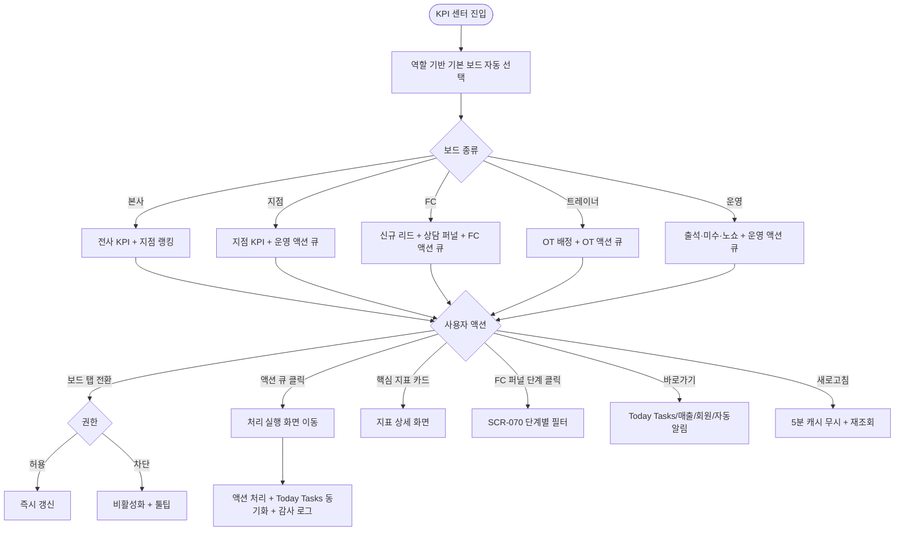
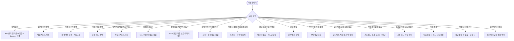

# SCR-095 KPI 프리뷰 보드 (KPI 센터) 페이지

## 1. 화면 메타 정보

이 문서는 KPI 프리뷰 보드(KPI 센터) 페이지에 대한 자기완결형 요구사항 정의서입니다. 다른 문서를 함께 보지 않아도 이 한 장만으로 이 화면에 들어가는 모든 영역, 모든 보드 탭, 모든 액션 큐, 모든 권한, 모든 예외 처리, 그리고 이 화면을 지탱하는 운영 정책까지 전부 이해하고 구현할 수 있도록 작성합니다.

| 항목 | 값 |
|---|---|
| 작성일 | 2026-05-22 |
| 버전 | v1.0 |
| 상태 | 최신 통합본 반영 (정합화 완료) |
| 도메인 | D10 본사관리 |
| 화면 ID | SCR-095 |
| 화면명 | KPI 센터 (역할별 5보드 + 액션 큐) |
| 화면 유형 | 역할별 보드 (Role-based Hub) |
| 라우트 (URL) | `/kpi-preview` |
| 플랫폼 | 데스크톱(기본), 태블릿 |
| 우선순위 | P0 (출시 필수) |
| 기능코드 | HQ-03 |
| 계약코드 | HQ-03 |
| 계약 상태 | 계약 범위 본기능 |
| 부모 기능 prefix | HQ |
| Lv1 코드 | HQ-03 |
| Lv2 / Lv3 세분화 | HQ-03-01 ~ HQ-03-10 (보드 탭, 핵심 지표, FC 상담 퍼널, 액션 큐, 랭킹/리스트, 재등록 파이프라인, 담당자 성과, 트레이너 OT 보드, 데이터 인사이트, 바로가기) |
| 연계 화면 | SCR-094 KPI대시보드, SCR-098 Today Tasks, SCR-S001 매출, SCR-070 리드, SCR-097 감사로그 |
| 호출 다이얼로그 | 없음 (액션 큐는 다른 화면으로 이동) |

## 2. 화면 개요와 목적

KPI 센터는 역할별로 맞춤화된 KPI 보드를 제공하는 종합 센터 화면입니다. 본사·지점·FC·트레이너·운영 5가지 관점에서 핵심 지표, 우선 업무 큐, 성과 랭킹, 단계별 퍼널, 데이터 인사이트를 한 화면에서 확인하고 바로 실행 화면으로 이동할 수 있는 운영 지휘 도구입니다. 단순 조회가 아니라 즉시 액션이 가능한 운영 도구로 설계되었습니다.

이 화면이 다루는 운영 흐름은 매우 다양합니다. 본사 슈퍼관리자가 월요일 오전에 KPI 센터에 진입해 5개 보드를 자유롭게 전환하면서 지점별 FC 퍼널과 트레이너 OT 전환율을 비교하고, 미달 지점을 즉시 드릴다운합니다. Owner(지점장)은 매일 오전 9시에 자동으로 지점 보드가 선택된 상태로 진입해 핵심 4종 카드와 액션 큐를 보면서 오늘 처리 우선순위를 결정합니다. FC는 FC 보드에 진입해 TI/WI 분리 퍼널을 보면서 미방문·미등록 액션 큐를 처리하고 SCR-070 리드 관리로 이동해 콜을 진행합니다. 트레이너는 트레이너 보드에서 오늘 OT 1차 예정·2차 예정 목록과 OT 배정·전환율·완료 현황을 보면서 미등록 체험자에게 후속 상담을 제안합니다. 스태프는 운영 보드에서 출석·미수금·노쇼 현황을 점검하고 당일 처리 액션을 수행합니다. 본사 슈퍼관리자가 FC 상담→등록 전환율 이상을 감지하면 FC 보드 퍼널에서 4단계 전환율을 비교해 특정 단계 이탈을 식별하고 콜 스크립트·방문 유도 스크립트 개선을 지시합니다. 역할 변경(권한 수정) 후 KPI 센터 재진입 시 보드가 즉시 갱신됩니다.

따라서 이 화면은 단순한 KPI 보드가 아니라, 역할에 맞춰 즉시 액션 가능한 운영 지휘 도구로 동작해야 합니다.

## 3. 진입 경로와 인접 화면

KPI 센터에 진입하는 경로는 다음과 같습니다.

첫 번째 경로는 사이드바입니다. 본사관리 메뉴 아래 "KPI 센터" 항목을 클릭하면 진입합니다.

두 번째 경로는 본사 대시보드(SCR-090) 또는 슈퍼 대시보드(SCR-091)의 액션 큐 또는 위기 지점 식별 후 바로가기로 진입하는 경우입니다.

세 번째 경로는 KPI 대시보드(SCR-094)에서 TI 방문 전환율 0% 강조 카드를 클릭하면 FC 보드로 자동 이동하는 경우입니다.

네 번째 경로는 SCR-098 Today Tasks의 KPI 액션 큐 항목 클릭 시 해당 보드로 진입하는 경우입니다.

다섯 번째 경로는 알림 센터의 "TI 방문 전환율 이상", "재등록 성공률 하락" 같은 위기 알림 클릭입니다.

이 화면에서 빠져나가는 인접 화면은 매우 다양합니다. 액션 큐의 항목 클릭은 해당 처리 실행 화면(SCR-070 리드 관리, 회원 상세, OT 진행 화면 등)으로 이동하고, 바로가기 영역은 Today Tasks(SCR-098)·매출(SCR-S001)·회원(SCR-M001)·자동알림 화면으로 즉시 이동합니다. KPI 대시보드(SCR-094)로 진입해 정밀 분석을 이어갈 수도 있습니다.

## 4. 레이아웃과 UI 구성

KPI 센터는 위에서 아래로 흐르는 세로형 레이아웃이며, 상단에 보드 탭이 가로로 배치되고 그 아래에 선택된 보드의 영역들이 펼쳐집니다. 화면은 위에서부터 다음과 같이 구성됩니다.

가장 위에는 페이지 헤더가 있습니다. 헤더 좌측에는 "KPI 센터" 페이지 타이틀이 표시됩니다. 헤더 우측에는 보드 freeze 토글(슈퍼관리자만)과 새로고침 버튼이 배치됩니다.

페이지 헤더 바로 아래에는 역할별 보드 탭 5개(본사 / 지점 / FC / 트레이너 / 운영)가 가로로 배치됩니다. 로그인 계정의 역할에 맞는 보드가 기본 선택되며, 권한이 있으면 다른 보드도 전환할 수 있습니다.

보드 탭 아래에는 선택된 보드의 영역들이 순서대로 쌓입니다.

핵심 지표 카드 4개 영역에는 보드별로 다른 핵심 지표가 표시됩니다. FC 보드는 신규 리드·TI 방문 전환율·WI 등록률·TI 등록률 4종, 지점/FC 보드는 재등록 상담 완료·재등록 성공률을 보조로 추가, 트레이너 보드는 OT 배정 합계·OT 등록 전환율·OT 체험→등록률·OT 1·2차 완료·예정 현황, 본사/지점 보드는 매출·신규·유지율·출석률 같은 거시 지표가 표시됩니다. 각 카드에는 현재값·기준 기간·목표 대비 상태 또는 전월 대비 증감이 함께 표시됩니다.

FC 보드 전용 영역에는 FC 상담 퍼널이 추가됩니다. 4단계(리드 유입 → 첫 응답 → 대면 상담/방문 → 등록 완료)가 각 단계별 인원수와 전환율로 시각화되며, 단계별 전환율은 직전 단계 인원 대비 비율(누적 대비 아님)로 산출됩니다. TI 방문 전환율과 WI/TI 등록률이 별도 카드로 분리됩니다.

액션 큐 영역은 모든 보드에 공통으로 표시됩니다. 오늘 처리해야 할 우선순위 업무가 4단계(긴급/우선/일반/완료가능)로 구분되어 표시됩니다. FC 보드는 전화 문의 후 미방문·방문 후 미등록·상담 결과 미기입·만료 예정 재등록 4종 액션을 우선 노출하고, 트레이너 보드는 OT 1차 예정·OT 2차 예정·OT 완료 후 미등록·체험 후 미등록 4종 액션을 노출합니다. 본사·지점 보드는 미수금·노쇼·홀딩 같은 운영 액션을 노출합니다.

랭킹/리스트 패널 영역은 보드에 따라 다르게 동작합니다. 본사·지점 보드는 지점 또는 팀 성과 랭킹(달성률 높은 순), FC·트레이너 보드는 오늘 처리 리스트(체험 후 미등록·만료 예정·장기 미방문·상담 예약·OT 1차/2차 예정·OT 완료 후 미등록 등 처리 건수 많은 순)가 표시됩니다.

재등록 파이프라인 영역(지점·FC 보드)에는 재등록 상담 완료 건수, 재등록 성공률, 만료 예정 재등록 상담 액션이 표시됩니다.

담당자 성과(개인 KPI) 패널 영역에는 역할에 맞는 비교 지표가 표시됩니다. 트레이너 보드는 OT 배정·신규 매출·재등록 매출·등록 전환율·체험→등록률을 같은 행에서 비교하고, FC 보드는 상담 건수·상담→등록 전환율을 비교하며, 골프 프로 KPI는 등록강사별 골프 매출이 별도 카드로 표시됩니다. 지점 평균과 개인 값이 함께 표시되어 과부하·공백·전환율 저하 담당자를 빠르게 식별할 수 있습니다.

트레이너 OT 보드 영역에는 OT 등록 전환율·OT 체험→등록률·트레이너별 OT 1/2차 완료·예정 위젯이 표시되고, 거절 건은 거부+보류를 함께 집계했다는 설명이 위젯에 명시됩니다.

데이터 인사이트 영역에는 현재 지표의 원인과 다음 액션이 3개 이내의 짧은 코멘트로 제공됩니다. 데이터가 없으면 샘플 문구 대신 "실데이터 연동 필요" 안내가 표시됩니다.

바로가기 영역(모든 보드 공통)에는 Today Tasks·매출·회원·자동알림 화면으로 즉시 이동하는 링크가 배치됩니다.

페이지 가장 아래에는 데이터 기준 시각이 작게 표시됩니다.

## 5. 탭 구성과 탭별 동작

이 화면은 5개의 역할별 보드 탭을 가집니다.

본사 보드는 본사 슈퍼관리자가 전사 KPI를 점검하는 보드이며, 전 지점 통합 매출·회원·유지율·출석률을 핵심 지표로 표시합니다. 지점별 랭킹과 위기 지점 식별 액션 큐가 함께 노출됩니다.

지점 보드는 Owner(지점장)이 자기 지점을 점검하는 보드이며, 지점 매출·회원·출석·재등록 같은 운영 지표를 핵심 지표로 표시합니다. 미수금·노쇼·홀딩 같은 액션 큐가 노출됩니다.

FC 보드는 FC(상담 담당)가 본인 또는 지점 리드 처리 현황을 점검하는 보드이며, 신규 리드·TI 방문 전환율·WI 등록률·TI 등록률 4종을 핵심 지표로 합니다. FC 상담 퍼널 4단계가 추가되고 전화 문의 후 미방문·방문 후 미등록 같은 액션 큐가 노출됩니다.

트레이너 보드는 트레이너가 본인 OT 배정과 회원 케어 현황을 점검하는 보드이며, OT 배정 합계·등록 전환율·체험→등록률·1·2차 완료·예정을 핵심 지표로 합니다. 오늘 OT 1차 예정·2차 예정·OT 완료 후 미등록 액션 큐가 노출됩니다.

운영 보드는 스태프·매니저가 현장 운영을 점검하는 보드이며, 출석·미수금·노쇼·홀딩 같은 운영 지표를 핵심 지표로 합니다.

로그인 계정의 역할(role) 기반으로 기본 보드가 자동 선택되며, 권한이 있으면 다른 보드로 수동 전환할 수 있습니다. 본사 슈퍼관리자는 5개 보드 모두 전환 가능, owner는 지점/FC/운영 보드까지, FC는 FC 보드만, 트레이너는 트레이너 보드만, 스태프는 운영 보드만 진입 가능합니다.

본사 슈퍼관리자가 보드 freeze 토글을 활성화하면 보드 레이아웃이 잠기고 다른 사용자는 탭 전환 시 freeze 해제 확인 모달이 표시됩니다.

## 6. 버튼·아이콘·링크 액션 전체 정의

이 화면에 등장하는 모든 클릭 가능한 요소를 빠짐없이 정의합니다.

페이지 헤더의 보드 freeze 토글(슈퍼관리자만)은 보드 레이아웃을 잠그며, 활성화된 freeze는 다른 사용자에게 안내됩니다.

페이지 헤더의 새로고침 버튼은 5분 캐시를 무시하고 즉시 재조회합니다.

보드 탭(본사/지점/FC/트레이너/운영) 클릭은 즉시 보드를 전환합니다. 권한 없는 보드 탭은 비활성화되고 호버 시 "접근 권한 없음" 툴팁이 표시됩니다. freeze 상태에서는 해제 확인 모달이 표시됩니다.

핵심 지표 카드 4개는 호버 시 약간의 그림자가 들어가고, 클릭하면 해당 지표의 상세 화면으로 진입합니다. FC 보드의 TI 방문 전환율 카드는 SCR-070 리드 관리의 TI 채널 필터로, 트레이너 보드의 OT 배정 카드는 OT 관리 화면으로 진입합니다.

FC 상담 퍼널의 단계별 막대 클릭은 해당 단계 회원군의 SCR-070으로 진입하면서 단계별 필터가 자동 적용됩니다.

액션 큐의 항목 클릭은 해당 처리 실행 화면으로 진입합니다. FC 보드의 전화 문의 후 미방문 항목은 SCR-070의 해당 리드 목록으로, 트레이너 보드의 OT 1차 예정 항목은 OT 진행 화면 또는 회원 상세로, 본사·지점 보드의 미수금 항목은 SCR-S009 미수금 관리로 이동합니다. 액션 큐의 완료 처리는 Today Tasks(SCR-098)와 양방향 동기화됩니다.

랭킹/리스트 패널의 행 클릭은 해당 항목의 상세 화면으로 진입합니다. 본사 보드의 지점 랭킹 행은 SCR-093 지점 리포트로, 트레이너 보드의 OT 1차 예정 행은 회원 상세로 이동합니다.

재등록 파이프라인의 상담 완료 건수 또는 성공률 카드 클릭은 재등록 상담 목록으로 진입합니다.

담당자 성과 패널의 트레이너/FC/골프 프로 항목 클릭은 해당 담당자의 상세 KPI 화면으로 진입합니다.

데이터 인사이트의 다음 액션 버튼은 그 액션을 실행할 수 있는 화면으로 이동시킵니다.

바로가기 영역의 Today Tasks·매출·회원·자동알림 링크는 각각 SCR-098·SCR-S001·SCR-M001·자동알림 화면으로 즉시 이동합니다.

데이터 인사이트에서 "실데이터 연동 필요" 안내가 표시되면 클릭으로 연동 가이드 또는 본사 관리자 안내가 펼쳐집니다.

권한 변경 후 KPI 센터 재진입 시 보드가 자동 갱신되어 변경된 역할로 동작합니다.

모든 버튼은 클릭 후 응답이 돌아오기 전까지 자동으로 비활성화되며, 보드 전환 중에는 영역별 스켈레톤이 표시됩니다.

## 7. 호출되는 모달 동작

KPI 센터 화면에서는 별도의 다이얼로그가 호출되지 않습니다. 모든 액션은 화면 이동 또는 인라인 동작으로 처리됩니다.

보드 freeze 해제 확인 모달은 슈퍼관리자가 freeze를 설정한 상태에서 다른 사용자가 탭을 전환하려고 할 때 표시됩니다. 모달은 "보드 레이아웃이 잠겨 있습니다. 탭을 전환하시겠습니까?" 안내와 확인/취소 버튼으로 구성됩니다.

액션 큐 완료 처리는 별도 모달 없이 인라인 체크박스로 처리되며, Today Tasks(SCR-098)와 양방향으로 즉시 동기화됩니다.

데이터 인사이트의 다음 액션은 별도 다이얼로그 없이 해당 실행 화면으로 즉시 이동합니다.

## 8. 토스트와 확인 팝업과 알럿

KPI 센터에서 발생하는 알림성 UI는 다음과 같습니다.

성공 토스트는 "보드를 전환했어요", "액션을 완료했어요", "데이터를 새로고침했어요" 같은 결과 문구를 표시합니다.

실패 토스트는 "보드 데이터를 불러올 수 없어요", "권한이 없는 보드입니다", "처리에 실패했어요" 같은 문구와 보조 액션 버튼을 표시합니다.

확인 팝업은 보드 freeze 해제 확인 모달이 유일합니다.

알럿은 권한 없는 사용자가 직접 URL로 접근했을 때이며, 안내 후 본인 역할에 맞는 보드로 자동 이동됩니다.

액션 큐 0건일 때는 "오늘 처리할 액션이 없습니다. 모두 완료!" 안내가 표시되어 작업 완료감을 줍니다.

실데이터 미연동 카드에는 "실데이터 연동 필요" 안내가 표시되고 이는 오류가 아닌 정상 상태로 처리됩니다.

전환율 계산 분모 0(예: FC 상담 건수 0건) 시 "N/A" 표시와 "상담 데이터 없음" 툴팁이 함께 표시됩니다.

골프 프로 매출 매핑 누락(등록강사 K열 비어있음) 시 "미배정" 표시와 어드민 알림이 자동 발송됩니다.

## 9. 데이터 흐름과 외부 연동

이 화면은 KPI 대시보드(SCR-094)와 같은 데이터 소스를 사용하며 5분 캐시 레이어를 공유합니다.

화면 진입 시점에 역할 기반으로 기본 보드가 자동 선택되고, 해당 보드의 API가 호출됩니다. 응답에는 핵심 지표 4종, 상담 퍼널, 액션 큐, 랭킹/리스트, 재등록 파이프라인, 담당자 성과, 데이터 인사이트가 보드에 맞게 포함됩니다.

상담 채널 원천은 `[신규DB]` C열이며 `WI=방문`, `TI=전화문의`, `체험`, `일일입장`으로 해석됩니다. 상담 방식은 `대면`/`유선`/`부재` 3종으로 제한됩니다. TI 방문 전환은 TI 문의 중 1·2·3차 상담 방식에 `대면`이 기록된 건입니다.

트레이너 OT 등록 전환율은 `등록 / OT 진행`으로 산출되며 PT 완료율과 합산되지 않습니다. OT 이월률은 `이월 건수 / OT배정 인원 × 100`입니다.

트레이너별 OT 배정은 `[강습업무보고]` 주간보고 E열 `O.T 배정` 기준이고, 트레이너별 신규/재등록 매출은 `[매출종합]` 거래 단위가 공식 원천이며 `[강습업무보고]` J·K열은 검산 보조입니다.

FC별 상담 건수는 `[신규DB]` K열 담당자별 전체 상담 건수(등록+관리+실패 포함)이고, 상담→등록 전환율은 `A열 등록 ÷ A열 등록+관리+실패`입니다.

골프 프로 매출은 `[매출종합]` 골프매출 K열 등록강사 + F열 결제금액 기준입니다.

재등록 상담 완료 건수는 `[재등록DB]` B열 상담결과가 입력된 건수이고, 재등록 성공률은 등록 ÷ (등록+확정+예상+관리+실패)입니다.

데이터 캐시는 5분 TTL이며 HQ-02 KPI 대시보드와 같은 캐시 레이어를 공유합니다.

매시간 정각 배치로 활성 회원·매출·출석이 갱신되고 일별 03:00 배치로 전월 대비 증감이 갱신됩니다.

액션 큐 자동 생성 배치는 매일 06:00에 만료 예정·미수·노쇼·재등록 대상을 자동 큐로 생성하며, HQ-06 Today Tasks와 연동됩니다.

액션 큐와 Today Tasks 양방향 동기화는 큐 항목 완료 처리 이벤트가 발생하면 즉시 동기화되며 KPI에 반영됩니다.

인사이트 코멘트 자동 생성은 전환율 임계값 하락 감지 시 트리거되어 원인 분석 + 다음 액션 3개 자동 생성이 일어납니다.

트레이너 OT 당일 필터는 매일 00:00 날짜 변경 시 오늘 날짜 기준 OT 1·2차 목록이 자동 갱신됩니다.

랭킹 패널 자동 갱신은 일별 배치 완료 후 성과 랭킹이 재계산되고 캐시가 무효화됩니다.

KPI 센터 보드 전환·액션 큐 처리는 감사 로그(SCR-097)에 사용자·보드명·액션·timestamp로 자동 기록됩니다.

화면에서 호출하는 주요 API 엔드포인트는 다음과 같습니다. 보드 데이터 `GET /api/kpi-center/board?role=fc|trainer|manager|hq`, 액션 큐 `GET /api/kpi-center/action-queue`, 랭킹 `GET /api/kpi-center/ranking`, 개인 KPI `GET /api/kpi-center/personal-kpi`.

## 10. 화면 상태와 예외 처리

KPI 센터는 다음 상태들을 가질 수 있습니다.

로딩 중 상태에서는 영역별 스켈레톤이 표시됩니다.

정상 상태는 가장 일반적인 상태로, 핵심 지표·퍼널·액션 큐·랭킹·인사이트가 모두 채워집니다.

보드 전환 상태는 사용자가 다른 탭을 클릭한 직후이며, 카드/큐/퍼널/인사이트가 새 보드 데이터로 갱신됩니다.

실데이터 미연동 상태는 일부 또는 전체 카드의 실데이터가 연동되지 않은 상태이며, 샘플 데이터 대신 "실데이터 연동 필요" 안내가 표시됩니다.

액션 없음 상태는 처리할 액션 큐가 0건일 때이며, "처리할 액션이 없습니다. 모두 완료!" 메시지가 표시됩니다.

권한 외 탭 접근 상태는 사용자가 권한 없는 보드 탭을 클릭한 경우이며, 탭이 비활성화되고 접근 권한 없음 툴팁이 표시됩니다.

freeze 상태는 슈퍼관리자가 보드 레이아웃을 잠근 경우이며, 다른 사용자의 탭 전환 시 해제 확인 모달이 표시됩니다.

오류 상태는 API 실패 시이며, 영역별 재시도 버튼이 표시됩니다.

전환율 분모 0 상태는 FC 상담 건수 0건 같은 경우이며, "N/A" 표시와 데이터 없음 툴팁이 표시됩니다.

데이터 기준 시각 안내 상태는 배치가 완료된 후의 일반 상태이며, 화면 하단에 작게 표시됩니다.

예외 케이스별 처리는 다음과 같습니다.

로그인 역할과 보드 탭 불일치 시 로그인 역할 기반으로 기본 보드가 자동 선택되고 이전 선택은 무시됩니다.

역할 변경 후 보드 자동 갱신은 다음 KPI 센터 진입 시 변경된 역할에 맞는 보드로 자동 선택됩니다.

액션 큐 0건은 "오늘 처리할 액션이 없습니다. 모두 완료!" 안내로 처리됩니다.

실데이터 미연동 지표는 "실데이터 연동 필요" 안내 + 연동 가이드 링크로 처리됩니다.

스태프가 FC 보드 탭 클릭 시 탭 비활성화 + "접근 권한 없음" 툴팁으로 차단됩니다.

OT 이월률 분모 검증 필요 시 표준 산식으로 표시되고 원천 리포트와 상이하면 보조 지표 검토 안내가 됩니다.

골프 프로 매출 매핑 누락 시 "미배정" 표시 + 어드민 알림이 자동 발송됩니다.

액션 큐 항목 클릭 시 대상 화면이 404이면 "해당 화면을 찾을 수 없습니다" 토스트와 큐 유지로 처리됩니다.

보드 레이아웃 freeze 상태에서 탭 전환 시도는 freeze 해제 확인 모달로 안내됩니다.

인사이트 코멘트 생성 실패 시 "인사이트를 불러올 수 없습니다" + 재시도 버튼이 제공됩니다.

전환율 계산 분모 0은 "N/A" 표시와 "상담 데이터 없음" 툴팁으로 처리됩니다.

보드 API 전체 실패 시 "KPI 센터를 불러올 수 없습니다" 안내가 표시되고 Sentry 에러와 온콜 알림이 자동 발송됩니다.

특정 보드 탭 데이터 실패 시 해당 탭에 "조회 실패" + 재시도 버튼이 표시되며 다른 탭은 정상 동작합니다.

액션 큐 API 실패 시 큐 영역만 오류 표시되고 다른 영역은 정상 렌더됩니다.

역할 기반 보드 매핑 실패 시 기본 "운영" 보드 폴백 표시로 처리됩니다.

인사이트 생성 API 타임아웃(10초) 시 "인사이트를 생성하는 중입니다. 잠시 후 확인해 주세요" 안내가 표시되고 비동기 재시도가 1회 일어납니다.

권한 없는 보드 탭 직접 URL 접근 시 403 + 본인 역할 보드로 리다이렉트됩니다.

트레이너 OT 배정 원천 데이터 누락 시 OT 카드에 "-" 표시 + "원천 데이터 없음" 툴팁이 표시됩니다.

액션 큐 완료 처리 중 네트워크 오류 시 토스트 + 낙관적 업데이트 롤백이 일어납니다.

골프 프로 매출 원천 K열 미연동 시 골프 프로 성과 카드에 "데이터 없음" 표시와 어드민 슬랙 알림이 발송됩니다.

랭킹 패널 동점 처리는 알파벳(이름) 순 정렬로 처리됩니다.

데이터 인사이트 원인 모델 응답 없음 시 "현재 인사이트를 제공할 수 없습니다" 안내와 빈 상태 UI가 표시됩니다.

바로가기 대상 화면 권한 없음 시 "해당 기능에 접근할 수 없습니다" 토스트와 이동 차단이 일어납니다.

## 11. 권한별 처리

이 화면은 권한에 따라 진입 가능한 보드와 가능한 액션이 달라집니다.

superAdmin와 primary는 5개 보드 모두 전환 가능합니다. 모든 탭을 자유롭게 전환하면서 본사·지점·FC·트레이너·운영 모든 관점에서 KPI를 점검할 수 있고, 전 지점 지표 확인이 가능합니다.

Owner(지점장)과 지점 관리자는 지점/FC/운영 보드까지 전환 가능합니다. 본사 보드와 트레이너 보드는 권한이 없으므로 탭이 비활성화됩니다(또는 정책에 따라 숨김). 자기 지점 중심 데이터가 표시됩니다.

FC(fc)는 FC 보드만 진입 가능합니다. 본사·지점·트레이너·운영 보드는 비활성화되고, FC 보드에서는 담당 리드와 상담 액션 큐가 우선 노출됩니다.

트레이너(trainer)는 트레이너 보드만 진입 가능합니다. 다른 보드는 비활성화되고, 담당 수업/회원의 OT 배정과 KPI가 노출됩니다.

스태프(staff)는 운영 보드만 진입 가능합니다. 다른 보드는 비활성화되고, 출석·미수·운영 액션이 노출됩니다.

읽기 전용(readonly)은 보드 조회만 가능하며 액션 큐 완료 처리·바로가기 진입 같은 액션이 차단됩니다.

권한 없는 보드 탭 직접 URL 접근(예: 스태프가 `/kpi-preview?board=fc` 시도)은 403으로 거부되고 본인 역할 보드로 자동 리다이렉트됩니다.

KPI 센터 보드 전환·액션 큐 처리는 감사 로그에 자동 기록되어 운영 행위가 추적됩니다.

권한이 부족해서 액션이 차단된 경우의 사용자 경험은 일관됩니다. 탭이 비활성화되거나 숨겨지고, 직접 URL 접근 시 자동 리다이렉트되며, 모든 우회 시도가 감사 로그에 기록됩니다.

## 12. 메인 흐름

KPI 센터의 핵심 동작 흐름입니다.

## 13. 에러와 예외 흐름

## 14. 핵심 디자인 요청사항

이 화면이 역할별 운영자에게 잘 작동하려면 다음 디자인 원칙이 시각적으로 명확해야 합니다.

5개 보드 탭은 상단에 가로로 배치되어 한눈에 모든 보드를 인지할 수 있어야 합니다. 권한 없는 탭은 흐림(opacity 50%)으로 처리되어 비활성 상태가 즉시 인식됩니다.

핵심 지표 카드 4개는 보드별로 다른 강조 색상이 적용되어 보드 성격을 시각적으로 구분합니다. FC 보드는 파랑, 트레이너 보드는 보라, 본사·지점 보드는 초록, 운영 보드는 회색 톤이 좋습니다.

FC 상담 퍼널은 깔때기(funnel) 형태로 시각화되어 단계별 인원 감소가 직관적으로 보여야 합니다. 각 단계 사이에 전환율(%)이 명확히 표시됩니다.

액션 큐는 4단계(긴급/우선/일반/완료가능)로 색상 코딩되어 빨강(긴급)·주황(우선)·파랑(일반)·회색(완료가능) 톤이 일관되게 적용됩니다. 항목 행은 클릭 가능 단서로 호버 효과를 가집니다.

랭킹/리스트 패널은 순위가 명확히 표시되고 상위 1~3위에는 메달 또는 강조 아이콘이 추가될 수 있습니다.

담당자 성과 패널은 지점 평균과 개인 값을 나란히 비교하는 막대 차트 또는 듀얼 게이지 형태로 시각화됩니다.

데이터 인사이트의 코멘트는 카드 형태로 부드러운 톤에 표시되며, 다음 액션 버튼은 primary 컬러로 강조됩니다.

"실데이터 연동 필요" 안내는 점선 테두리 + 회색 톤으로 표시되어 정상 데이터 카드와 시각적으로 구분됩니다.

바로가기 영역은 화면 하단 또는 사이드에 고정되어 어디서든 빠르게 진입할 수 있어야 합니다.

진행 스피너와 로딩 스켈레톤은 본사 대시보드와 동일한 톤으로 통일됩니다.

freeze 상태 표시는 작은 자물쇠 아이콘이 탭 영역 옆에 표시되어 잠금 상태를 즉시 인지할 수 있어야 합니다.

## 15. 운영 정책 (이 화면에 연결된 부분)

KPI 센터는 역할별 운영 도구이므로, 운영 정책을 풀어 적습니다.

WI(Walk In) = 방문 문의, TI(Telephone Inquiry) = 전화 문의로 화면 표기가 통일됩니다. 상담 방식은 `대면`/`유선`/`부재` 3종으로 제한되며, TI 방문 전환은 TI 문의 중 1·2·3차 상담 방식에 `대면`이 기록된 건입니다.

트레이너 OT 등록 전환율은 PT 완료율과 합산되지 않습니다(별도 운영 KPI). OT 이월률은 `이월 건수 / OT배정 인원 × 100`입니다.

트레이너별 OT 배정은 `[강습업무보고]` E열 기준이며 OT 배정 편중과 공백 확인용 업무 부하 지표입니다.

트레이너별 신규/재등록 매출은 `[매출종합]` 거래 단위가 공식 원천이고 `[강습업무보고]` J·K열은 검산 보조입니다.

FC별 상담 → 등록 전환율은 `A열 등록 ÷ A열 등록+관리+실패`입니다.

골프 프로 매출은 `[매출종합]` 골프매출 K열 등록강사 + F열 결제금액 기준이며, 강습 트레이너 KPI와 별도 섹션으로 표시됩니다.

환불 → 재결제 복귀율은 본 화면에 추가되지 않습니다.

보드 탭 기본 선택은 로그인 계정의 역할(role) 필드 기반이며 세션 동안 수동 전환이 가능합니다. 본사 슈퍼관리자만 보드 freeze를 설정할 수 있으며 freeze 중 탭 전환은 해제 확인이 필요합니다.

데이터 인사이트 코멘트는 원인 + 다음 액션 최대 3개로 제한됩니다.

실데이터 미연동 카드는 "연동 필요" 상태로 표시되며 기능 오류로 처리하지 않습니다.

액션 큐 우선순위 4단계: 긴급(빨강) > 우선(주황) > 일반(파랑) > 완료가능(회색). 액션 큐 완료 처리는 Today Tasks(HQ-06)와 양방향 동기화됩니다.

FC 상담 퍼널 4단계: 리드 유입 → 첫 응답 → 대면 상담/방문 → 등록 완료. 단계별 전환율은 직전 단계 인원 대비 비율(누적 대비 아님)로 산출됩니다.

역할 변경(권한 수정) 후 KPI 센터 재진입 시 보드가 즉시 갱신됩니다.

바로가기 링크(Today Tasks/매출/회원/자동알림)는 모든 보드에서 공통 표시됩니다.

KPI 센터 보드 데이터는 5분 캐시(HQ-02 대시보드와 동일 캐시 레이어 공유)입니다.

트레이너 보드의 OT 1·2차 완료·예정 위젯은 오늘 날짜 기준으로 자동 필터됩니다.

랭킹 패널 정렬 기준은 본사·지점은 달성률 높은 순, FC·트레이너는 처리 건수 많은 순입니다.

만료일별 대상자 분포(D-7/D-14/D-30) 위젯은 추가하지 않고, 액션 큐에서는 "만료 예정 재등록 상담" 단일 업무로 표시합니다(만료 알림 운영 정책에 따라).

본사-지점 권한 분리 정책상 owner는 본사 보드 접근 불가이며, manager 이하는 본사·트레이너 등 일부 보드에 접근할 수 없습니다.

이상의 모든 정책은 이 화면을 구현하고 운영하는 사람이 별도 문서 없이 이 한 장만 보면 이해할 수 있도록 풀어 적었습니다. 정책이 바뀌면 이 문서가 함께 갱신되어야 하며, 코드 변경과 정책 변경은 항상 짝지어 진행됩니다.
