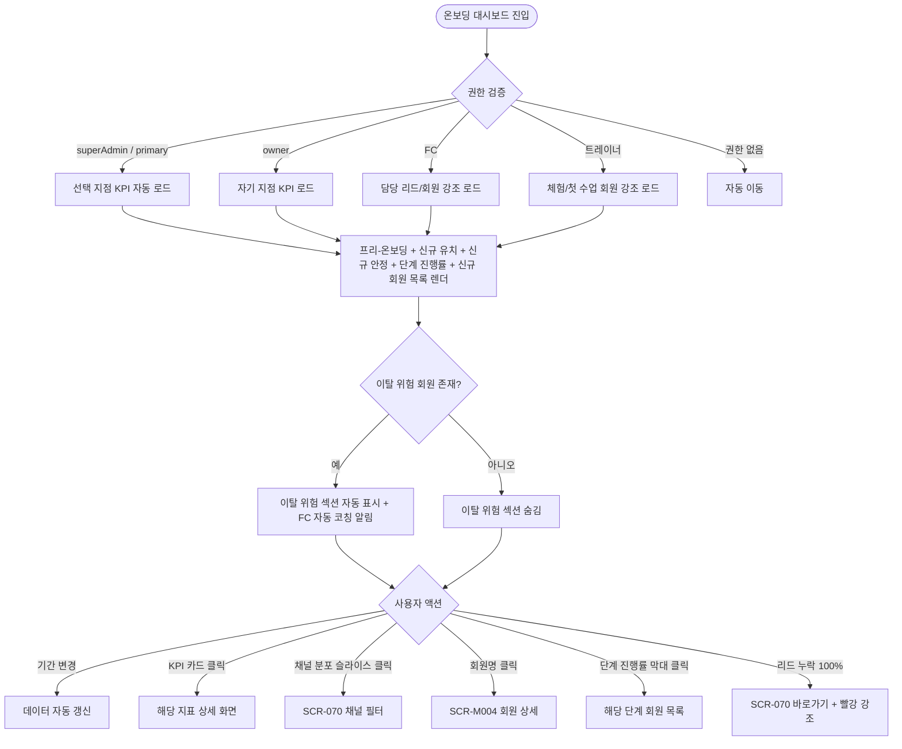
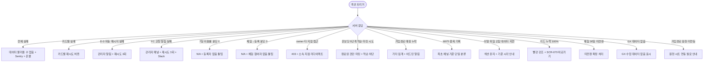

# SCR-096 온보딩 대시보드 페이지

## 1. 화면 메타 정보

이 문서는 온보딩 대시보드 페이지에 대한 자기완결형 요구사항 정의서입니다. 다른 문서를 함께 보지 않아도 이 한 장만으로 이 화면에 들어가는 모든 영역, 모든 KPI, 모든 자동 알림, 모든 권한, 모든 예외 처리, 그리고 이 화면을 지탱하는 운영 정책까지 전부 이해하고 구현할 수 있도록 작성합니다.

| 항목 | 값 |
|---|---|
| 작성일 | 2026-05-22 |
| 버전 | v1.0 |
| 상태 | 최신 통합본 반영 (정합화 완료) |
| 도메인 | D10 본사관리 |
| 화면 ID | SCR-096 |
| 화면명 | 온보딩 대시보드 (신규 회원 정착 추적) |
| 화면 유형 | 분석 화면 |
| 라우트 (URL) | `/onboarding` |
| 플랫폼 | 데스크톱(기본), 태블릿 |
| 우선순위 | P0 (출시 필수) |
| 기능코드 | HQ-05 |
| 계약코드 | HQ-05 |
| 계약 상태 | 계약 범위 본기능 |
| 부모 기능 prefix | HQ |
| Lv1 코드 | HQ-05 |
| Lv2 / Lv3 세분화 | HQ-05-01 ~ HQ-05-07 (프리-온보딩 KPI, 신규 유치 KPI, 신규 안정 KPI, 상담/가입 경로, 단계 진행률, 신규 회원 목록, 이탈 위험 섹션) |
| 연계 화면 | SCR-094 KPI대시보드, SCR-095 KPI프리뷰보드, SCR-070 리드관리, SCR-M001 회원목록, SCR-M004 회원상세 |
| 호출 다이얼로그 | 없음 (조회 중심) |

## 2. 화면 개요와 목적

온보딩 대시보드는 신규 회원의 초기 정착 과정을 단계별로 추적하는 화면입니다. 리드 유입부터 등록, 초기 출석 정착까지의 퍼널과 이탈 위험 회원을 조기에 파악하여 적절한 후속 조치를 취할 수 있도록 지원합니다. "신규 회원의 7일/30일 정착이 장기 유지율을 결정한다"는 운영 통찰을 반영한 화면이며, 신규 등록 이후 90일 안에 일어나는 모든 정착 신호가 이 화면에 모입니다.

이 화면이 다루는 운영 흐름은 매우 다양합니다. 본사 슈퍼관리자가 월초 신규 유치 현황을 점검할 때는 전체 지점 신규 리드·전환율을 비교하면서 전환율이 낮은 지점에 개선을 지시합니다. Owner(지점장)이 매일 오전에 신규 안정 KPI에서 7일 이용률·30일 활동률을 확인하면, 이탈 위험 섹션이 자동으로 표시되어 FC 코칭 알림이 발송됩니다. FC가 오전 업무를 시작할 때는 프리-온보딩 KPI에서 미연락 리드 목록을 식별해 SCR-070 리드 관리로 이동해 처리합니다. 트레이너는 주간 체험 후속 점검에서 체험 → 등록 전환율을 확인하고 미등록 체험자에게 후속 상담을 제안합니다. 본사 슈퍼관리자가 가입 경로 채널 ROI를 분석할 때는 WI 상세 9종과 TI 상세 9종 분포를 비교해 비효율 채널의 광고 예산을 축소합니다. 등록 후 3일 미출석 회원(D-3)에게는 자동 문자가 발송되고, 본사 superAdmin은 D-3 자동 메시지 발송 내역을 확인합니다. 이탈 위험 회원이 감지되면 담당 FC에게 자동 코칭 알림이 발송되어 24시간 이내 케어 액션이 일어납니다.

따라서 이 화면은 단순한 신규 회원 통계가 아니라, 7일/30일 정착의 결정적 시점에 본사·지점·FC·트레이너가 함께 움직이는 운영 도구로 동작해야 합니다.

## 3. 진입 경로와 인접 화면

온보딩 대시보드에 진입하는 경로는 다음과 같습니다.

첫 번째 경로는 사이드바입니다. 본사관리 메뉴 아래 "온보딩 대시보드" 항목을 클릭하면 진입합니다.

두 번째 경로는 슈퍼 대시보드(SCR-091)의 "이번 달 신규 회원" KPI 카드 클릭입니다. 해당 카드에서 이 화면으로 진입하면 당월 신규 회원이 자동 필터된 상태로 시작합니다.

세 번째 경로는 본사 대시보드(SCR-090)의 신규 회원 관련 위젯에서 [전체보기] 링크 클릭입니다.

네 번째 경로는 KPI 대시보드(SCR-094)의 신규 회원 카드 또는 만료 예정 카드 클릭입니다.

다섯 번째 경로는 KPI 센터(SCR-095) FC 보드의 액션 큐에서 "신규 회원 케어" 항목 클릭입니다.

여섯 번째 경로는 알림 센터의 "이탈 위험 회원 발생" 알림 클릭이며, 이탈 위험 섹션이 자동 강조된 상태로 진입합니다.

이 화면에서 빠져나가는 인접 화면은 SCR-070 리드 관리(미연락 리드 처리), SCR-M001 회원 목록(신규 회원 필터), SCR-M004 회원 상세(이탈 위험 회원 케어), SCR-094 KPI 대시보드(KPI 정밀 분석)입니다.

## 4. 레이아웃과 UI 구성

온보딩 대시보드는 위에서 아래로 흐르는 세로형 레이아웃이며, KPI 영역이 단계별로 그룹화되어 표시됩니다. 화면은 위에서부터 다음과 같이 구성됩니다.

가장 위에는 페이지 헤더가 있습니다. 헤더 좌측에는 "온보딩 대시보드" 페이지 타이틀과 현재 조회 중인 기간(예: `2026년 5월`)이 표시됩니다. 헤더 우측에는 기간 필터(이번 달/지난 달/이번 분기), 지점 선택(슈퍼관리자만), 새로고침 버튼이 배치됩니다.

페이지 헤더 바로 아래에는 프리-온보딩 KPI 섹션이 있습니다. 이 섹션은 "등록 전 리드" 대상 지표이며 6종 카드로 구성됩니다. 이번 달 신규 리드 수, 연락 완료 건수(1차 응답), 방문 완료 건수(대면 상담), 등록 전환 건수(회원 등록), 리드 전환율(등록/리드), WI vs TI 건수(분리 표시)가 카드 형태로 가로 배치됩니다. 리드 누락률이 100%(연락 0건)에 가까우면 카드가 빨강으로 강조되고 SCR-070 리드 관리 바로가기가 노출됩니다.

프리-온보딩 KPI 아래에는 신규 유치 KPI 섹션이 있습니다. 이 섹션은 "등록 직후" 지표이며 4종 카드로 구성됩니다. 이번 달 신규 등록 회원, 리드 누락률(처리 안 된 리드), 회원소개 유입 비중(추천 비율), 가입경로 분포(등록자 기준)가 표시되며, 가입경로 분포는 막대 차트로 시각화됩니다.

신규 유치 KPI 아래에는 신규 안정 KPI 섹션이 있습니다. 이 섹션은 "등록 후 정착" 지표이며 7종 카드로 구성됩니다. 7일 이용률(등록 후 7일 내 2회 이상 출석), 30일 활동률(등록 후 30일 내 4회 이상 출석), PT 체험 참여율, 체험 → 등록 전환율(체험자 중 본상품 등록), 일일입장 → 회원 전환율, GX 첫 참여율, 초기 이탈 회원 수가 카드로 표시됩니다.

신규 안정 KPI 아래에는 상담/가입 경로 분포 섹션이 있습니다. `[주간월간보고]` I10:Q10 등록자 기준 가입 경로 분포가 막대 차트로 표시되고, WI 상세(R10:Z10)와 TI 상세(AA10:AI10)가 각각 9종 채널(간판·블로그·인스타·당근·지역카페·현수막·전단지·회원소개·기타)로 분리 표시됩니다.

상담/가입 경로 아래에는 온보딩 단계 진행률 섹션이 있습니다. 가입 → 초기 상담 → 체성분 측정 → 프로그램 배정 → 첫 수업 완료 5단계가 진행률 막대로 표시되고, 단계별 이탈률이 높은 구간이 강조됩니다. 단계는 순서대로 진행되며 역순 마킹은 불가합니다.

온보딩 단계 진행률 아래에는 신규 회원 목록 테이블이 있습니다. 이번 달 등록한 신규 회원의 등록일, 경과일, 방문 횟수, PT 체험 완료 여부, GX 참여 여부, 온보딩 상태(정상/주의/이탈 위험)가 컬럼으로 표시됩니다. 행 클릭 시 회원 상세(SCR-M004)로 진입합니다.

신규 회원 목록 아래에는 이탈 위험 섹션이 있습니다. 이탈 위험 회원이 1명 이상이면 자동으로 표시되고, 0명이면 섹션 자체가 숨겨집니다. 이탈 위험 회원 목록에는 회원명, 등록일, 마지막 방문일, 위험 점수, 담당 FC가 표시되고, 행 클릭 시 회원 상세로 진입합니다. FC 자동 코칭 알림이 발송된 회원은 별도 배지로 표시됩니다.

페이지 가장 아래에는 데이터 기준 시각(예: "데이터 기준: 2026-05-22 06:00 배치")이 작게 표시됩니다.

Owner(지점장)은 자기 지점 데이터만 보이며 지점 선택 드롭다운은 노출되지 않습니다. FC는 본인 담당 리드와 신규 회원이 우선 강조 표시되고, 트레이너는 체험·첫 수업 관련 회원만 강조됩니다.

## 5. 탭 구성과 탭별 동작

이 화면은 별도의 상위 탭을 가지지 않습니다. 모든 KPI 섹션이 한 화면에 동시에 표시되며 사용자가 위에서 아래로 스크롤하면서 정보를 흡수합니다.

기간 필터(이번 달/지난 달/이번 분기)는 헤더에서 토글로 동작하며, 변경 시 모든 KPI와 차트가 함께 갱신됩니다.

지점 선택은 슈퍼관리자만 노출되고, Owner(지점장)은 자기 지점이 고정됩니다.

이탈 위험 섹션은 회원 0명 시 자동 숨김, 1명 이상 시 자동 표시로 동작합니다.

## 6. 버튼·아이콘·링크 액션 전체 정의

이 화면에 등장하는 모든 클릭 가능한 요소를 빠짐없이 정의합니다.

페이지 헤더의 기간 필터 토글(이번 달/지난 달/이번 분기)은 즉시 데이터를 갱신합니다.

지점 선택 드롭다운(슈퍼관리자만)은 선택 즉시 데이터를 갱신합니다. Owner(지점장)은 자기 지점 고정이며 드롭다운이 보이지 않습니다.

새로고침 버튼은 5분 캐시를 무시하고 즉시 재조회합니다.

프리-온보딩 KPI 카드는 호버 시 약간의 그림자 효과가 들어가고, 클릭하면 해당 지표의 상세 화면으로 진입합니다. 신규 리드 수 카드는 SCR-070 리드 관리(이번 달 필터), 연락 완료 카드는 SCR-070(연락 완료 필터), 방문 완료 카드는 SCR-070(방문 완료 필터), 등록 전환 카드는 SCR-M001 회원 목록(신규 등록 필터), 리드 전환율 카드는 SCR-095 FC 보드의 상담 퍼널, WI/TI 분리 막대 클릭은 SCR-070(채널 필터)으로 이동합니다.

신규 유치 KPI 카드의 리드 누락률 카드는 누락된 리드 목록(SCR-070 미연락 필터)으로 진입합니다. 회원소개 유입 비중 카드는 회원소개 출처 회원 목록으로 진입하고, 가입경로 분포 막대의 슬라이스 클릭은 해당 경로의 회원 목록으로 진입합니다.

신규 안정 KPI 카드는 클릭 시 해당 지표의 신규 회원 목록(예: 7일 이용률 카드는 7일 미달성 회원 목록)으로 진입합니다.

상담/가입 경로 분포 차트의 막대 또는 슬라이스 클릭은 해당 채널의 SCR-070 리드 목록으로 진입합니다.

온보딩 단계 진행률의 단계 막대 클릭은 해당 단계 회원 목록으로 진입합니다.

신규 회원 목록의 회원명 클릭은 SCR-M004 회원 상세로 진입합니다. 행의 온보딩 상태 배지(정상/주의/이탈 위험)는 호버 시 상세 사유 툴팁이 표시됩니다.

이탈 위험 섹션의 회원명 클릭은 SCR-M004 회원 상세로 진입하며, FC 자동 코칭 알림 발송 배지는 호버 시 발송 시각과 알림 내용이 툴팁으로 표시됩니다.

리드 누락률 100% 강조 상태에서 SCR-070 바로가기 버튼은 미연락 리드 처리 화면으로 즉시 이동합니다.

모든 카드와 차트의 호버는 정확한 수치 툴팁을 표시하며, 데이터가 없는 분모 0 상태는 "N/A" 표시와 안내 툴팁이 함께 나옵니다.

모든 버튼은 클릭 후 응답이 돌아오기 전까지 자동으로 비활성화되며, 데이터 로딩 중에는 영역별 스켈레톤이 표시됩니다.

## 7. 호출되는 모달 동작

온보딩 대시보드 화면에서는 별도의 다이얼로그가 호출되지 않습니다. 모든 액션은 화면 이동 또는 인라인 동작으로 처리됩니다.

이탈 위험 자동 코칭 알림 발송은 백엔드 배치가 자동으로 트리거하며, 사용자가 화면에서 직접 발송하는 액션은 없습니다.

D-3 자동 문자 발송도 백엔드 배치(등록일 기준 3일 후 00:00)가 자동으로 처리하며 사용자 액션은 없습니다.

회원 상세 진입, SCR-070 리드 관리 진입 같은 모든 후속 액션은 화면 전환으로 처리되며 별도 모달은 호출되지 않습니다.

## 8. 토스트와 확인 팝업과 알럿

온보딩 대시보드에서 발생하는 알림성 UI는 다음과 같습니다.

성공 토스트는 "데이터를 새로고침했어요" 같은 결과 문구를 표시합니다.

실패 토스트는 "데이터를 불러올 수 없어요", "조회 권한이 없는 지점입니다" 같은 문구와 보조 액션 버튼을 표시합니다. 카드별 API 실패는 해당 카드에만 "조회 실패" + 재시도 버튼이 표시됩니다.

이탈 위험 감지 알림 토스트는 신규 위기가 감지될 때 자동으로 뜹니다. "이탈 위험 회원 N명 발생 - 자동 코칭 알림이 발송되었습니다" 같은 안내가 표시되며, 토스트 클릭으로 이탈 위험 섹션으로 스크롤 이동합니다.

데이터 없음 안내는 알럿이 아닌 빈 상태 UI로 처리됩니다. "이번 달 신규 등록 회원이 없습니다" 같은 안내가 카드 자리에 표시되며, 차트는 비어 있습니다.

리드 누락률 100% 경고는 인라인 빨강 강조와 SCR-070 바로가기 버튼으로 안내됩니다.

키워드(예: GX 서브카테고리) 매핑 누락 시 어드민 알림(Slack)이 자동 발송되고, 사용자 화면에는 영향을 주지 않습니다.

권한 없는 계정의 직접 URL 접근은 알럿 형태로 차단되며 본사 대시보드로 자동 이동됩니다.

## 9. 데이터 흐름과 외부 연동

이 화면은 여러 데이터 소스에 의존합니다.

화면 진입 시점에 온보딩 KPI API가 호출됩니다. 응답에는 프리-온보딩 6종, 신규 유치 4종, 신규 안정 7종 KPI와 단계 진행률, 신규 회원 목록, 이탈 위험 목록이 포함됩니다.

WI/TI 채널 원천은 `[신규DB]` C열이며 `WI=방문`, `TI=전화문의`, `체험`, `일일입장`으로 해석됩니다.

상세 가입 경로는 `[신규DB]` D열 `상세 경로1`(간판·블로그·인스타·당근·지역카페·현수막·전단지·회원소개·기타)이고, 회원소개 유입 비중의 기준 컬럼입니다.

1·2·3차 상담 방식은 N/R/V열이며 `대면`, `유선`, `부재` 3종 제한입니다. TI 방문 전환은 TI 문의 중 상담 방식 `대면`이 기록된 건으로 집계됩니다.

가입경로 분포 차트는 `[주간월간보고]` I10:Q10 등록자 기준 분포이며 월간 집계입니다. WI 상세는 R10:Z10, TI 상세는 AA10:AI10이고 9종 순서(간판·블로그·인스타·당근·지역카페·현수막·전단지·회원소개·기타)가 유지됩니다.

체험 → 등록 전환율은 체험일 기준 30일 이내 등록 완료 여부로 집계되며, 30일 초과 시 "미전환"으로 확정 처리됩니다. 일일입장 → 회원 전환율은 일일입장권 결제 건수 기준이며 동일인 중복 방문이 포함됩니다.

7일 이용률 배치는 매일 03:00에 실행되어 등록 후 7일 이내 2회 이상 출석 회원 비율을 산출하고, 30일 활동률도 동일 배치로 처리됩니다.

이탈 위험 자동 감지 배치는 매일 06:00에 실행되어 등록 7일 이내 1회 이하 출석 회원을 식별합니다. 이는 신규 안정 KPI와 연계되어 이탈 위험 섹션이 갱신됩니다.

D-3 자동 메시지 발송 배치는 등록일 기준 3일 후 00:00에 실행되어 미출석 회원에게 자동 문자를 발송합니다(문자 발송 API 연계).

FC 자동 코칭 알림은 이탈 위험 회원 감지 즉시 담당 FC에게 앱 푸시 + 문자로 발송됩니다. 알림 발송 실패 시 재시도 3회 후 실패 로그가 기록되고 관리자 알림이 발송됩니다.

온보딩 진행률 자동 갱신은 출석·체성분·수업 완료 이벤트가 발생할 때 해당 단계 완료 마킹과 진행률 바 갱신으로 실시간 처리됩니다.

가입경로 분포 월간 집계 배치는 매월 1일에 전월 등록자 기준 경로 분포를 집계합니다.

초기 이탈 회원 수 집계는 매일 03:00 배치로 등록 30일 이내 출석 0회 회원 카운트가 갱신됩니다.

체험 → 등록 30일 미전환 확정 배치는 체험일 기준 30일 경과 시 "미전환" 상태로 확정 처리합니다.

이탈 위험 섹션 자동 숨김 배치는 위험 회원 0명 확인 후 섹션을 숨김 처리합니다.

감사 로그 자동 기록은 온보딩 대시보드 진입·조회 시 사용자·지점·timestamp가 SCR-097에 자동 기록됩니다.

화면에서 호출하는 주요 API 엔드포인트는 다음과 같습니다. KPI 종합 `GET /api/onboarding/kpi`, 퍼널 `GET /api/onboarding/funnel`, 채널 분포 `GET /api/onboarding/channel-distribution`, 신규 회원 목록 `GET /api/onboarding/new-members`, 이탈 위험 `GET /api/onboarding/at-risk`.

## 10. 화면 상태와 예외 처리

온보딩 대시보드는 다음 상태들을 가질 수 있습니다.

로딩 중 상태에서는 영역별 스켈레톤이 표시됩니다.

정상 상태는 가장 일반적인 상태로, 모든 KPI 섹션과 신규 회원 목록이 정상으로 채워집니다.

데이터 없음 상태는 해당 기간 신규 리드 또는 신규 회원이 0건일 때이며, 카드 자리에 안내가 표시됩니다.

위험 회원 있음 상태는 이탈 위험 회원이 1명 이상일 때이며, 이탈 위험 섹션이 자동으로 표시됩니다.

위험 회원 없음 상태는 이탈 위험 회원이 0명일 때이며, 이탈 위험 섹션이 자동으로 숨김 처리됩니다.

리드 누락률 경고 상태는 누락률이 100%에 가까울 때이며, 빨강 강조와 SCR-070 바로가기가 노출됩니다.

신규 지점 데이터 부족 상태는 오픈 1개월 미만 지점에서 일부 KPI가 0 또는 N/A로 표시되는 상태입니다.

권한 없음 상태는 외부 접근 시도이며 안내 후 자동 이동됩니다.

예외 케이스별 처리는 다음과 같습니다.

이번 달 신규 회원 0명이면 전체 KPI 카드가 0으로 표시되고 "이번 달 신규 등록 회원이 없습니다" 안내가 나옵니다.

이탈 위험 회원 발생(등록 7일 내 1회 이하 출석) 시 이탈 위험 섹션이 자동 표시되고 FC 코칭 알림이 자동 발송됩니다.

등록 3일 미출석(D-3) 자동 감지 시 자동 문자가 발송됩니다(D-3 자동 메시지 배치).

온보딩 단계 역순 이동(체성분 측정 후 초기 상담 미완료 기록)은 허용되지 않으며, 단계는 완료된 것만 마킹됩니다.

가입경로 신규 값 추가(`[신규DB]` D열에 매핑 없는 경로) 시 "기타"로 집계되고 어드민 알림이 발송됩니다.

WI/TI 채널 혼용 기록(동일 리드에 WI+TI 중복) 시 최초 접촉 채널 기준으로 단일 분류됩니다.

7일 이용률 분모 0(신규 등록자 없음) 시 "N/A" 표시와 "등록자 없음" 툴팁이 표시됩니다.

체험 → 등록 전환율 집계 기간은 체험일 기준 30일 이내 등록 여부이며, 30일 초과 시 "미전환"으로 확정됩니다.

owner가 타 지점 URL 직접 접근 시 권한 검증 실패로 403 + 소속 지점으로 리다이렉트됩니다.

리드 누락률 100%(연락 0건) 시 빨강 강조와 SCR-070 리드 관리 바로가기가 노출됩니다.

자동 코칭 알림 발송 실패 시 재시도 3회 후 실패 시 관리자 알림이 발송됩니다.

GX 첫 참여율 집계 원천 누락(GX 수업 참여 기록 없음) 시 "GX 수업 데이터 없음"이 표시됩니다.

온보딩 대시보드 전체 API 실패 시 "데이터를 불러올 수 없습니다" 안내가 표시되고 Sentry 에러 + 온콜 알림이 발송됩니다.

프리-온보딩 KPI 카드 API 실패는 카드 단위 에러 바운더리로 격리됩니다.

D-3 자동 메시지 발송 실패 시 관리자에게 "발송 실패 회원 N명" 알림이 발송되고 재시도 3회 후 실패 목록이 어드민 알림으로 발송됩니다.

가입경로 매핑 누락 신규 값은 "기타" 집계 + "미매핑 경로 존재" 어드민 배너로 처리됩니다.

이탈 위험 코칭 알림 발송 실패 시 관리자 알림 패널에 "알림 발송 실패" 표시되고 재시도 3회 후 Slack 알림이 발송됩니다.

신규 회원 목록 페이지네이션 API 오류 시 "목록을 불러올 수 없습니다" + 재시도 버튼이 제공됩니다.

체험 → 등록 전환율 분모 0 시 "N/A" 표시와 "체험 참여자 없음" 툴팁이 표시됩니다.

온보딩 5단계 진행률 계산 오류 시 해당 단계 "-" 표시되고 단계 데이터 원천 점검 알림이 발송됩니다.

이탈 위험 섹션 오탐(출석 데이터 지연) 시 섹션 표시가 유지되고 "XX:XX 기준 데이터" 안내가 표시되며, 배치 완료 후 재계산됩니다.

WI/TI 중복 기록 리드는 최초 접촉 채널 기준 단일 분류 + 중복 감지 로그가 기록됩니다.

가입경로 분포 원천(`[주간월간보고]`) 미연동 시 분포 차트에 "데이터 없음" 안내와 "원천 시트 연동 필요" 안내가 표시됩니다.

## 11. 권한별 처리

이 화면은 권한에 따라 보이는 영역과 가능한 액션이 달라집니다.

superAdmin와 primary는 선택 지점의 온보딩 현황을 볼 수 있습니다. 헤더의 지점 선택 드롭다운을 통해 임의 지점으로 전환 가능하며 RLS 우회로 모든 데이터에 접근 가능합니다.

Owner(지점장)과 지점 관리자는 자기 지점만 보이며 지점 선택 드롭다운이 노출되지 않습니다. 모든 KPI와 신규 회원 목록은 자기 지점 데이터로 한정됩니다.

FC는 본인 담당 리드와 신규 회원이 우선 강조 표시됩니다. 액션 큐 진입, 후속 상담 대상 확인이 주된 사용 패턴입니다.

트레이너는 체험·첫 수업 관련 신규 회원이 강조 표시됩니다. 체험 후속 조치 대상 확인이 주된 사용 패턴입니다.

읽기 전용(readonly)은 조회만 가능하며 회원 상세 진입은 차단되거나 안내 토스트가 표시됩니다.

매니저 이하 권한자가 직접 URL로 접근하면 403으로 거부되고 본사 대시보드로 자동 이동됩니다(정책에 따라 일부 매니저는 접근 허용될 수 있음).

권한 우회 시도는 감사 로그에 기록됩니다.

## 12. 메인 흐름

온보딩 대시보드의 핵심 동작 흐름입니다.

## 13. 에러와 예외 흐름

## 14. 핵심 디자인 요청사항

이 화면이 본사·지점·FC·트레이너에게 잘 작동하려면 다음 디자인 원칙이 시각적으로 명확해야 합니다.

KPI 섹션은 3단 구조(프리-온보딩 / 신규 유치 / 신규 안정)로 시각적으로 분리되어, 신규 회원의 생애 흐름이 자연스럽게 인식되어야 합니다. 각 섹션 헤더에 도메인 색상이 들어가면 더 명확합니다.

신규 안정 KPI 카드는 7일/30일 같은 결정적 임계값을 명확히 표시하여 운영자가 정착 시간 윈도를 즉시 인지하도록 합니다.

상담/가입 경로 분포 차트는 9종 채널을 일관된 순서(간판·블로그·인스타·당근·지역카페·현수막·전단지·회원소개·기타)로 표시하며, WI와 TI를 같은 차트에 양쪽으로 비교(미러 막대) 또는 듀얼 차트로 표시합니다.

온보딩 5단계 진행률은 진행률 막대 또는 단계별 카드로 시각화되며, 단계별 이탈률이 높은 구간이 색상 강조(예: 노랑 또는 빨강)로 표시됩니다.

신규 회원 목록의 온보딩 상태 배지는 정상(초록)·주의(노랑)·이탈 위험(빨강) 3단계로 색상 코딩되어 한눈에 회원 상태가 인식됩니다.

이탈 위험 섹션은 명확한 빨강 톤의 헤더와 함께 강조되어 운영자 시선을 집중시킵니다. FC 자동 코칭 알림 발송 배지는 작은 종 아이콘과 함께 표시됩니다.

리드 누락률 100% 경고는 빨강 강조 + SCR-070 바로가기 버튼이 카드 옆에 즉시 노출되어 액션이 자연스럽게 이어지도록 합니다.

진행 스피너와 로딩 스켈레톤은 본사 대시보드와 동일한 톤으로 통일됩니다.

데이터 기준 시각 표시는 화면 하단에 작게 배치되어 운영자가 데이터 신선도를 자연스럽게 인지하도록 합니다.

모바일/태블릿에서는 KPI 카드가 2열로 자동 재배치되고, 차트는 가독성을 위해 축소 표시됩니다.

## 15. 운영 정책 (이 화면에 연결된 부분)

온보딩 대시보드는 신규 회원 운영의 핵심 화면이므로 운영 정책을 풀어 적습니다.

7일 이용률 = 등록 후 7일 이내 2회 이상 출석한 신규 회원 비율로 정의됩니다. 이는 신규 회원의 초기 정착 핵심 지표입니다.

30일 활동률 = 등록 후 30일 이내 4회 이상 출석한 신규 회원 비율입니다. 7일 이용률과 30일 활동률은 신규 안정 KPI의 핵심 두 축입니다.

체험 참여율과 체험 → 등록 전환율은 별도 지표로 분리됩니다. 체험 참여율은 앞단(체험 참여 비율), 체험 → 등록 전환율은 뒷단(체험자 중 본상품 등록 비율)이며 둘을 합치지 않습니다.

일일입장 → 회원 전환율은 일일 입장 고객 중 회원 등록 비율이며 분모는 일일입장권 결제 건수(동일인 중복 방문 포함) 기준입니다.

가입경로 분포는 `[신규DB]` A열 `등록` + D/E열 기준 등록자 기준입니다. 리드 단계가 아닌 등록 완료 단계의 채널 분포입니다.

회원소개 유입 비중은 `[신규DB]` D열 `상세 경로1=회원소개` 비율로 산출됩니다.

이탈 위험 기준은 등록 후 7일 이내 1회 이하 출석으로 정의됩니다. 이 기준은 신규 회원의 초기 이탈 위험을 조기 식별하는 정책입니다.

WI/TI 표기는 `방문 문의`/`전화 문의`로 화면 통일됩니다. `[신규DB]` C열 `경로`는 문의 유형이며 `WI`, `TI`, `체험`, `일일입장` 값을 사용합니다.

`[신규DB]` D열 `상세 경로1`은 세부 유입 경로(간판·블로그·인스타·당근·지역카페·현수막·전단지·회원소개·기타)이고, 회원소개 유입 비중의 기준 컬럼입니다.

`[신규DB]` N/R/V열은 1차·2차·3차 상담 방식이며 `대면`, `유선`, `부재` 3종으로 제한됩니다.

온보딩 5단계(가입→초기 상담→체성분 측정→프로그램 배정→첫 수업 완료)는 순서대로 진행되며 역순 마킹은 불가합니다.

프리-온보딩 단계는 "등록 전 리드" 대상이며, 신규 유치/신규 안정 단계는 "등록 후 회원" 대상으로 명확히 분리됩니다.

WI 상세 9종과 TI 상세 9종은 같은 순서(간판·블로그·인스타·당근·지역카페·현수막·전단지·회원소개·기타)로 유지되어 비교 가능성을 확보합니다.

D-3 자동 메시지는 등록일 기준 3일 후 00:00에 배치로 발송됩니다. 이는 초기 정착을 돕기 위한 자동화 정책입니다.

체험 → 등록 전환율 집계 기간은 체험일 기준 30일 이내 등록 완료 여부이며, 30일 초과 시 "미전환"으로 확정 처리됩니다.

이탈 위험 섹션은 해당 회원이 1명 이상 존재 시 자동 표시되고 0명이면 섹션 자체가 숨김 처리됩니다.

가입경로 분포 차트는 `[주간월간보고]` I10:Q10 등록자 기준 분포이며 월간 집계 기준입니다.

자동 코칭 알림은 이탈 위험 회원 감지 시 담당 FC에게 앱 푸시 + 문자로 발송됩니다. 이는 24시간 이내 케어 액션을 트리거하기 위한 정책입니다.

신규 회원 목록 온보딩 상태는 정상(초록)/주의(노랑)/이탈 위험(빨강) 3단계로 정해져 있습니다.

리드 누락률 = 해당 월 신규 리드 중 A열 상태가 `미처리`인 건수 비율로 정의됩니다.

초기 이탈 회원 수는 등록 후 30일 이내 출석 0회인 회원 카운트입니다.

본사-지점 권한 정책상 본사 슈퍼관리자는 모든 지점 데이터 조회 가능, Owner(지점장)은 자기 지점만, FC는 본인 담당, 트레이너는 체험/첫 수업 관련 회원만 강조 표시됩니다.

데이터 갱신 주기는 매일 03:00 일별 배치(7일/30일 활동률), 매일 06:00 이탈 위험 감지 배치, 매월 1일 월간 가입경로 집계 배치, 등록 후 3일 D-3 자동 메시지 배치 등으로 정해져 있습니다.

이상의 모든 정책은 이 화면을 구현하고 운영하는 사람이 별도 문서 없이 이 한 장만 보면 이해할 수 있도록 풀어 적었습니다. 정책이 바뀌면 이 문서가 함께 갱신되어야 하며, 코드 변경과 정책 변경은 항상 짝지어 진행됩니다.
