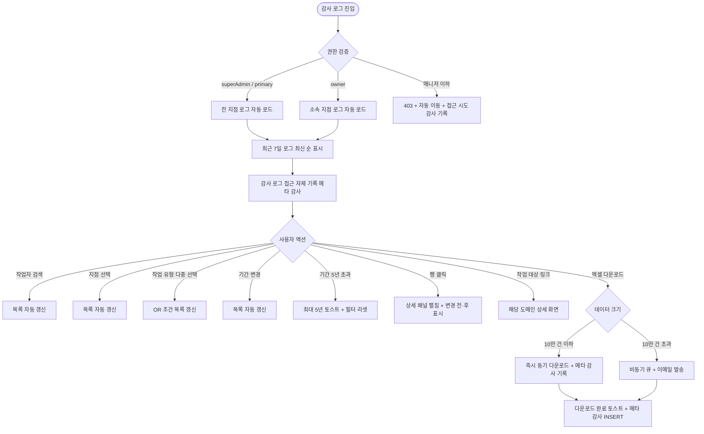
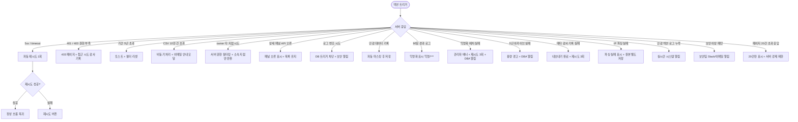

# SCR-097 감사 로그 (히스토리 로그) 페이지

## 1. 화면 메타 정보

이 문서는 감사 로그 페이지에 대한 자기완결형 요구사항 정의서입니다. 다른 문서를 함께 보지 않아도 이 한 장만으로 이 화면에 들어가는 모든 영역, 모든 검색·필터, 모든 다운로드 동작, 모든 권한, 모든 예외 처리, 그리고 이 화면을 지탱하는 운영 정책까지 전부 이해하고 구현할 수 있도록 작성합니다.

| 항목 | 값 |
|---|---|
| 작성일 | 2026-05-22 |
| 버전 | v1.0 |
| 상태 | 최신 통합본 반영 (정합화 완료) |
| 도메인 | D10 본사관리 |
| 화면 ID | SCR-097 |
| 화면명 | 감사 로그 (히스토리 로그) |
| 화면 유형 | 허브 화면 (System Audit Hub) |
| 라우트 (URL) | `/audit-log` |
| 플랫폼 | 데스크톱(기본), 태블릿 |
| 우선순위 | P0 (출시 필수) |
| 기능코드 | HQ-EXT-06 |
| 계약코드 | AUTH-05, COM-06 |
| 계약 상태 | 계약 범위 본기능 |
| 부모 기능 prefix | HQ |
| Lv1 코드 | HQ-EXT-06 |
| Lv2 / Lv3 세분화 | HQ-EXT-06-01 ~ HQ-EXT-06-06 (로그 목록, 작업 유형 분류, 검색/필터, 상세 조회, 엑셀 내보내기, 자동 기록) |
| 연계 화면 | 모든 도메인 화면 (감사 추적 대상), SCR-091 슈퍼대시보드, SCR-090 본사대시보드 (히스토리 영역 진입) |
| 호출 다이얼로그 | 없음 (조회·내보내기 인라인 처리) |

## 2. 화면 개요와 목적

감사 로그 페이지는 시스템 내에서 발생한 주요 작업 이력을 기록하고 조회하는 D10 본사관리 도메인의 핵심 추적 화면입니다. 누가, 언제, 무엇을 했는지 정확하게 추적하여 보안 감사, 문제 발생 시 원인 파악, 운영 투명성 확보, 외부 감사 자료 제출에 활용됩니다. 시스템 전반의 모든 변경 이력이 모이는 중앙 감사 추적 도구이며, append-only로 변조 불가합니다.

이 화면이 다루는 운영 흐름은 매우 다양합니다. 본사 슈퍼관리자가 보안 이상이 의심될 때는 특정 기간과 사용자 필터로 권한 변경·데이터 삭제 이력을 확인해 이상 패턴을 감지하고 즉시 계정 잠금 같은 액션을 실행합니다. Owner(지점장)은 직원 결제 오류 신고를 받았을 때 지점·작업자·"결제" 유형·기간 필터로 결제 변경 전·후 값을 확인해 오류 원인을 파악합니다. 데이터 삭제 감사에서는 "데이터 삭제" 유형 필터로 최근 30일 삭제 이력을 조회해 삭제 대상·삭제자·IP를 확인하고 승인 여부를 검토합니다. 외부 감사 자료 준비에서는 기간 필터를 설정한 후 CSV 내보내기를 통해 감사 기관 제출용 자료를 생성하며, 이 내보내기 행위 자체도 메타 감사 로그에 기록됩니다. 직원 업무 확인에서는 소속 지점·작업자·"회원 관리" 필터로 직원별 회원 수정 이력 목록을 조회합니다. API 호출 이상 감지에서는 "API 호출" 유형 필터로 특정 IP의 반복 조회를 식별해 비정상 API 접근 패턴을 차단합니다. 개인정보 익명화 점검에서는 90일 이전 로그에 익명화 처리 여부를 확인해 미처리 건의 익명화 배치를 재실행합니다. 로그인 이상 의심에서는 특정 직원의 "로그인" 유형 + 기간 필터로 로그인/로그아웃/잠금 이력을 확인합니다. 5년 보관 정책 점검에서는 오래된 기간을 조회해 정상 보관 여부를 확인합니다.

따라서 이 화면은 단순한 로그 조회 화면이 아니라, 시스템 전체의 신뢰성과 추적성을 보장하는 본사 컴플라이언스 도구로 동작해야 합니다.

## 3. 진입 경로와 인접 화면

감사 로그 페이지에 진입하는 경로는 매우 다양합니다.

첫 번째 경로는 사이드바입니다. 본사관리 메뉴 아래 "히스토리 로그" 또는 "감사 로그" 항목을 클릭하면 진입합니다. URL은 `/audit-log`이고 화면은 최근 7일 기준 전체 로그가 최신 순으로 표시된 상태로 시작합니다.

두 번째 경로는 본사 대시보드(SCR-090) 또는 슈퍼 대시보드(SCR-091)의 최근 활동 로그 영역 [전체보기] 링크입니다. 이 경우 현재 지점 또는 전체 지점 필터가 자동 적용된 상태로 진입합니다.

세 번째 경로는 다른 화면의 최근 활동 클릭 시 권한 변경·설정 변경·백업·복원 같은 시스템 이벤트인 경우입니다. 해당 이벤트의 상세 패널이 자동으로 펼쳐진 상태로 진입합니다.

네 번째 경로는 다른 화면의 작업 결과 토스트 클릭 시이며, 일괄 작업·메시지 발송 같은 결과 이벤트의 감사 로그로 자동 진입합니다.

다섯 번째 경로는 알림 센터의 "보안 이상 감지", "데이터 변조 시도 차단", "이상 IP 반복 조회" 같은 보안 알림 클릭입니다. 해당 이벤트가 자동 강조된 상태로 진입합니다.

여섯 번째 경로는 외부 감사 기관에서 받은 자료 요청을 처리할 때 직접 URL 또는 사이드바를 통해 진입하는 경우입니다.

이 화면에서 빠져나가는 인접 화면은 모든 도메인 화면입니다. 회원 관리 로그 행 클릭은 SCR-M004 회원 상세, 결제 로그 행 클릭은 SCR-S001 매출 또는 결제 상세, 권한·설정·백업 로그는 다시 SCR-097의 상세 패널, 백업/복원 이벤트는 SCR-089 시스템 관리 등 시스템 전반의 모든 화면으로 연결됩니다. 외부 감사 자료 제출은 화면에서 빠져나가지 않고 CSV 다운로드로 처리됩니다.

## 4. 레이아웃과 UI 구성

감사 로그는 위에서 아래로 흐르는 세로형 레이아웃이며, 검색·필터 바와 로그 테이블이 핵심 영역입니다. 화면은 위에서부터 다음과 같이 구성됩니다.

가장 위에는 페이지 헤더가 있습니다. 헤더 좌측에는 "히스토리 로그" 또는 "감사 로그" 페이지 타이틀과 현재 조회 중인 기간(예: `최근 7일: 2026-05-15 ~ 2026-05-22`)이 표시됩니다. 헤더 우측에는 [엑셀 다운로드] 버튼이 있고, 권한이 없는 매니저 이하에게는 hidden입니다.

페이지 헤더 바로 아래에는 검색 및 필터 바가 있습니다. 첫 줄에 통합 검색창이 있고 작업자 이름과 계정을 동시에 OR 조건으로 검색하며 300ms 디바운스가 적용됩니다. 검색창 우측에는 지점 선택 드롭다운(슈퍼관리자만 전 지점, owner는 자기 지점 고정), 작업 유형 다중 선택 드롭다운(8종: 로그인 / 회원 관리 / 결제 / 설정 변경 / 권한 변경 / 데이터 삭제 / 일괄 작업 / API 호출), 조회 기간 날짜 범위 피커(시작일·종료일)가 배치됩니다. 필터 변경 시 즉시 로그 목록이 갱신됩니다.

검색 바 아래에는 로그 목록 테이블이 있습니다. 컬럼은 좌측부터 작업 일시(YYYY-MM-DD HH:mm:ss), 작업자(이름·계정), 지점명, 작업 유형 아이콘 + 라벨, 작업 대상(회원/직원/결제 등), 작업 상세(요약 문구), 액션(상세/펼침)입니다. 작업 유형 아이콘은 카테고리별로 다른 색상과 모양으로 표시되어 한눈에 카테고리가 구분됩니다. 행은 작업 일시 내림차순(최신 순)으로 정렬되며, 행 클릭 또는 [펼침] 버튼 클릭 시 상세 패널이 펼쳐집니다.

상세 패널에는 작업 상세 정보가 표시됩니다. 변경 전 값과 변경 후 값이 좌우로 나란히 비교 표시되고(diff 시각화), IP 주소, 디바이스 정보, 세션 ID, 요청 헤더 정보 일부가 함께 표시됩니다. 민감 데이터(비밀번호, 카드번호 등)는 자동 마스킹된 상태로만 노출되며 원본은 복호화 불가입니다. 90일 경과 로그는 작업자 이름·계정이 "익명" 또는 "***"로 마스킹된 상태로 표시됩니다.

페이지 하단에는 페이지네이션 영역이 있습니다. 페이지당 20건 고정이며, 페이지 번호 이동(이전·다음·직접 입력)과 총 건수가 표시됩니다.

CSV 내보내기는 헤더의 [엑셀 다운로드] 버튼으로 시작되며, 1만 건 이하는 즉시 다운로드, 10만 건 초과는 비동기 처리 후 이메일로 다운로드 링크 발송됩니다.

검색 결과가 없으면 테이블 자리에 "조건에 맞는 로그가 없습니다" 안내가 표시됩니다.

페이지 가장 아래에는 데이터 보존 정책 안내(예: "5년 보관, 90일 경과 시 익명화")가 작게 표시됩니다.

## 5. 탭 구성과 탭별 동작

이 화면은 별도의 상위 탭을 가지지 않습니다. 모든 로그가 같은 테이블에 표시되며, 검색·필터로 좁히는 방식입니다.

작업 유형 다중 선택 드롭다운이 사실상 탭과 유사한 카테고리 필터 역할을 합니다. 8종 카테고리(로그인 / 회원 관리 / 결제 / 설정 변경 / 권한 변경 / 데이터 삭제 / 일괄 작업 / API 호출)를 자유롭게 다중 선택할 수 있으며, OR 조건으로 검색됩니다.

지점 선택은 슈퍼관리자만 전 지점 선택 가능하고, owner는 자기 지점이 고정됩니다.

기간 필터는 기본값이 최근 7일이며, 사용자가 시작일과 종료일을 직접 지정할 수 있습니다. 5년을 초과하는 기간은 "최대 5년까지 조회 가능합니다" 토스트로 차단됩니다.

상세 패널 펼침/접힘은 행 단위로 토글되며, 여러 행을 동시에 펼칠 수도 있습니다.

## 6. 버튼·아이콘·링크 액션 전체 정의

이 화면에 등장하는 모든 클릭 가능한 요소를 빠짐없이 정의합니다.

페이지 헤더의 [엑셀 다운로드] 버튼은 현재 필터 조건의 전체 데이터(페이지네이션 무시)를 CSV/엑셀로 내려받습니다. 1만 건 이하는 즉시 다운로드, 10만 건 초과는 비동기 큐 등록 + 완료 시 이메일로 다운로드 링크가 발송됩니다. 다운로드 행위 자체가 메타 감사 로그에 기록되며 다운로드자·기간·건수가 저장됩니다. 권한이 없는 매니저 이하에게는 hidden입니다.

검색창은 300ms 디바운스 후 자동으로 목록을 갱신하며, 작업자 이름과 계정을 OR 조건으로 검색합니다. 검색어 X 버튼은 즉시 초기화합니다.

지점 선택 드롭다운은 슈퍼관리자만 전 지점 선택 가능하며, owner는 자기 지점 고정으로 드롭다운이 비활성 또는 단일 옵션입니다. 변경 즉시 목록이 갱신됩니다.

작업 유형 다중 선택 드롭다운은 8종 카테고리를 자유롭게 선택할 수 있으며, OR 조건으로 동작합니다. "전체 선택" 옵션은 모든 카테고리를 즉시 선택합니다. 변경 즉시 목록이 갱신됩니다.

조회 기간 날짜 범위 피커는 시작일과 종료일을 입력하며, 변경 즉시 목록이 갱신됩니다. 5년 초과는 차단되고 토스트로 안내됩니다.

로그 행 클릭 또는 [펼침] 버튼 클릭은 상세 패널을 펼칩니다. 다시 클릭하면 접힙니다. 여러 행을 동시에 펼칠 수도 있습니다.

상세 패널 내부의 작업 대상 링크(예: 회원명, 결제 ID)는 해당 도메인의 상세 화면으로 이동합니다. 회원 관리 로그는 SCR-M004 회원 상세, 결제 로그는 결제 상세 또는 SCR-S001, 권한·설정·백업 로그는 자기 자신의 상세 패널 또는 시스템 관리 화면으로 이동합니다.

상세 패널의 변경 전·후 값 영역은 diff 시각화로 표시되며, 클릭이나 호버 시 추가 정보가 펼쳐지지 않고 정적 표시입니다.

상세 패널의 IP·디바이스·세션 ID는 텍스트 정보로 표시되며 추가 액션이 없습니다. IP 파싱이 실패한 경우 "파싱 실패" 표시와 함께 원본 헤더값이 별도로 저장됩니다.

페이지네이션의 이전/다음 버튼과 페이지 번호 입력은 즉시 갱신됩니다. 페이지당 건수는 20건 고정이고 변경 옵션이 없습니다.

90일 경과 로그의 마스킹 해제 옵션은 본 화면에서 직접 제공되지 않습니다. 본사 권한자가 별도 사유 입력과 승인 워크플로우를 거쳐 일시 해제할 수 있으며, 이는 별도 시스템 관리 화면에서 처리됩니다.

비동기 CSV 다운로드 완료 알림 토스트의 다운로드 링크는 클릭 시 파일이 즉시 다운로드됩니다.

모든 버튼은 클릭 후 응답이 돌아오기 전까지 자동으로 비활성화되며, 다운로드 중에는 진행 표시와 함께 완료 시 토스트가 추가됩니다.

## 7. 호출되는 모달 동작

감사 로그 화면에서는 별도의 다이얼로그가 호출되지 않습니다. 모든 액션은 인라인 동작 또는 다른 화면으로의 이동으로 처리됩니다.

다운로드 처리는 다이얼로그가 아닌 인라인 토스트와 진행 표시로 안내됩니다.

상세 패널은 모달이 아닌 행 단위의 인라인 펼침으로 처리됩니다. 부모 화면이 어두워지지 않으며 다른 행과 동시에 펼침 가능합니다.

PII 마스킹 해제는 본 화면에서 모달로 호출되지 않으며, 본사 권한자의 별도 승인 워크플로우를 통해 처리됩니다.

## 8. 토스트와 확인 팝업과 알럿

감사 로그에서 발생하는 알림성 UI는 다음과 같습니다.

성공 토스트는 우측 상단에 녹색 계열로 5초 동안 표시됩니다. "엑셀 다운로드가 시작되었어요", "엑셀 다운로드가 완료되었어요", "비동기 다운로드 완료 - 이메일을 확인해주세요" 같은 결과 문구가 표시됩니다. 비동기 완료 토스트는 다운로드 링크 클릭으로 즉시 다운로드를 시작할 수 있습니다.

실패 토스트는 빨강 계열로 표시되며, "로그를 불러올 수 없어요", "내보내기에 실패했어요", "최대 5년까지 조회 가능합니다" 같은 문구와 보조 액션이 표시됩니다. 자동 재시도는 5초 후 1회 수행됩니다.

진행 토스트는 다운로드 시작 시 표시되며 "{유형} 다운로드 중... {진행률}%" 진행률을 보여줍니다. 10만 건 초과 비동기 처리 시 "대용량 데이터는 이메일로 전송됩니다" 안내 모달이 별도로 표시됩니다.

상세 패널 펼침/접힘은 별도 알림 없이 즉시 반영됩니다.

확인 팝업은 사용되지 않습니다.

알럿은 매니저 이하 권한자가 직접 URL로 접근했을 때 표시됩니다. "이 화면에 접근할 권한이 없습니다. 3초 후 대시보드로 이동합니다"가 표시되고 SCR-090으로 자동 이동되며, 접근 시도 자체도 감사 로그에 기록됩니다.

로그 변조 시도가 감지되면 사용자 화면에는 보이지 않고 관리자에게 즉시 보안 알림이 발송됩니다. DB 트리거가 변조를 차단하고 보안팀 에스컬레이션이 자동 트리거됩니다.

90일 경과 로그의 익명화 처리 상태에서는 작업자 이름·계정이 "익명" 또는 "***"로 표시되어 알럿이 아닌 자연스러운 표시로 처리됩니다.

CSV 내보내기 10만 건 초과 시 "대용량 데이터는 이메일로 전송됩니다" 안내 모달이 표시되어 비동기 처리 흐름을 명확히 안내합니다.

기간 5년 초과 선택 시 "최대 5년까지 조회 가능합니다" 토스트와 필터 자동 리셋이 함께 표시됩니다.

## 9. 데이터 흐름과 외부 연동

이 화면은 시스템 전체의 감사 로그를 모으는 중앙 추적 도구이므로 데이터 흐름이 매우 복잡합니다.

화면 진입 시점에 감사 로그 조회 API가 호출됩니다. 응답에는 필터 조건에 맞는 로그 목록(페이지당 20건)이 시간순 내림차순으로 포함됩니다. 슈퍼관리자는 RLS 우회로 전 지점 로그, owner는 자기 지점 로그만 반환됩니다.

자동 기록 정책은 모든 시스템 액션(회원/결제/설정/권한/삭제 등)이 자동으로 감사 로그에 기록되도록 설정되어 있습니다. 기록은 append-only이며 DB 트리거로 변조가 차단됩니다.

기록되는 필드는 매우 상세합니다. actor_id(작업자 ID), actor_name(작업자 이름), branch_id(소속 지점), action_type(작업 유형 8종 중 하나), target_type(회원/직원/결제/이용권/수업/권한/설정 등), target_id(대상 ID), action_summary(요약 문구), before_value(변경 전 값 JSON), after_value(변경 후 값 JSON), ip_address(IP), device_info(디바이스), session_id(세션 ID), timestamp(작업 시각)가 저장됩니다.

민감 데이터(비밀번호, 카드번호, 주민번호 등)는 기록 시점에 자동 마스킹 처리되어 저장됩니다. 마스킹된 값은 복호화 불가하며, 원본은 절대 저장되지 않습니다.

90일 익명화 배치는 매일 02:00에 실행되어 등록 90일 경과 로그의 작업자 이름·계정·IP를 익명화 처리합니다. 익명화 후에는 "익명" 또는 "***" 표시로 노출됩니다.

5년 아카이브 이관 배치는 매월 1일 00:00에 실행되어 5년 경과 로그를 아카이브 스토리지로 이관한 후 운영 DB에서 삭제합니다. 아카이브된 로그는 별도 시스템에서 보관됩니다.

민감 액션 필수 로그 누락 감지는 실시간으로 동작하며, 민감 액션(데이터 삭제·권한 변경·일괄 처리·API 호출)이 기록 누락되면 시스템 알림이 자동 발송됩니다.

CSV 비동기 생성은 10만 건 초과 내보내기 요청 시 백그라운드 큐로 등록되어 CSV 생성 후 이메일로 다운로드 링크가 발송됩니다.

로그 변조 차단은 DB 레벨 트리거로 UPDATE/DELETE를 차단하며, 시도 감지 시 보안 알림이 자동 발송됩니다.

보안 이상 패턴 감지 알림은 룰 기반으로 동작합니다. 동일 IP의 단시간 대량 API 호출 같은 패턴이 감지되면 보안팀에 Slack/이메일 알림이 발송됩니다.

메타 감사 자동 기록 정책은 CSV 내보내기 완료 후 내보내기 행위(다운로드자·기간·건수)가 감사 로그에 추가 기록되도록 설정되어 있습니다. 이는 재귀 감사(1depth)이며 감사 로그를 보는 행위 자체도 추적됩니다.

감사 로그 접근 기록은 히스토리 로그 화면 진입 시 조회자·IP·조회 조건이 감사 로그에 기록됩니다. SCR-097 자기 참조 구조이며 감사 행위 자체가 감사됩니다.

화면에서 호출하는 주요 API 엔드포인트는 다음과 같습니다. 로그 목록 `GET /api/audit-logs`, 단일 로그 상세 `GET /api/audit-logs/:id`, 내보내기 `GET /api/audit-logs/export`, 자동 기록(시스템 내부) `POST /api/audit-logs`.

## 10. 화면 상태와 예외 처리

감사 로그는 다음 상태들을 가질 수 있습니다.

로딩 중 상태에서는 테이블 자리에 행 모양 스켈레톤이 표시됩니다.

정상 상태는 가장 일반적인 상태로, 로그 목록이 표시되고 검색·필터·페이지네이션이 활성화됩니다.

검색 결과 없음 상태는 조건에 맞는 로그가 0건일 때이며, "조건에 맞는 로그가 없습니다" 안내가 표시됩니다.

상세 패널 펼침 상태는 사용자가 행을 클릭한 상태이며, 변경 전·후 값과 IP·디바이스가 표시됩니다.

내보내기 처리 중 상태는 다운로드 진행 중일 때이며, 버튼이 비활성화되고 진행률 토스트가 표시됩니다.

대용량 비동기 처리 상태는 10만 건 초과 요청 시이며 "이메일로 전송됩니다" 안내 후 백그라운드 처리됩니다.

90일 익명화 표시 상태는 90일 경과 로그가 작업자 이름·계정·IP가 익명화된 상태로 표시되는 경우입니다.

기간 5년 초과 차단 상태는 사용자가 5년을 넘는 기간을 선택했을 때이며, 토스트와 함께 필터가 자동 리셋됩니다.

권한 부족 상태는 매니저 이하 권한자가 직접 URL로 접근했을 때이며, 안내 후 자동 이동됩니다.

owner 타 지점 접근 시도 상태는 owner가 URL 파라미터로 타 지점을 시도했을 때이며, 서버 권한 검증으로 자기 지점 데이터만 반환됩니다.

상세 패널 API 오류 상태는 상세 조회 실패 시이며, 패널에 오류 메시지가 표시되고 목록은 유지됩니다.

로그 변조 시도 감지 상태는 사용자에게는 보이지 않으며 관리자에게 즉시 보안 알림이 발송됩니다. DB 트리거가 변조를 차단합니다.

5년 아카이브 이관 실패 상태는 운영 DB 용량 경고 배너로 표시되고 DBA 알림과 이관 재시도가 진행됩니다.

오류 상태는 5xx 또는 timeout 응답 시이며 토스트와 재시도 버튼이 제공됩니다.

예외 케이스별 처리는 다음과 같습니다.

매니저 이하 접근 시도(URL 직접 접근 포함) 시 403 + "접근 권한이 없습니다" 페이지로 차단되고, 접근 시도 자체가 감사 로그에 기록됩니다.

검색 결과 0건이면 "조건에 맞는 로그가 없습니다" 안내가 표시됩니다.

기간 필터 미설정 시 기본값으로 최근 7일이 자동 적용됩니다.

기간 5년 초과 선택 시 "최대 5년까지 조회 가능합니다" 토스트 + 필터 자동 리셋이 일어납니다.

CSV 내보내기 대용량(10만 건 초과) 시 즉시 생성 불가하며 비동기 생성 → 완료 시 이메일 발송 안내가 표시됩니다.

로그 변조 시도(직접 DB 수정) 시 append-only 정책 위반으로 DB 트리거가 차단하고 보안 알림이 자동 발송됩니다.

민감 데이터(비밀번호·카드번호)는 기록 시점에 자동 마스킹되어 복호화 불가 상태로 저장됩니다.

90일 경과 로그 익명화는 익명화 배치 완료 후 작업자 이름·계정이 "익명"으로, IP가 "***"로 마스킹 표시됩니다.

owner가 타 지점 로그 접근 시도(필터 또는 URL 파라미터) 시 서버 권한 검증으로 소속 지점 데이터만 반환됩니다.

행 클릭 상세 패널 API 오류 시 "상세 정보를 불러올 수 없습니다" 토스트와 목록 유지로 처리됩니다.

메타 감사 로그 기록 실패(CSV 내보내기 후 감사 기록 실패) 시 내보내기는 완료 처리되고 감사 기록 재시도가 3회 진행됩니다.

감사 로그 조회 API 전체 실패 시 "로그를 불러올 수 없습니다" 안내가 표시되고 Sentry 에러와 온콜 알림이 자동 발송됩니다.

CSV 내보내기 실패 시 "내보내기에 실패했습니다" 토스트와 재시도 1회 후 실패 시 관리자 알림이 발송됩니다.

익명화 배치 실패 시 관리자 대시보드에 "익명화 처리 실패" 배너가 표시되고 배치 재시도 3회 후 실패 시 DBA 알림이 발송됩니다.

5년 경과 아카이브 이관 실패 시 운영 DB 용량 경고 배너가 표시되고 DBA 알림과 이관 재시도가 진행됩니다.

IP 파싱 실패 시 IP 컬럼에 "파싱 실패" 표시되고 원본 헤더값이 별도 저장됩니다.

페이지네이션 20건 초과 응답 시 20건만 표시되고 나머지는 서버 페이지 크기 강제 제한으로 처리됩니다.

## 11. 권한별 처리

이 화면은 보안 감사 정책이 가장 엄격하게 적용되는 화면이므로 권한 처리가 매우 명확합니다.

superAdmin와 primary는 전체 지점 로그를 조회할 수 있고 필터·내보내기 모두 가능합니다. RLS 우회 권한을 가지며 모든 감사 로그에 접근 가능합니다.

Owner(지점장)은 소속 지점 로그만 조회 가능하며 필터·내보내기 가능합니다. URL 파라미터로 타 지점을 지정해도 서버 권한 검증으로 자기 지점 데이터만 반환됩니다.

매니저(manager) 이하 권한자(fc, trainer, staff, front, readonly)는 본 화면에 접근할 수 없습니다. 사이드바에 메뉴가 보이지 않고, 직접 URL 접근 시 403 + "접근 권한이 없습니다" 페이지로 차단되며, 접근 시도 자체가 감사 로그에 기록됩니다.

읽기 전용(readonly)도 본 화면에 접근할 수 없습니다.

권한 외 사용자의 직접 URL 접근 시도는 그 자체가 보안 이벤트로 간주되어 감사 로그에 actor·attempted_access·timestamp로 기록됩니다. 이는 사후 권한 우회 시도 추적을 위한 정책입니다.

내보내기 권한은 슈퍼관리자와 owner만 가지며, 내보내기 행위 자체도 별도 감사 로그에 기록됩니다(메타 감사). 다운로드자·기간·건수가 저장되어 외부 정보 유출 추적이 가능합니다.

PII 마스킹 정책은 모든 권한자에게 동일 적용됩니다. 90일 경과 로그는 익명화된 상태로만 노출되며, 일시 해제는 본사 권한자의 별도 승인 워크플로우를 거쳐야 합니다.

민감 데이터(비밀번호·카드번호)는 어떤 권한자도 원본을 볼 수 없습니다. 기록 시점에 자동 마스킹되어 복호화 불가 상태로 저장됩니다.

owner의 타 지점 로그 접근 시도는 서버 권한 필터링으로 자동 차단되며 별도 오류 메시지가 표시되지 않습니다.

권한이 부족해서 액션이 차단된 경우의 사용자 경험은 일관됩니다. 첫째, 사이드바에서 메뉴가 숨겨집니다. 둘째, 직접 URL 접근 시 403 페이지로 차단됩니다. 셋째, 백엔드는 권한 검증을 엄격하게 수행합니다. 넷째, 모든 권한 우회 시도가 감사 로그에 기록됩니다.

## 12. 메인 흐름

감사 로그의 핵심 동작 흐름입니다.

## 13. 에러와 예외 흐름

## 14. 핵심 디자인 요청사항

이 화면이 본사 컴플라이언스 담당자에게 잘 작동하려면 다음 디자인 원칙이 시각적으로 명확해야 합니다.

작업 유형 아이콘은 8종 카테고리별로 색상과 모양이 명확히 구분되어야 합니다. 로그인은 키 모양 + 회색, 회원 관리는 사람 모양 + 파랑, 결제는 카드 모양 + 초록, 설정 변경은 톱니바퀴 + 노랑, 권한 변경은 자물쇠 + 보라, 데이터 삭제는 휴지통 + 빨강, 일괄 작업은 다중 사각형 + 주황, API 호출은 글로벌 아이콘 + 청록 같은 식으로 시각적으로 분리됩니다.

로그 테이블의 행 높이는 가독성을 위해 충분히 넓게, 작업 일시는 좌측 정렬, 작업 유형 아이콘은 중앙, 작업 상세는 좌측 정렬로 통일됩니다.

상세 패널의 변경 전·후 비교는 좌우 분할 형태로 표시되며, 변경된 필드는 노랑 또는 주황 강조 배경으로 시각화됩니다. JSON diff 형태로 추가/삭제/변경이 명확히 인식되어야 합니다.

마스킹 표시(비밀번호 ***, 카드번호 ****-****-****-1234)는 일관된 패턴으로 처리되어 보안 안전감을 줍니다.

90일 익명화된 로그 행은 행 전체에 약간의 회색 톤이 들어가고 작업자 컬럼에 "익명" 또는 "***"이 명확히 표시됩니다.

검색 결과 없음 안내는 친근한 일러스트와 함께 "조건에 맞는 로그가 없습니다 - 필터를 조정해보세요" 안내로 표시됩니다.

다운로드 처리 중 토스트는 진행률을 부드럽게 갱신하며, 비동기 처리 안내 모달은 명확한 콜투액션(이메일 확인) 메시지가 강조됩니다.

데이터 보존 정책 안내(5년 보관, 90일 익명화)는 페이지 하단에 작게 표시되어 운영자가 정책을 자연스럽게 인지하도록 합니다.

진행 스피너와 로딩 스켈레톤은 본사 대시보드와 동일한 톤으로 통일됩니다.

모바일/태블릿에서는 테이블이 카드형 리스트로 자동 전환되어 각 카드에 작업 일시·작업자·작업 유형·작업 대상이 표시되며 펼침으로 상세를 확인합니다.

## 15. 운영 정책 (이 화면에 연결된 부분)

감사 로그는 본사 컴플라이언스 정책의 핵심이므로 운영 정책을 풀어 적습니다.

자동 기록 정책은 모든 시스템 액션(회원/결제/설정/권한/삭제 등)이 자동으로 감사 로그에 기록되도록 합니다. 운영자가 별도로 기록 행위를 하지 않아도 백엔드 미들웨어가 자동으로 INSERT를 수행합니다.

append-only 정책은 감사 로그가 변경·삭제 불가하도록 합니다. DB 트리거로 UPDATE/DELETE가 차단되며, 변조 시도는 보안 알림으로 즉시 보고됩니다.

내보내기 권한은 슈퍼관리자/owner만 가지며, 내보내기 행위 자체가 별도 감사 로그에 기록됩니다(메타 감사 1depth). 이는 외부 정보 유출을 추적하기 위한 정책입니다.

작업 상세 기록 정책은 변경 전·후 값이 모두 저장되도록 합니다. 이는 복구 참고와 사후 추적에 활용됩니다.

IP·디바이스 정보 기록 정책은 보안 분석을 위한 정책입니다. 요청 헤더 X-Forwarded-For 기준으로 IP가 기록되며, 프록시 환경이 고려됩니다.

매니저 이하 접근 차단 정책은 보안상 감사 로그 접근을 제한합니다. 사이드바 메뉴가 숨겨지고 직접 URL 접근은 차단되며, 접근 시도가 감사 로그에 기록됩니다.

민감 데이터 자동 마스킹 정책은 비밀번호·카드번호·주민번호 등이 기록 시점에 자동 마스킹되도록 합니다. 마스킹된 값은 복호화 불가하며 원본은 절대 저장되지 않습니다.

로그 보관 기간은 5년이며, 5년 경과 데이터는 별도 아카이브 스토리지로 이관 후 운영 DB에서 삭제됩니다. 이는 매월 1일 00:00 배치로 처리됩니다.

90일 익명화 정책은 등록 후 90일 경과 로그의 작업자 이름·계정·IP를 익명화 처리합니다. 이는 개인정보 보호 정책에 따른 것이며, 매일 02:00 배치로 처리됩니다. 일시 해제는 본사 권한자의 별도 승인 워크플로우를 거쳐야 합니다.

페이지네이션 단위는 20건/페이지 고정입니다. 이는 대용량 응답으로 인한 성능 저하를 방지하기 위한 정책입니다.

민감 액션 필수 로그 정책은 데이터 삭제·권한 변경·일괄 처리·API 호출 같은 민감 액션이 반드시 기록되도록 합니다. 기록 누락 시 시스템 알림이 자동 발송됩니다.

CSV 내보내기는 현재 필터 기준 전체 데이터를 포함하며 페이지 단위가 아닙니다. 미리보기 페이지와 무관합니다.

로그 목록 기본 정렬은 작업 일시 내림차순(최신 순)입니다.

작업 유형 다중 필터는 OR 조건으로 검색됩니다.

10만 건 초과 CSV 내보내기는 비동기 생성 후 이메일로 다운로드 링크가 발송됩니다.

감사 로그 자체의 조회·내보내기 행위도 감사 로그에 기록됩니다(재귀 감사 1depth). 이는 감사를 감사하는 정책입니다.

IP 기록은 요청 헤더 X-Forwarded-For 기준이며 프록시 환경을 고려합니다.

로그 상세 패널에는 변경 전·후 값, IP, 디바이스, 세션 ID가 표시되어 사후 분석에 필요한 모든 정보가 제공됩니다.

본사-지점 권한 분리 정책상 슈퍼관리자는 전 지점 로그, owner는 자기 지점 로그만 조회 가능하며, owner의 타 지점 접근 시도는 서버 권한 필터링으로 자동 차단됩니다.

기간 필터 5년 초과는 차단됩니다. 이는 보관 정책과 일치하며, 5년 이전 데이터는 아카이브에서 별도 절차로 조회됩니다.

상세 화면 진입(회원 상세·결제 상세 등)은 해당 도메인의 권한 정책에 따라 처리되며, 감사 로그에서 진입한 경우에도 권한이 없으면 차단됩니다.

90일 경과 PII 마스킹 정책은 모든 권한자에게 동일 적용됩니다. 본사 권한자가 사유를 입력하면 일시 해제가 가능하지만, 이는 별도 시스템 관리 화면에서 처리되며 본 화면에서 직접 해제할 수 없습니다.

로그 변조 차단 정책은 DB 레벨 트리거로 UPDATE/DELETE가 차단되며, 시도 감지 시 보안팀에 즉시 알림이 발송되고 보안팀 에스컬레이션이 자동 트리거됩니다.

보안 이상 패턴 감지 정책은 동일 IP의 단시간 대량 API 호출 같은 패턴이 감지되면 보안팀에 Slack/이메일 알림이 발송되도록 합니다. 룰 기반 감지이며 향후 ML 기반으로 확장될 수 있습니다.

감사 로그 시스템 자체의 신뢰성은 시스템 전체의 신뢰성을 결정합니다. 따라서 감사 로그 기록 실패는 별도의 알림으로 처리되며, 메타 감사 기록 실패도 재시도 3회 후 실패 시 관리자 알림이 발송됩니다.

이상의 모든 정책은 이 화면을 구현하고 운영하는 사람이 별도 문서 없이 이 한 장만 보면 이해할 수 있도록 풀어 적었습니다. 정책이 바뀌면 이 문서가 함께 갱신되어야 하며, 코드 변경과 정책 변경은 항상 짝지어 진행됩니다.
