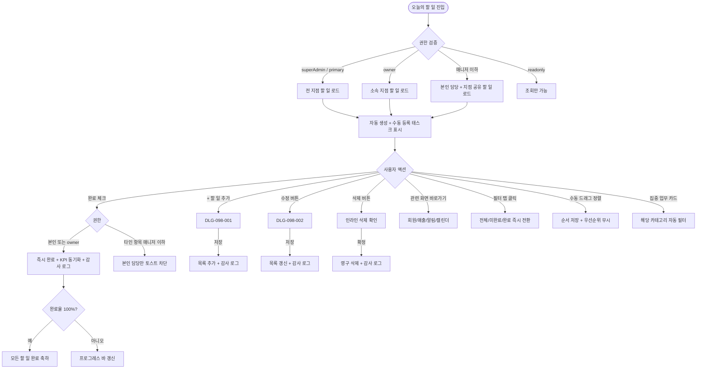

# SCR-098 오늘의 할 일 (Today Tasks) 페이지

## 1. 화면 메타 정보

이 문서는 오늘의 할 일 페이지에 대한 자기완결형 요구사항 정의서입니다. 다른 문서를 함께 보지 않아도 이 한 장만으로 이 화면에 들어가는 모든 영역, 모든 버튼, 모든 다이얼로그, 모든 권한, 모든 예외 처리, 그리고 이 화면을 지탱하는 운영 정책까지 전부 이해하고 구현할 수 있도록 작성합니다.

| 항목 | 값 |
|---|---|
| 작성일 | 2026-05-22 |
| 버전 | v1.0 |
| 상태 | 최신 통합본 반영 (정합화 완료) |
| 도메인 | D10 본사관리 |
| 화면 ID | SCR-098 |
| 화면명 | 오늘의 할 일 (Today Tasks) |
| 화면 유형 | 운영 화면 |
| 라우트 (URL) | `/today-tasks` |
| 플랫폼 | 데스크톱(기본), 태블릿, 모바일 |
| 우선순위 | P0 (출시 필수) |
| 기능코드 | HQ-06 |
| 계약코드 | HQ-06 |
| 계약 상태 | 계약 범위 본기능 |
| 부모 기능 prefix | HQ |
| Lv1 코드 | HQ-06 |
| Lv2 / Lv3 세분화 | HQ-06-01 ~ HQ-06-08 (할 일 목록, 진행 현황 요약, 필터 탭, 태스크 추가, 태스크 수정, 완료 처리, 삭제, KPI 액션 연동) |
| 연계 화면 | SCR-095 KPI프리뷰보드, SCR-090 본사대시보드, SCR-097 감사로그, SCR-M001 회원목록, SCR-S001 매출 |
| 호출 다이얼로그 | DLG-098-001 태스크추가, DLG-098-002 태스크상세수정 |

## 2. 화면 개요와 목적

오늘의 할 일은 오늘 처리해야 할 업무 목록을 관리하는 운영 화면입니다. 직원 개인별 또는 지점 공유 할 일을 등록·수정·완료 체크하여 일일 업무를 체계적으로 관리하며, KPI 센터(SCR-095) 액션 큐와 양방향 동기화되어 자동 생성된 액션도 본 화면에서 처리합니다. 즉, 본 화면은 수동 할 일 + 자동 생성 할 일이 한자리에 모이는 단일 업무 큐로 동작합니다.

이 화면이 다루는 운영 흐름은 매우 다양합니다. owner(센터장)는 오전 9시에 Today Tasks에 진입해 자동 생성된 7종 태스크(만료·미수금·노쇼·생일·홀딩·재상담·체성분)를 확인한 후 직원에게 배분합니다. FC는 오전 업무 시작 시 본인 담당 태스크를 확인해 미수금·재상담 같은 우선 처리 태스크를 차례로 완료합니다. 트레이너는 노쇼 발생 시 자동 생성된 "노쇼" 태스크를 확인해 회원에게 연락하고 완료 체크하면 KPI 센터 큐와 동기화됩니다. 본사 슈퍼관리자는 전체 지점 Today Tasks 완료율을 점검해 처리율 낮은 지점에 푸시 알림을 보냅니다. FC가 임시 업무를 추가할 때는 DLG-098-001로 제목·우선순위·담당자를 입력해 지점 공유 태스크를 등록합니다. 태스크 상태 변경 이력은 모두 감사 로그(SCR-097)에 기록되어 책임 소재가 추적 가능합니다. 정렬은 긴급 → 우선 → 일반 순 자동 정렬이 기본이며, 수동 드래그로 오버라이드할 수 있습니다.

따라서 이 화면은 단순한 할 일 목록이 아니라, 자동·수동·KPI 동기화가 결합된 일일 업무 운영 도구로 동작해야 합니다.

## 3. 진입 경로와 인접 화면

오늘의 할 일에 진입하는 경로는 다음과 같습니다.

첫 번째 경로는 사이드바입니다. 본사관리 메뉴 아래 "Today Tasks" 또는 "오늘의 할 일" 항목을 클릭하면 진입합니다.

두 번째 경로는 본사 대시보드(SCR-090)나 슈퍼 대시보드(SCR-091)의 액션 큐 또는 위젯에서 "할 일로 이동" 링크 클릭입니다.

세 번째 경로는 KPI 센터(SCR-095)의 액션 큐 항목 또는 바로가기 영역 [Today Tasks] 링크입니다.

네 번째 경로는 알림 센터의 "미완료 태스크 알림"(전날 23:50 발송) 클릭입니다.

다섯 번째 경로는 자동 생성 태스크 알림(매일 06:00 배치 완료) 클릭입니다.

이 화면에서 빠져나가는 인접 화면은 회원 목록(SCR-M001), 매출 현황(SCR-S001), 자동 알림 화면, 캘린더(수업/예약 관련), KPI 센터(SCR-095), 회원 상세(SCR-M004), 감사 로그(SCR-097) 같은 후속 처리 화면들입니다.

## 4. 레이아웃과 UI 구성

오늘의 할 일은 위에서 아래로 흐르는 세로형 레이아웃이며, 상단에 집중 업무 코크핏과 진행 현황 요약이, 그 아래에 필터 탭과 할 일 목록 테이블이, 우측에 관련 화면 바로가기 패널이 배치됩니다. 화면은 위에서부터 다음과 같이 구성됩니다.

가장 위에는 페이지 헤더가 있습니다. 헤더 좌측에는 "오늘의 할 일" 페이지 타이틀과 현재 날짜(예: `2026-05-22 (목)`)가 표시됩니다. 헤더 우측에는 [+ 할 일 추가] 버튼이 배치되며, readonly 권한자에게는 hidden입니다.

페이지 헤더 바로 아래에는 오늘 집중 업무 코크핏 영역이 있습니다. 긴급 태스크 수, 회원 직접 대응 태스크 수, 자동화 후보 수가 상단 카드로 표시되어 긴급도 높은 업무와 반복 업무를 먼저 구분할 수 있습니다. 각 카드는 클릭 시 해당 카테고리로 자동 필터됩니다.

집중 업무 코크핏 아래에는 진행 현황 요약 영역이 있습니다. 전체 항목 수, 완료 항목 수, 미완료 항목 수가 카드 형태로 표시되고, 완료율 프로그레스 바가 함께 노출됩니다. 완료율은 `완료 항목 수 ÷ 전체 항목 수 × 100`(소수점 없음)으로 계산되며, 태스크 0건일 때는 "-" 표시됩니다. 완료율 100% 도달 시 "모든 할 일 완료!" 축하 메시지가 표시됩니다.

진행 현황 요약 아래에는 필터 탭 영역이 있습니다. 전체 / 미완료 / 완료 3종 탭이 가로로 배치되며 클릭으로 즉시 전환됩니다. 이 필터 탭은 오늘의 할 일 목록의 완료 상태 필터만 의미하며, 본사 비교·리포트 화면의 지점/권역/KPI 유형 필터와는 별개입니다.

필터 탭 아래에는 할 일 목록 테이블이 있습니다. 컬럼은 좌측부터 완료 체크박스, 제목, 우선순위 배지(높음·보통·낮음), 담당자(직원명), 마감 시각(HH:mm), 액션(수정/삭제)입니다. 우선순위 배지는 높음(빨강)·보통(파랑)·낮음(회색)으로 색상 코딩되며, 완료된 항목은 취소선과 완료 배지가 함께 표시됩니다. 마감 시각 미설정 태스크는 목록 하단에 표시됩니다.

자동 생성 태스크는 별도 배지("자동")가 표시되어 수동 등록과 구분됩니다.

페이지 우측에는 관련 화면 바로가기 패널이 있습니다. 회원 목록 / 매출 현황 / 자동 알림 / 캘린더 4개 링크가 카드 형태로 배치되어, Today Tasks 처리 중 자주 여는 화면으로 즉시 이동할 수 있습니다.

페이지 가장 아래에는 페이지네이션 또는 무한 스크롤이 적용됩니다. 태스크가 많지 않으므로 보통 한 페이지에 다 표시됩니다.

데이터 기준 시각은 표시되지 않고, 실시간으로 갱신됩니다(완료 처리 이벤트 즉시 반영).

## 5. 탭 구성과 탭별 동작

이 화면은 1차원 탭 구조(전체 / 미완료 / 완료)를 가지며, 모두 같은 데이터 셋의 상태 필터입니다.

전체 탭은 오늘 등록된 모든 태스크(완료+미완료)를 표시합니다.

미완료 탭은 미완료 항목만 표시하며, 우선순위 순으로 정렬됩니다(긴급 → 우선 → 일반).

완료 탭은 완료된 항목만 표시하며, 완료 시각 내림차순으로 정렬됩니다.

탭 전환은 즉시 적용되며 URL 쿼리 파라미터로 보존되지 않습니다(세션 동안만 유지).

수동 정렬(드래그앤드롭)은 우선순위 자동 정렬보다 우선 적용됩니다. 사용자가 드래그로 순서를 바꾸면 그 순서가 저장되고 다음 로그인에도 유지됩니다.

## 6. 버튼·아이콘·링크 액션 전체 정의

이 화면에 등장하는 모든 클릭 가능한 요소를 빠짐없이 정의합니다.

페이지 헤더의 [+ 할 일 추가] 버튼은 DLG-098-001(태스크 추가)을 호출합니다. owner·매니저·FC·트레이너·스태프는 활성화되며 readonly는 hidden입니다.

집중 업무 코크핏의 긴급 카드 클릭은 우선순위 높음 필터로 즉시 적용됩니다. 회원 직접 대응 카드는 회원 관련 태스크 필터, 자동화 후보 카드는 자동 생성 태스크 필터로 자동 적용됩니다.

진행 현황 요약 영역은 정보 표시 전용이며 클릭 액션이 없습니다.

필터 탭 [전체/미완료/완료] 클릭은 즉시 목록을 필터링합니다.

할 일 행의 완료 체크박스 클릭은 즉시 완료 처리하며 취소선과 완료 배지가 추가됩니다. 완료율이 즉시 갱신되고 KPI 센터 큐와 양방향 동기화됩니다. 완료 처리는 취소 가능(미완료 복원)하며 체크박스를 다시 클릭하면 복원되고 복원 이력이 감사 로그에 기록됩니다.

할 일 행의 [수정] 버튼은 DLG-098-002(태스크 상세 수정)를 호출합니다. owner/superAdmin은 모든 태스크 수정 가능하고 일반 직원은 본인 담당 태스크만 수정 가능합니다.

할 일 행의 [삭제] 버튼은 삭제 확인 모달(인라인)을 표시하고 확인 시 즉시 목록에서 제거합니다. 삭제는 영구이며 복구 불가합니다.

자동 생성 태스크의 "자동" 배지는 호버 시 생성 사유와 대상 회원 정보가 툴팁으로 표시됩니다.

수동 정렬(드래그앤드롭)은 행을 드래그해서 순서를 변경합니다. 변경 즉시 저장되며 다음 로그인에도 유지됩니다.

우측 관련 화면 바로가기 패널의 4개 링크는 각각 회원 목록(SCR-M001), 매출 현황(SCR-S001), 자동 알림 화면, 캘린더로 즉시 이동합니다.

완료율 100% 도달 시 "모든 할 일 완료!" 축하 메시지는 정보 표시 전용입니다.

KPI 센터에서 자동 생성된 액션 큐 항목이 Today Tasks에 자동 추가되며, 본 화면에서 완료 처리 시 KPI 센터 큐도 동시에 완료 상태로 동기화됩니다.

매니저 이하의 타인 태스크 완료 처리 시도는 "본인 담당 항목만 완료 처리할 수 있습니다" 토스트로 차단됩니다.

지점 공유 태스크는 같은 지점 직원 모두에게 표시되며, 타 지점 직원에게는 보이지 않도록 RLS로 필터링됩니다.

모든 버튼은 클릭 후 응답이 돌아오기 전까지 자동으로 비활성화되며, 처리 중에는 인라인 로딩 표시가 들어갑니다.

## 7. 호출되는 모달 동작

이 화면에서 호출되는 모달은 두 가지입니다.

### 7-1. DLG-098-001 태스크 추가 다이얼로그

태스크 추가 다이얼로그는 새로운 업무 항목을 등록하는 모달이며, [+ 할 일 추가] 버튼으로 트리거됩니다.

모달 상단에는 "할 일 추가" 제목이 표시되고, 그 아래에 입력 폼이 펼쳐집니다. 제목(필수, 텍스트), 상세 설명(선택, textarea), 우선순위(높음/보통/낮음, 기본값 보통), 담당자(직원 검색 드롭다운, 다중 선택 가능, 기본값 본인), 마감 시각(HH:mm, 선택), 공유 범위(개인/지점, 기본값 본인 또는 지점 정책)으로 구성됩니다.

추가 버튼을 누르면 태스크가 즉시 목록에 추가되고 모달이 닫힙니다. 제목이 미입력이면 추가 버튼이 비활성화됩니다.

취소를 누르면 모달이 닫히고 변경 사항이 폐기됩니다.

권한은 owner·매니저·FC·트레이너·스태프 모두 사용 가능하며 readonly는 차단됩니다.

DLG-098-001의 상세한 동작 정의는 별도 폴더(DLG-098-001 태스크추가 다이얼로그)에 정의되어 있습니다.

### 7-2. DLG-098-002 태스크 상세 수정 다이얼로그

태스크 상세 수정 다이얼로그는 기존 업무 항목을 수정하는 모달이며, 할 일 행의 [수정] 버튼으로 트리거됩니다.

모달 상단에는 "할 일 수정" 제목이 표시되고, 그 아래에 기존 내용이 자동 로드된 입력 폼이 펼쳐집니다. DLG-098-001과 동일한 필드(제목, 상세 설명, 우선순위, 담당자, 마감 시각, 공유 범위)에 추가로 완료 여부 토글이 노출되어 수정 다이얼로그에서도 완료 처리가 가능합니다.

저장 버튼은 변경 사항이 있을 때만 활성화되며, 누르면 즉시 목록에 반영되고 모달이 닫힙니다. 변경 이력은 감사 로그에 기록됩니다.

취소를 누르면 모달이 닫히고 변경 사항이 폐기됩니다.

권한은 owner/superAdmin은 모든 태스크 수정 가능, 매니저 이하 일반 직원은 본인 담당 태스크만 수정 가능합니다.

DLG-098-002의 상세한 동작 정의는 별도 폴더(DLG-098-002 태스크상세수정 다이얼로그)에 정의되어 있습니다.

삭제 확인은 별도 다이얼로그가 아닌 인라인 확인(yes/no)으로 처리됩니다. "정말 삭제하시겠어요? 복구할 수 없습니다" 인라인 확인 후 확정 시 영구 삭제됩니다.

## 8. 토스트와 확인 팝업과 알럿

오늘의 할 일에서 발생하는 알림성 UI는 다음과 같습니다.

성공 토스트는 "할 일을 추가했어요", "할 일을 수정했어요", "할 일을 완료했어요", "할 일을 삭제했어요" 같은 결과 문구를 표시합니다.

실패 토스트는 "저장에 실패했어요", "처리에 실패했어요", "본인 담당 항목만 완료 처리할 수 있습니다", "제목을 입력해주세요" 같은 문구와 보조 액션을 표시합니다.

완료율 100% 도달 시 "모든 할 일 완료!" 축하 토스트와 진행 현황 요약 영역의 축하 메시지가 함께 표시되어 작업 완료감을 줍니다.

자정(00:00) 날짜 변경 중 사용자가 접속 중이면 "새로운 할 일 목록으로 갱신됩니다" 토스트가 표시되고 페이지가 자동 새로고침됩니다.

미완료 알림은 전날 23:50에 담당자에게 앱 푸시로 발송됩니다. 본 화면 내부의 알림이 아니라 외부 알림이지만 사용자 흐름의 일부입니다.

자동 생성 배치(매일 06:00) 실패 시 관리자에게 "자동 태스크 생성 실패" 알림이 발송되고 사용자는 수동 추가 안내를 받습니다.

권한 없는 사용자의 직접 URL 접근은 알럿 없이 본인 역할의 디폴트 화면으로 자동 이동됩니다.

삭제 확인 인라인 모달은 알럿이 아닌 yes/no 형태의 가벼운 확인이며, "정말 삭제하시겠어요? 복구할 수 없습니다" 메시지와 확정/취소 버튼이 표시됩니다.

## 9. 데이터 흐름과 외부 연동

이 화면은 KPI 센터와의 양방향 동기화가 핵심 데이터 흐름입니다.

화면 진입 시점에 오늘 날짜 기준 할 일 목록 API가 호출됩니다. 응답에는 수동 등록 태스크와 자동 생성 태스크가 모두 포함되며, 사용자 권한에 따라 본인 담당 또는 지점 공유 태스크가 필터링됩니다.

자동 태스크 7종 생성 배치는 매일 06:00에 실행되어 만료·미수금·노쇼·생일·홀딩·재상담·체성분 카테고리별 대상 회원을 조회한 후 태스크를 자동 생성합니다. 대상 회원이 없는 카테고리는 생략됩니다. 자동 생성 태스크의 우선순위는 정책에 따라 정해집니다(만료·미수금 = 높음, 노쇼·재상담 = 보통, 생일·홀딩·체성분 = 낮음).

KPI 센터(SCR-095) 액션 큐와의 양방향 동기화는 완료 처리 이벤트가 발생할 때 즉시 동기화됩니다. Today Tasks에서 완료 체크하면 KPI 센터 큐도 완료 상태가 되고, KPI 센터에서 처리하면 Today Tasks도 동기화됩니다. 실시간 이벤트로 처리되며 둘 사이의 상태 일치가 보장됩니다.

자정 목록 갱신 배치는 매일 00:00에 실행되어 새 날짜 기준 태스크 목록으로 갱신하고 전날 미완료 알림을 발송합니다. 미완료 태스크는 자동 이월되지 않으며, 필요하면 새 날짜에 동일 내용으로 재등록해야 합니다.

미완료 알림 발송 배치는 매일 23:50에 실행되어 당일 미완료 태스크 담당자에게 앱 푸시 알림을 발송합니다. 발송 실패 시 재시도 3회 후 실패 로그가 기록됩니다.

완료율 실시간 갱신은 태스크 완료/복원 이벤트가 발생할 때마다 즉시 처리되어 진행 현황 요약의 프로그레스 바가 갱신됩니다.

감사 로그 자동 기록은 태스크 생성·수정·완료·삭제 모든 이벤트에 대해 SCR-097에 자동 기록됩니다. 작업자·태스크 ID·변경 내용·timestamp가 저장됩니다.

지점 완료율 집계 배치는 매일 21:00에 실행되어 지점별 당일 완료율을 집계하고 50% 이하 지점의 센터장에게 알림이 발송됩니다.

생일 태스크 대상 자동 필터는 매일 06:00 배치로 오늘 생일 회원을 조회한 후 생일 태스크를 자동 생성합니다(회원 DB 연계).

자동 생성 배치 실패 알림은 배치 3회 실패 시 관리자에게 Slack/SMS 알림이 발송됩니다.

화면에서 호출하는 주요 API 엔드포인트는 다음과 같습니다. 목록 `GET /api/today-tasks`, 등록 `POST /api/today-tasks`, 수정 `PUT /api/today-tasks/:id`, 삭제 `DELETE /api/today-tasks/:id`, 완료 처리 `POST /api/today-tasks/:id/complete`.

## 10. 화면 상태와 예외 처리

오늘의 할 일은 다음 상태들을 가질 수 있습니다.

로딩 중 상태에서는 목록 자리에 행 모양 스켈레톤이 표시됩니다.

정상 목록 상태는 가장 일반적인 상태로, 태스크 목록이 표시되고 필터·완료 처리·수정·삭제가 활성화됩니다.

목록 없음 상태는 오늘 등록된 할 일이 0건일 때이며, "오늘 등록된 할 일이 없습니다. 할 일을 추가해보세요" 안내와 [+ 할 일 추가] CTA가 표시됩니다.

전체 완료 상태는 완료율 100% 도달 시이며, "모든 할 일 완료!" 축하 메시지가 표시됩니다.

자동 생성 태스크 표시 상태는 매일 06:00 배치 완료 후 자동 생성된 7종 태스크가 목록에 추가된 상태입니다.

KPI 동기화 처리 중 상태는 완료 처리 후 KPI 센터 큐 동기화가 진행 중인 짧은 순간이며, 인라인 로딩 표시가 들어갑니다.

자정 날짜 변경 중 상태는 사용자가 접속 중에 자정이 지난 경우이며, 토스트와 함께 페이지가 자동 새로고침됩니다.

권한 없음 상태는 readonly나 권한 외 계정이 접근했을 때이며, 조회만 가능하거나 자동 이동됩니다.

오류 상태는 API 실패 시이며 토스트와 재시도 버튼이 제공됩니다.

수동 정렬 적용 상태는 사용자가 드래그로 순서를 변경한 상태이며, 우선순위 자동 정렬이 무시되고 수동 순서가 우선 적용됩니다.

지점 공유 태스크 표시 상태는 같은 지점 직원 모두에게 같은 공유 태스크가 표시되는 상태입니다.

예외 케이스별 처리는 다음과 같습니다.

자정(00:00) 날짜 변경 시 새 날짜 기준 태스크 목록으로 갱신되고 전날 미완료 태스크는 이월 없이 별도 "미완료 알림"이 발송됩니다.

전날 미완료 태스크 이월 요청은 수동 이월 기능이 없으므로 새 날짜에 동일 내용으로 재등록 안내가 표시됩니다.

KPI 센터 큐 자동 생성 실패(배치 오류) 시 수동 태스크 추가는 가능하며 관리자에게 알림이 발송됩니다.

매니저가 타인 태스크 완료 처리 시도 시 "본인 담당 항목만 완료 처리할 수 있습니다" 토스트로 차단됩니다.

지점 공유 태스크를 타 지점 직원이 접근하면 필터로 자동 제외되어 보이지 않습니다.

DLG-098-001 제목 미입력 시 "제목을 입력해주세요" 인라인 오류가 표시됩니다.

담당자 미지정 태스크는 저장 허용되고 "담당자 없음"으로 표시되며 추후 수정 가능합니다.

완료 태스크를 미완료로 복원 시 체크박스 재클릭으로 완료 취소가 허용되고 완료율이 즉시 갱신되며 이력이 감사 로그에 기록됩니다.

태스크 삭제 후 복구 요청은 삭제 확인 모달 후 영구 삭제되므로 복구 불가이며, 재등록 안내가 표시됩니다.

완료율 100% 도달 시 모든 태스크 완료 체크 후 "모든 할 일 완료!" 축하 메시지가 표시됩니다.

자동 생성 7종 태스크 중 해당 회원 없는 카테고리는 자동 생성 생략됩니다.

수동 정렬(드래그) 후 우선순위 변경 시 정렬 충돌이 발생하면 수동 정렬이 우선 적용되고 우선순위 배지는 유지됩니다.

Today Tasks 전체 API 실패 시 "할 일 목록을 불러올 수 없습니다" 안내와 Sentry 에러 + 온콜 알림이 발송됩니다.

태스크 추가(DLG-098-001) 저장 실패 시 "저장에 실패했습니다" 토스트와 트랜잭션 롤백으로 처리됩니다.

완료 처리 중 네트워크 오류 시 "처리에 실패했습니다" 토스트와 낙관적 업데이트 롤백이 일어납니다.

KPI 센터 큐 동기화 실패 시 Today Tasks 완료는 유지되고 큐 동기화 재시도가 3회 진행되며 실패 시 불일치 알림이 발송됩니다.

자동 생성 배치(06:00) 실패 시 관리자에게 "자동 태스크 생성 실패" 알림이 발송되고 사용자는 수동 생성 안내를 받습니다.

담당자 검색 API 실패 시 "직원 검색에 실패했습니다" 인라인 오류와 검색 필드 초기화로 처리됩니다.

미완료 알림 발송 실패 시 사용자에게는 미표시되고 재시도 3회 후 실패 로그가 기록됩니다.

권한 없는 완료 처리 시도 시 토스트 안내와 서버 권한 검증 + 감사 로그 기록이 일어납니다.

태스크 삭제 중 오류 시 토스트와 트랜잭션 롤백으로 처리됩니다.

수동 정렬 저장 실패 시 토스트와 이전 정렬 순서 복원으로 처리됩니다.

DLG-098-001 제목 미입력 시 인라인 오류와 저장 버튼 비활성으로 차단됩니다.

완료율 계산 분모 0(태스크 없음) 시 완료율 "-" 표시와 0 나누기 방어 처리로 처리됩니다.

자정 날짜 변경 중 사용자 접속 시 "새로운 할 일 목록으로 갱신됩니다" 토스트와 페이지 자동 새로고침이 일어납니다.

지점 공유 태스크 타 지점 접근은 서버 필터링으로 자동 제외됩니다.

감사 로그 기록 실패 시 사용자 미표시(태스크 처리는 완료)되고 재시도 3회 후 실패 알림이 발송됩니다.

## 11. 권한별 처리

이 화면은 권한에 따라 보이는 영역과 가능한 액션이 달라집니다.

슈퍼관리자(superAdmin)와 본사 최고관리자(primary)는 전체 지점 할 일을 볼 수 있고 모든 액션(추가·수정·삭제·완료 처리)이 가능합니다. 모든 지점의 태스크에 접근 가능하며 RLS 우회 권한을 가집니다.

센터장(owner)은 소속 지점 할 일을 볼 수 있고 모든 액션이 가능합니다. 자기 지점의 모든 태스크에 접근 가능하며 직원 담당자 지정도 가능합니다.

매니저(manager)는 본인이 담당자인 항목과 지점 공유 항목을 볼 수 있고 본인 항목 완료 처리만 가능합니다. 추가는 가능하지만 본인 또는 지점 공유 태스크로만 생성됩니다.

FC, 트레이너, 스태프, 프런트도 매니저와 동일한 권한 정책입니다. 본인 담당 항목 완료 처리, 본인 또는 지점 공유 태스크 추가가 가능하며 타인 태스크 수정·삭제는 차단됩니다.

읽기 전용(readonly)은 조회만 가능합니다. 추가·수정·삭제·완료 처리 모두 차단되고 [+ 할 일 추가] 버튼이 hidden 처리됩니다.

owner/superAdmin은 전체 지점 태스크 조회 및 직원 담당자 지정이 가능하며, 매니저 이하는 본인이 담당자인 항목만 완료 처리 가능합니다.

공유 범위 정책상 "개인"으로 등록된 태스크는 본인만 조회 가능하고, "지점"으로 등록된 태스크는 동일 지점 전 직원이 조회 가능합니다.

태스크 상태 변경(완료·미완료·수정·삭제)은 모두 감사 로그(SCR-097)에 자동 기록되어 책임 소재 추적이 가능합니다.

권한이 부족해서 액션이 차단된 경우의 사용자 경험은 일관됩니다. 첫째, 버튼이 hidden 또는 비활성화됩니다. 둘째, 권한 외 액션 시도 시 토스트로 차단됩니다. 셋째, 백엔드는 403으로 거부합니다. 넷째, 권한 우회 시도가 감사 로그에 기록됩니다.

## 12. 메인 흐름

오늘의 할 일의 핵심 동작 흐름입니다.

## 13. 에러와 예외 흐름

```mermaid
flowchart TD
    A([액션 트리거]) --> B{서버 응답}
    B -->|전체 API 실패| C["할 일 목록 불러올 수 없음" + Sentry + 온콜]
    B -->|자동 생성 배치 06:00 실패| D[관리자 알림 + 재시도 3회 + 수동 안내]
    B -->|KPI 동기화 실패| E[Today Tasks 완료 유지 + 재시도 3회 + 불일치 알림]
    B -->|완료 처리 네트워크 오류| F[토스트 + 낙관적 롤백]
    B -->|타인 항목 완료 시도| G["본인 담당만" 토스트 + 서버 검증 + 감사]
    B -->|제목 미입력| H[인라인 오류 + 저장 버튼 비활성]
    B -->|담당자 검색 API 실패| I[검색 필드 초기화 + 인라인 오류]
    B -->|미완료 알림 발송 실패| J[사용자 미표시 + 재시도 3회 + 로그]
    B -->|자정 날짜 변경| K[자동 새로고침 + 새 목록]
    B -->|전날 미완료 이월 요청| L[수동 이월 없음 + 재등록 안내]
    B -->|지점 공유 타 지점 접근| M[서버 필터링 자동 제외]
    B -->|완료 후 복원| N[복원 + 완료율 갱신 + 감사 로그]
    B -->|삭제 후 복구 요청| O[복구 불가 + 재등록 안내]
    B -->|완료율 100% 도달| P["모든 할 일 완료" 축하]
    B -->|자동 생성 카테고리 0건| Q[해당 카테고리 자동 생성 생략]
    B -->|수동 정렬 우선순위 충돌| R[수동 정렬 우선 + 우선순위 배지 유지]
    B -->|수동 정렬 저장 실패| S[토스트 + 이전 순서 복원]
    B -->|감사 로그 기록 실패| T[사용자 미표시 + 재시도 3회]
```

## 14. 핵심 디자인 요청사항

이 화면이 모든 권한자에게 잘 작동하려면 다음 디자인 원칙이 시각적으로 명확해야 합니다.

집중 업무 코크핏은 화면 상단에 강조 배치되어 오늘 가장 중요한 업무를 시선이 먼저 닿도록 합니다. 긴급 카드는 빨강, 회원 대응은 파랑, 자동화는 회색 톤으로 시각적으로 분리됩니다.

진행 현황 요약 영역의 완료율 프로그레스 바는 부드럽게 갱신되어 완료감을 시각적으로 줍니다. 100% 도달 시 색상이 초록으로 바뀌고 축하 일러스트가 추가될 수 있습니다.

필터 탭(전체/미완료/완료)은 가로 세그먼트 컨트롤로 배치되고 선택된 탭이 명확히 강조됩니다.

할 일 행은 완료 체크박스가 좌측, 제목이 메인 영역, 우선순위 배지·담당자·마감 시각이 우측 정보로 배치됩니다. 완료된 항목은 취소선 + 회색 톤으로 시각적으로 구분됩니다.

우선순위 배지는 높음(빨강)·보통(파랑)·낮음(회색)으로 일관되게 표시됩니다. 자동 생성 태스크의 "자동" 배지는 작게 표시되어 수동과 구분됩니다.

수동 드래그 정렬은 행 좌측에 드래그 핸들 아이콘이 노출되어 드래그 가능함을 알립니다.

[+ 할 일 추가] 버튼은 헤더 우측에 primary 컬러로 강조되어 시선을 끕니다.

관련 화면 바로가기 패널은 우측에 카드 형태로 배치되어 자주 가는 화면이 즉시 인식되도록 합니다.

진행 스피너와 로딩 스켈레톤은 본사 대시보드와 동일한 톤으로 통일됩니다.

축하 메시지("모든 할 일 완료!")는 부드러운 일러스트나 컬러로 작업 완료감을 강조합니다.

모바일에서는 관련 화면 바로가기 패널이 하단으로 이동하거나 접힘 토글로 처리되고, 행은 카드 형태로 자동 전환됩니다.

## 15. 운영 정책 (이 화면에 연결된 부분)

오늘의 할 일은 일일 업무 운영 도구이므로 운영 정책을 풀어 적습니다.

오늘 날짜가 변경되면 자동으로 새 할 일 목록이 표시됩니다. 자정(00:00) 배치로 갱신됩니다.

미완료 항목은 다음 날로 자동 이월되지 않으며, 별도 알림(전날 23:50)으로 안내됩니다. 이월이 필요하면 새 날짜에 동일 내용으로 수동 재등록해야 합니다.

KPI 센터(HQ-03) 액션 큐에서 자동 생성된 액션은 우선순위 "높음"으로 자동 추가됩니다. KPI 센터 큐 완료 처리와 Today Tasks 완료 처리는 양방향 동기화됩니다.

매니저 이하는 본인이 담당자인 항목만 완료 처리 가능합니다. 타인 태스크 완료 시도는 토스트로 차단됩니다.

공유 범위 "지점"으로 등록된 할 일은 같은 지점 직원 모두에게 표시됩니다.

변경·완료 이력은 감사 로그에 기록됩니다.

자동 생성 태스크 7가지 카테고리는 만료 예정·미수금·노쇼·생일·홀딩·재상담·체성분으로 정해져 있습니다.

자동 생성 태스크는 매일 06:00 배치로 생성되며 해당 대상이 없는 카테고리는 생략됩니다.

자동 생성 태스크 우선순위는 정해져 있습니다. 만료·미수금 = 높음, 노쇼·재상담 = 보통, 생일·홀딩·체성분 = 낮음.

완료 처리는 취소(미완료 복원) 가능하며 복원 이력도 감사 로그에 기록됩니다.

태스크 삭제는 삭제 확인 모달 후 영구 삭제되며 복구 불가입니다.

수동 정렬(드래그앤드롭)은 우선순위 자동 정렬보다 우선 적용됩니다.

필터 탭 "전체/미완료/완료"는 현재 날짜 기준 태스크만 대상으로 합니다. 본사 비교·리포트 화면의 지점·권역·KPI 유형 필터와는 별개입니다(2026-05-18 정합화).

DLG-098-001 공유 범위 "개인"은 본인만 조회 가능, "지점"은 동일 지점 전 직원 조회 가능합니다.

KPI 센터 큐 완료 처리와 Today Tasks 완료 처리는 양방향 동기화됩니다.

진행 현황 요약 완료율 = 완료 항목 수 ÷ 전체 항목 수 × 100 (소수점 없음)입니다.

마감 시각 미설정 태스크는 목록 하단에 표시됩니다.

owner/superAdmin은 전체 지점 태스크 조회 및 직원 담당자 지정이 가능합니다.

태스크 상태 변경(완료·미완료·수정·삭제)은 모두 감사 로그(SCR-097)에 자동 기록됩니다.

미완료 알림은 전날 23:50에 담당자에게 앱 푸시로 발송됩니다.

자동 생성 배치 실패 알림은 배치 3회 실패 시 관리자에게 Slack/SMS 알림이 발송됩니다.

지점 완료율 집계는 매일 21:00 배치로 지점별 당일 완료율이 집계되고 50% 이하 지점의 센터장에게 알림이 발송됩니다.

이상의 모든 정책은 이 화면을 구현하고 운영하는 사람이 별도 문서 없이 이 한 장만 보면 이해할 수 있도록 풀어 적었습니다. 정책이 바뀌면 이 문서가 함께 갱신되어야 하며, 코드 변경과 정책 변경은 항상 짝지어 진행됩니다.
