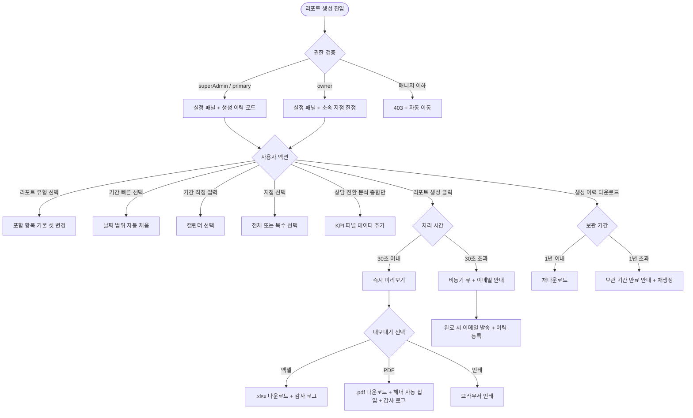

# SCR-099 리포트 생성 페이지

## 1. 화면 메타 정보

이 문서는 리포트 생성 페이지에 대한 자기완결형 요구사항 정의서입니다. 다른 문서를 함께 보지 않아도 이 한 장만으로 이 화면에 들어가는 모든 영역, 모든 버튼, 모든 다운로드 동작, 모든 권한, 모든 예외 처리, 그리고 이 화면을 지탱하는 운영 정책까지 전부 이해하고 구현할 수 있도록 작성합니다.

| 항목 | 값 |
|---|---|
| 작성일 | 2026-05-22 |
| 버전 | v1.0 |
| 상태 | 최신 통합본 반영 (정합화 완료) |
| 도메인 | D10 본사관리 |
| 화면 ID | SCR-099 |
| 화면명 | 리포트 생성 |
| 화면 유형 | 분석/리포트 화면 |
| 라우트 (URL) | `/reports` |
| 플랫폼 | 데스크톱(기본), 태블릿 |
| 우선순위 | P0 (출시 필수) |
| 기능코드 | HQ-07 |
| 계약코드 | HQ-07, RPT-01 ~ RPT-06 |
| 계약 상태 | 계약 범위 본기능 |
| 부모 기능 prefix | HQ |
| Lv1 코드 | HQ-07 |
| Lv2 / Lv3 세분화 | HQ-07-01 ~ HQ-07-09 (리포트 유형, 조회 기간, 대상 지점, 포함 항목, 상담 전환 분석, 리포트 생성, 미리보기, 내보내기, 생성 이력) |
| 연계 화면 | SCR-094 KPI대시보드, SCR-095 KPI프리뷰보드, SCR-093 지점성과리포트, SCR-097 감사로그 |
| 호출 다이얼로그 | 없음 (인라인 처리) |

## 2. 화면 개요와 목적

리포트 생성은 원하는 기간과 항목을 선택하여 운영 보고서를 생성하고 엑셀 또는 PDF로 내보내는 화면입니다. 정기 보고, 경영진 보고, 고객 제출용 등 다양한 목적의 리포트를 맞춤 생성하며, 상담 전환 분석 옵션을 활성화하면 KPI 퍼널(SCR-094)과 연계된 리드→상담→등록 단계별 전환 데이터까지 포함됩니다. 본사 임원 월간 보고용·Owner(지점장) 분기 성과 보고용·외부 감사 자료 제출용 리포트의 단일 진입점입니다.

이 화면이 다루는 운영 흐름은 매우 다양합니다. 본사 슈퍼관리자가 매월 초 임원 보고를 준비할 때는 "종합" 유형 + 지난 달 + 전체 지점을 선택해 PDF를 다운로드하여 임원 이메일로 발송합니다. Owner(지점장)이 분기 성과 보고를 만들 때는 "매출" 유형 + 이번 분기 + 소속 지점으로 PDF를 생성해 본사에 제출합니다. 연간 KPI 결산에서는 "종합" + 이번 해 + 전체 지점에 작년 대비 비교 포함 옵션을 선택해 임원 보고용 1페이지 요약을 생성합니다. 외부 감사 자료 준비에서는 "매출" + 특정 기간 범위를 CSV로 다운로드해 감사 기관에 제출하며, 다운로드 행위 자체가 감사 로그에 기록됩니다. 상담 전환 분석 옵션을 켜면 KPI 퍼널 데이터를 토대로 리드 유입 → 상담 완료 → 회원 등록 단계별 전환율과 유입경로별 전환율이 리포트에 추가됩니다. 과거 리포트 재다운로드에서는 생성 이력에서 이전 리포트를 동일 권한 범위 내에서 재다운로드할 수 있습니다. 수동 생성 + 자동 생성 병행으로 월/분기/연간 정기 자동 생성과 필요 시 수동 생성이 함께 운영됩니다.

따라서 이 화면은 단순한 리포트 다운로드 도구가 아니라, 본사 의사결정에 필요한 모든 보고 자료를 생성하는 통합 리포팅 화면으로 동작해야 합니다.

## 3. 진입 경로와 인접 화면

리포트 생성에 진입하는 경로는 다음과 같습니다.

첫 번째 경로는 사이드바입니다. 본사관리 메뉴 아래 "리포트" 또는 "리포트 생성" 항목을 클릭하면 진입합니다.

두 번째 경로는 KPI 대시보드(SCR-094)에서 추이 차트 또는 비교 테이블 우측의 "리포트로 내보내기" 링크 클릭입니다.

세 번째 경로는 지점 성과 리포트(SCR-093)의 [PDF 다운로드] 버튼이 분석 화면의 일부 데이터만 다운로드하고, 종합 리포트가 필요할 때 SCR-099로 이동하는 경우입니다.

네 번째 경로는 매월/분기/연간 자동 생성 리포트가 완료되어 이메일로 받은 운영자가 본 화면의 생성 이력에서 재다운로드할 때입니다.

다섯 번째 경로는 알림 센터의 "월간 리포트 자동 생성 완료" 알림 클릭입니다.

이 화면에서 빠져나가는 인접 화면은 SCR-094 KPI 대시보드(상담 전환 분석 원천), SCR-095 FC 보드, SCR-093 지점 성과 리포트, SCR-097 감사 로그(다운로드 이력 추적)입니다.

## 4. 레이아웃과 UI 구성

리포트 생성은 위에서 아래로 흐르는 세로형 레이아웃이며, 좌측 또는 상단에 설정 패널이 있고 우측 또는 하단에 미리보기가 있습니다. 화면은 위에서부터 다음과 같이 구성됩니다.

가장 위에는 페이지 헤더가 있습니다. 헤더 좌측에는 "리포트 생성" 페이지 타이틀이 표시됩니다. 헤더 우측에는 새로고침 버튼이 있고, 권한이 없는 매니저 이하에게는 화면 진입 자체가 차단됩니다.

페이지 헤더 바로 아래에는 리포트 설정 패널이 있습니다. 첫 줄에 리포트 유형 선택(매출 / 회원 현황 / 출석 / 수업 / 종합 5종)이 있고, 둘째 줄에 조회 기간 선택(날짜 범위 직접 입력 또는 빠른 선택: 이번 주 / 이번 달 / 이번 분기 / 이번 해), 셋째 줄에 대상 지점 선택(전체 또는 특정 지점 복수 선택), 넷째 줄에 포함 항목 선택(체크박스로 세부 항목)이 배치됩니다. 다섯째 줄에는 상담 전환 분석 옵션(체크박스)이 있고, "종합" 유형에서만 활성화됩니다. 활성 시 SCR-094 KPI 퍼널 데이터를 토대로 단계별 전환율과 유입경로별 전환율이 리포트 미리보기에 추가 표시되고 CSV/엑셀 내보내기 시 전환 분석 컬럼이 함께 포함됩니다. 마지막 줄에는 [리포트 생성] 버튼이 배치됩니다.

리포트 설정 패널 아래에는 리포트 미리보기 영역이 있습니다. [리포트 생성] 버튼을 누르면 처리 중 표시가 나오고, 완료 후 미리보기 본문이 표시됩니다. 다중 페이지 리포트인 경우 페이지 네비게이션(이전/다음/페이지 번호)이 함께 노출됩니다.

미리보기 우측 또는 헤더 영역에는 내보내기 버튼이 있습니다. [엑셀 다운로드], [PDF 다운로드], [인쇄] 3개 버튼이 배치되며, 다운로드 권한이 없으면 hidden입니다.

페이지 가장 아래에는 생성 이력 영역이 있습니다. 최근 생성한 리포트 목록(날짜, 유형, 생성자, 다운로드 버튼)이 테이블 형태로 표시되며, 수동/자동 생성 구분 배지가 함께 표시됩니다. [다운로드] 버튼은 동일 권한 범위 내에서 재다운로드 가능합니다.

Owner(지점장)은 자기 지점 데이터만 선택 가능하며, 슈퍼관리자는 전 지점 선택 가능합니다.

## 5. 탭 구성과 탭별 동작

이 화면은 별도의 탭 구조를 가지지 않습니다. 모든 설정 패널과 미리보기가 한 화면에 표시됩니다.

리포트 유형 5종(매출 / 회원 현황 / 출석 / 수업 / 종합)은 라디오 버튼 또는 드롭다운으로 선택되며, 유형에 따라 포함 항목의 기본 체크박스 셋이 자동 변경됩니다. 매출 유형은 매출 지표 위주, 회원 현황 유형은 회원 통계 위주, 출석 유형은 출석 통계 위주, 수업 유형은 수업 운영 위주, 종합 유형은 모든 영역이 기본 체크됩니다.

상담 전환 분석 옵션은 "종합" 유형에서만 활성화 가능합니다.

기간 빠른 선택(이번 주/이번 달/이번 분기/이번 해)은 직접 입력과 동시에 사용할 수 있습니다.

## 6. 버튼·아이콘·링크 액션 전체 정의

이 화면에 등장하는 모든 클릭 가능한 요소를 빠짐없이 정의합니다.

리포트 유형 선택 라디오 버튼은 즉시 포함 항목 기본 체크박스 셋을 변경합니다. "종합" 선택 시 상담 전환 분석 옵션이 활성화됩니다.

조회 기간 빠른 선택 토글(이번 주/이번 달/이번 분기/이번 해)은 즉시 날짜 범위를 채우고 직접 입력 필드는 비활성화됩니다. 빠른 선택을 해제하면 직접 입력으로 돌아갑니다.

날짜 범위 직접 입력은 시작일과 종료일을 캘린더에서 선택합니다. 시작일 > 종료일이면 "시작일이 종료일보다 늦습니다" 인라인 오류가 표시됩니다.

대상 지점 멀티 셀렉트는 전체 또는 특정 지점 복수 선택입니다. 슈퍼관리자는 모든 지점 선택 가능, Owner(지점장)은 자기 지점 고정입니다.

포함 항목 체크박스는 세부 항목을 추가/제외합니다. 유형 변경 시 기본 셋이 자동 적용되지만 사용자가 추가 조정 가능합니다.

상담 전환 분석 체크박스는 "종합" 유형에서만 활성화되며, 활성 시 KPI 퍼널 데이터가 리포트에 포함됩니다.

[리포트 생성] 버튼은 처리 중 표시 후 미리보기를 렌더링합니다. 처리 중에는 [취소] 버튼이 노출되며, 클릭 시 생성이 중단되고 미리보기가 초기화됩니다. 처리 시간이 30초 초과되면 자동으로 비동기 처리로 전환되어 "대용량 리포트는 생성 완료 후 이메일로 발송됩니다" 안내가 표시됩니다.

[엑셀 다운로드] 버튼은 .xlsx 파일을 다운로드합니다. [PDF 다운로드]는 .pdf 파일을 다운로드하며 헤더에 지점명·기간·생성 일시·생성자·리포트 유형이 자동 삽입됩니다. [인쇄]는 브라우저 인쇄 다이얼로그를 띄우며 차트가 SVG → PNG로 변환됩니다. 변환 실패 시 1회 재시도 후 차트 없이 텍스트만 인쇄됩니다.

생성 이력 테이블의 [다운로드] 버튼은 과거 리포트를 재다운로드합니다. 동일 권한 범위 내에서만 가능하며, 보관 기간 1년이 경과한 리포트는 "보관 기간 만료" 안내와 재생성 안내가 표시됩니다.

미리보기 페이지 네비게이션(다중 페이지 시)은 페이지 이동을 처리합니다.

이메일 자동 발송 링크(자동 생성 리포트의 알림 토스트)는 클릭으로 즉시 다운로드 시작입니다. 링크가 만료(보관 1년 초과)되면 "다운로드 링크가 만료되었습니다" 안내와 이력에서 재다운로드 안내가 표시됩니다.

모든 다운로드 액션은 감사 로그에 기록됩니다.

일일 다운로드 한도(50건)에 도달하면 [다운로드] 버튼이 비활성화되고 "일일 다운로드 한도를 초과했습니다" 안내가 표시되며 리셋 시각이 안내됩니다.

모든 버튼은 클릭 후 응답이 돌아오기 전까지 자동으로 비활성화됩니다.

## 7. 호출되는 모달 동작

리포트 생성 화면에서는 별도의 다이얼로그가 호출되지 않습니다. 모든 액션은 인라인 동작 또는 토스트로 처리됩니다.

대용량 리포트(30초 초과) 비동기 처리 안내는 인라인 모달 형태("대용량 리포트는 생성 완료 후 이메일로 발송됩니다") + [확인] 버튼으로 표시되며 사용자가 확인하면 큐로 전환됩니다.

다운로드 한도 초과 안내도 모달이 아닌 인라인 토스트로 처리됩니다.

이력 파일 만료 안내도 인라인 안내로 표시됩니다.

## 8. 토스트와 확인 팝업과 알럿

리포트 생성에서 발생하는 알림성 UI는 다음과 같습니다.

성공 토스트는 "리포트 생성이 완료되었어요", "엑셀 다운로드가 완료되었어요", "PDF 다운로드가 완료되었어요" 같은 결과 문구를 표시합니다. 자동 생성 리포트가 이메일로 발송되면 "월간 리포트가 이메일로 발송되었어요" 안내가 표시됩니다.

진행 토스트는 리포트 생성 중에 "{유형} 생성 중... {진행률}%" 진행률을 보여줍니다. 30초 초과 시 비동기 안내 모달로 전환됩니다.

실패 토스트는 "리포트 생성에 실패했습니다", "엑셀 생성에 실패했습니다", "PDF 생성에 실패했습니다", "선택 조건에 해당하는 데이터가 없습니다", "최대 5년까지 조회 가능합니다" 같은 문구와 보조 액션을 표시합니다.

확인 팝업은 사용되지 않으며 모든 액션이 인라인으로 처리됩니다.

알럿은 매니저 이하 권한자가 직접 URL로 접근했을 때 표시됩니다. "이 화면에 접근할 권한이 없습니다. 3초 후 대시보드로 이동합니다"가 표시되고 SCR-090으로 자동 이동됩니다.

상담 전환 분석 원천 데이터 미연동 시 "상담 전환 분석 데이터를 불러올 수 없습니다" 안내와 함께 옵션 자동 비활성화가 일어납니다.

일일 다운로드 한도(50건) 초과 시 "일일 다운로드 한도(50건)를 초과했습니다 - 자정 이후 다시 시도해주세요" 안내가 표시됩니다.

대용량 리포트(30초 초과) 비동기 안내 모달은 사용자 확인 후 큐 등록되며 완료 시 이메일이 발송됩니다.

작년 비교 데이터 없음(오픈 첫 달) 시 비교 컬럼이 "-"로 표시되고 호버 시 "작년 데이터 없음" 툴팁이 나옵니다.

이력 파일 만료(1년 초과) 시 "해당 리포트는 보관 기간이 만료되었습니다" 안내와 재생성 유도가 함께 표시됩니다.

비동기 이메일 링크 만료(보관 1년 초과) 시 "다운로드 링크가 만료되었습니다" 안내와 이력에서 재다운로드 안내가 표시됩니다.

## 9. 데이터 흐름과 외부 연동

이 화면은 여러 도메인의 데이터를 통합하여 리포트로 생성하는 화면이므로 데이터 흐름이 복잡합니다.

화면 진입 시점에는 생성 이력 API가 호출되어 최근 1년 이내 생성된 리포트 목록이 표시됩니다.

[리포트 생성] 버튼 클릭 시 리포트 생성 API(`POST /api/reports/generate`)가 호출됩니다. 요청에는 리포트 유형, 기간, 대상 지점, 포함 항목, 상담 전환 분석 옵션이 포함되며, 응답으로 미리보기 데이터가 반환됩니다.

상담 전환 분석 옵션이 활성화되면 KPI 센터(HQ-03) 퍼널 데이터를 출처로 사용하여 리드 유입 → 상담 완료 → 회원 등록 단계별 전환율과 유입경로별 전환율이 추가 집계됩니다.

다운로드는 동기/비동기 처리로 분리됩니다. 30초 이내 처리 가능한 리포트는 즉시 다운로드되고, 30초 초과 시 비동기 큐로 등록되어 완료 시 이메일로 다운로드 링크가 발송됩니다.

다운로드 행위는 감사 로그(SCR-097)에 actor·필터 조건·생성 일시로 자동 기록됩니다.

PDF 생성 시 헤더에 지점명·조회 기간·생성 일시·생성자명·리포트 유형이 자동 삽입됩니다.

월간 리포트 자동 생성 배치는 매월 1일 00:00에 실행되어 전월 데이터 기준 종합 리포트가 자동 생성되며, superAdmin 및 해당 지점 owner에게 이메일로 자동 발송됩니다.

분기 리포트 자동 생성 배치는 분기 종료 익일 00:00에 실행되어 분기 데이터 기준 종합 리포트가 자동 생성됩니다.

연간 리포트 자동 생성 배치는 매년 1월 1일 00:00에 실행되어 전년도 데이터 기준 연간 리포트가 자동 생성되고 임원 보고용 1페이지 요약이 포함됩니다.

이메일 자동 발송은 자동 생성 완료 후 superAdmin 및 해당 지점 owner에게 발송되며, 이메일 API와 연계됩니다.

대용량 비동기 생성은 리포트 생성 30초 초과 감지 시 비동기 큐로 자동 전환되어 완료 시 이메일·앱 알림이 발송됩니다.

이력 자동 삭제 배치는 매월 1일 01:00에 실행되어 생성 1년 경과 리포트 이력이 자동 삭제됩니다.

감사 로그 자동 기록은 리포트 생성·다운로드·이메일 발송 모든 이벤트에서 작업자·리포트 유형·기간·timestamp가 기록됩니다.

일일 다운로드 한도 리셋은 매일 00:00에 계정별 일일 다운로드 카운터를 초기화합니다.

작년 대비 비교 자동 계산은 리포트 생성 시 매출·회원·출석 3종 작년 동기 대비 증감이 자동 산출됩니다.

자동 생성 배치 실패 알림은 배치 3회 실패 시 관리자에게 Slack/SMS 알림이 발송됩니다.

화면에서 호출하는 주요 API 엔드포인트는 다음과 같습니다. 리포트 생성 `POST /api/reports/generate`, 생성 이력 조회 `GET /api/reports/history`, 다운로드 `GET /api/reports/:id/download?format=xlsx|pdf`.

## 10. 화면 상태와 예외 처리

리포트 생성은 다음 상태들을 가질 수 있습니다.

초기 상태에서는 리포트 설정 패널만 표시되고 미리보기는 비어 있습니다.

생성 중 상태는 [리포트 생성] 클릭 후 처리 중일 때이며, 처리 표시와 [취소] 버튼이 함께 노출됩니다.

생성 완료 상태는 미리보기가 표시되고 내보내기 버튼이 활성화된 상태입니다.

비동기 처리 안내 상태는 30초 초과 시이며 "대용량 리포트는 이메일로 발송됩니다" 안내 모달이 표시됩니다.

내보내기 처리 중 상태는 다운로드 버튼 클릭 후 처리 중일 때이며, 버튼이 비활성화됩니다.

데이터 없음 상태는 선택 조건에 해당하는 데이터가 0건일 때이며, "선택 조건에 해당하는 데이터가 없습니다" 안내가 표시됩니다.

권한 부족 상태는 매니저 이하 권한자가 직접 URL로 접근했을 때이며, 안내 후 자동 이동됩니다.

상담 전환 분석 옵션 비활성 상태는 "종합" 유형이 아닌 경우 또는 원천 데이터 미연동 시이며, 체크박스가 비활성됩니다.

이력 파일 만료 상태는 보관 1년 초과 리포트가 이력에 표시된 경우이며, "보관 기간 만료" 배지와 재생성 안내가 함께 표시됩니다.

일일 다운로드 한도 초과 상태는 50건 초과 시이며, 다운로드 버튼이 비활성화됩니다.

오류 상태는 API 실패 시이며 토스트와 재시도 버튼이 제공됩니다.

자동 생성 진행 상태는 매월/분기/연간 자동 생성 배치가 실행 중인 짧은 순간입니다.

예외 케이스별 처리는 다음과 같습니다.

매니저 이하 접근 시도(URL 직접 접근 포함) 시 403 + "접근 권한이 없습니다" 안내로 차단됩니다.

선택 조건에 해당 데이터 없음 시 "선택 조건에 해당하는 데이터가 없습니다" 안내와 조건 수정 유도가 표시됩니다.

리포트 생성 중 [취소] 클릭 시 생성이 중단되고 미리보기가 초기화됩니다.

대용량 리포트(50MB 또는 30초 초과) 시 비동기 생성으로 전환되어 완료 시 이메일·알림이 발송됩니다.

작년 대비 데이터 없음(오픈 첫 달) 시 연간 비교 컬럼이 "-"로 표시되고 호버 시 "작년 데이터 없음" 툴팁이 나옵니다.

owner가 타 지점 데이터 포함 시도 시 대상 지점 선택에서 자기 지점만 선택 가능하고 타 지점은 비활성됩니다.

자동 생성 배치 실패 시 관리자 알림이 발송되고 사용자에게는 수동 생성이 안내됩니다.

이메일 발송 실패 시 이력에 "발송 실패" 배지가 표시되고 재발송 버튼이 제공됩니다. 재시도 3회 후 실패 시 로그가 기록됩니다.

리포트 이력 재다운로드 권한 없음(생성자와 다른 역할) 시 동일 권한 범위 내 다운로드만 허용됩니다.

상담 전환 분석 원천 데이터 없음 시 "상담 전환 분석 데이터 없음" 안내와 옵션 자동 비활성이 일어납니다.

다운로드 한도 초과(일일 50건) 시 "일일 다운로드 한도를 초과했습니다" 안내와 한도 리셋 시각이 안내됩니다.

인쇄 시 차트 렌더 실패 시 SVG → PNG 변환 1회 재시도 후 실패 시 차트 없이 텍스트만 인쇄됩니다.

리포트 생성 API 실패 시 "리포트 생성에 실패했습니다" 토스트와 Sentry 에러 + 온콜 알림이 발송됩니다.

엑셀 생성 실패 시 "엑셀 생성에 실패했습니다" 토스트와 재시도 1회 후 실패 시 로그가 기록됩니다.

PDF 생성 실패 시 동일하게 처리되며 재시도 후 실패 시 로그가 기록됩니다.

재다운로드 이력 파일 만료(1년 초과) 시 "보관 기간이 만료되었습니다" 안내와 재생성 유도가 표시됩니다.

감사 로그 기록 실패 시 사용자에게는 미표시(다운로드는 완료)되고 재시도 3회 후 실패 시 알림이 발송됩니다.

비동기 이메일 링크 만료 시 "다운로드 링크가 만료되었습니다" 안내와 이력 재다운로드 유도가 표시됩니다.

기간 미설정 또는 시작일 > 종료일 시 인라인 오류로 차단됩니다.

## 11. 권한별 처리

이 화면은 권한에 따라 진입 가능 여부와 가능한 액션이 달라집니다.

superAdmin와 primary는 전체 지점 리포트를 모든 유형으로 생성·내보내기·이력 조회 가능합니다.

Owner(지점장)은 소속 지점 리포트만 생성 가능하며 자기 지점 데이터에 한정해서 내보내기 가능합니다. 대상 지점 선택에서 자기 지점만 선택 가능합니다.

매니저(manager) 이하 권한자(fc, trainer, staff, front, readonly)는 본 화면에 접근할 수 없습니다. 사이드바에 메뉴가 보이지 않고, 직접 URL 접근 시 안내 후 자동 이동됩니다.

자동 생성 리포트는 superAdmin과 해당 지점 owner에게 이메일로 자동 발송됩니다.

재다운로드는 동일 권한 범위 내에서만 가능합니다. 생성자와 다른 역할이 접근하면 권한이 일치하지 않는 부분에 대해 차단됩니다.

일일 다운로드 한도는 계정당 50건으로 제한됩니다. 보안 정책에 따른 정책입니다.

권한이 부족해서 액션이 차단된 경우의 사용자 경험은 일관됩니다. 첫째, 사이드바 메뉴가 숨겨집니다. 둘째, 직접 URL 접근 시 자동 이동됩니다. 셋째, 백엔드는 권한 검증을 엄격하게 수행합니다. 넷째, 모든 우회 시도와 다운로드 행위가 감사 로그에 기록됩니다.

## 12. 메인 흐름

리포트 생성의 핵심 동작 흐름입니다.



## 13. 에러와 예외 흐름

```mermaid
flowchart TD
    A([액션 트리거]) --> B{서버 응답}
    B -->|매니저 이하 접근| C[403 + 자동 이동]
    B -->|데이터 0건| D["선택 조건 데이터 없음" 안내]
    B -->|리포트 생성 중 취소| E[생성 중단 + 미리보기 초기화]
    B -->|대용량 50MB 또는 30초 초과| F[비동기 처리 + 이메일 안내 모달]
    B -->|작년 비교 데이터 없음| G[비교 컬럼 "-" + 툴팁]
    B -->|owner 타 지점 포함 시도| H[자기 지점만 선택 가능]
    B -->|자동 생성 배치 실패| I[관리자 알림 + 수동 생성 안내]
    B -->|이메일 발송 실패| J[이력 "발송 실패" 배지 + 재발송 + 재시도 3회]
    B -->|재다운로드 권한 없음| K[권한 범위 내 다운로드만 허용]
    B -->|상담 전환 분석 원천 없음| L["상담 전환 분석 데이터 없음" + 옵션 자동 비활성]
    B -->|일일 다운로드 한도 초과| M["한도 초과" + 리셋 시각]
    B -->|인쇄 차트 렌더 실패| N[SVG→PNG 재시도 + 폴백]
    B -->|리포트 생성 API 실패| O[토스트 + Sentry + 온콜]
    B -->|엑셀/PDF 생성 실패| P[토스트 + 재시도 1회]
    B -->|이력 파일 만료 1년 초과| Q["보관 기간 만료" + 재생성]
    B -->|감사 로그 기록 실패| R[사용자 미표시 + 재시도 3회]
    B -->|비동기 이메일 링크 만료| S["링크 만료" + 이력 재다운로드]
    B -->|시작일 > 종료일| T[인라인 오류 + API 호출 차단]
```

## 14. 핵심 디자인 요청사항

이 화면이 본사 운영자에게 잘 작동하려면 다음 디자인 원칙이 시각적으로 명확해야 합니다.

리포트 설정 패널은 좌측 또는 상단에 고정되어 사용자가 미리보기를 보면서도 설정을 다시 변경할 수 있도록 합니다. 5종 리포트 유형은 라디오 버튼 또는 카드 형태로 시각적으로 분리되고 선택된 유형이 강조됩니다.

조회 기간 빠른 선택 토글은 4개 옵션이 가로로 배치된 세그먼트 컨트롤이고, 직접 입력 필드와 함께 사용 가능합니다.

대상 지점 멀티 셀렉트는 체크박스 리스트 또는 멀티 셀렉트 드롭다운으로 표시되며 Owner(지점장)은 자기 지점만 노출됩니다.

상담 전환 분석 옵션은 "종합" 유형에서만 활성화되고, 비활성 시 회색 처리되어 클릭 가능 여부가 명확합니다.

[리포트 생성] 버튼은 primary 컬러로 강조되고 처리 중에는 스피너와 진행률이 함께 표시됩니다. 30초 초과 시 부드럽게 비동기 안내 모달로 전환됩니다.

미리보기 영역은 실제 PDF/엑셀과 유사한 형태로 렌더링되어 사용자가 다운로드 전에 결과를 정확히 확인할 수 있습니다. 페이지 네비게이션이 명확하게 표시됩니다.

내보내기 버튼(엑셀/PDF/인쇄)은 아이콘과 함께 배치되어 형식이 시각적으로 인식됩니다.

생성 이력 테이블은 수동/자동 생성 배지로 구분되고, 보관 만료 임박 행은 노랑 톤으로 강조됩니다.

다운로드 한도 초과 안내는 인라인 안내로 명확히 표시되고 리셋 시각이 카운트다운으로 표시될 수 있습니다.

진행 스피너와 로딩 스켈레톤은 본사 대시보드와 동일한 톤으로 통일됩니다.

자동 생성 리포트 이메일 발송 완료 알림은 친근한 일러스트와 함께 표시되어 운영자가 자연스럽게 인지할 수 있습니다.

모바일/태블릿에서는 설정 패널과 미리보기가 세로로 쌓이고, 미리보기는 축소된 형태로 표시됩니다.

## 15. 운영 정책 (이 화면에 연결된 부분)

리포트 생성은 본사 보고 자료의 단일 진입점이므로 운영 정책을 풀어 적습니다.

매니저 이하 계정은 본 화면 접근이 차단됩니다. 보안 정책에 따른 정책입니다.

Owner(지점장)은 본인 소속 지점(`branchId`) 데이터로만 리포트를 생성할 수 있습니다.

엑셀 다운로드는 현재 미리보기 페이지와 무관하게 선택 조건 전체 데이터를 내려받습니다. 이는 운영자가 화면에서 본 그대로 보고서를 만들 수 있게 하기 위한 정책입니다.

상담 전환 분석 옵션이 활성화되면 KPI 센터(HQ-03) 퍼널 데이터를 출처로 사용합니다.

생성된 리포트는 일정 기간(1년) 생성 이력에 보관되며 동일 권한 범위 내에서 재다운로드 가능합니다.

리포트 생성·다운로드는 감사 로그(SCR-097)에 기록됩니다. 이는 외부 정보 유출 추적을 위한 정책입니다.

PDF·인쇄 출력 시 헤더에 지점명·기간·생성 일시·생성자가 자동 삽입됩니다.

월간 리포트는 매월 1일 00:00에 전월 데이터 기준으로 자동 생성됩니다.

분기 리포트는 분기 종료 익일 00:00에 자동 생성됩니다.

연간 리포트는 매년 1월 1일 00:00에 전년도 기준으로 자동 생성됩니다.

자동 생성 리포트는 superAdmin 및 해당 지점 owner에게 이메일로 자동 발송됩니다.

임원 보고용 한 페이지 요약은 "종합" 유형 + 연간/분기 기간 선택 시 옵션으로 제공됩니다.

작년 동기 대비 비교는 매출·회원·출석 3종 지표에 적용됩니다.

리포트 생성 이력 보관 기간은 1년이며 1년 경과 이력은 자동 삭제됩니다.

일일 다운로드 한도는 계정당 50건으로 제한됩니다(보안 정책).

수동 생성 리포트와 자동 생성 리포트는 이력에서 구분 표시됩니다("수동"/"자동" 배지).

상담 전환 분석 옵션은 "종합" 유형에서만 활성화 가능합니다.

다중 지점 선택 시 리포트 내 지점별 비교 섹션이 자동 추가됩니다.

PDF 헤더 자동 삽입 항목은 지점명·조회 기간·생성 일시·생성자명·리포트 유형으로 정해져 있습니다.

리포트 생성 소요 시간이 30초 초과 시 비동기 처리로 자동 전환됩니다.

CSV 내보내기는 엑셀과 동일 데이터 소스이며 헤더 행이 포함됩니다.

본사-지점 권한 분리 정책상 슈퍼관리자는 전 지점 리포트 생성, Owner(지점장)은 소속 지점만, 매니저 이하는 접근 불가입니다.

자동 생성 배치 실패 알림은 배치 3회 실패 시 관리자에게 Slack/SMS 알림이 발송됩니다.

본사 정기 보고용 리포트와 외부 감사용 리포트는 같은 화면에서 생성되지만, 외부 제출용 자료의 다운로드는 별도 감사 로그 메타 감사가 적용되어 추적성이 강화됩니다.

이상의 모든 정책은 이 화면을 구현하고 운영하는 사람이 별도 문서 없이 이 한 장만 보면 이해할 수 있도록 풀어 적었습니다. 정책이 바뀌면 이 문서가 함께 갱신되어야 하며, 코드 변경과 정책 변경은 항상 짝지어 진행됩니다.
